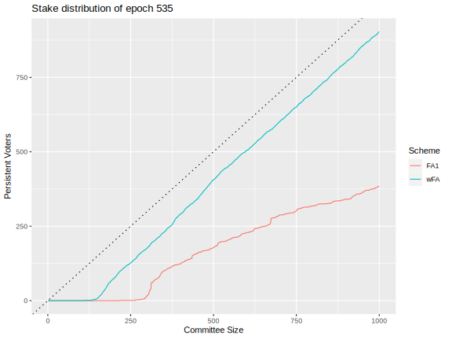

# Leios logbook

## 2025-03-02

### Formal methods

Started work on the trace verifier in Agda
- Adding decidability to the propositions used in the relational specification of Short Leios Protocol, which allows to generate execution traces without proof obligations (proof by computation), an idea that was successfully applied in the [Streamlet](https://github.com/input-output-hk/formal-streamlet/) formalization.

## 2025-02-27

### Analysis of simulations at tag `leios-2025w09`

The folder [analysis/sims/2025w09/](analysis/sims/2025w09) contains the artifications of analyzing the Haskell and Rust simulations at tag `leios-2025w09`. Notable outcomes follow . . .

1. The ELT ("extract/load/transform") workflow for processing simulation data was refactored so that complete logs from both simulations are organized for simpler querying.
2. The Rust simulator was temporarily modified to generate IBs of fixed size, which is what the Haskell simulator does, so that output from the two can be compared.
3. Discrepancies between congestion metrics for two simulators were partially resolved.
4. Analyses of the elapsed time from IB generation to receipt at the various nodes and also of time-in-flight over node-to-node links were developed.
5. It appears that both network bandwidth and CPU bottlenecks play a role in congestion at very high transaction throughput, but this needs more detailed investigation.

### Initial sketch for protocol dashboard

We are considering developing an interactive "protocol dashboard" web application for Leios that would have the following functionality:

1. Set protocol parameters (block rates, voting, pipeline length, etc.)
2. Set stake distribution (uniformity, number of pools, etc.)
3. View plots of performance
    - Efficiency of block arrival within protocol limits
    - Duplication of transactions
    - Rewards for various Leios operations
    - Compute resources
4. View plots of security
    - Failure to reach quorum
    - Adversary forges a certificate
    - Adversarial block included on preferred chain


## 2025-02-26

### Rust simulation

Updated bandwidth simulation so that messages from different miniprotocols can be sent in parallel. Bandwidth is evenly divided between each miniprotocol, and within a miniprotocol, messages are sent one-at-a-time.

Added support for a `simulate-transactions` setting (default to `true`). When this setting is `false`, the rust simulation will not generate transactions randomly and will not propagate them across the network. It will generate IBs exactly the size of `ib-body-avg-size-bytes`, and RBs with exactly `rb-body-legacy-praos-payload-avg-size-bytes` bytes in the body.

## 2025-02-25

### Rust simulation

Updated the simulation's output to match Haskell more closely.

Corrected the transaction count in the UI, and updated the block view to make it easier to see blocks with dozens of IBs.

## 2025-02-24

### Haskell Simulation

- Fixed IB sortition for IB/slot < 1.
- Reviewed and started integration of block expiration/diffusion-halt proposal.
- Implemented calculation of ideal timings for diffusion and started
  comparing to simulation with idealized config.
  - added `treat-blocks-as-full` config parameter to have blocks behave uniformly wrt network and cpu usage.
  - preliminary results are promising.
    - One complication is that Relay mini-protocol can require either
    3 or 4 latencies to transfer a new block, since headers can be
    requested in either blocking or non-blocking way, depending on
    traffic.

### Rust simulation

Updated bandwidth calculations to not parallelize any requests; all messages are now FIFO. This is still inaccurate, because bandwidth is split between all miniprotocols.

## 2025-02-22

### DeltaQ Update

- extended the [Report](./delta_q/docs/Report%202025-01.md) with `topology-checker` work and findings as well as next steps

## 2025-02-21

### Formal methods

- The formal specification of the Leios protocol has been moved to [ouroboros-leios-formal-spec](https://github.com/input-output-hk/ouroboros-leios-formal-spec/)
- Conformance testing (Short Leios against Short Leios) can be run as described in [running the test suite](conformance-testing/README.md#running-the-test-suite)
- Began surveying network models used by different consensus projects in IO, to build one that can be used for Leios and ideally other projects as well

### Simulation of varied IB production rate

The folder [analysis/sims/2025w08/](analysis/sims/2025w08/) contains scripts and [an analysis](analysis/sims/2025w08/exploration.ipynb) of running the Haskell and Rust simulators for input-block production varying from 1 IB/s to 100 IB/s.

- An ELT workflow was developed for ingesting and processing (via `mongodb`) the raw data from the simulations.
- An R Jupyter notebook is used for analysis and plotting.
- Three bugs ([#207](https://github.com/input-output-hk/ouroboros-leios/issues/207), [#208](https://github.com/input-output-hk/ouroboros-leios/issues/208), and [#209](https://github.com/input-output-hk/ouroboros-leios/issues/209)) were identified during the course of this work.

The Haskell simulation results indicate that network congestion occurs at high IB production rates, causing both the average propagation time and the tail of extremely slow propagation to lengthen.


In the particular scenario that was run (e.g., network topology and protocol parameters), at an production rate of approximately 40 IBs/s the network becomes so congested that the nodes do not receive input blocks in a timely fashion.


### PeerNet simulation

We ran simulation studies using [the Leios version](https://github.com/input-output-hk/leios-peernet/) of [PeerNet](https://github.com/PeerNet/PeerNet) and compared results to similar scenarios run using the Haskell simulator. The two implementations differ enough in their resolution, formulation, and input configurations that a precise comparison is not practical.

- The two simulations have qualitatively similar, but not identical, distributions of block propagation time.
- Both simulations exhibit a breakdown of the Leios protocol when the block production rate is so large that substantial network congestion occurs.

### Rust simulation

Fixed issues #208 and #209 uncovered by Brian's cross-sim comparisons.

Implemented bandwidth usage tracking, controlled by the `bandwidth-bytes-per-second` setting in topologies. Connections without bandwidth configured effectively have infinite bandwidth.

## 2025-02-19

### Rust simulation

Started updating the visualization to look more professional, starting with the blocks view.

## 2025-02-18

### CPS-0018

[CIPS-0018 "Greater Transaction Throughput"](https://github.com/cardano-foundation/CIPs/blob/master/CPS-0018/README.md) has been officially approved and merged into the Cardano Foundation's CIP/CPS repository. This Cardano Problem Statement motivates the need for higher transaction throughput on Cardano and provides evidence for its urgency. It also defines goals for initiatives like Leios, summarizes use cases, and identifies open questions.

### Docker Support for Simulations

Added Docker support for both the Rust and Haskell simulations, making it easier to run and generate simulation traces without setting up the development environment. The Docker images are built using a multi-stage Dockerfile that creates optimized images for both simulations.

Basic usage examples:

```bash
# Run Rust simulation with default settings
docker run -v $(pwd)/output:/output ouroboros-leios/sim-rs:latest

# Run Haskell simulation for 120 seconds
docker run -v $(pwd)/output:/output ouroboros-leios/sim-hs:latest --output-seconds 120
```

See the [Docker Simulation section in README.md](README.md#docker-simulation) for detailed usage instructions, including how to use custom topology files and configuration options.

## 2025-02-16

### DeltaQ Update

The `topology-checker` has been upgraded with a new option to perform a ΔQSD analysis:
it will extract inter-node latencies from the given topology, classify them into near/far components, and use these to build a parameterised ΔQ model.
This model is then fitted against the distribution of minimal completion latencies as obtained with the Dijkstra algorithm, averaging over the distributions obtained by using each node as starting point.
The resulting completion outcome is plotted to the terminal together with the extracted completion latency distribution to give a visual impression of the quality of the model fit.

Learnings from this exercise:

- latencies within the topologies examined (from the topology generator as well as the “realistic” set from the Rust simulation) very clearly consist of differing near/far components (there’s a “knee” in the graphs)
- latency-weighted Dijkstra shortest paths are _extremely long_ in terms of hop count, much longer than I expected (mean 4–5, max 8 for the topology-100; min 8, max 20 for the “realistic” topology)
- composing a ΔQ model as a sequence of some number of near hops (with early exit probabilities) and some number of far hops (also with early exit) yields models that roughly fit the overall shape, which is dominated by the `far` component of latencies, but there always is a significant deviation at low latencies
- the deviation is that observed completion starts out much slower than the model would predict, so the model goes faster first, then “pauses” for 100ms or so, crossing the observed CDF again, then catching up — thereafter the high latency behaviour works out quite well

My hope had been to use a model that can be understood behaviourally, not just statistically, so that the resource usage tracking features of the `delta_q` library could be brought to bear.
**This has not yet been achieved.**
While the timeliness graph can be made to match to some degree, doing this results in a ΔQ expression for which at least I no longer understand the load multiplication factors that should be applied — in other words, how many peer connections are supposedly used at each step of the process.
The remaining part of this week’s plan was to be able to use the fitted model to obtain a formula for creating such models algebraically;
this has been put on hold because it seems easier to just generate a topology with the desired properties and then use the `topology-checker` to get the corresponding ΔQSD model.

In any case, the `topology-checker` now outputs the fitted ΔQSD model in the syntax needed for the `delta_q` web app, so that you can directly play with the results.

## 2025-02-14

### Formal methods

- Added conformance testing client of the executable Short Leios specification that
  is tested against the model using the executable Short Leios specification as well.
- Merged executable specification for Simplified Leios into main

### Haskell simulation

- Updated config defaults for block sizes and timings, PR waiting for
  additional reviews by research.
- Added support for idealized simulation conditions
  - realism features that can be individually dropped:
    - requesting block body from a single peer.
    - tcp congestion window modeling
      - also supports unlimited bandwidth links.
    - mini-protocol multiplexing
  - see data/simulation/config-idealised.yaml
- Started work on comparison to idealised diffusion report.
  - simulation final output includes `raw` field containing the
    accumulated data and simulation parameters.
    - other stats can be computed from this field.
  - implemented extraction of block diffusion cdf for required
    percentiles.
    - TODO: expose it as a command that takes `raw` field as input
  - small gnuplot script to plot multiple cdfs at once (y axis in logscale).

### Rust simulation

- Optimized decoding the CBOR stream in the visualization
- Added total TX count to the visualization's view of blocks
- Added total CPU time to TaskFinished events

## 2025-02-13

### Brainstorming succinct schemes for Leios BLS key registration and witnessing

Recall that we have the following situation/requirements:

- We want to evolve the BLS keys and have forward security.
- We don't want a registration process (commitment) that involves a big message.
- We also don't want the proof of possession to involve a large message.
- Individual votes must be small and contain no redundancy: i.e., we don't want to include a large witness for the proof of possession.

Here's a snapshot of one recent proposal, but much discussion is underway.

- Every 90 days, as part of its operational certificate each SPO includes a commitment to Leios keys: let's say that Leios keys evolve every epoch or KES period, so we'd need 18 or 60 commitments, respectively.  This commitment is only 124 bytes if KZG commitments are used.
- Before the start of a new key evolution period, each SPOs diffuses a message opening their keys for the new period.
  - This message would have to be 316 bytes:
    - 28 bytes for the pool ID
    - 96 bytes for the public key
    - 96 bytes for the opening
    - 2 * 48 = 96 bytes for the proof of possession
  - 316 bytes/pool * 3000 pools = 948 kB would have to be stored permanently, so that syncing from genesis is possible.
    - This is a lot of data to squeeze into RBs.
    - However, It's not clear if it is safe to put it into IBs or a non-RB block.
  - Instead of storing this on the ledger, would could a single SNARK attest to the following?
    - Input is (ID of key evolution period, pool ID, public key)
    - Output is whether the proof of possession exists.
- Certificates are really small because we've already recorded the proofs of possession at the start of the key evolution period.

### Certificate CPU benchmarks as a function of number of voters

In support of the Haskell and Rust simulations, we've benchmarked certificate operations as a function of the number of voters. A realistic distribution of stake is used in these measurements.

| Number of pools | Number of committee seats | Generate certificate | Verify certificate | Weigh certificate |
|----------------:|--------------------------:|---------------------:|-------------------:|------------------:|
|            2500 |                       500 |              63.4 ms |           104.8 ms |           10.6 ms |
|            2500 |                       600 |              71.1 ms |           116.9 ms |           12.0 ms |
|            2500 |                       700 |              77.4 ms |           125.5 ms |           12.3 ms |
|            2500 |                       800 |              83.5 ms |           134.4 ms |           12.8 ms |
|            2500 |                       900 |              88.2 ms |           141.1 ms |           12.4 ms |
|            2500 |                      1000 |              92.5 ms |           144.9 ms |           12.3 ms |

Serialization and deserialization likely also exhibit the same trend.

A recipe for parallelizing parts of the certificate operations has been added to the [Specification for BLS certificates](crypto-benchmarks.rs/Specification.md).

### Rust simulation

Updated event format to more closely match standards:

- Timestamps are in seconds instead of nanoseconds.
- CPU subtasks have a duration attached to the "started" event, and no "finished" event.

Started tracking vote bundle sizes to display in visualization.

Added support for CBOR output (with identical schema to JSON output).

## 2025-02-12

### Added BLS crypto to CI

The CI job [crypto-benchmarks-rs](.github/workflows/crypto-benchmarks-rs.yaml) does the following:

- Runs the tests for the BLS reference implementation
- Runs the BLS vote and certificate benchmarks

### Rust simulation

Minor build fixes (specify a MSRV, use a fixed toolchain version in CI)

Visualization now displays a breakdown of the size of each block, as well as total bytes sent/received by each node.

## 2025-02-11

### Reference implementation and benchmarking BLS certificates

The [BLS benchmarking Rust code for Leios](crypto-benchmarks.rs/) was overhauled and expanded with the following capabilities:

- Reference implementation of every aspect of a viable BLS certificate scheme for Leios.
- Property-based tests providing basic coverage of all functionality.
- Benchmarks for the inputs to the Leios and Haskell, Rust, and DeltaQ simulations.
- CBOR serialization and deserialization of Leios messages.
- Command-line interface (with example) for trying out Leios's cryptography: create and verity votes, certificates, etc.

- Document specifying the algorithms and tabulating benchmark results.

Note that this BLS scheme is just one viable option for Leios. Ongoing work and ALBA, MUSEN, and SNARKs might result in schemes superior to this BLS approach. The key drawback is the need for periodic registration of ephemeral keys. Overall, this scheme provides the following:

- Certificates smaller than 10 kB.
- Certificate generation and verification in 90 ms and 130 ms, respectively.
- Votes smaller than 200 bytes.

### Rust simulation

Added support for `ib-diffusion-strategy` (freshest-first, oldest-first, or peer-order). Unlike the Haskell sim, this doesn't affect EB or vote diffusion; nodes can download an unlimited number of EBs or vote bundles from any given peer.

Added support for `relay-strategy`: it affects TXs, IBs, EBs, votes, and RBs.

## 2025-02-07

### Haskell simulation

- Added support for:
  - Send and Receive Voting stages, rather than just a single Vote stage.
    - See `leios-vote-send-recv-stages` config.
    - If used, should also set `leios-stage-active-voting-slots` to length of
      stage.
  - oldest-first diffusion strategy, and strategy configuration for EBs and
    votes.
    - See `ib-diffusion-strategy`, `eb-diffusion-strategy`, and
      `vote-diffusion-strategy`.
- Added `data/simulation/small` scenario with config for 100 nodes with 2000kBs
  links.
  - The IB size and generation rate is tuned to utilize a third of 2000kBs, as
    Short-Leios targets.
  - One config file for single-stage and one for send-recv voting (also covering
    5 and 20 stage lengths).
  - Other size and timing parameters are mostly the defaults, which should be
    reviewed.
- Used trace and metrics from `small` scenario to investigate simulation
  behaviour.
  - Added more details to block generation and `Sent` events.
  - Fixed block generation so own blocks are considered on-par with validated
    blocks a node received.
  - Made sure an EB cannot be included more than once in the base chain.
  - Confirmed trace shows EBs are regularly included in RBs that are generated
    more than 5s after votes start diffusing.
- Main difference observed between single-stage and send-recv is the former
  shows a longer tail in the CPU usage CDF when simulation is run with unlimited
  cores.

### Reference implementation and benchmarking of Leios cryptography

The Rust benchmarks for Leios cryptography were redesigned and throroughly
revised so that they are a reference implementation for a viable realization of
Leios.

- Implemented the Fait Accompli sortition
- Sortition now uses rational arithmetic instead of quad-precision floats, and
  is independent of machine precision
- Quickcheck tests for all capabilities
- Benchmarks for serialization
- Squeezed more bytes out of the votes and certificate

The package still needs documentation and a few more benchmarks.

### Formal Methods

- Initial conformance testing is setup using quickcheck-dynamic with the
  executable spec of Short Leios as model. Next steps are conformance testing
  the Leios simulators
- Performance improvements of the proofs in the executable spec module

### Refresh of throughput simulator

The
[Cardano througput simulatior](https://www.insightmaker.com/insight/4DU4kmFVCFDaq30ux29PCe/Cardano-Throughput-v0-3)
has been updated with the latest cloud-computing cost model, synchronized with
the assumptions in the
[online Leios cost calculator](https://leios.cardano-scaling.org/cost-estimator/).

### Rust simulation

- Minor fixes to new graph generation strategy
- Planned out a roadmap for visualization work; next steps will be to show more
  about the lifecycle of Leios transactions

## 2025-02-06

### Enhancements to online cost calculator

In response to queries and suggestions, the
[online Leios cost calculator](https://leios.cardano-scaling.org/cost-estimator/)
has been enhanced:

- Users can select costs for either hyperscale providers (like AWS, Azure, and
  GCP) or discount providers (Hetzner, OVH Cloud, etc.).
- Costs default to that of a discount provider.
- Users can optionally amortize ledger storage costs perpetually vs compute a
  first-month snapshot of storage costs.
- Deployments default to a single relay instead of two.
- The disk compression default was reduced to a conservative 50%.

## 2025-01-31

### Formal Methods

- Finalizing executable specifications for Simplified and Short Leios
- Short Leios spec extracted to Haskell for conformance testing

### Haskell Simulation

- `short-leios` sim now also outputs diffusion latency data.
- added support for different IB diffusion stategies (see
  `ib-diffusion-strategy` config field):
  - freshest-first - higher slot number are requested first
  - peer-order - requested in the order the peer announced them.
- added support for Vote (Send) and Vote (Recv) stages, see
  `leios-vote-send-recv-stages` config field.
- Next step: run simulations to evaluate impacts

### Rust Simulation

Added an "organic" topology generator which more closely matches mainnet
topology. It generates "clusters" of colocated stake pools and relays, and uses
stake to determine how connected each relay is.

### DeltaQ update

Wrote a report on the work since Sep’24:
[Report 2025-01.md](./delta_q/docs/Report%202025-01.md)

## 2025-01-30

### Rust Simulation

Talked to stake pool owners and outside experts about what the mainnet topology
actually looks like. Takeaways:

- Most stake pools have more than one relay. I managed to connect to 2312 relays
  across 1278 pools; this only accounts for fully public relays, and many nodes
  have private relays as well.
- Stake pool operators sometimes have multiple pools. When they do, the pools
  are typically colocated and all share the same relays.
- Each relay has a fixed number of outgoing connections controlled by
  configuration. In practice, most relays have ~25 active outgoing connections.
- The p2p protocol ensures that each relay receives some number of incoming
  connections based on stake weight. Relays for smaller pools can have 10-20
  incoming connections, relays for larger pools can have 400+.

## 2025-01-29

### Rust Simulation

The rust sim is now respecting directional "producer" relationships used by
Haskell. A node will only receive block updates from its producers.

Migrated all topologies to the new shared YAML format and deleted all code
related to the old TOML format

## 2025-01-28

### Rust Simulation

Finished visualization for demo. Fixed transactions getting included in both
Leios and Praos blocks. Started tracking redundant/duplicate transactions within
a Leios block.

## 2025-01-27

### Certificate size for "Fiat Accompli" sortition

The Jupyter notebook
[analysis/fiat-accompli.ipynb](analysis/fiat-accompli.ipynb) documents the
certficate-size computation for the Fiat Accompli sortition scheme. This
demonstrates that it is practical to achieve certificates smaller than 20 kB for
Leios.


## 2025-01-26

### Haskell Simulation

- Leios and praos simulations can now read parameters and topologies from disk
  using the agreed upon formats.
- Added `generate-topology` command to output randomly generated topologies
  (given some characteristics).
- Aligned leios sortition to algorithms in sortition benchmarks and technical
  report.
- Discussed IB diffusion protocol and analysis of topologies with DeltaQ team.
- Drafted report on comparison between praos simulation and benchmark cluster,
  average adoption times from simulation are slower but within 10% of measured,
  see PR #171 for details. Note: a review of the simulation parameters is still
  pending.

Nest steps:

- Generate topologies where block producers are behind relays.
- Start work on comparison with idealized diffusion model.
- Run leios simulations configured for higher thoughput.

## 2025-01-24

### Analysis of "Fiat Accompli" sortition

The
["Fiat Accompli" sortition scheme](https://iohk.io/en/research/library/papers/fait-accompli-committee-selection-improving-the-size-security-tradeoff-of-stake-based-committees/)
creates a hybrid committee containing a static, deterministic set of votes
having large stake with a randomized, non-deterministic set of voters with
smaller stake. We analyzed the FA1<sup>F</sup> and wFA schemes, based on the
actual `mainnet` stake distribution for Epoch 535.

| Unique, deterministic voters                             | Votes cast by deterministic voters                     |
| -------------------------------------------------------- | ------------------------------------------------------ |
|  |  |

Having deterministically-chosen voters significantly reduces the size of Leios
certificates because the $\sigma_\text{eid}$ signature (96 bytes each) do not
need to be stored in the certificate for these voters. For example, for the
recommended minimum Leios committee size of 500 votes, under scheme wFA the 406
block-producing nodes with the largest stake would always be included in the
voting committee; approximately 88 voters would be selected at random to
complete each voting committee.

### Rust Simulation

First pass of block-level visualization complete.

## 2025-01-23

### First analysis of downstream impacts of Leios

In order to start answering the question "How much 'heart surgery' will Leios
entail?", we've started assessing the impacts of Leios on downstream ecosystem,
infrastructure, and technical dependencies.

- Logical changes to the ledger and physical changes to node data structures
  will likely affect most indexers, explorers, SDKs, and APIs.
- Leios fees and memory-pool sharding will impact transaction construction and
  serialization by dapps and wallets.
- Although the physical changes such as Input Blocks, Endorser Blocks, votes,
  and certificates may be invisbible to some dapps and wallets, the more complex
  and sophisticated use cases may need to query the physical layer or might
  choose to do so for reasons of performance optimization.
- Conditions of very high throughput (i.e., many transactions per second) may
  necessitate more efficient filtering of ledger events by downstream services
  and applications.
- Applications will need to be aware that a transaction's journey from the
  memory pool to its becoming referenced (as per Leios, via IBs and EBs) by a
  Praos block might be longer than a "pure Praos" journey from the memory pool
  directly into a Praos block.

The extent of the downstream impacts strongly depends upon the APIs that the
node and middleware services provide to consuming services and applications, and
the extent to which those services and applications must interact or choose to
interact with Leios's physical layer. Further analyses and collaborations with
stakeholders will begin to quantify the assessment of downstream effects.

### DeltaQ Update

- thanks to the Haskell simulation CLI now supporting to export the generated
  topology, plus the Rust simulation being able to read that same topology
  format, we can now run both simulations on the same topology (it would be even
  nicer if `cabal ols -- sim` could read a topology file as well)
- now my current ΔQ model for IB diffusion does match (well enough) to both of
  them! Yeehah!
- note that the Rust simulation does not include bandwidth effects while Haskell
  does, which incurs an additional 328ms network delay at each hop (at 1MB/s
  allocated bandwidth)

### Rust Simulation

- Updated existing topology files to bake latencies in, instead of computing on
  the fly based on locations.
- Began putting together a block-level visualization in (addition to the graph
  view). This will be able to show the relationships between the different types
  of blocks (IBs/EBs/RBs), and demonstrate the benefits of Leios.

## 2025-01-22

### DeltaQ Update

- performed new comparison with Haskell simulation based on the JSONL event log
  (added over past two weeks)
  - first verified transmission & validation latencies match parameters used in
    the config to validate the scripts
  - then extracted IB diffusion timings using improved JQ scripts
  - _et violá_: achieving a pretty good match with a reasonable ΔQ expression
    (see `delta_q/comparison_hs.txt`)
- started new comparison with Rust simulation using realistic topology config
  - 3000 nodes and all Leios stages generate a ton of JSONL (8GB to see first EB
    with IBs)
  - filtered only for InputBlock* events
  - added block ID information to `InputBlockGenerated` and
    `InputBlockValidated` events of type `CpuTaskFinished`
  - used these to measure diffusion latencies
  - current finding is that diffusion is _waaay_ quicker than in Haskell,
    completing in under 1sec for 3000 nodes ⟹ pending further investigation

## 2025-01-21

### Rust Simulation

Update simulation output to use "human readable" names from shared topology
format. This should make it easier to compare output from different simulations,
as now we can use common ids.

## 2025-01-19

### Haskell Simulation

- In preliminary results, diffusion latency of praos blocks is closely
  comparable to data obtained from the benchmark cluster. Validation times are
  inferred from closely related timings in the report.
- Short Leios node implementation integrated simulation parameters agreed upon
  with the rust team.
- Reviewed previous PI goal and completed it by including total data transmitted
  per node in the visualization.

## 2025-01-17

### Cryptography benchmarking and progress

We implemented and benchmarked all of the Leios cryptography, as a Rust crate
[leios_crypto_benchmarks](crypto-benchmarks.rs/).

- VRF (prerequisite to each sortition):
  - VRF proving: 240 µs
  - VRF verifying: 390 µs
- Sortition (not including the required VRF evaluation):
  - RB leadership: 0.17 µs/slot
  - IB leadership: 0.17 µs/slot
  - EB leadership: 0.17 µs/pipeline
  - Number of votes: 3.8 µs/pipeline
- BLS
  - Verify the proof of key possession: 1.5 ms/key
  - Generate vote: 280 µs/vote
  - Verify vote: 1.4 ms/vote
  - Generate certificate for a 300-vote quorum: 50 ms/cert
  - Verify certificate for a 300-vote quorum: 90 ms/cert

Overall, we're in pretty good shape:

- The total cryptography for a phase is less than one second CPU, and phases are
  at least 30 seconds long.
- The costly verification of votes and possession can be done as the votes
  arrive.
- The costly certificate operations fit within a slot.

We also made significant progress on clarifying some of the decisions around
vote contents, certificate size, and the framework for cryptographic keys.

- If key management (rotation etc.) is handled outside of the vote data
  structure, then the vote signature could be as small as 192 bytes.
  - If nodes with large amounts of stake were automatically (deterministically)
    included in the committee of voters, then it might be possible to further
    reduce the size of the vote signature.
- The content of the vote (aside from the signature) would be at least another
  64 bytes, but that would be common to all votes in a given election.
- With a 500-vote committee and a quorum of 60% agreement on certifying the EB,
  even a naive certificate aggregation would be 58 kB, which would easily fit in
  a Praos block.
- It may be possible to coordinate key registration with the 36-hour KES
  rotation or the operational certificates.
- It also may be possible to leverate the fact that the Praos VRF uses BLS keys.

### Cryptography sections of technical report

Completed the cryptography-related sections of the first Leios technical report,
incorporating responses to reviewer comments.

- We're going to freeze that content and put our recent and any new
  benchmarking, design proposals, and analyses into future documents (e.g., the
  second technical report) because it doesn't makes sense to destabilize the
  reviewed document by adding unreviewed material, especially as we'll be
  finalizing the report soon.
- We might want to add a disclaimer at the front of the report to the effect
  that it represents a snapshot of our provisional analysis and understanding of
  Leios, and that we expect future work to supercede and perhaps contradict it.

## 2025-01-16

### Rust simulation

Use more granular CPU simulation times. Still need to update the actual values
to match latest estimates.

Fixed a race condition in the simulated clock.

## 2025-01-15

### Rust simulation

Start consuming the new shared configuration file format. Topologies are still
stored in yaml for now.

## 2025-01-13

### Haskell and Rust simulations

- Added shared configuration file format with default parameters under
  `data/simulation/default.yaml`. This does not include the topology.

### Haskell simulation

- Added event log output:
  - `cabal run ols -- sim $sim_name --output-file $output.json` now also writes
    an event log to `$output.log`
  - TODO: parallelize disk writes with other processing.
- Added `short-leios` to possible simulations, parameters are hardcoded atm,
  mostly same as `viz` default but with `sliceLength =
20` to match mainnet
  ranking block interval. Only writes event log for now.
- Progress on syncing input format with rust simulation, to be merged after
  review with rust team.
- Fixed coordination between Relay mini-protocol consumers: `inFlightVar` wasn't
  necessarily respected when requesting bodies.

## 2025-01-07

### Rust simulation

Simulate infinite CPUs, and output CPU events in logs.

## 2025-01-06

### Rust simulation

Added basic simulation of CPU usage/latency. Includes new "lottery won" events
which can be used to identify the start of CPU processing ("generated" events
identify the end).

Every node has 4 simulated cores and takes the same amount of time to run
CPU-bound tasks. (this is configurable per-node). TX validation and RB/IB/EB
generation/validation each take one CPU task. Certificate CPU time is included
as part of RB CPU time, for RBs with a certificate attached. Each vote is
generated/validated as an independent CPU task, running as much in parallel as
possible (and usually saturating all cores).

All vCPU costs were copied from the cost estimator.

## 2025-01-05

### Summary update on DeltaQ

- added MIN / MAX combinators to get best- and worst-case for simulation results
- tried to make sense of those data sets, and failed
  - Rust simulation best case does not match the analytically best behaviour
    conceivable by pure reasoning, the last 5% of nodes take far too long
  - Haskell simulation best case is far too fast; ΔQ expression to match the
    result must assume >200 peers per node and no validation delay
- I (Roland) must admit that this has become quite a frustrating exercise. The
  theory seems nice and reasonable, but it stubbornly refuses to explain the
  simulation results. I don't feel confident pursuing this further regarding
  quick website experiments or extracting realistic resource usage predictions
  due to the above reasons. Perhaps it just isn't applicable to the level of
  detail I am attempting, but to me that would be a red flag in general and it
  sure would mean that offering it to a wider audience has a high potential for
  misleading people. My recommendation is to conclude that this work stream has
  failed.

## 2025-01-03

### Belated summary of discussion and requests during Dec 17 Q&A

- Throughput dashboard
  - Make it into a formal website after cleaning it up
    - It can become a special-purpose web asset
    - Or part of a Leios micro site
  - It is useful as an explainer of the web of tradeoffs involved with Leios and
    Cardano
  - In essence it creates a game and helps folks understand different notions of
    "optimality"
  - ACTION: Sync with Sam on next steps
- How much "heart surgery" will Leios trigger?
  - Ledger changes
  - Data structures
  - Ecosystem around Leios
  - Technical dependencie
  - In order to accelerate the transition to Leios, what downstream work can be
    done in parallel and prior to Leios being completed?
- Can we use Mithril for proofs of equivocation?
  - Helpful to know proof requirements
  - Coordinate with mithril voting
  - What zk variants do we have in mind?
  - ACTION: Brian will create diagram with options and suboptions
- What gets committed by Leios certificates in the Praos blocks?
  - The proof is for availability and correctness of Leios IBs, EBs, and votes
- Elasticity and adaptability of nodes
  - Mempool is like a distributed database
  - Could it be sized to throughput of system?
  - All nodes can make meaningful contribution
    - "Supernodes" vs Raspberry Pis
  - Sharding according to resources
  - Self-regulation system instead of manual tuning
    - Ideally, it would measure and adapt
    - Likely beyond current scope for Leios
  - ACTION: create a ledger of "nice to have" functionality and of potential
    follow-up papers
- How might/do emerging hydra protocols interact with the L1? How will this look
  in the world of leios?
  - Tail protocols
  - ZK rollups in the Hydra heads
  - Align roadmaps and coordinate reuse
  - Share "common DNA" on the proof and network sides
  - What level of isomorphism exists among transactions in the layers?
  - Rollups could use Blob Leios functionality
  - Attend each others' working groups: Midgard, Gummiworms, ZKfold, Mithril
    - For Leios, a new devrel play this role of attending other project's
      meetings
  - ACTION: Nicolas

### Updates to cost dashboard

The cost dashboard was updated with improved input parameters and computations:

- Lengthen phases and reduced EB rate, per analysis in technical report.
- Updated CPU costs for votes and certificates, per analysis in technical
  report.
- Revised IOPS values, based upon empirical data from Cardano nodes operating in
  production.
- Updated Agda code to align with web interface, and cross-checked.

Further updates will require calibration data from the Haskell and Rust
simulations for Leios.

## 2025-01-02

### Benchmarking BLS signatures and aggregate verifications

The construction and verification BLS votes were benchmarked using the Rust
[bls-signatures](https://lib.rs/crates/bls-signatures) package. Note that
aggregate verification speeds the process significantly.

| Operation                            |       CPU time |
| ------------------------------------ | -------------: |
| Signing an item                      | 1.369±0.030 ms |
| Verifying a single item              | 1.662±0.090 ms |
| Verifying an aggregate of 500 items  |    55.3±5.3 ms |
| Verifying an aggregate of 1000 items |    100.±20. ms |


Generic benchmarks for cryptographic operations have provided guidance on the
pros and cons of the prospective voting and certificate schemes, but further
work on estimating CPU resources needed will require detailed implementation of
the prospective voting and certificate schemes. For the time being, the
following values can be used in simulation studies.

- Number of votes: 500
- Quorum: 60%
- Vote size: 250 B / vote
- Certificate size: 75 kB / vote
- Generate vote: 2 ms / vote
- Verify vote: 3 ms / vote
- Generate certificate: 50 ms / certificate + 0.5 ms / vote
- Verify certificate: 50 ms / certificate + 0.5 ms / vote

## 2024-12-27

### Votes and certificates

- Updated size estimates for votes.
- Added CPU time estimates for BLS votes and certificates.
- Wrote technical report sections on BLS and MUSEN certificates.

### Sortition

Analyses of sortition for IBs, EBs, and votes were made and added to the draft
of the first technical report.

- All of the sortition is based on Bernoulli trials for each stake of lovelace.
- A probabilistic analysis shows that splitting stake among many nodes only
  provides a minor benefit in winning the lottery more times.
- The IB lottery is per-slot and limits a node to building a maximum of one IB
  per slot.
  - Careful selection of protocol parameters ensures a high probability of at
    least one IB in each pipeline.
- The EB lottery is per-pipeline and limits a node to building a maximum of one
  EB per pipeline.
  - The formulation of the EB lottery implies that there will always be a
    significant chance that a pipeline contains no EB.
  - Setting protocol parameters so that there is a high probability of an EB in
    a pipeline makes the protocol more susceptible to influence by adversaries
    with significant stake.
  - However, the unevenness in stake distribution or splitting of adversarial
    stake does not exacerbate the situation.
- The pipeline length should be several multiples of the inverse of the
  active-slot coefficient, in order that there is a high probability for an RB
  to be available for an EB certificate.
- The vote lottery can award multiple votes to the same node if they have a lot
  of stake and are luck.
  - Nodes nearly saturated with stake have an appreciable chance of receiving
    several votes.
  - The mathematics and code for determining from the VRF the number of votes a
    node winds is more complex and involves complications to avoid
    floating-point computations.
  - Limiting nodes to a maximum of one vote would likely be safe if the mean
    number of votes is no larger than the effective decentralizations (i.e., the
    number of nodes with appreciable stake) would likely be safe, though it
    might result is larger concentrations of stake having smaller voting
    rewards, and it would greatly simplify the computation of sortition.

## 2024-12-23

### Rust simulation

Abandoned Waxman graph generation, using a simpler distance-weighted approach
that gives more control over connectivity of the graph.

## 2024-12-20

### Haskell simulation

- Added support for bounded and unbounded parallesim to leios node.
  - shot-leios-p2p-1 takes -N flag to control number of cores.
  - visualization charts number of cores active at that time per node
    - with unbounded parallelism we currently see spikes of even 13 right after
      vote diffusion.
  - TODO: consider whether an aggregate measure would improve readability.
- Fixed Relay protocol messages to always have size > 0
  - Probable cause of out of order delivery experienced with pipelined peers.
  - Simplified ChanTCP to use a simple queue, so ordered delivery is guaranteed
    regardless of forecasted time.

Next steps:

- Load protocol configuration from disk, and write out event log.
- Investigate low rate of EB inclusion in RB, and implementation correctness
  more generally.
- Run larger leios p2p networks in simulation mode to collect metrics.

## 2024-12-19

### Revised analysis of votes and certificates

Analysis and discussion of the cryptographic options for Leios votes and
certificates has clarified the key challenges and constraints involved in
selecting algorithms and formats. Several options still exist, but some have
been eliminated.


Research is continuing, but interim findings indicate that BLS is most viable
for Leios.

- ALBA is only viable if SNARKified.
  - It is very unlikely that Leios votes could be made small enough to fit in
    non-SNARKified ALBA certificates.
- BLS is likely viable, with or without SNARKification.
  - Options exist for creating or verifying BLS certificates incrementally.
- MUSEN is inferior to BLS in key metrics relevant for Leios.

### Jupyter support for new DeltaQ

The new high-performance [dq-revamp](https://github.com/DeltaQ-SD/dq-revamp)
Haskell packages provide a polynomial-based implementation of DeltaQ, with many
new combinators and a comprehensive property-based test suite. We created
[nix derivations](https://github.com/functionally/dq-revamp-jupyter) for running
this locally and for creating docker images. This new library can be used for
cross-checking other DeltaQ implementations such as Leios's Rust code.

### Rust simulation

Diffusion time was higher than expected; this was because the test data had
sparse networks, where nodes had few/distant peers.

- Fixed a bug where nodes would link to themselves
- Corrected distance calculations used when generating data; we use a
  cylindrical topology at runtime, but weren't using it at data generation time.
- Tweaked parameters to the Waxman graph generation algorithm, to generate more
  connections and favor nearby neighbors more.

Added basic unit tests for test data generation, running in CI.

## 2024-12-17

### GitHub Actions

- Organised the CI configuration to sort jobs by their corresponding project and
  added namespace prefixes to all jobs, which are either the top-level directory
  name for the project or `docs`. For instance:

  - `typecheck` changed to `formal-spec-typecheck`;
  - `compile` changed to `simulation-test`, since it calls both `cabal build`
    and `cabal test`; and
  - `rs-compile` changed to `sim-rs-check`, it only calls `cargo check`.

  The jobs that relate to publishing the documentation are prefixed by `docs`,
  e.g., `build-docusaurus` changed to `docs-build`.

### Rust simulation

Started showing transaction throughput in the visualization.

Tweaked settings of `thousand.toml` config to maximize throughput:

- Allowing multiple votes per VRF lottery win, to make up for a lack of voters
- Increasing stage length from 2 to 20, so that there is approximately one RB
  per stage
- Generating many more transactions, to show benefit from increased throughput

### Haskell simulation

- Merged code to run Praos and Leios visualisations from a file such as
  `data/BenchTopology/topology-dense-52-simple.json`, e.g., run:

  ```sh
  cabal run ols -- viz short-leios-p2p-1 --topology data/BenchTopology/topology-dense-52-simple.json
  ```

- Added HLint integration to check Haskell sources and ensure consistent use of
  module imports.
- Added CI job for HLint named `simulation-hlint`.

## 2024-12-16

### Rust simulation

Optimized virtual clock more; it's now lock-free, and the contention from the
old implementation is gone.

## 2024-12-13

### Haskell simulation

- Merged leios visualizations on `main`.
- P2P visualization improvements:
  - Block types are differentiated by shapes, and pipelines by color.
  - Charting diffusion latency of each block type.
  - TODO: chart CPU usage.
- Reworked generation of EBs and Votes to handle `>= 1` frequencies like IBs
  (except max 1 EB per pipeline per node).
- Visualizations helped with discovering and fixing some modeling errors.

### Rust simulation

Started making the visualization show aggregated stats.

## 2024-12-12

### Analysis of vote size and ALBA certificates

Keeping votes small is critical to having certificates that fit on a Praos
ranking block. In the
[draft technical report](docs/technical-report-1.md#structure-of-votes) we have
estimated the minimum possible size for votes using either ephemeral keys or
KES:

| Method         | Common to all votes for a given EB | Specific to individual vote | Total |
| -------------- | ---------------------------------: | --------------------------: | ----- |
| Ephemeral keys |                               32 B |                       146 B | 178 B |
| KES complete   |                               64 B |                       498 B | 562 B |

The KES votes are a challenge for ALBA because they would require a 90% quorum,
meaning that an adversary with more than 10% of the stake could prevent voting.

The CPU time estimate that we have benchmarked for the "centralized telescope"
version of ALBA are favorable, however:

- Prove: 9.0 ms
- Verify: 85 μs

### Review Session 1 - Formal Specification

Team reviewed formal specification and further provided input for improvements.

### Rust simulation

Merged virtual time branch. The rust simulation logic is now decoupled from wall
clock time.

Experimented with using netsim for the networking layer again. It works, but we
currently have to simulate network activity 1ms at a time, making the simulation
slow. Waiting for the netsim API to expose a "lower bound" of how long to wait
until another message will arrive.

## 2024-12-11

### Discussion with IOG SRE for nodes

We met with IOG's SRE for node operations to discuss cloud engineering aspects
of the current Cardano node deployments that might be relevant for Leios.

- We have information now about what VM sizes are for nodes and each relay.
- We also have access to the grafana dashboards for examining mainnet and other
  nodes.
- They've created custom grafana queries so we can see I/O, network, and disk
  usage.

Recommendations:

1. Update the cost calculator so that it has pre-defined cost defaults for
   several cases such as on-demand VMs, bare metal, etc.
2. Alter the cost calculator to include a specified amount of "free" IOPS and
   network egress that are included with the selected base VM and/or disks.
3. Compare the Praos telemetry on IOG's mainnet nodes to the output of the cost
   calculator when Leios is turned off.

## 2024-12-10

### Threat model

The technical report now contains a draft section on
[the Leios threat mode](docs/technical-report-1.md#threat-model) detailing 25
hypothetical threats. The general types are . . .

- Grinding the VRF to obtain an advantage in Leios sortition
- Equivocating IBs, EBs, or RBs
- Declining to create IBs, EBs, or votes
- Manipulating the content of IBs or EBs
- Sending invalid txs, IBs, EBs, or certificates
- Abusing the sync protocol
- Delaying diffusion of IBs, EBs, or votes
- Submitting invalid, conflicting, or duplicate txs

The protocol already fully or partially mitigates many of these, but they are
listed for completeness and eventual discussion in the Leios CIP. Others are a
subject of ongoing research.

The general impact of such attacks varies:

- Resource burden on nodes
- Lower throughput
- Increased latency
- Manipulation of dapps or oracles

### Summary of mainnet data available

- [These slides](https://docs.google.com/presentation/d/1Iy2Vu3jZMsHFrvqmiM8urK9EVXbYJW0knb5XQ7w2tZE/edit?usp=sharing)
  summarize data we have available for topology, block propagation, transaction
  delays, etc.
- Will can reformat data we need for our simulations, so we don't end up with
  inconsistent input data sets.
- We will use the
  [beta-distribution fit](docs/technical-report-1.md#stake-distribution) for
  representing the unevenness of the stake distribution in our simulations.

### Rust simulation

Generated new test data set to match geographical distribution of mainnet nodes.
In this dataset, nodes belong to a region (and have an explicit region tag) and
are physically clustered near other nodes in that region.

## 2024-12-09

### Nix development environment

We previously had a `nix develop` environment for the Haskell simulation, but
this was removed as the Haskell package evolved. Instead of re-nixifying this
repository, I created a separate
[ouroboros-leios.env](https://github.com/functionally/ouroboros-leios.env)
repository where one can open a `nix develop` with the correct Haskell compiler
and dependencies.

### Rust simulation

Roland has written a fully virtual clock. When finished, this will decouple the
sim's performance from the wall clock, and ensure traffic timings are still
correct even when there are too many messages to simulate in real time.

## 2024-12-06

### ΔQ

- created a ΔQ model (`comparison_rs.txt`) of transaction diffusion in the Rust
  simulation:
  - propagation among the five clusters followed by propagation within the 40
    nodes of each cluster
  - only fixed message delays of 12ms, 69ms, 268ms, independent of message size
  - general structure of completion matches the timings, but the completion rate
    is overall quite different
  - spreading to neighbor clusters (3×68ms) followed by another such hop should
    hit all clusters, but that also doesn’t happen in the simulation, it waits
    until 3×268ms before it can break through 74% completion
  - **conclusion:** I don’t really understand what the simulation is doing, even
    though the Rust code looks obvious enough, and obviously correct on the node
    level; will dive into the machine room later
- created a ΔQ model (`comparison_hs.txt`) of Praos block diffusion in the
  Haskell simulation:
  - hs simulates TCP window collapse, which adds a very latency-dependent
    additional delay to block transfer times — I wasn’t able to adequately model
    that, plausible ΔQ expressions lead to too slow completion
  - when TCP window collapse is hacked out (thanks Andrea!) I get close matching
    of the result with a ΔQ expression, however, that expression does not match
    the stated simulation behaviour
  - in particular: it matches only when assuming that blocks are _not validated_
    during relaying, only afterwards before adoption
  - one suspicious detail: according to my (hopefully not buggy!) measurement,
    the network topology for the hs simulation has a clustering coefficient of
    exactly zero — I was unable to find a single triangle

### Haskell simulation

First Leios visualisations implemented (on `andrea/leios-p2p` branch atm):

- short-leios-1: 2 nodes, showing every mini-protocol message.
- short-leios-p2p-1: 100 nodes, showing transfers of RB,IB,EB,Votes and some
  statistics.

Next steps:

- Improve readability of short-leios-p2p-1 to differentiate pipelines and kinds
  of blocks.
- Verify parameters are set to sensible values (in particular wrt voting) and
  check for problems in simulation.
- Run larger simulations and extract measures of interest.

### ALBA analyses and benchmarking

Analysis and benchmarking of ALBA certificates for Leios has proceeded and is
providing valuable results.

- Parameters $\lambda$, $n_f$, and $n_p$ were varied.
- Estimates of certificate size, time to build the certificate, and time to
  verify the certificate were measured.
- Benchmarking is made with respect to the hash function used (Blake2s, SHA256,
  Keccak256, etc.)
- SNARKifying the resulting certificate is being assessed.

Similar results for Mithril certificates will be ready next week. Analysis of
Musen will follow that.

This all is a work and progress and values may change significantly in the
future, especially as we understand the SNARKification better and investigate
Musen. We'll also need a more elaborate catalog of these numbers, since there
are many parameters and scenarios. In particular, if we use SNARKs, the proving
times will be much higher but the certificates will be very small. We also
haven't settled on VRF/KES votes vs empheral keys. Anyway, below are some
recommended values for our December simulations:

- Sortition: 50 ms
- Votes
  - Number: 500
  - Size: 500 B
  - Construction: 0.65 ms
  - Verification: 0.15 ms
- ALBA certificate
  - Size: 75 kB
  - Construction (aggregation plus proof): 200 ms
  - Verification: 0.15 ms

### Draft of several sections of the first tech report

We now have a full draft of several sections of the technical report.

- Cost analysis
  - Simulation of transaction volume on Cardano
  - Estimation of costs for a Leios SPO
  - Cost of storage
    - Break-even cost for perpetual storage of blocks
    - Compressed storage of Praos blocks
- Rewards received
  - Importance of Cardano Reserves
- Insights for Leios techno-economics
- Approximate models of Cardano mainnet characteristics
  - Transaction sizes and frequencies
  - Stake distribution

Work is in progress on voting and certificates in
<https://github.com/input-output-hk/ouroboros-leios/pull/94>. The following
subsections have been fully drafted:

- Voting and certificates
- Structure of votes
- Number of unique SPOs voting
- Committee size and quorum requirement
- Certificate scheme

The ALBA, BLS, and Musen sections are still being researched and written.

## 2024-12-05

### Meeting the CF about mainnet data

We met with Karl Knutsson of the Cardano Foundation to discuss the availability
of data on `mainnet` topology and performance. We will continue collaboration
and data exchange. The three data sources of most interest are the following:

1. Peer connectivity, including the clustering coefficient.
2. Block propagation and adoption.
3. Test transactions.

### Rust simulation

We have a running model of RB production, which means we're simulating Leios end
to end! Transaction throughput seems lower than expected, only ~57% of
transactions reach the base chain over the course of 300 slots. This is likely a
bug with the sim and needs more investigation.

Shifting focus on the visualization, from an extremely-slowed-down view of
network traffic to views of the individual blocks themselves. We learned this
morning that stage length would likely be 20 slots (we had assumed much lower),
so we want to prioritize views with less data so that we can run them in real or
sped-up time.

## 2024-12-04

### Outline for first technical report

The [draft first technical report for Leios](docs/technical-report-1.md)
contains the following sections as placeholders:

- Executive summary
- Introduction
- Specification for Short Leios
- Delta QSD network performance model
- Rust simulation
- Haskell prototype
- Voting and certificates
- Cost analysis for Leios nodes
- Findings and conclusions

### Rust simulation

Fixed the issue caught by ΔQ; it was an issue with the topology of the test
data. Alas, the model still doesn't match any reasonable formula in ΔQ.

## 2024-12-03

### Agda version of Leios cost model

The JavaScript cost model for Leios has been migrated to Agda in order to
enforce consistency of units. The Agda module
[CostModel](cost-dashboard/CostModel.agda) uses dependent types to impose
dimensional analysis on arithmetic operations. Two minor units-of-measure errors
in the JavaScript were identified and fixed during this process of translation.

Compare the Agda result for base scenario to the
[interactive JavaScript cost model](https://leios.cardano-scaling.org/cost-estimator/)
by executing the following:

```console
$ agda --compile Main.agda && ./Main

Resources
  Compute: 6.0 vCPU/month
  Disk: 521.9347105407714 GB/month
  IOPS: 1657.5 IO/s/month
  Network egress: 27468.026039657594 GB/month
  Network interface: 0.39415836334228516 Gb/s/month
Costs
  Compute: 120.0 USD/month
  Disk (amortized): 5073.205386456298 USD/month
  IOPS: 82.875 USD/month
  Network egress: 2746.8026039657593 USD/month
  Total: 8022.8829904220565 USD/month
Metrics
  Cost per transaction: 0.14438981959329794 USD/tx
  Cost per transaction: 0.1925197594577306 ADA/tx
  Retained fees: 14067.958706189473 USD/month
  Retained fees − cost: 6045.075715767416 USD/month
  Retained fees ÷ cost: 175.347923221418 %
```

### Rust simulation

Simplified the representation of events, so that votes don't take up as much
file size. Began work on modeling RB production.

Roland measured the rust sim's transaction propagation time against a ΔQ model,
and the rust sim propagated more quickly than physically possible.
Unforutnately, this is a bug.

## 2024-11-28

### ΔQSD Update

- incorporated learnings regarding how ΔQSD is meant to be used:
  - describe system, including resource usage–if timeliness is violated, back to
    the drawing board
  - evaluate whether described system violates resource constraints
  - fix description by adding load effects (like queueing or elastic loads)
    until constraints are met
  - meanwhile keep checking whether timeliness is still satisfied or the system
    is now infeasible
- this approach requires probability density tracking for resource usages, which
  has been implemented in principle
- gossip is a large part of the Leios problem space, which makes resource
  tracking like CPU/mem/disk hard: there are >2500 CPU metrics to consider in
  principle!
- currently trying the approach of making “which node am I?” the main random
  variable during gossip, allowing probabilistic handling of per-node resource
  usage
- results are getting more reasonable, but still not fully correct (test case is
  diffusion of 1MB blob with 100ms CPU validation time: should never use CPU
  with intensity two, and should yield integral of 1 CPU for 100ms when adding
  up probability densities; instead, I’m seeing CPU intensity 2 during some time
  periods)

## 2024-11-27

### Deployed throughput simulator and cost estimator

The [Leios website](https://leios.cardano-scaling.org/) now links to the two new
interactive tools:

- [Cardano throughput simulator](https://www.insightmaker.com/insight/5B3Sq5gsrcGzTD11GyZJ0u/Cardano-Throughput-v0-2)
- [Leios cost estimator](https://leios.cardano-scaling.org/cost-estimator/)

### Meeting with cryptographers about voting and certificates

We now have order-of-magnitude estimates for the size and computation required
for Mithril (BLS), ALBA, and Musen certificates for Leios. In a week or two we
will start using those in the Leios models and simulations. However, quite a bit
more research, evaluation, benchmarking, and design needs to be done before
settling on the details of Leios voting and certificates.

### November Public Monthly Meeting

[Recording](https://drive.google.com/file/d/1W4iu4MwOXILXes1Zi43MeM505KAOHXso/view?usp=sharing)

## 2024-11-26

### Curve fit to empirically observed distribution of stake pools

The cumulative distribution function for the beta distribution
(the [regularized incomplete beta function](https://en.wikipedia.org/wiki/Regularized_incomplete_beta_function))
with parameters `α = 11` and `β = 1` nicely fits the empirical distribution of
stake pools at epoch 500. To use this for 2000 stake pools, just divide the x
axis into 2000 points and take the difference in consecutive y values as the
amount of stake the corresponding pool has.


### Online calculator for Leios economics

A spreadsheet model of Leios stake pool economics was converted to an
interactive web application.

- It is a basic model of network, disk, and CPU required for RBs, IBs, EBs,
  votes, and certificates.
  - Limited to Short Leios.
  - Includes an approximation of cloud-computing costs.
  - SPOs can configure the number of block-producing and relay nodes.
  - Users can vary Leios parameters and the TPS for Leios and Praos.
  - It computes costs, fees, return on expenses, and break-even transaction
    costs.
- The code is pure client-side and does not require a server.
- [Video tutorial](https://drive.google.com/file/d/1pH1GYRInevlKcrkpFRJYIvRqFtcv3yFd/view?usp=sharing)
- Deployed at
  [ipns://k51qzi5uqu5dju7ov2vadg0pl5htj1zu5w95obm6bczepe88ru4y4ej082w3mg](https://ipfs.functionally.io/ipfs/QmSkegrQbosnSrvTCHJWR6jhoFNrJH2Jhfoh1cuxrhpwqt).
- Future work
  - Populate inputs with more realist values.
    - Simulation results for network behavior.
    - Cryptography benchmarking.
  - Meet with IO SRE team to refine model of cloud-computing costs.
  - Meet with SPOs to refine model of SPO operations.


### Rust simulation

Filtered out even more redundant vote messages, and added more details about
voting to the output.

Adopted more realistic stake distribution (the old data was using a normal
distribution and not accounting for whales).

Improved UX and reliability of the visualization. Animation is smoother, and the
TX volume graph is more intutive.

## 2024-11-25

### Rust simulation

Stopped sending as many redundant vote messages, traffic is far more reasonable.

## 2024-11-22

### Haskell simulation

- Relay protocol works as expected when reading messages from a single thread,
  sufficient workaround atm but would be good to investigate in future.
- Fixed inaccuracy in praos simulation where it was possible for a block to
  validate without having validated the previous one. The fix also allows for
  validation to happen via a dedicated queue.
- Defined "business logic" of (Uniform) Short Leios, referencing the most recent
  draft.
- Used relay protocols to define a node for Leios, extending the one we had for
  Praos. Validation delays still missing atm.

### Rust simulation

Bundle all votes a node produces for one round in a single message, to vastly
reduce network traffic. Still too high.

The visualization is streaming events from the server more efficiently, so it
can display more data.

### Formal specification

- More generic design to support Leios variants
- Added the specification for Uniform Short Leios
- A new data type that allows building execution paths
- Initial work to make the relational specification executable

## 2024-11-21

Market data that compares Cardano `mainnet` to other prominent blockchain's
throughput was added to the
[Transaction Throughput CPS](https://github.com/cardano-scaling/CIPs/pull/5).

### Rust simulation

Visualization: We're able to animate a network of 3000 nodes with 100x mainnet
transaction volume, running at about 1/10th speed. Using server-side events to
cope with scale looks fast enough, but we haven't wired it up yet.

Simulation: Implemented generation and distribution of votes. Because of the
sheer number of votes needed by the protocol, voting involves sending an order
of magnitude more messages than anything else, regardless of the transaction
volume running through the system. We now need to run the sim at 1/32 of
realtime for accurate results.

When simulating 1000x current mainnet transaction volume for 30 seconds:
112750061 TX message(s) were sent. 112619569 of them were received (99.884%).
140953 IB message(s) were sent. 140953 of them were received (100.000%). 917595
EB message(s) were sent. 917595 of them were received (100.000%). 355863732 Vote
message(s) were sent. 355863732 of them were received (100.000%).

We also need a more accurate stake distribution. The current model just assumes
it's uniformly distributed, but only a minority of nodes get a vote (~500 of the
~2500 mainnet stake pools) and we (presumably?) need a majority of stake
attached to that vote.

## 2024-11-20

### Model of Cardano throughput

The system-dynamics simulation of Cardano throughput was enhanced and checked.

- Documented all variables.
- Adjusted slider ranges.
- Added constraint for valid ranges of variables.
- Tested scenarios.
- Checked equations.
- Fixed extreme scenario were funds flow into reserve.
- Created
  [tutorial video](https://drive.google.com/file/d/1YrQLLsgsPt4XHa707c-CfTLkivKRyaa0/view?usp=sharing)
- Published
  [version 0.2](https://www.insightmaker.com/insight/5B3Sq5gsrcGzTD11GyZJ0u/Cardano-Throughput-v0-2)
  of the model.


## 2024-11-19

### Rust simulation

Visualization: More work on streaming, and direct canvas rendering for best
performance. There's still too much data to send to the UI at once, and we want
to be able to filter "live" for better UX.

## 2024-11-18

### Rust simulation

Visualization: Working on streaming events from a server to the UI for better
performance.

### Items of interest from Intersect Network WG

- Many SPOs have a hot backup of their block producer running.
- Relays actually have more than 200 downstream p2p connections.
  - For example, the IOG ones have ~500 downstream peers.

### Rust simulation

Started work on visualizing simulation against a full-sized network.
Unsurprisingly, there is too much data to render straightforwardly we will
probably prioritize "zooming in" on a small part of the sim and visualizing
that.

## 2024-11-15

### Analysis of Leios challenges, part 1

See [Challenges for Leios, Part 1](analysis/challenges-1.md) for analysis of the
following:

- Cost of block storage for nodes.
- Fees and rewards received for each block.
- Break-even costs for the perpetual storage of blocks
- Importance of the Cardano Reserves to SPO profitability

Findings:

1. Fees currently average 173.01 lovelace per byte of block.
   1. Under best-case conditions, that fee will cover a cost of 115 ADA per GB
      of storage across 500 stakepools.
   2. Under more realistic conditions, that fee will only cover a cost of 8 ADA
      per GB of storage across 2500 stakepools.
2. Stake pools receive on average 20.91% of rewards.
3. The cost of perpetual storage of blocks at VMs ranges $7/GB to $30/GB,
   strongly depending upon the assumption of how rapidly storage costs decrease
   in the future.
4. The Cardano Reserves currently supply 99% of the rewards that stake pools and
   delegators receive.
5. Break even-costs for the price of Ada needed to cover perpetual storage of
   blocks range from a best case of $0.06/ADA to a worst case of $3.68/ADA.

### Haskell simulation

- Implemented new parametrized relay protocol that we plan to specialize for
  diffusion of IB, EB, and votes.
- Adapted original relay simulation to use the new protocol, adding relay-test-1
  and relay-test-2 visualizations, meant as a first test.
- Changes currently on branch `haskell-leios-sim` [1] as some more debugging
  still needed: the consumer peer is pipelined and we seem to have problems with
  messages being read in the wrong context.

[1]: 0284b75727dd6770a4a4f0455e5dc0be9d89412e

### Techno-economic analysis of SPO nodes

The _Refined Estimate_ tab of the
[Leios High-Level Resources Estimates spreadsheet](analysis/Leios%20resource%20estimates%20-%20ROUGH%20ESTIMATE.ods)
computes node costs for SPOs under Praos and Leios.

- Each SPO has one block producer and two relays.
- CPU, IOPS, disk, and network costs are estimated.
- Results are provided from 1 to 10,000 TPS.
- Leios parameters can be varied.
- IBs, EBs, votes, certificates, and RBs are accounted for.

The main findings confirm the insights from the earlier
[system-dynamics simulation](#system-dynamics-simulation-of-throughput-techno-economics).

1. Long-term storage of IBs, EBs, and RBs will dominate operating costs.
2. We need to investigate options such as archiving, sharding, and pruning the
   transaction history.
3. It is critical that hardware costs continue to drop: even a 15% reduction per
   year is not sufficient.
4. Current fees are insufficient to sustain Leios.

### Example schedule for short-pipeline Leios

The following table illustrate when proposing, endorsing, voting, and forging
can take place in short-pipeline Leios.


### Formal specification

The Agda formal specification for the Simplified Leios Protocol has been
updated:

- The formal specification has been completed:
  - there are no more holes or postulates
  - the relation corresponding to the Simplified Leios Protocol (Figure 2, in
    the paper) is implemented
  - functionalities are mostly kept abstract for now

### Core-parameter model

A first draft of a model of the core system parameters:

- Features
  - Traffic spike tolerance coming either from the protocol or network level.
  - EB/voting overhead.
  - The relation of IB rate to IB size and available bandwidth.
- Input parameters
  - EB rate
  - Bandwidth
  - IB size
- Graphics
  - IB rate v.s. available bandwidth

What the model shows is that even with conservative bandwidth numbers, if IBs
are of similar size as current Praos blocks, the IB rate is going to be a lot
more than 1 per second.

Artifacts:

- Online simulator:
  [Short Leios parameters model v0.1](https://insightmaker.com/insight/70N5xaPTULaxhMaYcS0JZ8)

Next steps:

- Revisit numbers in the model related to EBs/voting.

## 2024-11-14

### Rust simulation

Updated sim to generate input blocks, even when they don't include any
transactions.

Added endorser block generation to the sim, with relevant parameters in the
config.

Added animation to the visualization. It now shows transmission of TXs across
the network, along with a graph displaying their running total. Eventually,
viewers will be able to choose what data to visualize live, and notable messages
(such as empty IBs) will be displayed specially to make them stand out.

## 2024-11-12

### Team session

- ran manual simulation of short Leios from local node perspective
  ([meeting recording](https://input-output-rnd.slack.com/files/U02L6J0TP36/F080MPLCMJQ/12_07_58_mst_-_recording))
- Next meeting
  - Continue manual simulation of short Leios from distributed perspective
- Action items:
  - List of pending open questions for R&D (link will come)
  - List of tunable parts to optimize cost and resource use for further
    exploration (link will come)

## 2024-11-10

- added first somewhat complete-ish list of
  [simulation model parameters](./docs/simulation-model-parameters.md)
- added current state of figuring out
  [ΔQ load analyses](./delta_q/Towards_Load_Analysis.md)

## 2024-11-08

### System-dynamics simulation of throughput techno-economics

A first draft system-dynamics simulation models the techno-economics of changes
in throughtput on Cardano:

- Features
  - Movement of funds from the Reserve to the Treasury and to the rewards.
  - Collection of fees from transactions into the rewards pot.
  - Dispersement of the rewards pot to pools and users.
  - Ledger size
  - Pool costs and profitability
- Input parameters
  - Growth of transaction volume
  - Hardware costs for pools
  - Withdrawal of funds from the treasury
  - Ada price
- Graphics
  - Funds in Reseve, Treasury, and under user control
  - Pool costs, rewards, profit, and return
  - Ledger size
  - Diagnostic consistency checks for the simulation
- Calibrated against Epoch 500-519

This techno-economic simulation highlights the tension between the following
variables:

- A linear growth in throughput would cause a quadratic growth in ledger size.
- Storage cost per gigabyte typically decays exponentially over time, but with a
  small rate (maybe 10%/year).
- Thus storage cost is the product of a quadratic increase and a mild
  exponential decrease, so (given the current cost trends) higher throughput
  will hurt stakepool economics.
- At current levels of throughput and fees, the rewards accruing to stakepools
  will drop to half of their current value by 2031, as the Cardano reserves
  become depleted.
- Ada price is a wildcard.

Artifacts:

- Online simulator:
  [Cardano Throughput Cost Model v0.1](https://www.insightmaker.com/insight/3IDsmADe7eetanZxUiIwkd/Cardano-Throughput-Cost-Model-v0-1)
- Model archive:
  [analysis/Cardano-Throughput.InsightMaker](analysis/Cardano-Throughput.InsightMaker),
  created with <https://www.insightmaker.com/>

Next steps:

- More QA and testing
- Sensitivity analysis
- Input parameters specific to Leios
- Develop dynamic model of economics of individual stakepools

### Haskell simulation

- praos simulation now uses hash of the tip to refine order on chains, this
  makes for more consistent fork preference among nodes, and eliminates
  diffusion latency outliers (>5s) we were observing.
- actual `cardano-node` implementation uses hash of vrf proof to defend against
  adversarial behavior, but the simulation does not include those.
- also added an `headerValidationDelay` parameter (using 5ms atm).

### Rust simulation

Created a set of test data to match ΔQ, in an effort to make the output of
simulations comparable.

## 2024-11-07

### Formal Methods Meeting on ΔQ

- Peter & Neil gave background information on where ΔQ came from and what it has
  been used for, both concerning Cardano and outside (which includes a diverse
  set of applications ranging from municipal bus lines via high intensity
  financial trading to military communication). The current work focuses on
  algebraic representations and the ability to rewrite ΔQ expressions while
  maintaining equivalence of timeliness results (cf.
  [arXiv:2308.10654](https://arxiv.org/abs/2308.10654)).
- Roland presented the current state of the Rust-based graphical ΔQ tool, which
  is based on the initial
  [Mind your Outcomes](https://www.preprints.org/manuscript/202112.0132/v3)
  paper, with initial but still naive extensions towards the inclusion of load
  metrics like network or CPU usage. He used a
  [sketch model](./delta_q/models.txt) (section 6) to demonstrate that the tool
  can rather quickly compare two proposed variants of IB generation in Short
  Leios; this model is to be taken with a grain of salt, though, as it is too
  simplistic for other purposes.
- The next steps in this effort shall be to clarify the load modelling,
  especially to fix the unrealistic assumption of infinite resource
  availability, and to define a common DSL to be shared by the Rust and Haskell
  tooling so that  ΔQ models can be easily exchanged between different user
  groups.

### Rust simulation

Implemented uniform and non-uniform IB generation.

Work continues on visualization; we're still deciding which data to visualize
first for an attractive demo. Most likely, it will be IB propagation.

## 2024-11-05

### Team session

- Documenting discussions
  - We should consider a rule or standard practice for documenting discussions.
  - We might want to experiment more with github discussions: slack seems more
    convenient, but isn't transparent.
  - Summarize lengthy slack discussions in the log book, and it's okay to tag
    someone if no one volunteers.
  - We'll check in two weeks to see how things are going.
- We might try stronger collaboration between work streams now that
  opportunities have emerged.
  - Please comment on github discussions even if it isn't immediately relevant
    for your day's work.
- Opportunities for comparing results of models and simulations
  - The tools aren't quite ripe for comparisons, but will be soon.
  - We definitely should present comparison results at the monthly demo.
  - Compare two-node Haskell simulation to Delta Q?
  - Compare all models/simulations to 52-node benchmark cluster?
- We need to be careful about measuring latency.
  - Adoption of a preferred chain proceeds in "waves" accross the network.
  - In case of battles between forks, the winner might should a higher latency,
    depending upon how that is measured.
  - Chains are only partially ordered (by length).
  - Using a total ordering (by length then a hash) may make propagation and
    measurement faster.
  - The Haskell simulator shows some extreme outliers, and these are being
    investigated.
- The presence of relays add two extra hops on mainnet.
  - Typically, there are at least two relays per block producer and all reside
    in the same data center.
  - Block validation takes ~100 ms for a typical block, which is on the order of
    diffusion time between the block producer and the relays.
- Uniform/non-uniform IBs in Short Leios
  - The protocol should tolerate spikes of 2-3x.
  - Uniformity may leave the network idle at the guaranteed delivery time.
  - Non-uniformity creates more spikiness.
  - Elastic cloud vs bare metal pricing models have different implications for
    optimizing the protocol to handle spikes.
    - The original design was optimized to tolerate spikes; Short Leios assumed
      elastic hosting in order to deal with spikes.
    - Not having a well-defined cost model somewhat blocks Research.
    - For now, assume bare metal pricing.
    - We should see whether the typical connection used in bare metal (e.g., 1
      GBit) is already 10x what our target throughput is (e.g., 100MBit), and
      thus may be already capable of handling spikes of that magnitude.
- Two types of robustness in Leios
  - Handling of spikes (i.e., short vs simplified Leios)
  - Guarantee of all IBs arriving (i.e., non-full vs full Leios)
- Next meeting
  - Manually simulation Leios
  - Tag stages with parameters describing them and estimates of those parameters
- Action times
  - Pie chart of mainnet hosting types (@bwbush)
  - Work on pricing model (@bwbush)

### Latency measurements of 52-node cluster

The folder [data/BenchTopology/](data/BenchTopology/README.md) contains latency
measurments and topology for a 52-machine `cardano-node` cluster that is used
for benchmarking. The machine is spread among three AWS regions.

### Rust Simulation

Bug fixes and performance improvements. The sim was slow, because of

- Not batching filesystem operations
- Not yielding in the main thread when too many items were in play
- Not correctly handling when the simulation ends early

## 2024-11-04

### Uniform vs. Non-uniform IB generation in Short Leios

Drafted a version of Short Leios where IB generation is uniform over the Propose
stage. The reason for creating such a version of the protocol is discussions we
had on whether releasing IBs at the start of Propose (as requried by the
non-uniform version of short Leios) creates problems and underutilization of
resources at the TCP level.

## 2024-11-01

### Haskell Simulation

Successfully profiled and optimized the running of simulations:

- Running praos-diffusion-20-links for 1000 simulation seconds went from taking
  120 minutes to 4 minutes.
- Most of the improvement was gained by changes to get `io-sim` to handle
  simulations of that scale:
  - avoided nested forking of threads: changes introduced by IOSimPOR give us a
    bad ThreadId representation for that use pattern.
  - patched io-sim to use a more efficient priority search queue implementation
    for timers (from a balanced-search-tree-inspired one to a radix-tree one),
    the old one was taking up 95% of the computation time for us.

Giving a single ratio between simulated and execution time is complicated by the
bursts of activity for every block production event (targeted to every 20s in
expectation) and the initial ramp-up period where the nodes link to their peers
and initialize the protocols. Logging real timestamps to the left of simulated
seconds we get something like this:

```
00:00:02 time reached: Time 0s
00:00:04 time reached: Time 0.000001s
00:00:05 time reached: Time 0.014412s
...
00:00:14 time reached: Time 0.960055s
00:00:15 time reached: Time 20.518214s
...
00:00:22 time reached: Time 40.418916s
...
00:04:01 time reached: Time 1000.194996s
...
00:08:21 time reached: Time 2000.009102s
...
00:13:25 done. -- i.e. reached Time 3000s
```

nevertheless the average is 3.7:1 for simulated:real.

Next step for the praos simulation is to gather data from real running nodes to
validate the block diffusion latency, possibly from a benchmark cluster, like
the recent data shared by Brian, as mainnet might take too long.

### Rust simulation

Still working on visualization, updated the output to make it easier to track
latency of requests

## 2024-10-31

### Haskell Simulation

- The `praos-p2p-1` and `praos-p2p-2` visualizations now chart block diffusion
  latency and other metrics.
- New exe `sample` to run larger simulations for data collection. Currently we
  have `praos-diffusion-10-links` and `praos-diffusion-20-links` with 1000 nodes
  each, but different link numbers: 10 links is the theoretical recommended
  amount, 20 is what is used in practice. They output block diffusion latency
  data, that could be used to validate the simulation against mainnet.
- Switched to a fork of `io-sim` to improve memory usage, planning to upstream
  changes.
- On a modest AMD Ryzen 5 5500U, `praos-diffusion-10-links` runs on average 3x
  slower than realtime over long (1000 simulated seconds) simulations. The 20
  links version is considerably slower.
- Next step is to look into low hanging fruits to improve simulation speed.

### ΔQ update

- added resource tracking to outcomes:
  - each CDF can be accompanied by any number of named step functions (not
    necessarily monotonic) that describe the ephemeral usage of some resource
  - outcome computation of a ΔQ expression also combines the loads, for more
    details see [the README](./delta_q/README.md)
  - visualisation for loads is done using
    [jsroot](https://root.cern/manual/jsroot/), as for the timeliness CDFs, in
    the top right portion of the web app
- also added a `gossip` operator that expands a per-hop diffusion outcome to
  cover a small-world network graph of a given size with a given branching
  factor and cluster coefficient
  - this reproduces the values taken from the Tech Report when using roughly
    size=2500, branching=15, cluster_coeff=0.08 (but this understanding should
    definitely be deepened)
  - when playing with gossip parameters, one quickly enters “stack overflow”
    territory because `DeltaQ::eval()` is just a recursive function; therefore,
    I’ll move iteration state to the heap (it turns out that WASM stack is
    smaller than I thought, so it already affects quite reasonable ΔQ
    expressions)

## 2024-10-30

### Monthly demonstration and review

The first Leios monthly demonstration and review was held today, with
approximately thirty attendees.

- [video recording](https://drive.google.com/file/d/12VE0__S0knHqXXpIVdXGWvDipK0g89p_/view?usp=sharing)
- [chat transscript](https://drive.google.com/file/d/1gqquDcsa6ESWH2KDfsEt39j2M5CvwThD/view?usp=sharing)
- [slides](https://docs.google.com/presentation/d/1KgjJyP6yZyZKCGum3deoIyooYUOretA9W6dTtXv1fso/edit?usp=sharing)

The following questions were raised and answered:

- **Q:** Will all pipeline stages be the same length? or will the implementation
  determine that?
  - **A:** It is currently envisioned that they will be the same length, but the
    exploratory modeling and prototyping can assess whether that this optimal.
- **Q:** Will IBs and EBs be stored forever after the chain has sync'ed after
  their inclusion in RBs?
  - **A:** Just the EB/IBS reachable from the (immutable) Ranking Blocks.
  - **A:** Some use cases will likely require examination of all IBs and EBs, so
    they need to be retained forever.
  - **A:** However, Mithril snapshots (or equivalent) might be sufficient for
    many use cases.
- **Q:** Do IB's contain unique TX?
  - **A:** Different IBs may contain the same tx. We are working on a sharding
    proposal at the moment. Hopefully we will get to discuss it in the next
    demo.
  - **Q:** So this is a DDoS vector?
  - **A:** Yes if it is not handled properly for the DDoS. Assuming you generate
    your view based on the settled certificates I do not see a possibility for
    split views. If you want to speculate on the IB ordering, then yes care must
    be taken regarding split views.
- **Q**: Regarding non availability of IB, what is the effect on pipeline?
  - **A:** If an IB is not available, then no certificate will be generated for
    the EBs referencing it.
- **Q:** What about the selection processes? (How is permission to create or
  endorse being handled? Is it Praos 'like'?)
  - **A:** IBs, EBs,votes are created based on the VRF mechanism used in Praos.
- **Q:** The final certificates are being done on a Praos schedule? (I.e the
  certificate producer is selected the same way?) Hence has it same service
  interval distribution that we have at present?
  - **A:** Regarding the certificate rate, we are still working on realistic
    parameters, so I think we do not have an answer on this yet.
- **Q:** Regarding IB/EB lifetime, what happens if they don't diffuse within
  their assigned pipleline interval?
  - **A:** There is an inclusion horizon, so there is also a lifetime yes.
    Hopefully, we can take advantage of what we see in the network and drop them
    as early as possible.
- **Q:** This leads to 'how is an end user going to know if their tx has not
  been included' (so they can resubmit)?
  - **A:** Regarding non-inclusion, the simplest example is that the user sees
    that his tx is on an IB that is not in any of the certified EBs of the
    respective pipeline. Then he can deduce that his tx is not going to be
    included by this IB in the ledger.

Prompted by the discussion, there will be a separate, follow-up meeting to
review delta-Q modeling:

- Network saturation (phase change)
- Modeling the node dynamically

Finally, there was general agreement that we need specific, quantitative input
from stakeholders (projects, SPOs, etc.) regarding throughput requirements,
including operating costs.

### ALBA voting

The Jupyter notebook
[analysis/stake_distribution.ipynb](analysis/stake_distribution.ipynb) (view
[here](https://nbviewer.org/github/input-output-hk/ouroboros-leios/blob/stake-analysis/analysis/stake_distribution.ipynb))
analyzes the implications of the Cardano mainnet stake distribution upon the
number of unique votes and votes for a Leios voting round.

Leios needs to ensure the impossibility of an adversarial quorum, but it can
accept adversarial activity causing quorum failures, since the latter just
lowers throughput slightly. Hence we require a 60% quorum and 92% availability
of honest votes, and set the committee size to 500 votes. An ALBA security
parameter of 80 may provide adequate security. This translates to the following
ALBA parameters and security for Leios.

- $n_f = 0.60$
- $n_p = 0.92$
- $l_\text{sec} = 80$
- $n_\text{votes} = 500$
- $2^{-l_\text{sec}} = 8.27 \cdot 10^{-25}$
- $u_\text{ALBA} = 148$
- probability of adversarial quorum
  - 35% adversarial stake: $p = 1.71 \cdot 10^{-21}$
  - 40% adversarial stake: $p = 7.69 \cdot 10^{-13}$
  - 45% adversarial stake: $p = 2.87 \cdot 10^{-7}$
- probability of honest quorum
  - 35% adversarial stake: $p = 0.917$

The plot below shows the number of votes that would have to be included in an
ALBA certificate for Leios, given those parameters. If votes are 700 bytes each,
then we have the following:

- Incoming to node which creates a certificate: 500 votes of 700 bytes = 350 kB.
- Contents of ALBA certificate: 140 votes of 700 bytes = 98 kB.

The alternative is to use BLS certificates, which have higher CPU load but
smaller size.


### Rust simulation

Temporarily replaced netsim with a decentralized networking layer. It can
simulate 100x current transaction volume accurately in real time, and 1000x
current tx volume at quarter-speed.

This network model is simplified (and baked into this project instead of being
reusable), so the eventual goal is to switch back to netsim. This just unblocks
us studying network behavior at high traffic.

## 2024-10-29

### Team meeting

Agenda:

- Introduce William Wolff
- Short demo by Roland on newest ΔQ stuff
- Ledger preliminary design from giorgos

- Presentation by Roland of ΔQ modelling
  - comparing with Simon's Rust simulation, even if it does not simulate fully
    Leios
  - model the same things, ΔQ provide a high level comparable to Rust's
    simulation
  - Articulate how what ΔQ tool coordinates
- Ledger design presentation by Giorgos
  - how to avoid duplicates? => sharding, assign each tx and IB to shards =>
    ensure tx are included in a single block
  - naive approach: use modulus, easy attack = add a nonce to a tx to be able to
    include it multiple IBs
  - => all txs are double spending, but fees get only paid once
- proposal:
  - fees paying token / shard, can freely be converted w/ ADA
  - IB of shard i should not have tx consuming token of shard j
  - fees of IB i are paid with token shard i
  - ensure IB from different shards will never consume token from other shards
  - _important_ : fees are always paid, even if tx is not included in the ledger
  - Q: what about multiple tokens per UTxO?
  - grinding with people trying to overload one shard?
  - \# shards w.r.t IB rate => decrease probability of concurrent IBs for the
    same shard
- challenges:
  - a tx could be discarded but its fees would still be paid
  - pb in the case of apps which use "concurrent" state machine advance pattern
    -> perhaps this should not be free in the first place?
- assign shards in a "random" way, tune shards in such a way that transmission
  time makes the probability of the shards to overlap very low
  - needs to be grinding resistant
  - if shards are concurrent only x% of the time that may be acceptable
- multiple shard types on a single block to have more control over parallelism?
  - use VRF to generate a random sequence of "colors" to include in a block,
    attach colors to txs

### Rust simulation

Rewrote the simulation to use separate tokio tasks for each node, multithreading
as much as possible. It can simulate 85tps in almost realtime, but the slowdown
makes its results inaccurate (a smaller percentage of IBs propagated across the
network compared to the non-netsim branch).

## 2024-10-28

### Rust simulation

In a branch (`non-netsim`), replaced the netsim library with a priority queue to
see how fast the simulation's current architecture could run. It was able to
simulate 85tps in realtime, but 850tps was too slow to be usable.

## 2024-10-25

### Rust simulation

The sim has been updated to support simple sharding between IBs, and to report
on how long it takes a transaction to reach an IB.

## 2024-10-24

### Rough estimate of Leios resources

The spreatsheet
[analysis/Leios resource estimates - ROUGH ESTIMATE.ods](analysis/Leios%20resource%20estimates%20-%20ROUGH%20ESTIMATE.ods)
contains an initial rough estimate of the network and CPU resources required by
Leios at three different throughputs:

- ~1,000 tx/s
- ~10,000 tx/s
- ~100,000 tx/s

Later work and simulations will refine this.

### Assessment criteria

Discussion #53 proposes assessment criteria for the continuation of Leios after
PI8. The basic idea is to estimate bounds for the Leios curve in the following
diagram. This is an attempt to view the economic and technical aspects of
Leios's viability on the same chart.


The diagram above illustrates a techno-economic business case for Leios adoption
that sheds light on the following questions.

1. What is the practical maximum throughput of Leios?
2. How far does that fall short of the theoretical maximum throughput?
3. How much would Leios transactions have to cost for SPOs to make a reasonable
   profit?
4. What is the worst-case bound for the throughput vs cost profile of Leios?
5. How does Leios compare to other blockchains?
6. Given current throughput targets, how much would Leios allow us to lower
   hardware requirements?
7. Given current hardware requirements, how much would Leios allow us to
   increase throughput?
8. What are the maximum limits Leios allows us to achieve at the maximum limits
   of currently available commodity hardware?

We could consider the following goals for January 2025.

- _Technical goal for PI8:_ Estimate a reasonably tight upper bound on the cost
  of operating a Leios node, as a function of transaction throughput, and
  estimate the maximum practical throughput.
  - Target level: SRL2
- _Business goal for PI8:_ Identify (a) the acceptable limit of transaction cost
  for Cardano stakeholders, (b) the maximum throughput required by stakeholders,
  and (c) the throughput-cost relationship for other major blockchains.
  - Target level: IRL3
- _Termination criteria for Leios:_ Transaction costs are unacceptably high for
  Leios or the practical maximum throughput fails to meet stakeholder
  expectations. In this case the Leios protocol may need reconceptualization and
  redesign, or it may need to be abandoned.

### Haskell Simulation

- First batch of praos visualizations:

  - `cabal run viz praos-1` for a 2-node simulation relaying a chain across.
  - `cabal run viz praos-p2p-1` and `praos-p2p-2` for WIP simulations of ~100
    nodes dynamically generating and diffusing blocks.

- CLI:

  - `cabal run viz` now lists the visualization names, as does
    `cabal run viz -- --help`.

- CI:
  - Haskell CI switched to use `haskell-actions/setup` instead of nix.
  - Isolated the formal spec nix setup by using a `dummy-project` instead of the
    repo root haskell project. Not a nix expert, others might find a better
    solution.

### Rust simulation

We experimented with a wasm build of the sim, it was difficult to get running
because of ce-netsim using threads internally. The plan is to wait for changes
to netsim before running the sim in browser. Next week, we are building a
browser viz with "hard-coded" events (produced by the CLI version of the sim) so
that we can get a head start.

## 2024-10-22

### NetSim

Discussion with NdP about the changes we would like to see in ce-netsim for the
purpose of large-scale simulation of Leios, the main point being that we need
the network simulator to also simulate time passing in order to avoid being
dependent on the underlying computational power, ie. timestamps are attached by
netsim's driver to external events and passing of time is computed internally
according to latency and bandwidth models

Next steps:

- NdP targeting version of netsim with simulated time by the end of November
- Short term: using a faster method to pop from the queue already makes it
  possible to run large scale simulation

### λείος Team Meeting

- Next week is Monthly demo & review
  - 1 slide with what's been promised
  - 1 slide with what's next
  - in between, a few slides or demos about what's been done
  - opportunity to ask deep questions, but there won't be time answer those =>
    we can defer to another dedicated meeting to discuss important or lengthy
    questions
  - feedback received can change the project, it happened on Peras
  - it's more like a "bait" to trigger feedback from attendees and stakeholders
- what about mempool design?
  - there are other options
- Would be good to start with 2-3 slides description of Leios
  - Giorgos -> introduce high-level description of Leios
- Then about 30' of content

  - FM -> Andre?
  - ΔQ -> Roland
  - Haskell simulation -> Andrea
  - Rust simulation -> Simon
  - Ledger design?

- We want to define objectives for the next 2 months (eg. until end of December)
  by next Monday

- Next week's meeting

  - focus on sharding stuff, interesting the issue popped up also in the Rust
    simulation
  -
  - process question: need to know who is going to do the work?
    - let's write tickets for objectives
    - and then prioritise next meeting what we have

- focusing on short-leios would speedup things, so the main question for next 2
  months can be reframed as:

  > How much resources would short Leios need and what would that imply in terms
  > of cost for running a node?

  - We need to have an accurate description of Short Leios in a single place,
    copy/pasting from the paper with PNGs is just fine
  - Note: we've been bitten in Peras with having several, inconsistent documents
    floating around, and verbal descriptions

#### TODO

- [ ] Everyone: Define December objectives as GH issues
- [ ] Everyone: Fill in slides/placeholders & prepare for Wednesday demo meeting
- Next meeting:
  - Triage defined objectives according to priorities
  - GP to detail sharding ideas

### Rust simulation

The bug preventing IB propagation was caused by the netsim optimization; it
removed delivery order guarantees. The sim has been updated to work correctly
even if messages are received out-of-order, and now works enough to study IB
delivery from its output.

When running with current transaction volume and 𝑓I = 5.0, IBs are extremely
small and transactions are duplicated across many IBs.

- 724 IB(s) were generated, on average 2.8171206225680936 per slot.
- 234 out of 234 transaction(s) reached an IB.
- Each transaction was included in an average of 4.653846153846154 IBs.
- Each IB contained an average of 1.5041436464088398 transactions.
- Each node received an average of 720.099 IBs.

We're going to try adding sharding to the simulation, to see if it lets us use
network resources more efficiently.

At Pi's advice, we plan to take some time over the next week to visualize the
parts of the sim that are implemented so far. We don't expect to use this for
next week's demo, just making sure that the infrastructure is in place.

## 2024-10-21

### Rust simulation

We identified that the sim's failure to propagate messages was caused by an
issue in ce-netsim. Profiling revealed a small issue in `netsim`, and correcting
that fixed transaction propagation. When the sim is run faster than realtime,
transaction propagation is still too slow.

To reproduce the issue, go to the `sim-rs` directory and run the following
command:

```sh
RUST_LOG="debug,sim_rs::events=error" cargo run --release -- ./test_data/realistic.toml output/simple.json --trace-node 0 -t 1
```

The `-t` flag controls the simulation speed. `-t 1` means to run the sim at 1x
real speed (1 slot per second). At `-t 1`, the logs will indicate that
transactions propagate about as quickly as they are received. At `-t 16`,
transactions are generated faster than they propagate.

We profiled netsim by using the rust
[flamegraph](https://github.com/flamegraph-rs/flamegraph) crate with the below
command:

```sh
cargo flamegraph -- ./test_data/realistic.toml output/simple.json --trace-node 0 -t 1
```

This generated a (very pretty) flamegraph showing CPU usage of the simulation.
92% of CPU time was spent inside of a call to `VecDeque::pop` inside of netsim:
replacing that call with `VecDeque::swap_remove_back` dramatically improved
performance.

Input blocks are failing to propagate due to what looks like a separate issue;
some IBs propagate across the network immediately, other IBs never reach some
nodes. This is likely a bug in the sim.

## 2024-10-17

### Rust simulation

The sim output is incorrect, apparently because IBs and TXs are propagating
slowly. On a sim with 3000 nodes (2000 of which are stake pools) running for
1996 slots with 𝑓I = 5.0,

- 8733 IB(s) were generated, on average 4.373059589384076 per slot.
- 1187 out of 1647 transaction(s) reached an IB.
- Each transaction was included in an average of 44.4936247723133 IBs.
- Each IB contained an average of 8.391274476125043 transactions.
- Each node received an average of 113.649 IBs.

## 2024-10-16

### Rust simulation

- First pass at input block body propagation
- Brief slack chat about mempool validation. It will be more complicated in
  Leios than in Praos; transactions can either come from IBs (which may or may
  not reach the final chain in some order) or from RBs (which are on the final
  chain). We don't need to worry about that for the sim yet, but it will be
  relevant for modeling CPU costs.

## 2024-10-15

### ΔQ Next steps

Discussing ΔQSD progress (and plans for next months)

- Roland currently focused on figuring out rules for expressing load, where the
  outcome is a CDF of some resources value over a (possibly infinite?) period of
  time
- Main question is: is the language suitable to model load?
  - Yves remarks we could just model thiings using probability directly without
    the intermediate language and that's been his thought reading the paper
- interim conclusion: language is useful, same expression can be evaluated in
  the timeliness or load context?
  - is the result relevant?
- what we are interested in is the distribution of bandwidth consumption for one
  node we should shift our focus from a global property (delay across the
  network) to a local one (resources consumption for a single node), ie. reason
  about a node, parameterised by say its connectivity?
  - Then given some assumptions about the node's location, we could also model
    the cost of running Leios
- Tricky part is modelling the "recursion" or "exponentiation" of some outcome
  expression given possible number of repetitions

  - global clustering coefficient

- Next steps (1w):
  - Roland try to fit CDF of throughput in ΔQ
  - Yves try to go down the probability route with a notebook
  - We compare notes next week
  - see [#41](https://github.com/input-output-hk/ouroboros-leios/issues/41)

## 2024-10-15

### AB - Conformance testing exploration

Investigating how <https://github.com/stevana/coverage-guided-pbt/> could be
used to explore traces in Leios, in the context of state-machine based tests

- Ensure the implementation generates logs on top of results => combined
  "language" that can be used in coverage assertions
- Define some combinators that checks some logs have been covered, possibly
  using a predicate?
- Generate traces, guided by coverage metrics

Got side-tracked into dependency hell and different versions of GHC:

- The coverage-guided-pbt repo has a lower bound dependency on `base >= 4.20`
  which means it requires ghc 9.10
- Then tried to configure Emacs to use eglot LSP client instead of lsp-mode.
  Found out a way to configure the workspace to use `stylish-haskell` formatter
  using `.dir-locals.el` config, but it seems not to be called...
- Trying to install stylish-haskell globally with
  `cabal install stylish-haskell` -> does not work with ghc 9.10.1 (!) and HLS
  for 9.10.1 does not support it as a plugin
- Tried to enter nix shell on remote machine, but it fails with a cryptic error
- I switched to base 4.19 and GHC 9.8.2 then stylish-haskell plugin is
  available, and the code is formatted. Also, reverted to use `lsp-mode` as
  `eglot` does not provide any code actions

Main question is what to test (first)? And how to test? Network diffusion seems
like a good candidate, with the SUT representing a single node and the test
focusing on the timeliness and correctness of the diffusion process:

- The node can fetch new headers and blocks
- The node can diffuse new headers and blocks
- It must node propagate equivocated blocks more than once
  - But it must propagate them at least once to ensure a _proof-of-equivocation_
    is available to all honest nodes in the network

How does coverage comes into play here?

- The node emits logs, which we know the language of
  - node receives a header
  - node receives a body
  - node diffuse a header
  - node diffuse a body
  - node sees an equivocated block
  - node blacklist a peer
- There's a correlation between messages we want to observe, ie:
  - see equivocated block ---> node blacklist a peer ?

### Team meeting

Meeting goal: define or refine objectives for remaining 2 months

- There's an admin side to this as part of internal PI planning cycle but it's
  less important than aligning on clear goals
- We know there will be "dev rel" role dedicated to Leios to connect w/ the
  community

We need to answer some questions asked from the demos yesterday:

- "Why are simulations not using Agda code?"
  - Q: what's the availability of andre knispel?
  - he will be dedicated to Leios and we also have Yves
- "Why a rust ΔQ tool when there exists other tools?"

Discussing some possible short-term objectives:

- On conformance testing
  - define interface b/w testers and implementations
  - start with Adversarial scenarios, answering the question on where to define
    the behaviour: in the spec or in the tester?
  - simulatios/prototypes will need to have some ways to interact w/ tester =>
    interfaces can be refined later
- Define a taxonomy of "adversarialness"
  - strong adversary that's _misbehaving_
  - adversarial "natural" conditions, eg. outages/split brains
  - transaction level adversary
  - we need to qualify those different scenarios
- throughput bounds/measurements
  - "will the leios node be so expensive community won't like it?"
  - we want to provide a model, map the possible tradeoffs and the relationship
    b/w different resources and functionalities provided by Leios
  - It's important to learn from the mistakes from hydra, esp. w.r.t
    communication: avoid discrepancy b/w narrative and reality leading to FUD
  - the previous CIP from 2022 had some numbers, ie. ~1000 tps based on network
    traffic pattern simulation
  - based on assumptions about the design: each link b/w peer is 1Mb/s (50 Mb/s
    for ~20 nodes)
  - current solana throughput is ~65k tps
- we do not need lot of simulation to answer those questions
  - network bandwidth not a limiting factor, above assumptions are an order of
    magnitude from saturating the network
  - CPU will be a limiting factor: if 1 IB takes 100 ms to validate, then this
    means one can validate 10 IB/s
- we also need to compute costof resources

  - for various scenarios -> 1k / 10k / 100k tps
  - when saturating a network from high end data center
  - keep a stream of approximate calculations alive, and iterate

- some speculation: Leios fees might be cheaper than Praos, because there's more
  competition for resources on Praos?
  - in general, it could be the case we price tx differently
- Mempool design -> sharding?
  - depends on resources pressure on CPU
  - existing nodes already have 4 cores

Objectives: We should give ourselves until end of next week to write down and
refine 3-4 concrete objectives for the next 2 months

**Conformance**

- Write an Agda executable spec
- Establish a conformance pipeline from Agda spec to prototypes
- Test relevant adversarial scenarios (equivocated blocks and votes, possibly
  DoS attempts, split-brains, network outages and delays...)

**Data collection & load modelling**

- Provide answers to resources questions -> Revive results from earlier CIP
- We need data on validation time -> relationship b/w block size/exec budget ->
  waht's the time budget
- Build an integrated spreadsheet to explore the "resources space"
- Communicate resources model to the community

### Rust simulation

- First pass at input block generation and header propagation
- PR open with the above

## 2024-10-14

### Discussing Conformance testing approach

We are trying to understand the link between formal ledger specification and
cardano-ledger, as we want to find a better way to relate Agda spec w/ actual
code building a conformance testing suite:

- Formal specification lives in
  [formal-ledger-specifications](https://github.com/IntersectMBO/formal-ledger-specifications)
  repository
  - There is a branch there called `MAlonzo-code` which contains MAlonzo-based
    generated Haskell code from the spec
- This branch is referred to in the
  [cabal.project](https://github.com/IntersectMBO/cardano-ledger/blob/master/cabal.project#L21)
  of cardano-ledger as a source-level dependency
- The toplevle module in the generated code is name `Lib`
  - Perhaps a
    [more descriptive name](https://github.com/IntersectMBO/formal-ledger-specifications/issues/595)
    would be useful?
- This module is imported and renamed as `Agda` in cardano-ledger repo, in the
  `cardano-ledger-conformance` library

The link between the formal spec and the ledger impl is mediated by the
[constrained-generators](https://github.com/IntersectMBO/cardano-ledger/tree/master/libs/constrained-generators)
library which provides a DSL for expressing constraintss from which generators,
shrinkers, and predicate can be derived:

- Traces tests use `minitraceEither` is a generator for traces in the Small-step
  semantics of the ledger
- the `ExecSpecRule` typeclass is defined for the various categories of
  transactions (eg. `POOL`, `RATIFY`, etc.) and provides methods for producing
  constrained spec expressions
- the `runAgdaRule` methods does the linking between an environment, a state and
  a transition, "executing" the corresponding Agda rule
- the `checkConformance` function ultimately calls the latter and does the
  comparison

We can run the conformance tests in the ledger spec :tada:

#### What approach for Leios?

- We don't have an executable Agda spec for Leios, only a relational one (with
  holes).
- We need to make the spec executable, but we know from experience with Peras
  that maintaining _both_ a relational spec and an executable spec is costly
  - to guarantee at least soundness we need to prove the executable spec
    implements correctly the relational one which is non trivial
- Also, a larger question is how do we handle adversarial behaviour in the spec?
  - it's expected the specification uses dependent types to express the
    preconditions for a transition, so that only valid transitions can be
    expressed at the level of the specification
  - but we want the _implementaiton_ to also rule out those transitions and
    therefore we want to explicitly test failed preconditions
- then the question is: how does the (executable) specification handles failed
  preconditions? does it crash? can we know in some ways it failed?
  - we need to figure how this is done in the ledger spec
- In the case of Peras, we started out modelling an `Adversary` or dishonest
  node in the spec but this proved cumbersome and we needed to relax or remove
  that constraint to make progress

  - however, it seems we really want the executable spec to be _total_ in the
    sense that any sequence of transitions, valid or invalid, has a definite
    result

- we have summarized short term plan
  [here](https://github.com/input-output-hk/ouroboros-leios/issues/42)
- we also need to define a "longer" term plan, eg. 2 months horizon

## 2024-10-10

### Approximate transaction sizes and frequencies

Using post-Byron `mainnet` data from `cardano-db-sync`, we tally the transaction
sizes and number of transactions per block.

```sql
-- Transaction sizes.
select size
  from tx
  where size > 0
    and block_id >= 5000000
    and valid_contract
;

-- Number of transactions per block.
select count(*)
  from tx
  where block_id >= 5000000
    and valid_contract
  group by block_id
;
```

As a rough approximation, we can model the size distribution by a log-normal
distribution with log-mean of `6.833` and log-standard-deviation of `1.127` and
the transactions per block as an exponential distribution with mean `16.97`. The
plots below compare the empirical distributions to these approximations.

| Transaction Size                                     | Transactions per Block                                    |
| ---------------------------------------------------- | --------------------------------------------------------- |
|  |  |

The transaction-size distribution has a longer tail and more clumpiness than the
log-normal approximation, but the transaction-per-block distribution is
consistent with an exponential distribution. Note, however, that there is a
correlation between size and number per block, so we'd really need to model the
joint distribution. For the time being, these two approximation should be
adequate.

See the notebook [analysis/tx.ipynb](analysis/tx.ipynb) for details of the
analysis.

### Open tasks for research

- Transition from a split-bandwidth description of the network for Leios (each
  type of message is allocated some part of the bandwidth) to a uniform priority
  based download policy.
- How to avoid conflicts, duplicates, and fees not being paid at the ledger
  level? Is avoiding conflicts the responsibility of the user or of the system?
- What applications are supported by a Blob-Leios version where certificates do
  not end up on-chain?

## 2024-10-04

### Retiring leios-sim

- Delete `leios-sim` haskell project
- Delete CI steps to deploy the simulation server
- Remove link to the simulation from site main page

### ΔQ Modelling experiment

- we (Roland, Yves, Arnaud) start with basic network and latency model from the
  "Mind your outcomes" paper
- assume a 1MB IB, just to get a sense of how far we can push this
- It takes about 6s for such a block to reaech > 99% of nodes
  - using same assumptions for network topology than
- adding 3s delay for validation
- diffusion of EB ~ 2.9s

- Q: How long does a tx/block validation takes?

  - need to get more data about this
  - this must obviously be lower than L as that's the duration of the `Link`
    phase
  - This leads us to a discussion on tx duplication/validation/inclusion which
    we won't tackle

- Rough preliminary conclusion is that λL should be around 6s with those
  parameters to ensure IBs get diffused across the network in a timely way

  - fun fact: these are the default parameters in leios-sim

- Given the way Leios works, it's not clear that modelling a "loaded system"
  would be interesting: Everything is "clocked" by the rounds (L) and as nodes
  are pulling data, the only thing that can happen is that IBs are more or less
  full.

  - Load would have an impact if we model at the level of transactions, because
    that's the thing the protocol has no control over.
  - Or could it be the case that we want to model what happens at saturation of
    the network capacity? => seems like in practice, the limits are quite high.

- Possible next steps: build a network model on time-to-chain for individual txs
  under load

### Rust simulation

- Sim is modeling transactions as an id and a size in bytes.
  - The model was chosen ad-hoc to "look good", unlikely to reflect reality.
- Next step is to model block diffusion, hopefully converging on network design
  with the haskell simulation of Praos

## 2024-10-03

### Team discussion

- leios-sim
  - More about the protocol than the network
  - Input blocks are generated and endorsement blocks are generated referencing
    them
  - No voting in the simulation
  - We really don't need this now, given the network-orientic approach we are
    adopting
  - Probably delete it eventually
  - Delete this folder and record it in the log book
- Use permalinks and commit hashes in logbook entries
- Shared formats
  - Do this incrementally
  - We generally intend not to have duplicate formats
  - The first workstream to create a format will have it reviewed by other
    workstreams
  - A common output format might be more important the input format
- Arnaud will ask for data
  - CF for data on load and topology
  - Blockfrost for additional data
- Leios might need some sort of sharding or detection for mempool difussion
  - Mempool diffusion modeling will eventually be needed
  - Do this later
- Monthly demo & review meetings
  - Last week of the month
- Switch to one team meeting per week
- Next step on DeltaQ is to reproduce the timeliness analysis
  - Will add import/export functionality

### Rust simulation

- Sim runs a slot lottery and decides which pool(s) produce block(s)
- Sim reads input (protocol parameters and pools) from a toml file
- Sim writes output (list of events and timestamps) to a json file
- Next steps:
  - Create (extremely basic) fake transactions to measure throughput

## 2024-10-02

### Team discussion of Haskell simulation

- What general approach are we planning to take?
  - What questions?
  - What level of detail?
  - What order to do things?
- What we don't need to model (at least initially)
  - The content of the ledger
    - Not needed for most questions
    - Can be done later
    - Instead, just model input block in terms of size
    - Cannot answer questions about tx lifecycle
  - Shared formats not needed for now
- Approach
  - Start with existing network simulation, which is just a traffic simulation
  - Go back an do praos
    - 100s of nodes
    - Visualization
  - Add leios
    - Depart from paper by accounting for asynchrony in implementation
    - Might write an asynchronous version of the leios specification
    - Haskell stm version could be very similar to asynchronous leios spec
  - Stick with gtk visualizations
    - Record videos for dissemination
- Questions that can be answered
  - Praos questions
    - Validate
  - Leios
    - Time for IB to RB
    - Repeat measurements for leios
- Other
  - Rust might be the better option for visualization
  - Outputs from both simulations might both be visualizable with the same tool
- For Thursday
  - [ ] Visualizaiton approach
  - [ ] Are common formats really not needed?
  - [ ] What is the status of the [leios-sim/](leios-simm/) folder?
  - [ ] What questions do we lose by having no simulation of txs?

### Leios & Delta-Q

ND starts raising a few concerns he has about leios that should be answered:

- How much will settlement change?
- What's happening at high loads?
- How does it work at saturation?

A key issue is potential attack vector that comes from de-duplicating txs: how
is it handled by Leios forwarding infra? In general, how does Leios deals with
adversarial behaviour? We acknowledge this needs to be answered, and there's
work on mempool management that needs to happen, but that's not the core topic
we want to work on _now_

Another important question to answer is "What resources are needed?" as this has
a deep impact on centralisation:

- people come to Cardano because they can run a node cheaply
- Leios might excludes most of the user base

RK => how does hardware requirements change? how ΔQ can express these?

Shelley implements isometric flow control system

- receiver has control over the load it handles
- blocking occurs at the point of congestion

The system changes at the point of blocking -> need to allow the blocking to go
away, waves of phase change goes across the system

- ~ backpressure
- it's a strong requirement to make it as lossless as possible

Removing duplicates is a necessity for long term efficiency of the system, might
have an impact on the system

- we are not solving it right now but need to ensure this question is
  investigated down the road

Key metrics:

- how long to reach the block?
- how much computational power?
- how much data flow?
- how much storage does Leios requires?

2 models:

- average case
- heavy load

another model:

- cost impact of Leios, cost of networking/storage -> updating fee model

- Talk to Karl about network topology

Making it worthwhile to have distributed nodes? -> resolving height battles

Socializing results and constraints, trygin to get actual numbers from
product/usage

## 2024-10-01

Report on ΔQ work in Rust so far (Roland):

- implemented MVP in the sense of being able to create ΔQ expressions as per the
  “Mind your outcomes” paper and evaluate them
- added a recursion operator that is purely syntactical: recursive unfolding of
  a named expression with a given depth limit
- project uses yew/trunk to render the HTML/CSS frontend, which uses WASM (tools
  were chosen for convenience, not minimalism)
- ΔQ evaluation currently done in server process, but could also be moved into
  the web part (should use web worker to stay responsive)

Implementation notes:

- CDF is represented as a list of f32 tuples, with a size limit of 1000
  (tunable) after which the step function will be simplified (i.e. approximated)
- this simplification can be done in over- or under-approximation mode; running
  both and showing the difference will illustrate the error range
- tuples are pruned in increasing order of their distance to the right
  neighbour, with two complications:
  1. distances are binned to some precision to avoid dominating the selection by
     floating-point precision limits
  2. the algorithm pulls pruning candidates from a heap but skips every second
     one of the same distance; this yields more even pruning along the x axis
- the EvaluationContext holds all named expressions and allows resolving names,
  but also tracks the current recursion allowance for each name (recursion with
  allowance isn’t allowed while already recursing on that name; allowing this
  results in infinite loop)

Comments raised while presenting this to the team today:

- syntax should stay closer to the original paper (I deviated in order to allow
  normal people to type in expressions with their keyboard)
  - this could be done by having aliases and supporting the entry of special
    glyphs with a palette on the web page
- showing recursion as exponentiation is surprising, Andre expected
  exponentiation to be just some form of repeated multiplication (but unclear
  which operation that would be)
- recursion as template unfolding was understood as some fix point
  representation by Duncan, but currently that is not how it is implemented
- treating the propagation of messages across a network graph isn’t faithfully
  modelled, but it could be if recursion was actually some kind of fix point
  operation
  - it would be great to have an operator that expresses “only broadcast the
    first copy of the message I receive”, which would allow pruning the infinite
    evaluation tree
  - this is unclear to me because ΔQ speaks in CDFs which aren’t concrete in
    this way, so pruning wouldn’t apply to CDFs but to some execution of the
    modelled process
- Pi asked how this work relates to the Rust-based network graph simulator,
  which has at least two answers:
  - compute CDFs that are used by the simulator using ΔQ
  - use simulation results (CDFs) as inputs for further ΔQ modelling, e.g. on a
    higher level
- on the website we’ll need something that can quickly answer high-level
  questions, running a simulation would probably not be feasible but ΔQ should
  be
- it occurred to me that if we can get a load profile from a ΔQ model, we can
  then use queueing theory to compute the effect on latencies to get a better
  approximation of overall system behaviour
  - these two steps can be run alternatingly to see if there is a fix point for
    the result — and if the computation diverges, that tells us that the network
    graph would die from overload

## 2024-09-30

Catching-up on Leios ΔQ work:

- pulled updated main and trying to run it. It uses [trunk](https://trunkrs.dev)
  which is a tool for packaging WASM app that takes care of all the dependencies
  and nitty-gritty details of Rust -> Wasm toolchain. `trunk` build does not
  automatically instead needed toolchain actually, so one needs to add the
  toolchain and (on Mac M1) install manually wasm bindings generators.
- actually takes quite a while to compile!!
- added some documentation to the README to remove a couple hurdles from
  installation process. I guess nix does "the right thing"?
- It seems like [wasmpack](https://github.com/rustwasm/book/issues/160) should
  do it, so perhaps we could use wasm-pack rather than `trunk`? Or does this
  even make sense?

Trying to get a high-level view of the Leios project:

- WT (Duncan, Andrea, Wen) -> working on network simulation?
  - there's an old code base in `simulation` directory which contains a
    simulator for "simple" packets routing?
  - What kind of question can it answers in relationship with Leios?
- Sundae (Simon)
  - network simulation?
  - ledger? how does this relate to other group working on ledger?
  - why care about ledger? could we not model IBs more abstractly?
- Roland / Yves?
  - ΔQ modelling tool
  - ΔQ modelling of Leios proper (start with short pipeline Leios?)
  - exploring use of ΔQ for modeling load and congestion?
- Brian
  - filling up AB's role
- Andre Knispel
  - protocol specification in Agda
  - leios ledger spec?
- Giorgos
  - research liaison -> ledger design?

Possible list of short-term goals:

- Update protocol simulation (using Agda as an executable spec?)
- ΔQ modelling of timeliness (and load/congestion ?)
- Large scale network simulation (using ce-netsim ?)
- Leios requirements for Ledger (adjust Praos design? simulate impact of Leios
  on ledger?)
- Existing network simulation from 2 years ago?

During a discussion about Leios and FM, Briand suggested we write a white paper
on Agda-based conformance testing:

- testing strategies for consensus, ledger, or plutus are different
- Is Agda2hs is fit for purpose? Seems like there's some dissent within the Agda
  experts about this
- At the very least, writing things down will "force" dialogue and help reach
  consensus/alignment on a particular way of working

## 2024-09-26

### Team session on requirements for metrics

- Reviewed status of certificates
  - Options
    - ALBA
    - BLS
    - other
  - Dimitar, Raphael, Tolik, and Pyrrhos are investigating viability of ALBA
    - Potential use of ZK to reduce size
    - Non-ALBA options are still on the table
- Reviewed plan for Sundae Labs work
  - First step is a simplified Praos ledger
    - Transactions remove UTxOs and add new UTxOs
    - Transactions are opaque objects with an identifier (hash) and
      padding/representation of size in bytes
    - Delays caused by cryptography etc. are modeled
    - Ledger is set of active inputs
  - Subsequent steps
    - IBs
    - EBs
    - Votes 1
    - Endorsement
    - Votes 2
    - L1 diffusion
    - . . .
- Brainstorming of metrics, experiments, variants, etc.
  - Generate loads randomly and/or based on historical data.
    - DB sync provides distributions of transaction sizes, etc.
    - Mempool data requires more effort to extract
  - Experiment with measuring throughput at 20%, 40%, 60%, 80% of theoretical
    network bandwidth.
  - Measure memory and disk growth.
  - Can services be run as separate components, on separate VMs, with varied
    levels of trust, with/without large amount of stake?
  - Packing of transactions:
    - Measure % duplicate, % conflicting, % non-conflicting txs in final ledger
      update
    - Scoopers and other Dex batching may naturally produce conflicting txs
  - Design an attack scenario that maximizes conflicts and/or duplicates.
  - Memory pool modeling may be necessary:
    - Investigate what logic will be used to include txs in IBs.
    - If a node is elected twice in short succession, can it include
      dependencies of the second IB upon the first?
  - Consider design variant where input blocks (minus VRF signature) are
    proposed and then adopted (adding signature).
  - What is the latency distribution of nodes receive txs/IBs after they are
    referenced by the ranking block?
    - How long does it take txs to reach the slowest nodes?
  - What is the optimal IB size?
  - Could third parties propose an IB that is then signed by a VRF-elected Leios
    node?
  - Can IBs depend upon IBs?
    - Will Leios adversely affect tx batching and chaining?
  - Compare freshest first vs oldest first.
  - Are there synergies or conflicts with Validation Zones (Babbel Fees)?
    - Are the validation zones the same as IBs?
    - Are the tx-reconciliation algorithms for validation zones and IBs
      compatible?
  - Might adding more Leios stages improve throughput?
  - Is this level of node/ledger change impractical for the ecosystem?
    - Should Leios be more like a high-throughput side chain (L1.5)?
  - Assess the API impact of Leios for node following, indexing, etc.
- Next week settle on initial common formats for simulation I/O.
  - Protocol parameters
  - Crypto: CPU delays and signature/certificate sizes
  - Network nodes and topology
  - Output traces
- Use Haskell's Aeson-style YAML serialization and configure Serde to mimic that
  in Rust.

## 2024-09-25

### Team session on network simulation

- Plans to evaluate [leios-sim](leios-sim/)
  - How faithful is it to the Agda spec?
  - Will major refactoring be needed?
  - Is it engineered well enough to warrant extending?
- Discussed the need for property-testing generators that have good coverage.
  - Both "spatial" and "temporal" constraints exist
  - Ideas
    - Lazy search
    - SMT solver
    - . . .
  - Ledger has had some success
  - Packages
    - [Plutus approach](https://github.com/IntersectMBO/plutus/tree/master/plutus-core/testlib/PlutusCore/Generators/NEAT):
      Agda + Haskell
    - [Constrained generators](https://github.com/IntersectMBO/cardano-ledger/tree/master/libs%2Fconstrained-generators):
      Haskell
- Rust simulation work is progressing
  - Use of CE-Netsim seems straightforward
  - Full-time work may start next week, depending upon final signatures to the
    contract
- Clarifications
  - The `L` parameter is some multiple of the slot length, probably dozens of
    slots
  - Is header diffusion a push or pull process?
    - The Leios paper differs from Cardano practice.
    - The two approaches may be isomorphic.
  - The paper has some ambiguity regarding whether handling equivocations is
    strictly part of simplified or full Leios
  - IBs might be diffused to neighbors if they nominally valid but the node
    might nevertheless choose not to vote on them
- A few concerns about Leios that may need early investigation
  - Will some pipeline segments become clogged and starve other segments,
    resulting in much lower throughput than theoretically possible?
  - What are realistic bounds on throughput?
    - This would provide concrete information about what to expect and might
      ground the Leios discussions that are occurring in the community.
  - How much will ledger-level operations impact Leios, perhaps throttling its
    throughput?

## 2024-09-20

### Team meeting

- Introductions and roles
  - Excellent balance of Agda, Haskell, and Rust skills
- Reviewed administrative informoration
  - PI7 Jira tickets, mirrored at
    [#16](https://github.com/input-output-hk/ouroboros-leios/issues/16),
    [#17](https://github.com/input-output-hk/ouroboros-leios/issues/17),
    [#18](https://github.com/input-output-hk/ouroboros-leios/issues/18)
  - Nominal objectives, tasks, and deliverables for next 12 months
- Work agreement
  - Write down “everything” in a “research journal”
    - what we do
    - why we do it
    - what are the expected results vs. actual results.
  - Regular (at least weekly) technical review of all work done by everyone
  - Show & tell sessions
  - Communicate with the stakeholders (including community) on a regular basis
  - Experimenting, pivoting, and dead-ends provide valuable learnings and should
    be documented in logbook
  - Processes and workflows can emerge from our needs, and do not have to match
    typical production enviroments
    - However, QA and checking each others' work is important
  - Ensure all results are “easily” reproducible by the community
  - Arnaud will pair with engineering staff each week in October
  - Technical report each quarter -- the next will be in December
  - CIP at conclusion of innovation workstream
- Project resources listed at
  [discussion #15](https://github.com/input-output-hk/ouroboros-leios/discussions/15)
- Open discussion
  - Leios flavors
    - Blob, short, simplified, and full
    - All flavors have the same security guarantees
    - Blob Leios does not deal with Cardano transactions
    - Full Leios adds robust throughput even in the face of performance issues
      in base protocol
  - Details of interaction with ledger
    - Fairness for fees
    - Wastage (i.e., duplicate or conflicting transactions)
    - Time-dependent smart contracts
  - Demo of initial DeltaQ rust implementation by Roland
  - Brian will coordinate with David about contracts and with Hans about
    tweeting
- Communication and collaboration
  - Use slack channel for admistrative and scheduling
  - Use github
    [discussions](https://github.com/input-output-hk/ouroboros-leios/discussions)
    or [pull requests](https://github.com/input-output-hk/ouroboros-leios/pulls)
    - When relevant, summarize discussion results or PR comments in
      [this logbook](./Logbook.md)
  - Put experimental code and work in progress on the main branch of
    [this repository](./)
    - Avoid long-lived branches
    - If warranted, code can later be separated into a new repository via
      `git subtree`
    - Mostly keep main branch passing the CI, but short-lived exceptions are
      okay
    - Describe new work and findings in [this logbook](./Logbook.md)
  - Approximately three working meetings per week
    - Each meeting (or slack) will settle the topic for the next meeting
- Next steps
  - Meetings next week approximately at 1400 UTC
    - Duncan will present on existing ouroboros network
    - Two meetings to discuss, brainstorm, and plan network simulations
  - Future meetings
    - Duncan will present on ouroboros consensus protocol
    - Duncan will present on praos lessons learned
    - Arnaud, Yves, or Brian will present on peras lessons learned
    - Andre will present on formalization lessons learned
    - Additional protocol and formalization meetings
    - At some point we'll meet with PNSol about DeltaQ collaboration
  - Possible in-person meeting mid December or January?
  - Work focus
    - Roland and Yves will collaborate on DeltaQ
    - Everyone should familiarize themselves with the [simulation/](simulation/)
      and [leios-sim/](leios-sim/) code
      - Live version of `leios-sim` at
        <https://leios-simulation.cardano-scaling.org/index.html>
      - Run `simulation` locally via
        [instructions below](#running-ouroborous-net-viz-in-the-browser)

## 2024-08-30

### Nix and CI support for Leios specification

The Nix flake now builds the Leios specification and the libraries upon which it
depends. The type checking of the spec is now added to the CI.

```console
$ nix develop

Welcome to Ouroboros Leios!

Locations of Agda libraries:
  /nix/store/1yxiwwy44xxxgzdmvyjizq53w9cfinkn-standard-library-2.0/standard-library.agda-lib
  /nix/store/ppsczpm7l2gx1zd3cx2brv49069krzzh-agda-stdlib-classes-2.0/standard-library-classes.agda-lib
  /nix/store/gkci6kgv4v9qw2rh5gc0s26g53b253jy-agda-stdlib-meta-2.0/standard-library-meta.agda-lib
  /nix/store/2gk6rvsplxww4i8dnflxbd319lfxdcvv-formal-ledger-1d77a35a/formal-ledger.agda-lib

Run 'emacs' to edit .agda files.


Type 'info' to see what's inside this shell.

$ cd formal-spec

$ emacs Leios/SimpleSpec.agda
```

## 2024-07-26

### Running `ouroborous-net-viz` in the browser

It is relatively straightforward to run GTK applications like
`ouroborous-net-viz` in a web browser. Here is one recipe.

Start a broadway daemon:

```console
$ nix develop

$ broadwayd --port 8282 :5
Listening on /run/user/120065/broadway6.socket
```

In another terminal window, run the visualizer using the broadway backend,
ignoring the messages:

```console
$ GDK_BACKEND=broadway BROADWAY_DISPLAY=:5 nix run .#ouroboros-net-vis -- p2p-1
/nix/store/aw2fw9ag10wr9pf0qk4nk5sxi0q0bn56-glibc-2.37-8/lib/libc.so.6: version `GLIBC_2.38' not found (required by /nix/store/rgafsh9w6yrklqbmz6gb0cvdy10ja9mv-libxfce4util-4.18.2/lib/libxfce4util.so.7)
Failed to load module: /nix/store/s9ah4nlrxxbmzzzwqp3rf43cyr0cwnv7-xfconf-4.18.3/lib/gio/modules/libxfconfgsettingsbackend.so
/nix/store/aw2fw9ag10wr9pf0qk4nk5sxi0q0bn56-glibc-2.37-8/lib/libc.so.6: version `GLIBC_2.38' not found (required by /nix/store/nf5mmvq3cayv4z3jcnhapiqjzh3brcd2-gvfs-1.54.1/lib/gio/modules/libgvfsdbus.so)
Failed to load module: /nix/store/nf5mmvq3cayv4z3jcnhapiqjzh3brcd2-gvfs-1.54.1/lib/gio/modules/libgvfsdbus.so
```

Visit `localhost:8282` in the browser.

Here is a video:
[](https://vimeo.com/990683045/74a915afd2?share=copy)

We'd have to add session management and UI components to make this generally
useful. Alternatively, it could be packaged as a Docker image.

### Dependency upgrades, Nix, and CI

- We upgraded [ouroboros-net-sim](./simulation/) to use the latest `io-sim`,
  `io-classes`, and `si-timers` with very few changes to the source code and
  with the addition of a new `TimeCompat` module.
- A nix shell and derivations was also added for the targets in the project.
- Builds and tests were added to the CI

## 2024-07-19

### Comments on `leios-sim`

Here are a few comments by @bwbush about the `leios-sim` package:

1. I think we should bite the bullet and add a `MonadRandom` instance to
   io-classes. Explicitly passing RNGs around makes the code harder to read and
   refactor.
2. Even without that, when the code becomes more complicated, we should consider
   using a monad transformer stack that includes a `MonadRandom` instance.
3. Along the same lines, we might want to minimize or hide the use of `TVars`
   and offload that to some State types so functions can live in `MonadState`.
   Once again, this will let the implementation functions read more abstractly
   and make later refactoring easier as the implementation evolves.
4. The unit conversion that we have to do (e.g., seconds to milliseconds) have
   always bothered me because it would be easy to make a mistake. Having put the
   unit in `bitsPerSecond` helps somewhat.
   1. Use one of the time types (or even `Data.Fixed`) instead of a custom
      `Microseconds` would help somewhat.
   2. The typechecked dimension packages like
      [units](https://hackage.haskell.org/package/units) feels like overkill,
      but maybe they are worth it. My understanding is that these dimensional
      analysis packages have no runtime overhead: they'd prevent unit errors at
      compile time.
5. The use of newtype wrappers was good. We could automatically derive Num
   instances for those, but that would decrease safety at the expense of
   increasing readability. (Hence, my comment on units.) I'm not sure.
6. I think the design does a reasonable job of separating the transport aspects
   from the logic aspects. We'll probably need a more sophisticated network
   representations, maybe event separating the network interface from the
   network itself.
   1. BTW, I think a big challenge for leios prototyping will be accurately
      representing network contention between the different leios roles, the
      base protocol, and the memory pool in high-throughput situations. Even
      without an adversary, I'm concerned that some parts of the implementation
      might starve others.
7. So far as I can tell, the simulation reasonably approximates a simplified
   Leios.
8. The complexity and verbosity are okay at this point because it's laying
   necessary groundwork (subject to refactoring) for the next level of fidelity:
   it highlights areas of complexity and opportunities for modularization. I
   think the Leios simulation will need many cycles of refactoring in order to
   control complexity and leverage modularity.

### Document simulation

Added some documentation to the Leios simulator:

- Added _tooltips_ to document the various parameters available
- Added readonly fields computing various aggregates from the simulation's data:
  Throughput, latency to inclusion in EB, dropped IB rate
- Added a
  [comment](https://github.com/input-output-hk/ouroboros-leios/issues/7#issuecomment-2236521300)
  on the simulator issue as I got perplexed with the throughput computation's
  result: I might be doing something wrong and not computing what I think I am
  computing as the results are inconsistent. I think this comes from the fact we
  are simulation 2 nodes so the throughput aggregates the 2 nodes' and should be
  assigned individually to each one, perhaps more as a distribution?

## 2024-07-11

### Deploying simulation in the "cloud"

Started working on simnulation deployment on AWS.

- Found this repository for setting up ECS which sounds the most promising
  option: <https://github.com/ajimbong/terraform-ecs-cicd-project>.
- This article contains the GHA workflow part:
  <https://ajimbong.medium.com/deploy-a-docker-container-to-amazon-ecs-using-github-actions-fd50261b8e03>
- Following tutorial here:
  <https://developer.hashicorp.com/terraform/tutorials/aws-get-started/aws-build>
- installing AWS command-line from
  <https://docs.aws.amazon.com/cli/latest/userguide/getting-started-install.html>

Created service account `leios-build` with power user rights, and generated
access keys. TODO: reduce rights to the strict minimum

Managed to deploy ECS cluster with defined service, but there's no EC2 instance
container attached so it cannot run :( => use Fargate?

Managed to configure the ECS cluster, service, and task to run the image, but it
now fails to download the manifest from ghcr.io which seems a permissions issue.
I need to add the necessary configuration to the task/service?

need to configure a secret containing a PAT for pulling the manifest:
<https://docs.aws.amazon.com/AmazonECS/latest/developerguide/task_definition_parameters.html#container_definition_repositoryCredentials>

I gave up trying to run on AWS, every solution I found is an insanely intricate
maze of stupidly complicated solution which I don't care about as I only need to
deploy a _single_ image without any data dependency attached.

I managed to get Gcloud run deployment working, mostly copy pasting what I did
peras and fiddling with it.

- I reused same service account than Peras which is a mistake -> should create a
  new service account with limited rights
- Needeed to add service account as an _owner_ of the domain in the google
  console (a manual task) in order to allow subdomain mapping
- Changed the server code to support defining its port from `PORT` environment
  variable which is provided by the deployment configuration

Allowing anyone to access the server proved annoying too: The folowing
configuration works

```
resource "google_cloud_run_service_iam_member" "noauth" {
  location = google_cloud_run_v2_service.leios_server.location
  service  = google_cloud_run_v2_service.leios_server.name
  role     = "roles/run.invoker"
  member   = "allUsers"
}
```

but note that it does not have a `_v2_` tag! This was the mistake I made, I used
a v2 iam_member with `name` proeprty which proved to be incorrect. Invalid
argument `2024-07-11'

### Weekly update

- initial design was geared toward optimal usage of bandwidth

  - => bandwidth is large, and it can accomodate spikes, so perhaps focus on
    something simpler?
  - developed a short pipeline which is much simpler
  - assumes 40% of bandwidth and needs to tolerate spikes (2.5x average
    throughput), provides same security, consume bandhwidth ~ throughput
  - seems ideal for pricing model based on volume

- could there be a use case for blob leios in the partner chain space?

## 2024-07-04

### Network pricing

Did some quick research on network pricing for a few major Cloud or VPS
providers:
<https://docs.google.com/document/d/1JJJk4XPqmP61eNWYNfqL8FSbKAF9cWazKWFZP6tMGa0/edit>

Comparison table in USD/mo for different outgoing data transfer volumes
expressed as bytes/seconds and similar VMs (32GB RAM, 4+ Cores, 500GB+ SSD
disk). The base cost of the VM is added to the network cost to yield total
costs:

| Provider     | VM     | 50kB/s | 125kB/s | 250kB/s |
| ------------ | ------ | ------ | ------- | ------- |
| DigitalOcean | $188   | $188   | $188    | $188    |
| Google Cloud | $200   | $213.6 | $234    | $268    |
| AWS          | $150 ? | $161.1 | $177.9  | $205.8  |
| Azure        | $175   | $186   | $202    | $230    |
| OVH          | $70    | $70    | $70     | $70     |
| Hetzner      | $32    | $32    | $32     | $32     |

Notes:

- the AWS cost is quite hard to estimate up-front, obviously on purpose. The
  $150 base price is a rough average of various instances options in the target
  range
- Google, AWS and Azure prices are based on 100% uptime and at least 1-year
  reservation for discounts

### Weekly meeting

- There's a simplified pipeline being worked on from Matthias -> shortens
  pipeline assuming we don't want to go above 0.4 Capacity
  - GP to share draft once available
- what about Blob leios?
  - Not much progress, we want to have a working simulation/PoC to be able to
    discuss over some concrete numbers with potential users
- there's a research stream started on incentives for storage
  - need to check with realistic cost models
  - Also need to take into account both rate and volume (typically for network
    usage in DCs, both are capped but one pays a linear fee for the later)
- SNARKs research
  - block producer generates a proof that other nodes can be verified
  - current: All voters verify the IBs => nr of voters is large so almost
    everyone is verifying
  - future: create proofs from IB producers that the IB is correct wrt ledger
    rule (mostly stage 2, smart contracts)
  - related to midnights
  - just have the heavy stuff (smart contracts)
- Ricky's comments:
  - how to guarantee different tx end up in different IBs?
  - sharding seems easier to solve than increasing throughputs?
- Tx diffusion not very well suited for Leios ?
  - need more work on mempool and network protocol for TXs

## 2024-06-25

### Blob Leios

As an intermediate deployment step a transient-data sharing version of Leios is
being discussed, called "Blob Leios". In Blob Leios, IBs contain unstructured
data (that is not parsed by the blockchain's virtual machine) instead of
transactions. The IBs are expected to be retained by the SPOs for a limited
amount of time, e.g., 2 weeks. The virtual machine only parses a commitment to
the data that is persistently stored by SPOs and allows for the applications
discussed in the 2024-06-20 logbook entry.

This approach defers dealing with a number of throughput scaling issues, such as
:

- increased storage size
- concurrency issues that have to do with the concurrent generation of IBs
  (duplicate transactions, conflicting transactions)
- increased CPU requirements due to the validation of transactions included in
  IBs

thus making a first deployment of Leios a lot easier. Note, that Blob Leios
includes several new design elements such as:

- the freshest first network approach
- block voting
- the IB/EB/voting pipeline.

Finally, while the idea is similar to Ethereum's blobs, Leios allows scaling
"data throughput" to an lot larger level than Ethereuem.

## 2024-06-20

### Team Meeting

From discussion with researchers about voting with Leios, it seems that:

- "Blob leios" could be useful for Bulletin Board, adding some extra security
- Catalyst could be a good customer:
  - large number of votes (300k), would SPO be willing to serve that data?
  - having commmitment on chain is good as one can "complain" on-chain
  - Leios offer censorship freeness on top of availability
- Other possible use cases:
  - Governance actions could be more relevant: Small number of votes and
    actions, transient data?
  - auctions would be another good use case for "Blob Leios"
- Incentives for SPOs to serve the data?
  - in filecoin, serving data has a cost
  - compare w/ filecoin?
- We might need to allocate bandwidth to different protocols as Ouroboros,
  Mithril, Peras, Leios... will compete for the same network resources
  - in Leios, it's assumed there's minimal b/w reserved for votes/certificates
    and the rest is used for IBs

### Presentation by Sandro

Sandro gave us an introductory talk about Leios, motivating the decisions behind
the details of the protocol. The recording is available on GDrive:
<https://drive.google.com/file/d/1r04nrjMtHijJNTLW3FuE5vEu_y3a0ssi/view>

## 2024-06-17

### Network Simulation for Leios

Discussing with researchers on some early simulations that are being worked on
for Leios.

- Constraint: Setup threshold on _egress_ bandwidth, then simulate diffusion of
  a block to downstream peers
  - upstream sends notificatoin (Eg. header)
  - downstream asks for block body if it does not have it
  - then it "validates" (simulated time) and advertises to neighbours
  - process is repeated until all peers have received the block
- in the modeling of b/w limit, it does not multiplex connection bw with
  neighbours, e.g it send each block to one node at a time, consuming a fraction
  of the available b/w for each single transmission until maximum is reached
- simulate 1000 nodes and then plot the number of nodes who have not received
  the block at time $t$
  - send 500 blocks with different rates (from 1/s to 1/ms)
  - δ = 8 (4 inbound, 4 outbound)
  - b/w limit = 1Mb/s
  - block size ~ 1kB
- when sending 10 blocks/s we observe more variation, a bit more contention as
  the _freshest first_ policy starts to kick in
- at 1block/ms there's a much wider variation in time it takes to reach nodes
  - the first blocks take the longest as the queues are filling up with fresher
    blocks
  - latest blocks go faster, almost as fast as when rate is much slower, but
    this is also an artifact of the simulation (eg. time horizon means there's
    no block coming after which decreases contention)
- some enhancements:
  - we want to model w/ larger blocks
  - need to notify neighbours when a block is received to stop waiting
  - validate results and clean-up model

## 2024-06-13

### Weekly meeting

- Eth has blobs with a 2-weeks TTL:
  <https://vitalik.eth.limo/general/2024/03/28/blobs.html>
  - <https://www.eip4844.com/>
- Leios could be used to store other data than tx -> put unstructured data,
  possibly transient
- Intermediate state where we accomodate transient unstructured data
  - easier to build and deploy -> no need for concurrency/tx validation/CPU
- Concurrency issues?
  - conflicting txs, duplicates detection
- optional Leios node?
  - how much miners could ignore Leios blocsk? Security issues
  - use case = votes?
- Leios would support much more data than Eth >>> MBs
- Make Leios certificate verifiable on-chain through Plutus?
  - Requires BLS keys and signatures?

Next steps:

- [ ] Identify potential use cases for "transient data" Leios
- [ ] Keep working on protocol model

## 2024-06-10

### Meeting w/ Spyros

Spyros will work this week on network simulation for Leios

- Uses discrete event simulator [Peernet](https://github.com/PeerNet/PeerNet) to
  play and replay specific scenarios
- Setting bandwidth as a limiting factor (upload/download), need to change some
  parameters
  - need to work at protocol messages
  - TCP is not explicitly modelled in the simulator
- Goal:
  - check whether theoretical analysis matches practical experiments?
  - what's limit for block generation frequency?
- if bandwidth is not saturated, everything's fine
- if bandwidth is saturated:
  - need to queue local actions according to bandwidth availability
  - main input parameter is IB generation rate
  - output = delivery ratio of IBs
  - if IB rate > threshold -> most blocks won't make it because of _freshest
    first_ policy

Next steps:

- [ ] SV: work on simulation at the IB level
- [ ] SV: Share code when available
- [ ] All: Reconvene next monday to discuss how to publish results

## 2024-06-06

### Structuring repository for Open-source

- Added basic instructions for [Code of conduct](CODE-OF-CONDUCT.md),
  [Contribution](CONTRIBUTING.md) guidelines, and some
  [coding standards](CODING-STANDARDS.md).
- Restructured code to merge `leios` and `leios-sim` package in a single one as
  it's pointless to maintain to different simulators
- In passing, I reformatted all code following new coding standards (eg. using
  fourmolu), including cabal files

## 2024-05-31

### Designing test environment

We sketched some ideas on how to approach the problem of exploring the behaviour
of Leios w.r.t. networking as discussed yesterday, and came up with the
following high-level design:


## 2024-05-30

### Leios meeting

- simulate full network is more interesting
  - freshest first approach is important!
  - modelling changes in delays
- tx throughput -> lots of problems
  - easier to talk about throughput of IBs
  - measure actual bandwidth
  - CPU vs. Network bottleneck
- certificates for EBs -> a committee, also vote on the correctness of data
  - provides stage 2 validation at a limited cost
  - IB producer proofs the block is correct
- TODO:
  - network simulation of the protocol -> showing latency is not an issue ->
    need to model it!
  - ΔQ model of the pipeline
  - gather numbers about network latency/throughput across the globe
  - numbers of CPU consumption
- if data bandwidth is not limiting factor -> tx conflict might not be such a
  problem
  - network latency is not a limiting factor
- what's the impact of Leios at the edges of the network?

  - mithril?

- relation b/w latency and throughput
  - tp closer bw => latency to grow => takes more time to absorb spikes

## 2024-05-29

### Visualising node behaviour

- Added a simple web server rendering the throughput of IBs and EBs to basic
  Leios simulation
  - It uses `Tracer` interface to have the simulation code send JSON-formatted
    traces that are retrieved by the server and exposed through a WS interface.
  - The UI connects to the WS, retrieves the data and plots in on a live graph

> [!NOTE]
> Interface for building `Tracer` in
> [contra-tracer](https://hackage.haskell.org/package/contra-tracer-0.2.0.0/docs/Control-Tracer.html)
> changed to use a Arrow-based datatype. The `newtype Tracer` now wraps a
> `TracerA`rrow data type that looks conceptually like:
>
> ```
> data TracerA m a where
>  Emitting :: (a -> m x) -> (x -> m b) -> TracerA m a b
>  Squelching :: (a -> m b) -> TracerA m a b
> ```
>
> with some `Kleisli` wrappers omitted for readability reasons.


Some Ideas for a better model:

- Define the max bandwidth (in bytes / round) for the node
- Within a round, a node can receive + send this max number bytes
  - In input, deliver to the node all the proposed blocks (freshest first) until
    the max bandwidth is reached (or the number of offered blocks is exhausted?)
  - Same for output
- IB burst is dealt with by freshest first: An adversary can only accumulate
  "old" blocks which won't be fetched and trumped by newer ones
  - This is guaranteed by sortition voting which is verified in the block header
- We should model the various messages exchanged at each step of the pipeline
  and see what happens with various values of λ and max bandwidth

## 2024-05-28

### Discussion w/ Nicolas

- We tried to get a better intuition at Leios, following
  [Sandro's slides](https://docs.google.com/presentation/d/1W_KHdvdLNDEStE99D7Af2SRiTqZNnVLQiEPqRHJySqI/edit#slide=id.g2df51b2cf33_0_950)
  focusing on the IB -> EB construction.
- We wrote some code modelling a single node, along with an input queue for IBs
  and an output queue for EBs
- It's not obvious how the various parameters and constraints interact and what
  exactly we want to model
  - We start with a "happy path" behaviour where we input at most
    $C * λ / (λ + 1)$ IBs every round, and every such IB as the correct round
    number
  - We would like to model adversarial behaviour, eg. burst, equivocations, etc.
- What is it that we want to check? That an EB contains all the "right" IBs?

Code is in the [leios](leios/) directory

### Quick discussion with Sandro

We were supposed to shoot some made-up scenes where we would be working and
drawing things, so we figured we could as well take this opportunity to ask
questions to Sandro about the small experiment we did in the morning.

Here is some draft we drew:


Couple explanations:

- Upper part is about _equivocation_, eg. an adversary producing different IBs
  at the same slot.
  - a node will observe the equivocation (on the far right) by being offered 2
    _equivocated_ headers from different peers
  - This node will be able to produce a _proof of equivocation_ that's useful
    when voting for IBs (and EBs?)
- Lower part is about _freshest first_ download policy: Two nodes producing
  valid IBs at different slots.
  - given the choice of headers (and bodies) consumer node will choose to
    download the freshest body first, eg. B in this case
  - headers are downloaded in any order as we can't know whether or not they are
    "freshest" before reading them
  - It seems that's only relevant if there are more blocks offered than
    available bandwidth :thinking:

## 2024-05-24

### Meeting w/ Research

What's been going on for Leios in the past year?

- mostly research work
- gaining confidence from a research perspective
- there's some unfinished business which needs engineering collaboration, the
  most important one being networking
  - ranking blocks + input blocks -> IB dominate the bandwidth
  - nodes download blocks w/ newest VRF timestamp
  - blocks in praos need to reach everyone in 3s, IB can take longer
  - praos is CPU bound -> sidestep CPU bottleneck
- testing w/ different scenarios to compare Praos and Leios
- network part -> self contained
- Goal: Define a ΔQ model for Leios which we can "play" with

  - What's the latency for blocks delivery?

- On the protocol structure:
  - not fit for production, geared towards solving research problems
  - need to do a bit tweaking
- simple Leios vs. full Leios: Build a simple model first

- follow-up publication?

  - network part -> some progress
  - mempool -> how tx diffusion happens?
  - avoiding including tx in different input blocks

- attack: validate tx multiple times w/o paying fees
- impact of multiple IB/txs on the ledger? -> UTxO model

- separate leios layer from consensus layer -> only impact consensus w/
  certificates
  - test IRL with CF?

## 2024-05-21

- Invited team to the existing repository containing Duncan's initial simulation
  work and technical report for CIP publication
- Started logbook :)

## 2024-05-16

### Kick-off meeting

- Renate from Consensus team will be the main person working full time on this
  in a "Prototype engineer" role
- Arnaud will be helping her, looking for synergies with the work we do in Peras
- Giorgios will be research liaison
- We have scheduled a weekly working session every Thursday at 2pm CET, the
  first occurence of which happened today.
- Next step will be to build a model of Leios in code in order to better
  understand how the protocol works in a broad brush way
- Wealso want to look at previous work done by Duncan both in the design
  document and the network simulation he built
- Today we also touched lightly on the topic of modelling Leios using Delta-Q:
  It seems the Leios pipeline described in the paper lends itself nicely to such
  kind of performance modelling
