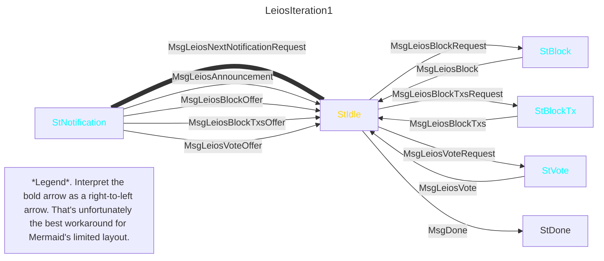
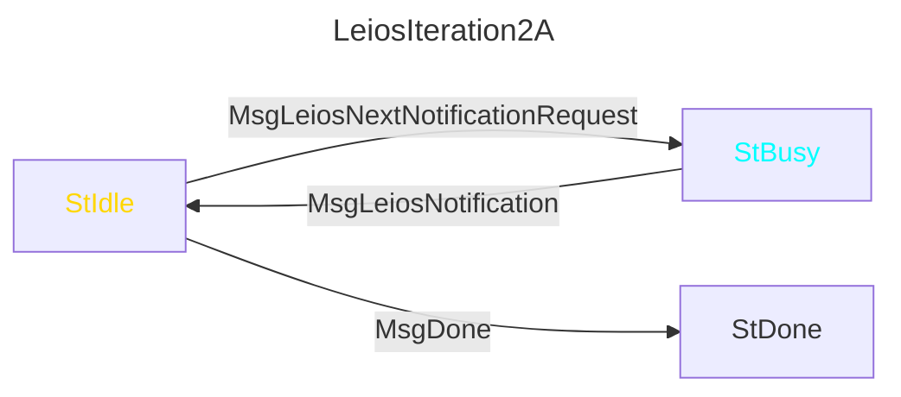
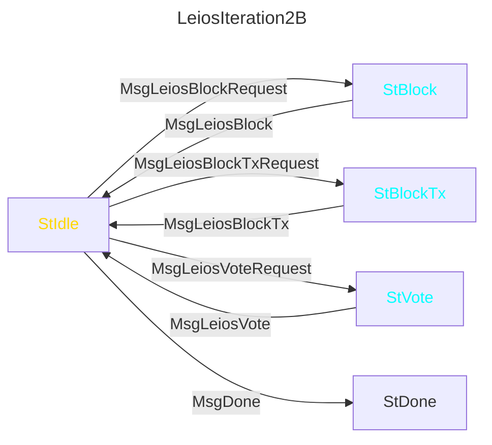
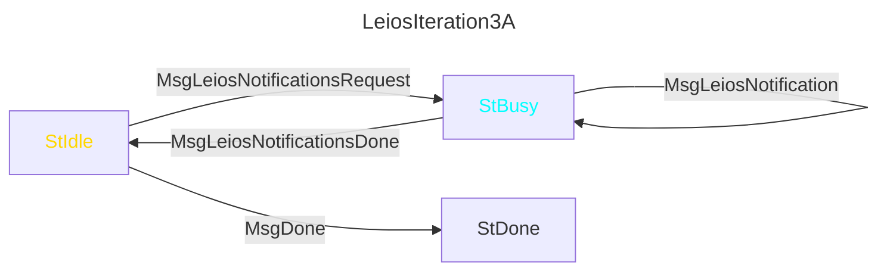
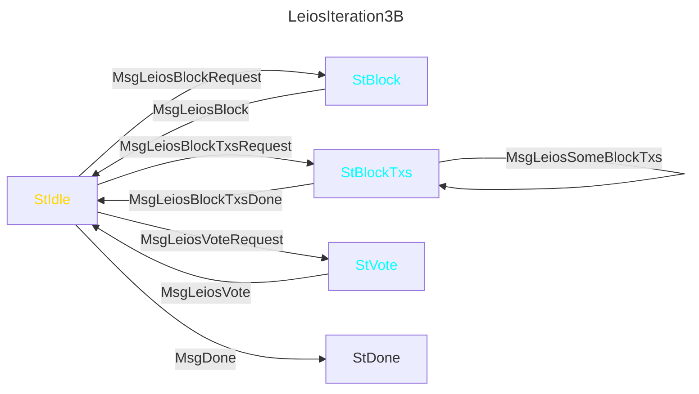
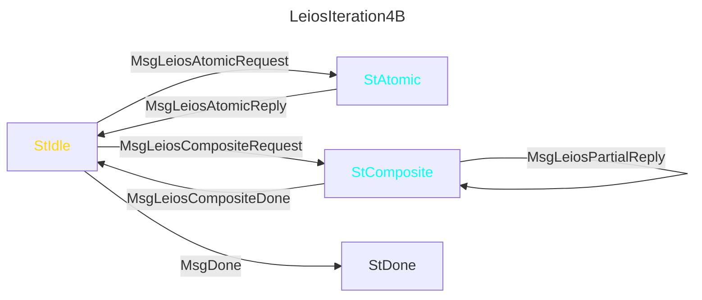
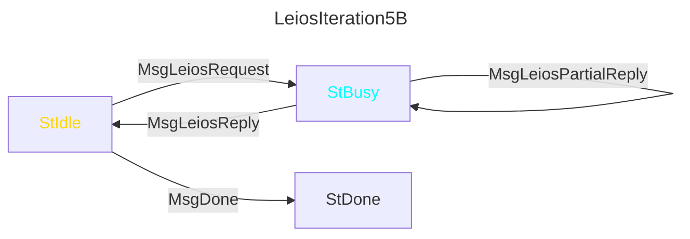
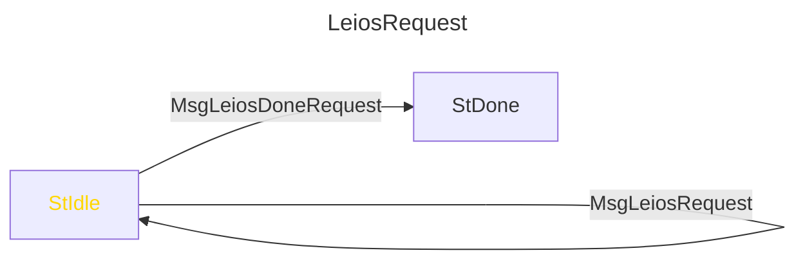
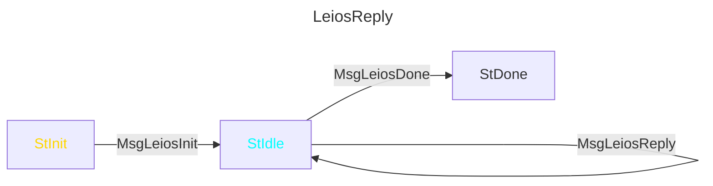

## Mini Protocols

(TODO this section is written as if L_recover is anchored in the slot of the certified EB rather than the slot of the certifying RB.
That actually seems correct (Giorgos agrees), despite it being an accident: the team has so far assumed opposite.)

The design of the Leios mini protocols is predominantly determined by which information two nodes need to exchange, when that information should be sent, and how to bound resource utilization on both sides of the mini protocol.
Notably, the FreshestFirstDelivery scheme constrains some of the timings.

A CIP ideally proposes exact mini protocols, so that nodes with different implementors will be able to interact.
There is precedent for CIPs (eg Ouroboros Peras) to instead let the implementors determine the details of the mini protocol separate (preferably in a separate CIP).
However, optimized diffusion times are a core concern of Leios, so a more detailed mini protocol specification is appropriate in this CIP, at least to demonstrate feasibility and highlight key factors.

### Information Exchange Requirements

It would be premature to discuss concrete mini protocols without the motivating context of what information they're required to exchange.

The primary messages will carry information that is directly required by the Leios description above: headers, blocks, txs referenced by blocks, and votes for blocks.
However, some lower-level information must also be carried by secondary messages, eg indicating when the peer is first able to send the block.

The required exchanges between two neighboring nodes is captured by the following Information Exchange Requirements (IER) table.
Each row is a datum that some mini protocol message will carry, although a single message might bundle multiple rows.
Some of the details in this table are not fully compatible with the initial concrete iterations of the mini protocol below; they instead match the later iterations.

| Sender | Name | Arguments | Semantics |
| - | - | - | - |
| Client→ | LeiosNotificationsBytes | byte count | Requests Leios notifications (announcements and delivery offers) up to some total byte size. A low-watermark scheme would suffice to ensure there's always sufficient room for more notifications. |
| ←Server | LinearLeiosAnnouncement | RankingBlockHeader that announces an LLB | The server has seen this LLB announcement. The client should disconnect if the server sends a third announcement with the same election, since two already evidence equivocation. The client should disconnect if the header is invalid in a way that any recent ledger state could notice, not only the ledger state of the header's predecessor. |
| ←Server | LinearLeiosBlockOffer | slot and Leios hash | The server could immediately deliver this block. The client should disconnect if the server had not already sent a LinearLeiosAnnouncement for the same block. |
| ←Server | LeiosBlockTxsOffer | slot and Leios hash | The server could immediately deliver any tx referenced by this block. The client should disconnect if the server had not already sent a LinearLeiosAnnouncement for the same block. |
| ←Server | LinearLeiosVoteOffer | slot and vote-issuer-id | The server could immediately deliver this vote. The client should disconnect if the server had not already sent a LeiosAnnouncement for the same slot (rather than block, for the other messages). |
| Client→ | LinearLeiosBlockId | slot and Leios hash | The server must deliver this block. The server disconnects if it doesn't have it. |
| Client→ | LeiosBlockTxsId | slot, Leios hash, and map from 16-bit index to 64-bit bitmap | The server must deliver these txs from this Leios block. The server disconnects if it doesn't have the block or is missing any of its txs. The given bitmap identifies which of 64 contiguous txs are requested, and the offset of the tx corresponding to the bitmap's first bit is 64 times the given index. |
| Client→ | LinearLeiosVoteId | slot and vote-issuer-id | The server must deliver this vote. The server disconnects if it doesn't have it. |
| ←Server | LinearLeiosBlockDelivery | Leios block | The block from an earlier LinearLeiosBlockId. |
| ←Server | LeiosBlockTxsDelivery | slot, Leios hash, map from 16-bit index to sequences of txs | A subset of the txs from an earlier LeiosBlockTxsId. Note that this map's keys are a non-empty subset of the request's map's keys. A server is allowed to send multiple LeiosBlockTxsDelivery in reply to a single LeiosBlockTxsId. |
| ←Server | LinearLeiosVoteDelivery | Leios vote | The vote from an earlier LinearLeiosVoteId. |
| Client→ | LinearLeiosStaleBlockRangeId | two slots and two RankingBlock hashes | The server must deliver all LLBs and all of their txs (ie via LinearLeiosBlockDelivery and LeiosBlockTxsDelivery) that are certified within this range of the identified Ranking Blocks. The client should disconnect if the server doesn't send the block in the same order as the chain, contrary to FreshestFirstDelivery. If the requested range contains more than one block and is not on the server's current selection, it should disconnect. If the server doesn't have all of the LLBs, it should disconnect. The client is advised to not send this message while the wall clock is still within any of the requested LLB's L_recover window; LinearLeiosBlockId is more suitable for such blocks. |

### Tolerable Resource Utilization

The information exchange requirements would be unsatisfiable if they implied overwhelming resource utilization.
This section sketches a possible set of lower-level rules that demonstrates the IER table is tractable.
The focus is to demonstrate that a server only needs to separately maintain lightweight state per peer, because it is not uncommon for a server to have hundreds of downstream peers.

**Announcement age bounds**.
Some information (eg LinearLeiosVoteOffer) cannot be sent before other information (ie LinearLeiosAnnouncement) has been sent.
This is the only constraint preventing the server from sending (an unbounded amount of) nonsensical offers to the client.
Unfortunately, it also requires the server to separately maintain commensurate state for each client.

A sufficient rule would be that a server should only relay a LinearLeiosAnnouncement to clients that already sent sufficient LeiosNotificationsBytes before the server itself received the LinearLeiosAnnouncement.
One exception: if LeiosNotificationsBytes is received after the first announcement but before an equivocating announcement, then the node should send both announcements.
This rule indirectly prevents the server from sending to a client any offers involving an LLB whose LinearLeiosAnnouncement was not sent, since offers (eg LinearLeiosBlockOffer) cannot be sent unless the corresponding LinearLeiosAnnouncement already has been.

Let GracePeriod be 10 seconds; this accomodates some combination of clock skew and an unfortunate latency spike.

The requisite per-client state for the ordering constraint would then simply be the set of LLBs whose LinearLeiosAnnouncement was sent to this client and are still younger than L_recover + GracePeriod.
That state is sufficiently bounded because servers never need to send notifications regarding an LLB older than L_recover.
L_recover will never exceed a few minutes, so this set will never include a large number LLBs simultaneously.

**Vote age bounds**.
Votes have the smallest lifetime in the protocol.
The following rules would be plausible.

- The server should only send LinearLeiosVoteOffer to a client to which it had already sent the LinearLeiosAnnouncement before the vote arrived at the server itself.
- If a vote is older than L_vote, the protocol doesn't assume it is still diffusing, and so the client should not send a LinearLeiosVoteId for it.
- Moreover, old votes are no longer useful; only old certificates are.
  The server can safely forget votes that are older than L_vote + GracePeriod, and so will disconnect if a request for one arrives.
- Thus, the server should not send LinearLeiosVoteOffer for a vote that is L_vote old---the honest client would not be able to act on that offer.

**Block age bounds**.
LLBs have three diffusion intervals.
This first interval is analogous to votes' but has a duration of L_recover instead of L_vote.

- The server should only send LinearLeiosBlockOffer/LeiosBlockTxsOffer to a client to which it had already sent the LinearLeiosAnnouncement before the blocks/txs arrived at the server itself.
- If an LLB is older than L_recover, the protocol doesn't assume it is still diffusing, and so the client should not send a LinearLeiosBlockId/LeiosBlockTxsId for it.
- Thus, the server can disconnect if it receives a LinearLeiosBlockId/LeiosBlockTxsId for a block that is older than L_recover + GracePeriod.
- The server should not send LinearLeiosBlockOffer/LeiosBlockTxsOffer for a block that is L_recover old---the honest client would not be able to act on those offers.

In some real-world corner cases, however, nodes (syncing nodes but also even unfortunate otherwise-caught-up nodes) will need to acquire LLBs that are older than L_recover.
Thus, the second diffusion interval involves blocks that are older than L_recover.
The same rules also handle the third diffusion interval as well, since that simply indefinitely extends the second interval for blocks on the historical chain.

- Clients can send LinearLeiosStaleBlockRangeId requests, regardless of the age of the LLBs.
  If the slots are not already settled, then the client should send one LinearLeiosStaleBlockRangeId per LLB, instead of a range.
  (This threshold prevents the server from having to search for chains formed by blocks that are not on its current selection.)
- Ultimately, the protocol itself expects the server to retain all LLBs (and their referenced txs) while they might be certified on some chain the node has any chance of selecting.
  That chance can only diminish all the way to zero when the correspondings slots are certainly settled.
  That usually happens after ~12 hr on Cardano mainnet (much faster with Ouroboros Peras), but the worst-case will always be ~36 hr.
- There is a very unlikely scenario that an honest client requests an LLB that the server discards while the request is in-flight.
  This event should be so rare that it's fine for the server to disconnect.
- TODO should the server disconnect if the range include blocks younger than L_recover - GracePeriod?
  Should clients be forced to favor LinearLeiosBlockId and LeiosBlockTxsId for young blocks?

**Overlapping tx requests**.
Two different LeiosBlockTxsId requests might overlap, even for different blocks, since normal circumstances imply the tx references within contemporary LLBs will overlap.
A client could avoid this by excluding the overlap from its second request (even if it's pipelining requests).
However, the server could only (perfectly) force the client to do so if the server was already maintaining enough state that it could simply itself skip over the redundant parts of the second request.
If server-side reordering (discussed below) is not allowed, then the server must either maintain the state or unknowingly waste bandwidth when requests overlap.

If server-side reordering is allowed, then the client cannot necessarily avoid redundant requests, since it cannot be sure which request will be handled first.
With server-side reordering, the client could only rely on the server---as the ultimate decider of reply order---to eliminate the redundancy in its deliveries.
Thus, with or without server-side reordering, the server must maintain some state to eliminate redundancy in responses.
Requests for blocks and votes cannot overlap in any way, so this state is only needed for txs.

The state necessary to identify overlapping LeiosBlockTxsId requests can be bounded, since the server doesn't have to track/avoid redundancy forever, merely over whatever duration server-side reordering might force the honest client to send redundant requests.
It seems sufficient to limit it by the total number of requested txs (not double counting overlap), rather than a time-based duration; it's unlikely a server will make large requests from more than, say, three LLBs at once, due to the size of the corresponding receive-buffer commitment.
The size limit on a single LLB prevents one from ever referring to more than ~7150 txs, so the server would only need to track at most ~21500 txs at once per client to avoid overlap even across requests spanning three full LLBs even if they mostly do not overlap.

Moreover, the identifiers the server uses when tracking txs do not need to be externally interpretable, so the server's centralized internal state can maintain an injective mapping from txs in currently-young LLBs to arbitrary 32-bit integers.
Thus, even with a relatively naive implementation, this state requires at most 21,500 * 4 = 86,000 bytes per client (there's no need for sharing/persistence, so GC overhead can be avoided), ie 8.6 megabytes per 100 downstream nodes.
The boundedness prevents a guarantee that the server will eliminate all redundancy among every set of pipelined requests, but the scheme almost always eliminates redundancy among requests from honest nodes under normal circumstances.

(TODO should the server enforce that the client never has outstanding requests for more than 21500 unique txs at once?)

**Bundling txs**.
Only LeiosBlockTxsOffer, LeiosBlockTxsId, and LeiosBlockTxsDelivery explicitly bundle requests for multiple objects (ie txs in a Leios block).
This bundling is necessary, because an adversarial Leios block could cause honest nodes to request thousands of txs simultaneously, and thousands of individual request-response pairs is an intolerable amount of overhead.
This bundling is also mostly harmless, because---without a design for streaming each LLB---a node cannot send LeiosBlockTxsOffer to its downstream peers until it has all of referenced txs, so the fact that the first tx in a bundle would have arrived much sooner than the last if they weren't bundled is not particularly relevant to diffusion.
Moreover, this bundling is compact, because the Leios design inherently enables a compact scheme for referring to multiple txs: by their location within a particular Leios block.

**Bundling votes and/or blocks**.
All other rows in the IER table refer only to individual objects, in part because there's no compact addressing scheme as obvious for blocks or votes as it is for txs.
Even so, simply concatenating multiple requests and/or responses within a single mini protocol message would eliminate some overhead.
In particular, there will also be hundreds of votes in-flight at a time, so some bundling might be appropriate.
Too much bundling, however, would be harmful for votes, since the first vote within a bundled response might be enough to establish a quorum, and wouldn't be able to arrive sooner than the last vote in the same bundle.
The ideal degree of bundling for small objects like votes or even mostly-empty Leios blocks is a trade-off to be balanced heuristically.
Thus, the mini protocol messages will accommodate it for any object without requiring it.

A bundled request does naturally create the opportunity for multiple messages to cooperatively reply to the same request, which is somewhat sophisticated.
But that possibility is already introduced by LeiosBlockTxsId, so allowing it for other objects too is merely marginal additional complexity.

**Operational certficate issue numbers (OCINs)**.
The Leios protocol requires that each server must send at most two LinearLeiosAnnouncement notifications that equivocate the same election.
This would be to enforce on both the client and the server, if it were not for operational certificates (TODO link), which complicates the notion of which elections are the "same".

With the current Praos system, a Stake Pool Operator (SPO) is free to issue an arbitrary OCIN every time they issue an RB header, but honest SPOs will only increment their OCIN when they need to.
Whether the OCIN carried by some header is valid depends on the chain it extends, because the Praos protocol rules along a single chain only allow an SPO's OCIN to be incremented at most once per header issued by that SPO.

The Leios mini protocols, in contrast, are expected to diffuse contemporary LLBs regardless of which chain they're on, and so cannot assume that it has seen the predecessor header of every LinearLeiosAnnouncement.
It also can't simply require that it has seen them all, because that would complicate the timing restrictions and require tracking a potentially unbounded number of forks.
Thus, neither of the following simple extremes would be acceptable for Leios.

- If Leios ignores OCINs, then a leaked hot key would let the adversary issue impersonating LLBs whenever the stake pool is elected until that KES period expires, which can be up to 90 days later on Cardano mainnet.
  That's unacceptably long.
  (Significantly shortening the 90 day period is not an option, because that would excessively burden SPOs by forcing them to utilize their cold key more often.)
- If Leios instead over-interprets distinct OCINs as separate elections, then any adversary can diffuse any number of LLB announcements per actual election, with arbitrary OCINs.
  Those announcements would be an unacceptable unbounded burst of work for honest nodes to relay throughout the entire network, even if they only relayed at most one LLB body per actual election.

There is an acceptable compromise between those extrema.
Every Leios node should ignore an LLB announcement if it has already seen a greater OCIN in a strictly older slot.
After not ignoring two announcements with the same election, the Leios node should ignore (including not relaying) any subsequent announcements for that election.
An intended implication of this rule is that an honest server would send the same one or two announcements to all of its clients; it doesn't have to track any extra state per-client.

Crucially, this rule is also influenced by OCINs seen in valid headers received via ChainSync.
Without that additional avenue, the limitation to two headers per election would risk preventing a node from ever seeing the one-per-election honest header with an incremented OCIN.

A client should only disconnect from a server that sends an OCIN that's less than an OCIN the same server sent in an older slot or if it sends a third announcement for the same election.
In particular, since a client has multiple servers, it might ignore up to two announcements per election from each server without having reason to disconnect from any of them.

With this rule, a client will crucially disconnect if a server sends more than two announcements with the same election.
It will also ignore headers from leaked hot keys once the SPO increments their OCIN, but unfortunately not immediately.
The Leios node will still consider the first header with an incremented OCIN to equivocate with headers with the same election and an unincremented OCIN.
However, the second header with that new OCIN will not be contested (assuming it wasn't also already leaked), and thus the SPO's control is very likely to be reestablished much sooner than 90 days.

### Iteration 1

The following mini protocol is a useful starting point for a derivation.
It is superficially plausible for conveying the rows of the IER table, but has some major problems.
They will be explained below in order to motivate and derive the actual mini protocol proposal.

If the general structure and semantics of mini protocols is not already familiar, see the Chapter 2 "Multiplexing mini-protocols" and Chapter 3 "Mini Protocols" of the `ouroboros-network`'s [Ouroboros Network Specification PDF](https://ouroboros-network.cardano.intersectmbo.org/pdfs/network-spec/network-spec.pdf).
A brief summary is that a mini protocol is a state machine that two nodes cooperatively navigate; each node only sends a message when it has _agency_, and at most one node has agency in any state.
The agencies are indicated in this document as gold or cyan.



The above mini protocol lacks the following desired properties.

- **Decoupled requests**.
  The foremost problem is that this node cannot have an outstanding request for new notifications and an outstanding request for some specific offered thing at the same time.
  The node has to choose whether to request a new notification or a new delivery, while it should ideally be able to do both simultaneously.
- **Reordering**.
  This monolothic mini protocol forces replies to be sent in the same order as their responses, since mini protocols have a lock-step semantics.
  The FreshestFirstDelivery scheme, however, naturally implies that a server should usually instead reply to the youngest of the outstanding requests.
    - In the basic interpretation of a mini protocol, the client cannot even send multiple outstanding requests.
    - _Mini protocol pipelining_ already allows exactly that, but today's implementation does not also allow the server to react to subsequent messages before it's done responding to the oldest outstanding message.
    - It seems plausible to somehow add that capability to the `ouroboros-network` infrastructure (eg the server, when it unblocks, receives the latest accumulation of client requests instead of the merely the first of them), but such a change isn't absolutely necessary; see more details in Iteration 6.
- **Bundling**.
  LeiosIteration1 does not permit any bundling of blocks or votes.
- **Many replies per single request**.
  LeiosIteration1 does not allow multiple MsgLeiosBlockTxs to satisfy a single (large) MsgLeiosBlockTxsRequest.
  This "unbundling" of replies isn't inherently required by Leios---and perhaps should be the responsibility of the client instead of the server---but it might be useful for other reasons, discussed below.
- **Minimized structure**.
  Finally, the mini protocol itself is replicating messages for different object (txs, votes, blocks) for no reason.
  All of those different message types can be combined into one message that carries a tagged union of some rows of the IER table.
  This makes the structure of the mini protocol simpler and its actual responsibilities/consequences clearer, with the superficial downside of hiding some of the recognizable Leios details behind an indirection.
  (TODO is this actually somewhat counterproductive---would we instead prefer "flat" CDDL?)

### Iteration 2: Decoupled Requests and Minimized Structure (Part 1 of 2)

Decoupled requests could be achieved by simply splitting the above mini protocol into its left and right halves; separate mini protocols can proceed independently.
Simultaneously, the mini protocol structure can be minimized by combining the four replies into a `MsgLeiosNotification` that carries a tagged union.
The right half can't be similarly collapsed, since the requests target distinct states.





### Iteration 3: Many replies to one request

A server might have good reason to send multiple MsgLeiosBlockTx messages in response to a large MsgLeiosBlockTxRequest.
The following demonstrates how a mini protocol would express the possibility of many replies to a single request (eg BlockFetch already does), for both MsgLeiosNextNotificationRequest and MsgLeiosBlockTxsRequest.





If other requests could be bundled (eg votes), then this same transformation should be repeated for them.

### Iterations 4 and 5: Reordering and Minimized Structure (Part 2 of 2)

Strictly speaking, all of the above mini protocols already sometimes permit the server to send replies out of order.
For example, if the client pipelined MsgLeiosVoteRequest, MsgLeiosBlockRequest, and MsgLeiosBlockTxsRequest in that order, the server could only reply in the same order.
If it instead pipelined MsgLeiosBlockRequest, MsgLeiosVoteRequest, MsgLeiosBlockRequest messages (identifying two different blocks), then the mini protocol structure itself does not force the server to send the two MsgLeiosBlock messages in the same order as they were requested.
But it does have to send a block, a vote, and then a block.

Conventionally, the client logic adds constraints beyond the mini protocol structure in order to require that replies come in the exact same order as the requests.
If server-side reordering were desired, then the client would relax its constraints according to whatever possible prioritization the mini protocol was reorganized to allow.

To enable as much reordering as possible, LeiosIteration4B collapses the busy states into a single busy state.
The server can therefore reorder requests regardless of whether they are for blocks, txs, or votes.
Now that the states aren't distinguished, the messages can also be collapsed, just as in LeiosIteration2A.

Let LeiosIteration4A = LeiosIteration3A.



For example, a LeiosBlockTxsId is necessarily a MsgLeiosCompositeRequest.
But a MsgLeiosCompositeRequest might carry more than one LeiosBlockTxsId, even interleaved with multiple LinearLeiosBlockId and LinearLeiosVoteId requests.

If the client is already allowing the server to reorder requests for different kinds of object, then it seems likely the server is also allowed to interleave partial replies with atomic replies.

Let LeiosIteration5A = LeiosIteration3A.



Now a MsgLeiosRequest can simply carry any number of LeiosBlockTxsId, LinearLeiosBlockId, and LinearLeiosVoteId requests.
And so a MsgLeiosPartialReply could carry any number of LinearLeiosBlockDelivery, LeiosBlockTxsDelivery, and LinearLeiosVoteDelivery replies.

### Discussion

LeiosIteration5A and LeiosIteration5B address every problem identified with LeiosIteration1, assuming that the client pipelines its requests and that the server is able to reorder those requests when the prioritization rules and actual timings allow.

Unfortunately, server-side reordering is not permitted by the existing `ouroboros-network` infrastructure for specifying server behavior.
Today's server is unaware of request pipelining; it's only ever aware of the first of however many messages have arrived but not yet been processed.
The existing infrastructure is completely sufficient for latency hiding, which has been the only goal of mini protocol pipelining so far.
Reordering pipelined requests (when possible) is a new desideratum, due to the FreshestFirstDelivery requirement within the Leios specification.

The missing feature for servers could be implemented in `ouroboros-network`, but the best interface is not already clear.
Once that feature is available, LeiosIteration5A and LeiosIteration5B would be sufficient for Leios with a defensibly-granular interpretation of FreshestFirstDelivery.
See section XXX (TODO) for what an even more granular interpretation of FreshestFirstDelivery would require, such as message preemption.

### Iteration 6: extremely generic alternative

Especially for a first implementation, it's plausible that, instead, a coarser interpretation of FreshestFirstDelivery is acceptable.
In particular, client-side prioritization might suffice even without opportunistic server-side reordering.
The extent of the harm depends on how many requests have already been pipelined before the client learns of a fresher Leios block (which is ideally proportional to the [bandwidth-delay product](https://en.wikipedia.org/wiki/Bandwidth-delay_product) _most of the time_).
Opportunistic server-side reordering, on the other hand, is desirable specifically because it simply always respects FreshestFirstDelivery (as much as it can without preemption), regardless of how many requests have been pipelined.

If the server-side reordering is not required, then the states collapsed in Iteration 3 above could be uncollapsed.
That resulting mini protocol is not explicitly specified here, because server-side reordering is presumed to be considered worth the relatively small amount of work to enable it.
However, it's nothing more than reintroducing to LeiosIteration5B separate busy states per kind of object and restricting each state's incoming and outgoing messages to the corresponding rows of the IER table.

(TODO how does the Rust simulator relate to this question?
If I recall correctly, it's "perfectly" interleaving the reponses, isn't it?
Which is most comparable to not reordering?)

If server-side reordering is required but Leios for some reason must not be blocked on the corresponding changes to `ouroboros-network`, then there is another mini protocol design that addresses all of the problems identified with LeiosIteration1 above, including reordering.
It's essentially the other possible split from Iteration 2: instead of separating notifications (LeiosIteration2A) from deliverables (LeiosIteration2B), the alternative split separates all requests from responses.
Once requests and responses are decoupled, the two server threads would simply share the state of the set of outstanding requests as sole producer and sole consumer.





This final mini protocol pair is extremely generic.
All of the Leios details are hidden in the tagged union of (lists of) rows from the IER table, carried by MsgLeiosRequest and MsgLeiosReply.

- There are no longer different messages for blocks, transactions, and votes; messages merely carry a sum type instead (see below).
  The mini protocol itself need not differentiate.

- This split naturally relaxes the one reply per request restriction.
    - However, it even goes beyond many-replies per request; it could allow a single reply to resolve multiple requests.
      That is not obviously harmful, but it is also not obviously beneficial.
      For the sake of simplicity, that possibility is therefore forbidden: every Leios reply must uniquely identify a single Leios request, and it must not contain any content not identified by that request.
      This restriction will be invoked below.
- Both of these protocols are particularly unusual in that only one of the peers sends messages.
  That incurs at least the following immediate disadvantages.
    - The medium for back pressure is still present, but much less explicit than it is for existing mini protocols.
        - LeiosReply must only send messages that were requested.
          Thus, whenever the client becomes overwhelmed, they should temporarily stop sending messages via LeiosRequest.
        - LeiosRequest must not send another message if it has already sent, say, 10000 bytes of requests or, say, 1000 individual requests (whichever comes first) that the peer has not yet fully replied to via LeiosReply.
          These exact limits would be a consequence of the exact negotiated version of the mini protocol.
    - The timeouts for these mini protocols cannot be managed via the existing `ouroboros-network` infrastructure.
        - Existing timeouts begin when the mini protocol enters some state, but these mini protocols spend all of their time in a single state.
        - Moreover, the duration of a timeout was determined by the specific state, but that distinction doesn't exist for these mini protocols.
        - Instead, the client's centralized decision logic that controls LeiosRequests and reacts to LeiosReply will need to explicitly manage timeouts, and do so in a way that tolerates the server reordering according to FreshestFirstDelivery, for example.
        - A tenable timeout scheme will be proposed below.

### Detailed Message Semantics

The MsgLeoisRequest and MsgLeiosReply mini protocol messages carry LeiosRequestPayload and LeiosReplyPayload, respectively.
These data types are specified in Haskell syntax but are little more than tagged unions of rows from the IER table.

```haskell
data LeiosRequestPayload
  = LeiosNotificationBytes RequestNo Word16
  | LeiosDeliverableIds RequestNo (NonEmptyList LeiosDeliverableId)

data LeiosReplyPayload
  = LeiosNotifications RequestNo CompletionFlag (NonEmptyList LeiosNotification)
  | LeiosDeliveries RequestNo CompletionFlag (List LeiosDelivery)

--

type RequestNo = Word64
type CompletionFlag = Bool

type Index16 = Word16
type Bitmap64 = Word64
type SlotNo = Word64

type LeiosPoint = (SlotNo, LeiosBlockHash)
type RankingPoint = (SlotNo, RankingBlockHash)

data LeiosNotification
  = LinearLeiosAnnouncement RankingBlockHeader
  | LinearLeiosBlockOffer LeiosPoint
  | LeiosBlockTxsOffer LeiosPoint
  | LinearLeiosVoteOffer SlotNo VoteIssuer

data LeiosDeliverableId
  = LinearLeiosBlockId LeiosPoint
  | LeiosBlockTxsId LeiosPoint (NonEmptyMap Index16 NonEmptyBitmap64)
  | LinearLeiosVoteId SlotNo VoteIssuer
  | LinearLeiosStaleBlockRangeId RankingPoint RankingPoint

data LeiosDeliverable
  = LinearLeiosBlockDelivery LinearLeiosBlock
  | LeiosBlockTxsDelivery LeiosPoint (NonEmptyMap Index16 (List Tx))
  | LinearLeiosVoteDelivery LinearLeiosVote
```

Some names start with merely Leios instead of LinearLeios, because those names will also exist as-is for future Leios variants.
(TODO this is the only sentence we'd need to remove if we never want to mention LinearLeios within the CIP; find-and-replace would handle everything else.)

Additional message details, beyond the IER table.

- The RequestNo of the first request must be zero.
  The RequestNo of the subsequent request must be one greater, and so on.
  If it isn't, the server should disconnect.
  (If every EB incurred 10000 requests between two specific peers, their connection would have to last more than a billion years to exhaust Word64, assuming an average of one per 20 seconds.)
- Every MsgLeiosReply identifies the corresponding MsgLeiosRequest by its RequestNo.
  If there is no such outstanding request, the client should disconnect.
- The CompletionFlag indicates whether the server considers this message to completely resolve the corresponding request.
  This flag is redundant, but it will at least be useful for troubleshooting related bugs.
  If the client disagrees with a CompletionFlag, it should disconnect.
  The flag should be set on the LeiosDeliveries that includes the last of the objects identified by some LeiosDeliverableIds request.
  The flag should be set on the first notification whose size includes the last byte of a LeiosNotificationBytes request.
  That same notification might include the first byte of the next LeiosNotificationsBytes request, but it should never also include the last byte of that second request (see MaxNotificationSize, close below).
  If it does, the client should disconnect, because the lower bound on MaxNotificationSize prevents the server from being forced to send such a message.
- If the argument of a LeiosNotificationBytes request is less than some MaxNotificationSize constant determined by the negotiated mini protocol version, the server should disconnect.
  Every MaxNotificationSize constant must accommodate at least any single LeiosNotification carrying the biggest argument it can, so MaxNotificationSize must be no less than the maximum size of a RankingBlockHeader.
- When FreshestFirstDelivery justifies the client sending two overlapping requests (eg if a younger LLB refers to the same txs as an already requested older LLB), the server might reply in-order or out-of-order, depending on how timings resolve.
  Whichever reply is sent second should exclude the content that was already included in the first reply, in order to not waste bandwidth (recall that it should be common for contemporary LLBs to share most txs).
  In an extreme case, this might require a LeiosDeliveries message to carry an empty list.
  (TODO for extra explicitness, would we also want to send a LeiosBlockTxsDelivery with an empty map?)

### Timeouts

The ChainSync and TxSubmission mini protocols enforce a 10 second timeout when the peer must not be blocked.
The BlockFetch mini protocol enforces a generous 60 second timeout when the peer must not be blocked.
60 seconds would be intolerable as an average, which is why the Ouroboros Genesis design introduces additional, more aggressive, adaptive timeouts for a syncing node.
However, for caught-up nodes, mini protocols' timeouts aren't intended to ensure an average responsiveness; it's the churning of peers based on their recent performance that prevents terrible performance over longer periods, under the assumption that at least some peers are honest and healthy.
Mini protocols' timeouts are instead merely used to stop wasting resources on a clearly defunct peer.
(TODO this is my inference---I haven't found an explanation in any written document.)

A LeiosNotificationBytes request should not incur any timeout; there's no absolute limit on the duration until the next upstream Leios event (eg SPOs could choose to stop issuing LLBs alongside their RBs).
LeiosDeliverableIds are only submitted when the peer is not blocked and could be much larger than ChainSync and TxSubmission messages, and so a 60 second timeout seems comparable, copied from BlockFetch.

For a pipelined mini protocol message, the existing `ouroboros-network` infrastructure begins the timeout as soon as the request is sent.
That simple rule would be incorrect for LeiosRequest-LeiosReply due to server-side reordering and/or partial responses.
Both of those phenomena mean that the nth message sent won't necessarily be resolved by the nth message to arrive.

Instead, LeiosReply should throw a timeout exception if it ever waits more than 60 seconds for the next message it was expecting.
More concretely, a 60 second timeout should start whenever LeiosRequest sends a LeiosDeliverables message while there were no outstanding LeiosDeliverableIds requests.
That timeout is discharged when LeiosReply receives any LeiosDeliverables message.
If there are still outstanding LeiosDeliverableIds requests after LeiosReply receives a LeiosDeliverables message, LeiosReply should reset the timeout to another 60 seconds.

Remarks.

- If a request takes more than a few seconds to be resolved (perhaps as an expected consequence of server-side reordering!), the node might be well justified to also send the same request to another peer, in order to fulfill it sooner, regardless of whether or not the first peer exceeds the generous mini protocol timeout.
- For LeiosIteration5A and LeiosIteration5B instead of LeiosRequest and LeiosReply, the timeouts would be 10 seconds and 60 seconds respectively, and could be handled normally by the `ouroboros-network` infrastructure, assuming its enhancement for server-side reordering include some clever timeout handling.

TODO is this overspecified?
Is the first paragraph actually sufficient by itself?
It's OK if different clients enforce different timeouts---the honest server will always be trying its best, regardless.

### Concise Data Definition Language (CDDL)

TODO Write out the full CDDL for these messages.
I'm differing this labor until we're sure which mini protocol iteration will actually be the focus of this CIP.

### Head-of-Line Blocking and Sharing Bandwidth with Praos

There are two more risks that these mini protocols do not inherently address: head-of-line blocking in LeiosReply and limiting how much bandwidth the Praos mini protocols can use.

The existing `ouroboros-network` infrastructure provides some simple mitigation for head-of-line blocking, but the only way to enable it is to split the LeiosReply mini protocol into two copies of itself, so that two concurrent deliveries could be interleaved by the `ouroboros-network` mux.
If one copy of LeiosReply was reserved for messages that were both small and urgent, then the server would be able to provide an urgent notification such as LinearLeiosAnnouncement even if it were already sending a multi-megabyte LeiosBlockTxsDelivery.
That approach might suffice, at least for an initial implementation.
However, duplicating LeiosReply has two drawbacks.

- It's an artifical workaround that would explicitly manifest in the concrete interface between communicating nodes.
  Every node would need to accommodate it, and when the workaround is eventually replaced by something preferable (eg perhaps the mux could allow a single mini protocol to interleave its own messages), the mini protocol specification would need to be updated accordingly, despite the LeiosRequest-LeiosReply pair _already_ accommodating out-of-order replies.
  (TODO The same criticism applies to Iteration 6.)
- The existing mux logic is flat, so adding a second Leios mini protocol instance (it's not a third, since LeiosRequest only sends messages in the opposite direction) means that Leios would sometimes consume a larger share of the bandwidth that's split among all sending mini protocols.
  This is explicitly undesirable, since Praos messages should always be prioritized over Leios messages---the fundamental restriction is that Leios must not disrupt Praos.
  (A more expressive configuration for the `ouroboros-network` mux would likely also help here; for example, biased sampling of active mini protocols.)

Ideally, the Leios mini protocols would pause completely while ChainSync or BlockFetch are sending.
The `ouroboros-network` mux cannot express that today, but restricting Leios to use at most one "share" of the bandwidth at a time seems tolerable until the `ouroboros-network` mux does somehow allow intentionally-unfair sharing.

There is another way to mitigate head-of-line blocking without duplicating LeiosReply.
The client should avoid ever sending a request that incurs a large MsgLeiosReply.
Because of the aforementioned restriction that the server must not combine multiple requests into a single message, this allows the client to ensure any head-of-line blocking is insignificant.
For example, if the client tried to never send a single request that incurred more than 100,000 bytes, then---with modern bandwidths---the worst-case head-of-line blocking would be on the order of ten milliseconds.
In the proposed Linear Leios design, the only object that is atomic and potentially larger than that is LLBs, but at most by a factor of three.
(There might be other benefits to explicitly decomposing LLBs, such as being able to stream them across the network.
Remarkably, the proposed mini protocols might be able to already accommodate that, since the sub-blocks should have unique hashes.)

TODO this assumes the server `Peer`'s `Yield` would block instead of pushing the total enqueued past 100,000 bytes?

There is also a way to explicitly prioritize Praos without requiring any changes to `ouroboros-network`, but it seems radical enough to be not be a preferred option, at least for the first Leios deployment.
A pair of mini protocols Request and Reply could handle all communication between two peers, both Praos and Leios.
BlockFetch is simply deliveries, while ChainSync and TxSubmission are mixes of notifications and deliveries.
(KeepAlive is also merely notifications.)
The simplicity and convenience of timeouts for the existing mini protocols---which are crucial for KeepAlive and ChainSync, in particular---would be the primary loss, beyond the intuitive distinction being less present in the architecture.
Once Praos and Leios are within the same Reply mini protocol, both the client and server could arbitrarily prioritize Praos requests over Leios requests whenever arrival time permits.

### Linear Leios for Syncing Nodes

There are two kinds of syncing node, with Ouroboros Genesis and without (ie trusting all upstream peers, eg the semi-centralized bootstrap peers).

With Ouroboros Genesis, LLBs that are certified on chain should be fetched from the same peer that Devoted BlockFetch is fetching its blocks from.
It would be sufficient to send LinearLeiosStaleBlockRangeId requests to that peer via LeiosRequest when the headers it has sent via ChainSync imply those LLBs are certified on the chain it's serving.
The only time that node wouldn't be able to immediately serve the LLB is if the wall clock is still within that LLB's L_recover window, but in that case the syncing node could send LinearLeiosBlockId and LeiosBlockTxsId instead of LinearLeiosStaleBlockRangeId.

If the upstream node is actually healthy and caught-up, is should almost always be able to promptly send the requested blocks.
If it fails to do so enough that it starves the syncing node of work, then LeiosRequest should rotate the Dynamo just like Devoted BlockFetch does when a Praos block is too slow to arrive.
No other part of Ouroboros Genesis would need to change for the proposed Leios protocol.

When the node is syncing without Ouroboros Genesis, LeiosRequest would do the same as above except it would not need to monitor for and react to starvation, analogously to Devoted BlockFetch being disabled in the absence of Ouroboros Genesis.

With or without Ouroboros Genesis, the syncing node should not send LeiosNotificationBytes until it is nearly caught-up.
If sent too soon, the server might reply with headers that the syncing node's ledger state is incapable of validating at all.
Conversely, the syncing node does not need to wait until it's _completely_ caught-up before it starts sending LeiosNotificationBytes.
For example, starting to send LeiosNotificationBytes requests once the syncing node's ledger state is within a couple hours of the wall clock would suffice.
Even if the syncing node does wait until it's completely caught-up to the chain, a few minutes later it will have received all relevant Leios notifications.
