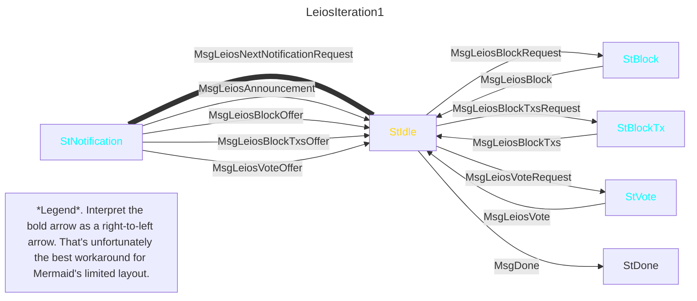
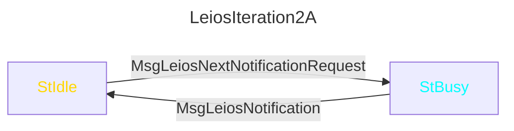
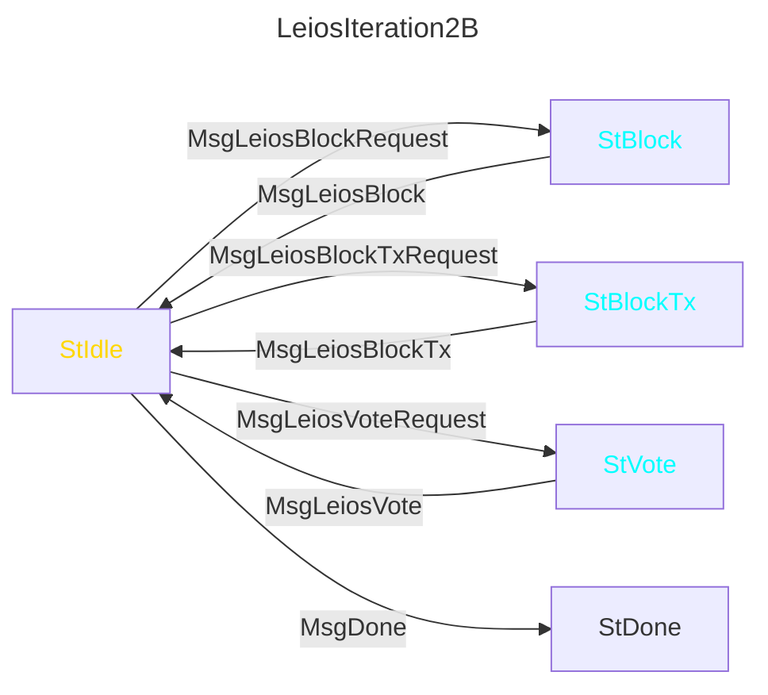
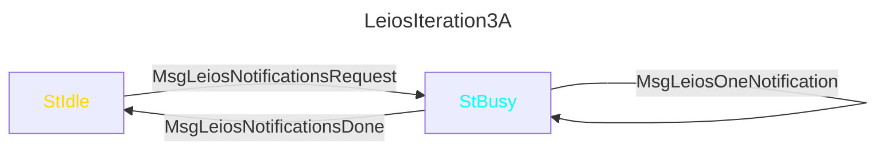
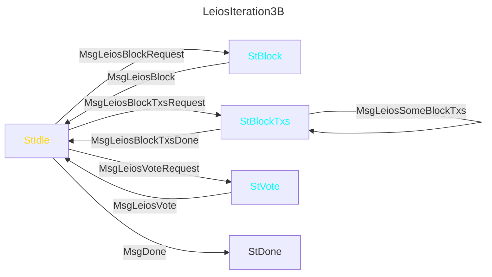
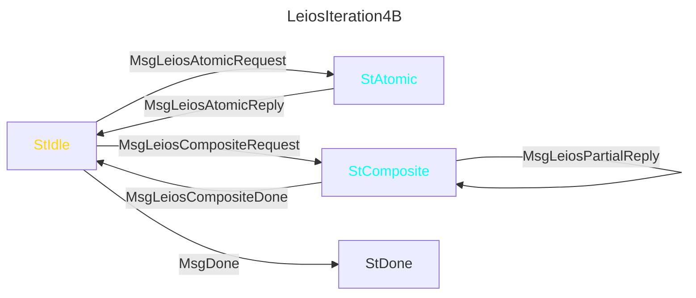
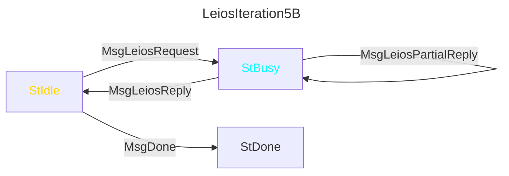
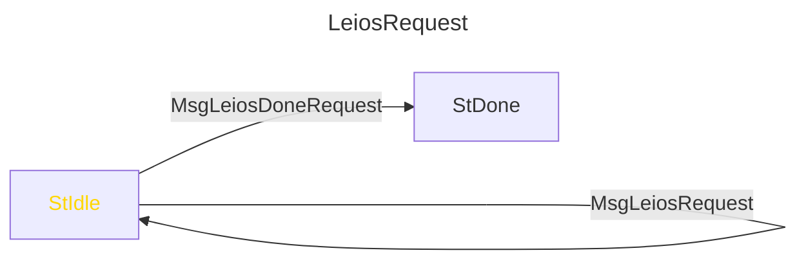
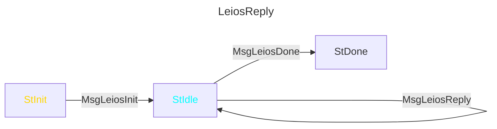

## Mini Protocols

The design of the Leios mini protocols is predominantly determined by which information two nodes need to exchange, when those messages should be sent, and how to bound resource utilization on both sides of the mini protocol.
Notably, the FreshestFirstDelivery scheme constrains some of the timings.
It would be premature to discuss concrete mini protocols without the necessary context of their information exchange requirements.

### Information Exchange Requirements

The primary messages will carry information that is directly required by the Leios description above: headers, blocks, txs referenced by blocks, and votes for blocks.
However, some lower-level information must also be carried by secondary messages, eg indicating when the peer is first able to send the block.

The required information exchange between two neighboring nodes is captured by the following Information Exchange Requirements (IER) table.
Each row is a datum that some mini protocol message will carry, although a single mini protocol message might involve more than one row.

Some of the details in this table are incompatible with the initial iterations of the concrete mini protocol, but they are compatible with the later iterations.

| Sender | Name | Arguments | Semantics |
| - | - | - | - |
| Client | LeiosNotificationsBytes | an amount of bytes | Requests an amount of bytes of notifications (Leios announcements and delivery offers). A low-watermark scheme would suffice to ensure there's always sufficient room for more notifications. |
| Server | LinearLeiosAnnouncement | a RankingBlockHeader | The server has seen this LLB announcement. It must never send a third announcement for some election, since two already evidence equivocation. Each header must not be invalid in a way that a recent-but-not-perfectly-up-to-date ledger state could notice. |
| Server | LinearLeiosBlockOffer | a slot and hash | The server can immediately deliver this block. It must have already sent a LinearLeiosAnnouncement for the same block. |
| Server | LeiosBlockTxsOffer | a slot and hash | The server can immediately deliver any tx referenced by this block. It must have already sent a LinearLeiosAnnouncement for the same block. |
| Server | LinearLeiosVoteOffer | a slot and vote-issuer-id | The server can immediately deliver this vote. It must have already sent a LeiosAnnouncement for the same slot. |
| Client | LinearLeiosBlockId | a slot and hash | The server must deliver this block. The server disconnects if it doesn't have it. |
| Client | LeiosBlockTxsId | a slot, hash, and map from 16-bit index to 64-bit bitmap | The server must deliver these txs from this Leios block. The server disconnects if it doesn't have the block or is missing any of its txs. The given bitmap identifies which of 64 contiguous txs are requested, and the offset of the tx corresponding to the bitmap's first bit is 64 times the given index. |
| Client | LinearLeiosVoteId | a slot and vote-issuer-id | The server must deliver this vote. The server disconnects if it doesn't have it. |
| Server | LinearLeiosBlockDelivery | an Leios block | The block from an earlier LinearLeiosBlockId. |
| Server | LeiosBlockTxsDelivery | a slot, hash, and map from 16-bit index to sequences of txs | A subset of the txs from an earlier LeiosBlockTxsId. Note that this map's keys are a non-empty subset of the request's map's keys. A server is allowed to send multiple LeiosBlockTxsDelivery in reply to a single LeiosBlockTxsId. |
| Server | LinearLeiosVoteDelivery | a Leios vote | The vote from an earlier LinearLeiosVoteId. |

**Bundling txs**.
Only LeiosBlockTxsOffer, LeiosBlockTxsId, and LeiosBlockTxsDelivery explicitly bundle requests for multiple objects (ie txs in a Leios block).
This bundling is necessary, because an adversarial Leios block could cause honest nodes to request thousands of txs simultaneously, and thousands of individual request-response pairs is an intolerable amount of overhead.
This bundling is also mostly harmless, because a node cannot send LeiosBlockTxsOffer to its downstream peers until it has all of the Leios block's txs, so the fact that the first tx in a bundle would have arrived much sooner than the last if they weren't bundled is not particularly relevant to diffusion.
Moreover, this bundling is compact, because the Leios design itself enables a compact scheme for referring to multiple txs: by their location within a particular Leios block.

**Bundling votes and/or blocks**.
All other rows in the table refer only to individual objects, in part because no compact addressing scheme as obvious for blocks or votes as it is for txs.
Even so, simply concatenating multiple vote requests and/or responses within a single mini protocol message would eliminate some overhead.
In particular, there will also be hundreds of votes in-flight at a time, so some bundling might be appropriate there too.
Too much bundling, however, would be harmful for votes, since for the first vote within a bundled response might be enough to establish a quorum, and wouldn't be able to arrive sooner than the last vote in a bundle.
The ideal degree of bundling for small objects like votes or even mostly-ejmpty Leios blocks is a trade-off to be balanced heuristically.
Thus, the mini protocol messages will accommodate it for any object without requiring it.

A bundled request does naturally create the opportunity for multiple messages to cooperatively reply to the same request, which is somewhat sophisticated.
But that possibility is already introduced by LeiosBlockTxsId, so allowing it for other objects too is merely marginal additional complexity.

### Iteration 1

TODO introduction, including a link to mini protocols specification at least introducing gold/cyan for agencies.

The following mini protocol is a useful starting point.
It is superficially plausible for conveying the rows of the IER table, but has some major problems.
They will be explained below in order to motivate and derive the actual mini protocol proposal.



The above mini protocol lacks the following desired properties.

- **Decoupled requests**.
  The foremost problem is that this node cannot have an outstanding request for new notifications and an outstanding request for some specific offered thing at the same time.
  The node has to choose whether to request a new notification or a new delivery, while it should ideally be able to do both simultaneously.
- **Reordering**.
  This monolothic mini protocol forces replies to be sent in the same order as their responses, since mini protocols have a lock-step semantics.
  The FreshestFirstDelivery scheme, however, naturally implies that a server should usually instead reply to the youngest of the outstanding requests.
    - In the primary interpretation of a mini protocol, the client cannot even send multiple outstanding requests.
    - _Mini protocol pipelining_ already allows exactly that, but today's implementation does not also allow the server to react to subsequent messages before it's done responding to the oldest outstanding message.
    - It seems plausible to somehow add that capability to the `ouroboros-network` infrastructure (eg the server, when it unblocks, receives the latest accumulation of client requests instead of the merely the first of them); see a further discussion below.
- **Bundling**.
  LeiosIteration1 does not permit any bundling of blocks or votes.
- **Many replies per single request**.
  LeiosIteration1 does not allow multiple MsgLeiosBlockTxs to satisfy a single (large) MsgLeiosBlockTxsRequest.
  This "unbundling" of replies isn't inherently required by Leios---and perhaps should be the responsibility of the client instead of the server---but it might be useful for other reasons, discussed below.
- **Minimized structure**.
  Finally, the mini protocol itself is replicating messages for different object (txs, votes, blocks) for no reason.
  All of those different message types can be combined into one message that carries a tagged union of some rows of the IER table.
  This makes the structure of the mini protocol simpler and its actual responsibilities/consequences clearer, with the superficial downside of hiding some of the recognizable Leios details behind an indirection.

### Iteration 2: Decoupled Requests and Minimized Structure (Part 1 of 2)

Decoupled requests could be achieved by simply splitting the above mini protocol into its left and right halves.
Simultaneously, the mini protocol structure can be minimized by combining the four replies into a `MsgLeiosNotification` that carries a sum type.
The right half can't be similarly collapsed, since the requests target distinct states.





### Iteration 3: Many replies to one request

A server might have good reason to send multiple MsgLeiosBlockTx messages in response to a large MsgLeiosBlockTxRequest.
The following demonstrates how a mini protocol would express the possibility of many replies to a single request (eg BlockFetch already does), for both MsgLeiosNextNotificationRequest and MsgLeiosBlockTxsRequest.
If other requests could be bundled (eg votes), then this same transformation would be useful for them too.





### Iterations 4 and 5: Reordering and Minimized Structure (Part 2 of 2)

Strictly speaking, all of the above mini protocols already sometimes permit the server to send replies out of order.
For example, if the client pipelined MsgLeiosVoteRequest, MsgLeiosBlockRequest, and MsgLeiosBlockTxsRequest in that order, the server could only reply in the same order.
If it instead pipelined MsgLeiosBlockRequest, MsgLeiosVoteRequest, MsgLeiosBlockRequest messages (identifying two different blocks), then the mini protocol structure itself does not force the server to send the two MsgLeiosBlock messages in the same order as they were requested.
But it does have to send a block, a vote, and then a block.

Conventionally, the client logic adds constraints beyond the mini protocol structure in order to require that replies come in the exact same order as the requests.
If server-side reordering were desired, then the client would relax its constraints to allow whatever possible prioritization the mini protocol was reorganized to allow.

To enable as much reordering as possible, LeiosIteration4B collapses the busy states into a single busy state.
The server can therefore reorder requests regardless of whether they are for blocks, txs, or votes.
Now that the states aren't distinguished, the messages can also be collapsed, just as in LeiosIteration2A.

Let LeiosIteration4A = LeiosIteration3A.



For example, a LeiosBlockTxsId is necessarily a MsgLeiosCompositeRequest.
But a MsgLeiosCompositeRequest might carry more than one LeiosBlockTxsId, even interleaved with multiple LinearLeiosBlockId and LinearLeiosVoteId requests.

If the client is already allowing the server to reorder requests for different kinds of object, then it seems likely the server is also allowed to interleave partial replies with atomic replies.

Let LeiosIteration5A = LeiosIteration3A.



Now a MsgLeiosRequest can simply carry any number of LeiosBlockTxsId, LinearLeiosBlockId, and LinearLeiosVoteId requests.
And so a MsgLeiosPartialReply could carry any number of LinearLeiosBlockDelivery, LeiosBlockTxsDelivery, and LinearLeiosVoteDelivery replies.

### Discussion

LeiosIteration5A and LeiosIteration5B address every problem identified with LeiosIteration1, assuming that the client pipelines its requests and that the server is able to reorder those requests when actual timings and the priorization rules allow.

Unfortunately, server-side reordering is not permitted by the existing `ouroboros-network` infrastructure for specifying server behavior.
Today's server is unaware of request pipelining; it's only ever aware of the first of however many messages have arrived but not yet been processed.
The existing infrastructure is completely sufficient for latency hiding, which has been the only goal of mini protocol pipelining so far.
Reordering pipelined requests (when possible) is a new desideratum, due to the FreshestFirstDelivery requirement within the Leios specification.

The missing feature for servers could be implemented in `ouroboros-network`, but the best interface is not already clear.
Once that feature is available, LeiosIteration5A and LeiosIteration5B would be sufficient for Leios with a defensibly-granular interpretation of FreshestFirstDelivery.
See section XXX for what an even more granular interpretation of FreshestFirstDelivery would require, such as message preemption.

### Iteration 6: extremely generic alternative

Especially for a first implementation, it's plausible that, instead, a coarser interpretation of FreshestFirstDelivery is acceptable.
In particular, client-side prioritization might suffice even without opportunistic server-side reordering.
The extent of the harm depends on how many requests have already been pipelined before the client learns of a fresher Leios block (which is ideally proportional to the [bandwidth-delay product](https://en.wikipedia.org/wiki/Bandwidth-delay_product) _most of the time_).
Opportunistic server-side reordering, on the other hand, is desirable specifically because it simply always respects FreshestFirstDelivery (as much as it can without preemption), regardless of how many requests have been pipelined.

If the server-side reordering is not required, then the states collapsed in Iteration 3 above could be uncollapsed.
That resulting mini protocol is not explicitly specified here, because server-side reordering is presumed to be considered worth the relatively small amount of work to enable it.
However, it's nothing more than reintroducing to LeiosIteration5B separate busy states per kind of object and restricting each state's incoming and outoing messages to the corresponding rows of the IER table.

(TODO how does the Rust simulator relate to this question?
If I recall correctly, it's "perfectly" interleaving the reponses, isn't it?
Which is most comparable to not reordering?)

If server-side reordering is required but Leios for some reason must not be blocked on the corresponding changes to `ouroboros-network`, then there is another mini protocol design that addresses all of problems identified with LeiosIteration1 above, including reordering.
It's essentially the other possible split from Iteration 2: instead of separating notifications (LeiosIteration2A) from deliverables (LeiosIterationAB), the alternative split separates all requests from responses.
Once requests and responses are decoupled, the two server threads would simply share the state of the set of outstanding requests as producer and consumer.





This final mini protocol pair is extremely generic.
All of the Leios details are hidden in the tagged union of (lists of) rows from the IER table, carried by MsgLeiosRequest and MsgLeiosReply.

- There are no longer different messages for blocks, transactions, and votes; messages merely carry a sum type instead (see below).
  The mini protocol itself need not differentiate.

- This split naturally relaxes the one reply per request restriction.
    - However, it even goes beyond many-replies per request; it could allow a single reply to resolve multiple requests.
      That is not obviously harmful, but it is also not obviously beneficial.
      For the sake of simplicity, that possibility is therefore forbidden: every Leios reply must uniquely identify a single Leios request, and it must not contain any content not identified by that request.
      This restriction will be invoked below.
- Both of these protocols are particularly unusual in that only one of the peers sends messages.
  That incurs at least the following immediate disadvantages.
    - The medium for back pressure is still present, but much less explicit than it is for existing mini protocols.
        - LeiosReply must only send messages that were requested.
          Thus, whenever the client becomes overwhelmed, they should temporarily stop sending messages via LeiosRequest.
        - LeiosRequest must not send another message if it has already sent, say, 10000 bytes of requests or, say, 1000 individual requests (whichever comes first) that the peer has not yet fully replied to via LeiosReply.
          These exact limits would be a consequence of the exact negotiated version of the mini protocol.
    - The timeouts for these mini protocols cannot be managed via the existing `ouroboros-network` infrastructure.
        - Existing timeouts begin when the mini protocol enters some state, but these mini protocols spend all of their time in a single state.
        - Moreover, the duration of a timeout was determined by the specific state, but that distinction doesn't exist for these mini protocols.

Even with the LeiosIteration1 and the subsequent iterations, the timeouts would have been difficult to manage with the existing infrastructure.
Different replies in the same state (eg even StBlockTx) might be several orders of magnitude larger than others.
Instead, the client's centralized decision logic that controls LeiosRequests and reacts to LeiosReply will need to explicitly manage timeouts, and do so in a way that tolerates the server reordering according to FreshestFirstDelivery, for example.

TODO specify the timeouts.
How exactly, given reordering?

### Detailed Message Semantics

The payloads of MsgRequest and MsgReply are MsgRequestPayload and MsgReplyPayload.
These data types are specified in Haskell syntax but are little more than tagged unions of rows from the IER table.

TODO factor out the top-level sum into separate messages in the mini protocols?

```haskell
data MsgRequestPayload
  = LeiosNotificationBytes RequestNo Word16
  | LeiosDeliverableIds RequestNo (NonEmptyList LeiosDeliverableId)

data MsgReplyPayload
  = LeiosNotifications RequestNo CompletionFlag (NonEmptyList LeiosNotification)
  | LeiosDeliveries RequestNo (List LeiosDelivery)

--

type RequestNo = Word64
type CompletionFlag = Bool

type Index16 = Word16
type Bitmap64 = Word64
type SlotNo = Word64

type LeiosPoint = (SlotNo, LeiosBlockHash)

data LeiosNotification
  = LinearLeiosAnnouncement RankingBlockHeader
  | LinearLeiosBlockOffer LeiosPoint
  | LeiosBlockTxsOffer LeiosPoint
  | LinearLeiosVoteOffer SlotNo VoteIssuer

data LeiosDeliverableId
  = LinearLeiosBlockId LeiosPoint
  | LeiosBlockTxsId LeiosPoint (NonEmptyMap Index16 NonEmptyBitmap64)
  | LinearLeiosVoteId SlotNo VoteIssuer

data LeiosDeliverable
  = LinearLeiosBlockDelivery LinearLeiosBlock
  | LeiosBlockTxsDelivery LeiosPoint (NonEmptyMap Index16 (List Tx))
  | LinearLeiosVoteDelivery LinearLeiosVote
```

Some names start with merely Leios instead of LinearLeios, because those names will also exist as-is for future Leios variants.
(TODO this is the only sentence we'd need to remove if we never want to mention LinearLeios within the CIP; find-and-replace would handle everything else.)

Additional message details, beyond the IER table.

- The RequestNo of the first request must be zero.
  If the RequestNo of the subsequent request is not one greater, the server should disconnect.
  (If every EB incurred 10000 requests between two specific peers, their connection would have to last more than a billion years to exhaust Word64, assuming an average of one per 20 seconds.)
- Every MsgReply identifies the corresponding MsgRequest by its RequestNo.
  If there is no such outstanding request, the client should disconnect.
- The CompletionFlag indicates whether the server considers this message to completely resolve the corresponding LeiosNotificationsBytes request.
  This flag is redundant, but it will at least be useful for troubleshooting related bugs.
  If the client disagrees with a CompletionFlag, it should disconnect.
  The flag should be set on the first notification whose size includes the last byte of the request.
  That same notification might include the first byte of the next LeiosNotificationsBytes request, but it should never also include the last byte of that second request.
  If it does, the client should disconnect, because the lower bound on MaxNotificationSize prevents the server from being forced to send such a message.
- If the argument of a LeiosNotificationBytes request is less than some MaxNotificationSize constant determined by the negotiated mini protocol version, the server should disconnect.
  Every MaxNotificationSize constant must accommodate at least any single LeiosNotification carrying the biggest argument it can, so MaxNotificationSize must be no less than the maximum size of a RankingBlockHeader.
- A single LeiosNotificationBytes request may incur multiple LeiosNotifications replies.
  However, every LeiosDeliverableIds request incurs exactly one LeiosDeliveries reply.
  If the client would have benefited from receiving some of the deliverables sooner than others, it should have sent separate requests.
  (TODO why is this important for BlockFetch but not Leios? Maybe it will be for Leios too, but only for syncing?)
- When FreshestFirstDelivery justifies the client sending two overlapping requests (eg if a younger LLB refers to the same txs as an already requested older LLB), the server might reply in-order or out-of-order, depending on how timings resolve.
  Whichever reply is sent second should exclude the content that was already included in the first reply, in order to not waste bandwidth (recall that it should be common for contemporary LLBs to share most txs).
  In an extreme case, this might cause the argument to LeiosDeliveries to be empty.

TODO discuss fetching "missing" LLBs, eg after L_recover, etc

TODO age limits for notifications

TODO discuss OpCertIssueNumbers

### Concise Data Definition Language (CDDL)

TODO write out the full CDDL for these messages

### Head-of-Line Blocking and Sharing Bandwidth with Praos

There are two more risks that these mini protocols do not inherently address: head-of-line blocking in LeiosReply and limiting how much bandwidth the Praos mini protocols can use.

The existing `ouroboros-network` infrastructure provides some simple mitigation for head-of-line blocking, but the only way to enable it is to split the LeiosReply mini protocol into two copies of itself, so that two concurrent deliveries could be interleaved by the `ouroboros-network` mux.
If one copy of LeiosReply was reserved for messages that were both small and urgent, then the server would be able to provide an urgent notification such as LinearLeiosAnnouncement even if it were already sending a multi-megabyte MsgReply.
That approach might suffice, at least for an initial implementation.
However, duplicating LeiosReply has two drawbacks.

- It's an artifical workaround that would explicitly manifest in the concrete interface between communicating nodes.
  Every node would need to accommodate it, and when the workaround is eventually replaced by something preferable (eg perhaps the mux could allow a single mini protocol to interleave its own messages), the mini protocol specification would need to be updated accordingly, despite the LeiosRequest-LeiosReply pair _already_ accommodating out-of-order replies.
- The existing mux logic is flat, so adding a second Leios mini protocol instance (it's not a third, since LeiosRequest only sends messages in the opposite direction) means that Leios would sometimes consume a larger share of the bandwidth that all active mini protocols share.
  This is explicitly undesirable, since Praos messages should always be prioritized over Leios messages---the fundamental restriction is that Leios must not disrupt Praos.
  (A more expressive configuration for the `ouroboros-network` mux would likely also help here; for example, biased sampling of active mini protocols.)

Ideally, the Leios mini protocols would pause completely while ChainSync or BlockFetch are sending.
The `ouroboros-network` mux cannot express that today, but restricting Leios to use at most one "share" of the bandwidth at a time seems tolerable until the `ouroboros-network` mux does somehow allow intentionally-unfair sharing.

There is another way to mitigate head-of-line blocking without duplicating LeiosReply.
The client should avoid ever sending a request that incurs a large MsgReply.
Because of the aforementioned restriction that the server must not combine multiple requests into a single message, this allows the client to ensure any head-of-line blocking is insignificant.
For example, if the client tried to never send a single request that incurred more than 100,000 bytes, then---with modern bandwidths---the worst-case head-of-line blocking would be on the order of ten milliseconds.
In the proposed Linear Leios design, the only object that is atomic and potentially larger than that is LLBs, but at most by a factor of three.
(There might be other benefits to explicitly decomposing LLBs, such as being able to stream them across the network.
Remarkably, the proposed mini protocols could accommodate that by merely adding one summand to LeiosDeliverable, since the sub-blocks should have unique hashes.)

TODO this assumes the server `Peer`'s `Yield` would block it would push the total enqueued past 100,000 bytes?

There is also a way to explicitly prioritize Praos without requiring any changes to `ouroboros-network`, but it seems costly enough to be not be a preferred option.
A pair of mini protocols Request and Reply could handle all communication between two peers, both Praos and Leios.
BlockFetch is simply deliveries, while ChainSync and TxSubmission are mix of notifications and deliveries.
(KeepAlive is also merely notifications.)
The simplicity and convenience of timeouts for the existing mini protocls---which are crucial for KeepAlive and ChainSync, in particular---would be the primary loss beyond the intuitive distinction no longer being present in the architecture.
Once Praos and Leios are within the same Reply mini protocol, the server could arbitrarily prioritize Praos requests over Leios requests whenever arrival time permits.

### Linear Leios for Syncing Nodes

TODO how to request LLBs on the immutable chain?
I suppose LinearLeiosBlockId is fine, but a range-y request like BlockFetch might be worthwhile if the certificate density is relatively high?
(Which it might be, eg during periods of low utilization?)

TODO when to start sending LeiosNotificationsBytes?
Until you're caught-up, ChainSync and BlockFetch always (modulo L_recover) enable LinearLeiosBlockId, whereas LinearLeiosBlockOffer only does when you're caught-up.
