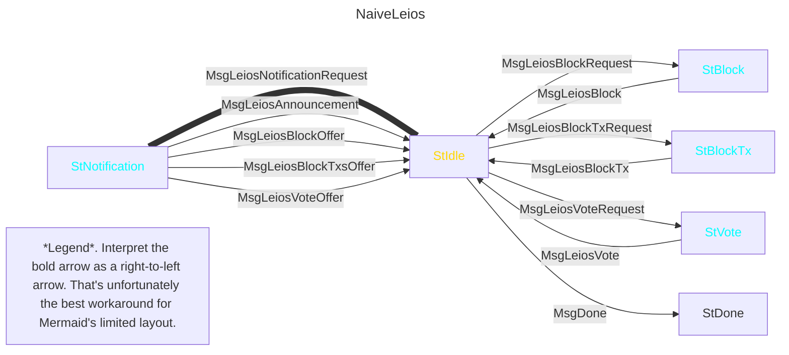
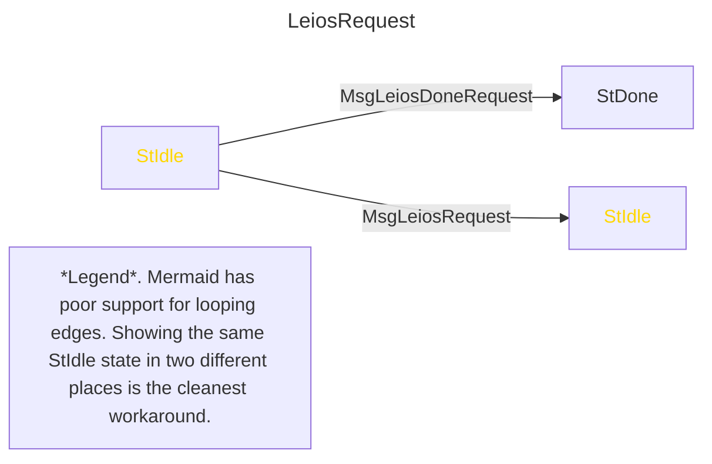
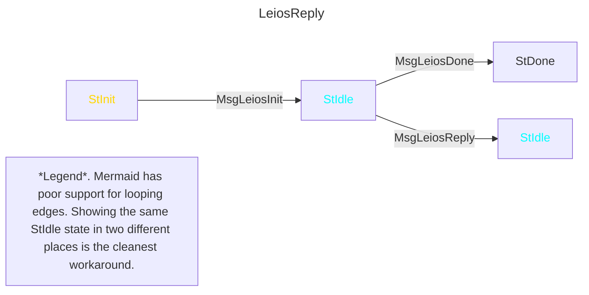

## Naive Mini Protocol

The following mini protocol is superficially plausible for Linear Leios but has some major disadvantages.
They will be explained below in order to motivate/derive the actual mini protocol proposal.



- The foremost problem is that this node cannot have an outstanding request for new notifications and an outstanding request for some specific offered thing at the same time.
  The node has to choose whether to request a new notification or a new delivery, while it should ideally be able to do both simultaneously.
- Another prominent problem is that it's individually requesting small objects (notifications, txs, votes).
  There will be hundreds of votes in-flight at once and potentially thousands of txs.
    - For txs, both requests and responses should always bundled.
      Individual responses have no benefit, since LLBs cannot be fully processed without all of their txs.
      Similarly, requests arise in groups, since LLBs arrive all at once.
    - For notifications and votes, however, it might be beneficial to not bundle them.
      Bundling messages artificially causes all bundled messages to arrive when the last of the bundled messages arrives.
      Unlike txs, it could be useful for some individual notifications and votes to arrive sooner than others.
      For example, perhaps the first bundled vote would have been enough to establish a quorum.
      Or the node might be able to immediately react to the first notification to arrive.
    - Even so, the benefits of eliminating hundreds of messages might outweigh the harm of bundling vote requests and replies when the opportunity arises.
      It's likely a trade-off, with the sweet spot being some bundling but not too much.
      Therefore, the proposed mini protocols are specified to allow response and requests for any potentially-small objects to be bundled.
- This monolothic mini protocol forces replies to be sent in the same order as their responses, since mini protocols have a lock-step semantics.
  The FreshestFirstDelivery scheme, however, naturally implies that a server should usually instead reply to the youngest of the outstanding requests.
    - In the primary interpretation of a mini protocol, the client cannot even send multiple outstanding requests.
    - _Mini protocol pipelining_ does allow exactly that but still does not allow the server to react to subsequent messages before it's done responding to the oldest outstanding message.
    - It seems plausible to somehow add that capability to the `ouroboros-network` infrastructure (eg the server, when it unblocks, only ever receives the latest accumulation of client requests), but so far the simplest option is to split the mini protocol into two less-coupled mini protocols, one for sending requests and one for receiving replies.
- An added bonus of splitting the mini protocols is that it naturally allows for a single (bundled) request to incur multiple replies, without having to delineate that one-to-many relationship as additional states and administrative messages in the mini protocol.
    - Bundling does introduce some complexity, since it creates the possibility of partial replies.
    - However, necessarily requesting txs individually would be unacceptable; an adversarial block could cause honest nodes to request thousands of txs simultaneously, and thousands of individual request-response pairs is an intolerable amount of overhead.
    - Thus, partial replies will at least be possible for txs, and so allowing them for other objects too is merely marginal complexity.
- Finally, the mini protocol itself is replicating messages for different object (txs, votes, blocks) for no reason.

## Proposed Mini Protocol Pair

Those problems no longer exist in the following pair of mini protocols.
The MsgLeiosInit message merely respects the convention that the node that initiates the peer-to-peer connection (ie the gold one) sends the first message in every mini protocol.





There are no longer different messages for blocks, transactions, and votes; messages will simply carry a sum type instead (see below).
The mini protocol itself need not differentiate.

As mentioned, this split naturally relaxs the one reply per request restriction.
However, it even goes beyond many-replies per request; it could allow a single reply to resolve multiple requests.
That is not obviously harmful, but it is also not obviously beneficial.
For the sake of simplicity, that possibility is therefore forbidden: every Leios reply must uniquely identify a single Leios request, and it must not contain any content not identified by that request.
This restriction will be invoked below.

Both of these protocols are particularly unusual in that only one of the peers sends messages.
That incurs at least two immediate disadvantages.

- The medium for back pressure is still present, but much less explicit than it is for existing mini protocols.
    - LeiosReply must only send messages that were requested.
      Thus, whenever the client becomes overwhelmed, they should temporarily stop sending messages via LeiosRequest.
    - LeiosRequest must not send another message if it has already sent, say, 10000 bytes of requests or, say, 1000 individual requests (whichever comes first) that the peer has not yet fully replied to via LeiosReply.
      These exact limits are determined by the exact negotated version of the mini protocol.
- The timeouts for these mini protocols cannot be managed via the existing `ouroboros-network` infrastructure.
    - Existing timeouts begin when the mini protocol enters some state, but these mini protocols spend all of their time in a single state.
    - Moreover, the duration of a timeout was determined by the specific state, but that distinction doesn't exist for these mini protocols.

Even with the naive mini protocol above, the timeouts would have been difficult to manage with the existing infrastructure.
Different replies in the same state (eg StBlockTx) might be several orders of magnitude larger than others.
Instead, the client's centralized decision logic that controls LeiosRequests and reacts to LeiosReply will need to explicitly manage timeouts, and do so in a way that tolerates the server reordering according to FreshestFirstDelivery, for example.

TODO specify the timeouts.
How exactly, given reordering?

## Detailed Message Semantics

The payloads of MsgRequest and MsgReply are MsgRequestPayload and MsgReplyPayload.
These data types are specified in Haskell syntax but are merely tagged unions.

TODO factor out the top-level sum into separate messages in the mini protocols?

```haskell
data MsgRequestPayload
  = LeiosNotificationBytes RequestNo Word16
  | LeiosDeliverableIds RequestNo (NonEmptyList LeiosDeliverableId)

data MsgReplyPayload
  = LeiosNotifications RequestNo CompletionFlag (NonEmptyList LeiosNotification)
  | LeiosDeliveries RequestNo (List LeiosDelivery)

--

type RequestNo = Word64
type CompletionFlag = Bool

type Index16 = Word16
type Bitmap64 = Word64
type SlotNo = Word64

type LeiosPoint = (SlotNo, LeiosBlockHash)

data LeiosNotification
  = LinearLeiosAnnouncement RankingBlockHeader
  | LinearLeiosBlockOffer LeiosPoint
  | LeiosBlockTxsOffer LeiosPoint
  | LinearLeiosVoteOffer SlotNo VoteIssuer

data LeiosDeliverableId
  = LinearLeiosBlockId LeiosPoint
  | LeiosBlockTxsId LeiosPoint (NonEmptyList (Index16, NonEmptyBitmap64))
  | LinearLeiosVoteId SlotNo VoteIssuer

data LeiosDeliverable
  = LinearLeiosBlockDelivery LinearLeiosBlock
  | LeiosBlockTxsDelivery LeiosPoint (NonEmptyList (Index16, NonEmptyBitmap64, List Tx))
  | LinearLeiosVoteDelivery LinearLeiosVote
```

Some name start with merely Leios instead of LinearLeios, because those names will also exist as-is for future Leios variants.

The messages have the following semantics.

| Sender | Name | Semantics |
| - | - | - |
| Client | LeiosNotificationsBytes | Requests an amount of bytes of LeiosNotification. A low-watermark/high-watermark scheme would suffice to ensure there's always sufficient room for more notifications. |
| Server | LinearLeiosAnnouncement | The server has seen this LLB announcement. The peer must never send a third announcement for some election, since two already evidence equivocation. Each header must be as valid as the youngest stable ledger state can determine. |
| Server | LinearLeiosBlockOffer | The server can immediately deliver this block. It must have already sent a LinearLeiosAnnouncement for the same block. |
| Server | LeiosBlockTxsOffer | The server can immediately deliver any tx referenced by this block. For an LLB, it must have already sent a LinearLeiosAnnouncement for the same block. |
| Server | LinearLeiosVoteOffer | The server can immediately deliver this vote. It must have already sent a LeiosAnnouncement for the same slot. |
| Client | LinearLeiosBlockId | The server must deliver this block. The server disconnects if it doesn't have it. |
| Server | LinearLeiosBlockDelivery | The block from a LinearLeiosBlockId. |
| Client | LeiosBlockTxsId | The server must deliver these txs from this Leios block. The server disconnects if it doesn't have the block or its txs. The given bitmap identifies which of 64 contiguous txs are requested, and the offset of the tx corresponding to the bitmap's first bit is 64 times the given index. |
| Server | LeiosBlockTxsDelivery | A subset of the txs from the replicated LeiosBlockTxsId. Note that this bitmap is a non-empty subset of the full bitmap from the corresponding request. |
| Client | LinearLeiosVoteId | The server must deliver this vote. The server disconnects if it doesn't have it. |
| Server | LinearLeiosVoteDelivery | The vote from a LinearLeiosVoteId. |

Additional details.

- The RequestNo of the first request must be zero.
  The RequestNo of each subsequent request must be one greater.
- Every MsgReply identifies the corresponding MsgRequest by its RequestNo.
  If there is no such outstanding request, the client should disconnect.
- If the argument of a LeiosNotificationBytes request is less than some MaxNotificationSize constant determined by the negotiated mini protocol version, the server should disconnect.
  Every MaxNotificationSize constant must accommodate at least any single LeiosNotification carrying the biggest argument it can, so MaxNotificationSize must be no less than the maximum size of a RankingBlockHeader.
- A single LeiosNotificationBytes request may incur multiple LeiosNotifications replies.
  However, every LeiosDeliverableIds request incurs exactly one LeiosDeliveries reply.
  If the client would have beneftied from receiving some of the deliverables sooner than others, it should have sent separate requests.
  (TODO why is this important for BlockFetch but not Leios? Maybe it will be for Leios too, but only for syncing?)
- When FreshestFirstDelivery justifies the client sending two overlapping requests (eg if a younger LLB refers to the same txs as an already requested older LLB), the server might reply in-order or out-of-order, depending on how timings resolve.
  Whichever reply is sent second should exclude the content that was already included in the first reply, in order to not waste bandwidth (recall that it should be common for contemporary LLBs to share most txs).
  In an extreme case, this might cause the argument to LeiosDeliveries to be empty.
- The CompletionFlag indicates whether the server considers this message to completely resolve the corresponding LeiosNotificationsBytes request.
  This would ideally be redundant, but it will at least be useful for troubleshooting related bugs.
  If the client disagrees with a CompletionFlag, it should disconnect.
  The flag should be set on the first notification whose size includes the last byte of the request.
  That same notification might include the first byte of the next LeiosNotificationsBytes request, but it should never also include the last byte of that second request.
  If it does, the client should disconnect, because the lower bound on MaxNotificationSize prevents the server from being forced to send such a message.

TODO write out the CDDL for these messages

TODO discuss fetching "missing" LLBs, eg after L_recover, etc

TODO discuss OpCertIssueNumbers

## Head-of-Line Blocking and Sharing Bandwidth with Praos

There are two more risks that these mini protocols do not inherently address: head-of-line blocking in LeiosReply and limiting how much bandwidth the Praos mini protocols can use.

The existing `ouroboros-network` infrastructure provides some simple mitigation for head-of-line blocking, but the only way to enable it is to split the LeiosReply mini protocol into two copies of itself, so that two concurrent deliveries could be interleaved by the `ouroboros-network` mux.
If one copy of LeiosReply was reserved for messages that were both small and urgent, then the server would be able to provide an urgent notification such as LinearLeiosAnnouncement even if it were already sending a multi-megabyte MsgReply.
That approach might suffice, at least for an initial implementation.
However, duplicating LeiosReply has two drawbacks.

- It's an artifical workaround that would explicitly manifest in the concrete interface between communicating nodes.
  Every node would need to accommodate it, and when the workaround is eventually replaced by something preferable (eg perhaps the mux could allow a single mini protocol to interleave its own messages), the mini protocol specification would need to be updated accordingly, despite the LeiosRequest-LeiosReply pair _already_ accommodating out-of-order replies.
- The existing mux logic is flat, so adding a second Leios mini protocol instance (it's not a third, since LeiosReply only sends messages in the opposite direction) means that Leios would sometimes consume a larger share of the bandwidth that all active mini protocols share.
  This is explicitly undesirable, since Praos messages should always be prioritized over Leios messages---the fundamental restriction is that Leios must not disrupt Praos.
  (A more expressive configuration for the `ouroboros-network` mux would likely also help here; for example, biased sampling of active mini protocols.)

Ideally, the Leios mini protocols would pause completely while ChainSync or BlockFetch are sending.
The `ouroboros-network` mux cannot express that today, but restricting Leios to use at most one "share" of the bandwidth at a time seems tolerable until the `ouroboros-network` mux does somehow allow unfair sharing.

There is another way to mitigiate head-of-line blocking without duplicating LeiosReply.
The client should avoid ever sending a request that incurs a large MsgReply.
Because of the aforementioned restriction that the server must not combine multiple requests into a single message, this allows the client to ensure any head-of-line blocking is insignificant.
For example, if the client tried to never send a single request that incurred more than 100,000 bytes, then---with modern bandwidths---the worst-case head-of-line blocking would be on the order of ten milliseconds.
In the proposed Linear Leios design, the only object that is atomic and potentially larger than that is LLBs, but at most by a factor of three.
(There might be other benefits to explicitly decomposing LLBs, such as being able to stream them across the network.
Remarkably, the proposed mini protocols could accommodate that by merely adding one summand to LeiosDeliverable, since the sub-blocks should have unique hashes.)

TODO this assumes the server `Peer`'s `Yield` would block it would push the total enqueueed past 100,000 bytes?

There is also a way to explicitly prioritize Praos without requiring any changes to `ouroboros-network`, but it seems costly enough to be not be a preferred option.
A pair of mini protocols Request and Reply could handle all communication between two peers.
BlockFetch is simply deliveries (though it explicitly leverages multiple replies per request, in contrast to LeiosDeliverableIds), while ChainSync and TxSubmission are mix of notifications and deliveries.
(KeepAlive is also merely notifications.)
The simplicity and convenience of timeouts for the existing mini protocls---which are crucial for KeepAlive and ChainSync, in particular---would be the primary loss beyond the intuitive distinction no longer being present in the architecture.
Once Praos and Leios are within the same Reply mini protocol, the server could arbitrarily prioritize Praos requests over Leios requests whenever arrival time permits.

### Linear Leios for Syncing Nodes

TODO how to request LLBs on the immutable chain?
I suppose LinearLeiosBlockId is fine, but a range-y request like BlockFetch might be worthwhile if the certificate density is relatively high?
(Which it might be, eg during periods of low utilization?)

TODO when to start sending LeiosNotificationsBytes?
Until you're caught-up, ChainSync and BlockFetch always (modulo L_recover) enable LinearLeiosBlockId, whereas LinearLeiosBlockOffer only does when you're caught-up.
