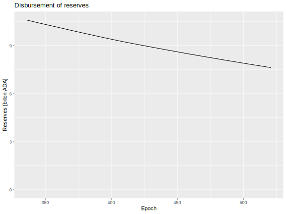

# Challenges for Leios, Part 1

## Cost of storage

Currently, there is no provision for archiving, sharding, or pruning the Cardano ledger. Thus the amount of permanent storage required by each node scales with the size of the transactions it has historically processed.

A rough estimate for the cost of VM disk space is $0.12/GB. Historically, the cost of such disk has dropped 5-20% per year, depending upon the provider. The present value of storage forever is the sum of all future discounted costs:

$$
C_\infty = C_0 \cdot \frac{1 + r}{r}
$$

where $r$ is the monthly discount rate. Assuming $C_0 = 0.12 \text{USD/GB/month}$, we have the following costs of perpetual storage.

| Annual discount | Cost of perpetual storage |
| --------------: | ------------------------: |
|              5% |               $28.92 / GB |
|             10% |                $14.52 /GB |
|             15% |                $9.72 / GB |
|             20% |                $7.32 / GB |

## Rewards received

For recent epochs, the fee paid in blocks per byte of block storage has a mean of 173.01 lovelace/byte.

In the long term (when the Cardano Reserves have been exhausted) the upper bound (if all Ada were staked and block producers never miss blocks) for the fraction of the fee paid to pools and stakers as rewards is 80%. Currently 20.91% of that reward goes to pool operators and the remainder goes to delegators.

## Break-even cost for perpetual storage of blocks

For purpose of this estimate, assume that the goal of 500 stakepools is reached and each stakepool runs one block producer and two relays. Thus, each block will be stored hundreds of times. 

$$
\text{fee revenue} = 173.01 \frac{\text{lovelace}}{\text{B}} \cdot 10^{-6} \frac{\text{ADA}}{\text{lovelace}} \cdot 10^9 \frac{\text{B}}{\text{GB}} \cdot \frac{1}{3 \cdot 500} = 115.34 \frac{\text{ADA}}{\text{GB}}
$$

We can combine this revenue estimate with the previous estimate of storage cost to determine the price of ADA in USD that would be sufficient to exactly pay for perpetual storage.

| Annual discount | Cost of perpetual storage | Break-even price of Ada |
| --------------: | ------------------------: | ----------------------: |
|              5% |               $28.92 / GB |             $0.25 / ADA |
|             10% |                $14.52 /GB |             $0.13 / ADA |
|             15% |                $9.72 / GB |             $0.08 / ADA |
|             20% |                $7.32 / GB |             $0.06 / ADA |

Note that this is a best-case estimate, under the following assumptions:

- There are only 500 stake pools.
- All reward revenue is allocated to pay for perpetual storage of blocks.
- Block producers never fail to produce a block.
- All circulating Ada is staked.
- All Ada is in circulation.

We can recompute with assumption that match the current state of Cardano.
- Approximately 2500 stake pools.
- 17% of Ada is in the Reserve.
- 59% of Ada is staked.

| Annual discount | Cost of perpetual storage | Best break-even price of Ada | Realistic break-even price of Ada |
| --------------: | ------------------------: | ---------------------------: | --------------------------------: |
|              5% |               $28.92 / GB |                  $0.25 / ADA |                       $3.68 / ADA |
|             10% |                $14.52 /GB |                  $0.13 / ADA |                       $1.85 / ADA |
|             15% |                $9.72 / GB |                  $0.08 / ADA |                       $1.24 / ADA |
|             20% |                $7.32 / GB |                  $0.06 / ADA |                       $0.93 / ADA |

## Importance of the Cardano Reserves

The analysis above considers transaction fees as the source of rewards, which will become the case when the Cardano Reserves is exhausted. Currently, however, the Reserves play an important role in funding stake pools. Lately, the Reserves have diminished approximately 0.18% per epoch.

|                                                                          |                                                                          |
| ------------------------------------------------------------------------ | ------------------------------------------------------------------------ |
|  |  |

In fact, approximately 99% of the rewards paid to stake pools come from the Reserves, with only about 1% coming from transaction fees.

## Findings

1. Fees currently average 173.01 lovelace per byte of block.
	1. Under best-case conditions, that fee will cover a cost of 115 ADA per GB of storage across 500 stakepools.
	2. Under more realistic conditions, that fee will only cover a cost of 8 ADA per GB of storage across 2500 stakepools.
2. Stake pools receive on average 20.91% of rewards.
3. The cost of perpetual storage of blocks at VMs ranges $7/GB to $30/GB, strongly depending upon the assumption of how rapidly storage costs decrease in the future.
4. The Cardano Reserves currently supply 99% of the rewards that stake pools and delegators receive.
5. Break even-costs for the price of Ada needed to cover perpetual storage of blocks range from a best case of $0.06/ADA to a worst case of $3.68/ADA.
