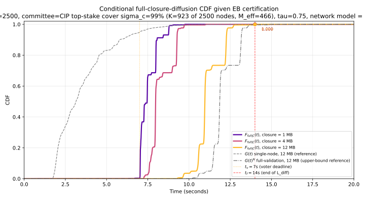
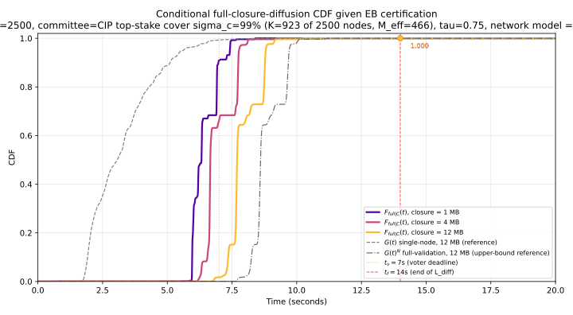
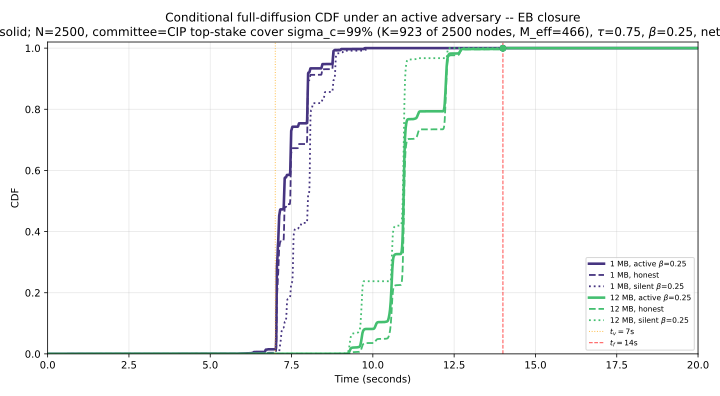
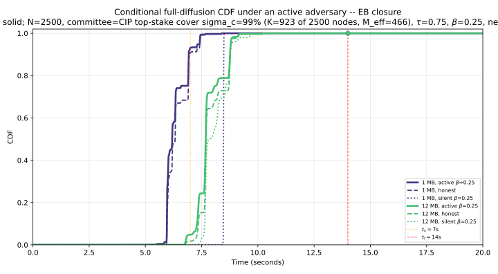

# Full Closure Diffusion Conditional on Certification

This note derives the CDF of full EB-closure diffusion *conditioned on the EB
having certified*, and its behaviour under a partly Byzantine voting committee.
It was originally written as report §5.7/§5.7.1 on the
`yveshauser/improved-deltaq-notebook` branch; this file backports that
material standalone, for the markdown/PDF report pipeline used on this
branch. It assumes the model definitions from `report.md` §4 (in particular
§4.5 Voter Validation Outcome and §4.6 Certification Probability, whose
`p_quorum` reappears below as the quorum function $Q$).

The supporting Python has also been ported into `analysis.py` (functions
`cdf_process_eb_closure`, `cdf_closure_completion`, `_committee_moments`,
`_committee_label`, `_quorum_sf`, `_quorum_given_honest_ontime`,
`_full_diffusion_given_cert_from_G`, `cdf_full_closure_diffusion_given_cert`,
`cdf_full_closure_diffusion_unconditional`, and the
`print_full_closure_diffusion_summary` /
`plot_full_closure_diffusion_given_cert` /
`print_full_diffusion_adversarial_summary` /
`plot_full_diffusion_adversarial` reporting helpers), and all numbers and
plots below are regenerated from that code rather than copied statically.
`_committee_moments` implements the *canonical CIP-0164 stake-truncated
committee* (deterministic top-stake truncation to coverage $\sigma_c$),
matching the notebook branch; this is a more accurate committee model than
`report.md` §4.6's current `compute_p_certified`, which still uses an
older Poisson-binomial election calibrated to a fixed committee *size*
(`committee_size=600`) rather than a stake *coverage* target. The two
committee models are independent in the code (`_committee_moments` is only
used by the functions listed above), so porting this section does not
change any existing §4–§9 numbers in `report.md`; bringing §4.6 onto the
same stake-truncated committee model is a separate, unported piece of the
notebook branch's history (its "Stake-based truncation" commit) and is out
of scope here.

**Regenerating.** These functions are not wired into `analysis.py`'s
`main()` (which drives the rest of `report.md`'s plots); run them directly,
e.g.:

```python
import analysis as A
for model in ("mathis", "cubic"):
    A.set_network_model(model)
    A.set_plot_subdir(model)          # -> plots/<model>/
    A.run_conditional_certification_diffusion(model)
```

---

## 1. Setup

The security assumptions for Linear Leios require that a *certified EB*
reaches almost all honest nodes by the end of $L_\text{diff}$. We are therefore
interested in the conditional CDF

$$F_{\text{full}\mid C}(t)\\;:=\\;P\\!\left(\max_{j=1\ldots N} T_j \le t \\;\bigg|\\; C\right)$$

where $T_j$ is the **EB-closure completion time** at node $j$ and $C$ is the
certification event "the on-time committee votes carry at least a fraction
$\tau$ of the **total active stake** by
$t_v = 3L_\text{hdr}+L_\text{vote}=7\\,\text{s}$". Throughout, $G$ models a
single EB's diffusion in isolation: it does not account for concurrent
traffic from other EBs sharing the network (see Caveats, §7).

## 2. The closure-completion CDF $G$

Unlike the body, the closure is not delivered in one transfer: a node must
receive the EB body, fetch the *missing* fraction $\pi_1\cdot S_{EB\text{-}tx}$
of referenced transactions, and re-apply the whole closure. The per-node
arrival law is therefore the **sequential composition** of stages defined in
report.md §4,

$$G\\;=\\;\underbrace{\texttt{cdf\\_fetch\\_eb\\_body()}}\_{\text{body diffusion}}\\;\otimes\\;\underbrace{\texttt{cdf\\_fetch\\_missing\\_eb\\_closure}(S_{EB\text{-}tx})}\_{\text{fetch missing txs (1-hop)}}\\;\otimes\\;\underbrace{\texttt{cdf\\_process\\_eb\\_closure}(S_{EB\text{-}tx})}\_{\text{process closure (CPU)}}$$

where $\otimes$ is sequential composition, resp. convolution (`cdf_sequential`).
For plotted CDFs of the fetch stages (network-only, CPU excluded), see
`report.md` §5.2 "Network Diffusion of the EB Closure"
(`plots/{mathis,cubic}/network_diffusion.svg`).

## 3. Stake-weighted committee

Certification is **stake-weighted**: by CIP-0164 an EB is certified once the
on-time votes carry at least a fraction $\tau$ of the **total active stake**,

$$\sum_{v\in\text{votes}}\text{stake}(v)\\;\ge\\;\theta,\qquad
\theta:=\tau\cdot S_\text{active},$$

where $S_\text{active}$ is the total active stake. The committee is the
**canonical CIP-0164 voting committee**: a *deterministic* stake-based
truncation. Order SPOs by active stake (descending) and select until their
cumulative stake reaches the target $\sigma_c$ (`stake_cover`; equivalently
the truncation error falls below $\varepsilon_c=1-\sigma_c$). The set is
fixed for the epoch. Each member of the committee votes with weight
$w_i=s_i$. Because the committee holds only a fraction $\sigma_c$ of the
total stake, $S_\text{active}=M/\sigma_c$ and the quorum is
$\theta=\tau\\,M/\sigma_c$, where $M$ is the committee stake (total committee weight).
The committee must contribute $\tau/\sigma_c$ of *its own*
weight (certification is impossible if $\tau>\sigma_c$).

Because per-node closure completion $T_i$ is assumed independent of stake,
committee membership only fixes *which* nodes vote (and with what weight);
each node's completion law is still $G$. Writing the on-time vote total,
when every committee member is independently on time with probability $p$,
as a weighted sum **over the committee**

$$V(p)\\;=\\;\sum_{i\in\text{cmte}} w_i\\,\text{Bern}(p),\qquad
\mathbb{E}[V(p)] = M p,\qquad
\mathrm{Var}[V(p)] = M_2\\,p(1-p),$$

with the committee weight and its second moment

$$M=\sum_{i\in\text{cmte}} w_i=\sum_{i\in\text{cmte}} s_i,\qquad
M_2=\sum_{i\in\text{cmte}} w_i^2=\sum_{i\in\text{cmte}} s_i^2,$$

gives a **weighted Binomial**: all committee members share the same on-time
probability $p$, so there is **no election variance** (the committee is
fixed; the only randomness is each member's on-time indicator). We use the
§4.6 Normal approximation for the upper tail (Step 7 below) and define the
**stake-weighted quorum function**

$$Q(p)\\;:=\\;P\\!\bigl(V(p)\ge \theta\bigr),$$

the probability that the on-time votes meet the quorum $\theta$ when each
member is on time with probability $p$. For $p=G(t_v)$ this is exactly the
§4.6 `p_quorum`. (§8 below generalises $Q$ to a partly Byzantine committee.)

## 4. Closed form

Assuming the $T_j$ are i.i.d. samples from $G$:

$$\boxed{\\,F_{\text{full}\mid C}(t)\\;=\\;G(t)^{N}\cdot
\dfrac{Q\\!\bigl(\min(G(t_v)/G(t),\\,1)\bigr)}{Q\\!\bigl(G(t_v)\bigr)}\\,}$$

with $P(C) = Q(G(t_v))$ the marginal certification probability and the
$\min(\cdot,1)$ folding in the $t<t_v$ branch (an arrived node is then
necessarily fast). The factor $G(t)^{N}$ is the probability that all $N$
nodes have completed the closure. (§8 replaces $N$ by the honest count
$N_h$ once a $\beta$-fraction of the committee is Byzantine.)

## 5. Derivation

**Notation.** For node $i\in\\{1,\dots,N\\}$ let $T_i\sim G$ be its
closure-completion time and $w_i$ its stake weight; the committee is a
fixed set of nodes (written $i\in\text{cmte}$). The only randomness is
timing: the $T_i$ are independent across nodes. Abbreviate $g_v:=G(t_v)$
and, for the fixed evaluation time $t$, $G_t:=G(t)$. The on-time
(stake-weighted) vote total is

$$V_\text{on}\\;:=\\;\sum_{i\in\text{cmte}} w_i\\,\mathbb 1\\{T_i\le t_v\\}.$$

We want $F_{\text{full}\mid C}(t)=P\big(A(t)\mid C\big)$ with

$$A(t):=\Big\\{\max_j T_j\le t\Big\\}=\bigcap_i\\{T_i\le t\\}\ \ (\text{all nodes complete by }t),
\qquad C:=\\{V_\text{on}\ge\theta\\},$$

so by the definition of conditional probability

$$F_{\text{full}\mid C}(t)=\frac{P\big(A(t)\cap C\big)}{P(C)}.$$

All $N$ nodes are honest here; §8 generalises the result to a partly
Byzantine committee.

1. **The denominator $P(C)$.** Write
   $V_\text{on}=\sum_{i\in\text{cmte}} Y_i$ with $Y_i:=w_i\\,\mathbb 1\\{T_i\le t_v\\}$.
   The $Y_i$ are independent, and each takes value $w_i$ with probability
   $P(T_i\le t_v)=g_v$ (else $0$). Hence $V_\text{on}$ is a **weighted
   Binomial**, with

   $$\mathbb E[V_\text{on}]=\sum_{i\in\text{cmte}} w_i\\,g_v=M g_v,\qquad
   \mathrm{Var}[V_\text{on}]=\sum_{i\in\text{cmte}} w_i^2\\,g_v(1-g_v)=M_2\\,g_v(1-g_v),$$

   and $P(C)=P(V_\text{on}\ge\theta)=:Q(g_v)$ (evaluated by the Normal
   approximation of Step 7).

2. **Bucketing the numerator (case $t\ge t_v$).** Using
   $\\{T_i\le t_v\\}\subseteq\\{T_i\le t\\}$, split each node into three
   disjoint buckets:

   $$\underbrace{\\{T_i\le t_v\\}}\_{\text{fast, prob }g_v}\ \uplus
   \underbrace{\\{t_v<T_i\le t\\}}\_{\text{medium, prob }G_t-g_v}\ \uplus
   \underbrace{\\{T_i> t\\}}\_{\text{slow, prob }1-G_t}.$$

   The diffusion event $A(t)=\bigcap_i\\{T_i\le t\\}$ is exactly "**no node is
   slow**". On $A(t)$ we have $\mathbb 1\\{T_i\le t_v\\}=\mathbb 1\\{i\text{ fast}\\}$,
   so the surviving votes are the *fast* ones:

   $$A(t)\cap C=\\{\text{no slow node}\\}\ \cap
   \Big\\{\\,V_\text{fast}\ge\theta\\,\Big\\},\qquad
   V_\text{fast}:=\sum_{i\in\text{cmte}} w_i\\,\mathbb 1\\{i\text{ fast}\\}.$$

3. **Factor out "no slow node".** Because the $T_i$ are independent across
   nodes, conditioning every node on $\\{T_i\le t\\}$ keeps them independent
   and factorises the probability:

   $$P\big(A(t)\cap C\big)
   =\underbrace{P(\text{no slow node})}\_{\displaystyle=\prod_i P(T_i\le t)=G_t^{\\,N}}
   \ \cdot\ P\big(V_\text{fast}\ge\theta\ \big|\ \text{no slow node}\big).$$

4. **Bayes re-bucketing of the conditional law.** For $t\ge t_v$, Bayes'
   rule gives the conditional fast-probability of an *arrived* node:

   $$p_f:=P\big(T_i\le t_v\ \big|\ T_i\le t\big)
   =\frac{P(T_i\le t_v)}{P(T_i\le t)}=\frac{g_v}{G_t}\ \le 1.$$

   Membership is deterministic, so each summand
   $Z_i:=w_i\\,\mathbb 1\\{i\text{ fast}\\}$ ($i\in\text{cmte}$) takes value
   $w_i$ with probability $p_f$ (else $0$), independently across $i$.
   Therefore the conditioned fast-vote total is again a weighted Binomial
   with on-time probability $p_f$:

   $$P\big(V_\text{fast}\ge\theta\mid\text{no slow}\big)=Q(p_f).$$

   (This is the multinomial-collapse trick: merging "fast" and "medium"
   into "not slow" turns the three-way split into a single weighted
   Binomial on the survivors.)

5. **Assemble and divide.** Combining Steps 3–4 and dividing by
   $P(C)=Q(g_v)$,

   $$P\big(A(t)\cap C\big)=G_t^{\\,N}\cdot Q\\!\big(g_v/G_t\big)
   \qquad\Longrightarrow\qquad
   F_{\text{full}\mid C}(t)=\frac{G_t^{\\,N}\\,Q(g_v/G_t)}{Q(g_v)}\quad(t\ge t_v),$$

   which is the boxed form. (§8 replaces $N$ by the honest count $N_h$ and
   lets $Q$ count adversarial seats.)

6. **The case $t<t_v$.** Now $\\{T_i\le t\\}\subseteq\\{T_i\le t_v\\}$, so an
   arrived node is *certainly* fast and $p_f=P(T_i\le t_v\mid T_i\le t)=1$
   (equivalently $g_v/G_t>1$, **capped at 1**). Then
   $V_\text{fast}=\sum_{i\in\text{cmte}} w_i$ is the whole committee weight
   $M$ and

   $$P\big(A(t)\cap C\big)=G_t^{\\,N}\cdot P\Big(\textstyle\sum_{i\in\text{cmte}} w_i\ge\theta\Big)=G_t^{\\,N}\\,Q(1).$$

   Since the committee is **fixed**, $\sum_{i\in\text{cmte}} w_i = M$
   deterministically, so $Q(1)=\mathbb 1\\{M\ge\theta\\}=\mathbb 1\\{\sigma_c\ge\tau\\}=1$
   for the default $\sigma_c=0.99>\tau$: once everyone votes the quorum is
   certain (unlike a random committee, $t<t_v$ contributes no quorum
   shortfall). Writing $p_f=\min(g_v/G_t,\\,1)$ unifies both cases, and at
   $t=t_v$ they agree ($p_f=1$), giving the single boxed formula.

7. **Normal approximation for $Q$.** Each $Q(p)=P\big(V(p)\ge\theta\big)$
   is evaluated with the §4.6 Normal approximation to the (weighted-Binomial)
   vote total $V(p)$, using its mean and variance from the "Stake-weighted
   committee" section above:

   $$Q(p)\approx\Phi^c\\!\left(\frac{\theta-M p}{\sqrt{M_2\\,p(1-p)}}\right),$$

   where $\Phi^c$ is the standard-normal upper tail. This is exactly the
   §4.6 `p_quorum` at on-time probability $p$. (§8 adds the adversary's
   seats to the mean and variance.)

## 6. Numerical results (honest committee)

At $N=2500$ nodes, committee coverage $\sigma_c=0.99$ ($K=923$ of 2500 nodes
by stake, $M_\text{eff}=466$ effective equal-weight votes), $\tau=0.75$,
$t_v=7\\,\text{s}$, $t_f = L_\text{diff}\text{ end}=14\\,\text{s}$, quorum
threshold $\theta=\tau S_\text{active}=699$ (committee weight $M=923$):

**Mathis (Reno/AIMD, conservative):**

| $S_{EB\text{-}tx}$ | $G(t_v)$ | $G(t_f)$ | $P(C)$ | $F_{\text{full}\mid C}(t_f)$ | $G(t_f)^N$ |
|---:|---:|---:|---:|---:|---:|
| 1 MB  | 0.9978 | 1.0000 | 1.0000 | 1.0000 | 1.000 |
| 4 MB  | 0.9965 | 1.0000 | 1.0000 | 1.0000 | 1.000 |
| 12 MB | 0.9482 | 1.0000 | 1.0000 | 0.9990 | 0.996 |

**CUBIC (modern Linux default):**

| $S_{EB\text{-}tx}$ | $G(t_v)$ | $G(t_f)$ | $P(C)$ | $F_{\text{full}\mid C}(t_f)$ | $G(t_f)^N$ |
|---:|---:|---:|---:|---:|---:|
| 1 MB  | 0.9999 | 1.0000 | 1.0000 | 1.0000 | 1.000 |
| 4 MB  | 0.9998 | 1.0000 | 1.0000 | 1.0000 | 1.000 |
| 12 MB | 0.9924 | 1.0000 | 1.0000 | 1.0000 | 1.000 |

(`print_full_closure_diffusion_summary()` in `analysis.py`.)

Even at the largest closure size tested, conditioning on certification
barely moves the diffusion probability at the $L_\text{diff}$ deadline: the
conditional and unconditional ($G(t_f)^N$) columns agree to three decimal
places at 12 MB under Mathis, and CUBIC (faster network) saturates both to
1.0000. The honest-committee case is not where the interesting behaviour
is — see §8.




## 7. Caveats

- **Normal-approximation quorum:** $P(C)$ and the voter factor use the §4.6
  Normal approximation to the stake-weighted vote total (here a weighted
  Binomial over the fixed committee), slightly off only in the extreme
  tails.
- **i.i.d. is pessimistic for "all", and more so for the closure:** real
  $T_j$'s are positively correlated, and closure completion shares *even
  more* structure across nodes than body receipt (common body diffusion
  **and** correlated TxCache hit/miss state), so the true
  $F_{\text{full}\mid C}$ is *larger* than the formula gives.
- **Delivery vs. readiness:** `include_validation=True` (default) charges
  the CPU cost (readiness); set it `False` for delivery-only. That CPU law
  differs by role: full-validation $\mu_\text{eff}$ for the voter /
  certification factors, reapply-only $G_\text{apply}$ for the
  all-honest-nodes diffusion term (see report.md §4's "Two CPU laws").
- **1-hop missing-tx fetch:** the missing closure fraction is fetched in a
  single hop from the peer that forwarded the body; the conservative
  multi-hop variant is available via
  `cdf_fetch_missing_eb_closure(..., use_1hop=False)`.
- **Stake-independent completion assumed:** committee selection is
  stake-based, but $T_i$ is assumed independent of stake. If larger SPOs
  are systematically better-connected, the (top-stake) committee is
  disproportionately fast and $C$ carries less information about the slow
  tail, making the formula optimistic.
- **No concurrent traffic:** $G$ is independent of how much other traffic
  (e.g. other EBs) is diffusing in the network concurrently; contention
  between concurrent EB diffusions is not modeled.

## 8. Adversarial committee

§§1–7 assumed $\beta=0$, an all-honest committee. Suppose instead a fraction
$\beta$ of the committee **stake** is Byzantine (say $\beta = 0.25$): the
adversary controls $\beta M$ of the fixed committee's weight $M$ and the
honest SPOs the remaining $(1-\beta)M$; the honest node population shrinks
to $N_h = (1-\beta)N$. The derivation above goes through unchanged (the
committee / quorum argument never touches the per-node arrival law $G$)
except for the composition of the stake-weighted quorum function $Q$. In
both threat models

$$F_{\text{full}\mid C}(t)\\;=\\;G(t)^{N_h}\cdot
\dfrac{Q\\!\bigl(\min(G(t_v)/G(t),1)\bigr)}{Q\\!\bigl(G(t_v)\bigr)}\qquad,$$

with $P(C)=Q(G(t_v))$, and the two models differ **only** in how the
adversary's $\beta M$ seats enter $Q$. $\beta=0$ recovers the §4 closed
form. Concretely, at
honest on-time probability $p$ the honest votes contribute mean
$(1-\beta)Mp$ and variance $(1-\beta)M_2\\,p(1-p)$ to the vote total
$V_\text{cert}$; the quorum is $\theta=\tau\\,S_\text{active}=\tau M/\sigma_c$
throughout ($\tau$ of the total active stake).

### (a) Active adversaries: vote without diffusing *(the case that matters)*

This is the threat model that actually stresses **Security Assumption 1**.
The adversaries cast their $\beta M$ stake-weighted votes *regardless* of
whether honest diffusion reached them (they may be the EB producer, or
collude to obtain the EB out-of-band), and the protocol cannot tell their
votes from honest ones. They are always "on time" ($p=1$), adding mean
$\beta M$ and **zero added variance** (their $\beta M$ seats are
deterministic) to $V_\text{cert}$. The honest seats then only need to top
the quorum up to $\theta$, i.e. an **expected $(\tau/\sigma_c-\beta)M$**
honest on-time votes instead of $(\tau/\sigma_c)M$. This **weakens the
conditioning**: an EB can certify while *fewer honest nodes have actually
completed it*, so $F_{\text{full}\mid C}$ drops **below** the honest
baseline: the certificate becomes a *weaker* witness that closure diffusion
has occurred.

As $\beta \uparrow \tau/\sigma_c$ the honest requirement
$(\tau/\sigma_c-\beta)M \to 0$: certification becomes certain ($Q\to 1$),
$F_{\text{full}\mid C}(t)\to G(t)^{N_h}$, and the certificate carries **no
information whatsoever** about honest diffusion. The conditional guarantee
therefore degrades smoothly from the honest baseline at $\beta=0$ to the
*unconditional* honest-max curve as $\beta\uparrow\tau/\sigma_c$.

This is the practically important reading: **under an active adversary
holding up to a fraction $\tau/\sigma_c$ of the committee stake,
certification provides progressively less assurance that the EB closure
has actually reached the honest network**, and the honest-committee
conditional curve (§6) is optimistic by a margin that grows with $\beta$.

### (b) Silent adversaries: withhold votes *(benign reference)*

If the same $\beta$ adversaries instead simply **withhold** their votes,
the honest seats alone must meet the absolute quorum $\theta=\tau M/\sigma_c$
(the adversary contributes nothing to $V_\text{cert}$). Since honest stake
tops out at $(1-\beta)M$, this is feasible only if
$(1-\beta)\ge\tau/\sigma_c$, i.e. $\beta \le 1-\tau/\sigma_c \approx 0.24$ at
$\tau=0.75,\ \sigma_c=0.99$, so the default $\beta=0.25$ sits *just past*
the boundary and the silent quorum is effectively unreachable
($P(C)\to 0$). Withholding only makes certification **rarer**, while each
surviving certificate is *stronger* evidence, so $F_{\text{full}\mid C}$
rises *above* the honest baseline. Because this direction *helps* Security
Assumption 1, it is the benign case, included only as the opposite bound.

### Summary

| Model            | adversary seats in $V_\text{cert}$ | honest votes needed (mean) | Feasible when | Effect on $F_{\text{full}\mid C}$ |
|------------------|------------------------------------|----------------------------|---------------|-----------------------------------|
| **Active** (vote w/o diffusing) | $+\beta M$ always-on-time (zero added variance) | $(\tau/\sigma_c-\beta)M$ | $\beta < \tau/\sigma_c$ (info-free at $\beta\ge\tau/\sigma_c$) | **lower** (erodes the guarantee) |
| Honest ($\beta=0$) | —                                | $(\tau/\sigma_c)M$        | always        | baseline                          |
| Silent (withhold) | —                                 | $(\tau/\sigma_c)M$ (from $\le(1-\beta)M$) | $\beta\le 1-\tau/\sigma_c$ | higher (benign)               |

The active curve is the security-relevant lower bound; the honest baseline
and the silent curve sit above it. Because closure completion is strictly
slower than body receipt, these curves already sit lower than a body-only
model would, and the gap widens with $S_{EB\text{-}tx}$, so the
active-adversary curve at large closure sizes is the binding case against
Security Assumption 1.

### Numerical results (adversarial committee, $\beta=0.25$)

Same committee/quorum parameters as §6 ($M=923$, $\tau=0.75$,
$t_f=14\\,\text{s}$, quorum threshold $=699$; active adversary adds
$\approx\beta M = 231$ votes). (`print_full_diffusion_adversarial_summary()`
in `analysis.py`.)

**Mathis:**

| $S_{EB\text{-}tx}$ | model | $P(C)$ | $F_{\text{full}\mid C}(t_f)$ |
|---:|:---|---:|---:|
| 1 MB  | active | 1.000e+00 | 1.0000 |
| 1 MB  | honest | 1.000e+00 | 1.0000 |
| 1 MB  | silent | 5.345e-07 | 1.0000 |
| 4 MB  | active | 1.000e+00 | 1.0000 |
| 4 MB  | honest | 1.000e+00 | 1.0000 |
| 4 MB  | silent | 8.476e-06 | 1.0000 |
| 12 MB | active | 1.000e+00 | 0.9993 |
| 12 MB | honest | 1.000e+00 | 0.9990 |
| 12 MB | silent | 8.994e-08 | 0.9996 |

**CUBIC:**

| $S_{EB\text{-}tx}$ | model | $P(C)$ | $F_{\text{full}\mid C}(t_f)$ |
|---:|:---|---:|---:|
| 1 MB  | active | 1.000e+00 | 1.0000 |
| 1 MB  | honest | 1.000e+00 | 1.0000 |
| 1 MB  | silent | 3.764e-136 | 1.0000 |
| 4 MB  | active | 1.000e+00 | 1.0000 |
| 4 MB  | honest | 1.000e+00 | 1.0000 |
| 4 MB  | silent | 5.695e-42 | 1.0000 |
| 12 MB | active | 1.000e+00 | 1.0000 |
| 12 MB | honest | 1.000e+00 | 1.0000 |
| 12 MB | silent | 6.956e-05 | 1.0000 |

At these parameters (Mathis, $t_f=14\\,\text{s}$) the active-adversary
$F_{\text{full}\mid C}$ at 12 MB is actually *slightly above* the honest
baseline (0.9993 vs 0.9990): both $P(C)$ values round to 1.000, but honest
on-time probability is already so close to 1 by $t_f$ that the adversary's
seats barely move the quorum boundary at this deadline. CUBIC's faster
network pushes the honest on-time probability even closer to 1
(§6: $G(t_v)\ge0.9924$ at 12 MB, vs Mathis's 0.9482), so under CUBIC the
active and honest columns are indistinguishable at 4 significant figures
at every size tested here. The silent case's $P(C)$ collapsing to
$\sim 10^{-136}$–$10^{-5}$ (consistent with $\beta=0.25$ sitting just past
the $\beta\le 1-\tau/\sigma_c\approx0.24$ feasibility boundary from part
(b), and falling faster under CUBIC because the honest on-time probability
$G(t_v)$ is closer to 1, making the shortfall $(1-\beta)M\ge\theta$ an
ever-more-extreme tail event) illustrates that silent-adversary
certification is a rare-event regime. The qualitative effect described in
§8(a) — the active curve dipping *below* honest — is a genuine but small
effect at these parameters; it would show up more clearly at a tighter
$t_f$ (before the honest on-time probability saturates) or a larger
$\beta$.



