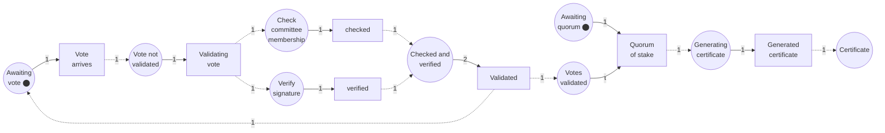

# Supporting information for modeling Linear Leios

This document collects data that might be useful as input into models of Linear Leios. In particular it contains the requisite information for constructing a DeltaQSD model.

| Category        | Item                                                                        | Description                                                                                           |
| --------------- | --------------------------------------------------------------------------- | ----------------------------------------------------------------------------------------------------- |
| Protocol        | [Parameters](#parameters)                                                   | Definitions and approximate values for Leios protocol parameters relevant to network and CPU modeling |
|                 | [Constraints](#constraints)                                                 | Security and protocol constraints on network diffusion and CPU operations                             |
|                 | [Transitions](#transitions)                                                 | Petri-net diagrams for ledger, memory pool, and voting processes                                      |
| Cardano mainnet | [Stake distribution](#stake-distribution)                                   | Statistical model for distribution of stake among SPOs                                                |
|                 | [Transaction size](#transaction-size)                                       | Statistical model for distribution of transaction sizes                                               |
|                 | [Transaction rate](#transaction-rate)                                       | Statistic model for rate of transaction submission                                                    |
|                 | [Ledger operations](#ledger-operations)                                     | Statistical models for CPU required for Apply and Reapply ledger operations                           |
|                 | [Topology](#topology)                                                       | Synthetic topology for mainnet                                                                        |
|                 | [Diffusion of block headers](#diffusion-of-block-headers)                   | Quantiles of arrival times of Praos block headers                                                     |
| Data centers    | [Bandwidth](#bandwidth)                                                     | Bandwidth between cloud data centers                                                                  |
|                 | [Latency](#latency)                                                         | Latencies of pings to discoverable machines                                                           |
| Cryptography    | [Timings for voting and certificates](#timings-for-voting-and-certificates) | Benchmarks for cryptographic operations                                                               |

## Synopsis of Linear Leios

This section summarizes the quantities, processes, and constraints that are key to modeling Linear Leios using a technique like DeltaQSD. See  [CIP-0164](https://github.com/cardano-scaling/CIPs/tree/3616efcdd7455ba6a89053b0e56ff2b43dbe88fa/CIP-0164/README.md) for a detailed discussion.

### Parameters

Linear Leios has three protocol parameters related to time-bounds on some network operations. Its security analysis employs several additional time-related parameters. See the [Protocol Parameters](https://github.com/cardano-scaling/CIPs/tree/3616efcdd7455ba6a89053b0e56ff2b43dbe88fa/CIP-0164/README.md#protocol-parameters) and the [Protocol Security](https://github.com/cardano-scaling/CIPs/tree/3616efcdd7455ba6a89053b0e56ff2b43dbe88fa/CIP-0164/README.md#protocol-security) sections of the proposed CIP.

| Symbol                              | Description                                                                        | Approximate value |
| ----------------------------------- | ---------------------------------------------------------------------------------- | ----------------: |
| $L_\text{hdr}$                      | Duration for RB headers to propagate network-wide                                  |            1 slot |
| $L_\text{vote}$                     | Duration during which committee members can vote on endorser blocks                |           4 slots |
| $L_\text{diff}$                     | Additional period after voting to ensure network-wide EB availability              |           7 slots |
| $\Delta_\text{hdr}$                 | Time for constant size headers to propagate network-wide                           |            1 slot |
| ${\Delta_\text{EB}}^\text{O}$       | EB *diffusion* time (transmission + processing) under favorable network conditions |           3 slots |
| ${\Delta_\text{EB}}^\text{W}$       | EB *transmission* time for certified EBs starting from >25% network coverage       |          15 slots |
| ${\Delta_\text{RB}}^\text{W}$       | Complete ranking block propagation and adoption time                               |           5 slots |
| ${\Delta_\text{applyTxs}}^\text{W}$ | Standard Praos transaction validation time for RB processing                       |            1 slot |
| ${\Delta_\text{reapply}}^\text{W}$  | Certified EB reapplication with minimal checks and UTxO updates                    |          0.5 slot |

### Constraints

| Security constraint                                                                                                          | Description                                                                                                                          |
| ---------------------------------------------------------------------------------------------------------------------------- | ------------------------------------------------------------------------------------------------------------------------------------ |
| $\Delta_\text{reapply} < \Delta_\text{applyTxs}$                                                                             | Reapplying a certified EB cannot cost more than standard transaction processing.                                                     |
| $\Delta_\text{EB}^{\text{W}} < 3 L_\text{hdr} + L_\text{vote} + L_\text{diff} + (\Delta_\text{RB} - \Delta_\text{applyTxs})$ | Any certified EB referenced by an RB must be transmitted (but not necessarily be processed) before that RB needs to be processed. |

| Protocol constraint | Required for  | Value                                                 | Notes                                  |
| ------------------- | ------------- | ----------------------------------------------------- | -------------------------------------- |
| RB header arrives   | voting        | $\leq L_\text{hdr}$                                   |                                        |
| EB validated        | voting        | $\leq 3 L_\text{hdr} + L_\text{vote}$                 |                                        |
| Time to next RB     | certification | $\leq 3 L_\text{hdr} + L_\text{vote} + L_\text{diff}$ |                                        |
| Weight of votes     | certification | $\geq \tau \cdot \text{total stake}$                  | $½ < \tau \, \land \, \tau \lesssim ¾$ |

Furthermore, EB validation (the `Reapply` operation) cannot be completed until all of its transactions are validated (the `Apply` operation) after receipt. Certification is irrelevant if not completed before the next RB is forged.

### Transitions

In the next subsections Petri nets[^petri-nets] are used to represent three of the key processes that consume network and CPU resources in Linear Leios. These processes account for the majority of the delays in operating the protocol. The Petri nets are approximate and do not capture the full details of mini-protocols or all of the opportunities for parallelism.

> [!WARNING]
> The diagrams are notional and are mean to communicate the outlines of the process rather than to formally or precisely specify them.

[^petri-nets]: https://en.wikipedia.org/wiki/Petri_net

#### Updating the ledger after receiving an RB header

The following Petri net illustrates network and CPU operations from the arrival of a new RB header to the complete update of the ledger state, where there are $m$ transactions in the RB and $n$ transactions in the EB: for simplicity in the diagram we assume $m >0$ and $n > 0$. The choice between the `Apply Tx` and `Reapply Tx` transition occurs depending upon whether the transaction is already present in the memory pool, `Check mempool`. The diagram approximates that as many as $c$ transactions may be fetched simultaneously. It omits potential parallelism in updating the ledger.

```mermaid
graph LR

    AwaitRH(("Awaiting
    RB header
    ⬤"))
    
    ArriveRH["<strong>RB header
    arrives</strong>"]
    AwaitRH --"1"--> ArriveRH

    FetchRB((Fetching
    RB body))
    ArriveRH -."1".-> FetchRB

    ArriveRB["RB body
    arrives"]
    FetchRB --"1"--> ArriveRB

    UnvalidatedRbTx(("Awaiting Tx
    application"))
    ArriveRB -."m".-> UnvalidatedRbTx

    CheckRbTx["Check
    mempool"]
    UnvalidatedRbTx --"1"--> CheckRbTx

    ReadyRbTx(("Ready to
    (re)apply Tx"))
    CheckRbTx -."1".-> ReadyRbTx

    ApplyRbTx["Apply Tx"]
    ReadyRbTx --"1"--> ApplyRbTx

    ReapplyRbTx["Reapply Tx"]
    ReadyRbTx --"1"--> ReapplyRbTx

    LedgerRbTx(("Ledger
    updated"))
    ApplyRbTx -."1".-> LedgerRbTx
    ReapplyRbTx -."1".-> LedgerRbTx

    ApplyRB["RB applied"]
    LedgerRbTx --"m"--> ApplyRB

    ReadyLedger(("Ledger ready
    for EB"))
    ApplyRB -."1".-> ReadyLedger

    FetchEH(("Fetching
    EB header"))
    ArriveRH -."1".-> FetchEH

    ArriveEH["EB header
    arrives"]
    FetchEH --"1"--> ArriveEH

    FetchEB(("Fetching
    EB body"))
    ArriveEH -."1".-> FetchEB

    ArriveEB["EB body
    arrives"]
    FetchEB --"1"--> ArriveEB

    AwaitTx(("Awaiting Tx"))
    ArriveEB -."n".-> AwaitTx

    FetchTx["Fetching Tx"]
    AwaitTx --"k ∈ [1, min(c, n)]"--> FetchTx

    UnvalidatedEbTx(("Awaiting Tx
    application"))
    FetchTx -."k".-> UnvalidatedEbTx

    CheckEbTx["Check
    mempool"]
    UnvalidatedEbTx --"1"--> CheckEbTx
    ReadyLedger --"1"--> CheckEbTx

    ReadyEbTx(("Ready to
    (re)apply Tx"))
    CheckEbTx -."1".-> ReadyEbTx

    ApplyEbTx["Apply Tx"]
    ReadyEbTx --"1"--> ApplyEbTx
    ApplyEbTx -."1".-> ReadyLedger

    ReapplyEbTx["Reapply Tx"]
    ReadyEbTx --"1"--> ReapplyEbTx
    ReapplyEbTx -."1".-> ReadyLedger

    LedgerEbTx(("Ledger
    updated"))
    ApplyEbTx -."1".-> LedgerEbTx
    ReapplyEbTx -."1".-> LedgerEbTx

    ApplyEB["<strong>EB validated</strong>"]
    LedgerEbTx --"n"--> ApplyEB
    ReadyLedger --"1"--> ApplyEB

    ApplyEB -."1".-> AwaitRH
```

The timing inputs to the two critical voting constraints, `RB header arrives` and `EB validated`, are highlighted above.

#### Updating the memory pool

The Petri net below illustrates a simplified version of transaction mini-protocol and application of transactions to the memory pool. In it $m$ transactions IDs are received and the transaction bodies for the previously unseen $n$ of them are fetched. The diagram approximates that as many as $c$ transactions may be fetched simultaneously. Transactions are only added to memory pool if they are successfully applied.

```mermaid
graph LR

    ReadyTxId(("Ready for
    TxIds ⬤"))

    AnnounceTx["TxIds 
    announced"]
    ReadyTxId --"1"--> AnnounceTx

    UncheckTx(("Candidate
    Txs"))
    AnnounceTx -."m".-> UncheckTx

    CheckTx["Check
    mempool"]
    UncheckTx --"m"--> CheckTx

    FetchTx(("Fetching
    Txs"))
    CheckTx -."n".-> FetchTx
    CheckTx -."1".-> ReadyTxId

    AnyTxs["Any Txs
    to fetch"]
    FetchTx --"n"--> AnyTxs
    ReadyTxs --"1"--> AnyTxs

    FetchTxs(("Txs to
    fetch"))
    AnyTxs -."n".-> FetchTxs

    ArriveTx["Txs 
    arrive"]
    FetchTxs --"k ∈ [1, min(c, n)]"--> ArriveTx

    ReadyTx(("Ready to
    apply Tx"))
    ArriveTx -."k".-> ReadyTx

    ApplyTx["Apply Tx"]
    ReadyTx --"1"--> ApplyTx

    AppliedTx(("Applied
    Txs"))
    ApplyTx -."1".-> AppliedTx

    UpdateMempool["Update
    mempool"]
    AppliedTx --"n"--> UpdateMempool

    ReadyTxs(("Ready for
    Txs ⬤"))
    UpdateMempool -."1".-> ReadyTxs
```

#### Tallying and certifying votes

In actuality votes would be transmitted as "bundles" of as many votes as fit in a single TCP MTU, and validated in parallel. The diagram below ignores the presence of bundles.

## Approximate models of Cardano mainnet characteristics

### Stake distribution

The stake distribution has an important influence on the number of unique SPOs
involved in each round of Leios voting. It turns out[^stake-distribution] that the cumulative
distribution function for the beta distribution (the
[regularized incomplete beta function](https://en.wikipedia.org/wiki/Regularized_incomplete_beta_function))
with parameters $\alpha = 11$ and $\beta = 1$ nicely fits the empirical distribution of
stake pools at epoch 500, which is simply a power-law distribution.

[^stake-distribution]: https://github.com/input-output-hk/ouroboros-leios/blob/e6ce0f0bfe23abfb860fe582741bbfd56c103f5e/analysis/fiat-accompli.ipynb

$$
\text{fraction of stake held by the fraction $x$ of pools with the least stake} = x^{10}
$$

In the discrete case:

$$
\text{fraction of stake held by the $k$th pool of $n$ pools} = \left( \frac{k}{n} \right )^{10} - \left( \frac{k - 1}{n} \right)^{10}
$$

### Transaction size

Using post-Byron `mainnet` data from `cardano-db-sync`, one can tally the transaction sizes[^transaction-size]. As a rough approximation, we can model the size distribution by a log-normal distribution with  $\mu = 6.93 \, \ln(\text{bytes})$ and $\sigma = 1.13 \, \ln(\text{bytes})$, truncated so that transactions constitute at least 55 bytes.

[^transaction-size]: https://github.com/input-output-hk/ouroboros-leios/blob/e6ce0f0bfe23abfb860fe582741bbfd56c103f5e/analysis/tx.ipynb

### Transaction rate

The transaction rate is well modeled as a Poisson point process[^transaction-size].

### Ledger operations

Measurements of ledger operations on Cardano mainnet are extremely noisy. One can, however, use measurements from the `db-analyser` tool to develop quantile regressions that may be more reliable than linear models.[^apply-reapply] Note that these are block-level regressions: the model for the `Apply` operation can be applied to individual transactions but the model for `Reapply` should be used for whole blocks. Note that the median number of Plutus execution steps per block is 2 Gstep but that can be ten times higher. Also note that it may be possible to build a heteroscedastic regression model for generating synthetic data.

[^apply-reapply]: https://github.com/input-output-hk/ouroboros-leios/blob/e6ce0f0bfe23abfb860fe582741bbfd56c103f5e/analysis/timings/ReadMe.ipynb

| Dependent variable | Quantile | Intercept | Coefficient of transaction count | Coefficient of block size | Coefficient of Plutus steps |
| ------------------ | -------: | --------: | -------------------------------: | ------------------------: | --------------------------: |
| `Apply`            |   50%ile |       n/a |                      0.243 ms/tx |                       n/a |              1.123 ms/Gstep |
|                    |   95%ile |       n/a |                      0.380 ms/tx |                       n/a |              2.120 ms/Gstep |
|                    |   99%ile |       n/a |                      0.519 ms/tx |                       n/a |              2.823 ms/Gstep |
| `Reapply`          |   50%ile |  0.144 ms |                     0.0441 ms/tx |              0.0005 ms/kB |             0.0198 ms/Gstep |
|                    |   95%ile |  0.992 ms |                     0.0510 ms/tx |              0.0045 ms/kB |             0.0527 ms/Gstep |
|                    |   99%ile |  1.276 ms |                     0.0353 ms/tx |              0.0321 ms/kB |             0.0203 ms/Gstep |

### Topology

The aim of the synthetic [pseudo-mainnet topology](https://github.com/input-output-hk/ouroboros-leios/blob/e6ce0f0bfe23abfb860fe582741bbfd56c103f5e/data/simulation/pseudo-mainnet/) is to have a Leios network that is generally representative of the Cardano mainnet:

- Realistic stake distribution
- Realistic number of stake pools
- Two relays for each block producer
- Block producers only connected to their relays
- 10,000 nodes total
- Realistic latencies, generally consistent with the [RIPE Atlas](https://atlas.ripe.net/) `ping` dataset
- Bandwidth consistent with the low end of what is generally available in cloud data centers
- Node connectivity generally consistent with measurements by the [Cardano Foundation](https://cardanofoundation.org/)
- Geographic distribution (countries and autonomous systems) consistent with measurements by the [Cardano Foundation](https://cardanofoundation.org/)

| Metric                       |    Value |
| ---------------------------- | -------: |
| Total nodes                  |    10000 |
| Block producers              |     2657 |
| Relay nodes                  |     7343 |
| Total connections            |   298756 |
| Network diameter             |   6 hops |
| Average connections per node |    29.88 |
| Clustering coefficient       |    0.122 |
| Average latency              |  77.0 ms |
| Maximum latency              | 636.8 ms |
| Bidirectional connections    |    10800 |
| Asymmetry ratio              |   92.77% |

### Diffusion of block headers

An analysis of a subset of [PoolTool](https://pooltool.io/) diffusion data for empty Praos blocks (a surrogate for block headers) on Cardano mainnet yields the following quantiles for the fraction of headers that arrive up to a given time after the start of the slot in which the block was produced[^empty-header]. These data were not fit to an analytic model, but they could be.

[^empty-header]: https://github.com/input-output-hk/ouroboros-leios/blob/e6ce0f0bfe23abfb860fe582741bbfd56c103f5e/analysis/delta-header/analysis.ipynb

| Quantile | Milliseconds from slot time |
| -------- | --------------------------: |
| 50%      |                         309 |
| 75%      |                         467 |
| 80%      |                         508 |
| 85%      |                         561 |
| 90%      |                         675 |
| 95%      |                       1 169 |
| 99%      |                       3 108 |
| 99.5%    |                       3 643 |
| 99.9%    |                      13 970 |

## Empirical data on cloud datacenters

### Bandwidth

Intra-datacenter bandwidth can safely be assumed to exceed 1 Gb/s (= 125 MB/s). Anecdotal measurements[^internet-bandwidth] of inter-datacenter bandwidth indicate that 100 Mb/s (= 12.5 MB/s) is a conservative lower bound. Note that if a machine opens many sockets between datacenters, bandwidth appears only drop by about 25% due to packets from the different sockets taking different routes. Representative measurements are summarized below.

[^internet-bandwidth]: https://github.com/input-output-hk/ouroboros-leios/blob/e6ce0f0bfe23abfb860fe582741bbfd56c103f5e/docs/technical-report-2.md#inter-datacenter-bandwidth-measurements

| Sender                   | AWS Oregon USA | CenturyLink Colorado USA | OVH Canada | OVH France | OVH Oregon USA | OVH Poland | OVH United Kingdom | OVH Virginia USA |
| ------------------------ | -------------: | -----------------------: | ---------: | ---------: | -------------: | ---------: | -----------------: | ---------------: |
| AWS Oregon USA           |                |                 824 Mbps |   329 Mbps |   138 Mbps |       973 Mbps |   141 Mbps |           153 Mbps |                  |
| CenturyLink Colorado USA |       826 Mbps |                          |    97 Mbps |            |       418 Mbps |   147 Mbps |           166 Mbps |                  |
| OVH Canada               |       327 Mbps |                   9 Mbps |            |   304 Mbps |       363 Mbps |   219 Mbps |           307 Mbps |                  |
| OVH France               |       136 Mbps |                          |   301 Mbps |            |       179 Mbps |   915 Mbps |           373 Mbps |         288 Mbps |
| OVH Oregon USA           |       972 Mbps |                 412 Mbps |   360 Mbps |   182 Mbps |                |   142 Mbps |           164 Mbps |         367 Mbps |
| OVH Poland               |       141 Mbps |                 145 Mbps |   469 Mbps |            |       144 Mbps |   918 Mbps |           355 Mbps |         229 Mbps |
| OVH United Kingdom       |       153 Mbps |                 163 Mbps |   305 Mbps |   371 Mbps |       162 Mbps |            |                    |         308 Mbps |
| OVH Virginia USA         |                |                 309 Mbps |            |   290 Mbps |       369 Mbps |   231 Mbps |           310 Mbps |                  |

### Latency

A data table of ASN-to-ASN round-trip times (RTT) for pings was computed[^internet-latency] from the [RIPE Atlas](https://www.ripe.net/analyse/internet-measurements/ripe-atlas/), which is one of the largest internet measurement networks.

[^internet-latency]: https://github.com/input-output-hk/ouroboros-leios/blob/e6ce0f0bfe23abfb860fe582741bbfd56c103f5e/data/internet/graphics.ipynb

|              | Country to country |   ASN to ASN | Intra-ASN |
| ------------ | -----------------: | -----------: | --------: |
| 1st quartile |            98.0 ms |      30.2 ms |           |
| Median       |           176.9 ms |      95.4 ms |           |
| Mean         |           179.2 ms |     114.1 ms |   80.4 ms |
| 3rd quartile |           248.2 ms |     173.2 ms |           |

## Timings for voting and certificates

The Rust prototype reference implementation for Leios's voting and certificate cryptograph was used to benchmark the CPU resources required for the various operations[^crypto-benchmarks].

[^crypto-benchmarks]: https://github.com/input-output-hk/ouroboros-leios/blob/e6ce0f0bfe23abfb860fe582741bbfd56c103f5e/crypto-benchmarks.rs/Specification.md

- Sortition
    - _Input blocks:_ 230 µs
    - _Endorser blocks:_ 230 µs
    - _Persistent voters:_ 5.5 ms (once per epoch)
    - _Non-persistent voters:_ 230 µs (once per pipeline)
- Vote
    - _Verify the proof of key possession:_ 1.5 ms/key
    - _Generate vote:_
        - _Persistent:_ 135 µs/vote
        - _Non-persistent:_ 280 µs/vote
    - _Verify vote:_
        - _Persistent:_ 670 µs/vote
        - _Non-persistent:_ 1.4 ms/vote
- Certificate (for a realistic number of pools, stake distribution, and committee size)
    - _Generate certificate:_ 90 ms/cert
    - _Verify certificate:_ 130 ms/cert
    - _Determine weight (i.e., total stake voted for) in certificate:_ 5.9 ms/cert
- Serialization
    - _Key registration:_ 1.1 µs
    - _Vote:_ 630 ns
    - _Certificate:_ 65 µs
- Deserialization
    - _Key registration:_ 52 µs
    - _Vote:_ 19 µs
    - _Certificate:_ 2.7 ms

As a general rule of thumb, assume that 80% of votes are persistent and 20% are non-persistent.

Here are details for how certificate operations vary with committee size. Certificates typically comprise 8000 bytes.

| Number of pools | Number of committee seats | Generate certificate | Verify certificate | Weigh certificate |
| --------------: | ------------------------: | -------------------: | -----------------: | ----------------: |
|            2500 |                       500 |              63.4 ms |           104.8 ms |           10.6 ms |
|            2500 |                       600 |              71.1 ms |           116.9 ms |           12.0 ms |
|            2500 |                       700 |              77.4 ms |           125.5 ms |           12.3 ms |
|            2500 |                       800 |              83.5 ms |           134.4 ms |           12.8 ms |
|            2500 |                       900 |              88.2 ms |           141.1 ms |           12.4 ms |
|            2500 |                      1000 |              92.5 ms |           144.9 ms |           12.3 ms |

