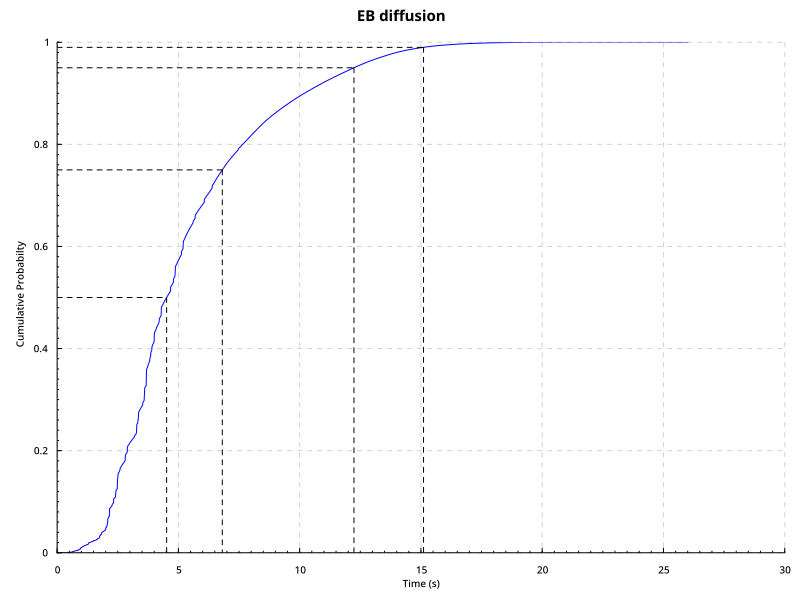

# DeltaQ / Statistics library for Ourobors Praos and Leios

The library provides a [DeltaQ](https://github.com/DeltaQ-SD/deltaq/) model for Linear Leios.

## DeltaQ backend
The piecewise-polynomial backend in DeltaQ is [not built for modeling complex systems](https://github.com/DeltaQ-SD/deltaq/blob/main/doc/reports/artefact-A4.md#conclusion-and-next-steps). Due to this restriction, for running the model for Linear Leios we implemented a new, [experimental backend](https://github.com/yveshauser/deltaq/blob/experimental/lib/deltaq/src/DeltaQ/Sampled.hs) for DeltaQ that operates on discrete values representing a probability distribution.

## Linear Leios DeltaQ analysis

The DeltaQ analysis of linear Leios validates the following assumptions:

* Reapplying a certified EB cannot cost more than standard transaction processing
* Any certified EB referenced by an RB must be transmitted before that RB is processed

### Parameter estimates

#### $L\_{hdr}$

#### $L\_{vote}$

The parameter $L\_{vote}$ needs to be chosen carefully, because if the length of the interval is

* too short, then there is probably not enough time to get sufficient votes to reach a quorum
* too long, then there is probably already a new RB/EB before all votes are delivered

The first item depends on the block/vote diffusion times, whereas second item depends only on the Praos schedule.

#### $L\_{diff}$

### Statistics

The statistisics depend on the protocol parameters and other configurations. The following values are calculated

|Statistic|Dependencies|Description|
|---|---|---|
|`pHeaderOnTime`|$L\_{hdr}$|Probability that an RB header arrives during $L\_{hdr}$|
|`pValidating`|$L\_{hdr}$, $L\_{vote}$|Probability that an EB can be validated on time|
|`pQuorum`|`pValidating`, committee size, number SPO|Probability of reaching a quorum|
|`pInterruptedByNewBlock`|$L\_{hdr}$, $L\_{vote}$, $L\_{diff}$|Probability of getting a new block too early|
|`pCertified`|`pInterruptedByNewBlock`, `pQuorum`|Probability that there is a certificate in the next RB|
|`eCertified`|$L\_{hdr}$, $L\_{vote}$, $L\_{diff}$|expected time for next certified block|

### Plots



## Running the code

Run the analysis generate diagrams as follows:

```
$ cabal run leios-deltaq-analysis stats
```
```
$ cabal run leios-deltaq-analysis plots
```
```
$ cabal run leios-deltaq-analysis estimates
```
