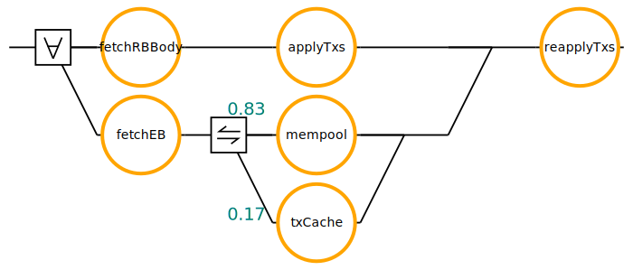
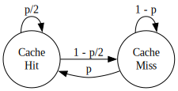
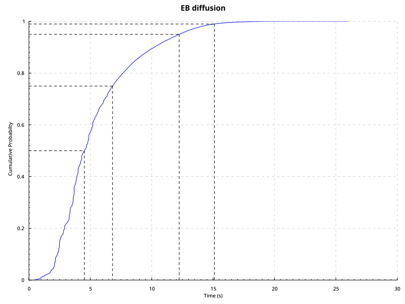

# $\Delta\text{Q}$ Model for $\Delta_\text{EB}$ in Linear Leios

*Related issue:* [#543 – Create ΔQ model to investigate ΔEB and protocol parameters](https://github.com/input-output-hk/ouroboros-leios/issues/543)

## 1. Motivation

The security of the Linear Leios protocol depends on $\Delta_\text{EB}$, the time within which an Endorser Block (EB) must diffuse across the network as outlined in [CIP-164](https://github.com/cardano-scaling/CIPs/blob/leios/CIP-0164/README.md).

Early simulations suggested $\Delta_\text{EB}$ is manageable under happy-path conditions. This report validates that assumption using a $\Delta\text{Q}$ System Development model.

The $\Delta\text{Q}$ model for Linear Leios is a complement to the Haskell and Rust simulations to gain confidence in the parameter selection for Linear Leios, resp. a precursor to running simulations, as it can rule out infeasible parameter selections.

## 2. Background

### 2.1 Linear Leios Protocol

Linear Leios is designed around the key insight: Praos block production only occupies roughly 25% of slot time, leaving significant unused network bandwidth and computational capacity during "calm periods". Linear Leios exploits this headroom to achieve high throughput while preserving Praos security guarantees.

The protocol behavior is governed by several [protocol parameters](https://github.com/cardano-scaling/CIPs/blob/leios/CIP-0164/README.md#protocol-parameters), in particular timing parameters that control the duration of diffusion and voting intervals. Their values must be chosen carefully in order for Linear Leios to achieve higher performance and throughput, as the following constraints illustrate:

* $L_\text{hdr}$ must be large enough to allow RB headers to diffuse across the network before the voting phase begins
* $L_\text{vote}$ must be calibrated carefully: too short and there is insufficient time to accumulate the votes needed for a quorum; too long and a new RB may arrive before all votes are delivered
* $L_\text{diff}$ must be large enough that, after a quorum is reached, all remaining nodes can receive and apply the EB before the next RB is produced - a prerequisite for the Leios security guarantees to hold

#### 2.1.1 Security Analysis

The security analysis of Linear Leios is based on the following assumptions:

* Certified EBs are delivered to all block producing nodes in the worst case at the end of $L_\text{diff}$
* Reapplying an EB plus verifying the correctness of the EB certificate is computationally less expensive than applying an RB

This analysis adopts a stronger version of the first assumption than the CIP requires: every certified EB must reach all honest block-producing nodes by the end of $L_\text{diff}$, i.e., within $\Delta_\text{EB}$ slots of its creation.

$\Delta_\text{EB}$ plays a role in Leios analogous to the $\Delta$ parameter in Ouroboros Praos[^2] - both bound the time within which a message must reach all honest block producers, and a violation in either case can cause a fork. In Leios, if $\Delta_\text{EB}$ is violated, a block producer may receive a new RB carrying a certificate that references an EB the local node has not yet received. That node therefore does not know about the transactions in the EB and has not updated its ledger state accordingly, leading to a divergence in perceived ledger state. The parameter $L_\text{diff}$ is therefore critical: it reserves enough time after a quorum is reached for the EB to finish diffusing to all remaining nodes, during $L_\text{diff}$ no new RB is being added to the chain giving those nodes the opportunity to receive and apply the EB.

[^2]: The Praos requirement is that 95% of blocks arrive and are validated within 5 seconds

### 2.2 $\Delta\text{Q}$ System Development

∆Q is a modelling tool to analyse the performance characteristics of a distributed system. Outcomes in $\Delta\text{Q}$ are represented as probability distributions of completion times. $\Delta\text{Q}$ is implemented as a domain specific language (DSL) providing the following constructors

| Constructor   | Meaning                              |
| ------------- | ------------------------------------ |
| `never`       | Outcome that never finishes          |
| `wait t`      | Deterministic delay of `t` seconds   |
| `uniform t s` | Uniform distribution between `t` `s` |

and combinators to build more complex abstractions:

| Operator   | Meaning                                                                      |
| ---------- | ---------------------------------------------------------------------------- |
| `a .>>. b` | Sequential composition: `a` then `b`                                         |
| `a .\/. b` | First to finish: `a` or `b`                                                  |
| `a ./\. b` | All to finish: `a` and `b`                                                  |
| `p a b`    | Probabilistic choice: `a` with probability `p`, `b` with probability `1 - p` |

The $\Delta\text{Q}$ library uses a backend abstraction for computations such as convolution for sequential composition. It provides the [piecewise-polynomials](https://github.com/DeltaQ-SD/deltaq/tree/main/lib/probability-polynomial) backend as default. For running complex models, we implemented a new backend called [sampled](https://github.com/yveshauser/deltaq/blob/experimental/lib/deltaq/src/DeltaQ/Sampled.hs). They compare as follows:

- *piecewise-polynomials* is an analytic backend, i.e., exact results, but the computational complexity of the backend does not allow running complex models
- *sampled* is an approximation backend with efficient computation, but accuracy is hard to control

## 3. Network Model

### 3.1 Network Topology

The block diffusion model used in this library has been taken from the [Praos performance model](https://github.com/IntersectMBO/cardano-formal-specifications/blob/909f0cc981d5e38a6de1791860ccd7249ade3aa4/src/performance/app/PraosModel.lhs).

The network is modelled as a random graph in which nodes have a fixed number of peers. Block diffusion across multiple hops is captured by sequential composition of per-hop $\Delta\text{Qs}$. A single hop is characterised by the transfer time for a given block size and the geographic distance between the two endpoints. Following the Praos model, three distance categories are distinguished:

| Distance | Description          | Round trip time (RTT) |
| -------- | -------------------- | --------------------- |
| Short    | Same data centre     | 0.012 s               |
| Medium   | Same continent       | 0.069 s               |
| Long     | Different continents | 0.268 s               |

Each category yields a deterministic transfer time for a given block size. The one-hop $\Delta\text{Q}$ assigns equal probability to each distance category. The end-to-end diffusion $\Delta\text{Q}$ for $n$ hops is the $n$-fold sequential composition of the one-hop $\Delta\text{Q}$. To account for the variable path length in a random graph, the multi-hop $\Delta\text{Qs}$ are combined via probabilistic choice, weighted by the empirical path-length distribution of a regular random graph with 2500 nodes of degree 10 (Table below, sourced from the Praos model):

| Path length | Probability (%) |
| ----------- | --------------- |
| 1           | 0.40            |
| 2           | 3.91            |
| 3           | 31.06           |
| 4           | 61.85           |
| 5           | 2.78            |

The resulting blended $\Delta\text{Q}$ captures the distribution of end-to-end transfer times over the expected variety of paths in the network.

An alternative path-length distribution was calculated by the [topology-checker](https://github.com/input-output-hk/ouroboros-leios/tree/main/topology-checker) tool from a mainnet-like topology. It is implemented in [`DeltaQ.Praos`](../src/DeltaQ/Praos.hs) (see `hopCount`), but is not currently used in the model:

| Path length | Probability (%) |
| ----------- | --------------- |
| 1           | 19.28           |
| 2           | 39.06           |
| 3           | 28.55           |
| 4           | 10.79           |
| 5           | 2.16            |
| 6           | 0.16            |

This distribution reflects the actual peer-to-peer topology of the Cardano mainnet rather than a synthetic random graph, and could be substituted for the Praos path-length distribution to ground the model more closely in real network conditions.

### 3.2 Stake Distribution

Stake is distributed across nodes in a pattern derived from mainnet. The stake distribution determines the RB production rate: nodes with more stake win the RB sortition lottery more frequently.

The distribution is modelled as a power law fitted to mainnet data. For $n$ nodes ranked by stake, the relative stake of node $k$ is:

$$s_k = \left(\frac{k+1}{n}\right)^{10} - \left(\frac{k}{n}\right)^{10}$$

This concentrates stake among a small number of large pools, reflecting the actual mainnet dynamics where a minority of stake pools control the majority of stake. The derivation of this model is documented in the [linear-leios-preliminaries](../../linear-leios-preliminaries.md#stake-distribution).

## 4. $\Delta\text{Q}$ Model of EB Diffusion

The $\Delta\text{Q}$ model of EB diffusion captures the steps a node performs upon receiving an RB header:

* Fetch the RB body and the EB concurrently
* On receiving the RB body, apply its transactions to the ledger state
* On receiving the full EB, determine which transactions are missing and fetch them. Unlike the RB - which carries full transaction data in its body - the EB contains only transaction IDs
* Only once both of the above steps complete is the reapply operation applied to the ledger state

The outcome diagram then looks as follows[^3]:
[^3]: Refer to "Mind Your Outcomes" for an explanation of outcome diagrams



With $\Delta\text{Q}$, the typical workflow starts from a coarse-grained model describing high-level outcomes and then refining it to improve accuracy. However, finer-grained models generally increase complexity, forcing a switch to a backend that calculates approximate solutions, creating a trade-off between performance and accuracy. For Linear Leios, we chose a low-complexity model and ensure accuracy. The low-complexity model is possible by leveraging empirical distributions from measurements and probabilistic modelling.

### 4.1 Empirical distributions

Several operations in the $\Delta\text{Q}$ model are grounded in empirical timing measurements taken from a Cardano mainnet node rather than synthetic assumptions. Two operations are of particular interest:

- **`applyTx`:** The cost of validating a transaction against the current ledger state for the first time. This is the work a node performs when it receives a fresh transaction from the mempool. Measurements show a wide spread: roughly 28% of transactions complete in under 5 ms, 65% in under 10 ms, and about 8% take longer than 10 ms.

- **`reapplyTx`:** The cost of re-validating a transaction that has already been validated before. Because script execution can be skipped, reapply is substantially cheaper than apply: roughly 42% of transactions complete in under 1 ms and fewer than 2% take more than 10 ms.

### 4.1.1 Batch processing

For batch processing the total processing time is the sum of $n$ independent per-transaction durations. By the *Central Limit Theorem*, this sum converges to a normal distribution $nZ \sim \mathcal{N}(n\mu, n\sigma^2)$ as $n$ grows. The per-transaction mean $\mu$ and standard deviation $\sigma$ are taken directly from the mainnet measurements in the case of `applyTx` and `reapplyTx`.

Since the number of transactions $n$ in a block is itself variable, it is modelled as uniform over $n \sim \mathcal{U}(1, N)$. The resulting aggregate is a scale mixture distribution whose CDF is:

$$F(x) = \frac{1}{N} \sum_{n=1}^{N} \Phi \left(\frac{x - n\mu}{\sqrt{n}\,\sigma}\right)$$

where $\Phi$ is the standard normal CDF. The two batch distributions use the following parameters derived from the empirical data:

| Operation    | $N$ (max transactions) | $\mu$ (mean, ms) | $\sigma$ (std dev, ms) |
| ------------ | ---------------------- | ---------------- | ---------------------- |
| `applyTxs`   | 100                    | 10.60            | 25.49                  |
| `reapplyTxs` | 2500                   | 2.71             | 24.42                  |

### 4.2 Markov model for TxCache

When an EB arrives at a node, its transactions may already be present in the local transaction cache (a cache hit), or they may need to be fetched from the network (a cache miss). To model this, we use a two-state Markov chain parameterized by $p$, the probability that a given transaction is in the cache[^1].

[^1]: This model was introduced by Nick in the Leios monthly presentation in February 26



With states ordered as (miss, hit), the transition matrix is:

$$M = \begin{pmatrix} 1-p & p \\\ 1-p/2 & p/2 \end{pmatrix}$$

Solving the stationary condition $\pi M = \pi$ yields the steady-state distribution:

$$\pi_1 = \frac{2-p}{2+p}, \quad \pi_2 = \frac{2p}{2+p}$$

The steady-state $\pi_2$ is the long-run fraction of transactions that are cache hits. It differs from the raw parameter $p$ because the transition probabilities are asymmetric: from a miss, the probability of transitioning to a hit is $p$, whereas from a hit, the probability of staying in the hit state is only $p/2$. For a batch of transactions drawn from the steady-state distribution, the effective hit rate is:

$$r = \pi_2 \cdot p + \pi_1 \cdot (1 - p)$$

This is used in the $\Delta\text{Q}$ model to weight the two processing branches — with probability $r$ a transaction can be reapplied cheaply from the cache; with probability $1 - r$ it must first be fetched from the network.

The model uses $p = 0.75$, giving $\pi_1 \approx 0.455$, $\pi_2 \approx 0.545$, and an effective batch hit rate of $r \approx 0.523$. Higher values of $p$ increase $r$ and therefore lower the EB processing latency.

## 5. Results

### 5.1 Cumulative distribution function for $\Delta_\text{EB}$

The $\Delta\text{Q}$ model yields the following completion-time distribution for EB diffusion:



- **Median diffusion time:** 4.91 seconds
- **75th percentile:** 7.13 seconds
- **95th percentile:** 12.57 seconds
- **99th percentile:** 15.41 seconds

### 5.2 Protocol Security Validation

#### 5.2.1 Safety

The $\Delta\text{Q}$ model gives a high probability that under the proposed parameters ($L_\text{hdr}=1$, $L_\text{vote}=4$, $L_\text{diff}=7$) an EB reaches all honest block-producing nodes before the end of $L_\text{diff}$:

```haskell
ghci> fromRational (successWithin validateEB 14) :: Double
0.9753948688574636
```

The EB diffusion completes within
$L := 3 L_\text{hdr} + L_\text{vote} + L_\text{diff} = 14$ with probability 97.54%.

This means that for $L = 14$ the saftey property holds for Linear Leios.

#### 5.2.2 Liveness

As a liveness metric we look at the probability that there is a certificate in the next RB. An EB becomes certified when two independent conditions both hold:

* a quorum of votes is collected within $L_\text{vote}$
* no new RB interrupts the process before the full window $L$ elapses

The certification probability is therefore:

$$P_\text{certified} = P_\text{quorum} \times (1 - P_\text{interrupted})$$

$P_\text{interrupted}$ is derived from the Praos block-production distribution, which is modelled as a Poisson process with the active slot coefficient as rate parameter. Therefore the waiting time to the next RB is exponentially distributed and the probability that an RB arrives within $L$ slots is:

$$P_\text{interrupted} = 1 - e^{-f L}$$

For $f = 1/20$ and $L = 14$ this gives $P_\text{interrupted} \approx 50.3\%$.

$P_\text{quorum}$ depends on $P_\text{validating}$ - the probability that an EB is validated before the end of $L_\text{vote}$. This is calculated in Haskell as follows:

```haskell
ghci> fromRational (successWithin validateEB 7) :: Double
0.7414282609198065
```

The calculation of $P_\text{quorum}$ is taken from an early version of the [markov chain simulation](../../../markov/) for Linear Leios: Each of the 2500 stake pool operators (SPOs) is independently elected to the voting committee via a Poisson sortition: SPO $i$ with relative stake $s_i$ is elected with probability $1 - e^{-\tilde{m} s_i}$, where $\tilde{m}$ is calibrated so that the expected committee size equals $m = 600$. If elected, SPO $i$ casts a successful vote with probability $P_\text{validating}$, so its individual success probability is $p_i = P_\text{validating} \times (1 - e^{-\tilde{m} s_i})$. The total vote count $V = \sum_i X_i$ with $X_i \sim \text{Bernoulli}(p_i)$ is approximated by a normal distribution via the Central Limit Theorem:

$$V \sim \mathcal{N}(\mu, \sigma^2), \quad \mu = \sum_i p_i, \quad \sigma^2 = \sum_i p_i(1-p_i)$$

The quorum probability is then:

$$P_\text{quorum} = P(V \geq \tau m) \approx 1 - \Phi \left(\frac{\tau m - \mu}{\sigma}\right)$$

For the proposed parameters ($P_\text{validating} \approx 74.1\%$, $m = 600$, $\tau = 3/4$), the quorum threshold is $450$ votes and $\mu \approx 444.9 < 450$, giving $P_\text{quorum} \approx 35.9\%$.

The probability that an EB will be certified can be calculated in Haskell as follows:

```haskell
ghci> let config = Config { name = "CIP", lHdr = 1, lVote = 4, lDiff = 7, numberSPOs = 2500, committeeSizeEstimated = 600, τ = 3 % 4, f = 1 % 20 }
ghci> pCertified config
0.17805177733045532
```

This provides evidence that the proposed parameters are viable and consistent with the security requirements of the Leios protocol as specified in CIP-164.

## 6. Conclusions

This report has presented a $\Delta\text{Q}$ System Development model for EB diffusion in Linear Leios, grounded in empirical network and transaction-processing data. The model addresses the central security question: can certified EBs realistically reach all honest block-producing nodes within the $\Delta_\text{EB}$ deadline under realistic network conditions, without modelling adversarial behaviour?

The analysis shows that under the proposed parameters ($L_\text{hdr}=1$, $L_\text{vote}=4$, $L_\text{diff}=7$), the EB diffusion completes within the deadline with a probability of 97.54%, providing strong evidence that the parameter choices in CIP-164 are sound.

## 7. Limitations and Future Work

* This model assumes honest node behavior. Adversarial delay of EBs - for example, an adversary deliberately withholding an EB until just before the voting deadline - is not captured here
* With the `piecewise-polynomial` $\Delta\text{Q}$ backend computational complexity is hard to control, where as with the `sampled` backend it is the accuracy of the results. For this analysis to be successful, we built probabilistic models and then combined those using $\Delta\text{Q}$ in order to get a model with low complexity to be executable with the default backend
* Adjust sortition mechanism to Fait Accompli
* When input parameters are means or point estimates rather than full probability distributions (or when the distributions used do not adequately capture tail behaviour) high-percentile outputs such as the 99th percentile should be interpreted with caution, as these extremes can be sensitive to the underlying assumptions
* The model does not account for Freshest First Delivery (FFD) of EBs as specified in CIP-164. FFD prioritises the most recently produced blocks during diffusion, which can delay older EBs and worsen their individual diffusion latency; incorporating it would require modelling the interaction between concurrent EB diffusions
* Future work should improve the `sampled` backend to keep track of the error margin, in order to be able to run the analysis in reasonable time and being able to quantify the inaccuracy introduced by the simulations

## Appendix A: Haskell Source

The Haskell source implementing the $\Delta\text{Q}$ model described in this report is located at:

```
analysis/deltaq/linear-leios/
```

To build and run using nix:

```bash
nix develop
```

The following executables are available:

| Executable                         | Description                                                    |
| ---------------------------------- | -------------------------------------------------------------- |
| `cabal run leios-deltaq-estimates` | Print estimated values for $L_\text{vote}$ and $L_\text{diff}$ |
| `cabal run leios-deltaq-plots`     | Generate CDF plots as SVG files                                |
| `cabal run leios-deltaq-stats`     | Compute statistics for all configurations                      |
| `cabal run leios-deltaq-diagrams`  | Generate the EB-validation outcome diagram                     |

## Appendix B: References

* [CIP-164 – Ouroboros Leios](https://github.com/cardano-scaling/CIPs/blob/leios/CIP-0164/README.md)
* [Supporting information for modeling Linear Leios](https://github.com/input-output-hk/ouroboros-leios/blob/main/docs/)
* [Mind Your Outcomes: The ∆QSD Paradigm for Quality-Centric Systems Development and Its Application to a Blockchain Case Study](https://doi.org/10.3390/computers11030045)
* [deltaq Haskell package](https://hackage.haskell.org/package/deltaq)
* [Praos performance model](https://github.com/IntersectMBO/cardano-formal-specifications/tree/main/src/performance)
