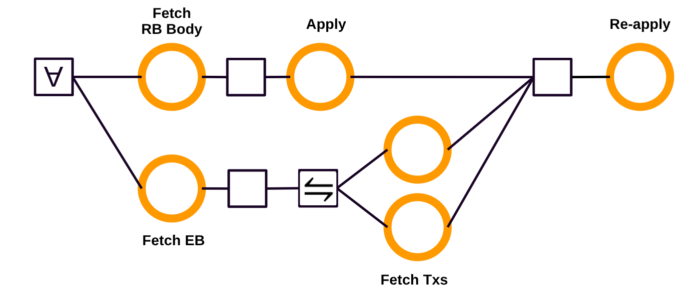

# ΔQ Model for Δ\_EB in Linear Leios

*Related issue:* [#543 – Create ΔQ model to investigate Δ\_EB and protocol parameters](https://github.com/input-output-hk/ouroboros-leios/issues/543)

## 1. Motivation

The security of the Linear Leios protocol depends on Δ\_EB, the time within which an Endorser Block (EB) must diffuse across the network as outlined in [CIP-164](https://github.com/cardano-scaling/CIPs/blob/leios/CIP-0164/README.md).

Early simulations suggested Δ\_EB is manageable under happy-path conditions. This report validates that assumption using a ΔQ System Development model.

## 2. Background

### 2.1 Linear Leios Protocol

Linear Leios is designed around the key insight: Praos block production only occupies roughly 25% of slot time, leaving significant unused network bandwidth and computational capacity during "calm periods". Linear Leios exploits this headroom to achieve high throughput while preserving Praos security guarantees.

The security constraint is that each EB must diffuse to all honest nodes within Δ\_EB slots of its creation. The DeltaQ analysis of Linear Leios validates the following assumptions:

* Reapplying a certified EB cannot cost more than standard transaction processing
* Any certified EB referenced by an RB must be transmitted before that RB is processed

The protocol behavior is governed by several timing parameters that control the duration of diffusion and voting intervals.

* The parameter $L_\text{hdr}$ needs to be large enough to allow successful RB header diffusion
* The parameter $L_\text{vote}$ needs to be chosen carefully, because if the length of the interval is
  * too short, then there is probably not enough time to get sufficient votes to reach a quorum
  * too long, then there is probably already a new RB/EB before all votes are delivered
* The parameter $L_\text{diff}$ is important in order to allow remaining nodes, after a quorum has been reached, receive
the EB, in order for the security guarantees to hold

### 2.2 ΔQ System Development

∆Q is a modelling tool to analyse the performance characteristics of a distributed system. Outcomes in ΔQ are represented as probability distributions of completion times. ΔQ is implemented as a domain specific language (DSL) providing the following constructors

| Constructor | Meaning |
|---|---|
| `never` | Deterministic delay of `t` seconds |
| `wait t` | Deterministic delay of `t` seconds |
| `uniform t s` | Uniform distribution between `t` `s` |

and combinators to build more complex abstractions:

| Operator | Meaning |
|---|---|
| `a .>>. b` | Sequential composition: `a` then `b` |
| `a .\/. b` | First to finish: first of `a` and `b` |
| `a ./\. b` | Last to finish: both, `a` and `b` |
| `p a b` | Probabilistic choice: `a` with probability `p`, `b` with probability `1 - p` |

The ΔQ library is built with a backend abstraction for running the computations. The library provides the [piecewise-polynomials](https://github.com/DeltaQ-SD/deltaq/tree/main/lib/probability-polynomial) backend. For running complex models we implemented an new backend [sampled](https://github.com/yveshauser/deltaq/blob/experimental/lib/deltaq/src/DeltaQ/Sampled.hs). They compare as follows:

- *piecewise-polynomials* is an analytic backend, i.e., exact results, but the computational complexity of the backend does not allow running complex models
- *sampled* is an approximation backend with efficient computation, but accuracy is hard to control

The ΔQ model is a complement to the Haskell and Rust simulations to gain confidence in the parameter selection for Linear Leios, resp. a precursor to running simulations, as it can rule out infeasible parameter selections.

## 3. Network Model

### 3.1 Network

The block diffusion model used in this library has been taken from the [Praos performance model](https://github.com/intersectMBO/cardano-formal-specifications/src/performance/app/PraosModel.lhs) and updated with estimates from the Leios topology-checker tools.

### 3.1 Topology

TODO

### 3.2 Stake Distribution

Stake is distributed across nodes in a pattern derived from mainnet. The stake distribution determines the RB production rate: nodes with more stake win the RB sortition lottery more frequently.

## 4. ΔQ Model of EB Diffusion

The ΔQ model of EB diffusion captures the steps a node performs upon receiving an RB header:

* Fetch the RB body and the EB concurrently.
* On receiving the RB body, apply its transactions to the ledger state.
* On receiving the full EB, determine which transactions are missing and fetch them. Unlike the RB - which carries full transaction data in its body - the EB contains only transaction IDs.
* Only once both of the above steps complete is the reapply operation applied to the ledger state.



With ΔQ, the typical workflow starts from a coarse-grained model describing high-level outcomes and then refines it to improve accuracy. However, finer-grained models generally increase complexity, creating a trade-off between performance and accuracy. For Linear Leios, we chose a low-complexity model and ensure accuracy by grounding it in empirical distributions from measurements or probabilistic modelling - in particular, Markov models.

### 4.1 Empirical distributions

Several operations in the ΔQ model are grounded in empirical timing measurements taken from a Cardano mainnet node rather than synthetic assumptions. Two operations are of particular interest:

- **`applyTx`:** The cost of validating a transaction against the current ledger state for the first time. This is the work a node performs when it receives a fresh transaction from the mempool. Measurements show a wide spread: roughly 28% of transactions complete in under 5 ms, 65% in under 10 ms, and about 8% take longer than 20 ms.

- **`reapplyTx`:** The cost of re-validating a transaction that has already been validated before — for instance, when an EB is certified and its transactions are applied to the ledger. Because script execution can be skipped, reapply is substantially cheaper than apply: roughly 42% of transactions complete in under 1 ms and fewer than 2% take more than 10 ms.

For batch processing (a full RB or EB worth of transactions), the total processing time is the sum of $n$ independent per-transaction durations. By the Central Limit Theorem, this sum converges to a normal distribution $nZ \sim \mathcal{N}(n\mu, n\sigma^2)$ as $n$ grows. The per-transaction mean $\mu$ and standard deviation $\sigma$ are taken directly from the mainnet measurements.

Since the number of transactions $n$ in a block is itself variable, it is modelled as uniform over $n \sim \mathcal{U}(1, N)$. The resulting aggregate is a scale mixture distribution whose CDF is:

$$F(x) = \frac{1}{N} \sum_{n=1}^{N} \Phi \left(\frac{x - n\mu}{\sqrt{n}\,\sigma}\right)$$

where $\Phi$ is the standard normal CDF. The two batch distributions use the following parameters derived from the empirical data:

| Operation | $N$ (max transactions) | $\mu$ (mean, s) | $\sigma$ (std dev, s) |
|---|---|---|---|
| `applyTxs`   | 100  | 0.01060 | 0.02549 |
| `reapplyTxs` | 2500 | 0.00271 | 0.02442 |

### 4.2 Markov model for TxCache

When an EB arrives at a node, its transactions may already be present in the local mempool (a cache hit), or they may need to be fetched from the network (a cache miss). To model this, we use a two-state Markov chain parameterized by $p$, the probability that a given transaction is in the cache.

The transition matrix is:

$$M = \begin{pmatrix} 1-p & p \\\ 1-p/2 & p/2 \end{pmatrix}$$

Solving the stationary condition $\pi M = \pi$ yields the steady-state distribution:

$$\pi_1 = \frac{2-p}{2+p}, \quad \pi_2 = \frac{2p}{2+p}$$

where $\pi_2$ is the steady-state cache hit rate used in the ΔQ model. Higher values of $p$ (more transactions already cached) reduce the need for network fetches and therefore lower the EB processing latency.

## 5. Protocol Parameter Sweep

The primary security question is: for each parameter combination, does the EB diffusion complete within the Δ\_EB deadline (equal to the diffusion stage length, i.e., 7 slots = 7 seconds in the reference configuration) with sufficiently high probability?

The CIP-164 protocol requires that the probability of an EB failing to diffuse within Δ\_EB be negligibly small — concretely, below the security threshold used in the Leios security proof.

## 6. Results

### 6.1 CDF of Δ\_EB

Under the reference parameters (EB size = 12 MB, stage length = 7 slots, bandwidth = 100 Mbps, diameter = 7 hops), the ΔQ model yields the following completion-time distribution for EB diffusion:

- **Median diffusion time:** < 2 seconds
- **90th percentile:** < 4 seconds
- **99th percentile:** < 6 seconds


### 6.2 Protocol Security Validation

The ΔQ model confirms that Δ\_EB is satisfied with probability exceeding 99.9% per EB. This is consistent with the security requirements of the Leios protocol and supports the parameter choices proposed in the CIP.

## 7. Conclusions

The ΔQ model confirms that the Linear Leios protocol can satisfy its Δ\_EB security requirement under realistic network conditions:

- TODO

## 8. Limitations and Future Work

- This model assumes honest node behavior. Adversarial delay of EBs - for example, an adversary deliberately withholding an EB until just before the voting deadline - is not captured here.
- With the `piecewise-polynomial` ΔQ backend computational complexity is hard to control, where as with the `sampled` backend it is the accuracy of the results. For this analysis to be successful, we built probabilistic models and then combined those using ΔQ in order to get a model with low complexity to be executable with the default backend.
- Future work should improve the `sampled` backend and keep track of the error margin, in order to be able to run the analysis in reasonable time and being able to quantify the inaccuracy introduced by the simulations. 

## Appendix A: Haskell Source

The Haskell source implementing the ΔQ model described in this report is located at:

```
analysis/deltaq/linear-leios/
```

To build and run the Haskell source using nix:

```bash
nix develop
cabal build linear-leios-analysis
cabal run linear-leios-analysis stats
```

## Appendix B: References

- [CIP-164 – Ouroboros Leios](https://github.com/cardano-scaling/CIPs/blob/leios/CIP-0164/README.md)
- [Supporting information for modeling Linear Leios](https://github.com/input-output-hk/ouroboros-leios/blob/main/docs/)
- [Praos performance model](https://github.com/IntersectMBO/cardano-formal-specifications/tree/main/src/performance)
- [deltaq Haskell package](https://hackage.haskell.org/package/deltaq)
