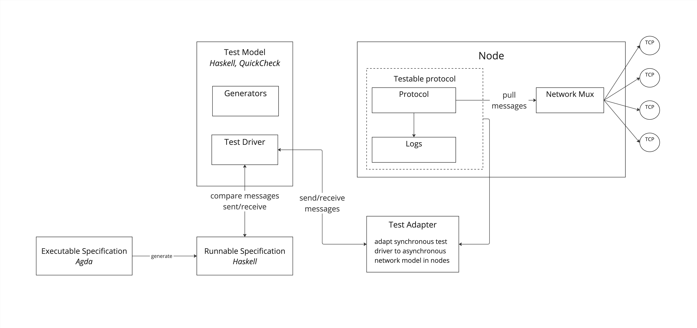

# Conformance Testing Leios Protocol

Here is a sketch design of the conformance testing pipeline envisioned for Leios protocol.



This is inspired by, and takes into account the experience from, the work done in [Peras](https://github.com/input-output-hk/peras-design) project. The _System-Under-Test_ under consideration is a single (honest) node, with the _Test Driver_ modeling the environment, eg. other nodes participating in the protocol.

* The formal specification is expected to be _executable_: not only are the valid transitions specified as type-level relations, but those transitions should also be computable typically as a state-transition function mapping each `(state, message)` couple to a target state
  * This specification is expected to be _total_ in order to account for the possibility of errors and "adversarial" behaviour
  * A pending question is the level of determinism of the specification w.r.t possible implementations. The specification should not over-constrain the implementation and in particular should not prevent concurrent execution of unrelated actions in the SUT, which might lead to various possible interleavings observable for some specified inputs
* This specification is converted to Haskell code using the standard Agda compiler and backend generator
  * In particular, this won't be using the [Agda2hs]() "transpiler" which we found does not play well with Agda standard library and ecosystem
  * This implies the specification should expose some interface to be called by Haskell test driver
* Generators and test "driver" (or test model) are implemented in Haskell, using QuickCheck and possibly quickcheck-dynamic library for state-machine testing
  * The test model should be mostly trivial as it delegates the bulk of the work to the generators (for producing interesting traces) and the specification (to drive the transition system)
  * Writing good generators is the tricky part as we want them to cover all kind of interesting potential adversarial behaviour: delaying messages, injecting double-spending txs or equivocated blocks and transactions, split-brain situations, etc.
  * **Note**: As the generators need to have deep knowledge of the (expected and observed) state of the SUT and the messages flowing between nodes, it might make sense to define them alongside the formal specification
* The _test driver_ is defined as a straightforward state machine representing the behaviour of the environment of the SUT
  * Messages are _sent_ to the SUT, from other nodes, and _received_ from it
  * The driver could also have access to _logs_ emitted by the SUT, as a non-intrusive way to observe internal behaviour (eg. things which are only observable locally) without depending explicitly on the details of the SUT's state. This is useful to troubleshoot observed conformance failures and to analyse _coverage_ of the generated test sequences
* The _test adapter_, as the name implies, is there to provide the SUT the _pull-based_ interface it expects
  * The SUT is expected to decide when to pull messages from its peers, and (when honest) send messages only when requested to do so
  * The adapter's job is to:
    1. convert messages "sent" to the SUT into messages that are available for pulling
    2. pull messages "received" from the SUT when they are expected
  * The adapter is meant to isolate the test driver and specification from particular choice of technology for the implementation
* To ensure it can be tested, implementation of the Leios node should be structured in such a way as to be insulated from the details of the networking layers

## Running the test suite

The conformance tests run against an external implementation of the Leios protocol. In order to run the tests, named FIFOs for the communication between the testing framework and the external implementation have to be created:
```bash
mkfifo simin simout
```
The external implemenation has to be started:
```bash
cabal run leios-simulation-pipe < simin > simout
```
The tests are run as follows:
```bash
cabal run leios-conformance-test -- --external-input=simin --external-output=simout
```
