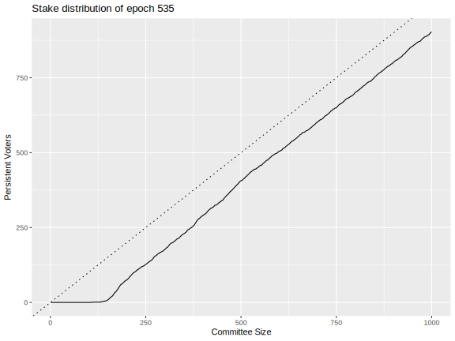
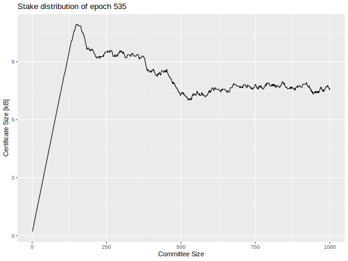

# BLS certificates for Leios

The present write-up documents that BLS certificates based on the Fait Accompli sortition scheme comprise a viable option for Leios, with certificates being smaller that 10 kB. The downside of BLS approaches like this is that new keys must be registered and occasionally rotated.

The January 27 IOG R&D Seminar entitled "ALBA" summarizes recent developments for the ALBA algorithm and indicates that new variants of ALBA may be suitable for compactly storing Peras certificates, perhaps even using existing Praos VRF and KES keys. Similarly, progress has also been made on certificate compression via SNARKs. However, if any of the ALBA- and/or SNARK-based voting and certificate schemes meet the following conditions, they would be superior to the BLS-based scheme outlined later in this document.

1. No new keys need be registered. (E.g., the existing VRF and KES keys can be used for voting.)
2. The certificate size is well under the 90,112 byte maximum size of a Praos block.
3. Proof and verification times fit within the `cardano-node` CPU budget.

Ideally, of course, the same voting and certificate infrastructure would be used for Mithril, Peras, Leios, and partner chains.

## Committee and quorum size

[Previous analysis indicates](../docs/technical-report-1.md#committee-size-and-quorum-requirement) that the Leios committee size should be no smaller than 500 votes and the quorum should be at least 60% of those votes. Note that the certificate need only record a quorum of votes and, for minimization of certificate size, need not include any votes in excess of the quorum.

## BLS certificate scheme

Consider the following voting and certificate scheme for Leios:

1. Stake pools register BLS keys for use in voting and prove possession of those keys.
2. Nodes verify the proofs of possession of the keys they receive.
3. Those keys are not replaced periodically because forward security is not needed for IBs, EBs, or votes. (If forward security were required, then the Pixel family of algorithms is a good candidate because of its succinctness.)
4. For each epoch, the [Fait Accompli](https://iohk.io/en/research/library/papers/fait-accompli-committee-selection-improving-the-size-security-tradeoff-of-stake-based-committees/) scheme wFAF is applied to the stake distribution in order to determine the *persistent voters* for the epoch.
    1. Persistent voters should vote in every election during the epoch.
    2. A different supplement of *non-persistent voters* are selected at random for each election during the epoch using the *local sortition* algorithm.
5. The certificate records the set of voters, proof of their eligibility, and the quorum achieved.

### Key registration

The key registration records the public key and the proof of its possession.

1. The Pool ID (or similar unique identifier) identifies the pool holding the key and comprises 28 bytes.
2. The public key $\mathit{mvk}$ belongs to $\mathbb{G}_2$ , so it occupies 96 bytes if BLS12-381 with compression is used.
3. The proof of possession for the secret key is the pair $\left(H_{\mathbb{G}_1}(\text{``PoP''} \parallel \mathit{mvk})^\mathit{sk}, g_1^\mathit{sk}\right)$, where $\mathit{sk}$ is the secret key and $H$ hashes to points in $\mathbb{G}_1$. This pair will occupy 96 bytes with compression.
4. The KES signature for the above will add another 448 bytes.

Altogether, a key registration occupies $28 + 96 + 2 \times 48 + 448 = 668$ bytes. This type is implemented in Rust as [`key::Reg`](src/key.rs). This registration needs to be recorded on chain so that certificates can be later verified independently. Ideally, the BLS keys would be registered as part of the SPO's *operational certificate*, which is renewed every ninety days.

### Sortition

Figure 7 of the [Fait Accompli paper](https://iohk.io/en/research/library/papers/fait-accompli-committee-selection-improving-the-size-security-tradeoff-of-stake-based-committees/) provides the algorithm for determining which pools are persistent voters. The inequality for this determination can be computed exactly using rational arithmetic, so there is no danger of round-off errors. The input to the formula is the size of the committee and the distribution of stake among the pools. The Rust type [`fait_accompli::FaSortition`](src/fait_accompli.rs) implements this algorithm.

[The Leios sortition](../docs/technical-report-1.md#sortition) for input blocks (IB), endorser blocks (EB), and votes allows the possibility that a block-producing node may be elected several times in the same slot (for IBs) or pipeline (for EBs and votes).

The non-persistent pools are subject to local sortition (LS) for each vote, based on an updated stake distribution where the persistent voters have been removed and where the distribution is normalized to unit probability. The VRF value for that sortition is the bytes of the SHA-256 hash of the BLS signature on the election identifier $eid$. The probability that a pool with fraction $\sigma$ of the stake is awarded $k$ votes of the committee of $n$ votes is 

$$
\mathcal{P}(k) := \frac{(n \cdot \sigma)^k \cdot e^{- n \cdot \sigma}}{k!}
$$

This VRF value is used to look up the correct number of votes from the cumulative distribution for $\mathcal{P}(k)$. The same Taylor-series expansion technique used in Praos can handle the irrational arithmetic in a deterministic manner. In practice it is unlikely that the non-persistent pools would ever be awarded more than one vote, so it may be feasible to simply award one vote whenever $k \ge 1$: in such case the Peras voting sortition could use code very similar to the existing Praos block sortition. This is implemented in the Rust function [`]

Each vote has a weight, measured as stake. A quorum is achieved if the weights of the votes in the certificate exceeds a specified quorum of stake. The weight calculation is also proved in Figure 7 of the aforementioned paper:

- The weight of a persistent voter is simply their stake.
- The each vote cast by a non-persistent voter has weight equal to the non-persistent stake divided by the *expected* number of non-persistent seats on the voting committee.

The Rust function [`sortition::voter_check`](src/sortition.rs) implements this using rational arithmetic. The same implementation (but different $n$) applies to IBs, EBs, and votes.

### Votes

Votes cast by persistent versus non-persistent voters contain different information because persistent voters can be identified by a two-byte identifier and the do not have to provide an eligibility proof.

- Common to all votes
	- *Election ID:* 8 bytes
	- *Hash of endorser block:* 32 bytes
	- *Vote signature:* 48-byte BLS signature on the election ID and EB hash
- Specific to persistent voters
	- *Epoch-specific identifier of the pool:* 2 bytes
- Specific to non-persistent voters
	- *Pool ID:* 28 bytes
	- *Eligibility signature:* a 48-byte BLS signature on the election ID

This amounts to 90 bytes for persistent votes and 164 bytes for non-persistent votes. The Rust type [`vote::Vote`](src/vote.rs) implements this.

### Certification

Consider the committee size $n$, which contains $m$ persistent voters.

The certificate must contain the following information:

- Election and EB
    - *Election ID:* Presumably a 8-byte identifier for the Peras election is included in the certificate, though perhaps this is not strictly necessary. This could just be the slot number.
    - *Message:* the 32-byte hash of the endorser block is also included in the certificate.
- Identity of voters
    - Persistent voters are encoded in a bitset of size $m$, occupying $\left\lceil m / 8 \right\rceil$ bytes.
    - Non-persistent voters are encoded by their Pool ID (or equivalent), occupying 28 bytes each and hence $28 \cdot (n - m)$ bytes total.
    - Alternatively, all possible voters could be assigned bits in a bitset, with size $\left\lceil N_\text{pools} / 8 \right\rceil$.
- Eligibility proof
    - Persistent voters are eligible by definition (by virtue of their stake in the epoch), so no proof is needed.
    - Non-persistent voters prove eligibility with a 48 byte (compressed) BLS signature on the message, occupying $48 \cdot (n - m)$ bytes total.
- Aggregate signatures
    - *Signed message:* This aggregate BLS signature on the message is 48 bytes (compressed).
    - *Signed election proofs:* Perhaps not strictly necessary, but another 48 byte (compressed) BLS signature can attest to the proof of the eligibility, see **BLS.BSig** in [the Leios paper](https://iohk.io/en/research/library/papers/high-throughput-blockchain-consensus-under-realistic-network-assumptions/).
    
Thus the total certificate size is

$$
\text{certificate bytes} = 136 + \left\lceil \frac{m}{8} \right\rceil + 76 \times (n - m)
$$

but not including any minor overhead arising from CBOR serialization. As noted previously, only a quorum of votes actually needs to be recorded, but the full set might need to be recorded in order for any voting rewards to be computed. This type is implemented in Rust as [`cert::Cert`](src/cert.rs).

### Benchmarks in Rust

- Sortition
    - *Input blocks:* 230 µs
    - *Endorser blocks:* 230 µs
    - *Persistent voters:* 5.5 ms (once per epoch)
    - *Non-persistent voters:* 230 µs (once per pipeline)
- Vote
    - *Verify the proof of key possession:* 1.5 ms/key
    - *Generate vote:*
	    - *Persistent:* 135 µs/vote
	    - *Non-persistent:* 280 µs/vote
    - *Verify vote:*
	    - *Persistent:* 670 µs/vote
	    - *Non-persistent:* 1.4 ms/vote
- Certificate (for a realistic number of pools, stake distribution, and committee size)
    - *Generate certificate:* 90 ms/cert
    - *Verify certificate:* 130 ms/cert
    - *Determine weight (i.e., total stake voted for) in certificate:* 5.9 ms/cert
- Serialization
	- *Key registration:* 1.1 µs
	- *Vote:* 630 ns
	- *Certificate:* 65 µs 
- Deserialization
	- *Key registration:* 52 µs
	- *Vote:* 19 µs
	- *Certificate:* 2.7 ms

As a general rule of thumb, assume that 80% of votes are persistent and 20% are non-persistent.

Here are details for how certificate operations vary with committee size.

| Number of pools | Number of committee seats | Generate certificate | Verify certificate | Weigh certificate |
|----------------:|--------------------------:|---------------------:|-------------------:|------------------:|
|            2500 |                       500 |              63.4 ms |           104.8 ms |           10.6 ms |
|            2500 |                       600 |              71.1 ms |           116.9 ms |           12.0 ms |
|            2500 |                       700 |              77.4 ms |           125.5 ms |           12.3 ms |
|            2500 |                       800 |              83.5 ms |           134.4 ms |           12.8 ms |
|            2500 |                       900 |              88.2 ms |           141.1 ms |           12.4 ms |
|            2500 |                      1000 |              92.5 ms |           144.9 ms |           12.3 ms |

## Certificate size for realistic stake distributions

The following plots show number of persistent votes and votes, along with certificate size, for the `mainnet` stake distribution of Epoch 535. The dashed line in the first plot has slope one, so the gap between it and the solid line indicates the number of non-persistent voters. The certificate-size plot does not take into account a potential reduction in certificate size from omitting votes in excess of a quorum.

| Persistent voters                                           | Certificate size                                                    |
| ----------------------------------------------------------- | ------------------------------------------------------------------- |
|  |  |
