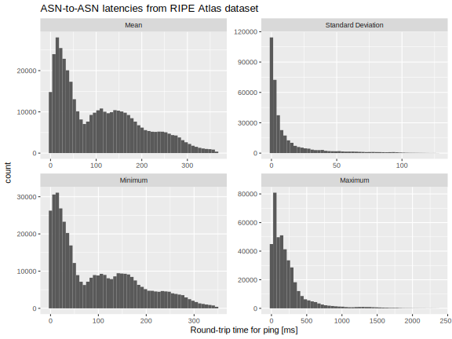
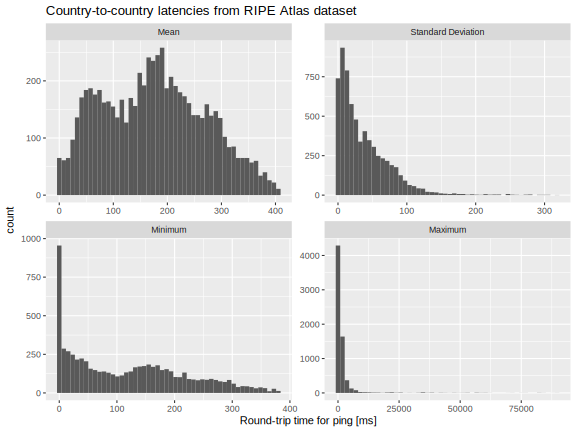

# Latency map of the internet

Here we process data from the [RIPE Atlas](https://www.ripe.net/analyse/internet-measurements/ripe-atlas/), which is one of the largest internet measurement networks. The result is a data table of ASN-to-ASN round-trip times (RTT) for pings. Each [Autonomous System](https://en.wikipedia.org/wiki/Autonomous_system_(Internet)) is identified by an ASN (autonomous system number).

These data have been used for the latencies in the mock up of a synthetic version of the Cardano `mainnet`, for use in simulation studies of Ouroboros protocol design and development.


## Data files

- [asn\_rtt\_stat.csv.gz](asn_rtt_stat.csv.gz) ASN-to-ASN latencies
- [country\_rtt\_stat.csv.gz](country_rtt_stat.csv.gz) country-to-country latencies
- [intra\_rtt\_stat.csv.gz](intra_rtt_stat.csv.gz) intra-ASN latencies


## Data dictionary

Latencies are assumed to be symmetical, so the data files only record the "upper triangle" of the latency matrix.

| Field          | Units    | Description                                                        |
|----------------|----------|--------------------------------------------------------------------|
| `asn1`, `asn2` | n/a      | The autonomous system numbers between which latencies are measured |
| `cty1`, `cty2` | n/a      | The countries between which latencies are measured                 |
| `rtt_cnt`      | unitless | The number of pings in the raw dataset.                            |
| `rtt_avg`      | ms       | The round-trip time (RTT) for ping between the two locations.      |
| `rtt_std`      | ms       | The sample standard deviation of the RTT ping measurements.        |
| `rtt_min`      | ms       | The minimum of the RTT ping measurments in th sample.              |
| `rtt_max`      | ms       | The maximum of the RTT ping measurements in the sample.            |


## Summary statistics


### ASN to ASN




### Country to country




### Intra-ASN

| Mean    | Standard deviation | Minimum | Maximum     |
|--------:|-------------------:|--------:|------------:|
| 80.4 ms | 103.5 ms           | 0 ms    | 249625.7 ms |


## Data processing

This section provides a reproducible recipe for creating or updating the data files.


### Schema

Use PostgreSQL to process the data.

First we create a schema for data processing.

```sql
create schema asn;
```


### Ping measurements

Download the `ping` measurements for several days from the RIPE Atlas. The origin, destination, and RTT measurements are extracted from these files.

```bash
for d in 2025-03-29 2025-03-30 2025-03-31 2025-04-18 2025-04-19
do
 for t in 0000 0100 0200 0300 0400 0500 0600 0700 0800 0900 1000 1100 1200 1300 1400 1500 1600 1700 1800 1900 2000 2100 2200 2300
 do
   curl -sS "https://data-store.ripe.net/datasets/atlas-daily-dumps/${d}/ping-${d}T${t}.bz2" \
   | bunzip2 -c \
   | jq -r '
     select(.result)
   | select(.src_addr)
   | select(.dst_addr)
   | select(.src_addr | contains("."))
   | select(.dst_addr | contains("."))
   | .src_addr as $src
   | .dst_addr as $dst
   | [
       .result.[]
     | select(.rtt)
     | ($src + "," + $dst + "," + (.rtt | tostring))
     ]
   | .[]
   ' \
   | pigz -9c \
   > "ping-${d}T${t}.gz"
   sleep 10s
 done
done
```

Create a table for the `ping` measurements.

```sql
create table asn.ping (
  src inet
, dst inet
, rtt real
);
```

Load the data extracts into the table.

```bash
for f in ping-*T*.gz
do
  echo "$f"
  zcat $f > tmp.csv
  psql -c "\\copy asn.ping from 'tmp.csv' csv"
done
rm tmp.csv
```

```sql
select count(*) from asn.ping;
```

```console
   count    
------------
 2480314130
(1 row)
```


### IP ranges for ASNs

The [iptoasn](https://iptoasn.com) web site provides a table of the IP ranges corresponding to each ASN. (Note that the RIPE Atlas's *probe* data file does not contain sufficient information for reconstructing destination ASNs in the `ping` data, wo we use this alternative dataset.)

Download the IP to ASN correspondence table.

```bash
curl -sS -o ip2asn-v4.tsv.gz https://iptoasn.com/data/ip2asn-v4.tsv.gz
zcat ip2asn-v4.tsv.gz \
| gawk '
BEGIN {
  FS="\t"
  OFS=","
  print "start", "end", "asn", "country", "label"
}
{
  print $1, $2, $3, $4, "\"" $5 "\""
}
' \
> ip2asn.csv
```

Load that download into a table.

```sql
create table asn.ip2asn (
  ip_start     inet
, ip_end       inet
, asn          bigint
, country      varchar(8)
, organization text
);

\copy asn.ip2asn from 'ip2asn.csv' csv header
```

```console
INSERT 0 56
```


### Known IP addresses

For efficiency we create a table of all of the IP addresses seen in the `ping` data. We do this because we want to only perform the costly `BETWEEN` query on IP addresses a single time.

```sql
create table asn.addr as
select src as ip from asn.ping
union
select dst from asn.ping
;
```

```console
SELECT 73754
```


### Correspondence tables for know IP addresses

Now identify which ASN(s) correspond to each IP address and note the country code.

```sql
create table asn.ips as
select
    ip
  , asn
  , country
  from asn.addr
  inner join asn.ip2asn
  on ip between ip_start and ip_end
;
```

```console
SELECT 82710
```


## RTT statistics

Summarize the `ping` statistics. We tabulate the minimum, maximum, mean, and standard deviation so that we can later sample from a truncated Gaussian distribution when generating synthetic data.


### ASNs

```sql
create table asn.asn_stat as
select
    least(src.asn, dst.asn) as asn1
  , greatest(src.asn, dst.asn) as asn2
  , count(*) as rtt_cnt
  , avg(rtt) as rtt_avg
  , stddev(rtt) as rtt_std
  , min(rtt) as rtt_min
  , max(rtt) as rtt_max
  from asn.ping as ping
  inner join asn.ips as src
    on src.ip = ping.src
  inner join asn.ips as dst
    on dst.ip = ping.dst
  group by 1, 2
;

\copy asn.asn_stat to 'asn_rtt_stat.csv' csv header
```

```console
COPY 422372
```

```bash
gzip -9v asn_rtt_stat.csv
```


### Countries

```sql
create table asn.cty_stat as
select
    least(src.country, dst.country) as cty1
  , greatest(src.country, dst.country) as cty2
  , count(*) as rtt_cnt
  , avg(rtt) as rtt_avg
  , stddev(rtt) as rtt_std
  , min(rtt) as rtt_min
  , max(rtt) as rtt_max
  from asn.ping as ping
  inner join asn.ips as src
    on src.ip = ping.src
  inner join asn.ips as dst
    on dst.ip = ping.dst
  group by 1, 2
;

\copy asn.cty_stat to 'country_rtt_stat.csv' csv header
```

```console
COPY 6827
```

```bash
gzip -9v country_rtt_stat.csv
```


### Intra-ASN

```sql
create table asn.intra_stat as
select
    count(*) as rtt_cnt
  , avg(rtt) as rtt_avg
  , stddev(rtt) as rtt_std
  , min(rtt) as rtt_min
  , max(rtt) as rtt_max
  from asn.ping as ping
  inner join asn.ips as src
    on src.ip = ping.src
  inner join asn.ips as dst
    on dst.ip = ping.dst
  where src.country = dst.country
;

\copy asn.intra_stat to 'intra_rtt_stat.csv' csv header
```

```console
COPY 1
```

```bash
gzip -9v intra_rtt_stat.csv
```

