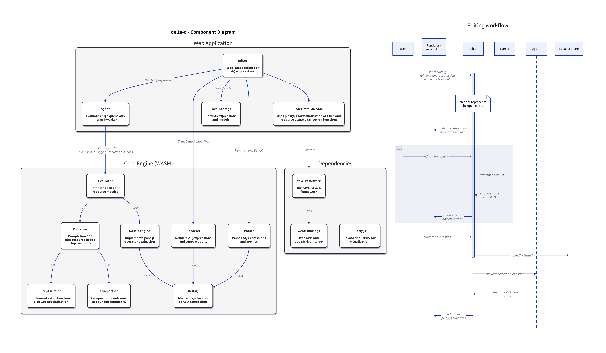
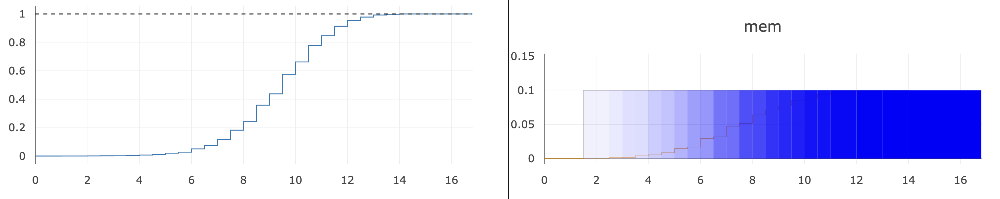
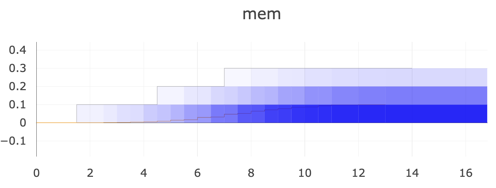
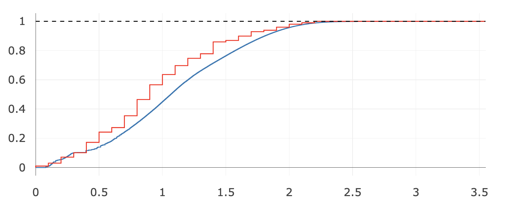

# Report on ΔQ progress (Jan 2025)

This is an intermediate report on only the ΔQ part of the Leios project, with the goal of consolidating and persisting the learnings since September.

## The tooling

As part of this subproject two main tools were developed: a web application for textual and graphical editing of ΔQ expressions and showing their results, and some [JQ](https://jqlang.github.io/jq/) scripts for extracting and formatting information from the results of running the Haskell and Rust simulations.

### `delta_q` Web App



This web app’s architecture is shown in the diagram above and comprises

- a core engine written as a Rust library that is compiled to WASM
- dependencies (most notably [Yew](https://yew.rs) as web framework and [Plotly.js](https://plotly.com/javascript/) for diagrams)
- the web application itself, written mostly in Rust with the exception of the code calling Plotly, which is written in JavaScript

> It should be noted that the core engine contains facilities for computing with cumulative distribution functions (CDFs) which are also used by the [`topology-checker`](../../topology-checker/) subproject.


The web application consists of a single view as shown above.
The top half of the screen shows the evaluation result of the selected ΔQ expression, with the timeliness on the left and the resource usage graphs on the right.
The x axis in all cases shows time units (the user can freely choose what a unit means when writing down the atomic CDFs as part of the expression, since the CDF uses only scalar numbers without units).
For the timeliness, the y axis shows the cumulative completion probability, i.e. it always starts out at (0, 0) and it ends up at 1 unless failure/loss is modelled in the expression.
For the resource usage, the y axis shows the aggregated resource usage intensity (again, the user choses the unit when converting from measured values to scalar numbers in the ΔQ expression) while the cumulative probability distribution within each time interval is shown using the saturation of blue color:
in the example the CPU usage is definitely 1 between 0 and 1 time units, in other words the cumulative probability is 0 from 0 up to 1 in y direction, jumping to 1 afterwards — the color gets fainter the closer the probability gets to 1.
This can be seen at the time interval [1, 2] where the probability of using 0 CPU is 70% while 1 CPU has a probability of 30%.
The fine orange line on the blue graph shows the mean — or expected value — of the resource usage CDF at each point in time.

Beneath the diagrams the evaluation context for ΔQ expressions is shown.
Each expression has a name, followed by a colon and then the textual syntax for the expression.
The selected expression is printed in bold font, and in addition to showing the result in the top half, a graphical representation of the expression itself is given below the evaluation context section.
These small diagrams are heavily inspired by the ΔQSD paper but modified to make them more rectangular, which means easier to directly translate into HTML elements.
The user can click on most parts of the expression diagram to perform edits.

Note that the order of expressions in the evaluation context or the textual comments can only be edited by clicking the `edit` button which will bring up a text area with the whole evaluation context.
This also supports importing and exporting a context by way of copy-and-paste operations; the context is stored in the browser’s `localStorage` as well, so it typically persists across page reloads or closing and reopening the tab.

#### New syntax elements: `gossip`

Following the deliberations recorded in [«Towards Load Analysis»](./Towards_Load_Analysis.md) a gossip operator was added to the expression language as a short-hand for a choice ladder that models a sequence of communication hops potentially taken to reach all nodes in the network.
This operator assumes a random graph topology, modified to the desired degree of [small-worldness](https://en.wikipedia.org/wiki/Small-world_network) with a uniform local cluster coefficient.

```text
-- a model of information diffusion by gossip protocol, where
-- the send outcome is performed at the sending node towards each of the 10 peers
-- and the receiving outcome is performed at each recipient node
sequence := gossip(send, receive, 1000, 10, 0.05, [cpu, mem])

-- an outcome that may complete after 1, 2, or 3 time units, using the CPU for the first unit
send := CDF[(1, 0.3), (2, 0.7), (3, 1)] WITH cpu[(0, 1), (1, 0)]
-- received data takes 0.5 time units to store and take up 0.1 memory units thereafter
receive := CDF[(0.5, 1)] WITH mem[(0.5, 0.1)]
```

In the above example we see diffusion within a network of 1000 nodes where each node has 10 peers and the local cluster coefficient is 0.05 (meaning that 5% of all possible triangles exist between the neighbors of a node).
The `send` outcome describes the work that needs to be performed for sending the information from the source node while the `receive` outcome models what happens after reception of the information.
It is the user’s choice whether to place the communication latency in the former or latter part; the distinction is most relevant for the correct tracking of resource usage.
The last parameter of the `gossip()` operator names a list of resources that are to be considered local to each node, i.e. not global.
When using `mem` on a per-node basis (which will always be the case in Cardano), the result of the above `sequence` outcome is as follows:



You can see the characteristic s-curve behaviour of gossip diffusion in the timeliness on the left, and you can see the probability of using the `mem` resource on a given node rising from zero to one over the course of roughly 13 time units on the right.
The actual ΔQ expression evaluated in place of the `gossip()` operator can be viewed by clicking on the expression diagram.
In the above case it looks like this:


This diagram includes additional elements added to the ΔQ expression language to implement gossip.
The first of these is that the sequence operator (the infix box with the black border) can be annotated with a load factor, which is `×0.001` before the initial send outcome.
This factor expresses that the resource usage distribution on the right hand side needs to be scaled by the given number in terms of probabilities — in essence, the random variable we are considering here is “which node am I?”
In a network of 1000 nodes, being the origin of some information has a probability of 0.001.

The second addition is that the sequence operator can be annotated with a list of resource that are to be considered separate between the left and right hand sides.
Normally, a resource is shared and thus its usage intensities are added when computing the convolution that the sequence operator represents.
When resources are not shared, resource usage from left and right hand side are not added in the realm of intensities but instead in the realm of probabilities: if the probability of using a resource at some time is 10% on the left and 20% on the right, then the resulting outcome will use the resource at that time with a probability of 30%.

If — purely for illustration purposes — we assume that `mem` is a shared resource between all network nodes, we need to remove it from the local resources list and the result changes:

```text
sequence := gossip(send, receive, 1000, 10, 0.05, [cpu])
```



> This picture shows that the gossip operator is not yet fully correct, as I would expect resource usage probability to stack up to 1000 × 0.1 = 100 with a likelihood of 1 — after all, gossip will have reached all nodes by the end of the operation and we have not included the possibility of failure.
> The source of this bug is very likely that usage of shared resources must not be scaled with the load factor described above because their usage occurs regardless of the “which node am I?” random variable.

#### New syntax elements: `MIN` and `MAX`

When comparing simulation results with ΔQ expressions in the context of systems that cover a range of behaviours between the best and worst cases, it has become obvious that ΔQSD can only model one particular case, not a whole range of them.
So we must compare the best case ΔQ model to the best case observed in the simulation and similar for the worst case; the average case will typically not be accessible for ΔQ analysis.

Consider execution traces from a simulation run that show the gradual completion of information diffusion, each converted to a CDF:

```text
trace1 := CDF[(0.0154, 0.001), ...]
trace2 := CDF[...]
...
```

We can express the best case by taking the maximum of a set of probability distributions, which gives us the earliest observed completion.
And we can express the worst case by taking the minimum of a set of probability distributions, giving us the latest observed completion.

```text
best_case := MAX(CDF[(0.0154, 0.001), ...], CDF[...], ...)
worst_case := MIN(CDF[(0.0154, 0.001), ...], CDF[...], ...)
```

This transformation only works on CDF literals, which are converted into the resulting CDF already during expression parsing.

#### New syntax elements: recursion

The evaluation of ΔQ expressions keeps track of named expressions that are currently being evaluated and refuses to resolve these names again, effectively forbidding recursion.

```text
rec := CDF[(1,1)] ->- rec
```

The above expression leads to an error result stating that `rec` cannot be resolved.
As part of this project, a limited form of recursion has been added to the language that allows the succinct notation of a repetitive process: name resolution can be endowed with a recursion allowance for that particular name, resulting in an unfolding of the recursive expression that goes exactly the given number of levels deep.
When the allowance has run out, the name will be resolved as the “top” outcome (i.e. `CDF[(0,1)]`).

```text
rec := CDF[(1,1)] ->- rec
five_times := rec^5
```

Evaluating `rec` still results in the error, but evaluating `five_times` results in `CDF[(1,1)] ->- CDF[(1,1)] ->- CDF[(1,1)] ->- CDF[(1,1)] ->- CDF[(1,1)] ->- CDF[(0,1)]` (which is the same as `CDF[(5,1)]`).
This can be used also in co-recursive fashion and with multiple appearances of a name within the recursive expression — but beware of the exponential behaviour!

```text
rec := rec ->- CDF[(1,1)] ->- rec
five_times := rec^3
```

This results in `CDF[(7,1)]` (the expansion goes three levels deep, yielding 1+2+4 occurrences of `CDF[(1,1)]`).

### JQ extraction scripts

Since Jan 8, 2025 both simulations emit their traces as JSONL output (newline delimited JSON objects).
The underlying event models are not identical but capture different supersets of the interesting semantics, albeit with different syntax.
For this reason, JQ was used to extract results in a consistent format.

`one_hop.jq` was used to obtain timings for the various steps in the simulated process, like from starting block validation to finishing it for the same block, or from sending a message to a peer to receiving that very message at the recipient.
These small tests confirmed the basic understanding of what the simulations do model and whether they adhere to the specified behaviour of Praos and Leios.

`diffusion.jq` is a more advanced script that records the diffusion of information (like Input Blocks) across the network.
Its extraction of the relevant start and stop events is configurable — JQ is a first-order functional language that allows this kind of abstraction.
The main use of this script was to measure the time between the generation of an IB and its gradual reception across all nodes of the simulated network.
For the Haskell simulation, this is done by filtering for events tagged `generated` or `enteredstate`, respectively, and keeping separate statistics for IBs and Praos blocks (a.k.a. Ranking Blocks) as given in `.event.kind` property of the log object.
For the Rust simulation, the clocked events are taken from the `CpuTaskFinished` message types, filtering for `InputBlockGenerated` and `InputBlockValidated` task types.

The script performs a stateful scan over the input log within the `read_log` function, outputting a two-tiered object sorted first by block type and then by block ID with the property being a histogram of the observed diffusion completion.
This histogram has a fixed size and binning to keep the code simpler; the implied loss of fidelity has not been an issue at the current level of analysis, and the `hist` function can be improved if desired.
In a second step, the individual traces per block type are aggregated into minimal (i.e. worst case), maximal (best case), and average CDFs, which are then formatted into proper ΔQ expression syntax and written to standard output.

#### Older scripts

The `cluster_coeff.jq` script was used to find triangles in the network graph in order to confirm the degree of small-worldness.
This turned out to be a futile exercise because the graph format provided by the Haskell team at the time only contained shortest paths (Dijkstra) and therefore was free of triangles.

`latencies.jq` was used to extract the inter-node latency distribution from the aforementioned earlier JSON format.
When looking at the result, I found two s-curves in the same diagram, one rising from (0, 0) to (30ms, 0.5) and another rising much more slowly from (30ms, 0.5) to (400ms, 1).


I concluded that there are two classes of traffic, namely near and far, which are present with equal weight in the graph, so the script extracts the first class from all points with cumulative probability up to 0.5 and the second class from the rest.

The aforementioned JSON format contained the information on when each block arrives at what node in a form that is already aggregated, i.e. it was not an event log ordered by time.
`convert_arrivals.jq` is the script that extracts the aggregated arrival time distributions and formats them using ΔQ expression syntax.

`txn_diffusion.sh` in conjunction with `convert.jq` were used to read the logs of the Rust simulation, which have been JSONL event logs from the beginning.
Therefore, these scripts perform the aggregation of per-block execution subtraces, albeit in a much less efficient form than in the `diffusion.jq` script described in the section above.

## The analysis

The state of the analysis at the end of 2024 was that there were irreconcilable differences between ΔQ models and simulation results.
When reading the below, keep in mind that the simulation results were at that time obtained as the average of all observed execution traces, which is slower than the best case and faster than the worst case.

### Rust Dec 2024

In case of the Rust simulation, the comparison used the `simplified` network topology, which groups the 200 total nodes into five clusters arranged in a ring, with low latency within each cluster, medium latency between neighbouring clusters, and high latency between non-neighbouring clusters.
This was modelled by gossip between clusters followed by gossip within a cluster:

```text
diffuse := gossip(TOP, far, 5, 2, 0, []) ->- gossip(TOP, near, 40, 10, 0, [])

-- no effort on the sending side, completes immediately
TOP := CDF[(0, 1)]

-- sending within a cluster
near := CDF[(0.036, 1)]
-- sending between clusters can be either medium or high latency
far := CDF[(0.207, 0.5), (0.804, 1)]
```

The latency numbers are based on the [Peras technical report](https://peras.cardano-scaling.org/docs/reports/tech-report-1/#certificates-in-block-header) and used as such also within the simulation setup; each send operation consists actually of 1.5 RTTs (announcing the header, then requesting and getting the block) and disregard any bandwidth effect, which is adequate for the case of transaction diffusion that was modelled.


The comparison of the simulation result (blue) with the ΔQ model (red) shows that some features of the graph do match — most notably the points in time when changes occur are largely the same — while the overall result is not satisfactory.
We identified the specific peer link structure in the simulated network topology as the most significant factor, meaning that the gossip between clusters does not actually occur stochastically as assumed by the `gossip()` operator, instead the specific location of inter-cluster links plays a prominent role.
In other words, constructing a matching ΔQ expression would have to encode the particular network topology details due to the small size of local clusters that does not sufficiently smear out any local peculiarities.

Another factor is that ΔQ sequencing models that anything in the second outcome may start at any point where the first outcome partially completes.
This leads to the computation of all possible permutations of probabilistic effects.
In the simulated world, however, there are strong correlations between the various points that are modelled as choices in the ΔQ expression, e.g. that after one short hop within the origin cluster a faraway cluster can now be reached, leading then to subsequent short hop gossip to spread the information at that whole cluster.
Capturing these execution paths would again require a more tailored ΔQ expression for this particular simulation topology & behaviour.

#### Effect of wall clock time in the simulation

When first comparing the Rust simulation results to initial ΔQ models, the diagrams looked quite different:


Noticing some jumps at roughly the right places was the starting point for realising that this is an effect of how virtualised time was implemented in the simulation.
Seeing that during some phases of the Leios protocol there was too much traffic to handle at real-time when simulating several thousand nodes, simulation time was implemented by scaling down time intervals as observed by the wall clock by a configurable factor.
But even while the system was mostly keeping up with the simulated network’s load, time measurements were probabilistically delayed relative to their true simulation point in time by CPU congestion, especially when having to execute lots of effects at a certain timestamp — as happened frequently with this topology of quantised latencies.

The solution for this was a change to fully virtualised time.
Besides fixing this effect (as shown in the diagram in the previous section) this also allows the simulation to run much faster during time periods of lower activity.

### Haskell Dec 2024

The Haskell simulation aims more towards a prototype implementation than a synthetic simulation, which is why it includes various detailed effects that are not present in the Rust simulation.
Most notably, it emulates the TCP window management of actual TCP stacks to capture that sending a large message (like a Leios IB) does not actually proceed at the full allocated bandwidth but starts out much slower until the congestion window has opened up.

As this feature introduces non-linear behaviour (links with high latency are much more affected than low latency links) it is not easily modelled in ΔQSD (so far no correct approach has been proposed).
The Haskell team therefore offered to produce simulation results with network bandwidth effects switched off, enabling the comparison with the following expression:

```text
gossip(send3far, CDF[(0, 1)], 50, 20, 0, []) ->- send3near ->- CDF[(0.1, 1)]
```

Here, `send3far` is the aforementioned latency distribution extracted using `latencies.jq` for the high latency part, stretched by a factor three to model the three-way message exchange required to get one block from A to B; analog for `send3near`.
The overall idea is to model a two-tiered gossip behaviour, with gossiping between 50 clusters connected with degree 20 followed by sending to a near peer afterwards.


The result (red) shows a good match to the simulation result (blue), but the ΔQ expression does not reflect what we know about the simulation:

- the number of neighbours in the simulated topology was 10 near and 10 randomly selected ones, whereas the expression above postulates 20 each
- the simulation takes into account 100ms block validation latency at each hop, between receiving the data and starting to forward it to peers
  - this is missing in the expression above
  - instead, the expression contains this delay in the final position, modelling that blocks are forwarded in parallel to local validation, not afterwards
- the ΔQ model assumes a perfectly structured two-tier communication system, while the simulation’s topology is not optimized in this fashion

> Keeping in mind that the above simulation result curve is the average of the observed traces (instead of the best or worst cases), it might be that the issues are coupled: going to the best case would move the blue curved leftwards, which would in turn allow the inclusion of per-hop validation delay that shifts it back right — however, this was not tried at the time.

### Summary Dec 2024

While the tooling works very well to explore different ΔQSD models, no satisfactory models can be found for the simulation results at this time.
In case of the Rust simulation the ΔQ investigation revealed a bug in the simulated network topology (violation of the triangle inequality) that was subsequently fixed, as well as prompting a change to fully virtualised time.

### Progress Jan 2025

With simulations converging on a common process that began to cover the whole short Leios protocol, the ΔQSD work shifted focus towards homogeneously looking at input block diffusion for both simulations.
This was further aided by the addition of the JSONL event log output format on the Haskell side, making comparisons easier.

The main change in methodology is that we now look exclusively at the best case behaviour instead of the average diffusion CDFs, as was recommended by the authors of the ΔQSD paper, Neil & Peter.
Initial exploration of the worst case behaviour has shown a much greater variability than can be explained by simple congestion effects, it seems to be connected to the “freshest first delivery” mechanism which is specified by Leios.
That behaviour is again one that is very hard to capture in ΔQSD because of its non-linear nature: once a block gets delayed for any reason it will continue to be further punished by its now older age compared to the continuously added new traffic.

The current draft ΔQSD model for the Haskell simulation is:

```text
-- one near gossip is always needed, either before or after the far message send
-- assuming 9 near nodes around any given node, i.e. 10 2nd tier “clusters”
-- NOTE: the simulation includes further delays from TCP window that affect high-latency links
dq >= IB_max := gossip_near 1<>9 gossip_far ->- (CDF[(0, 1)] 1<>9 gossip_near)

send_far := send3far ->- CDF[(0.328, 1)] ->- validateIB
gossip_far := send_far ->- (CDF[(0, 1)] 1<>1 send_far)
send_near := send3near ->- CDF[(0.328, 1)] ->- validateIB
gossip_near := send_near ->- (CDF[(0, 1)] 1<>1 send_near)
validateIB := CDF[(0.08, 1)]
```


> simulation result (red) and ΔQ outcome (blue)

This models a two-tiered gossip behaviour of 10 “clusters” with 10 nodes each, i.e. finishing after local gossip in 10% of the cases and after far gossip followed by local gossip in the other 90%.
Note how the `send_far` and `send_near` outcomes contain a 328ms delay that results from the simulated bandwidth of 1MB/s and the IB size of 327680 bytes.
Further note how the simulated TCP window behaviour should lead to slower simulation results than the ΔQ model while the opposite is the case (if any conclusion can be drawn).
However, the ΔQ model has been created by just guessing about the network topology instead of properly analysing it, see below.

On the Rust side, things look quite similar sans the 328ms bandwidth effect which is not simulated:

```text
-- one near gossip is always needed, either before or after the far message send
-- assuming 9 near nodes around any given node
-- NOTE: the simulation includes further delays from TCP window that affect high-latency links
dq >= IB_max := gossip_near 1<>9 gossip_far ->- (CDF[(0, 1)] 1<>9 gossip_near)

send_far := send3far ->- validateIB
gossip_far := send_far ->- (CDF[(0, 1)] 1<>1 send_far)
send_near := send3near ->- validateIB
gossip_near := send_near ->- (CDF[(0, 1)] 1<>1 send_near)
validateIB := CDF[(0.08, 1)]
```



> simulation result (red) and ΔQ outcome (blue)

Here, the simulation is faster in diffusing the information to a larger degree than in the Haskell case.

#### Topology checker

William started a tool for checking network topology definition files (as are now accepted by both simulation engines) to ensure their consistency, e.g. with regards to the triangle inequality.
This tool has been extended to also find the shortest paths through a given topology from a given starting point, albeit not yet weighted by link latency.
Example output of this tool for the 100-node topology used in the simulations above:

```text
## All Paths Analysis

| Hop |  Min  |  Avg  |  Max  |
|-----|-------|-------|-------|
|   0 |  1.00 |  1.00 |  1.00 |
|   1 |  7.00 |  9.57 | 10.00 |
|   2 | 36.00 | 49.19 | 60.00 |
|   3 | 29.00 | 39.80 | 52.00 |
|   4 |  0.00 |  0.44 |  4.00 |

hop0_min := CDF[(0, 1)]
hop0_avg := CDF[(0, 1)]
hop0_max := CDF[(0, 1)]
hop1_min := CDF[...]
...
```

The table lists the min/avg/max number of new nodes reached at the given hop count, followed by the min/avg/max latency distribution found at each hop.

#### Thoughts on relating this to a ΔQSD model

The naïve way to use the above information is to build up a ΔQ expression as a series of choices after the initial hop:

- either we’re finished (weighted 1 for the origin node), or we continue sending to hop1 peers (weighted N−1)
- either we’re finished (weighted 6 for hop 1 average), or we continue sending to hop2 peers (weighted N−7)
- and so on, until after hop 4 we just send to hop5 peers and be done

When sending to some hop’s peers we might use the `*_min` or `*_avg` distributions to model what happens at this hop.
However, the way ΔQ expressions are evaluated does not fit what actually happens in the network: when sequencing two ΔQ expressions, partial completion of the first one triggers an equal part of the second one to commence.
This is not how the gossip graph behaves, though, because having reached a near peer (i.e. very quickly) does NOT unlock following up on sending from the next hop in general, it only unlocks sending from that near peer.
Reaching faraway nodes requires long latency communication and relaying from that faraway peer to others can only happen after that delay has elapsed, it cannot probabilistically occur any sooner.

This means that we cannot just build up an expression like

```text
hop0_avg ->- (TOP 1<>99 hop1_avg ->- (TOP 6<>93 hop2_avg ->- ...))
```

This is obvious from the example output shown above, which would result in a positive probability of completion from hop 5 at times as early as 101ms.

Instead of this naïve model, we need to consider the gossip network as a naturally tiered phenomenon: the fastest paths of information diffusion are supported by near gossip at the beginning and end and by far gossip in between to reach global coverage.
This occurs as long as faraway connections are permitted by the topology setup, whether they are explicitly planned as a hierarchy or not.
Computing such behaviour should work much better when the topology checker’s analysis is modified to take link latencies into account and thus find actual shortest paths to all other nodes from a given starting point.
Then, there will be a set of paths with only short latencies, which can be used to guide the model of the short-latency gossip tier;
after subtracting this identified behaviour at the beginnings and ends of all paths, the higher-latency gossip tier can then be analysed, possibly recursively if more than two tiers appear relevant.
With this information it should be possible to build a more representative ΔQ model for the gossip operation, tailored to the particular network graph in question.
The dependency of simulation results on the precise topology can then be studied by varying the topology’s details and observing the effect on the outcome.

## Progress February 2025

As per the thoughts presented in the previous section, work continued mostly on the `topology-checker` tool.
Its function of analysing the network graph structure in terms of connections (directional) and hops has been changed to take into account the latency of each link and using Dijkstra’s algorithm to label each node with the quickest route by which it can be reached from a given starting point.
The distribution of latencies across all nodes coincides with the best case latencies for information diffusion assuming a protocol that requires exactly one link latency to make one hop — the adaptation to the Leios mini-protocols is rather trivial in that the link latencies all need to be multiplied by three plus the time it takes to transfer one block with the chosen bandwidth limit.
In order to smear out effects due to the particular choice of starting point, the tool will perform this analysis for each starting node and then average the resulting latency distributions.

The goal of the tool is to find a meaningful ΔQ model for information diffusion on the given topology.
It needs to be meaningful because only then can we outfit this model with per-hop outcomes (like time it takes to send or receive or validate the data) and enrich it with resource usage distributions.
These measures are informed by the simulated processes as well as their resource needs and needs to be included with proper load factors to adequately express their effects during the multiplicative and parallel execution of gossip diffusion.
In other words, the `gossip()` operator described above assigns proper choice weights and load factors based on the mathematical model of probabilistic diffusion (starting out as exponential growth and then switching to exponential asymptotic approach as the number of diffusion targets is progressively depleted); we will need a similar kind of understanding of the model derived by `topology-checker` for a topology in order to add the correct factors.

To this end, the first step is to extract the distribution of single link latencies from the shortest paths (i.e. the relevant links for best-case diffusion) and classify it into short and long ones — when looking at the latency distribution it is quite obvious that two kinds of links are generated by the topology generation tool (which is also the documented behaviour, with the default being 5 close peers and 5 randomly chosen peers for any given node).
These distributions are computed by `topology_checker::analysis::delta_q::get_near_far_latencies()` and then reduced to a complexity of 10 steps (this has quadratic influence on analysis times) by computing the compaction in both over- and under-approximating modes and then averaging the two.
It has been checked that increasing the fidelity does not lead to significant changes in the overall computation result, but it does lead to much longer analysis times.

The second step is to construct a parameterized ΔQ model that fulfils the aforementioned criterion of meaningfulness.
I played with several options, with the latest one working as following (see `CompletionModel::expr()` for the implementation):

- the first component is near-scope gossip, i.e. using only `near` peer links
  - this starts out by a mandatory `near` step
  - then follow `N` steps of potentially being done or performing another hop, with the exit probability `P_n`
  - finally a last `near` step with probability `P_f`
- the second component is far-scope gossip, i.e. using only `far` peer links
  - this starts with either completion with probability `P_0` or a `far` step
  - after the far step it is either completion with probability `P_1` or another `far` step

Note how there is always one `near` gossip required, but zero, one, or two `far` gossip steps.
The underlying assumption is that near gossip covers a certain number of nodes before `far` gossip becomes more efficient, mostly because of the random nature of `far` peer selection; graph sizes of up to several thousand nodes shouldn’t need more than two far hops on any shortest path.

Note also that the order of outcomes in ΔQ expression sequencing using the `->-` operator is commutative, meaning that it shouldn’t really matter how the `near` hops are distributed before or after a `far` hop.

The parameters mentioned above are presented to a numerical fitting library as follows:

- `param[0] = P_n`
- `param[1] = N + 1 + P_f` (this is chosen such that floating point arithmetic can be used, and the transition from 4.99 to 5.00 is somewhat smooth)
- `param[2] = P_0`
- `param[3] = P_1`

This parameter vector is determined using the `argmin` crate with its [`ParticleSwarm`](https://docs.rs/argmin/latest/argmin/solver/particleswarm/struct.ParticleSwarm.html) optimization technique, which has the advantage of not requiring the computation of a derivative of the cost function.
The cost function implemented here takes the observed latency distribution and compares it to the fit result (i.e. the ΔQ model described above instantiated with the current fit parameters).
The comparison result is computed by integrating the step function resulting from subtracting both inputs and squaring the function values; as such it mimics a least-squares approach, or in other words, it minimizes the area between the two distribution curves, weighting distances quadratically.

This whole analysis is requested by passing the `-q` argument to `topology-checker`; when including `-v` it will not only output the fit result but also the original data in a format that can be copied and pasted into the `delta_q` web app for visual examination and experimentation.

```text
OptimizationResult:
    Solver:        Particle Swarm Optimization
    param (best):  Particle { position: [0.5879458, 2.4883556, 0.13680874, 1.0], velocity: [-0.70880914, -8.940432, -0.21270728, 0.9291079], cost: 0.18371777, best_position: [0.5879458, 2.4883556, 0.13680874, 1.0], best_cost: 0.18371777 }
    cost (best):   0.18371777
    iters (best):  93
    iters (total): 100
    termination:   Maximum number of iterations reached
    time:          4.5713295s

⡁⠀⠀⠀⠀⠀⠀⠀⠀⠀⠀⠀⠀⠀⠀⡏⠉⠉⠉⠉⡇⠀⠀⠀⠀⠀⠀⠀⠀⠀⠀⠀⠀⠀⠀⠀⠀⠀⠀⠀⠀⠀⠀⠀⠀⠀⠀⠀⠀⠀⠀ 2779.0
⠄⠀⠀⠀⠀⠀⠀⠀⠀⠀⠀⠀⠀⠀⠀⡇⠀⠀⠀⠀⡇⠀⠀⠀⠀⠀⠀⠀⠀⠀⠀⠀⠀⠀⠀⠀⠀⠀⠀⠀⠀⠀⠀⠀⠀⠀⠀⠀⠀⠀⠀
⠂⠀⠀⠀⠀⠀⠀⠀⠀⠀⠀⠀⠀⠀⠀⡇⠀⠀⠀⠀⡇⠀⠀⠀⠀⠀⠀⠀⠀⠀⠀⠀⠀⠀⠀⠀⠀⠀⠀⠀⠀⠀⠀⠀⠀⠀⠀⠀⠀⠀⠀
⡁⠀⠀⠀⠀⠀⠀⠀⠀⠀⡖⠒⠒⠒⠒⡇⠀⠀⠀⠀⡇⠀⠀⠀⠀⠀⠀⠀⠀⠀⠀⠀⠀⠀⠀⠀⠀⠀⠀⠀⠀⠀⠀⠀⠀⠀⠀⠀⠀⠀⠀
⠄⠀⠀⠀⠀⠀⠀⠀⠀⠀⡇⠀⠀⠀⠀⡇⠀⠀⠀⠀⡗⠒⠒⠒⠒⡆⠀⠀⠀⠀⠀⠀⠀⠀⠀⠀⠀⠀⠀⠀⠀⠀⠀⠀⠀⠀⠀⠀⠀⠀⠀
⠂⠀⠀⠀⠀⠀⠀⠀⠀⠀⡇⠀⠀⠀⠀⡇⠀⠀⠀⠀⡇⠀⠀⠀⠀⡇⠀⠀⠀⠀⠀⠀⠀⠀⠀⠀⠀⠀⠀⠀⠀⠀⠀⠀⠀⠀⠀⠀⠀⠀⠀
⡁⠀⠀⠀⠀⠀⠀⠀⠀⠀⡇⠀⠀⠀⠀⡇⠀⠀⠀⠀⡇⠀⠀⠀⠀⡇⠀⠀⠀⠀⠀⠀⠀⠀⠀⠀⠀⠀⠀⠀⠀⠀⠀⠀⠀⠀⠀⠀⠀⠀⠀
⠄⠀⠀⠀⠀⠀⠀⠀⠀⠀⡇⠀⠀⠀⠀⡇⠀⠀⠀⠀⡇⠀⠀⠀⠀⡇⠀⠀⠀⠀⠀⠀⠀⠀⠀⠀⠀⠀⠀⠀⠀⠀⠀⠀⠀⠀⠀⠀⠀⠀⠀
⠂⠀⠀⠀⠀⠀⠀⠀⠀⠀⡇⠀⠀⠀⠀⡇⠀⠀⠀⠀⡇⠀⠀⠀⠀⡇⠀⠀⠀⠀⠀⠀⠀⠀⠀⠀⠀⠀⠀⠀⠀⠀⠀⠀⠀⠀⠀⠀⠀⠀⠀
⡁⠀⠀⠀⠀⠀⠀⠀⠀⠀⡇⠀⠀⠀⠀⡇⠀⠀⠀⠀⡇⠀⠀⠀⠀⡇⠀⠀⠀⠀⠀⠀⠀⠀⠀⠀⠀⠀⠀⠀⠀⠀⠀⠀⠀⠀⠀⠀⠀⠀⠀
⠄⠀⠀⠀⠀⠀⠀⠀⠀⠀⡇⠀⠀⠀⠀⡇⠀⠀⠀⠀⡇⠀⠀⠀⠀⡗⠒⠒⠒⠒⡆⠀⠀⠀⠀⠀⠀⠀⠀⠀⠀⠀⠀⠀⠀⠀⠀⠀⠀⠀⠀
⠂⠀⠀⠀⠀⡤⠤⠤⠤⠤⡇⠀⠀⠀⠀⡇⠀⠀⠀⠀⡇⠀⠀⠀⠀⡇⠀⠀⠀⠀⡇⠀⠀⠀⠀⠀⠀⠀⠀⠀⠀⠀⠀⠀⠀⠀⠀⠀⠀⠀⠀
⡁⠀⠀⠀⠀⡇⠀⠀⠀⠀⡇⠀⠀⠀⠀⡇⠀⠀⠀⠀⡇⠀⠀⠀⠀⡇⠀⠀⠀⠀⡇⠀⠀⠀⠀⠀⠀⠀⠀⠀⠀⠀⠀⠀⠀⠀⠀⠀⠀⠀⠀
⠄⠀⠀⠀⠀⡇⠀⠀⠀⠀⡇⠀⠀⠀⠀⡇⠀⠀⠀⠀⡇⠀⠀⠀⠀⡇⠀⠀⠀⠀⡇⠀⠀⠀⠀⠀⠀⠀⠀⠀⠀⠀⠀⠀⠀⠀⠀⠀⠀⠀⠀
⠂⠀⠀⠀⠀⡇⠀⠀⠀⠀⡇⠀⠀⠀⠀⡇⠀⠀⠀⠀⡇⠀⠀⠀⠀⡇⠀⠀⠀⠀⡧⠤⠤⠤⠤⡄⠀⠀⠀⠀⠀⠀⠀⠀⠀⠀⠀⠀⠀⠀⠀
⡁⠀⠀⠀⠀⡇⠀⠀⠀⠀⡇⠀⠀⠀⠀⡇⠀⠀⠀⠀⡇⠀⠀⠀⠀⡇⠀⠀⠀⠀⡇⠀⠀⠀⠀⡇⠀⠀⠀⠀⠀⠀⠀⠀⠀⠀⠀⠀⠀⠀⠀
⠄⠀⠀⠀⠀⡇⠀⠀⠀⠀⡇⠀⠀⠀⠀⡇⠀⠀⠀⠀⡇⠀⠀⠀⠀⡇⠀⠀⠀⠀⡇⠀⠀⠀⠀⣇⣀⣀⣀⣀⡀⠀⠀⠀⠀⠀⠀⠀⠀⠀⠀
⠦⠤⠤⠤⠤⠇⠄⠠⠀⠄⠧⠀⠄⠠⠀⠇⠠⠀⠄⠠⠇⠄⠠⠀⠄⠧⠀⠄⠠⠀⠇⠠⠀⠄⠠⠇⠄⠠⠀⠄⠷⠒⠖⠲⠒⠆⠠⠀⠄⠠⠀ 0.0
0.0                                           10.0

distance distribution in hops ([(0.0, 0.0), (1.0, 957.0), (2.0, 2280.0), (3.0, 2779.0), (4.0, 2117.0), (5.0, 1161.0), (6.0, 457.0), (7.0, 127.0), (8.0, 22.0), (9.0, 0.0)])

DeltaQ model:

-- this is the main result expression
gossip := (near ->- (CDF[(0, 1)] 0.5879458<>0.41205418 near ->- (CDF[(0, 1)] 0.51164436<>0.48835564 near))) ->- (CDF[(0, 1)] 0.13680874<>0.86319125 far ->- CDF[(0, 1)])


-- gossip is built on these outcomes that should contain send and receive actions
near := near_send
far := far_send


-- these are the extracted latencies from the topology
near_send >= obs_near := CDF[(1.37339, 0.0245), (8.49081, 0.07723), (16.00764, 0.15878), (22.20956, 0.27997), (28.55559, 0.49993), (40.82494, 0.73577), (48.54245, 0.90735), (57.34209, 0.99502), (63.04509, 0.99962), (69.50774, 1)]
far_send >= obs_far := CDF[(88.9467, 0.08521), (147.62108, 0.26666), (186.65771, 0.43625), (233.55142, 0.62128), (298.17224, 0.79762), (390.78534, 0.91782), (453.54059, 0.97535), (531.81201, 0.99488), (572.09326, 0.99887), (610.04791, 1)]


-- this is the completion model that was fitted to the topology
short_path_completion >= observation := (near_send ->- (CDF[(0, 1)] 0.5879458<>0.41205418 near_send ->- (CDF[(0, 1)] 0.51164436<>0.48835564 near_send))) ->- (CDF[(0, 1)] 0.13680874<>0.86319125 far_send ->- CDF[(0, 1)])


-- these are the completion CDFs from the topology in full detail
observation := CDF[(1.37339, 0.0002), (5.35486, 0.00061), ...]
obs_near := CDF[(1.37339, 0.00572), (5.0724, 0.01145), ...]
obs_far := CDF[(88.9467, 0.00059), (95.24389, 0.00163), ...]


⡁⠀⠀⠀⠀⠀⠀⠀⠀⠀⠀⠀⠀⠀⠀⠀⠀⠀⠀⠀⠀⠀⠀⠀⠀⠀⠀⠀⠀⠀⠀⠀⠀⠀⠀⠀⠀⠀⠀⠀⠀⠀⠀⠀⠀⠀⠀⠀⠀⠀⠀⠀⠀⠀⠀⠀⠀⠀⠀⠀⠀⠀⠀⠀⠀⠀⠀⠀⠀⠀⠀⠀⠀⠀⠀⠀⠀⠀⠀⠀⠀⠀⠀⠀⠀⣀⣀⣤⣤⡤⠶⠶⠶⠞⠛⠛⠛⠛⠛⠛⠃1.0
⠄⠀⠀⠀⠀⠀⠀⠀⠀⠀⠀⠀⠀⠀⠀⠀⠀⠀⠀⠀⠀⠀⠀⠀⠀⠀⠀⠀⠀⠀⠀⠀⠀⠀⠀⠀⠀⠀⠀⠀⠀⠀⠀⠀⠀⠀⠀⠀⠀⠀⠀⠀⠀⠀⠀⠀⠀⠀⠀⠀⠀⠀⠀⠀⠀⠀⠀⠀⠀⠀⠀⠀⠀⠀⠀⠀⠀⢀⣀⣤⠴⠖⠛⠋⠉⠉⠀⠀⠀⠀⠀⠀⠀⠀⠀⠀⠀⠀⠀⠀⠀
⠂⠀⠀⠀⠀⠀⠀⠀⠀⠀⠀⠀⠀⠀⠀⠀⠀⠀⠀⠀⠀⠀⠀⠀⠀⠀⠀⠀⠀⠀⠀⠀⠀⠀⠀⠀⠀⠀⠀⠀⠀⠀⠀⠀⠀⠀⠀⠀⠀⠀⠀⠀⠀⠀⠀⠀⠀⠀⠀⠀⠀⠀⠀⠀⠀⠀⠀⠀⠀⠀⠀⠀⣀⣠⡤⠖⠚⠋⠁⠀⠀⠀⠀⠀⠀⠀⠀⠀⠀⠀⠀⠀⠀⠀⠀⠀⠀⠀⠀⠀⠀
⡁⠀⠀⠀⠀⠀⠀⠀⠀⠀⠀⠀⠀⠀⠀⠀⠀⠀⠀⠀⠀⠀⠀⠀⠀⠀⠀⠀⠀⠀⠀⠀⠀⠀⠀⠀⠀⠀⠀⠀⠀⠀⠀⠀⠀⠀⠀⠀⠀⠀⠀⠀⠀⠀⠀⠀⠀⠀⠀⠀⠀⠀⠀⠀⠀⠀⠀⠀⣀⡴⠾⠛⠉⠀⠀⠀⠀⠀⠀⠀⠀⠀⠀⠀⠀⠀⠀⠀⠀⠀⠀⠀⠀⠀⠀⠀⠀⠀⠀⠀⠀
⠄⠀⠀⠀⠀⠀⠀⠀⠀⠀⠀⠀⠀⠀⠀⠀⠀⠀⠀⠀⠀⠀⠀⠀⠀⠀⠀⠀⠀⠀⠀⠀⠀⠀⠀⠀⠀⠀⠀⠀⠀⠀⠀⠀⠀⠀⠀⠀⠀⠀⠀⠀⠀⠀⠀⠀⠀⠀⠀⠀⠀⠀⠀⢀⣠⡤⠖⠋⠁⠀⠀⠀⠀⠀⠀⠀⠀⠀⠀⠀⠀⠀⠀⠀⠀⠀⠀⠀⠀⠀⠀⠀⠀⠀⠀⠀⠀⠀⠀⠀⠀
⠂⠀⠀⠀⠀⠀⠀⠀⠀⠀⠀⠀⠀⠀⠀⠀⠀⠀⠀⠀⠀⠀⠀⠀⠀⠀⠀⠀⠀⠀⠀⠀⠀⠀⠀⠀⠀⠀⠀⠀⠀⠀⠀⠀⠀⠀⠀⠀⠀⠀⠀⠀⠀⠀⠀⠀⠀⠀⣀⣠⣤⠶⠚⠋⠁⠀⠀⠀⠀⠀⠀⠀⠀⠀⠀⠀⠀⠀⠀⠀⠀⠀⠀⠀⠀⠀⠀⠀⠀⠀⠀⠀⠀⠀⠀⠀⠀⠀⠀⠀⠀
⡁⠀⠀⠀⠀⠀⠀⠀⠀⠀⠀⠀⠀⠀⠀⠀⠀⠀⠀⠀⠀⠀⠀⠀⠀⠀⠀⠀⠀⠀⠀⠀⠀⠀⠀⠀⠀⠀⠀⠀⠀⠀⠀⠀⠀⠀⠀⠀⠀⠀⠀⠀⠀⠀⠀⢠⢴⣫⠗⠋⠁⠀⠀⠀⠀⠀⠀⠀⠀⠀⠀⠀⠀⠀⠀⠀⠀⠀⠀⠀⠀⠀⠀⠀⠀⠀⠀⠀⠀⠀⠀⠀⠀⠀⠀⠀⠀⠀⠀⠀⠀
⠄⠀⠀⠀⠀⠀⠀⠀⠀⠀⠀⠀⠀⠀⠀⠀⠀⠀⠀⠀⠀⠀⠀⠀⠀⠀⠀⠀⠀⠀⠀⠀⠀⠀⠀⠀⠀⠀⠀⠀⠀⠀⠀⠀⠀⠀⠀⠀⠀⠀⠀⠀⠀⣀⣸⠟⠋⠀⠀⠀⠀⠀⠀⠀⠀⠀⠀⠀⠀⠀⠀⠀⠀⠀⠀⠀⠀⠀⠀⠀⠀⠀⠀⠀⠀⠀⠀⠀⠀⠀⠀⠀⠀⠀⠀⠀⠀⠀⠀⠀⠀
⠂⠀⠀⠀⠀⠀⠀⠀⠀⠀⠀⠀⠀⠀⠀⠀⠀⠀⠀⠀⠀⠀⠀⠀⠀⠀⠀⠀⠀⠀⠀⠀⠀⠀⠀⠀⠀⠀⠀⠀⠀⠀⠀⠀⠀⠀⠀⠀⠀⠀⠀⣠⡼⠋⠀⠀⠀⠀⠀⠀⠀⠀⠀⠀⠀⠀⠀⠀⠀⠀⠀⠀⠀⠀⠀⠀⠀⠀⠀⠀⠀⠀⠀⠀⠀⠀⠀⠀⠀⠀⠀⠀⠀⠀⠀⠀⠀⠀⠀⠀⠀
⡁⠀⠀⠀⠀⠀⠀⠀⠀⠀⠀⠀⠀⠀⠀⠀⠀⠀⠀⠀⠀⠀⠀⠀⠀⠀⠀⠀⠀⠀⠀⠀⠀⠀⠀⠀⠀⠀⠀⠀⠀⠀⠀⠀⠀⠀⠀⠀⢀⡴⠟⠉⠀⠀⠀⠀⠀⠀⠀⠀⠀⠀⠀⠀⠀⠀⠀⠀⠀⠀⠀⠀⠀⠀⠀⠀⠀⠀⠀⠀⠀⠀⠀⠀⠀⠀⠀⠀⠀⠀⠀⠀⠀⠀⠀⠀⠀⠀⠀⠀⠀
⠄⠀⠀⠀⠀⠀⠀⠀⠀⠀⠀⠀⠀⠀⠀⠀⠀⠀⠀⠀⠀⠀⠀⠀⠀⠀⠀⠀⠀⠀⠀⠀⠀⠀⠀⠀⠀⠀⠀⠀⠀⠀⠀⠀⠀⢀⣰⠾⠋⠀⠀⠀⠀⠀⠀⠀⠀⠀⠀⠀⠀⠀⠀⠀⠀⠀⠀⠀⠀⠀⠀⠀⠀⠀⠀⠀⠀⠀⠀⠀⠀⠀⠀⠀⠀⠀⠀⠀⠀⠀⠀⠀⠀⠀⠀⠀⠀⠀⠀⠀⠀
⠂⠀⠀⠀⠀⠀⠀⠀⠀⠀⠀⠀⠀⠀⠀⠀⠀⠀⠀⠀⠀⠀⠀⠀⠀⠀⠀⠀⠀⠀⠀⠀⠀⠀⠀⠀⠀⠀⠀⠀⠀⠀⠀⠀⣤⠏⠁⠀⠀⠀⠀⠀⠀⠀⠀⠀⠀⠀⠀⠀⠀⠀⠀⠀⠀⠀⠀⠀⠀⠀⠀⠀⠀⠀⠀⠀⠀⠀⠀⠀⠀⠀⠀⠀⠀⠀⠀⠀⠀⠀⠀⠀⠀⠀⠀⠀⠀⠀⠀⠀⠀
⡁⠀⠀⠀⠀⠀⠀⠀⠀⠀⠀⠀⠀⠀⠀⠀⠀⠀⠀⠀⠀⠀⠀⠀⠀⠀⠀⠀⠀⠀⠀⠀⠀⠀⠀⠀⠀⠀⠀⠀⠀⢀⡴⠟⠃⠀⠀⠀⠀⠀⠀⠀⠀⠀⠀⠀⠀⠀⠀⠀⠀⠀⠀⠀⠀⠀⠀⠀⠀⠀⠀⠀⠀⠀⠀⠀⠀⠀⠀⠀⠀⠀⠀⠀⠀⠀⠀⠀⠀⠀⠀⠀⠀⠀⠀⠀⠀⠀⠀⠀⠀
⠄⠀⠀⠀⠀⠀⠀⠀⠀⠀⠀⠀⠀⠀⠀⠀⠀⠀⠀⠀⠀⠀⠀⠀⠀⠀⠀⠀⠀⠀⠀⠀⠀⠀⠀⠀⠀⠀⠀⢀⣴⡟⠃⠀⠀⠀⠀⠀⠀⠀⠀⠀⠀⠀⠀⠀⠀⠀⠀⠀⠀⠀⠀⠀⠀⠀⠀⠀⠀⠀⠀⠀⠀⠀⠀⠀⠀⠀⠀⠀⠀⠀⠀⠀⠀⠀⠀⠀⠀⠀⠀⠀⠀⠀⠀⠀⠀⠀⠀⠀⠀
⠂⠀⠀⠀⠀⠀⠀⠀⠀⠀⠀⠀⠀⠀⠀⠀⠀⠀⠀⠀⠀⠀⠀⠀⠀⠀⠀⠀⠀⠀⠀⠀⠀⠀⠀⠀⠀⢀⣴⡟⠋⠀⠀⠀⠀⠀⠀⠀⠀⠀⠀⠀⠀⠀⠀⠀⠀⠀⠀⠀⠀⠀⠀⠀⠀⠀⠀⠀⠀⠀⠀⠀⠀⠀⠀⠀⠀⠀⠀⠀⠀⠀⠀⠀⠀⠀⠀⠀⠀⠀⠀⠀⠀⠀⠀⠀⠀⠀⠀⠀⠀
⡁⠀⠀⠀⠀⠀⠀⠀⠀⠀⠀⠀⠀⠀⠀⠀⠀⠀⠀⠀⠀⠀⠀⠀⠀⠀⠀⠀⠀⠀⠀⠀⠀⠀⠀⢀⣴⡿⠁⠀⠀⠀⠀⠀⠀⠀⠀⠀⠀⠀⠀⠀⠀⠀⠀⠀⠀⠀⠀⠀⠀⠀⠀⠀⠀⠀⠀⠀⠀⠀⠀⠀⠀⠀⠀⠀⠀⠀⠀⠀⠀⠀⠀⠀⠀⠀⠀⠀⠀⠀⠀⠀⠀⠀⠀⠀⠀⠀⠀⠀⠀
⠄⠀⠀⠀⠀⠀⠀⠀⠀⠀⠀⠀⠀⠀⠀⠀⠀⠀⠀⠀⠀⠀⠀⠀⠀⠀⠀⠀⠀⠀⠀⠀⠀⢀⣴⠿⠚⠀⠀⠀⠀⠀⠀⠀⠀⠀⠀⠀⠀⠀⠀⠀⠀⠀⠀⠀⠀⠀⠀⠀⠀⠀⠀⠀⠀⠀⠀⠀⠀⠀⠀⠀⠀⠀⠀⠀⠀⠀⠀⠀⠀⠀⠀⠀⠀⠀⠀⠀⠀⠀⠀⠀⠀⠀⠀⠀⠀⠀⠀⠀⠀
⠂⠀⠀⠀⠀⠀⠀⠀⠀⠀⠀⠀⠀⠀⠀⠀⠀⠀⠀⠀⠀⠀⠀⠀⠀⠀⠀⠀⠀⠀⠀⣠⢖⡿⠋⠀⠀⠀⠀⠀⠀⠀⠀⠀⠀⠀⠀⠀⠀⠀⠀⠀⠀⠀⠀⠀⠀⠀⠀⠀⠀⠀⠀⠀⠀⠀⠀⠀⠀⠀⠀⠀⠀⠀⠀⠀⠀⠀⠀⠀⠀⠀⠀⠀⠀⠀⠀⠀⠀⠀⠀⠀⠀⠀⠀⠀⠀⠀⠀⠀⠀
⡁⠀⠀⠀⠀⠀⠀⠀⠀⠀⠀⠀⠀⠀⠀⠀⠀⠀⠀⠀⠀⠀⠀⠀⠀⠀⠀⠀⠀⣠⣞⣱⠋⠀⠀⠀⠀⠀⠀⠀⠀⠀⠀⠀⠀⠀⠀⠀⠀⠀⠀⠀⠀⠀⠀⠀⠀⠀⠀⠀⠀⠀⠀⠀⠀⠀⠀⠀⠀⠀⠀⠀⠀⠀⠀⠀⠀⠀⠀⠀⠀⠀⠀⠀⠀⠀⠀⠀⠀⠀⠀⠀⠀⠀⠀⠀⠀⠀⠀⠀⠀
⠄⠀⠀⠀⠀⠀⠀⠀⠀⠀⠀⠀⠀⠀⠀⠀⠀⠀⠀⠀⠀⠀⠀⠀⠀⠀⢀⡤⢾⠥⠇⠀⠀⠀⠀⠀⠀⠀⠀⠀⠀⠀⠀⠀⠀⠀⠀⠀⠀⠀⠀⠀⠀⠀⠀⠀⠀⠀⠀⠀⠀⠀⠀⠀⠀⠀⠀⠀⠀⠀⠀⠀⠀⠀⠀⠀⠀⠀⠀⠀⠀⠀⠀⠀⠀⠀⠀⠀⠀⠀⠀⠀⠀⠀⠀⠀⠀⠀⠀⠀⠀
⠂⠀⠀⠀⠀⠀⠀⠀⠀⠀⠀⠀⠀⠀⠀⠀⠀⠀⠀⠀⠀⠀⠀⠀⣠⢴⣫⠖⠚⠀⠀⠀⠀⠀⠀⠀⠀⠀⠀⠀⠀⠀⠀⠀⠀⠀⠀⠀⠀⠀⠀⠀⠀⠀⠀⠀⠀⠀⠀⠀⠀⠀⠀⠀⠀⠀⠀⠀⠀⠀⠀⠀⠀⠀⠀⠀⠀⠀⠀⠀⠀⠀⠀⠀⠀⠀⠀⠀⠀⠀⠀⠀⠀⠀⠀⠀⠀⠀⠀⠀⠀
⡁⠀⠀⠀⠀⠀⠀⠀⠀⠀⠀⠀⠀⠀⠀⠀⠀⠀⠀⠀⠀⣠⠴⠚⠋⠉⠀⠀⠀⠀⠀⠀⠀⠀⠀⠀⠀⠀⠀⠀⠀⠀⠀⠀⠀⠀⠀⠀⠀⠀⠀⠀⠀⠀⠀⠀⠀⠀⠀⠀⠀⠀⠀⠀⠀⠀⠀⠀⠀⠀⠀⠀⠀⠀⠀⠀⠀⠀⠀⠀⠀⠀⠀⠀⠀⠀⠀⠀⠀⠀⠀⠀⠀⠀⠀⠀⠀⠀⠀⠀⠀
⠄⠀⠀⠀⠀⠀⠀⠀⠀⠀⠀⠀⠀⠀⠀⢀⣀⡤⣶⠿⠛⠁⠀⠀⠀⠀⠀⠀⠀⠀⠀⠀⠀⠀⠀⠀⠀⠀⠀⠀⠀⠀⠀⠀⠀⠀⠀⠀⠀⠀⠀⠀⠀⠀⠀⠀⠀⠀⠀⠀⠀⠀⠀⠀⠀⠀⠀⠀⠀⠀⠀⠀⠀⠀⠀⠀⠀⠀⠀⠀⠀⠀⠀⠀⠀⠀⠀⠀⠀⠀⠀⠀⠀⠀⠀⠀⠀⠀⠀⠀⠀
⠂⠀⠀⠀⠀⠀⠀⠀⠀⣠⠤⠴⠒⠒⣋⡭⠖⠋⠁⠀⠀⠀⠀⠀⠀⠀⠀⠀⠀⠀⠀⠀⠀⠀⠀⠀⠀⠀⠀⠀⠀⠀⠀⠀⠀⠀⠀⠀⠀⠀⠀⠀⠀⠀⠀⠀⠀⠀⠀⠀⠀⠀⠀⠀⠀⠀⠀⠀⠀⠀⠀⠀⠀⠀⠀⠀⠀⠀⠀⠀⠀⠀⠀⠀⠀⠀⠀⠀⠀⠀⠀⠀⠀⠀⠀⠀⠀⠀⠀⠀⠀
⡁⠀⠀⠀⠀⠀⢠⠖⠋⣁⣠⠴⠚⠉⠁⠀⠀⠀⠀⠀⠀⠀⠀⠀⠀⠀⠀⠀⠀⠀⠀⠀⠀⠀⠀⠀⠀⠀⠀⠀⠀⠀⠀⠀⠀⠀⠀⠀⠀⠀⠀⠀⠀⠀⠀⠀⠀⠀⠀⠀⠀⠀⠀⠀⠀⠀⠀⠀⠀⠀⠀⠀⠀⠀⠀⠀⠀⠀⠀⠀⠀⠀⠀⠀⠀⠀⠀⠀⠀⠀⠀⠀⠀⠀⠀⠀⠀⠀⠀⠀⠀
⠄⢀⣀⣠⣼⣩⠽⠒⠋⠁⠀⠀⠀⠀⠀⠀⠀⠀⠀⠀⠀⠀⠀⠀⠀⠀⠀⠀⠀⠀⠀⠀⠀⠀⠀⠀⠀⠀⠀⠀⠀⠀⠀⠀⠀⠀⠀⠀⠀⠀⠀⠀⠀⠀⠀⠀⠀⠀⠀⠀⠀⠀⠀⠀⠀⠀⠀⠀⠀⠀⠀⠀⠀⠀⠀⠀⠀⠀⠀⠀⠀⠀⠀⠀⠀⠀⠀⠀⠀⠀⠀⠀⠀⠀⠀⠀⠀⠀⠀⠀⠀
⠉⠉⠉⠁⠀⠀⠀⠀⠀⠀⠀⠀⠀⠀⠀⠀⠀⠀⠀⠀⠀⠀⠀⠀⠀⠀⠀⠀⠀⠀⠀⠀⠀⠀⠀⠀⠀⠀⠀⠀⠀⠀⠀⠀⠀⠀⠀⠀⠀⠀⠀⠀⠀⠀⠀⠀⠀⠀⠀⠀⠀⠀⠀⠀⠀⠀⠀⠀⠀⠀⠀⠀⠀⠀⠀⠀⠀⠀⠀⠀⠀⠀⠀⠀⠀⠀⠀⠀⠀⠀⠀⠀⠀⠀⠀⠀⠀⠀⠀⠀⠀0.0
0.0                                                                                            624.3
```

Checking the fit results at the top, we see that the per-hop `near` gossip completion probability is 59%, with one such hop after the unconditional one, followed by a last hop with probability 49%.
The `far` gossip has a 14% chance of not needing any far hop and the remaining 86% of cases always finish (`P_1` is 1.0, so no second hop).
This is presented also in ΔQ syntax as the `gossip` expression, which in turn is built from `hear` and `far` components that simply forward to `near_send` and `far_send` as extracted from the topology link latencies.
If you wanted to use this model for Leios, you’d have to add send and receive efforts (like network congestions, bandwidth effects, or validation) to the `near` and `far` terms.

### Findings

As you can see in the result above, there is a marked difference between the fit result and the observed best-case diffusion at low latencies:
the fit result starts of too fast, then reaches a plateau, falls behind the actual curve and then catches up with the actual curve for the remainder of the graph.
I have so far been unable to form a coherent and consistent mental model of why the best-case diffusion distribution starts off so slow given the extracted `near_send` latency distribution.
Using this model in resource usage analysis will lead to more load batching at the beginning of the diffusion (load usage will basically be proportional to the slope of this curve) and thus lead to incorrect conclusions.

Another discrepancy is shown in the hop count diagram near the top of the printout.
It shows that the three hops is the most frequent path length, with lengths up to eight hops being observed.
This is not supported by the fitted model, which suggests an exponentially decaying hop count from one to three, shifted right by 6/7 hops by the `far` component.

## Next steps

Besides the network topology analysis sketched in the section above, Duncan has suggested another exercise that should be quite enlightening regarding the fidelity of the ΔQSD model.
Since the Haskell simulation includes many very detailed effects of system behaviour as well as resource constraints, it would be useful to switch off all these effects in the simulation code, which should lead to a result that can be closely matched with ΔQ expressions.
Once that model has been found, switch the detailed simulation effects back on one by one and observe their influence on the results: either the ΔQ model can be improved to match the increased simulation fidelity, or it cannot — and in that case it should be possible to find a good explanation for the divergence and learn more about the boundaries of what can in practice be achieved with the ΔQSD approach.

Another activity that may fruitfully be attempted is to compute plausible load factors for fit results like the one shown above.
One could proceed by concluding that near gossip reaches 14 (out of the 100) nodes using 1, 2, or 3 hops, with far gossip serving to multiply this activity sevenfold.
Using CPU load metrics as employed by the simulations, the resulting ΔQ load forecast could be compared to simulated load profiles to see whether the worry about incorrect results stated in the previous section is actually warranted.

In order to use the results shown above, it will also be necessary to introduce a new `STRETCHED` operator to the ΔQ expression language to model that three link latencies are required to perform a hop — where all three use the _same link_, which crucially is _not_ what would be modelled by `near ->- near ->- near`.
My proposal is that `outcome STRETCHED 3.0` takes the result of evaluating `outcome` and stretches it along the time axis by the given factor.
With that, a more realistic application of the tool output to the Leios case might be something like

```text
near := near_send STRETCHED 3 ->- bandwidth_IB ->- validate_IB
```
