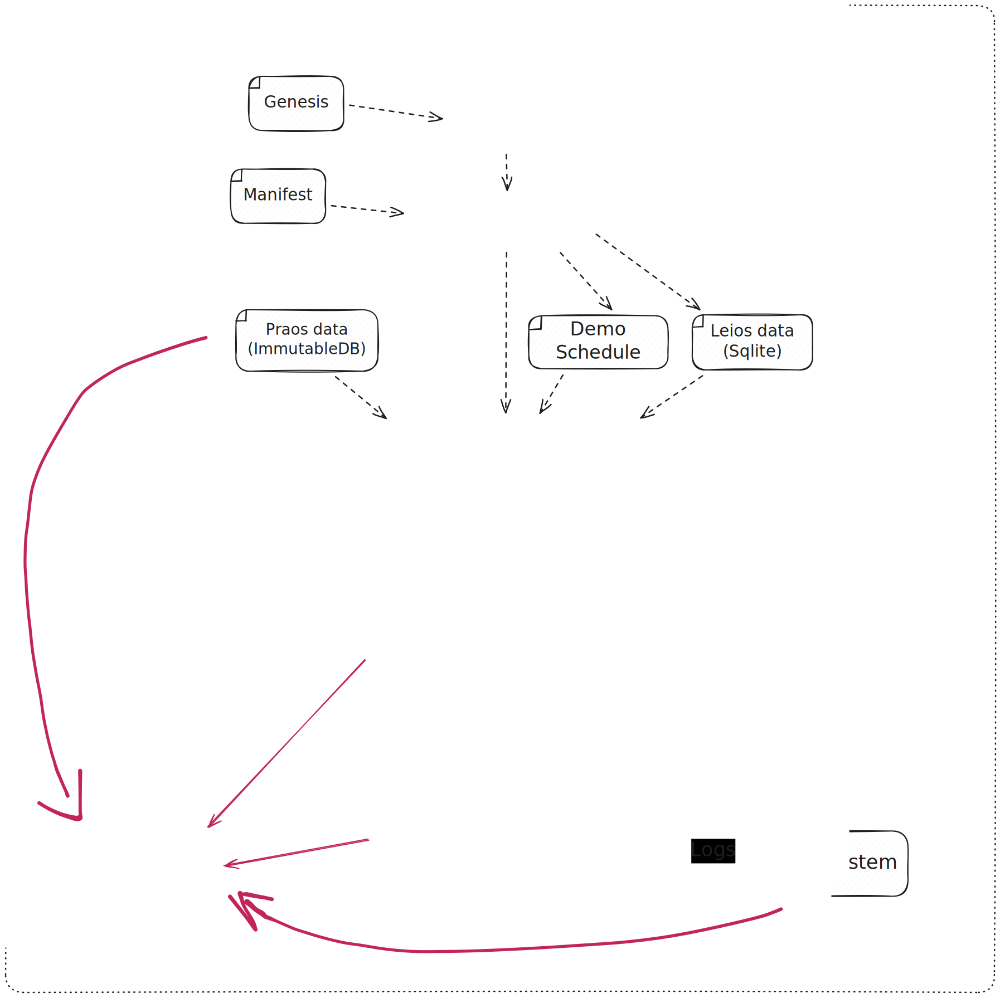

# Prototype demo - October 2025

Minimum viable demo of Leios network traffic interfering with Praos using a three node setup and prepared Praos and Leios data.



> [!TIP]
> This is an excalidraw SVG with embedded scene so it can be loaded and edited in [https://excalidraw.com/].

## The Praos traffic and Leios traffic

In this iteration of the demo, the data and traffic is very simple.

- The Praos data is a simple chain provided by the Performance&Tracing team.
- The mocked upstream peer serves each Praos block when the mocked wall-clock reaches the onset of their slots.
- The Leios data is ten 12.5 megabyte EBs.
  They use the minimal number of txs necessary in order to accumulate 12.5 megabytes in order to minimize the CPU&heap overhead of the patched-in Leios logic, since this iteration of trhe demo is primarily intended to focus on networking.
- The mocked upstream peer serves those EBs just prior to the onset of one of the Praos block's slot, akin to (relatively minor) ATK-LeiosProtocolBurst attack.
  Thus, the patched nodes are under significant Leios load when that Praos block begins diffusing.

## Demo components
### The mocked upstream peer

The mocked upstream peer is a patched variant of `immdb-server`.

- It runs incomplete variants of LeiosNotify and LeiosFetch: just EBs and EB closures, nothing else (no EB announcements, no votes, no range requests).
- It serves the EBs present in the given `--leios-db`; it sends Leios notificaitons offering the data according to the given `--leios-schedule`.
  See the demo tool section above for how to generate those files.

### The patched node/node-under-test

The patched node is a patched variant of `cardano-node`.
All of the material changes were made in the `ouroboros-consensus` repo; the `cardano-node` changes are merely for integration.

- It runs the same incomplete variants of LeiosNotify and LeiosFetch as the mocked upstream peer.
- The Leios fetch request logic is a fully fledged first draft, with following primary shortcomings.
  - It only handles EBs and EB closures, not votes and not range requests.
  - It retains a number of heap objects in proportion with the number of txs in EBs it has acquired.
    The real node---and so subsequent iterations of this prototype---must instead keep that data on disk.
    This first draft was intended to do so, but we struggled to invent the fetch logic algorithm with the constraint that some of its state was on-disk; that's currently presumed to be possible, but has been deferred to a subsequent iteration of the prototype.
  - It never discards any information.
    The real node---and so subsequent iterations of this prototype---must instead discard EBs and EB closures once they're old enough, unless they are needed for the immutable chain.
  - Once it decides to fetch a set of txs from an upstream peer for the sake of some EB closure(s), it does not necessarily compose those into an optimal set of requests for that peer.
    We had not identified the potential for an optimizing algorithm here until writing this first prototype, so it just does something straight-forward and naive for now (which might be sufficient even for the real-node---we'll have to investigate later).

There are no other changes.
In particular, that means the `ouroboros-network` mux doesn't not deprioritize Leios traffic.
That change is an example of what this first prototype is intended to potentially demonstrate the need for.
There are many such changes, from small to large.
Some examples includes the following.

- The prototype uses SQLite3 with entirely default settings.
  Maybe Write-Ahead Log mode would be much preferable, likely need to VACUUM at some point, and so on.
- The prototype uses a mutex to completely isolate every SQLite3 invocation---that's probably excessive, but was useful for some debugging during initial development (see the Engineering Notes appendix)
- The prototype chooses several _magic numbers_ for resource utilization limits (eg max bytes per reqeust, max outsanding bytes per peer, fetch decision logic rate-limiting, txCache disk-bandwidth rate-limiting, etc).
  These all ultimately need to be tuned for the intended behvaiors on `mainnet`.
- The prototype does not deduplicate the storage of EBs' closures when they share txs.
  This decision makes the LeiosFetch server a trivial single-pass instead of a join.
  However, it "wastes" disk space and disk bandwidth.
  It's left to future work to decide whether that's a worthwhile trade-off.

### The mocked downstream node

For simplicity, this is simply another instance of the patched node.
In the future, it could be comparatively lightweight and moreover could replay an arbitrary schedule of downstream requests, dual to the mocked upstream peer's arbitrary schedule of upstream notifications.

### Appendix: Engineering Notes

This section summarizes some lessons learned during the development of this prototype.

- Hypothesis: A SQLite connection will continue to hold SQLite's internal EXCLUSIVE lock _even after the transaction is COMMITed_ when the write transaction involved a prepared statement that was accidentally not finalized.
  That hypothesis was inferred from a painstaking debugging session, but I haven't not yet confirmed it in isolation.
  The bugfix unsuprisingly amounted to using `bracket` for all prepare/finalize pairs and all BEGIN/COMMIT pairs; thankfully our DB patterns seem to accommodate such bracketing.
- The SQLite query plan optimizer might need more information in order to be reliable.
  Therefore at least one join (the one that copies out of `txCache` for the EbTxs identified in an in-memory table) was replaced with application-level iteration.
  It's not yet clear whether a one-time ANALYZE call might suffice, for example.
  Even if it did, it's also not yet clear how much bandwidth usage/latency/jitter/etc might be reduced.

## Using Nix run (recommended)

You can run the demo directly from the GitHub repository using Nix (requires SSH access):

```shell
nix run github:input-output-hk/ouroboros-leios#leios-202510-demo
```

Or from a local checkout:

```shell
nix run .#leios-202510-demo
```

The demo uses default values of `REF_SLOT=41` and `SECONDS_UNTIL_REF_SLOT=5`. You can override these:

```shell
SECONDS_UNTIL_REF_SLOT=10 REF_SLOT=200 nix run github:input-output-hk/ouroboros-leios#leios-202510-demo
```

## Using run-demo.sh directly

Alternatively, you can run the script directly from a dev shell:

```shell
SECONDS_UNTIL_REF_SLOT=5 REF_SLOT=177 DATA="./data" ./run-demo.sh

...
Each row represents a unique block seen by both nodes, joined by hash and slot.
   slot                                               hash     latency_ms
0     2  4e93dab121aaeabf20a6b6112048260fb1b72ed94f10eb...  179118.490342
1    44  bd384ce8792d89da9ab6d11d10fc70a36a2899e6c3b10d...  137309.362409
2    52  23b021f8e2c06e64b10647d9eeb5c9f11e50181f5a5694...  129462.848231
3    53  5ecd12b363657693f31e62421726fcc427788eed6d2fb2...  128463.045544
4    59  0341e8795f13d6bcbd0d1fec0fc03fb75ede8cd6d75999...  122466.373131
5   183  56515bfd5751ca2c1ca0f21050cdb1cd020e396c623a16...     605.664913
6   187  60fd8fc00994ac1d3901f1d7a777edf5b99546a748fc7d...    3269.136876
7   188  48cf5b44cb529d51b5b90c8b7c2572a27a2f22fc8933fe...    6842.006962

Total unique block events matched: 8
```

## Nix build targets

Build an empty Leios DB:

```shell
$ nix build .#leios-empty-db
$ sqlite3 result ".schema"
CREATE TABLE txCache
...
```

Build a busy Leios DB from the manifest:

```shell
$ nix build .#leios-busy-db
$ sqlite3 result ".schema"
CREATE TABLE txCache
...
```

Build a busy Leios schedule from the manifest:

```shell
$ nix build .#leios-busy-db.schedule
$ cat result-schedule
[
  [
    182.9,
    [
      0,
      "adfe0e24083d8dc2fc6192fcd9b01c0a2ad75d7dac5c3745de408ea69eaf62d8",
      28234
...
```
