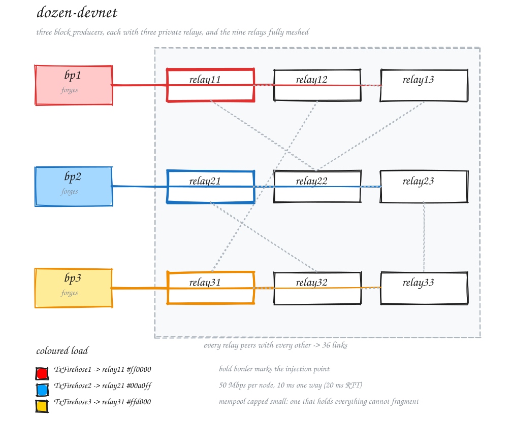

# Demo: Dozen-Devnet

A twelve node Cardano devnet with a realistic peer degree, for throughput
experiments. Sibling of [proto-devnet](../proto-devnet) — same patched nodes,
same genesis, same x-ray observability, different topology.

## Topology

Three block producers, each with three private relays, and the nine relays
fully meshed among themselves.



> [!TIP]
> This is an excalidraw SVG with embedded scene so it can be loaded and edited in [https://excalidraw.com/].

Why this shape:

- **A relay has nine peers, not two.** Node-to-node tx-submission is bounded per
  peer by the tx-submission credit window, so the number of upstream peers is a
  first-order term in how fast a node can take in transactions. Three fully
  connected nodes cannot show that; nine can.
- **A block producer only talks to its own relays.** Every transaction and every
  block between two pools crosses at least two relay hops, so propagation delay
  is not a single link.
- **Only the three block producers forge.** Relays run without pool keys, which
  also means the Leios committee is unchanged from proto-devnet — same three
  pools, same stake distribution, same genesis.

## Getting started

Run the demo with all dependencies automatically provided using nix:

``` shell
nix run github:input-output-hk/ouroboros-leios#demo-dozen-devnet
```

Or enter the `nix develop` shell (also available via `direnv allow`) and run
`./run.sh`:

``` shell
cd demo/dozen-devnet
nix develop ../..#dev-demo-dozen-devnet
./run.sh
```

Prerequisites without nix are the same as proto-devnet's (`process-compose`,
Leios-patched `cardano-node`, matching `cardano-cli`, `sqlite3`, `jq`, `yq`,
`envsubst`, `tx-firehose`), plus `ip` and `tc` from `iproute2` when traffic
control is on.

## What's included

1. Initializes twelve node directories, generating each node's `topology.json`
   from the topology above
2. Sets up one network namespace per node, bridged together and traffic shaped
3. Starts all twelve nodes
4. Submits a transaction workload to `relay11` using `tx-firehose`, with a
   second on-demand generator against `relay21`
5. Observes tip and mempool on `bp1` and `relay11`, and everything else in
   Grafana

## Configuration

Environment variables, see `run.sh` for the full list:

| Variable            | Default              | Meaning                                             |
| ------------------- | -------------------- | --------------------------------------------------- |
| `TPS`               | `500`                | tx-firehose submission rate                         |
| `RATE`              | `50Mbps`             | per-node uplink and downlink cap                    |
| `DELAY`             | `10ms`               | one-way delay, so an RTT is `2 x DELAY`             |
| `TC`                | `1`                  | traffic control; `0` puts nodes on loopback         |
| `XRAY`              | `1`                  | observability stack                                 |
| `SERVER`            | `1`                  | process-compose control API on `127.0.0.1:8080`     |
| `NODE_RTS`          | (empty)              | extra per-node RTS flags, e.g. `-N4` on a big host   |
| `WORKING_DIR`       | `$(pwd)/tmp-devnet`  | where the devnet is initialized                     |
| `SHARED_CONFIG_DIR` | `../proto-devnet/config` | genesis, pool keys, delegators, dashboards      |
| `COLOR1..3`         | red, blue, amber     | colour each generator tags its transactions with    |

``` shell
TPS=1000 RATE=100Mbps DELAY=50ms ./run.sh
```

## Mempool colouring

Each generator tags its transactions with a colour (`tx-firehose --color`), and
one `mempool-monitor` per node reports which colours that node is holding. One
observer per node is the point: fragmentation is a statement about how mempools
*differ*, so an aggregate would hide it.

A node's `--own-color` is its own block producer's generator: `bp2` and
`relay21..relay23` all count `COLOR2` as local. So the local share answers "how
much of this mempool is my group's own load", which is the quantity that should
fall with distance from an injection point.

### Watching all twelve

``` shell
./mempool-panes.sh
```

A tiled tmux session, one pane per node, on demand and separate from the devnet.
process-compose cannot tile — its TUI shows one pane at a time — so the panes
have to live somewhere else.

Twelve panes always tile as 4 rows x 3 columns — tmux grows rows and columns
alternately until they cover the pane count, so it does not depend on terminal
size — and the node order is set to make **each column one group**, its producer
on top and its three relays below:

```text
bp1      bp2      bp3
relay11  relay21  relay31
relay12  relay22  relay32
relay13  relay23  relay33
```

Fragmentation then reads down a column (does this group's own colour dominate its
own relays) and across a row (has it leaked to the others). Each pane wants
roughly 50x10, so a wide terminal, or trim `NODES`.

Knobs: `NODES`, `MEMPOOL_MONITOR`, `MONITOR_INTERVAL`, `COLOR1..3`, `TSV`,
`SESSION`. Each pane also appends to `mempool-<node>.tsv` unless `TSV=0`, so a
run is reviewable afterwards and not only while watched.

The observers are not free: a drain is a round trip per transaction, cheap per
round but not nothing. Running with and without them is how to find out what they
cost, which at these depths deserves checking rather than assuming.

## Traffic control

Each node gets its own network namespace with a single veth into one Linux
bridge, and that uplink is shaped: `htb` at `RATE` on egress, and `netem` at
`DELAY` on ingress via an `ifb` mirror.

**`RATE` is per node, not per link.** It is the node's whole capacity, shared
across all of its peers — what a real relay's NIC looks like. This differs from
proto-devnet, where every peer link is shaped separately and a node's aggregate
bandwidth is therefore its degree times `RATE`. Comparing bandwidth-sensitive
numbers between the two demos needs that in mind.

Delay is applied on the receiving side only, so a packet crosses exactly one
`netem` in each direction and `DELAY` stays a one-way figure.

The bridge carries no topology information — all twelve nodes share one L2
segment and connectivity comes entirely from the `localRoots` in each node's
`topology.json`, with `PeerSharing: false` and no public or ledger peers. Turning
peer sharing back on would let the structure collapse toward a mesh.

Traffic control requires elevated privileges (`sudo`). To skip it entirely for
quick iteration, `TC=0 ./run.sh` puts the nodes on `127.3.0.1` through
`127.3.0.12` with no shaping and no `sudo`.

## Running alongside proto-devnet

The two demos use different subnets (`172.29.0.0/24` vs `172.28.0.0/24`),
different loopback ranges (`127.3/16` vs `127.2/16`) and different namespace
prefixes, so both can be up at once. The observability stack cannot: Grafana,
Prometheus and Loki bind fixed ports, so run one of them with `XRAY=0`.

## Clean up

``` shell
rm -rf tmp-devnet
```

Network namespaces and the bridge are removed when the project stops: the
`Namespaces` process holds them for the run's lifetime and tears them down from a
signal trap. `InitNamespaces` also tears down before it builds, so a run that
was killed outright — or a `kill -9` that never reached the trap — still leaves
nothing that blocks the next one.

To clean up by hand, e.g. after a hard reboot of the orchestrator:

``` shell
NS_PREFIX=dozen-devnet sudo -E scripts/teardown-namespaces.sh
```

## About the configuration

`config/` holds only what differs from proto-devnet:

- `config.yaml` — node configuration, so throughput knobs (ledger backend,
  tx-submission logic version, mempool capacity) can be set independently per
  demo
- `topology.template.json` — the skeleton; `run.sh` fills in `accessPoints` and
  sets `hotValency`/`warmValency` to the peer count
- `alloy.template` — one scrape target per node, generated by `run.sh`

Genesis files, pool keys, stake delegator keys, Alloy modules and Grafana
dashboards come from `SHARED_CONFIG_DIR`, i.e. proto-devnet's `config/`.
Duplicating them would only invite drift; both demos are network magic 164 with
the same three pools.

> [!IMPORTANT]
> Twelve nodes on one machine is a lot of `cardano-node`, and the box will
> become the bottleneck before the protocol does if you let it. `cardano-node`
> is built with `-N2`, so twelve nodes ask for 24 capabilities regardless of
> the host: on a 16-core machine that measured loadavg 24 and 90% CPU at
> 330 tx/s offered, and the resulting ceiling said more about the host than
> about Leios. Check `loadavg` against your core count before reading any
> throughput number as a protocol result, and use `NODE_RTS` to size the
> nodes to the machine.
>
> Tracing is part of that cost, not a free observer: at 330 tx/s the twelve
> nodes wrote 12.2 MB/s of JSON. `config/config.yaml` silences the highest
> volume traces for this reason — re-enable them for diagnosis, not for
> throughput runs.
