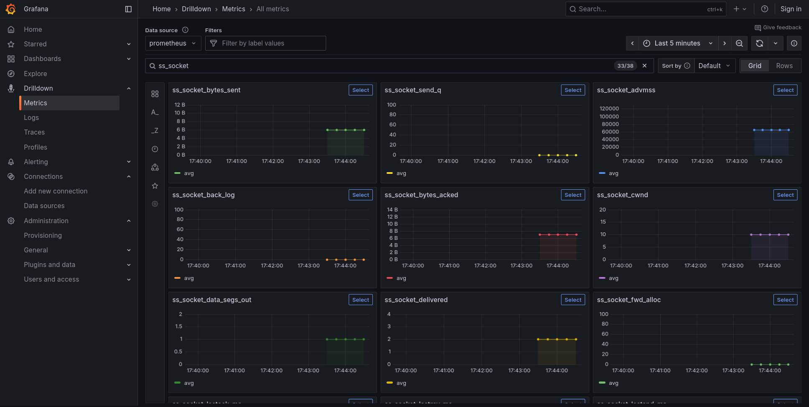

# X-RAY - Observability stack with Grafana

X-ray provides a complete observability stack for Leios demos using Grafana, Prometheus, Loki, and Alloy.

## Quick Start

**Using nix:**

```shell
nix run github:input-output-hk/ouroboros-leios#x_ray
```

**Without nix:**

Position your terminal into the current directory and enter the shell with

```shell
nix develop .#dev-demo-extras-x-ray
```

Or if you use Direnv with Nix

```shell
direnv allow
```

Then run:

```shell
./run.sh
```

## Configuration

You can customize the x_ray stack by setting environment variables before running:

```shell
export ALLOY_CONFIG=/path/to/custom/alloy
export LOG_PATH=/path/to/logs/*.log
./run.sh
```

Available environment variables:
- `ALLOY_CONFIG` - Path to Alloy configuration file
- `LOG_PATH` - Glob pattern for log files to collect
- `WORKING_DIR` - Working directory for runtime data (default: `tmp-x-ray`)
- `GRAFANA_INI`, `GRAFANA_HOMEPATH` - Grafana configuration
- `PROMETHEUS_CONFIG`, `LOKI_CONFIG` - Other service configs
- `SS_FILTER` - Socket statistics filter expression

All variables have sensible defaults and can be overridden as needed.

## Manual Setup

You can either work with this setup step by step, or use the
awesome [process-compose](https://f1bonacc1.github.io/process-compose/)

## Step by step
Let's make some sockets to monitor

```shell
nc -k -l 127.0.0.1 1337 &
echo hello | nc -p 1336 127.0.0.1 1337 &
```

Start the SS HTTP exporter that collects statistics about 1337 sockets

```shell
ss_http_exporter 127.0.0.1 9100 "dport = 1337" &
```

Check that it works

```shell
$ curl 127.0.0.1:9100
# TYPE ss_socket_recv_q gauge
ss_socket_recv_q{src_ip="127.0.0.1",src_port="ischat",dst_ip="127.0.0.1",dst_port="menandmice-dns",tcp_state="ESTAB"} 0
# TYPE ss_socket_send_q gauge
ss_socket_send_q{src_ip="127.0.0.1",src_port="ischat",dst_ip="127.0.0.1",dst_port="menandmice-dns",tcp_state="ESTAB"} 0
...
```

Start Prometheus so we can send metrics to it

```shell
prometheus --web.listen-address="0.0.0.0:9090" --web.enable-remote-write-receiver
```

Run Alloy configure to scrape the SS HTTP Exporter

```shell
alloy run alloy
```

Finally run Grafana

```shell
grafana server --config grafana.ini --homepath grafana
```

[Open Grafana in the browser](http://localhost:3001)



Clean up

```shell
pkill "socat|grafana|prometheus|alloy"
```

## process-compose

Run the setup using the wrapper script:

```shell
./run.sh
```

Or run process-compose directly (requires environment variables to be set):

```shell
process-compose -f process-compose.yaml
```

You should see


[Open Grafana in the browser](http://localhost:3001)
