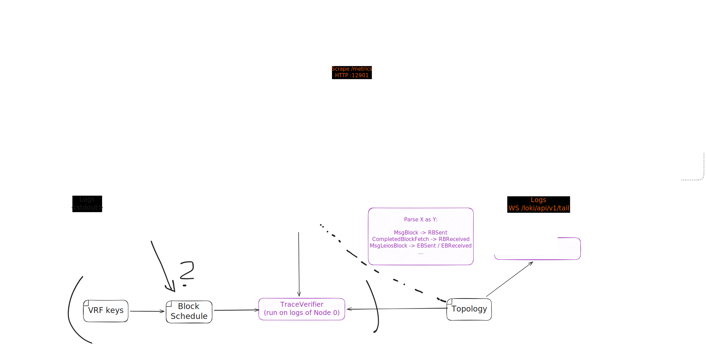

# Demo: Proto-Devnet

A small network of patched cardano nodes that is loaded with synthetically created transactions. The same observability as with [the November demo](../2025-11) is available.



> [!TIP]
> This is an excalidraw SVG with embedded scene so it can be loaded and edited in [https://excalidraw.com/].

## Prerequisites

- `cardano-testnet` (recent)
- Path to patched `cardano-node` set on `CARDANO_NODE`
- A compatible `cardano-cli` set on `CARDANO_CLI`
- `jq`

The `nix develop` shell, also available via `direnv allow`, provides all these.

## Start the devnet

We need to create an environment before starting it, because the prototype `cardano-node` is a bit older than `cardano-testnet` and needs patching:

``` shell
cardano-testnet create-env --output devnet --num-pool-nodes 3 --slot-length 1 --testnet-magic 164 --params-mainnet
cat devnet/configuration.yaml | jq '.EnableP2P = true' > devnet/configuration.yaml
cardano-testnet cardano --node-env devnet --update-time
```
