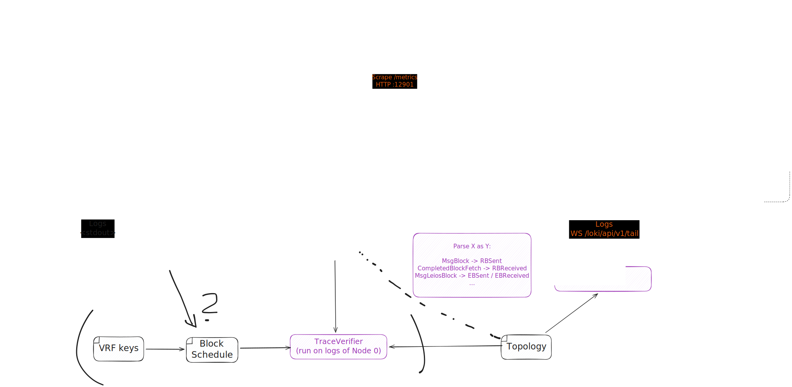

# Demo: Proto-Devnet

A small network of patched cardano nodes that is loaded with synthetically created transactions. Includes the x-ray observability as also used on [the protocol burst demo](../burst).



> [!TIP]
> This is an excalidraw SVG with embedded scene so it can be loaded and edited in [https://excalidraw.com/].

## Getting started

Run the demo with all dependencies automatically provided using nix:

``` shell
nix run github:input-output-hk/ouroboros-leios#demo-proto-devnet
```

Or enter the `nix develop` shell (also available via `direnv allow`) and follow [without nix instructions](#without-nix).

### Without Nix

Install these prerequisites:

- `process-compose` for orchestrating the demo processes
- `cardano-node` patched with Leios support
- `cardano-cli` compatible with the cardano-node version
- `sqlite3` for creating Leios databases
- `jq` and `envsubst` for config modifications
- `tx-centrifuge` for generating transaction workload

Ensure they are on your PATH, override if needed with something like:

``` shell
export PATH=/path/to/cardano-node-directory:/path/to/cardano-cli-directory:$PATH
```

Then run:

``` shell
./run.sh
```

## What's included

This `process-compose` orchestrated demo will:

1. Initialize a three node cardano devnet
2. Start all three nodes
3. Generate and submit a transaction workload using `tx-centrifuge`
4. Observes tip advancing and mempool size (more observability come later):

``` shell
export CARDANO_NODE_NETWORK_ID=164
export CARDANO_NODE_SOCKET_PATH=devnet/node1/node.socket
watch -n1 "cardano-cli query tip && cardano-cli query tx-mempool info"
```

## Configuration

You can customize the demo by setting environment variables before running. See `run.sh` for available options and their defaults:

``` shell
export WORKING_DIR=my-devnet
./run.sh
```

## Traffic control

Proto-devnet uses Linux network namespaces and `tc` (traffic control) to simulate realistic network conditions between nodes: a configurable rate limit and latency on each link.

This requires elevated privileges (`sudo`). The rate and delay can be tuned:

``` shell
RATE=1Mbps DELAY=500ms ./run.sh
```

To disable traffic control entirely for quick iteration without elevated processes:

``` shell
TC=0 ./run.sh
```

When disabled, nodes run directly on loopback (`127.0.0.1`) with different ports — no network simulation, no `sudo`.

## Observability with X-ray

Proto-devnet generates an Alloy configuration for use with the X-ray observability stack.

The observability stack is started by default and can be turned off using `XRAY=0`.

When the tools are available and observability is not turned off, you can access grafana at <http://localhost:3000>

## Clean up

To reset the demo, simply remove the working directory, for example:

``` shell
rm -rf tmp-devnet
```

## About the configuration

The `config/` directory contains pre-prepared configuration files for the 3-node devnet:

- Genesis files (shelley, alonzo, conway, dijkstra)
- Node configuration (`config.json`)
- Topology template (`topology.template.json`)
- Pool keys for 3 block-producing nodes (pool1, pool2, pool3)
- Stake delegators and UTxO keys

This serves as a starting configuration when intializing the testnet (see `init.sh`), which requires the typical modifications like file permissions, topology wiring and updating the start times.

The template configuration was originally created using `cardano-cli`:

``` shell
cardano-cli conway genesis create-testnet-data --out-dir config --testnet-magic 164 --pools 3 --total-supply 2000000000000 --delegated-supply 240000000002 --stake-delegators 3 --utxo-keys 3
```

Then tuned and removed unnecessary components (Byron-era and governance-related files).
