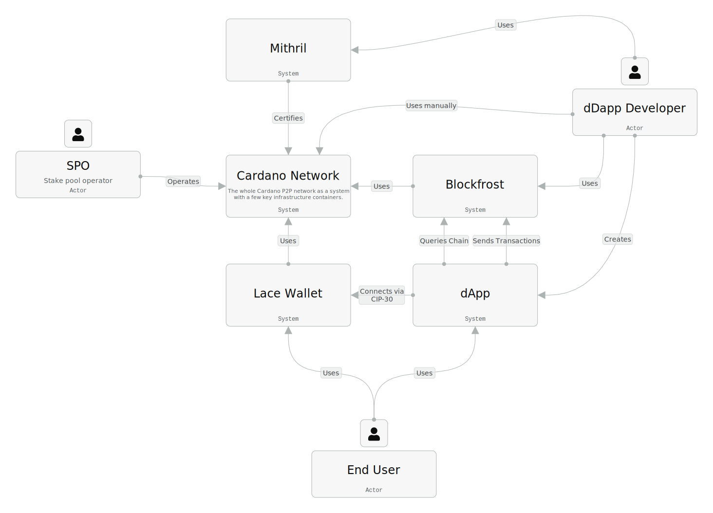
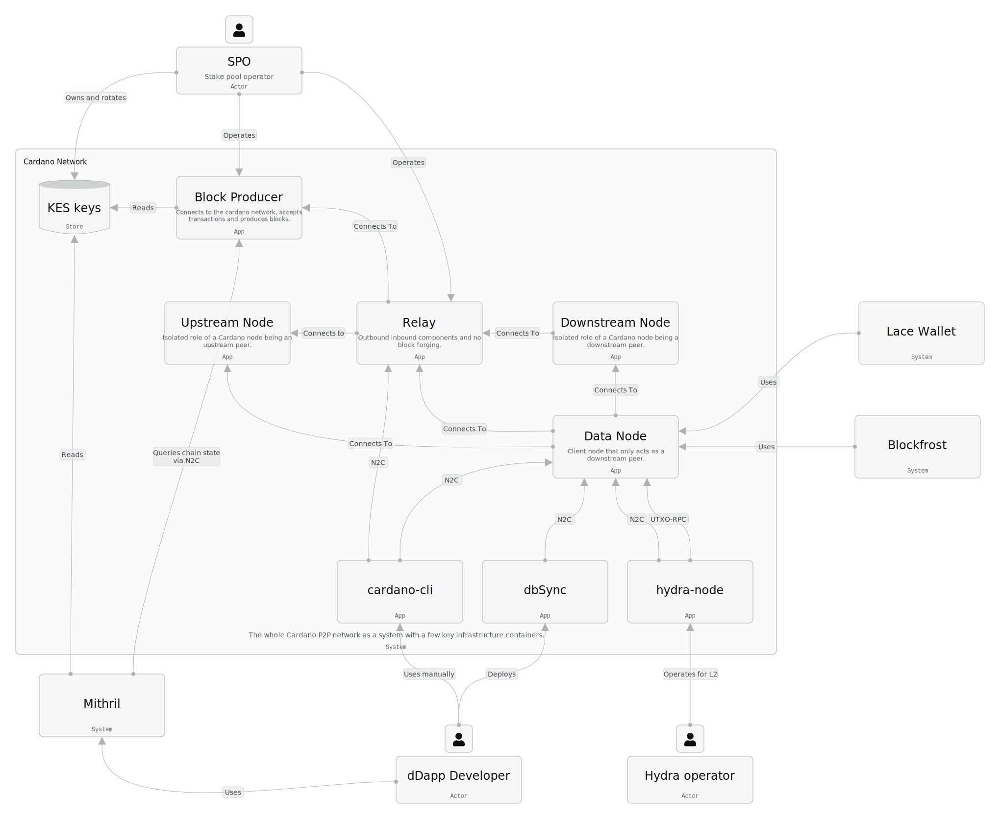

# Introduction

This document is the first iteration of a high-level design document for the Leios consensus upgrade as also proposed in [CIP-0164](https://github.com/cardano-foundation/CIPs/pull/1078). It analyses the protocol-level design provided by the CIP and **derives requirements** (`REQ`) and **sketches changes** (`NEW` or `UPD`) onto the concrete components of the [`cardano-node`](https://github.com/IntersectMBO/cardano-node).

# Background

> [!WARNING]
> TODO: Introduce relevant concepts and terminology needed to comprehend the remainder of the document

- Recall from CIP-0164 that an _endorser block_ (EB) is a list of cryptographic hashes that uniquely identify (serialized) transactions (including their signatures).
- Let an _EB's closure_ be the sequence of transactions referenced by an EB.
  Note that reconstructing an EB from its closure is merely a matter of calculating hashes.
- Recall from CIP-0164 that a _ranking block_ (RB) is merely a Praos block with a couple extra header fields and possibly containing a Leios certificate instead of Cardano transactions.
- The new RB header fields in particular include the hash of the EB issued alongside the RB, which _announces_ that EB.
- Let a _TxRB_ be an RB containing transactions and no certificate.
- Let a _CertRB_ be an RB containing a certificate and no transactions.
- Let a _CertRB's closure_ be the closure of the EB that it certifies.
- A vote _supports_ an RB header directly and its announced EB indirectly: if enough votes support the same RB header, then its announced EB can be included on chain.

# Ecosystem

Most users interact with the Cardano system through a wallet or a dApp. Both of these systems provide end-user interfaces and are directly or indirectly connected to the Cardano network. A varying number of services in between the Cardano network and those user-facing applications determines the impact of the Leios upgrade onto the Cardano ecosystem. The Cardano network itself is operated by so-called stake pool operators (SPOs). The following context diagram illustrates notable personas, a few example systems of the Cardano ecosystem and their interactions:

## Impact on operations

The Leios upgrade does not change the roles and responsibilities for SPOs and only small changes to their operations are expected. Besides a modest increase in compute and network requirements (see [resource requirements summary in the CIP](https://github.com/cardano-scaling/CIPs/blob/leios/CIP-0164/README.md#resource-requirements)), one additional step in the block producing node setup is required: One additional key pair is needed to sign votes for EBs.

- **REQ-GenerateBLSKeys** SPOs must be able to generate BLS key pairs.
- **REQ-RegisterBLSKeys** SPOs must be able to register their BLS public key to become part of the voting committee.
- **REQ-RotateBLSKeys** SPOs must be able to rotate their BLS key and limit usage of compromised keys.

Concretely, these BLS keys could be generated and managed alongside the existing VRF keys. The node configuration needs to be extended to include the BLS signing key and the public key will need to be known to the ledger. Making them part of the operational certificate would be one option here, but this would increase the block headers by at least 381 bits (BLS-381 is the proposed scheme). At the time of writing the maximum block header size (a protocol parameter) is 1100 Bytes and typical block headers are around 860 Bytes. With the signing key available, the node will be able to automatically issue votes for EBs.

## Impact on user experience

Individual users are not expected to be impacted by the Leios upgrade. The transaction format and ledger semantics remain unchanged. Functionally, end-users will be able to use wallets and dApps as before, while dApp developers can continue to build on top of Cardano as before.

Throughput increases often come with a trade-off in latency, as also stated in the published Leios research paper. However, when compared to Praos, the proposed Leios protocol does **not impact inclusion latency in practice**. For example, a subset of users wants to submit 12 megabytes worth of transactions to the chain. With today's consensus protocol (Praos), this would take around 12000 / 90 ~ 133 blocks to get all transactions included. Assuming the average block time, the latency for the last of those transactions would be around 133 * 20s / 60s ~ 44 minutes. In contrast, with Leios as proposed in CIP-164, it would take only one certified EB in an RB; which say happens after 5-10 ranking blocks, resulting in roughly 10 * 20s / 60s ~ 3 minutes inclusion latency. On the other hand, if the system has lower demand than Praos capacity, transaction inclusion latency is exactly the same. The CIP provides more detail on expected latency [in the simulation results](https://github.com/cardano-scaling/CIPs/blob/leios/CIP-0164/README.md#simulation-results).

Two key non-functional requirements for end-users are:

- **REQ-LowLatency** End-users expect low inclusion latency of transactions.
- **REQ-NoLostTransactions** Even under high load, end-users expect that transactions are eventually included on chain.

While individual transactions may take 50 seconds+ in high load situations to be included, the fact that Leios certificates require a supermajority of votes could provide a stronger finality guarantee for transactions than a first inclusion in a Praos block. This does not give rise to a specific requirement at this point, but needs to be further investigated.

## Impacted infrastructure

The Leios consensus upgrade does "only" change the algorithm of how consensus on a transaction sequence is achieved. The currently proposed protocol does _not_ change the transaction format or ledger semantics. Therefore, the impact of the Leios upgrade onto the Cardano ecosystem is generally bounded by the client interfaces offered by the Cardano network system (its various node implementations). The following system diagram depicts the Cardano peer to peer network as a set of nodes in block producing, relay or data serving roles, as well as examples of key infrastructure applications:

Block producing and relay nodes represent the backbone of the Cardano chain, are typically operated by SPOs, and only few implementations exist. On the other hand, there is an increasing number of implementations for data serving purposes, which are typical entry points into the Cardano network for major wallets and dApps. Interaction between nodes happens via the node-to-node network protocols and most node implementations also offer client interfaces to interact with the chain and create integrations with other systems. Most applications using the cardano network utilize indexers and other middleware to provide performant access to chain data - dbSync is one example for such a component. Hydra nodes are depicted as an example of a directly integrated dApp, which creates a so-called layer 2 - a ledger running on top of Cardano that is faster, cheaper, or has different functionality. Layer 2 infrastructure like Hydra or bridges to other chains are important systems to be considered when estimating the impact of the Leios upgrade. However, there are many more components in the Cardano ecosystem, and this document only captures a few relevant ones.

### Client interfaces

There are two major [client interfaces](https://cardano-scaling.github.io/cardano-blueprint/client/index.html) served by Cardano node: the node-to-client (N2C) protocol and the [UTxO-RPC](https://utxorpc.org/) interface. The N2C protocol follows the design used between nodes on the peer-to-peer network, but using a different set of mini-protocols that allow clients to query the ledger state, submit transactions, and conveniently follow the chain. The UTxO-RPC interface is a gRPC interface for UTxO blockchains that allows clients to query chain data and submit transactions. Both interfaces are abstracting away details of how consensus is achieved and therefore are only marginally impacted by the Leios consensus change.

> [!WARNING]
> TODO: Update cardano-blueprint for LocalChainSync and link it here or find another non-ogmios reference

Both client interfaces provide access to the chain as a sequence of blocks: N2C via the `LocalChainSync` (see [ogmios API reference](https://ogmios.dev/mini-protocols/local-chain-sync/)) and UTxO-RPC via the [Sync Module](https://utxorpc.org/sync/intro/). As the Leios upgrade will change the block format, those APIs will need to be updated to reflect the new block structure. However, the fundamental concept of a block containing transactions remains unchanged and a backwards compatible representation of blocks is possible. For example, the `LocalChainSync` protocol is serving currently Praos blocks, whose body is basically a list of transactions (see the [Conway CDDL](https://github.com/IntersectMBO/cardano-ledger/blob/master/eras/conway/impl/cddl-files/conway.cddl)). With Leios, this would change to either a list of transactions or a certificate. However, a backwards compatible way would be to "inline" the transactions referenced via an EB in the block body, so that clients can continue to consume transactions directly from the block body. Two things need to be considered with this approach:

1. The block body would grow significantly in size, as it would contain all transactions referenced by the EB. For example, client applications would need to handle up to 12.5 MB / 90 kB ~ 140x increase in block size.

2. The block body hash in the header would not be a simple hash of the body bytes anymore. However if the certificate is also part of the body, block integrity can be verified, albeit requiring a slightly more complex procedure.

In summary the following requirements arise for client interfaces:

- **REQ-ClientInterfaceChainSync** Client interfaces for chain synchronization and accessing block data should be updated in a backwards compatible way.
- **REQ-ClientInterfaceTransactionSubmission** Client interfaces for transaction submission should not change.
- **REQ-ClientInterfaceTransactionMonitor** Client interfaces for monitoring the mempool should not change.
- **REQ-ClientInterfaceLedgerStateQuery** Client interfaces for querying the ledger state may be extended to provide information about Leios specifics (e.g. the voting committee).

### Systems not impacted by Leios

Large parts of the Cardano ecosystem are not impacted by the Leios protocol as proposed in CIP-164 or are only marginally affected in the sense of updating dependencies and documentation.

#### Direct usage of client interfaces

If a system uses one of the client interfaces to communicate with a Cardano node and takes this functionality from specific libraries, it requires only updating of that library to stay compatible with Leios. For example:

* Infrastructure like Ogmios (Haskell libraries), Oura (via Pallas, Rust)
* Indexers like DBSync, Kupo (Haskell libraries)
* Mithril (via Pallas, Rust)
* Wallet API cardano-wallet (Haskell libraries)
* L2 solutions like Hydra (Haskell libraries)

#### Indirect usage of client interfaces

Some systems do not even use the client interfaces directly, but other components like Ogmios, DBSync, or Oura as a middleware to interact with the Cardano network. In this case, a mere updating of these components is sufficient to continue operation. For example:

* Chain data providers like Blockfrost, Koios, or Maestro (most via Ogmios and DBSync)
* Wallet providers using Ogmios, Blockfrost, and cardano-wallet
* Explorers like Cexplorer, AdaStat, or AdaPools (expected to use DBSync or other indexers)

#### No dependency on consensus

Several systems do not depend on consensus data structures and sementics at all. The proposed protocol does not require changes to the transaction format and thus there is no "Cardano API change" that could impact these systems. This includes all transaction building libraries, but also the majority of the Cardano dApp ecosystem. For example:

* Cardano SDKs like lucid or mesh
* L2 solutions like Hydra, Midgard, zkFold
* Stablecoin systems like Djed, USDM
* DApps built on top of Cardano

### Systems impacted by Leios

The closer a system is to the consensus layer, the more changes are required to stay compatible with Leios. Especially when applications are not "insulated" through client interfaces or other middleware components, more significant changes are required. Besides structural dependencies, changes to non-functional properties like increased throughput and latency may also impact certain systems.

#### Network and consensus libraries

Naturally, libraries implementing the Cardano network and consensus primitives going to be affected by changes to the protocol at this level. By extension, this also includes all validating and data node implementations and is futher covered in later sections. Besides the Haskell libraries examples of impacted projects are:

* Pallas (Rust)
* Gouroboros (Golang)
* Acropolis, Amaru and Dingo

#### Leios internals

While many systems will be able to stay compatible by merely updating their clients to the Cardano network (see above), some components might want to provide Leios-specific information through their APIs and user interfaces. The amount of changes required depends on the individual system architecture and may range from merely indexing node-to-node communication via a data node or may result in change requests to the client interfaces. Examples of such systems are:

* DBSync and other indexers
* Cardano explorers

Ultimately, whether and how much of a change is required in these systems depends on their respective end user requirements.

#### Latency sensitivity

As the CIP points out, even after the Leios upgrade individual transaction inclusion latency may become high at times of high load. In contrast to the (non-)impact on user experience (see above), some systems might be sensitive to generally longer inclusion times. This includes systems that need to perform conversions between assets on different chains or systems that need to react to on-chain events within a certain time frame. Examples of such systems are:

* Bridges
* DEXes
* Algorithmic stablecoins
* Layer 2 solutions

Note that this sensitivity is not due to a change in the protocol itself, but always present when demand exceeds capacity. This is also true for the current Praos protocol and its corresponding capacity.

#### Higher throughput

Lastly, the mere increase in throughput may impact some systems. Currently, the Cardano network maximum data throughput capacity is 4.5 TxkB/s. The Leios protocol upgrade and proposed parameters may result in up to 250 TxkB/s - corresponding to a more than 50x increase. Besides transactional throughput, this also results in higher storage requirements for systems that index and provide access to chain data. While some system architectures may have been designed with an order of magnitude more throughput in mind, 50x would be significant enough to result in unexpected load and may require optimizations or architecture changes. A non-functional requirement to mitigate this risk is:

- **REQ-EarlyTestnet** Provide access to a Leios testnet with high load as early as possible to allow infrastructure and dApp developers to test and optimize their systems.

### Full survey

A survey of various Cardano ecosystem components was conducted to estimate the impact of Leios in its base form in comparison to more complex variants (e.g., including sharding). Various projects across several categories in the Cardano ecosystem were considered, analysed and their creators interviewed for their expected impact (this was prior to publishing CIP-164). Find the results of this survey in [this spreadsheet](https://docs.google.com/spreadsheets/d/1NpXhfRl50xr4jYouk6aeXXQyeW4KVlKsELa3dpGBtVI).

> [!WARNING]
> TODO: Convert spreadsheet to markdown table in appendix

# Consensus

This section covers the anticipated impact onto [the Consensus and Storage Layer](https://github.com/IntersectMBO/ouroboros-consensus) of [`cardano-node`](https://github.com/IntersectMBO/cardano-node).

CIP-0164 implies functional requirements for the node to issue EBs alongside RBs, vote for EBs according to the rules from the CIP, include certificates when enough votes are seen, diffuse EBs and votes through the network layer, and retain EB closures indefinitely when certified. The Consensus layer is responsible for driving these operations and coordinating with the Network layer (which implements the actual mini-protocols) to ensure proper diffusion.

## Block production

The existing block production thread must be updated to generate an EB at the same time it generates an RB (**UPD-LeiosAwareBlockProductionThread**). In particular, the hash of the EB is a field in the RB header, and so the RB header can only be decided after the EB is decided, and that can only be after the RB payload is decided. Moreover, the RB payload is either a certificate or transactions, and that must also be decided by this thread, making it intertwined enough to justify doing it in a single thread.

- **REQ-IssueLeiosBlocks** The node must issue an EB alongside each RB it issues, unless that EB would be empty.
- **REQ-IncludeLeiosCertificates** The node must include a certificate in each RB it issues if it has seen enough votes supporting the EB announced by the preceding RB. (TODO excluding empty or very nearly empty EBs?)

The Mempool capacity should be increased (**UPD-LeiosBiggerMempool**) to hold enough valid transactions for the block producer to issue a full EB alongside a full RB. The Mempool capacity should at least be twice the capacity of an EB, so that the stake pool issuing a CertRB for a full EB would still be able to issue a full EB alongside that CertRB (TxRB's have less transaction capacity than the EB certified by a CertRB). In general, SPOs are indirectly incentivized to maximize the size of the EB, just like TxRBs—so that more fees are included in the epoch's reward calculation.

## Vote production and storage

A new thread dedicated to Leios vote production (**NEW-LeiosVoteProductionThread**) will wake up when the closure of an EB is newly available. If the voting rules would require the stake pool to vote (now or soon) for this EB if it's valid, then this thread will begin validating it. Note if multiple closures arrive simultaneously, at most one of them could be eligible for a vote, since the voting rules require the EB to be announced by the tip of the node's current selection. If the validation succeeds while the voting rules still require the stake pool to vote for this EB (TODO even if it has since switched its selection?), the thread will issue that vote.

- **REQ-IssueLeiosVotes** The node must vote for EBs exactly according to the rules from the CIP.

A new storage component (**NEW-LeiosVoteStorage**) will store all votes received by a node, up to some conservative age (eg ten minutes). As votes arrive, they will be grouped according to the RB they support. When enough votes have arrived for some RB, the certificate can be generated immediately, which can avoid delaying the potential subsequent issuance of a CertRB by this node. A vote for the EB announced by an RB is irrelevant once all nodes will never switch their selection away from some block that is not older than that RB. This condition is very likely to be satisfied relatively soon on Cardano mainnet, unless its Praos growth is being disrupted. Therefore, the vote storage component can simply discard votes above some conservative age, which determines a stochastic upper bound the heap size of all sufficiently-young votes.

- **REQ-DiffuseLeiosVotes** The node must diffuse votes (via the Network layer's mini-protocols) at least until they're old enough that there remains only a negligible probability they could still enable an RB that was issued on-time to include a certificate for the EB they support.

## Endorser block storage

Unlike votes, a node should retain the closures of older EBs (**NEW-LeiosEbStore**), because Praos allows for occasional deep forks, the most extreme of which could require the closure of an EB that was announced by the youngest block in the Praos Common Prefix. On Cardano mainnet, that RB is usually 12 hours old, but could be up to 36 hours old before [CIP-0135 Disaster Recovery Plan](https://cips.cardano.org/cip/CIP-0135) is triggered. Thus, EB closures are not only large but also have a prohibitively long lifetime even when they're ultimately not immortalized by the historical chain. This component therefore stores EBs on disk just as the ChainDB already does for RBs. The volatile and immutable dichotomy can even be managed the same way it is for RBs.

- **REQ-DiffuseLeiosBlocks** The node must acquire and diffuse EBs and their closures (via the Network layer's new mini-protocols, see below).
- **REQ-ArchiveLeiosBlocks** The node must retain each EB's closure indefinitely when the settled Praos chain certifies it.

Each CertRB must be buffered in a staging area (**NEW-LeiosCertRbStagingArea**) until its closure arrives, since the VolDB only contains RBs that are ready for ChainSel. (Note that a CertRB's closure will usually have arrived before it did.) (TODO Any disadvantages? For example, would it be beneficial to detect an invalid certificate before the closure arrives?) (TODO a more surgical alternative: the VolDB index could be aware of which EB closures have arrived, and the path-finding algorithm could incorporate that information. However, this means each EB arrival may need to re-trigger ChainSel.) The BlockFetch client (**UPD-LeiosRbBlockFetchClient**) must only directly insert a CertRB into the VolDB if its closure has already arrived (which should be common due to L_diff). Otherwise, the CertRB must be deposited in the CertRB staging area instead.

The LedgerDB (**UPD-LeiosLedgerDb**) will need to retrieve the certified EB's closure from the LeiosEbStore when applying a CertRB. Due to NEW-LeiosCertRbStagingArea, it should be impossible for that retrieval to fail.

## Transaction cache

A new storage component (**NEW-LeiosTxCache**) will store all transactions received when diffusing EBs as well as all transactions that successfully enter the Mempool, up to some conservative age (eg one hour). The fundamental reason that EBs refer to transactions by hash instead of including them directly is that, for honest EBs, the node will likely have already received most of the referenced transactions when they recently diffused amongst the Mempools. That's not guaranteed, though, so the node must be able to fetch whichever transactions are missing, but in the absence of an attack that ought to be minimal.

The Mempool is the natural inspiration for this optimization, but it's inappropriate as the actual cache for two reasons: it has a relatively small, multidimensional capacity and its eviction policy is determined by the distinct needs of block production. This new component instead has a greater, unidimensional capacity and a simple Least Recently Used eviction policy. Simple index maintained as a pair of priority queues (index and age) in manually managed fixed size bytearrays, backed by a double-buffered mmapped file for the transactions' serializations. Those implementation choices prevent the sheer number of transactions from increasing GC pressure (adversarial load might lead to a ballpark number of 131000 transactions per hour), and persistence's only benefit here would be to slightly increase parallelism/simplify synchronization, since persistence would let readers release the lock before finishing their search.

Note: if all possibly-relevant EBs needed to fit in the LeiosTxCache, its worst case size would approach 500 million transactions. Even the index would be tens of gigabytes. This is excessive, since almost all honest traffic will be younger than an hour—assuming FFD is actually enforced.

## Resource management

The protocol requires resource-management to prioritize Praos traffic and computation over all Leios traffic, and prioritize younger EBs over older ones:

- **REQ-PrioritizePraosOverLeios** The node must prioritize Praos traffic and computation over all Leios traffic and computation so that the diffusion and adoption of any RB is only negligibly slower.
- **REQ-PrioritizeFreshOverStaleLeios** The node must prioritize Leios traffic and computation for younger EBs over older EBs.

These requirements can be summarized as: Praos > fresh Leios > stale Leios. The Consensus layer implements the scheduling logic to satisfy these requirements, while the Network layer (see below) implements the protocol mechanisms. Looking forward, Peras should also be prioritized over Leios, since a single Peras failure is more disruptive to Praos than a single Leios failure.

The fundamental idea behind Leios has always been that the Praos protocol is inherently and necessarily bursty. Leios should be able to freely utilize the nodes' resources whenever Praos is not utilizing them, which directly motivates REQ-PrioritizePraosOverLeios. It is ultimately impossible to achieve such time-multiplexing perfectly, due to the various latencies and hystereses inherent to the commodity infrastructure (non real-time operating systems, public Internet, etc). On the other hand, it is also ultimately unnecessary to time-multiplex Praos and Leios perfectly, but which degree of imperfection is tolerable?

One particularly relevant attack vector is the **protocol burst attack** (**ATK-LeiosProtocolBurst**). In a protocol burst attack the adversary withholds a large number of EBs and/or their closures over a significant duration and then releases them all at once. This will lead to a sustained maximal load on the honest network for a smaller but still significant duration, a.k.a. a burst. The potential magnitude of that burst will depend on various factors, including at least the adversary's portion of stake, but the worst-case is more than a gigabyte of download. The cost to the victim is merely the work to acquire the closures and to check the hashes of the received EB bodies and transaction bodies. In particular, at most one of the EBs in the burst could extend the tip of a victim node's current selection, and so that's the only EB the victim would attempt to fully parse and validate.

Contention for the following primary node resources might unacceptably degrade the time-multiplexing via contention between Praos and Leios:

- **RSK-LeiosPraosContentionNetworkBandwidth**: This is not anticipated to be a challenge, because time-multiplexing the bandwidth is relatively easy. In fact, Leios traffic while Praos is idle could potentially even prevent the TCP Receive Window from contracting, thus avoiding a slow start when Praos traffic resumes.
- **RSK-LeiosPraosContentionCPU**: This is not anticipated to be a challenge, because today's Praos node does not exhibit major CPU load on multi-core machines. Leios might have more power-to-weight ratio for parallelizing its most expensive task (EB validation), but that parallelization isn't yet obviously necessary. Thus, even Praos and Leios together do not obviously require careful orchestration on a machine with several cores.
- **RSK-LeiosPraosContentionGC**: It is not obvious how to separate Praos and Leios into separate OS processes, since the ledger state is expensive to maintain and both protocols frequently read and update it. When the Praos and Leios components both run within the same operating system process, they share a single instance of the GHC Runtime System (RTS), including eg thread scheduling and heap allocation. The sharing of the heap in particular could result in contention, especially during an ATK-LeiosProtocolBurst (at least the transaction cache will be doing tens of thousands of allocations, in the worst-case). Even if the thread scheduler could perfectly avoid delaying Praos threads, Leios work could still disrupt Praos work, because some RTS components exhibit hysteresis, including the heap.
- **RSK-LeiosPraosContentionDiskBandwidth**: Praos and Leios components might contend for disk bandwidth. In particular, during a worst-case ATK-LeiosProtocolBurst, the Leios components would be writing more than a gigabyte to disk as quickly as the network is able to acquire the bytes (from multiple peers in parallel). Praos's disk bandwidth utilization depends on the leader schedule, fork depth, etc, as well as whether the node is using a non-memory backend for ledger storage (aka UTxO HD or Ledger HD). For non-memory backends, the ledger's disk bandwidth varies drastically depending on the details of the transactions being validated and/or applied: a few bytes of transaction could require thousands of bytes of disk reads/writes.
  - Note that the fundamental goals of Leios will imply a significant increase in the size of the UTxO. In response, SPOs might prefer enabling UTxO HD/Ledger HD over buying more RAM.

Both GC pressure and disk bandwidth are notoriously difficult to model and so were not amenable to the simulations that drove the first version of the CIP. Prototypes rather than simulations will be necessary to assess these risks with high confidence.

The same risks can also be viewed from a different perspective, which is more actionable in terms of planning prototypes/experiments/etc: per major component of the node.

- **RSK-LeiosLedgerOverheadLatency**: Parsing a transaction, checking it for validity, and updating the ledger state accordingly all utilize CPU and heap (and also disk bandwidth with UTxO/Ledger HD). Frequent bursts of that resource consumption proportional to 15000% of a full Praos block might disrupt the caught-up node in heretofore unnoticed ways. Only syncing nodes have processed so many/much transactions in a short duration, and latency has never been a fundamental priority for a syncing node. Disruption of the RTS is the main concern here, since there is plenty of CPU available—the ledger is not internally parallelized, and only ChainSel and the Mempool could invoke it simultaneously.
- **RSK-LeiosNetworkingOverheadLatency**: Same as RSK-LeiosLedgerOverheadLatency, but for the Diffusion Layer components handling frequent 15000% bursts in a caught-up node.
- **RSK-LeiosMempoolOverheadLatency**: Same as RSK-LeiosLedgerOverheadLatency, but for the Mempool frequently revalidating 15000% load in a caught-up node during congestion (ie 30000% the capacity of a Praos block, since the Leios Mempool capacity is now two EBs instead of two Praos blocks).
- _Etc_

## Prototypes and experiments for derisking

The first new code will be used to demonstrate and measure the contention underlying the above risks. A new pass in [`db-analyser`](https://github.com/IntersectMBO/ouroboros-consensus/blob/main/ouroboros-consensus-cardano/README.md#db-analyser) (**EXP-LeiosLedgerDbAnalyser**) will enable an experiment to analyse the CPU and GC costs of processing a sequence of realistic transactions that corresponds to the full capacity of an EB. Ledger state snapshot files and contiguous blocks can be sliced from `mainnet`, P&T clusters, etc to assemble a sequence of transactions that could be collated by an EB. Both full validation (eg Leios voting) as well as mere reapplication (eg Mempool) should be separately analyzed. This experiment will record and summarize the observed behavior of the mutator time and various GC statistics, so as to inform further consideration of risks as well as the design of other experiments (eg traffic shaping).

A minimally-patched Praos node (**EXP-LeiosDiffusionOnly**) can include only the Leios changes necessary to actually diffuse EBs and their closures. Notably, even the content of the transactions in the EBs need not be well-formed. This patched node will assume every EB is worthy of certification but somehow never influences the ledger state. In order for Praos headers to suffice, EBs in this patched system will list the "announcing" header's hash. In this experiment, EBs' transactions merely need to be diffused, hash checked, and stored—not even parsed. Every transaction within an EB will be an opaque bytestring (with random contents to avoid accidental trivialities). Each RB permitted to contain a certificate is blocked (in the NEW-LeiosCertRbStagingArea) by the arrival of its predecessor's announced EB, but Praos is otherwise unaffected. Mocked upstream peers will originate all blocks, and the node(s) under test will merely relay everything. This experiment will analyze the GC stats and other event logs of the node(s) under test.

Mitigations for resource contention are not yet clear if the prototypes and experiments indicate mitigations are necessary. For REQ-PrioritizePraosOverLeios, RSK-LeiosPraosContentionGC could possibly be mitigated via an adaptation of UTxO HD. Leios transaction parsing and processing could be isolated in a separate process which uses a UTxO HD-like interface in order to access the necessary UTxO from the Praos process. The additional overhead of transferring the relevant UTxO along IPC channels might be an acceptable cost for isolating the Leios GC pressure.
  - The developers of GHC Haskell have considered a separation mechanism called GHC Execution Domains intended to significantly mitigate this class of risk, but it has not yet matured past ideation. See ["Erlang-style processes in the RTS"](https://gitlab.haskell.org/ghc/ghc/-/issues/21578) and ["Execution domains in GHC/Haskell" (HIW23 Lightning Talk)](https://www.youtube.com/watch?v=Ha7oIVrLwSI).

RSK-LeiosPraosContentionDiskBandwidth could be mitigated by rate-limiting the Leios disk traffic, with back pressure to accordingly rate-limit the Leios network traffic.

## Implementation notes

For the first version of the LedgerDB, it need not explicitly store EB's ledger state; the CertRB's result ledger state will reflect the EB's contents. A second version could thunk the EB's reapplication alongside the announcing RB, which would only avoid reapplication of one EB on a chain switch (might be worth it for supporting tiebreakers?). The first version of LedgerDB can simply reapply the EB's transactions before tick-then-applying a CertRB. A second version should pass the EB's transactions to the ledger function (or instead the thunk of reapplying the EB)?

The first version of the Mempool can be naive, with the block production thread handling everything. A second version can try to pre-compute in order to avoid delays (ie discarding the certified EB's chunk of transactions) when issuing a CertRB and its announced EB.

The first version of LeiosTxCache should reliably cache all relevant transactions that are less than an hour or so old—that age spans 180 active slots on average. A transaction is born when its oldest containing EB was announced or when it _entered_ the Mempool (if it hasn't yet been observed in an EB). (Note that that means some tx's age in the LeiosTxCache can increase when an older EB that contains it arrives.) Simple index maintained as a pair of priority queues (index and age) in manually managed fixed size bytearrays, backed by a double-buffered mmapped file for the transactions' serializations. Those implementation choices prevent the sheer number of transactions from increasing GC pressure (adversarial load might lead to a ballpark number of 131000 transactions per hour), and persistence's only benefit here would be to slightly increase parallelism/simplify synchronization, since persistence would let readers release the lock before finishing their search.

Note: if all possibly-relevant EBs needed to fit in the LeiosTxCache, its worst case size would approach 500 million transactions. Even the index would be tens of gigabytes. This is excessive, since almost all honest traffic will be younger than an hour—assuming FFD is actually enforced.

The first version of LeiosFetch client can assemble the EB closure entirely on disk, one transaction at a time. A second version might want to batch the writes in a pinned mutable `ByteArray` and use `withMutableByteArrayContents` and `hPutBuf` to flush each batch. Again, the possible benefit of this low-level shape would be to avoid useless GC pressure. The first version can wait for all transactions before starting to validate any. A later version could eagerly validate as the prefix arrives—comparable to eliminating one hop in the topology, in the worst-case scenario.

The first version of LeiosFetch server simply pulls serialized transactions from the LeiosEbStore, and only sends notifications to peers that are already expecting them when the noteworthy event happens. If notification requests and responses are decoupled in a separate mini protocol _or else_ requests can be reordered (TODO or every other request supports a "MsgOutOfOrderNotificationX" loopback alternative?), then it'll be trivial for the client to always maintain a significant buffer of outstanding notification requests.

Even the first version of LeiosFetch decision logic should consider EBs that are certified on peers' ChainSync candidates as available for request, as if that peer had sent both MsgLeiosBlockOffer and MsgLeiosBlockTxsOffer. A MsgRollForward implies the peer has selected the block, and the peer couldn't do that for a CertRB if it didn't already have its closure.

The first version of LeiosEbStore can just be two bog standard key-value stores, one for immutable and one for volatile. A second version maybe instead integrates certified EBs into the existing ImmDB? That integration seems like a good fit. It has other benefits (eg saves a disk roundtrip and exhibits linear disk reads for driver prefetching/etc), but those seem unimportant so far.

# Network

The Network layer implements the mini-protocols that enable the Consensus layer to satisfy its diffusion requirements (**REQ-DiffuseLeiosBlocks**, **REQ-DiffuseLeiosVotes**, **REQ-ArchiveLeiosBlocks**) and prioritization requirements (**REQ-PrioritizePraosOverLeios**, **REQ-PrioritizeFreshOverStaleLeios**) defined in the Consensus section above. While Consensus drives the scheduling logic for when to diffuse blocks and votes, Network provides the protocol mechanisms to actually transmit them over the peer-to-peer network.

Similar resource contention risks apply to the Network layer, including network bandwidth contention between Praos and Leios, networking overhead latency, and contention between fresh and stale Leios traffic.

## New mini-protocols

The node must include new mini-protocols (**NEW-LeiosMiniProtocols**) to diffuse EB announcements, EBs themselves, EBs' transactions, and votes for EBs. These protocols enable the Consensus layer to satisfy **REQ-DiffuseLeiosBlocks** and **REQ-DiffuseLeiosVotes**. The Leios mini-protocols will require new fetch decision logic (**NEW-LeiosFetchDecisionLogic**), since the node should not necessarily simply download every such object from every peer that offers it. Such fetch decision logic is also required for TxSubmission and for Peras votes; the Leios logic will likely be similar but not equivalent.

## Traffic prioritization

The existing multiplexer is intentionally fair amongst the different mini-protocols. In the current CIP, the Praos traffic and Leios traffic are carried by different mini-protocols. Therefore, introducing a simple bias in the multiplexer (**NEW-LeiosPraosMuxBias**) to strongly (TODO fully?) prefer sending messages from Praos mini protocols over messages from Leios mini protocols would directly enable the Consensus layer to satisfy **REQ-PrioritizePraosOverLeios** and mitigate **RSK-LeiosPraosContentionNetworkBandwidth**. This multiplexer bias is the primary mechanism to ensure that Praos traffic and computation are prioritized over Leios, so that the diffusion and adoption of any RB is only negligibly slower.

It is not yet clear how best to mitigate **RSK-LeiosLeiosContentionNetworkBandwidth** or, more generally, how to enable the Consensus layer to satisfy **REQ-PrioritizeFreshOverStaleLeios** (aka freshest first delivery) in the Network Layer. One notable option is to "rotate" the two proposed Leios mini-protocols into a less natural pair: one would send all requests and only requests and the other would send all replies and only replies. In that way, the server can—when it has received multiple outstanding requests, which seems likelying during ATK-LeiosProtocolBurst—reply to requests in a different order than the client sent them, which is inevitable since the client will commonly request an EB as soon it's offered, which means the client will request maximally fresh EBs after having requesting less fresh EBs. If the client were to avoid sending any request that requires a massive atomic reply (eg a MsgLeiosBlockTxsRequest for 10 megabytes), then the server can prioritize effectively even without needing to implement any kind of preemption mechanism. This option can be formulated in the existing mini protocol infrastructure, but another option would be to instead enrich the mini-protocol infrastructure to somehow directly allow for server-side reordering.

## Prototypes and experiments for derisking

The EXP-LeiosDiffusionOnly experiment described in the Consensus section will also be used to assess network-related risks. A minimally-patched Praos node can include only the Leios changes necessary to actually diffuse EBs and their closures. Notably, even the content of the transactions in the EBs need not be well-formed.
  - This patched node will assume every EB is worthy of certification but somehow never influences the ledger state.
  - In order for Praos headers to suffice, EBs in this patched system will list the "announcing" header's hash, which is fine since EBs are trustworthy in this experiment.
  - In this experiment, EBs' transactions merely need to be diffused, hash checked, and stored—not even parsed. Every transaction within an EB will be an opaque bytestring (with random contents to avoid accidental trivialities). The complementary EXP-LeiosLedgerDbAnalyser experiment will characterize which resource consumption this choice avoids, which is useful for avoiding conflation.
  - Each RB permitted to contain a certificate is blocked (in the NEW-LeiosCertRbStagingArea) by the arrival of its predecessor's announced EB, but Praos is otherwise unaffected.
  - Mocked upstream peers will originate all blocks, and the node(s) under test will merely relay everything. The incoming RBs could simply be copied from `mainnet`, a P&T cluster run, etc, with the EBs' fully mocked arrival times derived in some way from the original RBs' slot onsets.
  - This experiment will analyze the GC stats and other event logs of the node(s) under test.
  - TODO what about TxSubmission traffic?

# Ledger

The [Ledger](https://cardano-scaling.github.io/cardano-blueprint/ledger/index.html) is responsible for validating Blocks and represents the actual semantics of Cardano transactions. CIP-164 sketches a protocol design that does not change the semantics of Cardano transactions, does not propose any changes to the transaction structure and also not requires changes to reward calculation. The ledger component has three main entry points:

1. Validating individual transactions via [`LEDGER`](https://intersectmbo.github.io/formal-ledger-specifications/site/Ledger.Conway.Specification.Ledger.html#ledger-transition-system)
2. Validating entire block bodies via [`BBODY`](https://intersectmbo.github.io/formal-ledger-specifications/site/Ledger.Conway.Specification.BlockBody.html#block-body-transition)
3. Updating rewards and other ledger state (primarily across epochs) via [`TICK`](https://intersectmbo.github.io/formal-ledger-specifications/site/Ledger.Conway.Specification.RewardUpdate.html#chain-tick-transition)

The first will not need to change functionally, while the latter two will need to be updated to handle the new block structure (ranking blocks not including transactions directly) and to enable the determination of a voting committee for certificate verification. Any change to the ledger demands a hard-fork and a change in formats or functionality are collected into [ledger eras](https://github.com/cardano-foundation/CIPs/tree/master/CIP-0084#ledger-eras). The changes proposed by CIP-164 will need to go into new ledger era:

- **REQ-LedgerNewEra** The ledger must be prepared with a new era that includes all changes required by CIP-164.

For the remainder of this document, let's assume the changes will go into the `Euler` era, where `Conway` is currently the latest and `Dijkstra` is in preparation at the time of writing.

## Transaction validation levels

Validating individual transactions is currently done either via `applyTx` or `reapplyTx` functions. This corresponds to two levels of validation:

- `applyTx` fully validates a transaction, including existence of inputs, checking balances, cryptographic hashes, signatures, evaluation of plutus scripts, etc.
- `reapplyTx` only check whether a transaction applies to a ledger state. This does not include expensive checks like script evaluation (a.k.a phase-2 validation) or signature verification.

Where possible, `reapplyTx` is used when we know that the transaction has been fully validated before. For example when refreshing the mempool after adopting a new block. With Leios, a third level of validation is introduced:

- **REQ-LedgerTxNoValidation** The ledger should provide a way to update the ledger state by just applying a transaction without validation.

This third way of updating a ledger state would be used when we have a valid certificate about endorsed transactions in a ranking block. To avoid delaying diffusion of ranking blocks, we do want to do the minimal work necessary once an EB is certified and ease the [protocol security argument](https://github.com/cardano-scaling/CIPs/blob/leios/CIP-0164/README.md#protocol-security) with:

- **REQ-LedgerCheapReapply** Updating the ledger state without validation must be significantly cheaper than even reapplying a transaction is today.

Note that this already anticipates that the new, third level `notValidateTx` will be even cheaper than `reapplyTx`. [Existing benchmarks](https://github.com/IntersectMBO/cardano-ledger/tree/master/libs/ledger-state) indicate that `reapplyTx` is already at least one order of magnitude cheaper than `applyTx` for transactions.

## New block structure

In Praos, all transactions to be verified and applied to the ledger state are included directly in the block body. In Leios, ranking blocks (RB) may not include transactions directly, but instead certificate and reference to an endorsement block (EB) that further references the actual transactions. This gives rise to the following requirements:

- **REQ-LedgerResolvedBlockValidation** When validating a ranking block body, the ledger must be provided with all endorsed transactions resolved.
- **REQ-LedgerUntickedEBValidation** When validating a ranking block body, the ledger must validate endorsed transactions against the ledger state before updating it with the new ranking block.
- **REQ-LedgerTxValidationUnchanged** The actual transaction validation logic should remain unchanged, i.e., the ledger must validate each transaction as it does today.

The endorsement block itself does not contain any additional information besides a list of transaction identifiers (hashes of the full transaction bytes). Hence, the list of transactions is sufficient to reconstruct the EB body and verify the certificate contained in the RB. The actual transactions to be applied to the ledger state must be provided by the caller of the ledger interface, typically the storage layer.

## Certificate verification

In order to verify certificates contained in ranking blocks, the ledger must be aware of the voting committee and able to access their public keys. As defined by **REQ-RegisterBLSKeys**, SPOs must be able to register their BLS keys to become part of the voting committee. The ledger will need to be able to keep track of the registered keys and use them to do certificate verification. Besides verifying certificates, individual votes must also be verifiable by other components (e.g. to avoid diffusing invalid votes).

- **REQ-LedgerStateVotingCommittee** The Leios voting committee must be part of the ledger state, updated on epoch boundaries and queryable through existing interfaces.

Being part of the ledger state, the voting committee will be stored in ledger snapshots and hence on disk in course of Ledger-HD. Depending on how exactly keys will be registered, the ledger might need to be able to access block headers in order to read the BLS public keys from the operational certificate. As this is not the case today (only block bodies are processed by the ledger), this results in requirement:

- **REQ-LedgerBlockHeaderAccess** The ledger must be able to access block headers.

> [!NOTE]
> This is a very generic requirement and will likely change depending on how the consensus/ledger interface for block validation is realized. It might be desirable to limit the ledger's access to block headers and only provide (a means to extract) relevant information. That is, the BLS public keys to be tracked and the voting committee to be selected from.

The voting committee consists of persistent and non-persistent voters. The persistent voters are to be selected at epoch boundaries using a [Fait Accompli sortition scheme](https://github.com/cardano-scaling/CIPs/blob/leios/CIP-0164/README.md#votes-and-certificates). Hence:

- **REQ-LedgerCommitteeSelection** The ledger must select persistent voters in the voting committee at epoch boundaries using the Fait Accompli sortition scheme.

Finally, block validation of the ledger can use the voting committee state to verify certificates contained in ranking blocks:

- **REQ-LedgerCertificateVerification** The ledger must verify certificates contained in ranking blocks using the voting committee state.

## New protocol parameters

CIP-164 introduces several new protocol parameters that may be updated via on-chain governance. The ledger component is responsible for storing, providing access and updating any protocol parameters. Unless some of the new parameters will be deemed constant (a.k.a globals to the ledger), the following requirements must be satisfied for all new parameters:

- **REQ-LedgerProtocolParameterAccess** The ledger must provide access to all new protocol parameters via existing interfaces.
- **REQ-LedgerProtocolParameterUpdate** The ledger must be able to update all new protocol parameters via on-chain governance.

Concretely, this means defining the `PParams` and `PParamsUpdate` types for the `Euler` era to include the new parameters, as well as providing access via the `EulerPParams` and other type classes.

## Serialization

Traditionally, the ledger component defines the serialization format of blocks and transactions. CIP-164 introduces three new types that need to be serialized and deserialized:

> [!WARNING]
> TODO: Serialization of votes a consensus component responsibility?

- **REQ-LedgerSerializationRB** The ranking block body contents must be deterministically de-/serializable from/to bytes using CBOR encoding.
- **REQ-LedgerSerializationEB** The endorsement block structure must be deterministically de-/serializable from/to bytes using CBOR encoding.
- **REQ-LedgerSerializationVote** The vote structure must be deterministically de-/serializable from/to bytes using CBOR encoding.

Corresponding types with instances of `EncCBOR` and `DecCBOR` must be provided in the ledger component. The `cardano-ledger` package is a dependency to most of the Haskell codebase, hence these new types can be used in most other components.

# Cryptography

The security of the votes cast and the certificates that Leios uses to accept EB blocks depends on the usage of the pairing-based BLS12-381 signature scheme (BLS). This scheme is useful, as it allows for aggregation of public keys and signatures, allowing a big group to signal their approval with one compact artifact. Besides Leios, it is also likely that [Peras](https://github.com/tweag/cardano-peras/issues/128) will use this scheme.

This section derives requirements for adding BLS signatures to `cardano-base` and sketches changes to satisfy them. The scope is limited to cryptographic primitives and their integration into existing classes; vote construction/logic is out of scope. This work should align with [this IETF draft](https://www.ietf.org/archive/id/draft-irtf-cfrg-bls-signature-05.html).

> Note that with the implementation of [CIP-0381](https://cips.cardano.org/cip/CIP-0381) `cardano-base` already contains basic utility functions needed to create these bindings; the work below is thus expanding on that. The impact of the below requirements thus only extends to [this](https://github.com/IntersectMBO/cardano-base/blob/82e09945726a7650540e0656f01331d09018ac97/cardano-crypto-class/src/Cardano/Crypto/EllipticCurve/BLS12_381/Internal.hs) module and probably [this](https://github.com/IntersectMBO/cardano-base/blob/82e09945726a7650540e0656f01331d09018ac97/cardano-crypto-class/src/Cardano/Crypto/DSIGN/Class.hs) outward facing class.

## Core functionality

The following functional requirements define the core BLS signature functionality needed:

- **REQ-BlsTypes** Introduce opaque types for `SecretKey`, `PublicKey`, `Signature`, and `AggSignature` (if needed by consensus).
- **REQ-BlsKeyGenSecure** Provide secure key generation with strong randomness requirements, resistance to side-channel leakage.
- **REQ-BlsVariantAbstraction** Support both BLS variants—small public key and small signature—behind a single abstraction. Public APIs are variant-agnostic.
- **REQ-BlsPoP** Proof-of-Possession creation and verification to mitigate rogue-key attacks.
- **REQ-BlsSkToPk** Deterministic sk → pk derivation for the chosen variant.
- **REQ-BlsSignVerify** Signature generation and verification APIs, variant-agnostic and domain-separated (DST supplied by caller). Besides the DST, the interface should also implement a per message augmentation.
- **REQ-BlsAggregateSignatures** Aggregate a list of public keys and signatures into one.
- **REQ-BlsBatchVerify** Batch verification API for efficient verification of many `(pk, msg, sig)` messages.
- **REQ-BlsDSIGNIntegration** Provide a `DSIGN` instance so consensus can use BLS via the existing `DSIGN` class, including aggregation-capable helpers where appropriate.
- **REQ-BlsSerialisation** Deterministic serialisation: `ToCBOR`/`FromCBOR` and raw-bytes for keys/signatures; strict length/subgroup/infinity checks; canonical compressed encodings as per the [Zcash](https://github.com/zcash/librustzcash/blob/6e0364cd42a2b3d2b958a54771ef51a8db79dd29/pairing/src/bls12_381/README.md#serialization) standard for BLS points.
- **REQ-BlsConformanceVectors** Add conformance tests using test vectors from the [initial](https://github.com/input-output-hk/ouroboros-leios/tree/main/crypto-benchmarks.rs) Rust implementation to ensure cross-impl compatibility.

## Performance and quality

The following non-functional requirements ensure the implementation meets performance and quality standards:

- **REQ-BlsPerfBenchmarks** Benchmark single-verify, aggregate-verify, and batch-verify; report the impact of batching vs individual verification.
- **REQ-BlsRustParity** Compare performance against the Rust implementation; document gaps and ensure functional parity on vectors.
- **REQ-BlsDeterminismPortability** Deterministic results across platforms/architectures; outputs independent of CPU feature detection.
- **REQ-BlsDocumentation** Document the outward facing API in cardano-base and provide example usages. Additionally add a section on do's and don'ts with regards to security of this scheme outside the context of Leios.

## Implementation notes

Note that the PoP checks probably are done at the certificate level, and that the above-described API should not be responsible for this. The current code on BLS12-381 already abstracts over both curves `G1`/`G2`, we should maintain this. The `BLST` package also exposes fast verification over many messages and signatures + public keys by doing a combined pairing check. This might be helpful, though it's currently unclear if we can use this speedup. It might be the case, since we have linear Leios, that this is never needed.

# Performance & Tracing (P&T)

This outlines Leios impact on the node's tracing system and on dedicated Leios performance testing and benchmarks.

## Tracing

Leios will require a whole new set of observables for a Cardano node, which do not exist for Praos. These observables will need to be exposed - just as the existing ones - via trace evidence and metrics. A specification document will need to be created and maintained, detailing the semantics of those new observables. Some might be specific to the Haskell implementation, some might be generic to any Leios implementation. The work from R&D and the insights gained from Leios simulations will be the input to that document.

During Leios implementation process, P&T will need to oversee that traces are emitted at appropriate source locations wrt. their semantics, as well as properly serialized or captured in a metric in `cardano-node` itself. P&T analysis tooling - mostly the `locli` package - will need significant adjustment to parse, process and extract meaningful performance data from raw trace evidence.

## Performance testing

For a systematic approach to benchmarking, all Leios modes of operation and their respective configurations will need to be captured in P&T's benchmark profile library - the `cardano-profile` package. P&T's `nix` & `Nomad` based automations need to be adjusted to deploy and execute Leios profiles as benchmarks from that library.

On a conceptual level, the challenge to benchmarking Leios - being built for high throughput - is putting it under a stable saturation workload for an extended period of time. By stable, I'm referring to maintaining equal submission pressure over the benchmark's entire duration. These workloads need to be synthetic in nature, as only that way one can reliably and consistently stress specific aspects of the implementation. For Praos benchmarks, they're created dynamically by `tx-generator`. New workloads will need to be implemented, or derived from the existing ones.

Considering all the above, the most promising approach would be finding a model, or symmetrically scaled-down Leios, which is able to reliably predict performance characteristics of the non-scaled down version - exactly as P&T's benchmarking cluster hardware models a larger environment like `mainnet` at scale and is able to predict performance impact based on observations from the cluster. By Leios version above, I'm of course referring to the exact same Leios implementation whose performance characteristics are being measured. Model or scaled versions will have to be realized via configuration or protocol parameters exclusively.

Any Leios option or protocol parameter that allows for sensibly scaling the implementation has to be identified. This will allow for correlating observed performance impact or trade-offs to e.g. linearly scaling some parameter. Comparative benchmarking will require a clearly structured process of integrating new features or changes into the implementation. When many changes are convoluted into one single benchmarkable, it gets increasingly difficult to attribute an observation to a single change - in the worst case, an optimization can obscure a regression when both are introduced in the same benchmarkable.

Finding a model / scaled Leios version is an iterative process which requires continuous validation. It will require P&T to be in constant, close coordination with both implementors and researchers.

# End-to-end testing

The [cardano-node-tests](https://github.com/IntersectMBO/cardano-node-tests) project offers test suites for end-to-end functional testing and mainnet synchronization testing.

The end-to-end functional test suite checks existing functionalities. It operates on both locally deployed testnets and persistent testnets such as Preview and Preprod. With over 500 test cases, it covers a wide spectrum of features, including basic transactions, reward calculation, governance actions, Plutus scripts and chain rollback.

Linear Leios primarily impacts the consensus component of `cardano-node`, leaving end-user experience and existing functionalities unchanged. Consequently, the current test suite can largely be used to verify `cardano-node`'s operation after the Leios upgrade, requiring only minor adjustments.

## New end-to-end tests for Leios

New end-to-end tests for Leios will focus on two areas:

- Hard-fork testing from the latest mainnet era to Leios
- Upgrading from the latest mainnet `cardano-node` release to a Leios-enabled release

## New automated upgrade testing test suite

The suite will perform the following actions:

1. **Initialize Testnet** - Spin up a local testnet, starting in the Byron era, using the latest mainnet `cardano-node` release.
2. **Initial Functional Tests** - Run a subset of the functional tests.
3. **Partial Node Upgrade** - Upgrade several block-producing nodes to a Leios-enabled release.
4. **Mid-Upgrade Functional Tests** - Run another subset of the functional tests.
5. **Cooperation Check** - Verify seamless cooperation between nodes running the latest mainnet `cardano-node` release and those running a Leios-enabled release on the same testnet.
6. **Full Node Upgrade** - Upgrade the remaining nodes to a Leios-enabled release.
7. **Leios Hard-Fork** - Perform the hard-fork to Leios.
8. **Post-Hard-Fork Functional Tests** - Run a final subset of the functional tests.

# Appendix

> [!WARNING]
> TODO: consider putting lengthy content here instead
