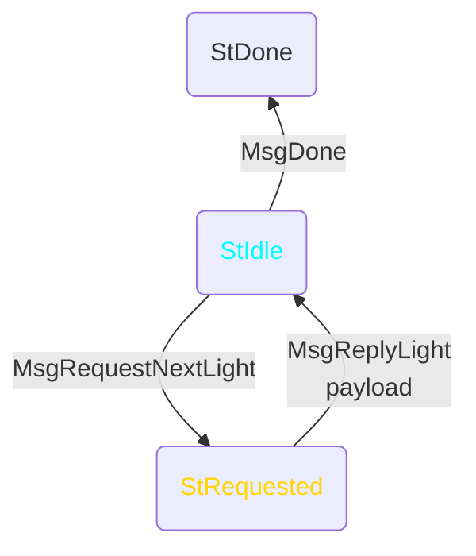
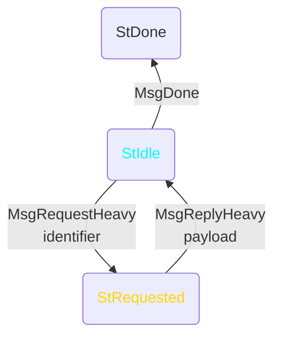
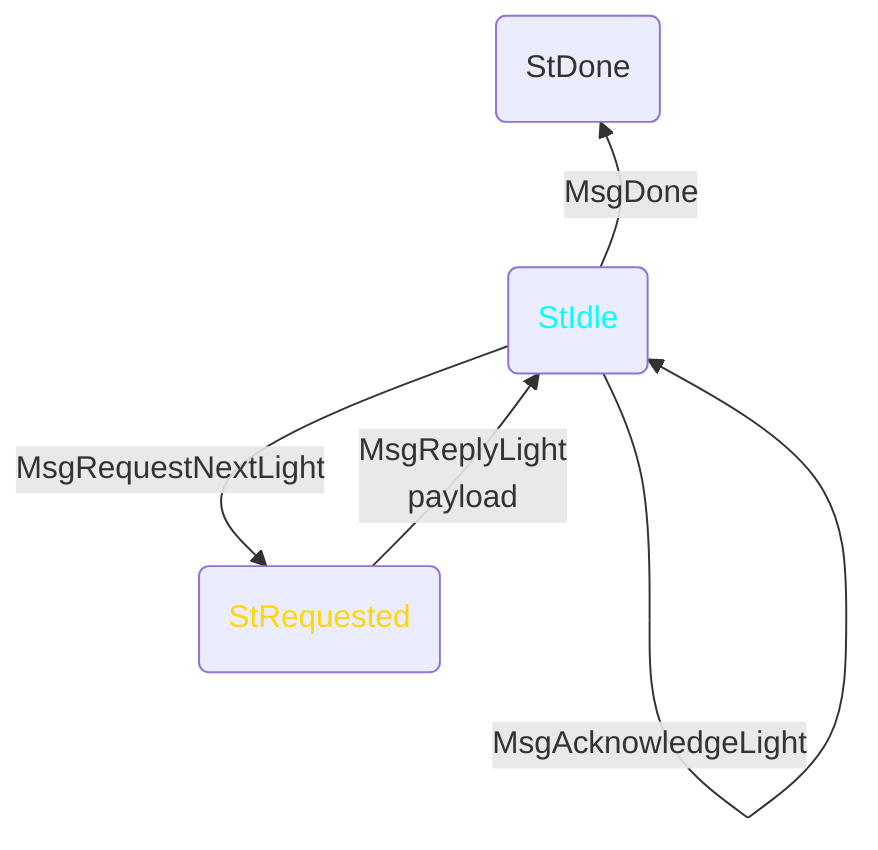

# Introduction

This document proposes new mini protocols necessary for Linear Leios.
It takes an understanding of Linear Leios for granted; it does not define the structure and semantics of RB, EB, vote, etc.

It begins with two mini protocol schemas; every new mini protocol instantiates one of them.
It includes a list of which conditions that should be considered a violation of the mini protocol, with the ultimate goal of limiting how many of a node's resources these mini protocols might consume within a short duration.
The most complicated violation involves a proposed change to how party's are able to increment their operational certificate issue number.
It concludes with a discussion of what to consider when specifying new mini protocols, to emphasize some flexibility in how this specification is implemented.

This specification does not consider syncing nodes, only caught-up nodes.

# Light schema

The Light mini protocol pulls whichever payload the upstream peer wants to send next.
These payloads should be small and/or rare, so that having every upstream peer send all of them is tolerable.

# Heavy schema

The Heavy mini protocol pulls from the upstream peer whichever payload was identified by the local node's request.
These payloads can be large and/or numerous, since the local decision logic---which is assumed to be predominantly inherited from TxSubmission---will try to avoid fetching a specific payload from an excessive number of upstream peers but without excessively increasing latency.

# Linear Leios mini protocols

This proposal introduces the following mini protocols for the Linear Leios node, assuming that an EB merely contains the identifiers of txs rather than the txs themselves.
In all of the new mini protocols, the payload travels the same direction as in BlockFetch---TxSubmission is still the only mini protocol that sends payloads in the opposite direction of BlockFetch.

| Unchanged mini protocol | Comparable schema | Payload | Payload semantics |
| - | - | - | - |
| ChainSync | Light | an RB header | the valid RB body is available for download from this upstream peer (under limited circumstances, Block Diffusion Pipelining via Deferred Validation permits the block to instead be invalid) |
| BlockFetch | Heavy | an RB | one of the RBs that ChainSync indicated |
| TxSubmission | Light and Heavy | set of tx identifiers OR set of txs | some identified txs that are available from this upstream peer OR one of those txs |

| New mini protocol | Schema | Identifier | Payload | Payload semantics |
| - | - | - | - | - |
| EbPublicize | Light | n/a | an RB header | the first or second valid RB header this upstream peer has seen with some pair of slot and RB issuer is now available from this upstream peer |
| EbRelayHeader | Light | n/a | an RB header | the EB body and the txs it identifies are now available from this upstream peer |
| EbRelayBody | Heavy | pair of EB-slot and EB-hash | an EB | one of the EBs that EbRelayHeader indicated |
| EbRelayTx | Heavy | triplet of EB-slot, EB-hash, and sequence of indices | set of txs | some of the txs that EbRelayBody indicated |
| VoteRelayId | Light | n/a | triplet of EB-slot, EB-issuer, and vote-issuer along with an optional RB header | the identified valid vote is now available from this upstream peer |
| VoteRelayBody | Heavy | triplet of EB-slot, EB-issuer, and vote-issuer | a vote | one of the votes that VoteRelayId indicated |
| EbFetchBody | Heavy | pair of EB-slot and EB-hash | an EB | one of the EBs that ChainSync indicated |
| EbFetchTx | Heavy | triplet of EB-slot, EB-hash, and sequence of indices | set of txs | some of the txs that EbFetchBody indicated |

Remarks. 

- EbRelayBody and EbRelayTx are separate mini protocols because an upstream peer should be able to serve new EBs even while it's already serving some txs.
- EbRelayHeader is separate from EbRelayBody and EbRelayTxs because of the _freshest first delivery_ rule (FFD).
  An upstream peer must be able to offer newer EBs even while sending some older EBs/txs.
- EbRelay* and EbFetch* are separate mini protocols because EbFetch* is usually dormant but has utmost urgency when it's active.
  As soon as a node realizes it does not already have the EB certified by some RB that it needs to validate, it should be able to instantly request that EB from upstream peers who have already offered that RB via ChainSync.
  If EbRelay* and EbFetch* were not separate protocols, then the urgent EbFetch* requests might be blocked behind by the coincident EbRelay* requests.
  There might be better ways to avoid this risk, but the current method seems suitable for a specification: simple and explicit.
    - TODO a client might wisely decompose and rate-limit its EbRelayTx requests so that it can pause them if EbFetchTx suddenly has a significant number of txs to request from the same peer.
- EbRelayBody and EbFetchBody instantiate Heavy because EBs are large enough that the node should not download every EB from every upstream peer.
- VoteRelayBody instantiates Heavy even though votes are so small because there are so many votes per EB that a node should not redundantly download every vote from every upstream peer.
- EbRelayTx and EbFetchTx instantiate Heavy because, under normal circumstances, the node will already have received most of the txs in an EB via TxSubmission.
  It shouldn't request all of the txs in some EB and certainly not from all peers.
- Under normal circumstances, each upstream peer will send a single RB header four times: once via EbPublicize, once via ChainSync, once via EbRelayHeader, and once via VoteRelayId.
  This redundancy is intended, for the reasons below.
  Future optimizations could avoid some of the redundancy, but this specification avoids the complexity of synchronizing the mini protocols and the redundancy seems tolerable.
   - EbRelayHeader offers EBs by sending the corresponding RB header so that it's impossible for an upstream peer to offer an EB for which the local node has never seen a matching RB header.
     This scenario might be comparatively easy to handle within a node, but this specification is able to entirely avoid this awkward case.
   - The same scenario might arise for votes in VoteRelayId.
     It's much less probable because of the 3Δ_hdr moratorium on voting, but allowing VoteRelayId to send a corresponding RB header along with the first corresponding vote again prevents the corner case.
   - During an equivocation attack, EbPublicize will crucially deliver RB headers that wouldn't necessarily have arrived via the other mini protocols, because ChainSync only offers the best chain the upstream peer has selected and EbRelayHeader only offers the RB header for the first EB that upstream peer received.
     A proof of equivocation must arrive at all nodes if it exists.
   - During an equivocation attack, EbPublicize will crucially deliver RB headers much sooner than the other mini protocols would, since RB headers can propagate via EbPublicize more than one hop ahead of the relevant EB bodies/RB bodies/votes.
     A proof of equivocation must arrive as soon as possible.

# Bounding resource usage, Step 1 of 2

The key strategy for bounding resource usage is that the protocol's various leader schedules and the nodes' equivocation detection together bound how much work might arise within a short duration.
If the victim can therefore detect whenever the adversarial peer sends an object that is either not justified by an election or equivocates an election, then they can protect themselves by disconnecting.
The following describes which behaviors justify such a disconnection.

Every payload of a Light mini protocol and every identifier in a Heavy mini protocol include enough information to determine whether the corresponding RB header/EB/vote is too old or equivocates a leadership proof.
This provides a very straight-forward means of limiting how many RB headers/EBs/votes/txs a node might need to send to its downstream peers or receive from its upstream peers.
For this reason, the _window_ managed by the TxSubmission mini protocol would be an unnecessary complication in Light and Heavy.

- Let ClockSkew be some duration that is a conservative upper bound on the difference between two honest nodes' clocks.
  (A plausible value could be double the upper bound on the difference between a single node's clock and a theoretical perfect clock.)
- Let GracePeriod be some duration that is a conservative upper bound on how long after an honest immediate peer sends some message that that message might be processed locally, eg 15 seconds to accommodate an expensive garbage collection on either side.
  It should also account for ClockSkew.
- Let _EB opportunity identifier_ be the pair of slot and hash of the issuing stake pool's public cold key.
  Note that this excludes the operational certificate issue number, which is discussed in the next section.
- Let _vote opportunity identifier_ be the pair of an EB opportunity identifier and the hash of the voting stake pool's public cold key.

The following table lists exceptional scenarios that would justify disconnecting from the upstream peer---ie checks that a client would do.

| Mini protocol client | Observation that triggers disconnect |
| - | - |
| every Light mini protocol | the payload is fails as much validation as can be checked without a recent ledger state |
| every Heavy mini protocol | the payload is not exactly what was requested |
| EbPublicize | the RB header is the third from this peer with the same EB opportunity identifier (refined in next section) |
| EbRelayHeader | the RB header is the second from this peer with the same EB opportunity identifier |
| VoteRelayId | the RB header is the second from this peer with the same EB opportunity identifier |
| VoteRelayId | vote is the second from this peer with the same vote opportunity identifier |
| EbPublicize | the RB header is older than L_vote + GracePeriod seconds |
| EbRelayHeader | the RB header is older than L_vote + L_diff + GracePeriod seconds (TODO increase this limit?) |
| VoteRelayId | the RB header/vote is older than L_vote + GracePeriod seconds |
| EbPublicize | the RB header is more than ClockSkew seconds early |
| EbRelayHeader | the RB header is more than ClockSkew seconds early |
| VoteRelayId | the RB header/vote is more than ClockSkew seconds early |
| VoteRelayId | offered vote opportunity identifier includes an EB opportunity identifier that this node has never seen an RB header with |
| VoteRelayId | the RB header has a different EB opportunity identifier than the vote opportunity identifier it accompanies |
| VoteRelayBody | the vote is invalid |

TODO an adversarial peer can _offer_ every potential vote (regardless of whether actually elected/it exists) for every RB, once they have reason to believe the victim won't request the bogus votes (eg that EB opportunity has already reached a quorum).
This could be prevented by including signatures in VoteRelayId, but then we might as well be relaying every vote to every peer.
Hmm.

The following table is for checks against a downstream peer---ie checks a server would do.

| Mini protocol server | Observation that triggers disconnect |
| - | - |
| EbRelayBody | requested object is unknown, including eg not immutable and more than 45 + GracePeriod seconds older than the immutable tip |
| EbRelayTx | requested object is unknown, including eg not immutable and more than 45 + GracePeriod seconds older than the immutable tip |
| VoteRelayBody | requested object is unknown, including eg older than L_vote + 15 + GracePeriod seconds |
| EbFetchBody | requested object is unknown, including eg not immutable and more than 45 + GracePeriod seconds older than the immutable tip |
| EbFetchTx | requested object is unknown, including eg not immutable and more than 45 + GracePeriod seconds older than the immutable tip |

TODO replace 15, 45, etc with named parameters?

TODO add L_recovery?

# Bounding resource usage, Step 2 of 2

The above rules would suffice if the set of stake pools and their hot keys did not vary over time, but they do in Cardano.

- Pools retire and new pools register, which determines their cold key.
  This does not pose a challenge, because the set of pools that could possibly be elected in any specific slot is determined so much earlier than the slot itself that the Praos security argument already requires all honest nodes agree on that set before its relevant.
- If an adversary acquires some victim's hot keys---the keys that sign their blocks and their votes---then the adversary will always be able to issue blocks that equivocate the victim's recent and upcoming elections, for RBs, EBs, and votes.
  This does pose a challenge.

In the Praos system, the _operational certificate issue number_ mechanism allows the victim to leverage their unique access to their cold private key in order to issue a higher precedence hot key for their next RB header.
Even if the victim for whatever reason doesn't issue a higher precedence hot key, then at least the finite KES period passively disables the leaked key when it expires, which might be up to ~90 days later.
See <https://github.com/IntersectMBO/ouroboros-consensus/pull/1610> for more details (TODO update once merged).

In Linear Leios, EbPublicize must be able to relay RB headers even if it didn't relay their specific recent ancestors; otherwise, the bound on how many headers are relayed would be significantly greater than 2x.
It therefore cannot simply include the operational certificate issue number in the EB opportunity identifier, because without the rules that rely on a header's recent ancestors, there'd be no limit to how often an adversary could increment their operational certificate issue number in an attack against EbPublicize.
Unlike ChainSync, EbPublicize could not necessarily notice that the headers in such an attack are invalid.

If EbPublicize merely approximated the existing Praos rate limiting logic, then other attack vectors might arise.
For example, if EbPublicize assumed that the operational certificate issue number could not increment more than once per ten slots, then the adversary could diffuse higher precedence hot keys via EbPublicize but never via ChainSync.
EbPublicize would then ignore equivocation that happens on the actual chain, since the equovicating headers would use hot keys with lower precedence.

Therefore, Praos's operational certificate issue number mechanism should be further constrained, in order to enable a reasonable bound on the EbPublicize traffic.
The proposed new constraint is that the operational certificate issue number cannot be incremented more than once per stability window (ie 36 hr on Cardano today), and EbPublicize would be relaxed as follows.

| Mini protocol client | Observation that triggers disconnect |
| - | - |
| EbPublicize | the RB header is the third from this peer with the same EB opportunity identifier and operational certificate issue number |
| other rows | as in the previous section |

There are two advantages to this new constraint.

- EbPublicize would need to relay at most four headers per EB opportunity, by considering RB headers with an operational certificate issue number that is &lt;Z(Sl) or &gt;Z(Sl)+1 to be invalid, where Sl is slot of the header and the mapping Z is objectively determined by the node's immutable ledger state.
- ChainSync would consider a header invalid if EbPublicize does.
  Note that the implication in the other direction is not guaranteed: ChainSync has more information to use, and so can be more strict.

There are two disadvantages to this new constraint.

- Most importantly, the operational certificate issue number mechanism would not promptly mitigate the Praos attacks available to an adversary that manages to acquire a victim's hot keys twice within some 36 hr duration.
  Instead of mitigating the attack as soon as the victim issues their second header, the victim would have to wait to issue a header 36 hours after their first increment.
- Though ChainSync could still react immediately to an incremented operational certificate issue number, EbPublicize would unfortunately only start ignoring the adversary's equivocations 36 hr after the victim increments their operational certificate issue number.
  Thus, the adversary could prevent the victim's EBs from being certified until 36 hr after the victim increments their operational certificate issue number.

# Architecting Mini Protocols

An implementation could plausibly combine some of these mini protocols, eg VoteRelayId and VoteRelayBody.
This specification maximally separates the new mini protocols for two reasons.

- The separation emphasizes how loosely coupled each mini protocol's implementation can be---only their parameter values, such as maximum age, should influence each other.
- In the context of the <https://github.com/IntersectMBO/ouroboros-network> framework used in today's Cardano node, messages within a single protocol have to be processed in order.
  So if the same mini protocol were responsible for delivering an EB as well as offering more EBs, it's possible that a node might need to wait for the EB to finish arriving before it could learn about new offered EBs.
  By separating those exchanges into different mini protocols, the existing framework already allows them to proceed independently---the mux lets them share bandwidth to avoid head-of-line blocking.
  Other hypothetical implementations might be able to achieve comparable guarantees with a combined mini protocol, but due to the current dominance of a single mature Cardano implementation, it is reasonable to consider its current implications for possible interpretations when specifying mini protocols.

Due to their simplicity, it seems more plausible than ever that some existing pub/sub protocol might be suitable for implementing these.
On the other hand, any framework that can already express the more sophisticated ChainSync, BlockFetch, and TxSubmission ought to easily accommodate Light and Heavy.

Just as for the initial Peras developments, it's plausible that pairs of protocols such as VoteRelayId and VoteRelayBody could be initially implemented as a copy of TxSubmission with additional hooks to enforce the age limits.
That'd be a plausible first iteration, though it does inherit some complexity and coupling that is unnecessary in the particular case of Linear Leios objects.

# Possible Extensions

## Avoid Redundant RB Headers

Under normal circumstances, the mini protocols would send each RB header four times, and three of those would be very much redundant.
A simple extension of EbPublicize could eliminate the need for the redundant headers, in the absence of equivocation---ie for honest EBs.

EbPublicize will be the first to convey an RB header to the downstream peer, under normal circumstances.
Thus if the downstream peer could somehow acknowledge receipt of that RB header, then the other three mini protocols would never need to send a header for that same EB opportunity.
Thus the extended Light schema---let's call it LightWithAck---would permit the client to send acknowledgments for each received header.

The server should disconnect if the client acknowledges more headers than the server has sent.

The Heavy protocol could now send the merely the EB's hash instead of the corresponding RB header if the client has acknowledge the receipt of that RB header via EbPublicize.
If for whatever reason they have not yet received that acknowledgement, then they could send the RB header, as in the base proposal.
