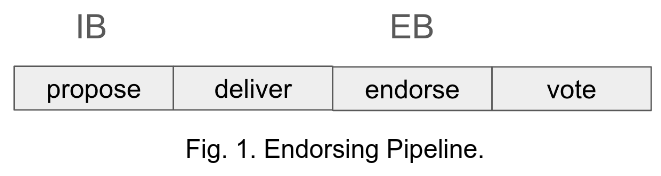
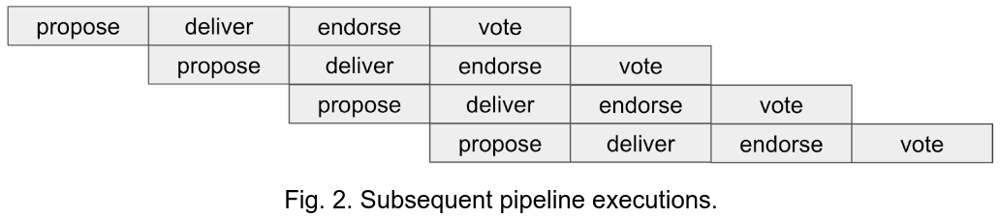

# Short-Pipeline Leios

Leios as presented in the research paper is focused on optimal throughput in the network band assigned to input-block production. The effect is a heavy trade-off of throughput against latency. When willing to accept a throughput well below optimality, e.g., ½ of the respective network band, different approaches can result in much better latency, and yield even further advantages. Here, we propose a Leios variant to utilize close to 0.4 of the input-block network band and whose pipeline exists of only four slices, and where only one layer of endorser blocks is required (per pipeline). For simplicity, we only sketch the “simple” variant without recursion—noting that pipeline recursion needs to be added to cope with bad chain quality of the underlying consensus mechanism (i.e., Praos, in the case of Cardano).

# Short Pipeline

The four stages consist of one slice each (cf. research paper). IBs are generated in the *propose* stage. EBs are generated in the *endorse* stage. An EB collects all IBs seen by the end of the *deliver* stage. During the *vote* stage, each EB from the endorse stage is upvoted whereof

1. all referenced IBs have been received by the end of the endorse stage,  
2. all IBs seen by the end of the propose stage are referenced, and,  
3. all referenced IBs validate (wrt. script execution).

In contrast to original Leios, all block opportunities during *propose* (IB) and *endorse* (EB) are “executed” (i.e., the blocks are generated and diffused) right at the beginning of the respective stage. This will guarantee fast delivery within the stage.[^1]

## Block delivery rules

IB bodies are requested (and delivered) in a freshest-first (FF) manner, i.e., in reverse order of their timestamps.

## Comparison to Original Leios

### Advantages

* Short pipeline  
* Guaranteed delivery of all IBs of an endorsed EB by the end of the vote stage—note that, in the original, the IBs may be accessible much later (depending on how close the throughput is pushed to 1).  
* One single layer of EBs, no majority-EB inclusion rule, and no endorsed EB can censor honest IBs.

### Disadvantages

* Execution spikes (may not be a problem—see footnote)

# References

[Leios Research Paper](https://iohk.io/en/research/library/papers/high-throughput-blockchain-consensus-under-realistic-network-assumptions/)

# Appendix

## Correctness

Assume an IB rate of (0.4-ε)C where C is the bandwidth assigned to IB traffic and consider four subsequent pipeline instances as depicted in Fig. 2\. Thus, assuming large enough stage length and sufficiently large ε, no propose stage will produce more than 0.4C IB data, and each endorse stage will produce an honest EB.

We want to guarantee that:

1) all honest EBs get endorsed (honest stake-majority votes), and  
2) all endorsed EBs reference all honest IBs.

(1) is satisfied if, (A) all IBs referenced in an honest EB arrive (at every honest node) by the end of the endorse stage, and, (B) all IBs seen by an honest voter at the end of the *propose* stage are seen an honest EB producer at the end of the *deliver* stage—see [Short Pipeline](#short-pipeline).

### Establishing (1)

**Establishing (A):** all IBs referenced in an honest EB arrive (at every honest node) by the end of the endorse stage.  
Let Pipeline 1 (PL1, see Tab. 3\) be the pipeline in question. Due to FF, we can ignore the IBs of any prior pipeline since they have lower priority. Note that the honest IBs are always diffused on time but that the adversary can delay diffusion of his own IBs. Concretely, at least half of the IB load (0.2C) is issued on time where the remaining half can be delayed arbitrarily.  
In the worst case, the adversary sends all adversarial IBs to an honest EB producer just at the onset of the endorse stage of PL1—in the hope that some honest nodes may not receive them before the vote stage. Giving timely diffusion of honest IBs, this worst case is depicted in Tab. 3 for the pipelines (PL1–PL3): timely diffusion of the “honest” 0.2 during *propose* plus maximally delayed diffusion of all dishonest IBs to maximize traffic during the endorse stage of PL1.  
The resulting IB traffic during the endorse stage of PL1 is thus at most 0.8C, and delivery is guaranteed.

| PL1 (0.4) | propose | 0.2 | deliver |  | endorse | 0.2 |
| :---: | :---: | :---: | :---: | :---: | :---: | :---- |
| PL2 (0.4) |  |  | propose | 0.2 | deliver | 0.2 |
| PL3 (0.4) |  |  |  |  | propose | 0.2\+0.2 |

Tab. 3\. Pipeline stages and band utilization per pipeline.

**Establishing (B):** any IB seen by an honest node by the end of the *propose* stage is seen by all honest nodes by the end of the *deliver* stage.  
Let Pipeline 1 (PL1, see Tab. 4\) be the pipeline in question. Due to FF, we can ignore the IBs of any prior pipeline since they have lower priority. Note again that the honest IBs are always diffused on time but that the adversary can delay diffusion of his own IBs.  
In the worst case, the adversary sends all adversarial IBs to one single honest node just at the onset of the deliver stage of PL1—in the hope that some honest EB producer may not receive them before the endorse stage. Giving timely diffusion of honest IBs, this worst case is depicted in Tab. 3 for the pipelines (PL1–PL2): timely diffusion of the “honest” 0.2 during *propose* plus maximally delayed diffusion of all dishonest IBs to maximize traffic during the deliver stage of PL1. The resulting IB traffic during the deliver stage of PL1 is thus at most 0.6C, and delivery is guaranteed.

| PL1 (0.4) | propose | 0.2 | deliver | 0.2 |
| :---: | :---: | :---: | :---: | :---: |
| PL2 (0.4) |  |  | propose | 0.2\+0.2 |

Tab. 4\. Pipeline stages and band utilization per pipeline.

### Establishing (2)

All honest IBs are delivered by the end of the propose stage and thus required, by an honest voter, to be included in the EB the voter is voting on. Thus an endorsed EB references all honest IBs of the pipeline’s propose stage.

[^1]:  Note, however, that Duncan Coutts argues against such “concentrated” block production to the end of avoiding network/CPU utilization spikes. However, in contrast, one may also argue that executing all at once and then queuing the work should not degrade performance (and might even improve it). This is an ongoing discussion.
