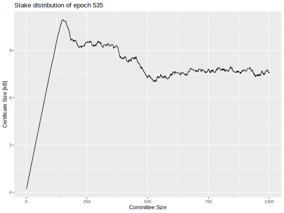

## Abstract

> [!NOTE]
>
> A short (~200 word) description of the proposed solution and the technical issue being addressed.

The anticipated growth of the Cardano ecosystem necessitates a fundamental enhancement of network throughput to accommodate increasing transaction volumes and support complex decentralized applications.

To address this challenge, we propose a transition to Ouroboros Leios — a novel consensus protocol within the Ouroboros family. Leios is specifically designed for high-throughput operation while preserving the rigorous security properties established by Ouroboros Praos.

Leios achieves its scalability through a decoupled block production and aggregation mechanism. This allows for a higher rate of input-block generation, followed by efficient endorsement and anchoring onto the main chain. This document formally specifies the Leios protocol using Agda and provides a detailed rationale and supporting evidence demonstrating its efficacy in overcoming the throughput limitations inherent in the current Ouroboros Praos protocol.

  
<h2>Table of contents</h2>

  <strong>Create a table of contents with internal hyperlinks when the organization of the document is stable.</strong>

## Motivation: why is this CIP necessary?

> [!NOTE]
> 
> A clear explanation that introduces a proposal's purpose, use cases, and stakeholders. If the CIP changes an established design, it must outline design issues that motivate a rework. For complex proposals, authors must write a [Cardano Problem Statement (CPS) as defined in CIP-9999][CPS] and link to it as the `Motivation`.

While Cardano's current transaction processing capabilities often meet the immediate demands of its user base, the underlying Ouroboros Praos consensus protocol inherently imposes limitations on scalability. The critical requirement for timely and reliable global propagation of newly generated blocks within a short time interval necessitates a careful balancing act. This constraint directly restricts the maximum size of individual blocks and the computational resources available for the validation of transactions and Plutus scripts, effectively establishing a ceiling on the network's transaction throughput that cannot be overcome through simple parameter adjustments alone.

However, the dynamic growth of the Cardano ecosystem is increasingly revealing the practical consequences of these inherent limitations. The Cardano mainnet periodically experiences periods of significant congestion, where the volume of transactions awaiting processing surpasses the network's ability to include them in a timely manner. This congestion can lead to a tangible degradation in the user experience, manifesting as delays in transaction confirmation. Moreover, it poses substantial obstacles for specific use cases that rely on the efficient processing of large volumes of transactions, such as the distribution of tokens via airdrops, or the rapid and consistent updating of data by decentralized oracles or partner chains.

The semi-sequential nature of block propagation in Ouroboros Praos, where blocks are relayed from one block producer to the next across potentially geographically distant nodes, is a key factor contributing to these limitations. The necessity of completing this global dissemination within the few-second period places a fundamental constraint on the rate at which new blocks, and consequently the transactions they contain, can be added to the blockchain. This architectural characteristic stands in contrast to the largely untapped potential of the network's underlying infrastructure, where the computational and bandwidth resources of individual nodes often remain significantly underutilized.

To transcend these inherent scaling barriers and unlock the latent capacity of the Cardano network, a fundamental evolution of the core consensus algorithm is imperative. Ouroboros Leios represents a departure from the sequential processing model of Praos, aiming to introduce mechanisms for parallel transaction processing and more efficient aggregation of transaction data. By reorganizing how transactions are proposed, validated, and ultimately recorded on the blockchain, this protocol upgrade seeks to achieve a substantial increase in the network's overall throughput, enabling it to handle a significantly greater volume of transactions within a given timeframe.

The Cardano Problem Statement [CPS-18 Greater Transaction Throughput](https://github.com/cardano-foundation/CIPs/blob/master/CPS-0018/README.md) further motivates the need for higher transaction throughput and marshals quantitative evidence of existing mainnet bottlenecks. Realizing higher transaction rates is also necessary for long-term Cardano techo-economic viability as rewards contributions from the Reserve pot diminish: fees from more transactions will be needed to make up that deficit and keep sound the finances of stakepool operations. (Currently, the Reserve contributes more than 85% of the reward of a typical epoch, with less than 15% of the reward coming from the collection of transaction fees. In five years, however, the Reserve contribution will be much diminished.) Because a major protocol upgrade like Leios will take significant time to implement, test, and audit, it is important to began implementation well before transaction demand on mainnet exceeds the capabilities of Ouroboros Praos. The plot below shows the historically diminishing rewards and a forecast of their continued reduction: the forecast is mildly uncertain because the future pattern of staking behavior, transaction fees, and node efficiency might vary considerably.

Ouroboros Praos cannot support the high transaction volume needed to generate the fees that will eventually be needed to offset the diminishing rewards. However, as sustained throughput of transactions grows beyond 50 transactions per second, there is more opportunity for simultaneously reducing fees, augmenting the Treasury, and increasing SPO and delegator rewards.

## Specification

> [!NOTE]
> 
> The technical specification should describe the proposed improvement in sufficient technical detail. In particular, it should provide enough information that an implementation can be performed solely based on the design outlined in the CIP. A complete and unambiguous design is necessary to facilitate multiple interoperable implementations.
> 
> This section must address the [Versioning](#versioning) requirement unless this is addressed in an optional Versioning section.
> 
> If a proposal defines structure of on-chain data it must include a CDDL schema.

### Non-normative overview of Leios

> [!IMPORTANT]
> 
> - [ ] Write this section after the details of the recommended variant of Full Leios have been settled.

### Normative Leios specification in Agda

> [!IMPORTANT]
> 
> Work in progress: https://github.com/input-output-hk/ouroboros-leios-formal-spec/tree/main/formal-spec/Leios.
> 
> - [ ] Do we plan to embed the Agda in this document?
> - [ ] If so, will all of the Agda be embedded, instead of just the core subset?

### Constraints on Leios protocol parameters

> [!WARNING]
> 
> This is an incomplete work in progress.
> 
> - [ ] Revise after protocol definition is complete.
> - [ ] Add paragraphs explain the rationale in more detail.

| Parameter                                  | Symbol           | Units    | Description                                                                 | Constraints                | Rationale                                                    |
| ------------------------------------------ | ---------------- | -------- | --------------------------------------------------------------------------- | -------------------------- | ------------------------------------------------------------ |
| Stage length                               | $L$              | slot     |                                                                             | $L \geq \Delta$            |                                                              |
| Input-block production rate                | $f_\text{IB}$    | 1/slot   |                                                                             | $0 \lt f_\text{IB}$        |                                                              |
| Endorser-block production rate             | $f_\text{EB}$    | 1/stage  |                                                                             | $0 < f_\text{EB}$          |                                                              |
| Expiration of unreferenced input blocks    | $r_\text{IB}$    | slot     |                                                                             |                            |                                                              |
| Expiration of unreferenced endorser blocks | $r_\text{EB}$    | slot     |                                                                             |                            |                                                              |
| Number of shards                           | $k_\text{shard}$ | unitless |                                                                             |                            |                                                              |
| Mean committee size                        | $n$              | parties  |                                                                             |                            |                                                              |
| Quorum size                                | $\tau$           | parties  |                                                                             | $\tau > n / 2$             |                                                              |
| . . .                                      |                  |          |                                                                             |                            |                                                              |
| Network diffusion time                     | $\Delta$         | slot     | Upper limit on the time needed to diffuse a message to all nodes.           | $\Delta > 0$               | Messages have a finite delay.                                |
| Praos active slot coefficient              | $f_\text{RB}$    | 1/slot   | The probability that a party will be the slot leader for a particular slot. | $0 \lt f \leq \Delta^{-1}$ | Blocks should not be produced faster than the network delay. |

### Specification for votes and certificates

The next section outlines the requirements for Leios sortition, voting, and certificates. Although these are stringent, several proposed schemes meet the criteria. Ideally, a common Cardano voting infrastructure would be used across Leios, Peras, Mithril, and partner chains. For concreteness, however, this section also documents a BLS approach that is feasible for Leios.

#### Requirements

Leios is flexible regarding the details of votes, certificates, and sortition. The key requirements in this regard follow.

1. *Succinct registration of keys:* The registration of voting keys should not involve excessive data transfer or coordination between parties. Ideally, such registration would occur as part of the already existing operational certificates and not unduly increase their size.
2. *Key rotation:* The cryptographic keys used to sign Leios votes and certificates *do not* need to be rotated periodically because the constraints on Leios voting rounds and the key rotation already present in Praos secure the protocol against attacks such as replay and key compromise.
3. *Deterministic signatures:* Deterministic signatures can guard against attacks that weakening key security. 
4. *Local sortition:* Selection of the voting committee should not be so deterministic and public as to open attack avenues such as denial-of-service or subversion.
5. *Liveness:* Adversaries with significant stake (e.g., more than 35%) should not be able to thwart a honest majority from reaching a quorum of votes for an EB.
6. *Soundness:* Adversaries with near majority stake (e.g., 49%) should not be able to form an adversarial quorum that certifies the EB of their choice.
7. *Small votes:* Because vote traffic is large and frequent in Leios, the votes themselves should be small. Note that the large size of Praos KES signatures precludes their use for signing Leios votes.
8. *Small certificates:* Because Leios certificates are frequent and must fit inside Praos blocks, they should be small enough so there is plenty of room for other transactions in the Praos blocks. Note once again that certificates based on Praos KES signatures are too large for consideration in Leios.
9. *Fast cryptography:* The computational burden of creating and verifying voting eligibility, the votes themselves, and the resulting certificate must be small enough to fit within the CPU budget for Leios stages.

#### BLS certificate scheme

Consider the following voting and certificate scheme for Leios:

1. As part of their operational certificate, stake pools register BLS keys for use in voting and prove possession of those keys.
2. Nodes verify the proofs of possession of the keys they receive.
3. For each epoch, the Fait Accompli[^1] scheme wFALS is applied to the stake distribution in order to determine the *persistent voters* for the epoch.
    1. Persistent voters should vote in every election during the epoch.
    2. A different supplement of *non-persistent voters* are selected at random for each election during the epoch using the *local sortition* algorithm.
5. The certificate records the set of voters, proof of their eligibility, and the quorum achieved.

[^1]: Peter Gaži, Aggelos Kiayias, and Alexander Russell, "Fait Accompli Committee Selection: Improving the Size-Security Tradeoff of Stake-Based Committees," Cryptology ePrint Archive, Paper 2023/1273 (2023), [https://eprint.iacr.org/2023/1273](https://eprint.iacr.org/2023/1273).

##### Key registration

The key registration records the public key and the proof of its possession.

1. The Pool ID (or similar unique identifier) identifies the pool holding the key and comprises 28 bytes.
2. The public key $\mathit{mvk}$ belongs to $\mathbb{G}_2$ , so it occupies 96 bytes if BLS12-381 with compression is used.
3. The proof of possession for the secret key is the pair $\left(H_{\mathbb{G}_1}(\text{``PoP''} \parallel \mathit{mvk})^\mathit{sk}, g_1^\mathit{sk}\right)$, where $\mathit{sk}$ is the secret key and $H$ hashes to points in $\mathbb{G}_1$. This pair will occupy 96 bytes with compression.
4. The KES signature for the above will add another 448 bytes.

Altogether, a key registration occupies $28 + 96 + 2 \times 48 + 448 = 668$ bytes. This registration needs to be recorded on chain so that certificates can be later verified independently. Ideally, the BLS keys would be registered as part of the SPO's *operational certificate*, which is renewed every ninety days.

##### Sortition

Figure 7 of the Fait Accompli paper[^1] provides the algorithm for determining which pools are persistent voters. The inequality for this determination can be computed exactly using rational arithmetic, so there is no danger of round-off errors. The input to the formula is the size of the committee and the distribution of stake among the pools.

The non-persistent pools are subject to local sortition (LS) for each vote, based on an updated stake distribution where the persistent voters have been removed and where the distribution is normalized to unit probability. The VRF value for that sortition is the bytes of the SHA-256 hash of the BLS signature on the election identifier $eid$. The probability that a pool with fraction $\sigma$ of the stake is awarded $k$ votes of the committee of $n$ votes is 

$$
\mathcal{P}(k) := \frac{(n \cdot \sigma)^k \cdot e^{- n \cdot \sigma}}{k!}
$$

This VRF value is used to look up the correct number of votes from the cumulative distribution for $\mathcal{P}(k)$. The same Taylor-series expansion technique used in Praos can handle the irrational arithmetic in a deterministic manner. In practice it is unlikely that the non-persistent pools would ever be awarded more than one vote, so it may be feasible to simply award one vote whenever $k \ge 1$.

Each vote has a weight, measured as stake. A quorum is achieved if the weights of the votes in the certificate exceeds a specified quorum of stake. The weight calculation is also proved in Figure 7 of the aforementioned paper:

- The weight of a persistent voter is simply their stake.
- The each vote cast by a non-persistent voter has weight equal to the non-persistent stake divided by the *expected* number of non-persistent seats on the voting committee.

##### Votes

Votes cast by persistent versus non-persistent voters contain different information because persistent voters can be identified by a two-byte identifier and the do not have to provide an eligibility proof. This amounts to 90 bytes for persistent votes and 164 bytes for non-persistent votes.

- Common to all votes
	- *Election ID:* 8 bytes
	- *Hash of endorser block:* 32 bytes
	- *Vote signature:* 48-byte BLS signature on the election ID and EB hash
- Specific to persistent voters
	- *Epoch-specific identifier of the pool:* 2 bytes
- Specific to non-persistent voters
	- *Pool ID:* 28 bytes
	- *Eligibility signature:* a 48-byte BLS signature on the election ID

##### Certification

Consider the committee size $n$, which contains $m$ persistent voters. The certificate must contain the following information:

- Election and EB
    - *Election ID:* Presumably a 8-byte identifier for the Leios election is included in the certificate, though perhaps this is not strictly necessary. This could just be the slot number.
    - *Message:* the 32-byte hash of the endorser block is also included in the certificate.
- Identity of voters
    - Persistent voters are encoded in a bitset of size $m$, occupying $\left\lceil m / 8 \right\rceil$ bytes.
    - Non-persistent voters are encoded by their Pool ID (or equivalent), occupying 28 bytes each and hence $28 \cdot (n - m)$ bytes total.
    - Alternatively, all possible voters could be assigned bits in a bitset, with size $\left\lceil N_\text{pools} / 8 \right\rceil$.
- Eligibility proof
    - Persistent voters are eligible by definition (by virtue of their stake in the epoch), so no proof is needed.
    - Non-persistent voters prove eligibility with a 48 byte (compressed) BLS signature on the message, occupying $48 \cdot (n - m)$ bytes total.
- Aggregate signatures
    - *Signed message:* This aggregate BLS signature on the message is 48 bytes (compressed).
    - *Signed election proofs:* Perhaps not strictly necessary, but another 48 byte (compressed) BLS signature can attest to the proof of the eligibility, see **BLS.BSig** in the Leios paper[^2].
    
Thus the total certificate size is

$$
\text{certificate bytes} = 136 + \left\lceil \frac{m}{8} \right\rceil + 76 \times (n - m)
$$

but not including any minor overhead arising from CBOR serialization. As noted previously, only a quorum of votes actually needs to be recorded, but the full set might need to be recorded in order for any voting rewards to be computed.

[^2]: Sandro Coretti-Drayton et al., "High-Throughput Blockchain Consensus under Realistic Network Assumptions" (preprint, April 2024), https://iohk.io/en/research/library/papers/high-throughput-blockchain-consensus-under-realistic-network-assumptions/.

### CDDL schema for the ledger

#### IB schema

> [!IMPORTANT]
> 
> - [ ] Translate the Agda type for input blocks into CDDL.

#### EB schema

> [!IMPORTANT]
> 
> - [ ] Translate the Agda type for endorser blocks into CDDL.

#### Certificate schema

> [!IMPORTANT]
> 
> - [ ] Translate the Agda type for certificates into CDDL.

#### RB schema

> [!IMPORTANT]
> 
> - [ ] Provide the diff for the CDDL for Praos blocks, so that Leios certificates are included.

## Rationale: how does this CIP achieve its goals?

> [!NOTE]
> 
> The rationale fleshes out the specification by describing what motivated the design and what led to particular design decisions. It should describe alternate designs considered and related work. The rationale should provide evidence of consensus within the community and discuss significant objections or concerns raised during the discussion.
> 
> It must also explain how the proposal affects the backward compatibility of existing solutions when applicable. If the proposal responds to a [CPS][], the 'Rationale' section should explain how it addresses the CPS and answer any questions that the CPS poses for potential solutions.

### How Leios increases throughput

The throughput of a Nakamoto consensus like Ouroboros Praos is intrinsically limited by the strict requirement for rapid global propagation of each block approximately before the next leader produces a block. Leios escapes that limitation by producing input blocks at a higher rate and then voting on aggregations of them (i.e., voting on endorser blocks) by a dynamically selected representative committee of stake pools, ensuring broad participation in the aggregation process. The voting process on these aggregations occurs in a more relaxed and extended manner over a multi-slot stage, allowing for greater network latency tolerance. When a quorum is reached, that quorum is recorded in a Praos block. The majority voting by this committee ensures consensus on the endorser block while inheriting and maintaining Praos's robust resistance to adversarial activity, as the final commitment is anchored in the secure Praos chain.

As a result of this decoupled approach, Leios can utilize nearly the full bandwidth available to the network of nodes without requiring unrealistically fast propagation of blocks: Leios employs a structured, multi-stage process where input blocks are produced rapidly and then aggregated and voted upon in subsequent stages before being referenced by a Praos block. Think of Praos as a single-lane highway where every car (block) needs to travel the entire length before the next can start. Leios, in contrast, is like having many local roads (input blocks) feeding into a larger, slower-moving but higher-capacity highway (endorser block aggregation and Praos anchoring).

In analogy, imagine Praos as a single courier diligently collecting and delivering individual letters one by one, limiting the delivery speed to their individual capacity. Ouroboros Leios, however, operates like a mail sorting office where numerous local branches rapidly collect and bundle letters (input blocks) before a central team efficiently processes and dispatches these aggregated bundles (endorser blocks), achieving a significantly higher delivery volume.

### Metrics

The performance of a protocol like Leios can be characterized in terms of its efficient use of resources, its total use of resources, the probabilities of negative outcomes due to the protocol's design, and the resilience to adverse conditions. Metrics measuring such performance depend upon the selection of protocol parameters, the network topology, and the submission of transactions. The table below summarizes key metrics for evaluating Leios as a protocol and individual scenarios (parameters, network, and load).

| Category   | Metric                                                    | Measurement                                                                                                     |
| ---------- | --------------------------------------------------------- | --------------------------------------------------------------------------------------------------------------- |
| Efficiency | Spatial efficiency, $`\epsilon_\text{spatial}`$           | Ratio of total transactions size to persistent storage                                                          |
|            | Temporal efficiency, $`\epsilon_\text{temporal}(s)`$      | Time to include transaction on ledger                                                                           |
|            | Network efficiency, $`\epsilon_\text{network}`$           | Ratio of total transaction size to node-averaged network usage                                                  |
| Protocol   | TX collision, $`p_\text{collision}`$                      | Probability of a transaction being included two IBs                                                             |
|            | TX inclusion, $`\tau_\text{inclusion}`$                   | Mean number of slots for a transaction being included in any IB                                                 |
|            | Voting failure, $`p_\text{noquorum}`$                     | Probability of sortition failure to elect sufficient voters for a quorum                                        |
| Resource   | Network egress, $`q_\text{egress}`$                       | Rate of bytes transmitted by a node                                                                             |
|            | Disk usage, $`q_\text{disk}`$                             | Rate of persistent bytes stored by a node                                                                       |
|            | I/O operations, $`\bar{q}_\text{iops}(b)`$                | Mean number of I/O operations per second, where each operation writes a filesystem block of $`b`$ bytes         |
|            | Mean CPU usage, $`\bar{q}_\text{vcpu}`$                   | Mean virtual CPU cores used by a node                                                                           |
|            | Peak CPU usage, $`\hat{q}_\text{vcpu}`$                   | Maximum virtual CPU cores used by a node over a one-slot window                                                 |
| Resilience | Bandwidth, $`\eta_\text{bandwidth}(b)`$                   | Fractional loss in throughput at finite bandwidth $`b`$                                                         |
|            | Conflict, $`\eta_\text{conflict}`$                        | Fractional loss in throughput due to a globally conflicted memory pool                                          |
|            | Message loss, $`\eta_\text{message}(\ell)`$               | Fractional loss in throughput due to a fraction $`\ell`$ of all transmitted messages being lost                 |
| Fees       | Collateral paid for success, $`\kappa_\text{success}(c)`$ | Average collateral paid for a successful transaction when it conflicts with a fraction $`c`$ of the memory pool |
|            | Collateral paid for failure, $`\kappa_\text{failure}(c)`$ | Average collateral paid for a failed transaction when it conflicts with a fraction $`c`$ of the memory pool     |
|            | Extra work due to conflicts, $`w_\text{conflict}(c)`$     | Average additional CPU load caused by transaction conflicts where a fraction $`c`$ of the memory pool conflicts |

***Spatial efficiency:*** Leios necessarily imposes some disk overhead beyond the raw bytes needed to store transactions themselves. This overhead includes the IBs, EBs, and RBs associated with storing transactions. The concurrency inherent in Leios also opens the possibility that duplicate or conflicting transactions are stored in IBs, with the consequence that some space is the IBs is wasted. The spatial efficiency metric is defined as the ratio of the total bytes of transactions included in the ledger to the total persistent storage required by the protocol.

$$`
\epsilon_\text{spatial} = \frac{\text{total bytes of transactions included in the ledger}}{\text{total bytes of IBs, EBs, and RBs}}
`$$

***Temporal efficiency:*** As is true for Praos, there is a delay between submitting a transaction and its being included in the ledger and there is a finite chance that it never is included in the ledger. Before a transaction is eligible to be included in a new IB, it must be validated and placed in the memory pool. It is cleanest to measure the time from the transaction reaching the local memory pool of the node where it was submitted to the time when it is included in the ledger, via a Praos block. The same metric applies both to Praos and to Leios. In aggregate, we measure the temporal efficiency as the fraction of transactions that reach the ledger, as function of the number of slots elapsed. The quantity $`\epsilon_\text{temporal}(\infty)`$ is the fraction of submitted transactions that ever reach the ledger.

$$`
\epsilon_\text{temporal}(s) = \text{fraction of transactions included in the ledger within } s \text{ slots of their inclusion in a local memory pool}
`$$

***Network efficiency:*** Effective utilization of the network can be characterized by the ratio of bytes of transactions reaching the ledger to the average network traffic per node. (This could also be computed individually for each node and used as a local metric.)

$$`
\epsilon_\text{network} = \frac{(\text{bytes of valid transactions reaching the ledger}) \cdot (\text{number of nodes in the network})}{\text{total bytes of network traffic}}
`$$

***TX collision:*** Because Leios uses local sortition for electing which nodes produce IBs, there is a finite chance that a transaction will be included in more than one IB during the concurrency period when nodes are not aware of which transactions other nodes are including in their new IBs. The transaction collision probability is simply the fraction of transactions that appear multiple times in IBs.

$$`
p_\text{collision} = \text{fraction of transactions that appear multiple times in IBs}
`$$

***TX inclusion:*** Similarly to the case of a transaction being included multiple times in IBs, it is possible that a transaction might have to wait for many pipelines to progress before being included in an IB. The characteristic time for such inclusion in an IB is inversely proportional to the probability of it being included in a pipeline. This is strongly correlated with how long the transaction waits in the memory pool: some of the proposed Leios variants draw txs randomly from the memory pool or wait for the correct shard.

$$`
\tau_\text{inclusion} = \text{mean number of slots for a transaction to be included in any IB}
`$$

***Voting failure:*** An unlucky set of VRF evaluations might result in insufficient voters being selected in a given pipeline, thus making it impossible to certify an EB in that pipeline.

$$`
p_\text{noquorum} = \text{probability of sufficient voters to achieve a quorum in a given pipeline}
`$$

***Network egress:*** Cloud service providers typically charge for network egress rather than for network ingress. The quantity $`q_\text{egress}`$ is simply the number of bytes sent from a node per unit time.

***Disk usage:*** Leios requires that IBs, EBs, and RBs be stored permanently; votes need not be stored permanently, however. The quantity $`q_\text{disk}`$ is the total number of IB, EB, and RB bytes generated per unit time.

***I/O operations:*** Some cloud service providers limit or bill input/output operations on a per-second capacity basis. The number of I/O operations depends upon the filesystem's block size $`b`$, not on the logical number of writes to disk by the protocol: e.g., writing an IB of 32,768 bytes might consist of 64 I/O operations on a filesystem having a 512-byte block size. We assume that disk caching and delayed writes smooth out the unevenness in I/O operations, so that the mean $`\bar{q}_\text{iops}`$ is the best metric here.

***Mean CPU usage:*** Computation resources consumed by the number are quantified as $`\bar{q}_\text{vcpu}`$, which is the mean number of virtual CPU cores utilized by the protocol.

***Peak CPU usage:*** Because CPU usage varies depending upon the node's activity, the maximum number of virtual CPU cores utilized by the protocol during any slot, $`\hat{q}_\text{vcpu}`$, provides a useful indication of computational burstiness and of how a virtual machine should be sized for Leios.

***Bandwidth:*** If the bandwidth for inter-node communication drops below a given value, then the throughput of Leios (at a given level of demand) will be drop, as network congesting occurs.

$$`
\eta_\text{bandwidth}(b) = \frac{\text{bytes of transactions reaching the ledger if links have bandwidth } b}{\text{bytes of transactions reaching the ledger if bandwidth were infinite}}
`$$

***Conflict:*** Theoretically, an adversary could poison the global memory pool by simultaneously submitting mutually conflicting transactions to every node in the network. This would result in massive conflicts in the contents of IBs produced during the concurrency window, resulting in much wasted space in IBs, effectively reducing the throughput of the protocol.

$$`
\hat{\eta}_\text{conflict} = \frac{\text{bytes of valid transactions reaching the ledger}}{\text{bytes of transactions reaching the ledger if no conflicts were present}}
`$$

***Message loss:*** Using the same metric $`\eta`$, one can also measure the loss in throughput due to unreliable network infrastructure where the fraction $`\ell`$ of messages sent from a node are lost before reaching their destination node.

$$`
\eta_\text{message}(\ell) = \frac{\text{bytes of transactions reaching the ledger if } \ell \text{ fraction of messages are lost}}{\text{bytes of transactions reaching the ledger if no messages are lost}}
`$$

### Evidence that Leios provides high throughput

The Leios paper[^2] provides a rigorous theoretical analysis of the safety and throughput of the protocol. That has been reinforced and demonstrated by prototype simulations written in Haskell and Rust.

> [!CAUTION]
> 
> The plots below are placeholders. All of the simulations in this section need to be re-run:
> 
> - [ ] Final version of the Leios protocol
> - [ ] Realistic mainnet topology
> - [ ] Protocol parameters close to the recommended value
> - [ ] CPU
>     - [ ] Unlimited?
>     - [ ] Six cores?
> - [ ] Decide which plots best illustrate throughput
> - [ ] Strip the major titles from the diagrams
> - [ ] Use SVG format

The simulations demonstrate that bandwidth is partitioned between IBs, EBs, votes, and RBs so that congestion in one message type does not spill over into congestion for other message types. Because IBs are the largest messages, these are the ones first subject to congestion. The plot below shows the appearance of congestion effects in the Haskell simulation at 8 IB/s for 98 kB IBs. (Note that the Haskell simulation represents TCP more faithfully than the Rust one.) Even at this high throughput, IBs arrive at all nodes in the network with 100% success and mostly within five seconds. This implies that the stage length could be as short a five seconds per stage.

In terms of the transaction lifecycle, transaction typically reach IBs rapidly for high-throughput settings of Leios parameters, but it takes tens of seconds for the to become referenced by an EB. Referencing by an RB takes longer, often close to 100 seconds.

### Why Leios is practical to implement

A Leios implementation would build upon the well-proven design of the existing Cardano node by adding several new mini-protocols for the diffusion of IBs, EBs, and votes. The additional cryptography used by Leios is also quite similar to that already in production in various parts of the Cardano and blockchain ecosystems. Leios adds complexity to the process of updating the ledger because conflicting or duplicate transactions in IBs need reconciliation when the UTXO set is recomputed. The sharding of transactions in Leios will complicate the management of the memory pool and the structure of UTXOs themselves. Adjustments to the rewards model will also be required.

The performance of the cryptographic operations required for Leios is demonstrated by a prototype implementation[^3] and the benchmarks in the Appendix [Cryptographic benchmarks](#cryptographic-benchmarks). The small size (less than 9 kB) of Leios certificates is documented in the Appendix [Certificate size for realistic stake distributions](#certificate-size-for-realistic-stake-distributions). The [Resource requirements](#resource-requirements), discussed below, modestly increase the requirements for running a Cardano node but not beyond commonly available commodity hardware.

### Use cases

Leios immediately enables use cases for high transaction volume and for more computationally intensive Plutus scripts, but future minor modifications of the protocol can open additional novel and custom transaction workflows.

#### High transaction volume

Prototype simulations of the Leios protocol indicate that it can achieve at least 20 times the maximum throughput of the current Cardano mainnet. This amounts to approximately 2 MB/s or 1500 tx/s, assuming the current mean transaction size of 1400 bytes. The availability of Leios, however, would likely affect the characteristics of the mix of transactions, so the the maximum transaction rate could be higher or lower than this estimate. Whatever the specifics, Leios will enable transaction volumes that are orders of magnitude greater than Praos.

Aside from the general benefit of high capacity, several specific use cases could benefit.

- *Enterprise or national-state adoption:* Enterprises and nation states require sustained and guaranteed scalability for their blockchain transactions, and large entities may become heavy users of Cardano.
- *Finance:* High volume and high frequency trading may become more practical given the higher throughput supported by Leios.
- *Airdrops:* The high throughput of Leios could streamline the user experience of claiming tokens for large (or extremely large) airdrops.
- *Partner chains, bridges, and oracles:* Multiple simultaneous operation of partner chains, bridges, and oracles on Cardano will require high transaction rates and minimal delays from the time a transaction reaches the memory pool to when it is recorded in the ledger.
- *Games:* High throughput and lower transaction cost may enable cost-effective coupling of games (e.g., markets for in-game items).
- *Improved user experience:* From the onset of the Alonzo era, the usability of particular dapps has occasionally been constrained by the transaction throughput available on Praos. This is especially important and severe when a popular new dapps launches and experiences high activity. Congestion that sometimes occurs during spikes in transaction activity would be alleviated.
- *More complex governance actions:* Expansion of Cardano and DAO governance would required high volumes of transactions if large portions of the community participate. This is particularly important if the number of dreps increases and Cardano moves towards a "direct democracy" style of voting.

#### Improved cost structure

Techno-economic analyses indicate that at a sustained transaction volume of 50 tx/s or greater the profitability profile of Cardano will improve in several ways. If the current transaction fee structure remains the same as now, Leios would have three economic effects at 50+ tx/s:

1. The intake of transaction fees would be large enough to lessen or eliminate the need for supplementing rewards from the Reserve pot. In particular, the `monetaryExpansion` protocol parameters to be lowered and/or the `treasuryCut` parameter could be increased.
2. Stake rewards would increase.
3. Stake pools would become more profitable. In particular, at 50+ tx/s the costlier Leios hardware would be overcome by higher rewards.
4. Transaction fees could be somewhat lowered. That could further drive adoption and make smaller transactions more cost effective, perhaps even opening the possibilities for micropayments or IoT applications.

The following plot shows a forecast for SPO profitability under Leios, assuming a "business as usual" scenario where the fee, treasury, and monetary expansion protocol parameter stay the same as presently. The precise profitability of individual SPOs depends strongly upon how they host their nodes, but there is a clear trend towards profitability (without any contributions from the Cardano Reserve) once 30-50 transactions per second are sustained. Note that profitability slows at very high throughput because of the substantial expense of network egress and storage of the ledger.

#### Intensive Plutus execution

Because there typically is a time window of several seconds from the time a Leios input block can be created to when it needs to start diffusing to other nodes, there is also an opportunity to do more computation validating an Leios input block than for a Praos ranking block. This opens the possibility of increasing the Plutus execution budget for input blocks so that it is significantly larger than the budget for Praos blocks. At the very least a script could be allowed to use the whole Plutus execution budget for an input block, instead of just one quarter of it as is the case for Praos.

Numerous emerging use cases on Cardano would benefit from larger Plutus execution budgets. Complex dapps currently have to split a single logical operation into a sequence of several transactions, increasing the development effort, the complexity, and the attack surface of the scripts involved.

- *ZK proofs:* It may be possible to increase the Plutus execution budget enough that a complete ZK proof could verified in a single transaction.
- *Large number of parties:* Scripts managing potential interactions with a large number of parties (e.g., airdrops, lotteries, and local accounts) are intrinsically limited by Plutus execution limits.
- *On-chain interpreters:* Dapps like Marlowe run interpreters for their DSL in a Plutus script. Execution limits currently restrict the complexity of the DSL expressions that can be evaluated in a single transaction.

#### Novel use cases

Although the version of Leios proposed in this document does not support the particular use cases listed below, a minor variant or future version of Leios could.

- *Priority pipelines:* Different Leios pipelines might have different stage lengths, throughput, fees, and/or Plutus execution limits, enabling applications to select their level of service.
- *Externally batched input blocks:* Third parties could construction input blocks and provide them directly to the block producers, allowing a dapp or an exchange detailed control over sequencing of interdependent transactions within a block or even between blocks.
- *Nuanced roles for SPOs:* Leios opens the possibility of separating the protocol functions into separate processes that could be run independently but in coordination. For example, some SPOs (or parts of an SPO) might only create input blocks while others might only produce ranking blocks. In addition to enabling flexible configuration of Cardano worker services, this could encourage new operational models for SPO consortia.

### Feasible values for Leios protocol parameters

The table below documents a set of Leios protocol parameters that provided high throughput and reasonably fast settlement in the prototype Haskell and Rust simulations of Leios. The exact choice of parameters that would be adopted on the Cardano mainnet must be subject to discussion and consideration of tradeoffs.

> [!WARNING]
> 
> This is an incomplete work in progress.
> 
> - [ ] Revise after the protocol definition is complete.
> - [ ] Each row should have a paragraph of justification.

| Parameter                                  | Symbol           | Units    | Description                                                                 | Feasible value | Justification                                                                                                             |
| ------------------------------------------ | ---------------- | -------- | --------------------------------------------------------------------------- | -------------: | ------------------------------------------------------------------------------------------------------------------------- |
| Stage length                               | $L$              | slot     |                                                                             |             10 | Short stages increase settlement speed, but the stage length must be generously larger than the propagation time for IBs. |
| Input-block production rate                | $f_\text{IB}$    | 1/slot   |                                                                             |                |                                                                                                                           |
| Endorser-block production rate             | $f_\text{EB}$    | 1/stage  |                                                                             |                |                                                                                                                           |
| Expiration of unreferenced input blocks    | $r_\text{IB}$    | slot     |                                                                             |                |                                                                                                                           |
| Expiration of unreferenced endorser blocks | $r_\text{EB}$    | slot     |                                                                             |                |                                                                                                                           |
| Number of shards                           | $k_\text{shard}$ | unitless |                                                                             |                |                                                                                                                           |
| Mean committee size                        | $n$              | parties  |                                                                             |            500 | Probabilistic analyses of adversarial stake scenarios.                                                                    |
| Quorum size                                | $\tau$           | fraction |                                                                             |            60% | Probabilistic analyses of adversarial stake scenarios.                                                                    |
| . . .                                      |                  |          |                                                                             |                |                                                                                                                           |
| Praos active slot coefficient              | $f_\text{RB}$    | 1/slot   | The probability that a party will be the slot leader for a particular slot. |           0.05 | This is the current value on mainnet, but it may become feasible to reduce it if Praos blocks are made smaller.           |

The analysis [Committee size and quorum requirement](https://github.com/input-output-hk/ouroboros-leios/blob/main/docs/technical-report-1.md#committee-size-and-quorum-requirement) in the first Leios Technical Report indicates that the Leios committee size should be no smaller than 500 votes and the quorum should be at least 60% of those votes. However, the proposed Fait Accompli[^1] scheme wFALS achieves compact certificates that do not become larger as the number of voters increases, so larger committee sizes might be permitted for broader SPO participation and higher security. The committee size should be large enough that fluctuations in committee membership do not create an appreciable probability of an adversarial quorum when the adversarial stake is just under 50%. The quorum size should be kept large enough above 50% so that those same fluctuations do not prevent an honest quorum. Larger committees require more network traffic, of course.

### Attack and mitigation

The Leios protocol may have to mitigate the following categories of threats.

- Grinding the VRF to obtain an advantage in Leios sortition
- Equivocating IBs, EBs, or RBs
- Declining to create IBs, EBs, or votes
- Manipulating the content of IBs or EBs
- Sending invalid txs, IBs, EBs, or certificates
- Abusing the sync protocol
- Delaying diffusion of IBs, EBs, or votes
- Submitting invalid, conflicting, or duplicate transactions

Nearly all of these *hypothetical* threats are already mitigated by the protocol design, the incentive structure, or the cost of the resources needed to execute the threat. The [Threat model](https://github.com/input-output-hk/ouroboros-leios/blob/main/docs/technical-report-1.md#threat-model) section of the first Leios Technical report contains a detailed taxonomy that we summarize here. The general impact of such attacks varies:

- Resource burden on nodes
- Lowered throughput
- Increased latency
- Manipulation of dapps or oracles

*Grinding and other threats to Praos:* Threats to the ranking blocks used by Leios are already mitigated by Ouroboros Praos and Genesis. Nevertheless, the possibility of _grinding attacks_, as discussed in [CPS-0017](https://github.com/cardano-scaling/CIPs/blob/settlement-cps/CPS-0017/README.md), will always exist, albeit at low probability of success. Such an attack, which requires some stake, involves using CPU resources to try to manipulate the epoch nonce to a value which will result in higher probability of being select as an RB, IB, or EB producer or as a voter in a subsequent epoch. This presumes that the Praos VRF will be used for the sortition in Leios. Currently, large and expensive amounts of CPU power would be required to successfully conduct a grind attack on Praos. Nevertheless, additional research and development are underway to further harden Praos.

*Equivocation:* In Leios, an IB producer, EB producers, or voter is only allowed one production for each winning of the sortition lottery. (Note that they may win more than once in the same slot because a lottery takes place for each lovelace staked.) A malicious producer or voter might create two conflicting IBs, EBs, or votes and diffuse them to different downstream peers in an attempt to disrupt the Leios protocol. The [Leios paper](https://iohk.io/en/research/library/papers/high-throughput-blockchain-consensus-under-realistic-network-assumptions/) mitigates this situation explicitly by identifying nodes that misbehave in this manner and notifying downstream peers in a controlled manner.

*Inaction and nuisance:* Producer nodes might also attempt to disrupt the protocol by failing to play their assigned role or by attempting to diffuse invalid information. Failing to produce a block (RB, IB, or EB) or to vote when entitled will result in the attacker receiving fewer rewards for their Leios work. Similarly for creating invalid blocks or votes. Very little advantage would be gained by such attacks because they really only reduce throughput or create a minor annoyance to their first downstream nodes by burdening them with useless verification work. Presumably, the loss of rewards would not compensate for the small disruption they create. The cryptographic aspects of Leios quickly catch invalid blocks or votes, of course.

*Omission and manipulation:* In Praos, omitting transactions from a block being forged does not directly affect the producer's rewards, but it may reduce the overall size of the rewards pot for the whole epoch. However, a malicious producer has little leverage by such omissions because of the very high probability that the omitted transactions reside elsewhere in the memory pool and will soon be included in subsequent honest blocks. Reordering IBs when an EB is created is not an option for an attacker because the Leios paper specifies a fixed ordering.

*Network interference:* Malicious network activity such as violating the sync protocol or delaying diffusion of block or votes creates a minor annoyance that the node's sync protocol will quickly avoid by preferring efficient and honest nodes. Large numbers of malicious relays would be needed to impinge on efficiency even in a small degree.

*Denial of service:* Transaction-based denial of service attacks on Leios would involve submitting numerous invalid, duplicate, or conflicting transactions to different nodes so that they would all make their way into the memory pool and then to IBs, only to be invalidated when transaction reconciliation occurs after those IBs are indirectly referenced by a certificate on a Praos ranking block. Such a denial of service would result in extra computation by the nodes and wasted permanent storage in the IBs. (Plutus transactions may be especially burdensome in this respect.) Ongoing research will mitigate such denial of service via sharding techniques and Leios's fee structure. Sharding will prevent duplicate transactions from reaching IBs and the fee structure will enforce payment for intentionally conflicted transactions, even though only one of the transactions would make it onto the ledger.

### Resource requirements

The resource requirements for operating Leios nodes have been estimated from benchmarking and simulation studies. The benchmark values for various Leios operations come either from measurements of the cryptography prototype[^3] or from the IOG benchmarking cluster for the Cardano node. These were input to the Haskell and Rust simulators for Leios to make holistic estimates of resource usage of operating nodes.

> [!CAUTION]
> 
> The plots below are placeholders. All of the simulations in this section need to be re-run:
> 
> - [ ] Final version of the Leios protocol
> - [ ] Realistic mainnet topology
> - [ ] Protocol parameters close to the recommended value
> - [ ] CPU
>     - [ ] Unlimited?
>     - [ ] Six cores?
> - [ ] Strip the major titles from the diagrams
> - [ ] Use SVG format

At high throughput, network egress can become a significant cost for nodes hosted on some cloud-computing providers. The violin plots below indicate that at the higher throughput that Leios can support, network egress can reach nearly 2 MB/s.

Disk usage is correlated with network usage, as most of the blocks moving over the network also need to be persisted permanently; only the votes do not require disk storage. The plots below demonstrate that disk usage scales directly as the product of the IB rate and the IB size.

Both the average CPU usage and the peak CPU usage are relevant for deciding how to provision hardware for Leios nodes. The following plots indicate that two CPUs are sufficient for sustained and for peak Leios operation at high throughput. Real deployments should over-provision CPU, of course, in order to handle rare extraordinary peak conditions and to speed syncing from genesis.

Overall the most significant Leios hardware requirement changes compared to Praos are the higher levels of network egress and the rapidly growing disk space to store the Leios blocks. CPU requirements are quite similar to existing Praos deployments.

### Operating costs

A detailed cost analysis of Leios deployment is documented in [Leios node operating costs](https://github.com/input-output-hk/ouroboros-leios/blob/main/docs/cost-estimate/README.md) in the github repository for the Leios R&D effort. The major conclusion of that report is the following table that relates IB production rate, assuming IBs are the maximum size of existing Praos blocks, to the cost per node and the total cost of all nodes.

| IB/s Rate | Cost per Node (Avg) | Network Cost (10,000 nodes) |
| --------: | ------------------: | --------------------------: |
|      0.05 |       $80 USD/month |          $800,000 USD/month |
|         1 |      $200 USD/month |        $2,000,000 USD/month |
|         5 |      $700 USD/month |        $7,000,000 USD/month |
|        10 |    $1,300 USD/month |       $13,000,000 USD/month |
|        20 |    $2,500 USD/month |       $25,000,000 USD/month |
|        30 |    $3,600 USD/month |       $36,000,000 USD/month |

*Required TPS for Infrastructure Cost Coverage:* Using average transaction sizes and fees, we can calculate the required TPS to generate enough fees to cover infrastructure costs.

| Infrastructure Cost (USD/month) | Required ADA (at $0.45/ADA) | TPS (Avg Tx) | TPS (Min Tx) | Equivalent IB/s |
| ------------------------------: | --------------------------: | -----------: | -----------: | --------------: |
|                        $800,000 |                   1,777,778 |         0.31 |         0.40 |           0.004 |
|                      $2,000,000 |                   4,444,444 |         0.78 |         1.00 |           0.011 |
|                      $7,000,000 |                  15,555,556 |         2.72 |         3.49 |           0.039 |
|                     $13,000,000 |                  28,888,889 |         5.05 |         6.48 |           0.072 |
|                     $25,000,000 |                  55,555,556 |         9.71 |        12.47 |           0.139 |
|                     $36,000,000 |                  80,000,000 |        13.99 |        17.96 |           0.200 |

*Required TPS for Current Reward Maintenance:* To maintain current reward levels (~48 million ADA monthly) through transaction fees as the Reserve depletes.

| Year | Reserve Depletion | Rewards from Fees (ADA) | Required TPS (Avg Tx) | Required IB/s |
| ---: | ----------------: | ----------------------: | --------------------: | ------------: |
| 2025 |               ~0% |                       0 |                     0 |             0 |
| 2026 |              ~13% |               6,240,000 |                  10.9 |          0.16 |
| 2027 |              ~24% |              11,520,000 |                  20.1 |          0.29 |
| 2028 |              ~34% |              16,320,000 |                  28.5 |          0.41 |
| 2029 |              ~43% |              20,640,000 |                  36.1 |          0.52 |
| 2030 |              ~50% |              24,000,000 |                  41.9 |          0.60 |

Note that by 2029, to compensate for Reserve depletion, the network would need to process approximately 36 TPS with average-sized transactions, requiring an Input Block rate of around 0.52 IB/s, roughly 10 times the current mainnet throughput. Leios's design would comfortably support this increased throughput while maintaining decentralization.

## Path to active

> [!NOTE]
> 
> Organised in two sub-sections:

- [ ] Clear evidence of stakeholder use cases that require the high transaction throughput that Leios provides.

### Acceptance criteria

> [!NOTE]
> 
> Describes what are the acceptance criteria whereby a proposal becomes _'Active'_.
> 
> This sub-section must define a list of criteria by which the proposal can become active. Criteria must relate to observable metrics or deliverables and be reviewed by editors and project maintainers when applicable. For example: "The changes to the ledger rules are implemented and deployed on Cardano mainnet by a majority of the network", or "The following key projects have implemented support for this standard".

- [ ] The revised `cardano-node` implementations pass the node-level conformance test suites.
- [ ]  Audit.
- [ ]  Successful operation in testnet environments.
- [ ]  Community agreement on the settings for the Leios protocol parameters.

### Implementation plan

> [!NOTE]
> Either a plan to meet those criteria or `N/A` if not applicable.
> 
> This sub-section should define the plan by which a proposal will meet its acceptance criteria, when applicable. More, proposals that require implementation work in a specific project may indicate one or more implementors. Implementors must sign off on the plan and be referenced in the document's preamble.
> 
> In particular, an implementation that requires a hard-fork should explicitly mention it in its _'Implementation Plan'_.

- [ ]  Detailed node-level (as opposed to this protocol-level) specification.
- [ ]  Develop node-level conformance test suite.
- Consider developing a "quick and dirty" implementation for large scale experiments.
- Coordinate with related activities on other protocol enhancements.
    - Compatibility between Peras, Leios, and Genesis.
    - Common design and implementation for certificates, voting, and related key registration: Mithril, Peras, Leios, and partner chains.
- Triage by intersect Core Infrastructure, Consensus, Ledger, and Network functions.

## Versioning

> [!NOTE]
> 
> if Versioning is not addressed in Specification
> 
> CIPs must indicate how the defined Specification is versioned.  **Note** this does not apply to the CIP text, for which annotated change logs are automatically generated and [available through the GitHub UI](https://docs.github.com/en/pull-requests/committing-changes-to-your-project/viewing-and-comparing-commits/differences-between-commit-views) as a history of CIP files and directories.
> 
> Authors are free to describe any approach to versioning that allows versioned alterations to be added without author oversight.  Stipulating that the proposal must be superseded by another is also considered to be valid versioning.
> 
> A single Versioning scheme can be placed either as a subsection of the Specification section or in an optional Versioning top-level section near the end.  If the Specification contains multiple specification subsections, each of these can have a Versioning subsection within it.

Leios will be versioned via the major and minor version numbers of the Cardano protocol.

## References

> [!NOTE]
> 
> Optional

- [CPS-18: Greater transaction throughput](https://github.com/cardano-foundation/CIPs/blob/master/CPS-0018/README.md)
- [Leios R&D web site](https://leios.cardano-scaling.org/)
- [Leios channel on IOG Discord](https://discord.com/channels/826816523368005654/1247688618621927505)
- [Github repository for Leios R&D](https://github.com/input-output-hk/ouroboros-leios)
- [Github repository for Leios formal specification](https://github.com/input-output-hk/ouroboros-leios-formal-spec)

## Appendices

> [!NOTE]
> 
> Optional

### Cryptographic benchmarks

The following benchmarks for Leios cryptographic operations were computed with Rust code[^3] that uses a reference implementation for BLS operations. A variety of optimizations are possible, so the measurements below should be considered worst-case bounds.

**Sortition Benchmarks**

| Operation                | Timing        |
|--------------------------|---------------|
| Input blocks             | 230 µs        |
| Endorser blocks          | 230 µs        |
| Persistent voters        | 5.5 ms        |
| Non-persistent voters    | 230 µs        |

> [!NOTE]
> 
> Persistent voters are computed once per epoch, non-persistent voters once per pipeline.

**Vote Benchmarks**

| Operation                              | Timing         |
|-----------------------------------------|---------------|
| Verify proof of key possession          | 1.5 ms/key    |
| Generate vote (persistent)              | 135 µs/vote   |
| Generate vote (non-persistent)          | 280 µs/vote   |
| Verify vote (persistent)                | 670 µs/vote   |
| Verify vote (non-persistent)            | 1.4 ms/vote   |

**Certificate Benchmarks**

> [!NOTE]
> 
> For realistic number of pools, stake distribution, and committee size

| Operation                              | Timing         |
|-----------------------------------------|---------------|
| Generate certificate                    | 90 ms/cert    |
| Verify certificate                      | 130 ms/cert   |
| Determine weight in certificate         | 5.9 ms/cert   |

**Serialization Benchmarks**

| Operation                              | Timing         |
|-----------------------------------------|---------------|
| Key registration                        | 1.1 µs        |
| Vote                                    | 630 ns        |
| Certificate                             | 65 µs         |

**Deserialization Benchmarks**

| Operation                              | Timing         |
|-----------------------------------------|---------------|
| Key registration                        | 52 µs         |
| Vote                                    | 19 µs         |
| Certificate                             | 2.7 ms        |

As a general rule of thumb, assume that 80% of votes are persistent and 20% are non-persistent. Here are details for how certificate operations vary with committee size, given a realistic stake distribution similar to that on Cardano mainnet.

| Number of pools | Number of committee seats | Generate certificate | Verify certificate | Weigh certificate |
|----------------:|--------------------------:|---------------------:|-------------------:|------------------:|
|            2500 |                       500 |              63.4 ms |           104.8 ms |           10.6 ms |
|            2500 |                       600 |              71.1 ms |           116.9 ms |           12.0 ms |
|            2500 |                       700 |              77.4 ms |           125.5 ms |           12.3 ms |
|            2500 |                       800 |              83.5 ms |           134.4 ms |           12.8 ms |
|            2500 |                       900 |              88.2 ms |           141.1 ms |           12.4 ms |
|            2500 |                      1000 |              92.5 ms |           144.9 ms |           12.3 ms |

[^3]: "Benchmarks and CLI for BLS cryptography used by Leios", https://github.com/input-output-hk/ouroboros-leios/blob/main/crypto-benchmarks.rs/ReadMe.md

### Certificate size for realistic stake distributions

The following plots show number of persistent votes and votes, along with certificate size, for the `mainnet` stake distribution of Epoch 535. The dashed line in the first plot has slope one, so the gap between it and the solid line indicates the number of non-persistent voters. The certificate-size plot does not take into account a potential reduction in certificate size from omitting votes in excess of a quorum.

| Persistent voters                                        | Certificate size                                                 |
| -------------------------------------------------------- | ---------------------------------------------------------------- |
|  |  |

## Copyright

> [!NOTE]
> 
> The CIP must be explicitly licensed under acceptable copyright terms (see below).
> 
> CIPs are licensed in the public domain. More so, they must be licensed under one of the following licenses. Each new CIP must identify at least one acceptable license in its preamble. In addition, each license must be referenced by its respective abbreviation below in the _"Copyright"_ section.

This CIP is licensed under [Apache-2.0](http://www.apache.org/licenses/LICENSE-2.0).
