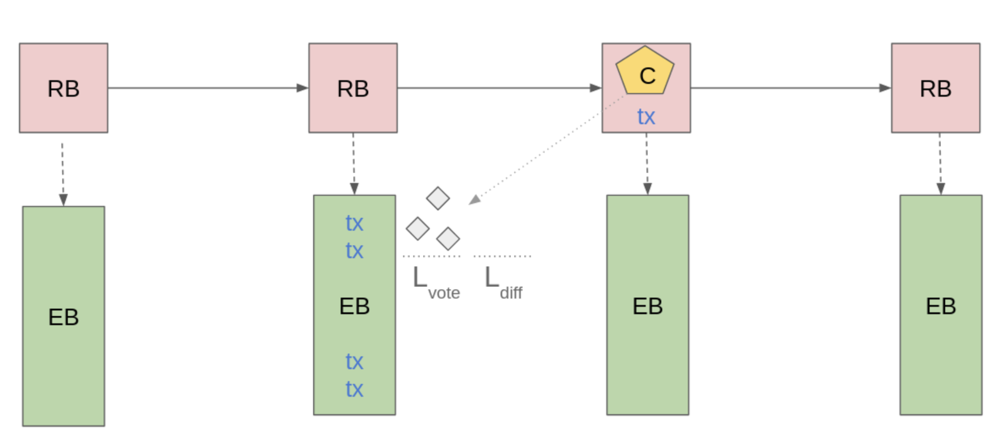

## Abstract

> [!NOTE]
>
> A short (~200 word) description of the proposed solution and the technical
> issue being addressed.

The anticipated growth of the Cardano ecosystem necessitates a fundamental
enhancement of network throughput to accommodate increasing transaction volumes
and support complex decentralized applications.

To address this challenge, we propose a transition to Ouroboros Leios — a novel
consensus protocol within the Ouroboros family. Leios is specifically designed
for high-throughput operation while preserving the rigorous security properties
established by Ouroboros Praos.

Leios achieves its scalability through a decoupled block production and
aggregation mechanism. This allows for a higher rate of input-block generation,
followed by efficient endorsement and anchoring onto the main chain. This
document formally specifies the Leios protocol using Agda and provides a
detailed rationale and supporting evidence demonstrating its efficacy in
overcoming the throughput limitations inherent in the current Ouroboros Praos
protocol.

> [!NOTE]
>
> For comprehensive research documentation, development history, and additional
> technical resources, visit the
> [Leios R&D website](https://leios.cardano-scaling.org/).

<details>
  <summary><h2>Table of contents</h2></summary>
  <strong><font color="red">Create a table of contents with internal hyperlinks when the organization of the document is stable.</font></strong>
</details>

## Motivation: why is this CIP necessary?

> [!NOTE]
>
> A clear explanation that introduces a proposal's purpose, use cases, and
> stakeholders. If the CIP changes an established design, it must outline design
> issues that motivate a rework. For complex proposals, authors must write a
> [Cardano Problem Statement (CPS) as defined in CIP-9999][CPS] and link to it
> as the `Motivation`.

While Cardano's current transaction processing capabilities often meet the
immediate demands of its user base, the underlying Ouroboros Praos consensus
protocol inherently imposes limitations on scalability. The critical requirement
for timely and reliable global propagation of newly generated blocks within a
short time interval necessitates a careful balancing act. This constraint
directly restricts the maximum size of individual blocks and the computational
resources available for the validation of transactions and Plutus scripts,
effectively establishing a ceiling on the network's transaction throughput that
cannot be overcome through simple parameter adjustments alone.

However, the dynamic growth of the Cardano ecosystem is increasingly revealing
the practical consequences of these inherent limitations. The Cardano mainnet
periodically experiences periods of significant congestion, where the volume of
transactions awaiting processing surpasses the network's ability to include them
in a timely manner. This congestion can lead to a tangible degradation in the
user experience, manifesting as delays in transaction confirmation. Moreover, it
poses substantial obstacles for specific use cases that rely on the efficient
processing of large volumes of transactions, such as the distribution of tokens
via airdrops, or the rapid and consistent updating of data by decentralized
oracles or partner chains.

The semi-sequential nature of block propagation in Ouroboros Praos, where blocks
are relayed from one block producer to the next across potentially
geographically distant nodes, is a key factor contributing to these limitations.
The necessity of completing this global dissemination within the few-second
period places a fundamental constraint on the rate at which new blocks, and
consequently the transactions they contain, can be added to the blockchain. This
architectural characteristic stands in contrast to the largely untapped
potential of the network's underlying infrastructure, where the computational
and bandwidth resources of individual nodes often remain significantly
underutilized.

To transcend these inherent scaling barriers and unlock the latent capacity of
the Cardano network, a fundamental evolution of the core consensus algorithm is
imperative. Ouroboros Leios represents a departure from the sequential
processing model of Praos, aiming to introduce mechanisms for parallel
transaction processing and more efficient aggregation of transaction data. By
reorganizing how transactions are proposed, validated, and ultimately recorded
on the blockchain, this protocol upgrade seeks to achieve a substantial increase
in the network's overall throughput, enabling it to handle a significantly
greater volume of transactions within a given timeframe.

The Cardano Problem Statement
[CPS-18 Greater Transaction Throughput](https://github.com/cardano-foundation/CIPs/blob/master/CPS-0018/README.md)
further motivates the need for higher transaction throughput and marshals
quantitative evidence of existing mainnet bottlenecks. Realizing higher
transaction rates is also necessary for long-term Cardano techno-economic
viability as rewards contributions from the Reserve pot diminish: fees from more
transactions will be needed to make up that deficit and keep sound the finances
of stakepool operations. (Currently, the Reserve contributes more than 85% of
the reward of a typical epoch, with less than 15% of the reward coming from the
collection of transaction fees. In five years, however, the Reserve contribution
will be much diminished.) Because a major protocol upgrade like Leios will take
significant time to implement, test, and audit, it is important to began
implementation well before transaction demand on mainnet exceeds the
capabilities of Ouroboros Praos. The plot below shows the historically
diminishing rewards and a forecast of their continued reduction: the forecast is
mildly uncertain because the future pattern of staking behavior, transaction
fees, and node efficiency might vary considerably.


Ouroboros Praos cannot support the high transaction volume needed to generate
the fees that will eventually be needed to offset the diminishing rewards.
However, as sustained throughput of transactions grows beyond 50 transactions
per second, there is more opportunity for simultaneously reducing fees,
augmenting the Treasury, and increasing SPO and delegator rewards.


## Specification

### Overview of the Leios protocol

Leios enhances Ouroboros Praos by introducing a dual-block structure and a
voting mechanism to increase transaction throughput while preserving core
consensus properties. The protocol is built around three main components:
[Ranking Blocks (RBs)](#ranking-blocks-rbs),
[Endorser Blocks (EBs)](#endorser-blocks-ebs), and a
[voting committee](#voting-committee) responsible for certifying EBs.

#### Protocol Components

##### Ranking Blocks (RBs)

Ranking Blocks are Praos blocks extended to support Leios by optionally
referencing [Endorser Blocks (EBs)](#endorser-blocks-ebs) and embedding their
certificates. In addition to including transactions directly, RBs can also
incorporate transactions from certified EBs. The two Leios-specific additions to
the Praos block structure are the optional `leios_cert`, which contains the
certificate attesting to the validity of an EB through
[BLS-based voting](https://github.com/input-output-hk/ouroboros-leios/blob/main/crypto-benchmarks.rs/Specification.md)
by a committee of stake pools, and the optional `announced_eb`, which references
the EB proposed for inclusion in the next RB.

###### CDDL

```diff
 ranking_block =
   [ header                   : block_header
   , transaction_bodies       : [* transaction_body]
   , transaction_witness_sets : [* transaction_witness_set]
   , auxiliary_data_set       : {* transaction_index => auxiliary_data}
   , invalid_transactions     : [* transaction_index]
+  , ? leios_cert             : leios_certificate
+  , ? announced_eb           : eb_reference
   ]
```

<p align="center"><em>Figure 1: Ranking Block CDDL</em></p>

##### Endorser Blocks (EBs)

Endorser Blocks are produced by the same stake pool that created the
corresponding [Ranking Block (RB)](#ranking-blocks-rbs). They serve to reference
additional transactions, increasing throughput beyond what can be included
directly in the RB. When an Endorser Block is announced in an RB, a voting
period begins as described in
[Voting Committee and Certificates](#voting-committee-and-certificates). Only
the immediately following RB is eligible to certify this announced Endorser
Block by including a [certificate](#certificate).

###### CDDL

```cddl
 endorser_block =
   [ eb_header         : eb_header
   , eb_body           : eb_body
   ]

 eb_header =
   [ eb_header_body       : eb_header_body
   , body_signature       : kes_signature
   ]

 eb_header_body =
   [ slot                 : slot_no
   , producer             : pool_id
   , ? vrf_proof          : vrf_cert
   ]

 eb_body =
   [ transaction_references: [* tx_reference]
   ]
```

<p align="center"><em>Figure 2: Endorser Block CDDL</em></p>

##### Voting Committee and Certificates

The voting committee is a group of stake pools selected to validate
[Endorser Blocks (EBs)](#endorser-blocks-ebs) through
[BLS-based vote aggregation](https://github.com/input-output-hk/ouroboros-leios/blob/main/crypto-benchmarks.rs/Specification.md).
Only EBs that achieve the required [quorum](#quorum) of votes are certified and
eligible for inclusion in [Ranking Blocks (RBs)](#ranking-blocks-rbs).

Votes are categorized as either **persistent** (selected for the entire epoch)
or **non-persistent** (selected per pipeline), following the
[Fait Accompli scheme](https://github.com/input-output-hk/ouroboros-leios/blob/main/crypto-benchmarks.rs/Specification.md#sortition).
To reduce network overhead, multiple votes from a single voter can be bundled
together. Once enough votes are collected to meet the quorum, they are
aggregated into a certificate that attests to the validity of the EB.

For further cryptographic details, refer to the
[BLS certificate scheme documentation](https://github.com/input-output-hk/ouroboros-leios/blob/main/crypto-benchmarks.rs/Specification.md#bls-certificate-scheme).

###### CDDL

```cddl
 leios_certificate =
   [ election_id            : election_id
   , endorser_block_hash    : hash32
   , persistent_voters      : [* persistent_voter_id]
   , nonpersistent_voters   : {* pool_id => bls_signature}
   , ? aggregate_elig_sig   : bls_signature
   , aggregate_vote_sig     : bls_signature
   ]

 leios_vote_bundle = persistent_vote_bundle / non_persistent_vote_bundle

 persistent_vote_bundle =
   [ 0
   , election_id
   , persistent_voter_id
   , vote_entries
   ]

 non_persistent_vote_bundle =
   [ 1
   , election_id
   , pool_id
   , eligibility_signature
   , vote_entries
   ]

 vote_entries = {* endorser_block_hash => vote_signature}
```

<p align="center"><em>Figure 3: Votes & Certificate CDDL</em></p>

#### Protocol Flow

The protocol flow, as depicted in [Figure 1](#figure-1-protocol-flow), consists
of four main stages:

1. **EB Announcement:**  
   The RB producer references a new EB, signaling its proposal to the network.

2. **Voting:**  
   Over a period of $L$ slots, committee members cast votes on the validity of
   the announced EB, where $L$ is chosen to ensure sufficient time for voting
   given the network diffusion time $\Delta$ (i.e., $\Delta < L$; $\Delta$ is
   the maximum time for message propagation).

3. **Certification:**  
   If the EB receives enough votes such that the total stake of all voting pools
   meets or exceeds a threshold fraction $\tau$ (typically 60%) of the total
   stake, it is certified. In other words, certification requires:

   $$
   \sum_{v \in \text{votes}} \text{stake}(v) \geq \tau \times \text{stake}_{\text{total}}
   $$

   (This is represented by the yellow pentagon labeled `C` in the Figure 4
   below.)

4. **Finalization:**  
   The certificate is included in a subsequent RB, at which point the
   transactions from the certified EB are executed. The process may then repeat
   with the announcement of the next EB.

<a name="figure-1-protocol-flow"></a>



<p align="center"><em>Figure 4: Ouroboros Leios Protocol Flow</em></p>

##### Bottom Line: What Throughput Does Leios Enable?

In summary, Leios enables much higher throughput than Praos alone by allowing
transactions to be included both in standard blocks and in certified Endorser
Blocks. The effective transaction rate is:

$$
\text{Throughput} = f_{\text{RB}} \times \left( \text{capacity}_{\text{RB}} + \text{capacity}_{\text{EB}} \times \text{rate}_{\text{EB, inclusion}} \right)
$$

This formula captures the core benefit of Leios: scaling transaction capacity by
leveraging both the main chain and additional certified blocks.

### Constraints on Leios protocol parameters

The following table defines the key protocol parameters for Linear Leios, along with their constraints and rationale. These parameters control the timing, security, and performance characteristics of the protocol.

| Parameter | Symbol | Units | Description | Constraints | Rationale |
|---|---|---|---|---|---|
| Stage length | $L$ | slot | Duration of the voting period for endorser blocks | $L \geq \Delta$ | Must allow sufficient time for EB diffusion and voting |
| Endorser-block production rate | $f_\text{EB}$ | 1/stage | Probability of producing an EB during a stage | $0 < f_\text{EB} \leq 1$ | EBs are produced by the same pool that creates the RB |
| Mean committee size | $n$ | parties | Average number of stake pools selected for voting | $n > 0$ | Ensures sufficient decentralization and security |
| Quorum size | $\tau$ | fraction | Minimum fraction of committee votes required for certification | $\tau > 0.5$ | Prevents adversarial control while ensuring liveness |
| Network diffusion time | $\Delta$ | slot | Upper limit on the time needed to diffuse a message to all nodes | $\Delta > 0$ | Messages have a finite delay due to network topology |
| Praos active slot coefficient | $f_\text{RB}$ | 1/slot | Probability that a party will be the slot leader for a particular slot | $0 < f_\text{RB} \leq \Delta^{-1}$ | Blocks should not be produced faster than network delay |

### Specification for votes and certificates

Leios requires a voting and certificate scheme to validate endorser blocks. The protocol is flexible regarding the specific cryptographic implementation, but any scheme must meet the following requirements:

#### Requirements

1. _Succinct registration of keys:_ The registration of voting keys should not involve excessive data transfer or coordination between parties. Ideally, such registration would occur as part of the already existing operational certificates.

2. _Key rotation:_ The cryptographic keys used to sign Leios votes and certificates _do not_ need to be rotated periodically because the constraints on Leios voting rounds and the key rotation already present in Praos secure the protocol against attacks such as replay and key compromise.

3. _Deterministic signatures:_ Deterministic signatures can guard against attacks that weaken key security.

4. _Local sortition:_ Selection of the voting committee should not be so deterministic and public as to open attack avenues such as denial-of-service or subversion.

5. _Liveness:_ Adversaries with significant stake (e.g., more than 35%) should not be able to thwart an honest majority from reaching a [quorum](#quorum) of votes for an EB.

6. _Soundness:_ Adversaries with near majority stake (e.g., 49%) should not be able to form an adversarial quorum that certifies the EB of their choice.

7. _Small votes:_ Because vote traffic is large and frequent in Leios, the votes themselves should be small. Note that the large size of Praos KES signatures precludes their use for signing Leios votes.

8. _Small certificates:_ Because Leios certificates are frequent and must fit inside Praos blocks, they should be small enough so there is plenty of room for other transactions in the Praos blocks.

9. _Fast cryptography:_ The computational burden of creating and verifying voting eligibility, the votes themselves, and the resulting certificate must be small enough to fit within the CPU budget for Leios stages.

#### Implementation

A BLS-based certificate scheme that meets these requirements is documented in the [BLS certificates specification](https://github.com/input-output-hk/ouroboros-leios/blob/main/crypto-benchmarks.rs/Specification.md). This implementation provides:

- Certificate sizes under 10 kB for realistic stake distributions
- Efficient vote aggregation using the Fait Accompli sortition scheme
- Performance benchmarks suitable for production deployment

### Mini protocols

> [!NOTE]
>
> This section will describe the new mini-protocols required for Leios operation, including EB diffusion, voting, and certificate aggregation protocols.

### Node changes

> [!NOTE]
>
> This section will detail the required changes to the Cardano node implementation, including database schema modifications, state management updates, and network protocol enhancements.

### Mempool management

> [!NOTE]
>
> This section will describe the dual mempool system required for Linear Leios, including how transactions are managed for both EB-inclusive and EB-exclusive scenarios.

### Incentives and block reward calculation

> [!NOTE]
>
> This section will specify how rewards are distributed for Leios operations, including EB production, voting participation, and transaction fee allocation.

## Rationale: how does this CIP achieve its goals?

> [!NOTE]
>
> The rationale fleshes out the specification by describing what motivated the
> design and what led to particular design decisions. It should describe
> alternate designs considered and related work. The rationale should provide
> evidence of consensus within the community and discuss significant objections
> or concerns raised during the discussion.
>
> It must also explain how the proposal affects the backward compatibility of
> existing solutions when applicable. If the proposal responds to a [CPS][], the
> 'Rationale' section should explain how it addresses the CPS and answer any
> questions that the CPS poses for potential solutions.

### How Leios increases throughput

The throughput of a Nakamoto consensus like Ouroboros Praos is intrinsically
limited by the strict requirement for rapid global propagation of each block
approximately before the next leader produces a block. Leios escapes that
limitation by producing input blocks at a higher rate and then voting on
aggregations of them (i.e., voting on endorser blocks) by a dynamically selected
representative committee of stake pools, ensuring broad participation in the
aggregation process. The voting process on these aggregations occurs in a more
relaxed and extended manner over a multi-slot stage, allowing for greater
network latency tolerance. When a quorum is reached, that quorum is recorded in
a Praos block. The majority voting by this committee ensures consensus on the
endorser block while inheriting and maintaining Praos's robust resistance to
adversarial activity, as the final commitment is anchored in the secure Praos
chain.

As a result of this decoupled approach, Leios can utilize nearly the full
bandwidth available to the network of nodes without requiring unrealistically
fast propagation of blocks: Leios employs a structured, multi-stage process
where input blocks are produced rapidly and then aggregated and voted upon in
subsequent stages before being referenced by a Praos block. Think of Praos as a
single-lane highway where every car (block) needs to travel the entire length
before the next can start. Leios, in contrast, is like having many local roads
(input blocks) feeding into a larger, slower-moving but higher-capacity highway
(endorser block aggregation and Praos anchoring).

In analogy, imagine Praos as a single courier diligently collecting and
delivering individual letters one by one, limiting the delivery speed to their
individual capacity. Ouroboros Leios, however, operates like a mail sorting
office where numerous local branches rapidly collect and bundle letters (input
blocks) before a central team efficiently processes and dispatches these
aggregated bundles (endorser blocks), achieving a significantly higher delivery
volume.

### Metrics

> [!NOTE]
>
> This is a preliminary set of metrics that will be finalized when the Leios
> protocol variants are finalized and the simulation studies are complete.

The performance of a protocol like Leios can be characterized in terms of its
efficient use of resources, its total use of resources, the probabilities of
negative outcomes due to the protocol's design, and the resilience to adverse
conditions. Metrics measuring such performance depend upon the selection of
protocol parameters, the network topology, and the submission of transactions.
The table below summarizes key metrics for evaluating Leios as a protocol and
individual scenarios (parameters, network, and load).

| Category   | Metric                                                    | Measurement                                                                                                     |
| ---------- | --------------------------------------------------------- | --------------------------------------------------------------------------------------------------------------- |
| Efficiency | Spatial efficiency, $`\epsilon_\text{spatial}`$           | Ratio of total transactions size to persistent storage                                                          |
|            | Temporal efficiency, $`\epsilon_\text{temporal}(s)`$      | Time to include transaction on ledger                                                                           |
|            | Network efficiency, $`\epsilon_\text{network}`$           | Ratio of total transaction size to node-averaged network usage                                                  |
| Protocol   | TX collision, $`p_\text{collision}`$                      | Probability of a transaction being included in two IBs                                                          |
|            | TX inclusion, $`\tau_\text{inclusion}`$                   | Mean number of slots for a transaction being included in any IB                                                 |
|            | Voting failure, $`p_\text{noquorum}`$                     | Probability of sortition failure to elect sufficient voters for a quorum                                        |
| Resource   | Network egress, $`q_\text{egress}`$                       | Rate of bytes transmitted by a node                                                                             |
|            | Disk usage, $`q_\text{disk}`$                             | Rate of persistent bytes stored by a node                                                                       |
|            | I/O operations, $`\bar{q}_\text{iops}(b)`$                | Mean number of I/O operations per second, where each operation writes a filesystem block of $`b`$ bytes         |
|            | Mean CPU usage, $`\bar{q}_\text{vcpu}`$                   | Mean virtual CPU cores used by a node                                                                           |
|            | Peak CPU usage, $`\hat{q}_\text{vcpu}`$                   | Maximum virtual CPU cores used by a node over a one-slot window                                                 |
| Resilience | Bandwidth, $`\eta_\text{bandwidth}(b)`$                   | Fractional loss in throughput at finite bandwidth $`b`$                                                         |
|            | Adversarial stake, $`\eta_\text{adversary}(s)`$           | Fractional loss in throughput due to adversial stake of $`s`$                                                   |
| Fees       | Collateral paid for success, $`\kappa_\text{success}(c)`$ | Average collateral paid for a successful transaction when it conflicts with a fraction $`c`$ of the memory pool |
|            | Collateral paid for failure, $`\kappa_\text{failure}(c)`$ | Average collateral paid for a failed transaction when it conflicts with a fraction $`c`$ of the memory pool     |

**_Spatial efficiency:_** Leios necessarily imposes some disk overhead beyond
the raw bytes needed to store transactions themselves. This overhead includes
the IBs, EBs, and RBs associated with storing transactions. The concurrency
inherent in Leios also opens the possibility that duplicate or conflicting
transactions are stored in IBs, with the consequence that some space is the IBs
is wasted. The spatial efficiency metric is defined as the ratio of the total
bytes of transactions included in the ledger to the total persistent storage
required by the protocol.

$$
`
\epsilon_\text{spatial} = \frac{\text{total bytes of transactions included in the ledger}}{\text{total bytes of IBs, EBs, and RBs}}
`
$$

**_Temporal efficiency:_** As is true for Praos, there is a delay between
submitting a transaction and its being included in the ledger and there is a
finite chance that it never is included in the ledger. Before a transaction is
eligible to be included in a new IB, it must be validated and placed in the
memory pool. It is cleanest to measure the time from the transaction reaching
the local memory pool of the node where it was submitted to the time when it is
included in the ledger, via a Praos block. The same metric applies both to Praos
and to Leios. In aggregate, we measure the temporal efficiency as the fraction
of transactions that reach the ledger, as function of the number of slots
elapsed. The quantity $`\epsilon_\text{temporal}(\infty)`$ is the fraction of
submitted transactions that ever reach the ledger.

$$
`
\epsilon_\text{temporal}(s) = \text{fraction of transactions included in the ledger within } s \text{ slots of their inclusion in a local memory pool}
`
$$

**_Network efficiency:_** Effective utilization of the network can be
characterized by the ratio of bytes of transactions reaching the ledger to the
average network traffic per node. (This could also be computed individually for
each node and used as a local metric.)

$$
`
\epsilon_\text{network} = \frac{(\text{bytes of valid transactions reaching the ledger}) \cdot (\text{number of nodes in the network})}{\text{total bytes of network traffic}}
`
$$

**_TX duplicate:_** Because Leios uses local sortition for electing which nodes
produce IBs, there is a finite chance that a transaction will be included in
more than one IB during the concurrency period when nodes are not aware of which
transactions other nodes are including in their new IBs. The transaction
collision probability is simply the fraction of transactions that appear
multiple times in IBs.

$$
`
p_\text{duplicate} = \text{fraction of transactions that appear multiple times in IBs}
`
$$

**_TX inclusion:_** Similarly to the case of a transaction being included
multiple times in IBs, it is possible that a transaction might have to wait for
many pipelines to progress before being included in an IB. The characteristic
time for such inclusion in an IB is inversely proportional to the probability of
it being included in a pipeline. This is strongly correlated with how long the
transaction waits in the memory pool: some of the proposed Leios variants draw
txs randomly from the memory pool or wait for the correct shard.

$$
`
\tau_\text{inclusion} = \text{mean number of slots for a transaction to be included in any IB}
`
$$

**_Voting failure:_** An unlucky set of VRF evaluations might result in
insufficient voters being selected in a given pipeline, thus making it
impossible to certify an EB in that pipeline.

$$
`
p_\text{noquorum} = \text{probability of sufficient voters to achieve a quorum in a given pipeline}
`
$$

**_Network egress:_** Cloud service providers typically charge for network
egress rather than for network ingress. The quantity $`q_\text{egress}`$ is
simply the number of bytes sent from a node per unit time.

**_Disk usage:_** Leios requires that IBs, EBs, and RBs be stored permanently;
votes need not be stored permanently, however. The quantity $`q_\text{disk}`$ is
the total number of IB, EB, and RB bytes generated per unit time.

**_I/O operations:_** Some cloud service providers limit or bill input/output
operations on a per-second capacity basis. The number of I/O operations depends
upon the filesystem's block size $`b`$, not on the logical number of writes to
disk by the protocol: e.g., writing an IB of 32,768 bytes might consist of 64
I/O operations on a filesystem having a 512-byte block size. We assume that disk
caching and delayed writes smooth out the unevenness in I/O operations, so that
the mean $`\bar{q}_\text{iops}`$ is the best metric here.

**_Mean CPU usage:_** Computation resources consumed by the number are
quantified as $`\bar{q}_\text{vcpu}`$, which is the mean number of virtual CPU
cores utilized by the protocol.

**_Peak CPU usage:_** Because CPU usage varies depending upon the node's
activity, the maximum number of virtual CPU cores utilized by the protocol
during any slot, $`\hat{q}_\text{vcpu}`$, provides a useful indication of
computational burstiness and of how a virtual machine should be sized for Leios.

**_Bandwidth:_** If the bandwidth for inter-node communication drops below a
given value, then the throughput of Leios (at a given level of demand) will be
drop, as network congesting occurs.

$$
`
\eta_\text{bandwidth}(b) = \frac{\text{bytes of transactions reaching the ledger if links have bandwidth } b}{\text{bytes of transactions reaching the ledger if bandwidth were infinite}}
`
$$

**_Adversarial stake:_** Similarly, when adversarial stake is appreciable and
active, the throughput of Leios might be drop.

$$
`
\eta_\text{adversary}(s) = \frac{\text{bytes of transactions reaching the ledger without adversarial activity}}{\text{bytes of transactions reaching the ledger with adversarial activity given fraction } s \text{ of the total stake}}
`
$$

**_Fees:_** Two fee metrics relate to consumption of collateral. Some Leios
variants may consume collateral for successful transactions when conflicts are
present in IBs and EBs; others may consume collateral for failed transactions.

$$
`
\kappa_\text{success}(c) = \text{average collateral paid for a successful transaction when it conflicts with a fraction } c \text{ of the memory pool}
`
$$

$$
`
\kappa_\text{failure}(c) = \text{average collateral paid for a failed transaction when it conflicts with a fraction } c \text{ of the memory pool}
`
$$

### Evidence that Leios provides high throughput

The Leios paper[^2] provides a rigorous theoretical analysis of the safety and
throughput of the protocol. That has been reinforced and demonstrated by
prototype simulations written in Haskell and Rust.

> [!CAUTION]
>
> The plots below are placeholders. All of the simulations in this section need
> to be re-run:
>
> - [ ] Final version of the Leios protocol
> - [ ] Realistic mainnet topology
> - [ ] Protocol parameters close to the recommended value
> - [ ] CPU
>   - [ ] Unlimited?
>   - [ ] Six cores?
> - [ ] Decide which plots best illustrate throughput
> - [ ] Strip the major titles from the diagrams
> - [ ] Use SVG format

The simulations demonstrate that bandwidth is partitioned between IBs, EBs,
votes, and RBs so that congestion in one message type does not spill over into
congestion for other message types. Because IBs are the largest messages, these
are the ones first subject to congestion. The plot below shows the appearance of
congestion effects in the Haskell simulation at 8 IB/s for 98 kB IBs. (Note that
the Haskell simulation represents TCP more faithfully than the Rust one.) Even
at this high throughput, IBs arrive at all nodes in the network with 100%
success and mostly within five seconds. This implies that the stage length could
be as short a five seconds per stage.


In terms of the transaction lifecycle, transaction typically reach IBs rapidly
for high-throughput settings of Leios parameters, but it takes tens of seconds
for the to become referenced by an EB. Referencing by an RB takes longer, often
close to 100 seconds.


### Why Leios is practical to implement

A Leios implementation would build upon the well-proven design of the existing
Cardano node by adding several new mini-protocols for the diffusion of IBs, EBs,
and votes. The additional cryptography used by Leios is also quite similar to
that already in production in various parts of the Cardano and blockchain
ecosystems. Leios adds complexity to the process of updating the ledger because
conflicting or duplicate transactions in IBs need reconciliation when the UTXO
set is recomputed. The sharding of transactions in Leios will complicate the
management of the memory pool and the structure of UTXOs themselves. Adjustments
to the rewards model will also be required.

The performance of the cryptographic operations required for Leios is
demonstrated by a prototype implementation[^3] and the benchmarks in the
Appendix [Cryptographic benchmarks](#cryptographic-benchmarks). The small size
(less than 9 kB) of Leios certificates is documented in the Appendix
[Certificate size for realistic stake distributions](#certificate-size-for-realistic-stake-distributions).
The [Resource requirements](#resource-requirements), discussed below, modestly
increase the requirements for running a Cardano node but not beyond commonly
available commodity hardware.

### Use cases

Leios immediately enables use cases for high transaction volume and for more
computationally intensive Plutus scripts, but future minor modifications of the
protocol can open additional novel and custom transaction workflows.

#### High transaction volume

Prototype simulations of the Leios protocol indicate that it can achieve at
least 20 times the maximum throughput of the current Cardano mainnet. This
amounts to approximately 2 MB/s or 1500 tx/s, assuming the current mean
transaction size of 1400 bytes. The availability of Leios, however, would likely
affect the characteristics of the mix of transactions, so the maximum
transaction rate could be higher or lower than this estimate. Whatever the
specifics, Leios will enable transaction volumes that are orders of magnitude
greater than Praos.

Aside from the general benefit of high capacity, several specific use cases
could benefit.

- _Enterprise or national-state adoption:_ Enterprises and nation states require
  sustained and guaranteed scalability for their blockchain transactions, and
  large entities may become heavy users of Cardano.
- _Finance:_ High volume and high frequency trading may become more practical
  given the higher throughput supported by Leios.
- _Airdrops:_ The high throughput of Leios could streamline the user experience
  of claiming tokens for large (or extremely large) airdrops.
- _Partner chains, bridges, and oracles:_ Multiple simultaneous operation of
  partner chains, bridges, and oracles on Cardano will require high transaction
  rates and minimal delays from the time a transaction reaches the memory pool
  to when it is recorded in the ledger.
- _Games:_ High throughput and lower transaction cost may enable cost-effective
  coupling of games (e.g., markets for in-game items).
- _Improved user experience:_ From the onset of the Alonzo era, the usability of
  particular dapps has occasionally been constrained by the transaction
  throughput available on Praos. This is especially important and severe when a
  popular new dapps launches and experiences high activity. Congestion that
  sometimes occurs during spikes in transaction activity would be alleviated.
- _More complex governance actions:_ Expansion of Cardano and DAO governance
  would required high volumes of transactions if large portions of the community
  participate. This is particularly important if the number of dreps increases
  and Cardano moves towards a "direct democracy" style of voting.

#### Improved cost structure

Techno-economic analyses indicate that at a sustained transaction volume of 50
tx/s or greater the profitability profile of Cardano will improve in several
ways. If the current transaction fee structure remains the same as now, Leios
would have three economic effects at 50+ tx/s:

1. The intake of transaction fees would be large enough to lessen or eliminate
   the need for supplementing rewards from the Reserve pot. In particular, the
   `monetaryExpansion` protocol parameters to be lowered and/or the
   `treasuryCut` parameter could be increased.
2. Stake rewards would increase.
3. Stake pools would become more profitable. In particular, at 50+ tx/s the
   costlier Leios hardware would be overcome by higher rewards.
4. Transaction fees could be somewhat lowered. That could further drive adoption
   and make smaller transactions more cost effective, perhaps even opening the
   possibilities for micropayments or IoT applications.

The following plot shows a forecast for SPO profitability under Leios, assuming
a "business as usual" scenario where the fee, treasury, and monetary expansion
protocol parameter stay the same as presently. The precise profitability of
individual SPOs depends strongly upon how they host their nodes, but there is a
clear trend towards profitability (without any contributions from the Cardano
Reserve) once 30-50 transactions per second are sustained. Note that
profitability slows at very high throughput because of the substantial expense
of network egress and storage of the ledger.


#### Intensive Plutus execution

Because there typically is a time window of several seconds from the time a
Leios input block can be created to when it needs to start diffusing to other
nodes, there is also an opportunity to do more computation validating an Leios
input block than for a Praos ranking block. This opens the possibility of
increasing the Plutus execution budget for input blocks so that it is
significantly larger than the budget for Praos blocks. At the very least a
script could be allowed to use the whole Plutus execution budget for an input
block, instead of just one quarter of it as is the case for Praos.

Numerous emerging use cases on Cardano would benefit from larger Plutus
execution budgets. Complex dapps currently have to split a single logical
operation into a sequence of several transactions, increasing the development
effort, the complexity, and the attack surface of the scripts involved.

- _ZK proofs:_ It may be possible to increase the Plutus execution budget enough
  that a complete ZK proof could verified in a single transaction.
- _Large number of parties:_ Scripts managing potential interactions with a
  large number of parties (e.g., airdrops, lotteries, and local accounts) are
  intrinsically limited by Plutus execution limits.
- _On-chain interpreters:_ Dapps like Marlowe run interpreters for their DSL in
  a Plutus script. Execution limits currently restrict the complexity of the DSL
  expressions that can be evaluated in a single transaction.

#### Novel use cases

Although the version of Leios proposed in this document does not support the
particular use cases listed below, a minor variant or future version of Leios
could.

- _Priority pipelines:_ Different Leios pipelines might have different stage
  lengths, throughput, fees, and/or Plutus execution limits, enabling
  applications to select their level of service.
- _Externally batched input blocks:_ Third parties could construct input blocks
  and provide them directly to the block producers, allowing a dapp or an
  exchange detailed control over sequencing of interdependent transactions
  within a block or even between blocks.
- _Nuanced roles for SPOs:_ Leios opens the possibility of separating the
  protocol functions into separate processes that could be run independently but
  in coordination. For example, some SPOs (or parts of an SPO) might only create
  input blocks while others might only produce ranking blocks. In addition to
  enabling flexible configuration of Cardano worker services, this could
  encourage new operational models for SPO consortia.

### Feasible values for Leios protocol parameters

The table below documents a set of Leios protocol parameters that provided high
throughput and reasonably fast settlement in the prototype Haskell and Rust
simulations of Leios. The exact choice of parameters that would be adopted on
the Cardano mainnet must be subject to discussion and consideration of
tradeoffs.

> [!WARNING]
>
> This is an incomplete work in progress.
>
> - [ ] Revise after the protocol definition is complete.
> - [ ] Each row should have a paragraph of justification.

| Parameter                                  | Symbol           | Units    | Description                                                                 | Feasible value | Justification                                                                                                             |
| ------------------------------------------ | ---------------- | -------- | --------------------------------------------------------------------------- | -------------: | ------------------------------------------------------------------------------------------------------------------------- |
| Stage length                               | $L$              | slot     |                                                                             |             10 | Short stages increase settlement speed, but the stage length must be generously larger than the propagation time for IBs. |
| Input-block production rate                | $f_\text{IB}$    | 1/slot   |                                                                             |                |                                                                                                                           |
| Endorser-block production rate             | $f_\text{EB}$    | 1/stage  |                                                                             |                |                                                                                                                           |
| Expiration of unreferenced input blocks    | $r_\text{IB}$    | slot     |                                                                             |                |                                                                                                                           |
| Expiration of unreferenced endorser blocks | $r_\text{EB}$    | slot     |                                                                             |                |                                                                                                                           |
| Number of shards                           | $k_\text{shard}$ | unitless |                                                                             |                |                                                                                                                           |
| Mean committee size                        | $n$              | parties  |                                                                             |            500 | Probabilistic analyses of adversarial stake scenarios.                                                                    |
| Quorum size                                | $\tau$           | fraction |                                                                             |            60% | Probabilistic analyses of adversarial stake scenarios.                                                                    |
| . . .                                      |                  |          |                                                                             |                |                                                                                                                           |
| Praos active slot coefficient              | $f_\text{RB}$    | 1/slot   | The probability that a party will be the slot leader for a particular slot. |           0.05 | This is the current value on mainnet, but it may become feasible to reduce it if Praos blocks are made smaller.           |

The analysis
[Committee size and quorum requirement](https://github.com/input-output-hk/ouroboros-leios/blob/main/docs/technical-report-1.md#committee-size-and-quorum-requirement)
in the first Leios Technical Report indicates that the Leios committee size
should be no smaller than 500 votes and the quorum should be at least 60% of
those votes. However, the proposed Fait Accompli[^1] scheme wFA<sup>LS</sup>
achieves compact certificates that do not become larger as the number of voters
increases, so larger committee sizes might be permitted for broader SPO
participation and higher security. The committee size should be large enough
that fluctuations in committee membership do not create an appreciable
probability of an adversarial quorum when the adversarial stake is just under
50%. The quorum size should be kept large enough above 50% so that those same
fluctuations do not prevent an honest quorum. Larger committees require more
network traffic, of course.

### Attack and mitigation

The Leios protocol may have to mitigate the following categories of threats.

- Grinding the VRF to obtain an advantage in Leios sortition
- Equivocating IBs, EBs, or RBs
- Declining to create IBs, EBs, or votes
- Manipulating the content of IBs or EBs
- Sending invalid txs, IBs, EBs, or certificates
- Abusing the sync protocol
- Delaying diffusion of IBs, EBs, or votes
- Submitting invalid, conflicting, or duplicate transactions

Nearly all of these _hypothetical_ threats are already mitigated by the protocol
design, the incentive structure, or the cost of the resources needed to execute
the threat. The
[Threat model](https://github.com/input-output-hk/ouroboros-leios/blob/main/docs/technical-report-1.md#threat-model)
section of the first Leios Technical report contains a detailed taxonomy that we
summarize here. The general impact of such attacks varies:

- Resource burden on nodes
- Lowered throughput
- Increased latency
- Manipulation of dapps or oracles

_Grinding and other threats to Praos:_ Threats to the ranking blocks used by
Leios are already mitigated by Ouroboros Praos and Genesis. Nevertheless, the
possibility of _grinding attacks_, as discussed in
[CPS-0017](https://github.com/cardano-scaling/CIPs/blob/settlement-cps/CPS-0017/README.md),
will always exist, albeit at low probability of success. Such an attack, which
requires some stake, involves using CPU resources to try to manipulate the epoch
nonce to a value which will result in higher probability of being select as an
RB, IB, or EB producer or as a voter in a subsequent epoch. This presumes that
the Praos VRF will be used for the sortition in Leios. Currently, large and
expensive amounts of CPU power would be required to successfully conduct a grind
attack on Praos. Nevertheless, additional research and development are underway
to further harden Praos.

_Equivocation:_ In Leios, an IB producer, EB producers, or voter is only allowed
one production for each winning of the sortition lottery. (Note that they may
win more than once in the same slot because a lottery takes place for each
lovelace staked.) A malicious producer or voter might create two conflicting
IBs, EBs, or votes and diffuse them to different downstream peers in an attempt
to disrupt the Leios protocol. The
[Leios paper](https://iohk.io/en/research/library/papers/high-throughput-blockchain-consensus-under-realistic-network-assumptions/)
mitigates this situation explicitly by identifying nodes that misbehave in this
manner and notifying downstream peers in a controlled manner.

_Inaction and nuisance:_ Producer nodes might also attempt to disrupt the
protocol by failing to play their assigned role or by attempting to diffuse
invalid information. Failing to produce a block (RB, IB, or EB) or to vote when
entitled will result in the attacker receiving fewer rewards for their Leios
work. Similarly for creating invalid blocks or votes. Very little advantage
would be gained by such attacks because they really only reduce throughput or
create a minor annoyance to their first downstream nodes by burdening them with
useless verification work. Presumably, the loss of rewards would not compensate
for the small disruption they create. The cryptographic aspects of Leios quickly
catch invalid blocks or votes, of course.

_Omission and manipulation:_ In Praos, omitting transactions from a block being
forged does not directly affect the producer's rewards, but it may reduce the
overall size of the rewards pot for the whole epoch. However, a malicious
producer has little leverage by such omissions because of the very high
probability that the omitted transactions reside elsewhere in the memory pool
and will soon be included in subsequent honest blocks. Reordering IBs when an EB
is created is not an option for an attacker because the Leios paper specifies a
fixed ordering.

_Network interference:_ Malicious network activity such as violating the sync
protocol or delaying diffusion of block or votes creates a minor annoyance that
the node's sync protocol will quickly avoid by preferring efficient and honest
nodes. Large numbers of malicious relays would be needed to impinge on
efficiency even in a small degree.

_Denial of service:_ Transaction-based denial of service attacks on Leios would
involve submitting numerous invalid, duplicate, or conflicting transactions to
different nodes so that they would all make their way into the memory pool and
then to IBs, only to be invalidated when transaction reconciliation occurs after
those IBs are indirectly referenced by a certificate on a Praos ranking block.
Such a denial of service would result in extra computation by the nodes and
wasted permanent storage in the IBs. (Plutus transactions may be especially
burdensome in this respect.) Ongoing research will mitigate such denial of
service via sharding techniques and Leios's fee structure. Sharding will prevent
duplicate transactions from reaching IBs and the fee structure will enforce
payment for intentionally conflicted transactions, even though only one of the
transactions would make it onto the ledger.

### Resource requirements

The resource requirements for operating Leios nodes have been estimated from
benchmarking and simulation studies. The benchmark values for various Leios
operations come either from measurements of the cryptography prototype[^3] or
from the IOG benchmarking cluster for the Cardano node. These were input to the
Haskell and Rust simulators for Leios to make holistic estimates of resource
usage of operating nodes.

> [!CAUTION]
>
> The plots below are placeholders. All of the simulations in this section need
> to be re-run:
>
> - [ ] Final version of the Leios protocol
> - [ ] Realistic mainnet topology
> - [ ] Protocol parameters close to the recommended value
> - [ ] CPU
>   - [ ] Unlimited?
>   - [ ] Six cores?
> - [ ] Strip the major titles from the diagrams
> - [ ] Use SVG format

At high throughput, network egress can become a significant cost for nodes
hosted on some cloud-computing providers. The violin plots below indicate that
at the higher throughput that Leios can support, network egress can reach nearly
2 MB/s.


Disk usage is correlated with network usage, as most of the blocks moving over
the network also need to be persisted permanently; only the votes do not require
disk storage. The plots below demonstrate that disk usage scales directly as the
product of the IB rate and the IB size.


Both the average CPU usage and the peak CPU usage are relevant for deciding how
to provision hardware for Leios nodes. The following plots indicate that two
CPUs are sufficient for sustained and for peak Leios operation at high
throughput. Real deployments should over-provision CPU, of course, in order to
handle rare extraordinary peak conditions and to speed syncing from genesis.


Overall the most significant Leios hardware requirement changes compared to
Praos are the higher levels of network egress and the rapidly growing disk space
to store the Leios blocks. CPU requirements are quite similar to existing Praos
deployments.

### Operating costs

A detailed cost analysis of Leios deployment is documented in
[Leios node operating costs](https://github.com/input-output-hk/ouroboros-leios/blob/main/docs/cost-estimate/README.md)
in the github repository for the Leios R&D effort. The major conclusion of that
report is the following table that relates IB production rate, assuming IBs are
the maximum size of existing Praos blocks, to the cost per node and the total
cost of all nodes.

| IB/s Rate | Cost per Node (Avg) | Network Cost (10,000 nodes) |
| --------: | ------------------: | --------------------------: |
|      0.05 |       $80 USD/month |          $800,000 USD/month |
|         1 |      $200 USD/month |        $2,000,000 USD/month |
|         5 |      $700 USD/month |        $7,000,000 USD/month |
|        10 |    $1,300 USD/month |       $13,000,000 USD/month |
|        20 |    $2,500 USD/month |       $25,000,000 USD/month |
|        30 |    $3,600 USD/month |       $36,000,000 USD/month |

_Required TPS for Infrastructure Cost Coverage:_ Using average transaction sizes
and fees, we can calculate the required TPS to generate enough fees to cover
infrastructure costs.

| Infrastructure Cost (USD/month) | Required ADA (at $0.45/ADA) | TPS (Avg Tx) | TPS (Min Tx) | Equivalent IB/s |
| ------------------------------: | --------------------------: | -----------: | -----------: | --------------: |
|                        $800,000 |                   1,777,778 |         0.31 |         0.40 |           0.004 |
|                      $2,000,000 |                   4,444,444 |         0.78 |         1.00 |           0.011 |
|                      $7,000,000 |                  15,555,556 |         2.72 |         3.49 |           0.039 |
|                     $13,000,000 |                  28,888,889 |         5.05 |         6.48 |           0.072 |
|                     $25,000,000 |                  55,555,556 |         9.71 |        12.47 |           0.139 |
|                     $36,000,000 |                  80,000,000 |        13.99 |        17.96 |           0.200 |

_Required TPS for Current Reward Maintenance:_ To maintain current reward levels
(~48 million ADA monthly) through transaction fees as the Reserve depletes.

| Year | Reserve Depletion | Rewards from Fees (ADA) | Required TPS (Avg Tx) | Required IB/s |
| ---: | ----------------: | ----------------------: | --------------------: | ------------: |
| 2025 |               ~0% |                       0 |                     0 |             0 |
| 2026 |              ~13% |               6,240,000 |                  10.9 |          0.16 |
| 2027 |              ~24% |              11,520,000 |                  20.1 |          0.29 |
| 2028 |              ~34% |              16,320,000 |                  28.5 |          0.41 |
| 2029 |              ~43% |              20,640,000 |                  36.1 |          0.52 |
| 2030 |              ~50% |              24,000,000 |                  41.9 |          0.60 |

Note that by 2029, to compensate for Reserve depletion, the network would need
to process approximately 36 TPS with average-sized transactions, requiring an
Input Block rate of around 0.52 IB/s, roughly 10 times the current mainnet
throughput. Leios's design would comfortably support this increased throughput
while maintaining decentralization.

### Why this variant over full Leios

> [!NOTE]
>
> This section will explain why this simplified variant was chosen over the full Leios described in the research paper, including implementation complexity, risk assessment, and practical deployment considerations.

### Design trade-offs and simplifications

> [!NOTE]
>
> This section will analyze the trade-offs made in this variant's design, including the removal of input blocks, simplified concurrency model, and the balance between implementation complexity and throughput improvements.

### Evidence and simulation analysis

> [!NOTE]
>
> This section will present simulation results and performance analysis demonstrating this variant's effectiveness, including throughput measurements, latency analysis, and resource utilization data.

### Feasible protocol parameters

> [!NOTE]
>
> This section will provide detailed rationale for the selected protocol parameters, including security analysis, performance optimization, and practical deployment considerations.

### Threat model

> [!NOTE]
>
> This section will define the security threat model for this variant, including attack vectors, adversary capabilities, and security guarantees provided by the protocol.

### Resource requirements

> [!NOTE]
>
> This section will detail the hardware and operational requirements for running nodes with this variant, including CPU, memory, storage, and network bandwidth needs.

## Path to active

> [!NOTE]
>
> Organised in two sub-sections:

- [ ] Clear evidence of stakeholder use cases that require the high transaction
      throughput that Leios provides.

### Acceptance criteria

> [!NOTE]
>
> Describes what are the acceptance criteria whereby a proposal becomes
> _'Active'_.
>
> This sub-section must define a list of criteria by which the proposal can
> become active. Criteria must relate to observable metrics or deliverables and
> be reviewed by editors and project maintainers when applicable. For example:
> "The changes to the ledger rules are implemented and deployed on Cardano
> mainnet by a majority of the network", or "The following key projects have
> implemented support for this standard".

- [ ] The revised `cardano-node` implementations pass the node-level conformance
      test suites.
- [ ] Audit.
- [ ] Successful operation in testnet environments.
- [ ] Community agreement on the settings for the Leios protocol parameters.

### Implementation plan

> [!NOTE] Either a plan to meet those criteria or `N/A` if not applicable.
>
> This sub-section should define the plan by which a proposal will meet its
> acceptance criteria, when applicable. More, proposals that require
> implementation work in a specific project may indicate one or more
> implementors. Implementors must sign off on the plan and be referenced in the
> document's preamble.
>
> In particular, an implementation that requires a hard-fork should explicitly
> mention it in its _'Implementation Plan'_.

- [ ] Detailed node-level (as opposed to this protocol-level) specification.
- [ ] Develop node-level conformance test suite.
- Consider developing a "quick and dirty" implementation for large scale
  experiments.
- Coordinate with related activities on other protocol enhancements.
  - Compatibility between Peras, Leios, and Genesis.
  - Common design and implementation for certificates, voting, and related key
    registration: Mithril, Peras, Leios, and partner chains.
- Triage by intersect Core Infrastructure, Consensus, Ledger, and Network
  functions.

## Versioning

> [!NOTE]
>
> if Versioning is not addressed in Specification
>
> CIPs must indicate how the defined Specification is versioned. **Note** this
> does not apply to the CIP text, for which annotated change logs are
> automatically generated and
> [available through the GitHub UI](https://docs.github.com/en/pull-requests/committing-changes-to-your-project/viewing-and-comparing-commits/differences-between-commit-views)
> as a history of CIP files and directories.
>
> Authors are free to describe any approach to versioning that allows versioned
> alterations to be added without author oversight. Stipulating that the
> proposal must be superseded by another is also considered to be valid
> versioning.
>
> A single Versioning scheme can be placed either as a subsection of the
> Specification section or in an optional Versioning top-level section near the
> end. If the Specification contains multiple specification subsections, each of
> these can have a Versioning subsection within it.

Leios will be versioned via the major and minor version numbers of the Cardano
protocol.

## References

> [!NOTE]
>
> Optional

- [CPS-18: Greater transaction throughput](https://github.com/cardano-foundation/CIPs/blob/master/CPS-0018/README.md)
- [Leios R&D web site](https://leios.cardano-scaling.org/)
- [Leios channel on IOG Discord](https://discord.com/channels/826816523368005654/1247688618621927505)
- [Github repository for Leios R&D](https://github.com/input-output-hk/ouroboros-leios)
- [Github repository for Leios formal specification](https://github.com/input-output-hk/ouroboros-leios-formal-spec)

## Appendices

> [!NOTE]
>
> Optional

### Cryptographic benchmarks

The following benchmarks for Leios cryptographic operations were computed with
Rust code[^3] that uses a reference implementation for BLS operations. A variety
of optimizations are possible, so the measurements below should be considered
worst-case bounds.

**Sortition Benchmarks**

| Operation             | Timing |
| --------------------- | ------ |
| Input blocks          | 230 µs |
| Endorser blocks       | 230 µs |
| Persistent voters     | 5.5 ms |
| Non-persistent voters | 230 µs |

> [!NOTE]
>
> Persistent voters are computed once per epoch, non-persistent voters once per
> pipeline.

**Vote Benchmarks**

| Operation                      | Timing      |
| ------------------------------ | ----------- |
| Verify proof of key possession | 1.5 ms/key  |
| Generate vote (persistent)     | 135 µs/vote |
| Generate vote (non-persistent) | 280 µs/vote |
| Verify vote (persistent)       | 670 µs/vote |
| Verify vote (non-persistent)   | 1.4 ms/vote |

**Certificate Benchmarks**

> [!NOTE]
>
> For realistic number of pools, stake distribution, and committee size

| Operation                       | Timing      |
| ------------------------------- | ----------- |
| Generate certificate            | 90 ms/cert  |
| Verify certificate              | 130 ms/cert |
| Determine weight in certificate | 5.9 ms/cert |

**Serialization Benchmarks**

| Operation        | Timing |
| ---------------- | ------ |
| Key registration | 1.1 µs |
| Vote             | 630 ns |
| Certificate      | 65 µs  |

**Deserialization Benchmarks**

| Operation        | Timing |
| ---------------- | ------ |
| Key registration | 52 µs  |
| Vote             | 19 µs  |
| Certificate      | 2.7 ms |

As a general rule of thumb, assume that 80% of votes are persistent and 20% are
non-persistent. Here are details for how certificate operations vary with
committee size, given a realistic stake distribution similar to that on Cardano
mainnet.

| Number of pools | Number of committee seats | Generate certificate | Verify certificate | Weigh certificate |
| --------------: | ------------------------: | -------------------: | -----------------: | ----------------: |
|            2500 |                       500 |              63.4 ms |           104.8 ms |           10.6 ms |
|            2500 |                       600 |              71.1 ms |           116.9 ms |           12.0 ms |
|            2500 |                       700 |              77.4 ms |           125.5 ms |           12.3 ms |
|            2500 |                       800 |              83.5 ms |           134.4 ms |           12.8 ms |
|            2500 |                       900 |              88.2 ms |           141.1 ms |           12.4 ms |
|            2500 |                      1000 |              92.5 ms |           144.9 ms |           12.3 ms |

[^3]:
    "Benchmarks and CLI for BLS cryptography used by Leios",
    https://github.com/input-output-hk/ouroboros-leios/blob/main/crypto-benchmarks.rs/ReadMe.md

### Certificate size for realistic stake distributions

The following plots show number of persistent votes and votes, along with
certificate size, for the `mainnet` stake distribution of Epoch 535. The dashed
line in the first plot has slope one, so the gap between it and the solid line
indicates the number of non-persistent voters. The certificate-size plot does
not take into account a potential reduction in certificate size from omitting
votes in excess of a quorum.

| Persistent voters                                        | Certificate size                                                 |
| -------------------------------------------------------- | ---------------------------------------------------------------- |
|  |  |

### Glossary

#### Certificate

A cryptographic proof that attests to a quorum of votes for an endorser block,
included in ranking blocks to finalize transaction settlement.

#### Endorser Block (EB)

A block that references multiple input blocks from the current pipeline,
representing a consensus view of which IBs should be included in the permanent
ledger.

#### Input Block (IB)

A block containing transactions, produced during the Propose stage of each
pipeline by stake pools that win VRF-based sortition.

#### Network Diffusion Time

The maximum time required for a message (block, vote, or certificate) to
propagate to all honest nodes in the network, typically ~5 seconds. This creates
a concurrency window where blocks produced cannot coordinate to avoid conflicts.

#### Pipeline

A structured sequence of five stages (Propose, Deliver 1, Deliver 2, Endorse,
Vote) that enables concurrent transaction processing while maintaining
deterministic ordering.

#### Quorum

The minimum threshold of votes (typically 60% of committee votes) required to
certify an endorser block and create a valid certificate.

#### Ranking Block (RB)

A Praos consensus chain block that contains at most one Leios certificate,
anchoring Leios consensus into the established Praos security model.

#### Sortition

A VRF-based probabilistic method for selecting nodes to produce input blocks,
endorser blocks, or cast votes, based on their delegated stake.

#### Vote

A cryptographically signed message from an eligible committee member attesting
to the validity of an endorser block during the Vote stage.

## Copyright

> [!NOTE]
>
> The CIP must be explicitly licensed under acceptable copyright terms (see
> below).
>
> CIPs are licensed in the public domain. More so, they must be licensed under
> one of the following licenses. Each new CIP must identify at least one
> acceptable license in its preamble. In addition, each license must be
> referenced by its respective abbreviation below in the _"Copyright"_ section.

This CIP is licensed under
[Apache-2.0](http://www.apache.org/licenses/LICENSE-2.0).
