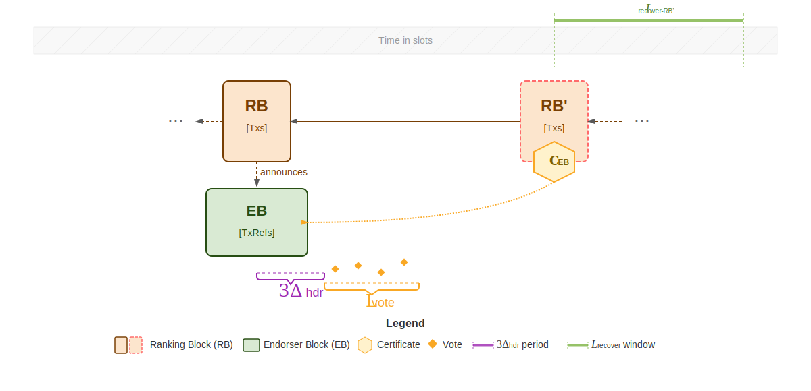

## Abstract

The anticipated growth of the Cardano ecosystem necessitates a fundamental
enhancement of network throughput to accommodate increasing transaction volumes
and support complex decentralized applications.

We propose Ouroboros Leios, a consensus protocol designed for high-throughput
operation while preserving Ouroboros Praos security properties. Block producers
simultaneously create both a standard Praos block and a larger secondary block
containing additional transactions. Secondary blocks undergo committee
validation before ledger inclusion, enabling significantly higher throughput.

This specification presents the first version of the Ouroboros Leios protocol
family, designed to deliver substantial throughput improvements with economic
sustainability and reduced complexity through fewer new protocol elements.

> [!NOTE]
>
> For comprehensive research documentation, development history, and additional
> technical resources, visit the Leios Innovation R&D site at
> [leios.cardano-scaling.org][leios-website].

<details>
  <summary><h2>Table of contents</h2></summary>

- [Abstract](#abstract)
- [Motivation](#motivation)
- [Specification](#specification)
  - [Protocol Flow](#protocol-flow)
    - [Step 1: Block Production](#step-1-block-production)
    - [Step 2: EB Distribution](#step-2-eb-distribution)
    - [Step 3: Committee Validation](#step-3-committee-validation)
    - [Step 4: Certification](#step-4-certification)
    - [Step 5: Chain Inclusion](#step-5-chain-inclusion)
    - [Rolling Window Rules](#rolling-window-rules)
  - [Protocol Component Details](#protocol-component-details)
    - [Ranking Blocks (RBs)](#ranking-blocks-rbs)
    - [Endorser Blocks (EBs)](#endorser-blocks-ebs)
    - [Votes and Certificates](#votes-and-certificates)
  - [Network Characteristics and Protocol Parameters](#network-characteristics-and-protocol-parameters)
  - [Node Behavior](#node-behavior)
    - [Transaction Diffusion](#transaction-diffusion)
    - [RB Block Production and Diffusion](#rb-block-production-and-diffusion)
    - [EB Diffusion](#eb-diffusion)
    - [Voting & Certification](#voting-certification)
    - [Next Block Production](#next-block-production)
    - [Ledger Management](#ledger-management)
    - [Epoch Boundary](#epoch-boundary)
  - [Network](#network)
    - [Praos Mini-Protocols](#praos-mini-protocols)
    - [Leios Mini-Protocols](#leios-mini-protocols)
  - [Incentives](#incentives)
- [Rationale](#rationale)
  - [How Leios addresses CPS-18](#how-leios-addresses-cps-18)
  - [Evidence](#evidence)
  - [Trade-offs & Limitations](#trade-offs-limitations)
  - [Roadmap & Next Steps](#roadmap-next-steps)
- [Path to active](#path-to-active)
- [Versioning](#versioning)
- [References](#references)
- [Appendix](#appendix)
- [Copyright](#copyright)

</details>

<details>
  <summary><h2>Table of figures and tables</h2></summary>

### Figures

- [Figure 1: Forecast of rewards on Cardano mainnet](#figure-1)
- [Figure 2: SPO profitability under Praos, as a function of transaction volume](#figure-2)
- [Figure 3: Ouroboros Leios rolling window mechanism](#figure-3)
- [Figure 4: Leios Protocol Flow](#figure-4)
- [Figure 5: Detailed protocol flow showing rolling windows and transaction execution tracking](#figure-5)
- [Figure 6: Up- and downstream interactions of a node (simplified)](#figure-6)
- [Figure 7: Time for transaction to reach the ledger](#figure-7)
- [Figure 8: Transactions reaching the ledger](#figure-8)
- [Figure 9: Number of TX references](#figure-9)
- [Figure 10: Disposition of transactions in blocks](#figure-10)
- [Figure 11: Size of transactions referenced by EBs](#figure-11)
- [Figure 12: Arrival delays for transactions, ranking blocks, votes, and endorser blocks](#figure-12)
- [Figure 13: Mean nodal ingress (left) and Mean CPU load among all nodes (right)](#figure-13)
- [Figure 14: Mean CPU load among all nodes](#figure-14)
- [Figure 15: Fate of Plutus-heavy transactions in Leios](#figure-15)
- [Figure 16: CPU usage in Plutus-heavy workloads for Leios](#figure-16)
- [Figure 17: SPO profitability under Leios](#figure-17)

### Tables

- [Table 1: Network Characteristics](#table-1)
- [Table 2: Protocol Characteristics](#table-2)
- [Table 3: Leios Protocol Parameters](#table-3)
- [Table 4: Performance Metrics](#table-4)
- [Table 5: Leios effficiency at different throughputs](#table-5)
- [Table 6: Feasible Protocol Parameters](#table-6)
- [Table 7: Operating Costs by Transaction Throughput](#table-7)
- [Table 8: Required TPS for Infrastructure Cost Coverage](#table-8)
- [Table 9: Required TPS for Current Reward Maintenance](#table-9)
- [Table 10: Leios Mini-Protocols](#table-10)

</details>

## Motivation

Cardano's current throughput generally satisfies the immediate needs of its
users. However, the Ouroboros Praos consensus protocol imposes inherent
scalability limitations. To ensure timely and reliable global propagation of new
blocks, the protocol requires that blocks be distributed across the network
within a short time frame. This requirement forces a careful balance,
restricting both the maximum size of individual blocks and the computational
resources available for validating transactions and Plutus scripts. As a result,
there is a fixed ceiling on the network's transaction throughput that cannot be
raised by adjusting protocol parameters alone.

However, the dynamic growth of the Cardano ecosystem is increasingly revealing
the practical consequences of these inherent limitations. The Cardano mainnet
periodically experiences periods of significant congestion, where the volume of
transactions awaiting processing surpasses the network's ability to include them
in a timely manner. This congestion can lead to a tangible degradation in the
user experience, manifesting as delays in transaction confirmation. Moreover, it
poses substantial obstacles for specific use cases that rely on the efficient
processing of large volumes of transactions, such as the distribution of tokens
via airdrops, or the rapid and consistent updating of data by decentralized
oracles or partner chains.

The semi-sequential nature of block propagation in Ouroboros Praos, where blocks
are relayed from one block producer to the next across potentially
geographically distant nodes, is a key factor contributing to these limitations.
The necessity of completing this global dissemination within the few-second
period places a fundamental constraint on the rate at which new blocks, and
consequently the transactions they contain, can be added to the blockchain. This
architectural characteristic stands in contrast to the largely untapped
potential of the network's underlying infrastructure, where the computational
and bandwidth resources of individual nodes often remain significantly
underutilized.

To transcend these inherent scaling barriers and unlock the latent capacity of
the Cardano network, a fundamental evolution of the core consensus algorithm is
imperative. Ouroboros Leios represents a departure from the sequential
processing model of Praos, aiming to introduce mechanisms for parallel
transaction processing and more efficient aggregation of transaction data. By
reorganizing how transactions are proposed, validated, and ultimately recorded
on the blockchain, this protocol upgrade seeks to achieve a substantial increase
in the network's overall throughput, enabling it to handle a significantly
greater volume of transactions within a given timeframe.

The Cardano Problem Statement [CPS-18 Greater Transaction Throughput][cps-18]
further motivates the need for higher transaction throughput and marshals
quantitative evidence of existing mainnet bottlenecks. Realizing higher
transaction rates is also necessary for long-term Cardano techno-economic
viability as rewards contributions from the Reserve pot diminish: fees from more
transactions will be needed to make up that deficit and keep sound the finances
of stakepool operations.

A major protocol upgrade like Leios will take significant time to implement,
test, and audit. It is therefore critical to have begun implementation well
before transaction demand on mainnet exceeds the capabilities of Ouroboros
Praos. The plot below shows the historically diminishing rewards and a forecast
of their continued reduction: the forecast is mildly uncertain because the
future pattern of staking behavior, transaction fees, and node efficiency might
vary considerably.

<div align="center">
<a name="figure-1" id="figure-1"></a>
<p>
  
</p>

<em>Figure 1: Forecast of rewards on Cardano mainnet</em>

</div>

Ouroboros Praos cannot support the high transaction volume needed to generate
the fees that will eventually be needed to offset the diminishing rewards.
However, as sustained throughput of transactions grows beyond 50 transactions
per second, there is more opportunity for simultaneously reducing fees,
augmenting the Treasury, and increasing SPO and delegator rewards.

<div align="center">
<a name="figure-2" id="figure-2"></a>
<p>
  
</p>

<em>Figure 2: SPO profitability under Praos, as a function of transaction
volume</em>

</div>

The Leios protocol specified in this document represents a balance between
immediate scalability needs and long-term protocol evolution. The approach
prioritizes practical deployment and ecosystem compatibility while establishing
the foundation for subsequent protocol versions with higher throughput capacity.

## Specification

Leios extends Ouroboros Praos by introducing
[**Endorser Blocks (EBs)**](#endorser-blocks-ebs) - secondary blocks containing
additional transactions that undergo committee validation before inclusion in
the permanent ledger.

<div align="center">
  <a name="figure-3" id="figure-3"></a>
  <p name="rolling-window-figure">
    
  </p>

<em>Figure 3: Ouroboros Leios rolling window mechanism</em>

</div>

The protocol's behavior is governed by a **rolling window mechanism** that
tracks certificate inclusion timing. When a committee successfully certifies an
EB and the certificate is included in an RB, this triggers a rolling window of
$L_\text{recover}$ slots during which the network can process additional
transactions at higher throughput. The protocol continuously evaluates this
timing to determine validation requirements:

- **Beyond the window** (no certificate within past $L_\text{recover}$ slots):
  Standard Praos validation applies - every transaction must be fully validated
  before block inclusion
- **Within the window** (certificate included within past $L_\text{recover}$
  slots): Enhanced throughput enabled through relaxed validation requirements,
  with correction mechanisms ensuring ledger integrity

This design preserves Ouroboros Praos security properties while automatically
delivering higher throughput when network conditions support successful EB
certification.

### Protocol Flow

<div align="center">
  <a name="figure-4" id="figure-4"></a>
  <p name="protocol-flow-figure">
    
  </p>

<em>Figure 4: Leios Protocol Flow</em>

</div>

The protocol operates through a five-step process that introduces new block
types and validation mechanisms to achieve enhanced throughput.

#### Step 1: Block Production

When a stake pool wins block leadership, it **simultaneously** may create two
components:

1. **[Ranking Block (RB)](#ranking-blocks-rbs)** A standard Praos block with
   extended header fields to optionally certify one previously announced EB and
   optionally announce one EB for the next subsequent RB to certify.
1. **[Endorser Block (EB)](#endorser-blocks-ebs)** A larger block containing
   additional transaction references.

The RB chain continues to be distributed exactly as in Praos, while Leios
introduces a separate header distribution mechanism for rapid EB discovery and
equivocation detection.

<a id="equivocation"></a>

> [!Note]
>
> **Equivocation** refers to the malicious act of creating multiple conflicting
> blocks for the same block generation opportunity.

Due to the voting overhead per EB, EBs should only be announced if the base RB
is full or when sufficient transaction content justifies the voting costs, as
detailed in the [adaptive EB production](#adaptive-eb-production) incentive
mechanism. Empty EBs should not be announced in the network as they induce a
non-zero cost. EBs may also be announced when RB resource constraints (size or
Plutus limits) are reached, even at lower transaction volumes.

#### Step 2: EB Distribution

Nodes receiving the RB header via the
[RbHeaderRelay mini-protocol](#rbheaderrelay-mini-protocol) discover the
announced EB, via its referencing by the RB header, and fetch its content. The
EB contains references to transactions. If a node does not already possess a
transaction referenced in the EB, it explicitly requests that transaction from
peers.

#### Step 3: Committee Validation

A voting committee of stake pools validates the EB. As depicted in Figure 4,
votes are collected during the $L_\text{vote}$ period following the EB
announcement, with voting beginning $3\Delta_\text{hdr}$ slots after the EB
creation to ensure sufficient time for <a href="#equivocation">equivocation
detection</a>. Committee members are
[selected via sortition](#committee-structure) based on the slot number of the
RB that announced the EB. A committee member votes for an EB only if:

1. The RB header arrived within $\Delta_\text{hdr}$,
2. It has **not** received an equivocating RB header for this EB within
   $3\Delta_\text{hdr}$,
3. It has received the EB within $L_\text{vote}$ slots from its creation,
4. The EB is the one announced by the latest RB in the voter's current chain,
5. The EB's transactions form a **valid** extension of the RB that announced it,
6. For non-persistent voters, it is eligible to vote based on sortition using
   the announcing RB's slot number as the election identifier.

where $L_\text{vote}$ and $\Delta_\text{hdr}$ are
<a href="#protocol-parameters">protocol parameters</a> represented by a number
of slots.

#### Step 4: Certification

If enough committee votes are collected such that the total stake exceeds a
**threshold** parameter ($\tau$), for example 60%, the EB becomes **certified**:

$$
\sum_{v \in \text{votes}} \text{stake}(v) \geq \tau \times \text{stake}_{\text{total-active}}
$$

When this threshold is met, the EB becomes **certified**. A ranking block (RB)
producer can then construct a compact **certificate** proving the EB's validity
by aggregating the collected votes.

#### Step 5: Chain Inclusion

The certificate for an EB shall be included in the body of a new ranking block
`RB'` only if all of the following conditions hold:

1. `RB'` directly extends the RB which announced this EB (as illustrated in
   Figure 4 where `RB'` contains the certificate for the EB announced by the
   preceding RB).
2. The certificate is valid as defined in
   [Certificate Validation](#certificate-validation).

This **conditional inclusion** ensures transaction availability to honest nodes
with high probability while achieving higher throughput. When included:

- The certified EB's transactions become part of the permanent ledger
- Throughput increases significantly for that segment of the chain
- If timing is insufficient, only the standard RB is included (maintaining Praos
  baseline)

#### Rolling Window Rules

The rolling window mechanism operates through two key behaviors that
automatically manage throughput based on certificate inclusion timing:

**Window Reset**: Each certificate inclusion immediately resets the
$L_\text{recover}$ countdown, extending the enhanced throughput period. As shown
in Figure 5 below, when RB<sub>3</sub> includes a certificate, it starts a new
window ($L_\text{recover-RB3}$). Later, RB<sub>5</sub> resets this timer again,
creating overlapping windows that maintain continuous high throughput.

**Window Expiration**: Only when $L_\text{recover}$ consecutive slots pass
without any certificate does the protocol revert to standard validation. This
recovery period ensures all nodes synchronize any delayed EBs before validation
resumes. In Figure 5, this occurs after the $L_\text{recover-RB5}$ window
expires.

<div align="center">
<a name="figure-5" id="figure-5"></a>
<p name="mode-transitions-figure">
  
</p>

<em>Figure 5: Detailed protocol flow showing rolling windows and transaction
execution tracking</em>

</div>

<a id="transaction-validation" href="#transaction-validation"></a>**Transaction
Validation**

The rolling window mechanism enables different validation approaches that
balance throughput with safety:

**Standard Validation** (beyond window): Block producers have complete ledger
state and must validate all transactions before inclusion, maintaining current
Ouroboros Praos guarantees.

**Enhanced Throughput** (within window): Block producers are permitted to create
RBs before receiving all previously certified EBs due to network delays. Since
they cannot determine complete ledger state, Leios allows temporary inclusion of
<a name="unvalidated-transactions"></a>**unvalidated transactions** -
transactions whose validity cannot be immediately confirmed.

This resolves the timing dilemma that would otherwise force block producers to
either violate Praos constraints (by waiting) or include potentially invalid
transactions without tracking. As shown in Figure 5, RBs produced during
certificate-active periods (RB<sub>3</sub> to RB<sub>7</sub> inclusive, marked
with red dashed borders) are permitted to contain such transactions.

**Correction Mechanisms**: To maintain ledger integrity for light nodes when
unvalidated transactions are included, the protocol implements transaction
execution tracking through `tx_execution_bitmap` fields.

> [!Note]
>
> **Design Rationale**
>
> The introduction of invalid transactions in RBs makes it hard for **light
> nodes** to tell whether a transaction was executed or not. Correction bitmaps
> on EBs let light nodes know which transactions were executed, while voting
> ensures this information is correct. However, due to low participation, EBs
> may not be certified for some time. As a further step, if a sufficiently long
> amount of time has passed without an EB being generated ($L_\text{recover}$
> window), corrections are forced to the RB level. This creates tension with
> security, as a node that does not have the required information will have to
> wait before validating a new block.

These corrections are specifically designed for light nodes, as full nodes can
verify whether transactions were executed when they catch up to the current
ledger state. The corrections follow two simple rules:

**1. <a id="correction-rule-1"></a>During enhanced throughput**: When EBs are
certified within the rolling window, each certified EB includes corrections for
RB transactions that occurred after the previous certificate was included
(exclusive). Since validators can only certify EBs when they have sufficient
ledger state, they correct transactions from the known baseline forward (see
EB<sub>4</sub> in Figure 5).

**2. <a id="correction-rule-2"></a>When returning to standard validation**: The
first RB after window expiration includes corrections for all remaining
unvalidated transactions from the certificate-active period (see RB<sub>8</sub>
in Figure 5, which corrects transactions from RB<sub>5</sub> to RB<sub>7</sub>
inclusive).

Figure 5 also shows the timing constraints that enable these mechanisms:

- <a id="l-vote" href="#l-vote"></a>**$L_\text{vote}$ periods** (timing brackets
  under each EB): Define the voting window for committee members
- <a id="l-recover" href="#l-recover"></a>**$L_\text{recover}$ windows** (thin
  green bars): The rolling countdown periods that determine validation
  requirements

Parameter constraints are detailed in the
[Protocol Parameters](#protocol-parameters) section.

> [!NOTE]
>
> **Edge Case: Delayed EB Synchronization**
>
> When a node reaches the end of a certificate-active window (i.e.,
> $L_\text{recover}$ slots have passed since the last certificate) but has not
> yet received all certified EBs, it **must** wait to synchronize before
> producing new blocks or adopting longer chains. Without the complete ledger
> state from all certified EBs, the node cannot identify which transactions from
> the certificate-active period were invalid and thus cannot create the
> necessary corrections in its next block. The protocol parameter
> $L_\text{recover}$ is designed to prevent this scenario.

### Protocol Component Details

The protocol extends Praos with three main elements:

#### Ranking Blocks (RBs)

RBs are Praos blocks extended to support Leios by optionally announcing EBs in
their headers and embedding EB certificates and execution bitmaps in their
bodies.

1. **Header additions**:
   - `announced_eb` (optional): Hash of the EB created by this block producer
   - `certified_eb` (optional): Hash of the EB being certified by this RB

2. **Body additions**:
   - `eb_certificate` (optional): aggregated certificate proving EB availability
     & validity
   - `tx_execution_bitmap` (optional): bitmap tracking transaction execution
     status

<a id="rb-inclusion-rules" href="#rb-inclusion-rules"></a>**Inclusion Rules**:
When an RB header includes a `certified_eb` field, the corresponding body must
include a matching `eb_certificate`. Conversely, an `eb_certificate` shall only
be included when a `certified_eb` field references the EB being certified.

<a id="rb-corrections" href="#rb-corrections"></a>**RB Corrections**: Following
<a href="#correction-rule-2">**Rule 2**</a>, when the first RB is generated more
than $L$<sub>recover</sub> slots after the latest EB certificate, the
`tx_execution_bitmap` field must indicate the execution status of transactions
in RBs produced after that EB certificate was included, up to but not including
this correcting RB. This ensures the ledger state is fully determined before
standard validation resumes.

<a id="bitmap-size-constraint" href="#bitmap-size-constraint"></a>**Bitmap Size
Constraint**: The transaction execution bitmap size $S_\text{bitmap}$ (see
[Protocol Parameters](#protocol-parameters)) must fit within $S_\text{RB}$
alongside other required data. This is ensured by bounding $L_\text{recover}$
implicitly via $S_\text{bitmap} < S_\text{RB}$ (see
[Bitmap Size Relationships](#bitmap-size-relationships)).

<a id="cost-proportionality" href="#cost-proportionality"></a>**Cost
Proportionality**: The first block, after the certificate-active window expires
pays a cost proportional to the **uncorrected** transactions - i.e., RB
transactions produced after the last EB certificate was included (exclusive). EB
corrections already included during the certificate-active period reduce this
cost; only the remaining transactions require an RB-side bitmap.

Transactions from certified EBs are included in the ledger before transactions
directly included in the RB to preserve correctness.

#### Endorser Blocks (EBs)

EBs are produced by the same stake pool that created the corresponding
announcing RB and reference additional transactions to increase throughput
beyond what is permitted to be included directly in the RB.

<a id="eb-structure" href="#eb-structure"></a>**EB Structure**: EBs have a
simplified structure without header/body separation:

- `transaction_references`: List of transaction references (transaction ids)
- `tx_execution_bitmap`: Bitmap tracking execution status of transactions from
  previous RBs

<a id="eb-corrections" href="#eb-corrections"></a>**EB Corrections**: Following
<a href="#correction-rule-1">**Rule 1**</a>, when the block producer creates an
EB certificate within $L_\text{recover}$ slots of the latest certificate, they
determine the execution status of transactions in RBs that occurred after the
previous certificate was included (exclusive). The `tx_execution_bitmap` field
tracks this information, ensuring ledger state consistency during
certificate-active periods while reducing the correction burden for the RB that
will include all remaining corrections following $L_\text{recover}$ expiration.

> [!NOTE]
>
> **Light Node Optimization**: As a future optimization, transaction execution
> bitmaps could also be included in EB certificates to allow light nodes to
> determine transaction execution status without downloading full EBs. This
> optimization is solely for the benefit of light nodes, as full nodes can check
> whether transactions were executed when they catch up.

When an EB is announced in an RB header via the `announced_eb` field, a voting
period begins as described in [Votes and Certificates](#votes-and-certificates).
Only RBs that directly extend the announcing RB are eligible to certify the
announced EB by including a certificate.

The hash referenced in RB headers (`announced_eb` and `certified_eb` fields) is
computed from the complete EB structure and serves as the unique identifier for
the EB.

#### Votes and Certificates

Leios employs a voting and certificate scheme where committee members cast votes
that reference specific EBs, which are then aggregated into compact certificates
for inclusion in RBs. This specification uses BLS signatures as the
implementation example, though the protocol is designed to accommodate any
efficient aggregate signature scheme that Cardano may adopt.

The implementation meets the <a href="#appendix-a-requirements">requirements for
votes and certificates</a> specified in Appendix A. Alternative schemes
satisfying these requirements could be substituted, enabling unified voting
infrastructure across Ouroboros Leios, Ouroboros Peras, and other protocols.

To participate in the Leios protocol as voting member/ block producing node,
stake pool operators must register one additional cryptographic key for the
voting scheme alongside their existing VRF and KES keys. In the BLS
implementation described here, this would be a BLS12-381 key.

<a id="committee-structure" href="#committee-structure"></a>**Committee
Structure**: Two types of voters validate EBs, balancing security,
decentralization, and efficiency:

- **Persistent Voters**: Selected once per epoch using [Fait Accompli
  sortition][fait-accompli-sortition], vote in every election, identified by
  compact identifiers
- **Non-persistent Voters**: Selected per EB via local sortition with
  Poisson-distributed stake-weighted probability

This dual approach prevents linear certificate size growth by leveraging
non-uniform stake distribution, enabling faster certificate diffusion while
maintaining broad participation. With efficient aggregate signature schemes like
BLS, certificate sizes remain compact (under 10 kB) even with large committees,
as shown in the [BLS certificates specification][bls-spec].

<a id="vote-structure" href="#vote-structure"></a>**Vote Structure**: All votes
include the `endorser_block_hash` field that uniquely identifies the target EB:

- **Persistent votes**:
  - `election_id`: Identifier for the voting round (derived from the slot number
    of the RB that announced the target EB)
  - `persistent_voter_id`: Epoch-specific pool identifier
  - `endorser_block_hash`: Hash of the target EB
  - `vote_signature`: Cryptographic signature (BLS in this implementation)
- **Non-persistent votes**:
  - `election_id`: Identifier for the voting round (derived from the slot number
    of the RB that announced the target EB)
  - `pool_id`: Pool identifier
  - `eligibility_signature`: Cryptographic proof of sortition eligibility (BLS
    in this implementation)
  - `endorser_block_hash`: Hash of the target EB
  - `vote_signature`: Cryptographic signature (BLS in this implementation)

<a id="certificate-validation" href="#certificate-validation"></a>**Certificate
Validation**: When an RB includes an EB certificate, nodes must validate the
following before accepting the block:

1. **CDDL Format Compliance**: Certificate structure matches the specification
   format defined in <a href="#votes-certificates-cddl">Appendix B: Votes and
   Certificates CDDL</a>
2. **Cryptographic Signatures**: All cryptographic signatures are valid (BLS
   signatures in this implementation)

3. **Voter Eligibility**:
   - Persistent voters must have been selected as such by the [Fait Accompli
     scheme][fait-accompli-sortition] for the current epoch
   - Non-persistent voters must provide valid sortition proofs based on the
     `election_id`
   - **Vote Eligibility Determination**: For non-persistent voters, sortition
     eligibility is determined using the `election_id` derived from the slot
     number of the RB that announced the target EB. This ensures that vote
     eligibility is verifiable and deterministic - all nodes can agree on which
     stake pools are eligible to vote for a specific EB based solely on the EB's
     announcing RB slot, preventing multiple voting opportunities across
     different slots for the same EB. This requirement stems from the BLS
     sortition mechanism which uses the election identifier as input to the VRF
     calculation for non-persistent voter selection.
4. **Stake Verification**: Total voting stake meets the required quorum
   threshold
5. **EB Consistency**: Certificate references the correct EB hash announced in
   the preceding RB

Detailed specifications, performance, and benchmarks are available in the [BLS
certificates specification][bls-spec].

> [!NOTE]
>
> **Vote Bundling**
>
> The linked BLS specification mentions vote bundling as an optimization.
> However, this only applies when EB production is decoupled from RBs, which is
> not the case in this specification where each EB is announced by an RB.

### Network Characteristics and Protocol Parameters

The following sections distinguish between observed **network characteristics**
(which depend on topology and node capabilities), **protocol characteristics**
(determined by architectural design decisions), and tunable **protocol
parameters** (which can be adjusted via governance).

<a id="network-characteristics" href="#network-characteristics"></a>**Network
Characteristics**

These are observed properties of the network topology and node capabilities:

<div align="center">
<a name="table-1" id="table-1"></a>

| Characteristic    |       Symbol       | Units | Description                                                                                                                                    |      Typical Range      | Notes                                                                     |
| ----------------- | :----------------: | :---: | ---------------------------------------------------------------------------------------------------------------------------------------------- | :---------------------: | ------------------------------------------------------------------------- |
| RB diffusion time | $\Delta_\text{RB}$ | slot  | Observed upper bound for RB diffusion and adoption to all nodes                                                                                |        2-6 slots        | Depends on network topology and conditions                                |
| EB diffusion time | $\Delta_\text{EB}$ | slot  | Observed upper bound for EB diffusion, transaction retrieval, and ledger state building at all nodes when no competing or fresher blocks exist | $\geq \Delta_\text{RB}$ | Slower than RBs due to larger size and additional processing requirements |

<em>Table 1: Network Characteristics</em>

</div>

<a id="protocol-characteristics" href="#protocol-characteristics"></a>**Protocol
Characteristics**

These characteristics are determined by fundamental protocol design decisions
and cannot be changed through governance:

<div align="center">
<a name="table-2" id="table-2"></a>

| Characteristic           |     Symbol     | Units | Description                     |      Value      | Notes                                                      |
| ------------------------ | :------------: | :---: | ------------------------------- | :-------------: | ---------------------------------------------------------- |
| Minimum transaction size | $T_\text{min}$ | bytes | Lower bound on transaction size | $\geq 55$ bytes | Anchored to observed 55-byte transaction [^mainnet-min-tx] |

<em>Table 2: Protocol Characteristics</em>

</div>

<a id="protocol-parameters" href="#protocol-parameters"></a>**Protocol
Parameters**

These parameters are configurable and subject to governance decisions,
constrained by the network characteristics and protocol characteristics above:

<div align="center">
<a name="table-3" id="table-3"></a>

| Parameter                                                         |       Symbol        |    Units     | Description                                                                                            |                                           Constraints                                           | Rationale                                                                                                                                                                                                                                                                                                                                                             |
| ----------------------------------------------------------------- | :-----------------: | :----------: | ------------------------------------------------------------------------------------------------------ | :---------------------------------------------------------------------------------------------: | --------------------------------------------------------------------------------------------------------------------------------------------------------------------------------------------------------------------------------------------------------------------------------------------------------------------------------------------------------------------- |
| <a id="delta-hdr" href="#delta-hdr"></a>RB header diffusion bound | $\Delta_\text{hdr}$ |     slot     | Maximum allowed time for RB headers to propagate around the network from the slot they were created in |                            $\Delta_\text{hdr} \leq \Delta_\text{RB}$                            | Required for equivocation detection; an RB header must propagate around the network in at most $\Delta_\text{hdr}$ slots from the slot it was created in. RbHeaderRelay mini-protocol must achieve this bound. Usually faster than full RB diffusion due to smaller header size                                                                                       |
| Voting period length                                              |   $L_\text{vote}$   |     slot     | Duration during which committee members can vote on endorser blocks                                    |                              $L_\text{vote} > 3\Delta_\text{hdr}$                               | Must allow EB diffusion and equivocation detection before voting begins. The upper bound ensures EBs are released in time relative to their generation slots, guaranteeing timely delivery of certified EBs. <br /><br />**Liveness**: Must provide sufficient time for honest EBs to diffuse and be processed by most of the network before fresher RBs are produced |
| Recovery period length                                            | $L_\text{recover}$  |     slot     | Duration of rolling window that tracks time since last certificate                                     |                              $L_\text{recover} > \Delta_\text{EB}$                              | Must ensure all nodes receive certified EBs before window expires. Implicitly constrained by bitmap size requirement (see $S_\text{bitmap}$ row)                                                                                                                                                                                                                      |
| Ranking block max size                                            |    $S_\text{RB}$    |    bytes     | Maximum size of a ranking block                                                                        |                                        $S_\text{RB} > 0$                                        | Limits RB size to ensure timely diffusion                                                                                                                                                                                                                                                                                                                             |
| Endorser-block referenceable transaction size                     |  $S_\text{EB-tx}$   |    bytes     | Maximum total size of transactions that can be referenced by an endorser block                         |                                      $S_\text{EB-tx} > 0$                                       | Limits total transaction payload to ensure timely diffusion within stage length                                                                                                                                                                                                                                                                                       |
| Endorser block max size                                           |    $S_\text{EB}$    |    bytes     | Maximum size of an endorser block itself                                                               |                                        $S_\text{EB} > 0$                                        | Limits EB size to ensure timely diffusion; prevents issues with many small transactions                                                                                                                                                                                                                                                                               |
| Praos active slot coefficient                                     |    $f_\text{RB}$    |    1/slot    | Probability that a party will be the slot leader for a particular slot                                 |                          $0 < f_\text{RB} \leq \Delta_\text{RB}^{-1}$                           | Blocks must not be produced faster than network delay                                                                                                                                                                                                                                                                                                                 |
| Mean committee size                                               |         $n$         |   parties    | Average number of stake pools selected for voting                                                      |                                             $n > 0$                                             | Ensures sufficient decentralization and security                                                                                                                                                                                                                                                                                                                      |
| Quorum size                                                       |       $\tau$        |   fraction   | Minimum fraction of committee votes required for certification                                         |                                          $\tau > 0.5$                                           | Prevents adversarial control while ensuring liveness                                                                                                                                                                                                                                                                                                                  |
| Maximum correction bitmap size                                    |  $S_\text{bitmap}$  |    bytes     | Maximum size of transaction execution bitmap for corrections                                           | $S_\text{bitmap} = \lceil L_\text{recover} \times S_\text{RB} / (8 \times T_\text{min}) \rceil$ | Calculated based on worst-case scenario with one RB per slot containing minimum-sized transactions during recovery period. Protocol must ensure all corrections are included before standard validation resumes to maintain ledger integrity                                                                                                                          |
| Maximum Plutus steps per endorser block                           |          -          |  step units  | Maximum computational steps allowed for Plutus scripts in a single endorser block                      |                                              $> 0$                                              | Limits computational resources per EB to ensure timely validation                                                                                                                                                                                                                                                                                                     |
| Maximum Plutus memory per endorser block                          |          -          | memory units | Maximum memory allowed for Plutus scripts in a single endorser block                                   |                                              $> 0$                                              | Limits memory resources per EB to ensure timely validation                                                                                                                                                                                                                                                                                                            |
| Maximum Plutus steps per transaction                              |          -          |  step units  | Maximum computational steps allowed for Plutus scripts in a single transaction                         |                                              $> 0$                                              | Limits computational resources per transaction to enable higher throughput                                                                                                                                                                                                                                                                                            |
| Maximum Plutus memory per transaction                             |          -          | memory units | Maximum memory allowed for Plutus scripts in a single transaction                                      |                                              $> 0$                                              | Limits memory resources per transaction to enable higher throughput                                                                                                                                                                                                                                                                                                   |

<em>Table 3: Leios Protocol Parameters</em>

</div>

> [!NOTE]
>
> **EB Size Constraints**
>
> Two separate parameters control EB sizes:
>
> - $S_\text{EB}$ limits the size of the EB data structure itself, preventing
>   issues when many small transactions create large numbers of transaction
>   references (32 bytes each)
> - $S_\text{EB-tx}$ limits the total size of transactions that can be
>   referenced, controlling the actual transaction payload
>
> For example, an EB referencing 10,000 transactions of 100 bytes each would
> have $S_\text{EB-tx} = 1$ MB but the EB itself would be at least 320 KB for
> the transaction hashes alone.

<a id="bitmap-size-relationships"></a>

> [!NOTE]
>
> **Bitmap Size Relationships**
>
> The maximum correction bitmap size parameter $S_\text{bitmap}$ creates a
> fundamental relationship between recovery period length and transaction
> throughput:
>
> - Longer recovery periods ($L_\text{recover}$) require larger bitmaps to track
>   more potential transactions
> - The worst-case scenario assumes one ranking block per slot during the
>   recovery period (i.e. $f_\text{RB} = 1$)
> - Smaller minimum transaction sizes ($T_\text{min}$) allow more transactions
>   per block, requiring more correction bits
>
> **Implicit Constraint on $L_\text{recover}$**:
>
> The requirement that $S_\text{bitmap} < S_\text{RB}$ creates an upper bound on
> the recovery period:
>
> $$L_\text{recover} < 8 \times T_\text{min}$$
>
> For example, with $T_\text{min} = 55$ bytes[^mainnet-min-tx], this gives
> $L_\text{recover} < 440$ slots. This constraint ensures the bitmap can fit
> within a ranking block even in the worst-case scenario of continuous block
> production.
>
> The critical requirement is that all transaction corrections **must** be
> included before the certificate-active window expires to ensure ledger
> integrity. In extreme cases, the first block after window expiration may need
> to dedicate most of its space to corrections, temporarily sacrificing
> transaction throughput for safety.

[^mainnet-min-tx]:
    Observed 55-byte transaction on mainnet:
    https://cardanoscan.io/transaction/d2a2098fabb73ace002e2cf7bf7131a56723cd0745b1ef1a4f9e29fd27c0eb68?tab=summary

### Node Behavior

The Leios protocol introduces new node responsibilities and message flows beyond
those in Praos, reflecting the additional steps of EB creation and announcement,
committee voting, and certificate aggregation. The following sections detail the
specific behaviors that nodes must implement.

<div align="center">
<a name="figure-6" id="figure-6"></a>
<p>
  
</p>

<em>Figure 6: Up- and downstream interactions of a node (simplified)</em>

</div>

The diagram above illustrates the Leios protocol in a simplified sequential
order. In practice, these operations occur concurrently and the actual execution
order depends on network conditions, timing, and node state. While many steps
introduce new behaviors, several core Praos mechanisms remain unchanged.

#### Transaction Diffusion

<a id="transaction-propagation" href="#transaction-propagation"></a>**Transaction
Propagation**: Uses the TxSubmission mini-protocol exactly as implemented in
Praos. Transactions flow from downstream to upstream nodes through diffusion,
where they are validated against the current ledger state before being added to
local mempools. The protocol maintains the same FIFO ordering and duplicate
detection mechanisms.

<a id="mempool-design" href="#mempool-design"></a>**Mempool Design**: The
mempool follows the same design as current Praos deployment with increased
capacity to support both RB and EB production. Mempool capacity should
accommodate expanded transaction volume:

<div align="center">

$\text{Mempool} \geq 2 \times (S_\text{RB} + S_\text{EB-tx})$

</div>
    
#### RB Block Production and Diffusion
    
When a stake pool wins block leadership (step 1), they create a Ranking Block (RB) and **optionally** an Endorser Block (EB) based on the [adaptive EB production](#adaptive-eb-production) criteria. The RB is a standard Praos block with extended header fields to reference one EB and announce another EB when created. The optional EB is a larger block containing references to additional transactions. The RB chain continues to be distributed exactly as in Praos, while Leios introduces a separate mechanism to distribute the same headers for rapid EB discovery and <a href="#equivocation">equivocation detection</a>.

<a id="rb-header-diffusion" href="#rb-header-diffusion"></a>**RB Header
Diffusion**: RB headers diffuse via a new
[RbHeaderRelay mini-protocol](#rbheaderrelay-mini-protocol) independently of
standard ChainSync (steps 2a and 2b). This separate mechanism enables rapid EB
discovery within the strict timing bound $\Delta_\text{hdr}$. Headers are
diffused freshest-first to facilitate timely EB delivery, with nodes propagating
at most two headers per (slot, issuer) pair to detect
<a href="#equivocation">equivocation</a> - where an attacker creates multiple
EBs for the same block generation opportunity - while limiting network overhead.
The header contains the EB hash when the block producer created an EB, allowing
peers to discover the corresponding EB.

<a id="rb-body-diffusion" href="#rb-body-diffusion"></a>**RB Body Diffusion**:
After receiving headers, nodes fetch RB bodies via standard BlockFetch protocol
(step 3). This employs ChainSync and BlockFetch protocols without modification
for fetching complete ranking blocks after headers are received. The pipelining
and batching optimizations for block body transfer remain unchanged from Praos.

<a id="rb-validation-adoption" href="#rb-validation-adoption"></a>**Validation
and Adoption**: Nodes validate the RB and any included EB certificate before
adopting the block (step 4). This includes cryptographic verification of
certificates and ensuring they correspond to properly announced EBs. The
complete validation procedure is detailed in
[certificate validation](#certificate-validation). The node serves RBs to
downstream peers using standard Praos block distribution mechanisms (step 5),
which are permitted to include diffusion pipelining with delayed validation.

#### EB Diffusion

Whenever an EB is announced through an RB header, nodes must fetch the EB
content promptly (step 6), such that they receive it within $L_\text{vote}$ and
consequently enables them to vote. EBs are fetched freshest-first to ensure
timely delivery within the voting window. Only the EB body corresponding to the
first EB announcement/RB header received for a given RB creation opportunity
shall be downloaded. The EB contains references to transactions.

<a id="eb-chain-selection" href="#eb-chain-selection"></a>**EB Propagation for
Chain Selection**: To support efficient chain selection, nodes must receive
**all EBs from competing forks**, not only those in their current preferred
chain. This ensures that when a node switches to a different fork due to the
longest-chain rule, it can immediately validate the new chain without additional
EB propagation delays. EBs are forwarded before complete validity checks, with
only lightweight verification (hash consistency, basic structure validation)
performed initially to prevent DoS attacks.

<a id="transaction-retrieval" href="#transaction-retrieval"></a>**Transaction
Retrieval**: Nodes check transaction availability for the EB and fetch any
missing transactions from peers (steps 6a and 7a). After receiving the EB body,
nodes perform fast validation (step 6b) with only lightweight verification (hash
consistency, basic structure validation) to prevent DoS attacks before
proceeding with transaction retrieval. Once all transactions are available,
nodes can serve EBs to downstream peers (step 7). This guarantees that when a
node announces an EB its downstream peers can trust it has all EB transactions
available.

<a id="eb-transaction-validation" href="#eb-transaction-validation"></a>**Transaction
Validation**: With all transactions available, nodes validate the endorsed
transaction sequence against the appropriate ledger state (step 8), ensuring the
transactions form a valid extension of the announcing RB and meet size
constraints.

#### Voting & Certification

<a id="VotingEB" href="#VotingEB"></a>**Voting Process**: Committee members
[selected through a lottery process](#votes-and-certificates) vote on EBs as
soon as vote requirements are met according to protocol (step 9). An honest node
casts only one vote for the EB extending its current longest chain.

<a id="VoteDiffusion" href="#VoteDiffusion"></a>**Vote Propagation**: Votes
propagate through the network during the vote diffusion period ($L_\text{diff}$
slots) (steps 10 and 10a). While nodes forward votes on EBs across all candidate
chains, they only forward at most one vote per committee member per slot.

Nodes maintain and relay votes for a bounded duration to limit resource usage.
Since freshest-first delivery ensures that newer votes are prioritized over
older ones, the exact bound is not critical for protocol correctness. A
conservative bound of a few minutes is sufficient to handle network delays while
allowing nodes to discard votes that are no longer relevant.

<a id="CertificateAggregation" href="#CertificateAggregation"></a>**Certificate
Construction**: All nodes receive votes from upstream peers, maintaining a
running tally for each EB to track progress toward the quorum threshold (step
11). However, only RB producers create certificates when they are about to
produce a new ranking block. Stakepool nodes know the leadership schedule, so
they know when they are eligible to construct a certificate for an upcoming RB
they will produce. When enough votes are collected during the vote diffusion
period, the RB producer aggregates them into a compact certificate. This
certificate is embedded directly in the RB body and serves as cryptographic
proof that the EB has received sufficient committee approval.

#### Next Block Production

<a id="certificate-inclusion" href="#certificate-inclusion"></a>**Certificate
Inclusion**: Block producers creating new RBs include certificates for EBs where
the full stage duration ($L_\text{vote}$ slots) has elapsed since the EB's
creation (step 12). The producer is permitted to also announce a new EB
extending their RB. Including a certificate resets the $L_\text{recover}$
rolling window, either extending an existing enhanced throughput period or
starting a new one (as detailed in
[Rolling Window Rules](#rolling-window-rules)).

#### Ledger Management

<a id="ledger-formation" href="#ledger-formation"></a>**Ledger Formation**: The
ledger follows the same design as Praos with the addition of certificate
handling and EB attachment references. The ledger state is updated according to
the same validation rules used in Praos, with phase-1 and phase-2 validation
applying equally to both RB and EB transactions.

<a id="ledger-state-transitions" href="#ledger-state-transitions"></a>**State
Transitions**: EBs add transactions to the ledger only when properly certified
and included via RB references. RBs can include both certificates and their own
transactions. The ledger state for validating RB transactions is constructed
based on either the predecessor RB (when no EB certificate is included) or the
certified EB (when a valid certificate is present). Note that EB transactions
are validated against the ledger state from the RB that announced the EB (i.e.,
the predecessor RB of the certifying RB), ensuring the predecessor RB's
transactions are relevant in both validation scenarios.

<a id="chain-selection" href="#chain-selection"></a>**Chain Selection**: Chain
selection follows the densest chain rule as in Ouroboros Genesis. EBs are
treated as auxiliary data that do not affect chain validity or selection
decisions. Fork choice depends solely on RB chain density, with EB certificates
serving only as inclusion proofs for transaction content. The
[EB propagation for chain selection](#eb-chain-selection) requirement ensures
that nodes already possess all necessary EBs from alternative forks, eliminating
additional propagation delays during fork switches.

<a id="mempool-capacity" href="#mempool-capacity"></a>**Mempool Capacity
Requirements**: The mempool must accommodate both RB and EB transaction
production. The capacity requirements are significantly increased compared to
Praos to handle the additional transaction volume expected from EB production.

#### Epoch Boundary

<a id="persistent-voter-computation" href="#persistent-voter-computation"></a>**Persistent
Voter Computation**: Nodes must compute the set of persistent voters for each
epoch using the [Fait Accompli scheme][fait-accompli-sortition]. This
computation uses the stake distribution that becomes available at the epoch
boundary and represents a minimal computational overhead based on current
[BLS certificates benchmarks](https://github.com/input-output-hk/ouroboros-leios/blob/main/crypto-benchmarks.rs/Specification.md#benchmarks-in-rust).
Nodes should complete this computation well before voting begins in the new
epoch to ensure seamless participation.

### Network

As outlined above, Leios splits transactions between RBs and EBs, with EB
inclusion dependent on committee voting and certification. **Transactions in
RBs**: EB certificate generation requires an absolute stake majority. Given that
this may not always be the case, if transactions were only included in EBs, the
protocol would risk **losing liveness** due to no EB certificate being
generated. As a remedy, RBs are allowed to directly contain transactions,
ensuring basic liveness even when EB certification fails.

Unlike Ouroboros Praos where the RB chain contains all necessary data, Leios
nodes require additional message types to:

- **Reconstruct ledger state**: EBs containing certified transactions
- **Participate in consensus**: Vote on EBs and construct certificates
- **Detect equivocation**: RB headers from competing forks

#### Praos Mini-Protocols

As described in [Node Behavior](#node-behavior), existing Praos mini-protocols
continue to operate with only minor modifications to support Leios. ChainSync
exchanges RB headers that now include optional fields for EB announcements
(`announced_eb`) and certifications (`certified_eb`). BlockFetch retrieves RB
bodies that may contain BLS aggregate certificates (`eb_certificate`) alongside
standard transactions. TxSubmission remains unchanged except for expanded
mempool capacity to support both RB and EB transaction pools.

#### Leios Mini-Protocols

Leios introduces **five new mini-protocols** to handle the additional message
types required for EB distribution, voting, and certificate construction.

<div align="center">
<a name="table-10" id="table-10"></a>

|   **Protocol**    | **Purpose**                                        | **Timing Constraint**                      |
| :---------------: | -------------------------------------------------- | ------------------------------------------ |
| **RbHeaderRelay** | Diffuse RB headers for equivocation detection      | Must achieve $\Delta_\text{hdr}$ diffusion |
|    **EbRelay**    | Diffuse fresh EBs to enable timely validation      | Must reach voters within $L_\text{vote}$   |
|   **VoteRelay**   | Diffuse valid votes for certificate aggregation    | Must diffuse within $L_\text{diff}$        |
|    **EbFetch**    | Retrieve certified EBs for chain reconstruction    | On-demand after certificate inclusion      |
|    **TxFetch**    | Retrieve referenced transactions for EB validation | Before EB validation completes             |

<em>Table 10: Leios Mini-Protocols</em>

</div>

These protocols implement freshest-first delivery and cryptographic validation
to meet their respective timing constraints while preventing spam and DoS
attacks.

### Incentives

<a id="incentive-structure" href="#incentive-structure"></a>The Leios incentive
structure builds upon the existing Ouroboros Praos reward mechanism while
introducing new considerations for EB production, voting participation, and
dual-block production scenarios. The design aims to maintain economic security
while optimizing for throughput efficiency.

**Reward Function Evolution**

<a id="current-reward-function" href="#current-reward-function"></a>The current
Praos reward function tracks the number of RBs created by each SPO compared to
their expected production, using this performance metric () to determine
rewards proportional to stake. This mechanism detects offline behavior and
incentivizes consistent participation without directly measuring transaction
inclusion - empty blocks count equally toward the performance factor.

<a id="performance-based-rewards" href="#performance-based-rewards"></a>**Performance-Based
Rewards**: Leios extends this approach by refining the performance calculation
to account for block validity in enhanced throughput scenarios. When operating
within the rolling window (certificate-active periods), RBs containing invalid
transactions due to incomplete ledger state knowledge should not negatively
impact the producer's performance factor.

**Invalid Transaction Disincentives**: The protocol implements specific
mechanisms to disincentivize RB producers from including invalid transactions
while protecting honest participants.

> [!Note]
>
> **Design Rationale**
>
> EBs are at least an order of magnitude larger than Praos blocks/RBs, making it
> more common that an EB is served late to some parties. By naively waiting for
> the EB before processing the relevant RB (and related chain), a **new source
> of delays** would be introduced that may affect the security of Praos (as it
> increases  for the relevant delivery assumption). By allowing invalid
> transactions in RBs, this threat is mitigated by enabling adoption of chains
> without having the relevant EBs.

Rather than counting all RBs toward the performance factor  (the fraction of
all blocks within an epoch that a stake pool created), the enhanced reward
calculation counts only RBs containing exclusively valid transactions. This
modification ensures that:

1. **Honest party protection**: SPOs operating with incomplete ledger state can
   always produce valid empty RBs, maintaining their performance factor even
   when lacking complete EB synchronization
2. **Invalid transaction penalty**: RBs containing any invalid transactions are
   excluded from the  calculation, directly reducing the producer's reward
   proportional to their stake
3. **Maintained incentive structure**: The existing reward mechanism remains
   intact while adding precision to performance measurement

For detailed information about the current reward formula, see the
[Cardano documentation on pledging and rewards](https://docs.cardano.org/about-cardano/learn/pledging-rewards).

<a id="voting-participation-rewards" href="#voting-participation-rewards"></a>**Voting
Participation Rewards**: A second extension incorporates committee votes in
certified EBs into reward calculations. Since votes occur more frequently than
RB production, this significantly reduces reward variance for participating
SPOs.

**Vote Counting Mechanism**: The reward calculation counts valid votes cast by
SPOs on certified EBs as part of their performance assessment. This provides a
more granular and frequent measure of participation compared to RB production
alone. However, similar anti-gaming principles apply:

1. **Strategic vote exclusion risks**: While malicious parties might attempt to
   ignore votes from non-preferred parties to manipulate chain selection, such
   behavior carries significant costs
2. **Publication delay consequences**: Excluding valid votes may delay the
   release of the malicious party's own RBs, reducing their probability of main
   chain inclusion
3. **Natural counter-incentives**: The economic cost of delayed block
   publication provides a built-in mechanism against vote manipulation

This voting reward mechanism maintains the same principle as RB rewards - honest
participation is rewarded while strategic manipulation carries inherent economic
penalties.

**Alternative Approaches and Limitations**

**Online State Detection**: An alternative approach to performance measurement
would involve detecting whether a party is online and maintaining current ledger
state. However, this presents significant implementation challenges:

1. **Ambiguous indicators**: SPOs can fill RBs and EBs with transactions while
   operating with outdated UTxO state, particularly when consuming their own
   known-valid UTxOs
2. **False positives**: Transaction inclusion alone cannot reliably indicate
   current state synchronization, as parties may strategically avoid
   double-spend conflicts without full state knowledge
3. **Implementation complexity**: Direct state synchronization measurement would
   require additional protocol mechanisms and verification overhead

The current approach of excluding blocks with invalid transactions provides a
more implementable and verifiable mechanism while achieving the same fundamental
goal of incentivizing proper participation.

**Fee Structure Considerations**

<a id="single-vs-dual-pricing" href="#single-vs-dual-pricing"></a>**Single vs.
Dual Pricing**: The protocol maintains a unified fee structure for transactions
regardless of inclusion method (RB versus EB). While separate pricing could
theoretically reduce off-chain bribing incentives (since RB inclusion offers
superior service guarantees), the implementation complexity and ecosystem
disruption costs outweigh the benefits. The existing single-price model already
experiences potential bribing pressures for mempool queue jumping, and Leios
does not fundamentally alter this dynamic.

<a id="service-quality-differentiation" href="#service-quality-differentiation"></a>**Service
Quality Differentiation**: The inherent service difference between RB and EB
inclusion (immediate vs. certificate-dependent confirmation) creates natural
economic incentives without requiring protocol-level price differentiation.
Applications requiring immediate confirmation can adjust their fee strategies
accordingly within the existing framework.

**Operational Cost Optimization**

<a id="adaptive-eb-production" href="#adaptive-eb-production"></a>**Adaptive EB
Production**: To address concerns about operational costs during low-traffic
periods, the protocol implements adaptive EB announcement based on transaction
availability and resource constraints. SPOs should announce EBs when **either**
condition is met:

1. **Capacity utilization**: EB contains sufficient transactions (for example,
   10% capacity utilization) to justify voting overhead costs
2. **Resource constraints**: RB is considered "full" due to **either** size or
   computational limits being reached:
   - **Size constraint**: RB approaches $S_\text{RB}$ byte limit
   - **Plutus constraint**: Remaining RB Plutus budget cannot accommodate
     transactions in mempool that would fit in EB Plutus budget

This ensures transactions requiring higher Plutus execution limits can be
included in EBs without waiting for byte-based RB saturation. When traffic
levels can be adequately served by RBs alone within both size and computational
constraints, no EBs are announced, reducing operational costs to Praos levels.

<a id="cost-scaling-mechanism" href="#cost-scaling-mechanism"></a>This adaptive
mechanism ensures the protocol's cost structure scales with actual throughput
demand rather than imposing fixed overhead regardless of network utilization.

<a id="hardware-upgrade-incentives" href="#hardware-upgrade-incentives"></a>**Hardware
Upgrade Incentives**: The increased computational and bandwidth requirements for
Leios operation are offset by higher potential rewards from increased
transaction throughput. As demonstrated in the
[operating costs analysis](#operating-costs), SPO profitability improves
significantly once sustained throughput exceeds 30-50 TPS, providing clear
economic incentives for infrastructure upgrades.

**Reserve Contribution Adjustments**

<a id="reserve-contribution-adjustments" href="#reserve-contribution-adjustments"></a>During
low-traffic periods when EB production is minimal, the protocol maintains
current Reserve contribution patterns without artificial inflation. The adaptive
production mechanism ensures that enhanced infrastructure costs are only
incurred when corresponding revenue opportunities exist through increased
transaction processing.

## Rationale

Ouroboros Leios introduces a committee-based voting layer over Nakamoto-style
consensus to handle transaction surplus beyond current Praos block limits,
enabling substantial throughput increases while preserving existing security
properties.

### How Leios addresses CPS-18

The [Leios research paper][leios-paper] describes a highly concurrent protocol
with three block types - Input Blocks (IBs), Endorser Blocks (EBs), and Ranking
Blocks (RBs)-produced independently across decoupled, pipelined stages. This
specification simplifies that design by eliminating IBs and coupling EB
production with RB production, reducing complexity while preserving substantial
throughput gains.

This simplification avoids the complexity and ecosystem disruption of
implementing massive throughput increases immediately, while still delivering
substantial gains to address [CPS-18 Greater Transaction Throughput][cps-18]
challenges. Four strategic design priorities guided this approach:

1. [Economic sustainability](#economic-sustainability)
2. [Reasonable time to market](#time-to-market)
3. [Minimal downstream impact](#downstream-impact)
4. [Competitive positioning](#competitiveness)

<a name="economic-sustainability"></a>**1. Economic sustainability: Capacity
without utilization risk**

On one hand, this approach avoids over-engineering massive throughput capacity
without proven demand. Creating fundamental system changes to support multiple
orders of magnitude more throughput adds to the cost of running a more
expensive, more capable system that does not pay for itself until utilization
increases.

On the other hand, the minimum economic requirement establishes the lower bound.
As the Cardano Reserve diminishes, transaction fees must replace rewards to
maintain network security and SPO profitability. Currently, the Reserve
contributes more than 85% of epoch rewards, with less than 15% coming from
transaction fees. By 2029, to compensate for Reserve depletion, the network
requires approximately 36-50 TPS with average-sized transactions - roughly 10
times current mainnet throughput. This conservative lower bound represents the
breakeven point for running the protocol sustainably.

However, TPS is not an appropriate metric for defining these bounds. To properly
assess economic breakeven points, we measure throughput in Transaction Bytes per
second (TxB/s) rather than Transactions per second (TPS). TPS does not account
for transaction size or computational complexity, making systems with smaller
transactions appear "faster" while providing less utility. Current Cardano
mainnet provides 4,500 TxB/s, while this specification targets 140,000-300,000
TxB/s (equivalent to roughly 100-200 TPS) - a 30-65x increase sufficient for
economic sustainability.

Achieving this capacity increase requires trade-offs, as detailed below.

<a name="time-to-market"></a>**2. Reasonable time to market: Complexity
trade-offs**

The linearization approach avoids complex distributed systems problems around
transaction sharding and sophisticated mempool coordination that could delay
deployment by years. Critically, this linearization approach also simplifies
conflict resolution compared to highly concurrent variants. In the proposed
protocol, invalid transactions typically arise only in circumstances where most
honest stake immediately recognizes them as invalid and can treat them as such
without ambiguity. In contrast, highly concurrent variants like Input
Block-based protocols or more generally protocol with additional decoupled block
production create scenarios where honest nodes become helpless when conflicts
arise between valid transactions created simultaneously by honest participants,
requiring more sophisticated resolution mechanisms.

This simplified approach enables deterministic conflict resolution through
transaction execution bitmaps and rolling window corrections, avoiding complex
distributed coordination problems that could delay deployment significantly. The
protocol also maintains familiar transaction semantics, deterministic ordering,
and predictable finality patterns that existing dApps and infrastructure depend
on today.

<a name="downstream-impact"></a>**3. Minimal downstream impact: Ecosystem
preservation**

Beyond preserving transaction behavior, the design minimizes infrastructure and
operational disruption for the existing ecosystem. The proposed protocol still
functions as an overlay extending Praos - like the research paper version,
allowing SPOs to upgrade progressively without coordinated migrations.

The most obvious approach to increasing throughput while minimizing disruption
would be increasing Praos block sizes. However, this naive alternative would
create proportionally longer propagation times that violate Praos timing
assumptions and lack sufficient scalability for long-term viability.
Additionally, Praos blocks larger than approximately 3 MB would pose security
risks by increasing the frequency of short forks that adversaries could exploit
to compromise the common prefix property and enable attacks such as
double-spending.

<a name="competitiveness"></a>**4. Competitive positioning**

The coupled block production design can be extended towards higher concurrency
models, as demonstrated in simulation results. It maintains compatibility with
more aggressive scaling approaches including full Leios variants, EB and IB
(input block) decoupling, and sharding extensions, ensuring current throughput
gains do not preclude 100x+ improvements when chain growth solutions mature.

<a name="optimal-tradeoffs"></a>**Conclusion**

This linearization proposal balances all four priorities. A delivered 30-65x
improvement provides substantially more value than the research paper's
higher-concurrency variants, which would impose costs on existing dApps,
wallets, and infrastructure while taking significantly longer to build.

The following evidence section shall provide quantitative support for these
trade-offs and validate the protocol's performance under realistic network
conditions.

### Evidence

This section provides protocol simulation results, feasible protocol parameters
with justifications, node-level simulation results, and operating cost analysis
that support the design decisions outlined in the rationale.

<a name="performance-metrics"></a>**Performance metrics**

The performance of a protocol like Leios can be characterized in terms of its
efficient use of resources, its total use of resources, the probabilities of
negative outcomes due to the protocol's design, and the resilience to adverse
conditions. Metrics measuring such performance depend upon the selection of
protocol parameters, the network topology, and the submission of transactions.
The table below summarizes key metrics for evaluating Leios as a protocol and
individual scenarios (parameters, network, and load). Estimates for many of
these appear in the following section on Simulation Results. Additionally,
future implementations of Leios can be assessed in these terms.

<div align="center">
<a name="table-4" id="table-4"></a>

| Category   | Metric                                             | Measurement                                                                                           |
| ---------- | -------------------------------------------------- | ----------------------------------------------------------------------------------------------------- |
| Efficiency | Spatial efficiency, $\epsilon_\text{spatial}$      | Ratio of total transactions size to persistent storage                                                |
|            | Temporal efficiency, $\epsilon_\text{temporal}(s)$ | Time to include transaction on ledger                                                                 |
|            | Network efficiency, $\epsilon_\text{network}$      | Ratio of total transaction size to node-averaged network usage                                        |
| Protocol   | TX inclusion, $\tau_\text{inclusion}$              | Mean number of slots for a transaction being included in any EB                                       |
|            | Voting failure, $p_\text{noquorum}$                | Probability of sortition failure to elect sufficient voters for a quorum                              |
| Resource   | Network egress, $q_\text{egress}$                  | Rate of bytes transmitted by a node                                                                   |
|            | Disk usage, $q_\text{disk}$                        | Rate of persistent bytes stored by a node                                                             |
|            | I/O operations, $\bar{q}_\text{iops}(b)$           | Mean number of I/O operations per second, where each operation writes a filesystem block of $b$ bytes |
|            | Mean CPU usage, $\bar{q}_\text{vcpu}$              | Mean virtual CPU cores used by a node                                                                 |
|            | Peak CPU usage, $\hat{q}_\text{vcpu}$              | Maximum virtual CPU cores used by a node over a one-slot window                                       |
| Resilience | Adversarial stake, $\eta_\text{adversary}(s)$      | Fractional loss in throughput due to adversial stake of $s$                                           |

<em>Table 4: Performance Metrics</em>

</div>

**_Spatial efficiency:_** Leios necessarily imposes some disk overhead beyond
the raw bytes needed to store transactions themselves. This overhead includes
the EBs and RBs associated with storing transactions. The spatial efficiency
metric is defined as the ratio of the total bytes of transactions included in
the ledger to the total persistent storage required by the protocol.

$$
\epsilon_\text{spatial} = \frac{\text{total bytes of transactions included in the ledger}}{\text{total bytes of EBs and RBs}}
$$

**_Temporal efficiency:_** As is true for Praos, there is a delay between
submitting a transaction and its being included in the ledger and there is a
finite chance that it never is included in the ledger. Before a transaction is
eligible to be included in a new IB, it must be validated and placed in the
memory pool. It is cleanest to measure the time from the transaction reaching
the local memory pool of the node where it was submitted to the time when it is
included in the ledger, via a Praos block. The same metric applies both to Praos
and to Leios. In aggregate, we measure the temporal efficiency as the fraction
of transactions that reach the ledger, as function of the number of slots
elapsed. The quantity $\epsilon_\text{temporal}(\infty)$ is the fraction of
submitted transactions that ever reach the ledger.

$$
\epsilon_\text{temporal}(s) = \text{fraction of transactions included in the ledger within } s \text{ slots of their inclusion in a local memory pool}
$$

**_Network efficiency:_** Effective utilization of the network can be
characterized by the ratio of bytes of transactions reaching the ledger to the
average network traffic per node. (This could also be computed individually for
each node and used as a local metric.)

$$
\epsilon_\text{network} = \frac{(\text{bytes of valid transactions reaching the ledger}) \cdot (\text{number of nodes in the network})}{\text{total bytes of network traffic}}
$$

**_TX inclusion:_** In Leios, it is possible that a transaction might have to
wait for multiple EB production opportunities before being included in an EB.
The characteristic time for such inclusion in an EB depends on the EB production
rate and mempool management. This is correlated with how long the transaction
waits in the memory pool before being selected for inclusion.

$$
\tau_\text{inclusion} = \text{mean number of slots for a transaction to be included in any EB}
$$

**_Voting failure:_** An unlucky set of VRF evaluations might result in
insufficient voters being selected in a given pipeline, thus making it
impossible to certify an EB in that pipeline.

$$
p_\text{noquorum} = \text{probability of sufficient voters to achieve a quorum in a given pipeline}
$$

**_Network egress:_** Cloud service providers typically charge for network
egress rather than for network ingress. The quantity $q_\text{egress}$ is the
number of bytes sent from a node per unit time.

**_Disk usage:_** Leios requires that EBs and RBs be stored permanently; votes
need not be stored permanently, however. The quantity $q_\text{disk}$ is the
total number of EB and RB bytes generated per unit time.

**_I/O operations:_** Some cloud service providers limit or bill input/output
operations on a per-second capacity basis. The number of I/O operations depends
upon the filesystem's block size $b$, not on the logical number of writes to
disk by the protocol: e.g., writing an EB of 32,768 bytes might consist of 64
I/O operations on a filesystem having a 512-byte block size. We assume that disk
caching and delayed writes smooth out the unevenness in I/O operations, so that
the mean $\bar{q}_\text{iops}$ is the best metric here.

**_Mean CPU usage:_** Computation resources consumed by the number are
quantified as $\bar{q}_\text{vcpu}$, which is the mean number of virtual CPU
cores utilized by the protocol.

**_Peak CPU usage:_** Because CPU usage varies depending upon the node's
activity, the maximum number of virtual CPU cores utilized by the protocol
during any slot, $\hat{q}_\text{vcpu}$, provides a useful indication of
computational burstiness and of how a virtual machine should be sized for Leios.

**_Adversarial stake:_** Similarly, when adversarial stake is appreciable and
active, the throughput of Leios might be drop.

$$
\eta_\text{adversary}(s) = \frac{\text{bytes of transactions reaching the ledger without adversarial activity}}{\text{bytes of transactions reaching the ledger with adversarial activity given fraction } s \text{ of the total stake}}
$$

<a name="simulation-results"></a>**Simulation results**

The [Leios paper][leios-paper] provides a rigorous theoretical analysis of the
safety and throughput of the protocol. That has been reinforced and demonstrated
by prototype simulations written in Haskell and Rust.

> [!IMPORTANT]
>
> TODO: **@bwbush**
>
> - [ ] Regenerate the plots below each time the version of `sim-cli` is bumped.
> - [x] Discuss only displaying three or four cases, instead of the five.
> - [ ] In next set of re-runs . . .
>   - [ ] In the CPU plot, expand the abbrevations into phrases.
>   - [x] In the EB-size plot, remove empty EBs (created at the start or end of
>         the simulation).
> - [x] Review and possibly elaborate the figure and table captions.
> - [ ] In the final version . . .
>   - [ ] Remove title and subtitle.

The simulation results use a mainnet-like topology[^mnrm] that accurately
reflects the characteristics of the Cardano mainnet. This includes a realistic
distribution of stake and a representative number of stake pools. The network is
designed with a total of 10,000 nodes (`pseudo-mainnet`)[^pseudo] or 750 nodes
(`mini-mainnet`)[^mini], where each block producer is connected exclusively to
two dedicated relays. Furthermore, the topology incorporates realistic latencies
based on the RIPE Atlas[^ripe] ping dataset and bandwidth that aligns with the
lower end of what is typically found in cloud data centers. The node
connectivity and geographic distribution (across various countries and
autonomous systems) are also consistent with measurements provided by the
Cardano Foundation.[^cf] A simulation study [^mncp] has demonstrated that
analysis conclusions deriving from the `mini-mainnet` topology are also valid
for the `pseudo-mainnet` topology; the advantage of using the former is that
simulations run much more quickly. Simulated RB diffusion is consistent with the
Praos performance model.[^praosp]

[^mnrm]:
    [Mainnet-like topologies for Leios](https://github.com/input-output-hk/ouroboros-leios/blob/6d8619c53cc619a25b52eac184e7f1ff3c31b597/data/simulation/pseudo-mainnet/ReadMe.md)

[^pseudo]:
    [Leios pseudo-mainnet topology](https://github.com/input-output-hk/ouroboros-leios/blob/6d8619c53cc619a25b52eac184e7f1ff3c31b597/data/simulation/pseudo-mainnet/topology-v1.md)

[^mini]:
    [Leios mini-mainnet topology](https://github.com/input-output-hk/ouroboros-leios/blob/6d8619c53cc619a25b52eac184e7f1ff3c31b597/data/simulation/pseudo-mainnet/topology-v2.md)

[^ripe]: [RIPE Atlas](https://atlas.ripe.net/)

[^cf]: [Cardano Foundation](https://cardanofoundation.org/)

[^mncp]:
    https://github.com/input-output-hk/ouroboros-leios/blob/6d8619c53cc619a25b52eac184e7f1ff3c31b597/analysis/sims/2025w30b/analysis.ipynb

[^praosp]:
    https://github.com/IntersectMBO/cardano-formal-specifications/blob/6d4e5cfc224a24972162e39a6017c273cea45321/src/performance/README.md

The simulation results in the remainder of this section use the Rust simulator
with a set of protocol parameters suitable for running Linear Leios at 200 kB/s
of transactions, which corresponds to approximately 150 tx/s of transactions of
sizes typical on the Cardano mainnet. The maximum size of transactions
referenced by an EB is 12 MB and the stage length is
$L_\text{diff} = L_\text{vote} = 7 \text{ slots}$. In order to illustrate the
minimal infrastructure resources used by Leios at these throughputs, we have
limited nodes to 4 virtual CPUs each and limited inter-node bandwidth to 10
Mb/s. We vary the throughput to illustrate the protocol's behavior in light vs
congested transaction loads, and inject transaction from the 60th through 960th
slots of the simulation; the simulation continues until the 1500th slot, so that
the effects of clearing the memory pool are apparent. The table below summarizes
the results of the simulation experiment. We see that a transaction at the front
of the memory pool can become referenced by an EB in as few as 20 seconds when
the system is lightly or moderately loaded and that it can reach certification
on the ledger in about one minute. These times can double under congested
conditions. In all cases there is little overhead, relative to the total bytes
of transactions, in data that must be stored permanently as the ledger history.

<div align="center">
<a name="table-5" id="table-5"></a>

| Throughput [TxMB/s] | TPS at 1500 B/tx | Conditions      | Mempool to EB [s] | Mempool to ledger [s] | Space efficiency [%] |
| ------------------: | ---------------: | --------------- | ----------------: | --------------------: | -------------------: |
|               0.100 |             66.7 | light load      |              19.3 |                  60.8 |                92.22 |
|               0.150 |            100.0 | moderate load   |              20.8 |                  63.8 |                94.08 |
|               0.200 |            142.9 | heavy load      |              28.9 |                  71.7 |                94.79 |
|               0.250 |            166.7 | some congestion |              42.1 |                  84.3 |                94.92 |
|               0.300 |            200.0 | much congestion |              83.5 |                 125.8 |                95.09 |

<em>Table 5: Leios effficiency at different throughputs</em>

</div>

The first plot below demonstrates that most transactions reach the ledger in
under two minutes in these simulations when the system is not congested. This
transaction lifecycle time lengthens as congestion increases. The plot colors
transactions by the minute when they were submitted so that one can see that the
distribution of delays is independent of the submission time in the uncongested
cases, but that there are "lucky" or "unlucky" periods in the congested cases.
The variability arises from the randomness of the RB production scheduled.
First, a transaction may has to wait for an RB to be forged; second, a
transaction referenced by an EB has to wait for the following RB to be forged.
The EB is discarded, however, if the second RB is produced in fewer that
$L_\text{diff} + L_\text{vote}$ after the first RB. Thus, both the time to the
next RB and the RB following that introduce unpredictability in a transaction
reaching the ledger under even lightly loaded conditions. When the sortition
happens to produce RBs too close together, transactions will accumulate in the
memory pool, awaiting favorable sortition conditions. If too many accumulate,
there is not room for all of them to be included in the next EB. The second plot
below illustrates that all transactions eventually do arrive on the ledger, but
that they may have to wait long during congestion. During light load a
transaction takes one or two minutes to reach the ledger, but in heavier load it
might take three minutes or even longer. The capacity parameter $S_\text{EB-tx}$
(12 MB/EB in these simulations) fundamentally limits the amortized maximum
throughput of Linear Leios: furthermore, it affects how long it takes
transactions to reach the ledger as the throughput approaches the capacity.

<div align="center">
<a name="figure-7" id="figure-7"></a>


<em>Figure 7: Time for transaction to reach the ledger</em>

</div>

<div align="center">
<a name="figure-8" id="figure-8"></a>


<em>Figure 8: Transactions reaching the ledger</em>

</div>

The effect of EBs being discarded when RBs are too close together is evidenced
in the following plot. A transaction referenced only once by an EB is one that
reaches the ledger on the first attempt. If a transaction is referenced more
than one EB, it means that several attempts were made to before a relevant EB's
certificate was included in an RB. The subsequent plot shows Leios's irregular
rhythm of forging, sometimes discarding, and certifying EB. (Note that RBs are
so small relative to most EBs that they are difficult to see in the histogram.)
The diagram also provides a sense of the intermittency of successful
certification and the presence of periods of unfavorable sortition where RBs are
not produced or are produced too close together. The same phenomenon occurs in
Praos, but Linear Leios amplifies the intermittency.

<div align="center">
<a name="figure-9" id="figure-9"></a>


<em>Figure 9: Number of TX references</em>

</div>

<div align="center">
<a name="figure-9" id="figure-9"></a>


<em>Figure 10: Disposition of transactions in blocks</em>

</div>

When demand is not high relative to capacity, the total size of transactions
referenced by an EB varies randomly and rarely reaches the maximum size of 12
MB/EB: see the following figure. One can see that at higher demands, fully
utilized blocks predominate. The presence of those full blocks means that other
transactions are waiting in the memory pool for referencing by a subsequent EB.
Thus the capacity parameter provides a natural form of backpressure that limits
the potential EB-related work a node must do when demand is high.

<div align="center">
<a name="figure-11" id="figure-11"></a>


<em>Figure 11: Size of transactions referenced by EBs</em>

</div>

Because of the aforementioned backpressure, diffusion occurs in Leios in an
orderly manner even when demand is high. The following set of plots show
histograms of diffusion time (i.e., the time from a transaction's, RB's, EB's,
or vote's creation to its reaching the nodes in the network). Transactions and
votes typically diffuse rapidly throughout the whole network in fractions of a
second, due to their small sizes, often small enough to fit in a single TCP
transmission unit. RBs diffuse in less one second, with the empty RBs at the
start and end of the simulation diffusing fastest. Similarly, EBs diffuse fast
when empty or when demand is low, but once full EBs are diffusing, it can take
up to two seconds for them to diffuse. All of the distribution have long tails
where messages arrive much later for nodes with unfavorably topological
locations. The Leios protocol possesses the important property that traffic in
transactions, RBs, votes, and EBs do not interfere with one another: for
example, delays in EBs and high throughput do not also delay RBs in those cases.

<div align="center">
<a name="figure-12" id="figure-12"></a>

|                                                 |                                                 |
| ----------------------------------------------- | ----------------------------------------------- |
|  |  |
|  |  |

<em>Figure 12: Arrival delays for transactions, ranking blocks, votes, and
endorser blocks</em>

</div>

<a name="resource-requirements"></a>**Resource requirements**

The resource requirements for operating Leios nodes have been estimated from
benchmarking and simulation studies. The assumed values for various Leios
operations come either from measurements of the cryptography
prototype[^leioscrypto], from the IOG benchmarking cluster for the Cardano node,
or analysis of the Cardano mainnet ledger using the `db-analyser` tool. These
were input to the Haskell and Rust simulators for Leios to make holistic
estimates of resource usage of operating nodes.

In terms of resource usage, the throughputs in these simulations do no stress
the four virtual CPUs of each node or saturate the 10 Mb/s available bandwidth
between nodes. The figures below show that bandwidth usage does not exceed 4
Mb/s and that most of that is consumed by diffusion of transactions among the
nodes. Furthermore, vCPU usage stays below 200% (i.e., the equivalent of two
vCPUs operating fully), though it is very bursty because of the uneven workload
of cryptographic and ledger operations. The last figure quantifies how
transaction and EB body validation dominate CPU usage. Averaged over time, CPU
usage is low: there may be opportunities in the implementation of the Leios node
for lazy computations, caching, etc. that will spread out the occasional spikes
in CPU usage over time.

<div align="center">
<a name="figure-13" id="figure-13"></a>

|                                                        |                                                                  |
| ------------------------------------------------------ | ---------------------------------------------------------------- |
|  |  |

<em>Figure 13: Mean nodal ingress (left) and Mean CPU load among all nodes
(right)</em>

</div>

<div align="center">
<a name="figure-14" id="figure-14"></a>


<em>Figure 14: Mean CPU load among all nodes</em>

</div>

Note that the transaction workload in the simulations above was modeled upon the
_average_ amount of Plutus computation typical of the Cardano mainnet. The low
time-averaged CPU usage in the simulations (i.e., less than 15% of a vCPU)
suggests that the per-transaction and/or per-block Plutus budget could be
significantly increased under Leios: either every transaction could have a
modestly higher budget, or some transactions could use an order of magnitude
more Plutus execution units. Statistical analysis of CPU usage in ledger
operations[^timings] using the `db-analyser` tool[^dbanalyser] on Cardano
mainnet from epoch 350 through 573 yields the following simple models of the CPU
cost of validating signatures and executing Plutus in the transactions of a
block. Because of the noisiness in the raw mainnet data, these estimates are
uncertain.

[^timings]:
    [Analysis of mainnet transaction validation times](https://github.com/input-output-hk/ouroboros-leios/blob/main/analysis/timings/ReadMe.ipynb)

[^dbanalyser]:
    [Cardano instantiation of the Consensus Layer: db-analyser](https://github.com/IntersectMBO/ouroboros-consensus/blob/main/ouroboros-consensus-cardano/README.md#db-analyser)

- CPU per transaction in a block: `428.4 s/tx`.
- CPU per byte of a block: `211.5 s/kB`.
- Linear models for signature verification and Plutus execution:
  - `(148.1 s/tx) * (number of transactions) + (114.1 s/kB) * (number of bytes)`.
  - `(137.5 s/tx) * (number of transactions) + (60.2 s/kB) * (number of bytes) + (585.2 s/Gstep) * (billions of Plutus execution steps)`,
    with a Lapace-distributed error having scale `1250 s`.

The Leios simulators use the value `0.4284 ms` as the validation time for each
transaction. A more nuanced model of CPU usage in the simulators would account
for Plutus execution. In order to estimate the effect of Plutus-heavy workloads,
one can vary that per-transaction time to higher values. Very approximately,
validation times of `1 ms/tx`, `10 ms/tx`, or `100 ms/tx` correspond to 2, 20,
or 200 billion Plutus steps per transaction, respectively. The following plot of
simulation results limit each node to 6 vCPU cores and suggest that the
`100 ms/tx` workload is untenable. The subsequent plot shows the 6 vCPUs
becoming saturated with Plutus execution, so much so that EBs fail to be
created. These results indicate that Leios's _block-level_ Plutus budget can
safely be 2000 billion steps, or 100 times the Plutus budget of Praos.

> [!IMPORTANT]
>
> TODO: **@bwbush**
>
> - [ ] Regenerate the plots below each time the version of `sim-cli` is bumped.
> - [ ] In next set of re-runs . . .
>   - [x] Use SVG format.
>   - [x] Align with the base case of the previous section.
>   - [x] In the transaction plot, switch to the minute-based ledged.
>   - [ ] In the CPU plot, expand the abbrevations into phrases.
> - [x] Review and possibly elaborate the figure and table captions.
> - [ ] In the final version . . .
>   - [ ] Remove title and subtitle.

<div align="center">
<a name="figure-15" id="figure-15"></a>


<em>Figure 15: Fate of Plutus-heavy transactions in Leios</em>

</div>

<div align="center">
<a name="figure-16" id="figure-16"></a>


<em>Figure 16: CPU usage in Plutus-heavy workloads for Leios</em>

</div>

In summary, Leios will require a modest increase of the recommended hardware
requirements[^spohw]: a four-core machine will be required, but a network
upgrade will not be needed, as 10 Mb/s is well below the bandwidth of standard
network connections. At throughput much higher than 200 kB/s, network egress can
become a significant cost for nodes hosted on some cloud-computing providers.
The Leios simulations do not model memory or disk. With the advent of
UTxO-HD[^utxohd], 16 GB of memory will remain be sufficient for Leios if the
`OnDisk` option is used for the UTxO set. Disk requirements depend upon the
growth of the ledger, but a sustained 0.150 MB/s throughput amounts to ledger
size increasing by 4.7 TB each year: see the section below on Operating Costs
for further discussion.

[^spohw]:
    [Minimum hardware requirements to run a stake pool](https://developers.cardano.org/docs/operate-a-stake-pool/hardware-requirements/)

[^utxohd]:
    [Cardano Node 10.5.1 release notes](https://github.com/IntersectMBO/cardano-node/releases/tag/10.5.1)

<a name="feasible-parameters"></a>**Feasible protocol parameters**

The table below documents a set of Leios protocol parameters that provided high
throughput and reasonably fast settlement in the prototype Haskell and Rust
simulations of Leios. The exact choice of parameters that would be adopted on
the Cardano mainnet must be subject to discussion and consideration of
tradeoffs.

<div align="center">
<a name="table-6" id="table-6"></a>

| Parameter                                     |       Symbol        |   Feasible value   | Justification                                                                                                                                                                               |
| --------------------------------------------- | :-----------------: | :----------------: | ------------------------------------------------------------------------------------------------------------------------------------------------------------------------------------------- |
| RB header diffusion bound                     | $\Delta_\text{hdr}$ |       1 slot       | Must be faster than full RB diffusion for equivocation detection; simulations show headers reach all nodes within 1 slot due to smaller size.                                               |
| Voting period length                          |   $L_\text{vote}$   |      7 slots       | Short stages increase settlement speed, but the stage length must be generously larger than the propagation time for EBs.                                                                   |
| Recovery period length                        | $L_\text{recover}$  |      ?? slots      | ???                                                                                                                                                                                         |
| Endorser-block referenceable transaction size |  $S_\text{EB-tx}$   |       12 MB        | Simulations indicate that 200 kB/s throughput is feasible at this block size.                                                                                                               |
| Endorser block max size                       |    $S_\text{EB}$    |       512 kB       | Endorser blocks must not be so large that they cannot diffuse and be validated within the voting period $L_\text{vote}$.                                                                    |
| Maximum Plutus steps per endorser block       |          -          |  2000G step units  | Simulations at high transaction-validation CPU usage.                                                                                                                                       |
| Maximum Plutus memory per endorser block      |          -          | 7000M memory units | Simulations at high transaction-validation CPU usage.                                                                                                                                       |
| Maximum Plutus steps per transaction          |          -          |  100G step units   | Raise per-transaction limit by a factor of twenty relative to Praos.                                                                                                                        |
| Maximum Plutus memory per transaction         |          -          | 350M memory units  | Raise per-transaction limit by a factor of twenty relative to Praos.                                                                                                                        |
| Ranking block max size                        |    $S_\text{RB}$    |    90,112 bytes    | This is the current value on the Cardano mainnet.                                                                                                                                           |
| Praos active slot coefficient                 |    $f_\text{RB}$    |     0.05 /slot     | This is the current value on the Cardano mainnet.                                                                                                                                           |
| Mean committee size                           |         $n$         |   600 stakepools   | Modeling of the proposed certificate scheme indicates that certificates reach their minimum size of ~8 kB at this committee size, given a realistic distribution of stake among pools.      |
| Quorum size                                   |       $\tau$        |        60%         | Quorum should be enough greater than 50% that sortition fluctuations do not give a 50% adversary a temporary majority, but low enough that weak adversaries cannot thwart an honest quorum. |

<em>Table 6: Feasible Protocol Parameters</em>

</div>

> [!IMPORTANT]
>
> TODO: **@bwbush**
>
> - [ ] Determine how long the recovery period should be, entering it into the
>       table.
> - [ ] Add a paragraph about the recovery period.
> - [ ] Are the per-transaction Plutus limits appropriate?

Simulations on mainnet-like topologies indicate that seven slots is more than
sufficient to diffuse the transactions, blocks, and votes required by Leios.
Most nodes receive these in one second or less and even the tardiest nodes
receive them in under two seconds. Similarly, the cryptography involved can be
easily executed within the CPU budget. Seven-second voting periods provide a
long safety margin for the transport and computation. A longer voting period
would increase the probability that a ranking block is forged during the voting
period: in such a situation, the endorser block would have to be discarded. Thus
there is a tradeoff between allowing enough time for diffusion and computing but
not so much time that endorser blocks are too frequently discarded.
Higher-fidelity simulators, better empirical data on mainnet performance, and
Leios testnet operations will test the appropriateness of this parameter and
refine its value for a final recommendation.

The aforementioned simulations also demonstrate that Leios operates up to 0.2
TxMB/s without experiencing congestion, provided endorser blocks reference no
more than 12 MB of transactions. Even under adversarial conditions, where
malicious nodes release transactions from their private memory pool at the same
time that they forge a ranking block and an endorser block, simulations
demonstrate that 12 MB of transactions diffuse rapidly enough for the protocol
to operate smoothly, achieving a quorum of votes before the voting period ends.
It is important to limit the number of transactions referenced by an endorser
block because the transaction-execution bitmap in a subsequent ranking block may
have to record information about conflicted transactions. A limit of 512 kB on
the size of the endorser block itself ensures fast diffusion and limits its
contents to 16,000 transactions, since each transaction hash is 32 bytes. That
limit keeps the size of the bitmap in the few-kilobyte range, ensuring that it
easily fits in the ranking block. The combination of 12 MB of transaction data
and 16,000 transactions implies an average transaction size of 2000 bytes when
both limits are reached: this is higher than the recent average transaction size
on Cardano mainnet.

Estimating the feasible limits for Plutus execution requires a more solid
grounding, than currently exists, of the Plutus cost model in terms of actual
CPU resources required to execute Plutus steps and memory. The empirical
analysis and simulations presented above suggest the the per-block Plutus budget
could be substantially increased. Results indicate that 2000 billion Plutus
steps would consume less than two CPU-seconds of computation on typical node
hardware. On a four-core machine there would be sufficient resources to evaluate
the Plutus rapidly enough so as not to interfere with voting for endorser
blocks. As in Praos, that block-level budget could be allocated to transactions
in such a manner that several Plutus-heavy transaction fit in a single endorser
block. Limiting a transaction to 100 billion steps, for instance, would allow 20
such transactions in each endorser block. For reference, this is ten times the
recent Praos limit on transaction execution steps. The per-transaction limit can
be adjusted to suit the needs of the community: i.e., it could be tuned to favor
many light Plutus transactions vs a few heavy Plutus transactions.

Although the Praos maximum block size could be modestly raised in Leios and the
active-slot coefficient adjusted slightly, there is no compelling reason to
alter these. They could, however, be re-evaluated in the context of the Leios
testnet.

The analysis [Committee size and quorum requirement][committee-size-analysis] in
the first Leios Technical Report indicates that the Leios committee size should
be no smaller than 500 votes and the quorum should be at least 60% of those
votes. However, the proposed [Fait Accompli][fait-accompli-sortition][^fasort]
scheme wFA<sup>LS</sup> achieves compact certificates that do not become larger
as the number of voters increases, so larger committee sizes might be permitted
for broader SPO participation and higher security. The committee size should be
large enough that fluctuations in committee membership do not create an
appreciable probability of an adversarial quorum when the adversarial stake is
just under 50%. The quorum size should be kept large enough above 50% so that
those same fluctuations do not prevent an honest quorum. Larger committees
require more network traffic, of course.

<a name="operating-costs"></a>**Operating costs**

Approximate Leios operating costs are estimated based on the detailed cost
analysis of Leios deployment in [Leios node operating costs][cost-estimate], the
simulation results, and the hardware recommendation for Leios. However, these
costs depend on the specific choice of cloud provider hardware and the current
market conditions. The estimates below were made in April 2025 for the median
pricing of ten common hyperscale and discount cloud providers. The cost of a
10,000-node Leios network can be computed from the cost per node. Storage costs
increase each month as the ledger becomes larger.

<div align="center">
<a name="table-7" id="table-7"></a>

| Throughput | Average-size transactions | Small transactions | Per-node operation |   Per-node storage | 10k-node network<br/>(first year) | 10k-node network<br/>(first year) |
| ---------: | ------------------------: | -----------------: | -----------------: | -----------------: | --------------------------------: | --------------------------------: |
| 100 TxkB/s |                   67 Tx/s |           333 Tx/s |      $112.76/month | $17.87/month/month |                            $14.6M |                       $200k/epoch |
| 150 TxkB/s |                  100 Tx/s |           500 Tx/s |      $119.38/month | $26.86/month/month |                            $15.9M |                       $218k/epoch |
| 200 TxkB/s |                  133 Tx/s |           667 Tx/s |      $128.02/month | $38.26/month/month |                            $17.7M |                       $242k/epoch |
| 250 TxkB/s |                  167 Tx/s |           833 Tx/s |      $132.73/month | $44.76/month/month |                            $18.6M |                       $255k/epoch |
| 300 TxkB/s |                  200 Tx/s |          1000 Tx/s |      $139.09/month | $53.34/month/month |                            $19.9M |                       $272k/epoch |

<em>Table 7: Operating Costs by Transaction Throughput</em>

</div>

_Required TPS for Infrastructure Cost Coverage:_ Using average transaction sizes
and fees, we can calculate the required TPS to generate enough fees to cover
infrastructure costs. Not that only about 20% of fees currently accrue to SPOs,
but the table assumes 100% would accrue to them: to maintain the current 80%-20%
split, fives times as much fee would have to be collected compared to what is
listed in the table.

<div align="center">
<a name="table-8" id="table-8"></a>

| Infrastructure cost | Required ada<br/>@ $0.45/ADA | Required transactions<br/>(average size)<br/>@ $0.45/ADA | Required transactions<br/>(small size)<br/>@ $0.45/ADA |
| ------------------: | ---------------------------: | -------------------------------------------------------: | -----------------------------------------------------: |
|         $14.6M/year |               444k ADA/epoch |                                                4.74 Tx/s |                                              6.18 Tx/s |
|         $15.9M/year |               485k ADA/epoch |                                                5.17 Tx/s |                                              6.74 Tx/s |
|         $17.7M/year |               537k ADA/epoch |                                                5.73 Tx/s |                                              7.47 Tx/s |
|         $18.6M/year |               566k ADA/epoch |                                                6.04 Tx/s |                                              7.88 Tx/s |
|         $19.9M/year |               605k ADA/epoch |                                                6.45 Tx/s |                                              8.42 Tx/s |

<em>Table 8: Required TPS for Infrastructure Cost Coverage</em>

</div>

_Required TPS for Current Reward Maintenance:_ To maintain current reward levels
(~48 million ADA monthly) through transaction fees as the Reserve depletes.

<div align="center">
<a name="table-9" id="table-9"></a>

| Year | Reserve Depletion | Rewards from Fees (ADA) | Required TPS (Average size) | Required Throughput |
| ---: | ----------------: | ----------------------: | --------------------------: | ------------------: |
| 2025 |               ~0% |                       0 |                           0 |            0 TxkB/s |
| 2026 |              ~13% |               6,240,000 |                        10.9 |           15 TxkB/s |
| 2027 |              ~24% |              11,520,000 |                        20.1 |           28 TxkB/s |
| 2028 |              ~34% |              16,320,000 |                        28.5 |           40 TxkB/s |
| 2029 |              ~43% |              20,640,000 |                        36.1 |           51 TxkB/s |
| 2030 |              ~50% |              24,000,000 |                        41.9 |           59 TxkB/s |

<em>Table 9: Required TPS for Current Reward Maintenance</em>

</div>
 
Note that by 2029, to compensate for Reserve depletion, the network would need
to process approximately 36 TPS with average-sized transactions, requiring a
transaction throughput of around 51 TxkB/s, roughly 20 times the current mainnet
throughput. Leios's design would comfortably support this increased throughput
while maintaining decentralization.

While the empirical evidence demonstrates Leios's performance capabilities, any
protocol modification introduces new attack vectors and operational constraints
that must be carefully assessed. The following section examines potential
security risks and practical constraints that inform deployment considerations.

### Trade-offs & Limitations

This section examines the key threats, limitations, and trade-offs inherent in
the Leios design, along with their mitigations and consequences for practical
deployment.

<a name="solution-space"></a>**Solution space analysis**

> [!WARNING]
>
> TODO:
>
> - A short overview of the threat model
> - Highlight key 2-3 threats and mitigations
> - Link the
>   [dedicated threat model](https://github.com/input-output-hk/ouroboros-leios/pull/452)
>   once merged?
> - Link [threat model in report #1][threat-model], [comments in report
>   #2][threat-model-report2]?

The Leios protocol may have to mitigate the following categories of threats.

- Grinding the VRF to obtain an advantage in Leios sortition
- Equivocating IBs, EBs, or RBs
- Declining to create IBs, EBs, or votes
- Manipulating the content of IBs or EBs
- Sending invalid txs, IBs, EBs, or certificates
- Abusing the sync protocol
- Delaying diffusion of IBs, EBs, or votes
- Submitting invalid, conflicting, or duplicate transactions

Nearly all of these _hypothetical_ threats are already mitigated by the protocol
design, the incentive structure, or the cost of the resources needed to execute
the threat. The [Threat model][threat-model] section of the first Leios
Technical report contains a detailed taxonomy that we summarize here. The
general impact of such attacks varies:

- Resource burden on nodes
- Lowered throughput
- Increased transaction delay
- Manipulation of dapps or oracles

_Grinding and other threats to Praos:_ Threats to the ranking blocks used by
Leios are already mitigated by Ouroboros Praos and Genesis. Nevertheless, the
possibility of _grinding attacks_, as discussed in [CPS-0017][cps-17], will
always exist, albeit at low probability of success. Such an attack, which
requires some stake, involves using CPU resources to try to manipulate the epoch
nonce to a value which will result in higher probability of being select as an
RB, IB, or EB producer or as a voter in a subsequent epoch. This presumes that
the Praos VRF will be used for the sortition in Leios. Currently, large and
expensive amounts of CPU power would be required to successfully conduct a grind
attack on Praos. Nevertheless, additional research and development are underway
to further harden Praos.

_Equivocation:_ In Leios, an IB producer, EB producers, or voter is only allowed
one production for each winning of the sortition lottery. (Note that they may
win more than once in the same slot because a lottery takes place for each
lovelace staked.) A malicious producer or voter might create two conflicting
IBs, EBs, or votes and diffuse them to different downstream peers in an attempt
to disrupt the Leios protocol. The [Leios paper][leios-paper] mitigates this
situation explicitly by identifying nodes that misbehave in this manner and
notifying downstream peers in a controlled manner.

_Inaction and nuisance:_ Producer nodes might also attempt to disrupt the
protocol by failing to play their assigned role or by attempting to diffuse
invalid information. Failing to produce a block (RB, IB, or EB) or to vote when
entitled will result in the attacker receiving fewer rewards for their Leios
work. Similarly for creating invalid blocks or votes. Very little advantage
would be gained by such attacks because they really only reduce throughput or
create a minor annoyance to their first downstream nodes by burdening them with
useless verification work. Presumably, the loss of rewards would not compensate
for the small disruption they create. The cryptographic aspects of Leios quickly
catch invalid blocks or votes, of course.

_Omission and manipulation:_ In Praos, omitting transactions from a block being
forged does not directly affect the producer's rewards, but it may reduce the
overall size of the rewards pot for the whole epoch. However, a malicious
producer has little leverage by such omissions because of the very high
probability that the omitted transactions reside elsewhere in the memory pool
and will soon be included in subsequent honest blocks. Reordering IBs when an EB
is created is not an option for an attacker because the Leios paper specifies a
fixed ordering.

_Network interference:_ Malicious network activity such as violating the sync
protocol or delaying diffusion of block or votes creates a minor annoyance that
the node's sync protocol will quickly avoid by preferring efficient and honest
nodes. Large numbers of malicious relays would be needed to impinge on
efficiency even in a small degree.

_Denial of service:_ Transaction-based denial of service attacks on Leios would
involve submitting numerous invalid, duplicate, or conflicting transactions to
different nodes so that they would all make their way into the memory pool and
then to IBs, only to be invalidated when transaction reconciliation occurs after
those IBs are indirectly referenced by a certificate on a Praos ranking block.
Such a denial of service would result in extra computation by the nodes and
wasted permanent storage in the IBs. (Plutus transactions may be especially
burdensome in this respect.) Ongoing research will mitigate such denial of
service via sharding techniques and Leios's fee structure. Sharding will prevent
duplicate transactions from reaching IBs and the fee structure will enforce
payment for intentionally conflicted transactions, even though only one of the
transactions would make it onto the ledger.

<a name="key-limitations"></a>**Key limitations**

<a name="eb-propagation-resilience"></a>**EB Availability Limitations**

The current specification requires nodes to receive EBs within $L_\text{vote}$
to participate in voting. When network conditions prevent nodes from obtaining
all transactions referenced by an EB, this creates a binary outcome: either
sufficient nodes can vote (enabling certification) or they cannot (causing the
EB to be discarded).

One potential approach to address this limitation involves
[partial EB certification mechanisms](https://gist.githubusercontent.com/will-break-it/aa959601a13e2a9899a96de150fcafdd/raw/70b91ef564c484472ee81b2138ae4e92c5ed1088/leios-progressive-eb-certification.md)
using merkle tree structures that would allow nodes to vote on partial
transaction subsets when they cannot obtain all referenced transactions. This
concept trades increased EB size for improved resilience under adverse network
conditions, transforming the binary success/failure dynamic into graduated
progress.

This approach remains exploratory and would require careful analysis of the
bandwidth vs. resilience trade-offs and validation through simulation to
determine whether nodes actually receive transactions in the contiguous patterns
the mechanism assumes.

> [!WARNING]
>
> TODO:
>
> - EB timing constraints and consequences
> - High-throughput liveness analysis
> - Praos safety argument impacts
> - Increased inclusion delay trade-offs

<a name="ecosystem-impact"></a>**Impact onto ecosystem**

> [!WARNING]
>
> TODO:
>
> - Refer back to [CPS-18][cps-18] use cases and explain how proposed protocol
>   improves them
> - Review and only mention use cases we have evidence for

Leios immediately enables use cases for high transaction volume and for more
computationally intensive Plutus scripts, but future minor modifications of the
protocol can open additional novel and custom transaction workflows.

<a id="high-transaction-volume" href="#high-transaction-volume">**High
transaction volume**</a>

Prototype simulations of the Leios protocol indicate that it can achieve at
least 20 times the maximum throughput of the current Cardano mainnet. This
amounts to approximately 2 MB/s or 1500 tx/s, assuming the current mean
transaction size of 1400 bytes. The availability of Leios, however, would likely
affect the characteristics of the mix of transactions, so the maximum
transaction rate could be higher or lower than this estimate. Whatever the
specifics, Leios will enable transaction volumes that are orders of magnitude
greater than Praos.

Aside from the general benefit of high capacity, several specific use cases
could benefit.

- _Enterprise or national-state adoption:_ Enterprises and nation states require
  sustained and guaranteed scalability for their blockchain transactions, and
  large entities may become heavy users of Cardano.
- _Finance:_ High volume and high frequency trading may become more practical
  given the higher throughput supported by Leios.
- _Airdrops:_ The high throughput of Leios could streamline the user experience
  of claiming tokens for large (or extremely large) airdrops.
- _Partner chains, bridges, and oracles:_ Multiple simultaneous operation of
  partner chains, bridges, and oracles on Cardano will require high transaction
  rates and minimal delays from the time a transaction reaches the memory pool
  to when it is recorded in the ledger.
- _Games:_ High throughput and lower transaction cost may enable cost-effective
  coupling of games (e.g., markets for in-game items).
- _Improved user experience:_ From the onset of the Alonzo era, the usability of
  particular dapps has occasionally been constrained by the transaction
  throughput available on Praos. This is especially important and severe when a
  popular new dapps launches and experiences high activity. Congestion that
  sometimes occurs during spikes in transaction activity would be alleviated.
- _More complex governance actions:_ Expansion of Cardano and DAO governance
  would required high volumes of transactions if large portions of the community
  participate. This is particularly important if the number of dreps increases
  and Cardano moves towards a "direct democracy" style of voting.

<a id="improved-cost-structure" href="#improved-cost-structure">**Improved cost
structure**</a>

Techno-economic analyses indicate that at a sustained transaction volume of 50
tx/s or greater the profitability profile of Cardano will improve in several
ways. If the current transaction fee structure remains the same as now, Leios
would have three economic effects at 50+ tx/s:

1. The intake of transaction fees would be large enough to lessen or eliminate
   the need for supplementing rewards from the Reserve pot. In particular, the
   `monetaryExpansion` protocol parameters to be lowered and/or the
   `treasuryCut` parameter could be increased.
2. Stake rewards would increase.
3. Stake pools would become more profitable. In particular, at 50+ tx/s the
   costlier Leios hardware would be overcome by higher rewards.
4. Transaction fees could be somewhat lowered. That could further drive adoption
   and make smaller transactions more cost effective, perhaps even opening the
   possibilities for micropayments or IoT applications.

The following plot shows a forecast for SPO profitability under Leios, assuming
a "business as usual" scenario where the fee, treasury, and monetary expansion
protocol parameter stay the same as presently. The precise profitability of
individual SPOs depends strongly upon how they host their nodes, but there is a
clear trend towards profitability (without any contributions from the Cardano
Reserve) once 30-50 transactions per second are sustained. Note that
profitability slows at very high throughput because of the substantial expense
of network egress and storage of the ledger.


<em>Figure 17: SPO profitability under Leios</em>

<a id="intensive-plutus-execution" href="#intensive-plutus-execution">**Intensive
Plutus execution**</a>

Because there typically is a time window of several seconds from the time a
Leios endorser block can be created to when voting must complete, there is also
an opportunity to do more computation validating transactions within an endorser
block than for a Praos ranking block. This opens the possibility of increasing
the Plutus execution budget for endorser blocks so that it is significantly
larger than the budget for Praos blocks. At the very least a script could be
allowed to use the whole Plutus execution budget for an endorser block, instead
of just one quarter of it as is the case for Praos.

Numerous emerging use cases on Cardano would benefit from larger Plutus
execution budgets. Complex dapps currently have to split a single logical
operation into a sequence of several transactions, increasing the development
effort, the complexity, and the attack surface of the scripts involved.

- _ZK proofs:_ It may be possible to increase the Plutus execution budget enough
  that a complete ZK proof could verified in a single transaction.
- _Large number of parties:_ Scripts managing potential interactions with a
  large number of parties (e.g., airdrops, lotteries, and local accounts) are
  intrinsically limited by Plutus execution limits.
- _On-chain interpreters:_ Dapps like Marlowe run interpreters for their DSL in
  a Plutus script. Execution limits currently restrict the complexity of the DSL
  expressions that can be evaluated in a single transaction.

<a id="novel-user-cases" href="#novel-user-cases">**Novel use cases**</a>

Although the version of Leios proposed in this document does not support the
particular use cases listed below, a minor variant or future version of Leios
could.

- _Priority pipelines:_ Different Leios pipelines might have different stage
  lengths, throughput, fees, and/or Plutus execution limits, enabling
  applications to select their level of service.
- _Externally batched endorser blocks:_ Third parties could construct endorser
  blocks and provide them directly to the block producers, allowing a dapp or an
  exchange detailed control over sequencing of interdependent transactions
  within the endorser block.
- _Nuanced roles for SPOs:_ Leios opens the possibility of separating the
  protocol functions into separate processes that could be run independently but
  in coordination. For example, some SPOs (or parts of an SPO) might focus on
  voting and validation while others might specialize in ranking block
  production. In addition to enabling flexible configuration of Cardano worker
  services, this could encourage new operational models for SPO consortia.

The current specification delivers immediate throughput benefits while
preserving pathways to these enhanced capabilities. The following section
outlines how this foundation can evolve toward even higher performance and
expanded functionality as the ecosystem matures.

### Roadmap & Next Steps

**Long-term roadmap**

The proposed Leios specification provides a foundation for progressive
enhancement toward higher throughput variants while maintaining ecosystem
compatibility. As ecosystem priorities emerge and become clearer, any of the
following pathways could become more attractive to implement, each offering
distinct trade-offs in terms of user experience, implementation cost, security
considerations, and throughput potential. This roadmap outlines key development
pathways that build incrementally upon the base protocol.

**Transaction Groups**

Transaction grouping mechanisms offer natural throughput optimization by
reducing reference overhead in Endorser Blocks. Rather than individual
transaction references, EBs could reference transaction groups, enabling
inclusion of more transaction bytes within existing block size constraints. This
enhancement requires no fundamental protocol changes if nested transaction
approaches like [CIP-118](https://github.com/cardano-foundation/CIPs/pull/862)
provide the underlying grouping infrastructure. The approach maintains full
compatibility with existing transaction validation while improving space
efficiency.

**Interaction with Peras**

The integration pathway with Peras remains an active area of research, focusing
on optimizing the interaction between Leios's enhanced throughput mechanisms and
Peras's finality guarantees. Key considerations include synchronizing committee
selection processes, coordinating voting mechanisms to avoid redundancy, and
ensuring that enhanced throughput periods align effectively with finality
checkpoints. This integration could provide both higher throughput and stronger
finality assurances than either protocol achieves independently.

**Decoupling EB Production**

Introducing independent scheduling for Endorser Block production represents the
first step toward concurrent block production. This approach separates EB
cadence from Ranking Block timing through dedicated VRF lotteries or
deterministic schedules, providing greater flexibility in optimizing diffusion
timings and reducing censorship opportunities for stake-based attackers. While
this introduces potential conflicts between transactions in RBs and those
endorsed in EBs, the enhanced scheduling flexibility enables better parameter
tuning for diverse network conditions.

**EBs Referencing EBs**

Building chains of certified Endorser Blocks before anchoring them to the main
chain enables more granular transaction processing and improved inclusion
latency. This approach allows multiple smaller EBs instead of monolithic blocks,
reusing validation and voting work already performed while continuing
transaction processing during periods of poor chain quality. The shorter
possible cadence particularly benefits scenarios with unfavorable RB sortition,
providing more consistent transaction inclusion opportunities.

**Input Block Production**

Full concurrent block production through Input Blocks represents the highest
throughput pathway but introduces significant complexity. This approach
front-loads validation and diffusion work across multiple concurrent streams,
substantially increasing transaction conflict likelihood even under honest
operation. Resolution mechanisms include accepting conflicts with fee collection
from non-executed transactions, reducing conflict probability through ledger
sharding or controlled IB production, and implementing reconciliation systems
with tombstoning to manage storage efficiency. While offering the greatest
throughput potential, this pathway requires careful analysis of economic
incentives and conflict resolution trade-offs.

## Path to active

> [!NOTE]
>
> Organised in two sub-sections:

- [ ] Clear evidence of stakeholder use cases that require the high transaction
      throughput that Leios provides.

**Acceptance criteria**

> [!NOTE]
>
> Describes what are the acceptance criteria whereby a proposal becomes
> _'Active'_.
>
> This sub-section must define a list of criteria by which the proposal can
> become active. Criteria must relate to observable metrics or deliverables and
> be reviewed by editors and project maintainers when applicable. For example:
> "The changes to the ledger rules are implemented and deployed on Cardano
> mainnet by a majority of the network", or "The following key projects have
> implemented support for this standard".

- [ ] The revised `cardano-node` implementations pass the node-level conformance
      test suites.
- [ ] Audit.
- [ ] Successful operation in testnet environments.
- [ ] Community agreement on the settings for the Leios protocol parameters.

**Implementation plan**

> [!NOTE]
>
> Either a plan to meet those criteria or `N/A` if not applicable.
>
> This sub-section should define the plan by which a proposal will meet its
> acceptance criteria, when applicable. More, proposals that require
> implementation work in a specific project may indicate one or more
> implementors. Implementors must sign off on the plan and be referenced in the
> document's preamble.
>
> In particular, an implementation that requires a hard-fork should explicitly
> mention it in its _'Implementation Plan'_.

- [ ] Detailed node-level (as opposed to this protocol-level) specification.
- [ ] Develop node-level conformance test suite.
- Consider developing a "quick and dirty" implementation for large scale
  experiments.
- Coordinate with related activities on other protocol enhancements.
  - Compatibility between Peras, Leios, and Genesis.
  - Common design and implementation for certificates, voting, and related key
    registration: Mithril, Peras, Leios, and partner chains.
  - https://github.com/berewt/CIPs/blob/master/CIP-xxxx/CIP-xxxx.md is relevant
- Triage by intersect Core Infrastructure, Consensus, Ledger, and Network
  functions.

## Versioning

> [!NOTE]
>
> if Versioning is not addressed in Specification
>
> CIPs must indicate how the defined Specification is versioned. **Note** this
> does not apply to the CIP text, for which annotated change logs are
> automatically generated and
> [available through the GitHub UI](https://docs.github.com/en/pull-requests/committing-changes-to-your-project/viewing-and-comparing-commits/differences-between-commit-views)
> as a history of CIP files and directories.
>
> Authors are free to describe any approach to versioning that allows versioned
> alterations to be added without author oversight. Stipulating that the
> proposal must be superseded by another is also considered to be valid
> versioning.
>
> A single Versioning scheme can be placed either as a subsection of the
> Specification section or in an optional Versioning top-level section near the
> end. If the Specification contains multiple specification subsections, each of
> these can have a Versioning subsection within it.

Leios will be versioned via the major and minor version numbers of the Cardano
protocol.

## References

**Primary Documents**

- **CPS-18: Greater transaction throughput** - [CPS-0018][cps-18]
- **Ouroboros Leios: Design Goals and Concepts** - [Research Paper][leios-paper]

**Leios Resources**

- **Leios R&D website** - [leios.cardano-scaling.org][leios-website]
- **Leios Discord channel** - [IOG Discord][leios-discord]
- **Leios R&D repository** - [GitHub][leios-github]
- **Leios formal specification** - [GitHub][leios-formal-spec]

**Technical Specifications**

- **BLS certificates specification** - [Specification][bls-spec]
- **BLS certificates benchmarks** - [Benchmarks][bls-benchmarks]
- **Fait Accompli sortition** - [Specification][fait-accompli-sortition]

**Technical Reports**

- **Committee size and quorum requirement** -
  [Analysis][committee-size-analysis]
- **Threat model** - [Report #1][threat-model]
- **Leios attack surface** - [Report #2][threat-model-report2]
- **Node operating costs** - [Cost estimate][cost-estimate]

**Related**

- **CPS-0017** - [Settlement layer CPS][cps-17]
- **Praos performance model** - [Specification][praos-performance]

**Simulation Resources**

_See footnotes in the Simulation Results section for detailed topology
documentation_

**External**

- **RIPE Atlas** - [Network measurements][ripe-atlas]
- **Cardano Foundation** - [Official site][cardano-foundation]

<!-- Reference Index - DO NOT REMOVE -->
<!-- The following reference definitions enable consistent linking throughout the document -->

<!-- Primary references -->

[cps-18]:
  https://github.com/cardano-foundation/CIPs/blob/master/CPS-0018/README.md
  "CPS-18: Greater transaction throughput"
[leios-paper]:
  https://eprint.iacr.org/2025/1115.pdf
  "Ouroboros Leios: Design Goals and Concepts"
[fait-accompli-sortition]:
  https://github.com/input-output-hk/ouroboros-leios/blob/main/crypto-benchmarks.rs/Specification.md#sortition
  "Fait Accompli sortition specification"

<!-- Project resources -->

[leios-website]: https://leios.cardano-scaling.org/ "Leios R&D web site"
[leios-discord]:
  https://discord.com/channels/826816523368005654/1247688618621927505
  "Leios channel on IOG Discord"
[leios-github]:
  https://github.com/input-output-hk/ouroboros-leios
  "Github repository for Leios R&D"
[leios-formal-spec]:
  https://github.com/input-output-hk/ouroboros-leios-formal-spec
  "Github repository for Leios formal specification"

<!-- Technical specifications and benchmarks -->

[bls-spec]:
  https://github.com/input-output-hk/ouroboros-leios/blob/main/crypto-benchmarks.rs/Specification.md
  "BLS certificates specification"
[bls-benchmarks]:
  https://github.com/input-output-hk/ouroboros-leios/blob/main/crypto-benchmarks.rs/Specification.md#benchmarks-in-rust
  "BLS certificates benchmarks"

<!-- Technical reports and documentation -->

[committee-size-analysis]:
  https://github.com/input-output-hk/ouroboros-leios/blob/main/docs/technical-report-1.md#committee-size-and-quorum-requirement
  "Committee size and quorum requirement"
[threat-model]:
  https://github.com/input-output-hk/ouroboros-leios/blob/main/docs/technical-report-1.md#threat-model
  "Threat model"
[threat-model-report2]:
  https://github.com/input-output-hk/ouroboros-leios/blob/main/docs/technical-report-2.md#notes-on-the-leios-attack-surface
  "Comments on Leios attack surface"
[cost-estimate]:
  https://github.com/input-output-hk/ouroboros-leios/blob/main/docs/cost-estimate/README.md
  "Leios node operating costs"

<!-- Other protocol references -->

[cps-17]:
  https://github.com/cardano-scaling/CIPs/blob/settlement-cps/CPS-0017/README.md
  "CPS-0017"
[praos-performance]:
  https://github.com/IntersectMBO/cardano-formal-specifications/blob/6d4e5cfc224a24972162e39a6017c273cea45321/src/performance/README.md
  "Praos performance model"

<!-- Simulation topology references -->

[mainnet-topology]:
  https://github.com/input-output-hk/ouroboros-leios/blob/6d8619c53cc619a25b52eac184e7f1ff3c31b597/data/simulation/pseudo-mainnet/ReadMe.md
  "Mainnet-like topology documentation"
[pseudo-mainnet]:
  https://github.com/input-output-hk/ouroboros-leios/blob/6d8619c53cc619a25b52eac184e7f1ff3c31b597/data/simulation/pseudo-mainnet/topology-v1.md
  "Pseudo-mainnet topology"
[mini-mainnet]:
  https://github.com/input-output-hk/ouroboros-leios/blob/6d8619c53cc619a25b52eac184e7f1ff3c31b597/data/simulation/pseudo-mainnet/topology-v2.md
  "Mini-mainnet topology"
[topology-comparison]:
  https://github.com/input-output-hk/ouroboros-leios/blob/6d8619c53cc619a25b52eac184e7f1ff3c31b597/analysis/sims/2025w30b/analysis.ipynb
  "Topology comparison study"

<!-- External resources -->

[ripe-atlas]: https://atlas.ripe.net/ "RIPE Atlas"
[cardano-foundation]: https://cardanofoundation.org/ "Cardano Foundation"

<!-- License -->

[apache-2.0]: http://www.apache.org/licenses/LICENSE-2.0 "Apache License 2.0"

<!-- Footnotes -->

[^fasort]: The Fait Accompli sortition scheme

[^2]: Leios: Dynamic Availability for Blockchain Sharding (2025)

[^leioscrypto]: Leios cryptography prototype implementation

## Appendix

<h3 id="appendix-a-requirements">Appendix A: Requirements for votes and certificates</h2>

The voting and certificate scheme for Leios must satisfy the following
requirements to ensure security, efficiency, and practical deployability:

1. **Succinct registration of keys:** The registration of voting keys should not
   involve excessive data transfer or coordination between parties. Ideally,
   such registration would occur as part of the already existing operational
   certificates and not unduly increase their size.

2. **Key rotation:** The cryptographic keys used to sign Leios votes and
   certificates _do not_ need to be rotated periodically because the constraints
   on Leios voting rounds and the key rotation already present in Praos secure
   the protocol against attacks such as replay and key compromise.

3. **Deterministic signatures:** Deterministic signatures can guard against
   attacks that weaken key security.

4. **Local sortition:** Selection of the voting committee should not be so
   deterministic and public as to open attack avenues such as denial-of-service
   or subversion.

5. **Liveness:** Adversaries with significant stake (e.g., more than 35%) should
   not be able to thwart an honest majority from reaching a quorum of votes for
   an EB.

6. **Soundness:** Adversaries with near majority stake (e.g., 49%) should not be
   able to form an adversarial quorum that certifies the EB of their choice.

7. **Small votes:** Because vote traffic is large and frequent in Leios, the
   votes themselves should be small. Note that the large size of Praos KES
   signatures precludes their use for signing Leios votes.

8. **Small certificates:** Because Leios certificates are frequent and must fit
   inside Praos blocks, they should be small enough so there is plenty of room
   for other transactions in the Praos blocks. Note once again that certificates
   based on Praos KES signatures are too large for consideration in Leios.

9. **Fast cryptography:** The computational burden of creating and verifying
   voting eligibility, the votes themselves, and the resulting certificate must
   be small enough to fit within the CPU budget for Leios stages.

The aggregate signature scheme implementation specified in this document (using
BLS as an example) satisfies all these requirements, as evidenced by the
performance characteristics and certificate sizes documented in the
[Specification for votes and certificates](#specification-for-votes-and-certificates)
section.

<h3 id="appendix-b-cddl">Appendix B: Wire Format Specifications (CDDL)</h2>

This appendix contains the complete CDDL specifications for all Leios protocol
messages and data structures. These definitions specify the exact wire format
for network communication.

<a id="ranking-block-cddl" href="#ranking-block-cddl">**Ranking Block**</a>

```diff
 ranking_block =
   [ header                   : block_header
   , transaction_bodies       : [* transaction_body]
   , transaction_witness_sets : [* transaction_witness_set]
   , auxiliary_data_set       : {* transaction_index => auxiliary_data}
+  , ? tx_execution_bitmap    : bytes
+  , ? eb_certificate         : leios_certificate
   ]

block_header =
   [ header_body              : block_header_body
   , body_signature           : kes_signature
   ]

 block_header_body =
   [ block_number             : uint
   , slot                     : slot_no
   , prev_hash                : hash32
   , issuer_vkey              : vkey
   , vrf_vkey                 : vrf_vkey
   , vrf_result               : vrf_cert
   , block_body_size          : uint
   , block_body_hash          : hash32
+  , ? announced_eb           : hash32
+  , ? certified_eb           : hash32
   ]
```

<a id="endorser-block-cddl" href="#endorser-block-cddl">**Endorser Block**</a>

```cddl
endorser_block =
  [ tx_execution_bitmap      : bytes
  , transaction_references   : [* tx_reference]
  ]

; Reference structures
tx_reference = hash32
```

<a id="votes-certificates-cddl" href="#votes-certificates-cddl">**Votes and
Certificates**</a>

```cddl
leios_certificate =
  [ election_id              : election_id
  , endorser_block_hash      : hash32
  , persistent_voters        : [* persistent_voter_id]
  , nonpersistent_voters     : {* pool_id => bls_signature}
  , ? aggregate_elig_sig     : bls_signature
  , aggregate_vote_sig       : bls_signature
  ]

leios_vote = persistent_vote / non_persistent_vote

persistent_vote =
  [ 0
  , election_id
  , persistent_voter_id
  , endorser_block_hash
  , vote_signature
  ]

non_persistent_vote =
  [ 1
  , election_id
  , pool_id
  , eligibility_signature
  , endorser_block_hash
  , vote_signature
  ]
```

## Copyright

> [!NOTE]
>
> The CIP must be explicitly licensed under acceptable copyright terms (see
> below).
>
> CIPs are licensed in the public domain. More so, they must be licensed under
> one of the following licenses. Each new CIP must identify at least one
> acceptable license in its preamble. In addition, each license must be
> referenced by its respective abbreviation below in the _"Copyright"_ section.

This CIP is licensed under [Apache-2.0][apache-2.0].
