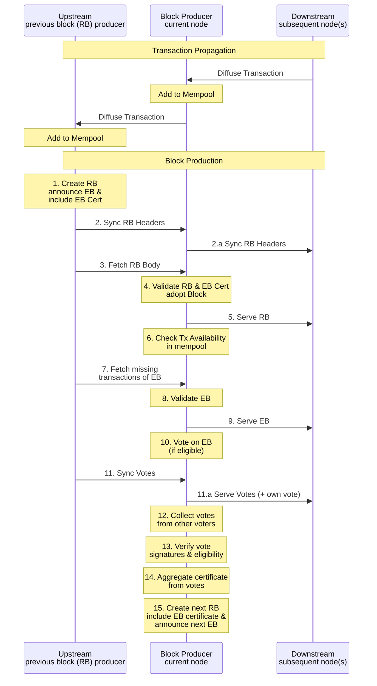

## Abstract

> [!NOTE]
>
> A short (~200 word) description of the proposed solution and the technical
> issue being addressed.

The anticipated growth of the Cardano ecosystem necessitates a fundamental
enhancement of network throughput to accommodate increasing transaction volumes
and support complex decentralized applications.

To address this challenge, we propose a transition to Ouroboros Leios — a novel
consensus protocol within the Ouroboros family. Leios is specifically designed
for high-throughput operation while preserving the rigorous security properties
established by Ouroboros Praos.

Leios achieves its scalability through a decoupled block production and
aggregation mechanism. This allows for a higher rate of input-block generation,
followed by efficient endorsement and anchoring onto the main chain. This
document formally specifies the Leios protocol using Agda and provides a
detailed rationale and supporting evidence demonstrating its efficacy in
overcoming the throughput limitations inherent in the current Ouroboros Praos
protocol.

> [!NOTE]
>
> For comprehensive research documentation, development history, and additional
> technical resources, visit the
> [Leios R&D website](https://leios.cardano-scaling.org/).

<details>
  <summary><h2>Table of contents</h2></summary>
  <strong><font color="red">Create a table of contents with internal hyperlinks when the organization of the document is stable.</font></strong>
</details>

## Motivation: why is this CIP necessary?

> [!NOTE]
>
> A clear explanation that introduces a proposal's purpose, use cases, and
> stakeholders. If the CIP changes an established design, it must outline design
> issues that motivate a rework. For complex proposals, authors must write a
> [Cardano Problem Statement (CPS) as defined in CIP-9999][CPS] and link to it
> as the `Motivation`.

While Cardano's current transaction processing capabilities often meet the
immediate demands of its user base, the underlying Ouroboros Praos consensus
protocol inherently imposes limitations on scalability. The critical requirement
for timely and reliable global propagation of newly generated blocks within a
short time interval necessitates a careful balancing act. This constraint
directly restricts the maximum size of individual blocks and the computational
resources available for the validation of transactions and Plutus scripts,
effectively establishing a ceiling on the network's transaction throughput that
cannot be overcome through simple parameter adjustments alone.

However, the dynamic growth of the Cardano ecosystem is increasingly revealing
the practical consequences of these inherent limitations. The Cardano mainnet
periodically experiences periods of significant congestion, where the volume of
transactions awaiting processing surpasses the network's ability to include them
in a timely manner. This congestion can lead to a tangible degradation in the
user experience, manifesting as delays in transaction confirmation. Moreover, it
poses substantial obstacles for specific use cases that rely on the efficient
processing of large volumes of transactions, such as the distribution of tokens
via airdrops, or the rapid and consistent updating of data by decentralized
oracles or partner chains.

The semi-sequential nature of block propagation in Ouroboros Praos, where blocks
are relayed from one block producer to the next across potentially
geographically distant nodes, is a key factor contributing to these limitations.
The necessity of completing this global dissemination within the few-second
period places a fundamental constraint on the rate at which new blocks, and
consequently the transactions they contain, can be added to the blockchain. This
architectural characteristic stands in contrast to the largely untapped
potential of the network's underlying infrastructure, where the computational
and bandwidth resources of individual nodes often remain significantly
underutilized.

To transcend these inherent scaling barriers and unlock the latent capacity of
the Cardano network, a fundamental evolution of the core consensus algorithm is
imperative. Ouroboros Leios represents a departure from the sequential
processing model of Praos, aiming to introduce mechanisms for parallel
transaction processing and more efficient aggregation of transaction data. By
reorganizing how transactions are proposed, validated, and ultimately recorded
on the blockchain, this protocol upgrade seeks to achieve a substantial increase
in the network's overall throughput, enabling it to handle a significantly
greater volume of transactions within a given timeframe.

The Cardano Problem Statement [CPS-18 Greater Transaction Throughput][cps-18]
further motivates the need for higher transaction throughput and marshals
quantitative evidence of existing mainnet bottlenecks. Realizing higher
transaction rates is also necessary for long-term Cardano techno-economic
viability as rewards contributions from the Reserve pot diminish: fees from more
transactions will be needed to make up that deficit and keep sound the finances
of stakepool operations. (Currently, the Reserve contributes more than 85% of
the reward of a typical epoch, with less than 15% of the reward coming from the
collection of transaction fees. In five years, however, the Reserve contribution
will be much diminished.) Because a major protocol upgrade like Leios will take
significant time to implement, test, and audit, it is important to began
implementation well before transaction demand on mainnet exceeds the
capabilities of Ouroboros Praos. The plot below shows the historically
diminishing rewards and a forecast of their continued reduction: the forecast is
mildly uncertain because the future pattern of staking behavior, transaction
fees, and node efficiency might vary considerably.


Ouroboros Praos cannot support the high transaction volume needed to generate
the fees that will eventually be needed to offset the diminishing rewards.
However, as sustained throughput of transactions grows beyond 50 transactions
per second, there is more opportunity for simultaneously reducing fees,
augmenting the Treasury, and increasing SPO and delegator rewards.


## Specification

Leios extends Ouroboros Praos by enabling block producers to create an optional
second, larger block body called an [Endorser Block (EB)](#endorser-blocks-ebs)
alongside each standard
[Praos block (Ranking Block or RB)](#ranking-blocks-rbs). EBs undergo validation
by a dynamically selected committee of stake pools before inclusion in the
ledger.

### Protocol Overview

<div align="center">
<a name="figure-1"></a>
<p name="protocol-flow-figure">
  
</p>

_Figure 1: Ouroboros Leios Protocol Flow_

</div>

Leios works through a five-step process that introduces new block types and
validation mechanisms:

**Step 1: Block Production**

When a stake pool wins block leadership, they **simultaneously** create two
things:

- **Ranking Block (RB)**: A standard Praos block with extended header fields to
  announce the second block
- **Endorser Block (EB)**: A larger block containing additional transaction references

The RB chain continues to be distributed exactly as in Praos, while Leios introduces a separate header distribution mechanism for rapid EB discovery and equivocation detection.

**Step 2: EB Distribution**

Nodes receiving the RB header discover the announced EB and fetch its content. The EB contains references to transactions. If a node does not already possess a transaction referenced in the EB, it explicitly requests that transaction from peers.

**Step 3: Committee Validation**

A **voting committee** of stake pools validates the EB within a time window
called $L$:

- Committee members are selected via sortition (lottery based on stake)
- A committee member votes positively for an EB only if:
  - It has received the EB within $L_\text{vote}$ slots from its creation,
  - The EB corresponds to the EB announced in the latest block in the chain maintained by the party,
  - The transactions in the EB are a valid extension of the RB (and the corresponding chain) that announced it.
- The stage has two phases: voting period ($L_\text{vote}$) + vote diffusion period ($L_\text{diff}$)

**Step 4: Certification**

If enough committee votes are collected such that the total stake exceeds a
**threshold** ($\tau$) (typically 60% of total stake), the EB becomes **certified**:

$$
\sum_{v \in \text{votes}} \text{stake}(v) \geq \tau \times \text{stake}_{\text{total}}
$$

This creates a compact **certificate** proving the EB's validity.

**Step 5: Chain Inclusion**

The certificate for an EB announced by RB may only be included in another RB' **if** all
conditions are met:

- RB' directly extends the target RB in the blockchain, and
- The creation slot of RB' and the end of the voting phase (RB creation timestamp + $L_\text{vote}$) differ by at least $L_\text{diff}$ slots. This ensures the EB is available to all honest nodes with good probability.

This **conditional inclusion** maintains Praos safety guarantees while achieving
higher throughput when network timing permits. When included:

- The certified EB's transactions become part of the permanent ledger
- Throughput increases significantly for that segment of the chain
- If timing is insufficient, only the standard RB is included (maintaining Praos
  baseline)

### Protocol Component Details

The protocol extends Praos with three main elements:

#### Ranking Blocks (RBs)

RBs are Praos blocks extended to support Leios by optionally announcing EBs in
their headers and embedding EB certificates in their bodies. In addition to
including transactions directly, RBs can also incorporate transactions from
certified EBs. The Leios-specific additions are: the optional `announced_eb`
field in the block header which announces a new EB by hash, the optional
`certified_eb` field in the header which references the EB being certified, and
the optional `eb_certificate` in the block body which contains the certificate
attesting to the validity of an EB through
[BLS-based voting](https://github.com/input-output-hk/ouroboros-leios/blob/main/crypto-benchmarks.rs/Specification.md)
by a committee of stake pools.

<details>
<summary>Ranking Block CDDL</summary>

```diff
 ranking_block =
   [ header                   : block_header
   , transaction_bodies       : [* transaction_body]
   , transaction_witness_sets : [* transaction_witness_set]
   , auxiliary_data_set       : {* transaction_index => auxiliary_data}
   , invalid_transactions     : [* transaction_index]
+  , ? eb_certificate         : leios_certificate
   ]

block_header =
   [
     header_body              : block_header_body
   , body_signature           : kes_signature
   ]

 block_header_body =
   [ block_number             : uint
   , slot                     : slot_no
   , prev_hash                : hash32
   , issuer_vkey              : vkey
   , vrf_vkey                 : vrf_vkey
   , vrf_result               : vrf_cert
   , block_body_size          : uint
   , block_body_hash          : hash32
+  , ? announced_eb           : hash32
+  , ? certified_eb           : hash32
   ]
```

<div align="center">
<a name="figure-2"></a>

_Figure 2: Ranking Block CDDL_

</div>
</details>

#### Endorser Blocks (EBs)

EBs are produced by the same stake pool that created the corresponding
announcing RB. They serve to reference additional transactions, increasing
throughput beyond what can be included directly in the RB. When an EB is
announced in an RB header via the `announced_eb` field, a voting period begins
as described in
[Voting Committee and Certificates](#voting-committee-and-certificates). Only
RBs that directly extend the announcing RB are eligible to certify the announced
EB by including a certificate.

<details>
<summary>Endorser Block CDDL</summary>

```cddl
 endorser_block =
   [ rb_announced             : hash32
   , conflicting_txs          : [* transaction_index]
   , transaction_references   : [* tx_reference]
   ]

 ; Reference structures
 tx_reference = hash32
 transaction_index = uint
```

<div align="center">
<a name="figure-3"></a>

_Figure 3: Endorser Block CDDL_

</div>
</details>

#### Voting Committee and Certificates

The voting committee is a group of stake pools selected to validate EBs through
BLS-based vote aggregation. Only EBs that achieve the required quorum ($\tau$) of votes
are certified and eligible for inclusion in RBs.

Votes are categorized as either **persistent** (selected for the entire epoch)
or **non-persistent** (selected per EB), following the Fait Accompli sortition
scheme.

The complete technical specification is detailed in
[Specification for votes and certificates](#specification-for-votes-and-certificates).

> [!NOTE]
> **Vote Bundling**
> 
> The linked BLS specification mentions vote bundling as an optimization. However, this only applies when EB production is decoupled from RBs, which is not the case in this specification where each EB is announced by an RB.

<details>
<summary>Vote & Certificate CDDL</summary>

```cddl
 leios_certificate =
   [ election_id              : election_id
   , endorser_block_hash      : hash32
   , persistent_voters        : [* persistent_voter_id]
   , nonpersistent_voters     : {* pool_id => bls_signature}
   , ? aggregate_elig_sig     : bls_signature
   , aggregate_vote_sig       : bls_signature
   ]

 leios_vote = persistent_vote / non_persistent_vote

 persistent_vote =
   [ 0
   , election_id
   , persistent_voter_id
   , endorser_block_hash
   , vote_signature
   ]

 non_persistent_vote =
   [ 1
   , election_id
   , pool_id
   , eligibility_signature
   , endorser_block_hash
   , vote_signature
   ]
```

<div align="center">
<a name="figure-4"></a>

_Figure 4: Votes & Certificate CDDL_

</div>
</details>

### Protocol Parameters and Network Characteristics

The following sections distinguish between tunable **protocol parameters**
(which can be adjusted via governance) and observed **network characteristics**
(which depend on topology and node capabilities).

**Network Characteristics**

These are observed properties of the network topology and node capabilities:

<div align="center">
<a name="table-1"></a>

| Characteristic            |       Symbol        | Units | Description                                                 |          Typical Range          | Notes                                              |
| ------------------------- | :-----------------: | :---: | ----------------------------------------------------------- | :-----------------------------: | -------------------------------------------------- |
| RB diffusion time         |      $\Delta$       | slot  | Observed upper bound for ranking block (RB) diffusion to all nodes     |            2-6 slots            | Depends on network topology and conditions         |
| RB header diffusion time  | $\Delta_\text{hdr}$ | slot  | Observed time for RB headers to reach nodes                 |          $\leq \Delta$          | Usually faster than full block diffusion           |

_Table 1: Network Characteristics_

</div>

**Protocol Parameters**

These parameters are configurable and subject to governance decisions,
constrained by the network characteristics above:

<div align="center">
<a name="table-2"></a>

| Parameter                     |    Symbol     |  Units   | Description                                                            |                   Constraints                   | Rationale                                                     |
| ----------------------------- | :-----------: | :------: | ---------------------------------------------------------------------- | :---------------------------------------------: | ------------------------------------------------------------- |
| Voting period length          | $L_\text{vote}$ |   slot   | Duration during which committee members can vote on endorser blocks    | $L_\text{vote} \geq 3\Delta_\text{hdr}$ | Must allow EB diffusion and equivocation detection before voting |
| Vote diffusion period length | $L_\text{diff}$ |   slot   | Duration for vote propagation after voting period ends                | $L_\text{diff} \geq \Delta_\text{hdr}$ | Must allow votes to propagate before certificate inclusion   |
| Ranking block max size        | $S_\text{RB}$ |  bytes   | Maximum size of a ranking block                                        |                $S_\text{RB} > 0$                | Limits RB size to ensure timely diffusion                     |
| Endorser-block referenceable transaction size | $S_\text{EB}$ |  bytes   | Maximum total size of transactions that can be referenced by an endorser block |                $S_\text{EB} > 0$                | Limits total transaction payload to ensure timely diffusion within stage length |
| Praos active slot coefficient | $f_\text{RB}$ |  1/slot  | Probability that a party will be the slot leader for a particular slot |       $0 < f_\text{RB} \leq \Delta^{-1}$        | Blocks should not be produced faster than network delay       |
| Mean committee size           |      $n$      | parties  | Average number of stake pools selected for voting                      |                     $n > 0$                     | Ensures sufficient decentralization and security              |
| Quorum size                   |    $\tau$     | fraction | Minimum fraction of committee votes required for certification         |                  $\tau > 0.5$                   | Prevents adversarial control while ensuring liveness          |

_Table 2: Leios Protocol Parameters_

</div>

### Specification for votes and certificates

Leios requires a voting and certificate scheme to validate endorser blocks. This
specification defines a BLS-based implementation that meets the protocol
requirements with concrete performance characteristics.

#### Committee Selection

**Persistent Voters**: Selected once per epoch using the
[Fait Accompli scheme](https://iohk.io/en/research/library/papers/fait-accompli-committee-selection-improving-the-size-security-tradeoff-of-stake-based-committees/).
These pools vote in every election during the epoch.

**Non-persistent Voters**: Selected per EB via local sortition based on the
election identifier. The probability that a pool with stake fraction $σ$
receives $k$ votes follows:

$$
\mathcal{P}(k) := \frac{(n \cdot \sigma)^k \cdot e^{- n \cdot \sigma}}{k!}
$$

**Committee Size**: Minimum 500 voters required for security, with quorum
threshold of at least 60% of total stake.

#### Key Registration

Stake pools register BLS keys with proof-of-possession:

- **Public Key**: 96 bytes (BLS12-381 with compression)
- **Proof of Possession**: 96 bytes
- **Pool ID**: 28 bytes
- **KES Signature**: 448 bytes
- **Total Registration Size**: 668 bytes

Keys are registered as part of operational certificates and do not require
periodic rotation.

#### Vote Structure

**Persistent Votes** (90 bytes):

- Election ID: 8 bytes
- EB hash: 32 bytes
- Pool identifier: 2 bytes
- Vote signature: 48 bytes

**Non-persistent Votes** (164 bytes):

- Election ID: 8 bytes
- EB hash: 32 bytes
- Pool ID: 28 bytes
- Eligibility signature: 48 bytes
- Vote signature: 48 bytes

Each vote is submitted individually for a specific endorser block.

#### Certificate Structure

Certificates aggregate votes into compact proofs, with size formula:

$$
\text{certificate bytes} = 136 + \left\lceil \frac{m}{8} \right\rceil + 76 \times (n - m)
$$

Where m = persistent voters, n = total committee size.

**Components**:

- Election ID and EB hash: 40 bytes
- Persistent voter bitset: ⌈m/8⌉ bytes
- Non-persistent voter IDs: 28×(n-m) bytes
- Eligibility proofs: 48×(n-m) bytes
- Aggregate signatures: 96 bytes

**Size Characteristics**: Under 10 kB for realistic Cardano mainnet stake
distributions (assuming 80% persistent, 20% non-persistent voters).

#### Performance Requirements

<div align="center">
<a name="table-3"></a>

| **Operation Type**      | **Persistent Vote** | **Non-persistent Vote** |
|------------------------ |:------------------:|:----------------------:|
| Generation              | 135 μs             | 280 μs                 |
| Verification            | 670 μs             | 1.4 ms                 |

_Table 3: Vote operation times for persistent and non-persistent voters_
</div>

<div align="center">
<a name="table-4"></a>

| **Operation Type**      | **Certificate** |
|------------------------ |:--------------:|
| Generation              | ~90 ms         |
| Verification            | ~130 ms        |

_Table 4: Certificate operation times_
</div>

#### Certificate Size Analysis

The following shows certificate characteristics for Cardano mainnet Epoch 535
stake distribution:

<div align="center">

| **Persistent Voters**                                    | **Certificate Size**                                             |
| -------------------------------------------------------- | ---------------------------------------------------------------- |
|  |  |

_Certificate size scaling with committee size for realistic stake distribution_

</div>


> [!NOTE]
> **Voting Implementation**
> 
> The detailed BLS-based voting and certificate scheme, including key registration, Fait Accompli sortition, and local sortition algorithms, is specified in the [BLS certificates specification](https://github.com/input-output-hk/ouroboros-leios/blob/main/crypto-benchmarks.rs/Specification.md) and includes a [reference implementation](https://github.com/input-output-hk/ouroboros-leios/tree/main/crypto-benchmarks.rs).

### Node Behavior

The Leios protocol introduces new node responsibilities and message flows beyond those in Praos, reflecting the additional steps of EB creation and announcement, committee voting, and certificate aggregation. The following sequence diagram outlines the interactions that nodes perform as they participate in block production, transaction propagation, validation, and certification in a simplified way.

> [!Note]
> The following interactions would actually be interleaved below, due to mini protocol pipelining. Details on mini-protocols follow this section.

<div align="center">
<a name="figure-2"></a>



_Figure 2: Up- and downstream interactions of a node (simplified)_

</div>

The diagram above illustrates in a simplified manner the complete Leios workflow, numbered to show the sequence of interactions. While many steps introduce new behaviors, several core Praos mechanisms remain unchanged:

#### What remains unchanged from Praos

Most core Praos functionality continues to operate unchanged in Leios. **Transaction propagation** uses the identical TxSubmission mini-protocol, with transactions flowing from downstream to upstream nodes and being added to local mempools.

**RB chain synchronization** (Steps 3, 5) employs the same ChainSync and BlockFetch protocols for RB propagation as in Praos.

**Chain selection** follows the same longest-chain rule, treating EBs as auxiliary data that doesn't affect chain validity.

**Ledger state management** continues to use Praos transaction validation and ledger update rules, with EBs adding transactions only when certified.

**Key infrastructure change**: Mempool capacity must increase to accommodate both RB and EB transactions (limited by [protocol parameter $S_\text{EB}$](#protocol-parameters-and-network-characteristics)).

#### Novel Requirements: EB Handling and Attack Prevention

Beyond the familiar Praos mechanisms, the sequence diagram reveals several entirely new node behaviors required for EB handling (Steps 6-14). These introduce critical attack prevention mechanisms not present in Praos:

**Freshest-First EB Delivery**

EBs must be delivered in **freshest-first delivery** to prevent timing attacks where adversaries flood the network with large, old EBs to delay fresh EB delivery. This freshest-first policy ensures that recent EBs (which can still be voted on) receive priority over historical EBs, preventing large batches of old EBs from congesting the network and blocking new EB propagation. 

Most critically, this prioritization guarantees that committee members receive fresh EBs within the voting window $L_\text{vote}$, maintaining the protocol's liveness properties under adversarial conditions.

**Universal EB Availability Across Forks**

Unlike RBs where nodes only need blocks in their current chain, **all nodes must receive all EBs** regardless of which fork announced them. This universal availability requirement prevents sophisticated withholding attacks where an adversary deliberately conceals EBs from one fork until after the voting period expires, forcing honest nodes to make chain selection decisions without complete information. 

Without this requirement, honest nodes switching to a longer fork might discover they lack EBs that were certified on that fork, making fork switches expensive with time complexity proportional to the number of missing EBs that must be fetched and validated retroactively.

**Single EB Voting Constraint**

While nodes must receive all EBs from all forks for security reasons, committee members may only vote on **one EB per slot**, even when multiple EBs are available due to fork competition. This voting constraint ensures that votes do not dilute across competing forks and maintains the integrity of the certification process.

**Forward-Before-Validate Strategy (Steps 8-9)**

To maintain freshest-first delivery while preventing DoS attacks, nodes must **forward EBs before performing full validation**. This creates a two-stage process: Stage 1 occurs before Step 9 (Serve EB), while Stage 2 happens during Step 8 (Validate EB). 

*Stage 1 - Pre-forwarding Verification* performs only the checks required to ensure DoS attacks are mitigated: VRF proof verification to confirm the legitimacy of the block producer, block hash verification to ensure the EB hash matches the RB header announcement from Step 2, basic header validation covering slot, issuer, and signatures, and equivocation detection to reject EBs from known equivocating producers. 

*Stage 2 - Full Validation (Step 8)* then performs the computationally expensive operations including transaction availability and validity checking, ledger state consistency verification, conflict detection with RB transactions, and size limit verification against $S_\text{EB}$. This approach limits DoS exposure since each producer can create at most one EB per slot, bounding the pre-forwarding verification work to at most one EB per slot per producer even under adversarial conditions.

**Equivocation Detection and Defense (Steps 2, 2a)**

RB headers must be diffused rapidly (faster than EBs) to enable equivocation detection. Headers propagate in $≤ \Delta_\text{hdr}$ time via **RbHeaderRelay**, while nodes track multiple headers per (issuer, slot) pair to detect conflicts.

Upon detecting conflicting headers from the same producer in the same slot, nodes create and diffuse equivocation proofs throughout the network. To ensure all honest nodes have sufficient time to receive and process these proofs, voting is delayed by $3\Delta_\text{hdr}$ from the EB announcement (Step 10).

Once an equivocation proof is established, EBs from the offending producer are completely ignored—neither voted on nor forwarded—effectively isolating the malicious actor from the consensus process. However, an honest node should still forward the equivocated RB header downstream to ensure all peers can detect the equivocation.

**Timing-Critical Voting Windows (Steps 10, 11, 11a)**

Committee members must respect strict timing constraints that govern the entire voting and certification process. The **voting period** of $L_\text{vote}$ slots from EB announcement provides the window during which committee members can cast their votes. An **equivocation grace period** requires waiting $3\Delta_\text{hdr}$ before voting to allow equivocation detection to complete. 

The **vote diffusion period** of $L_\text{diff}$ additional slots enables vote propagation (Step 11a) throughout the network. Finally, the **certificate inclusion constraint** ensures that RBs can only include certificates after the complete $L_\text{vote} + L_\text{diff}$ period expires (Step 15). 

These timing constraints ensure that honest EBs receive priority over equivocated ones, that all honest nodes have sufficient opportunity to detect equivocation before voting (through the $3\Delta_\text{hdr}$ delay), and that the vote diffusion period $L_\text{diff}$ provides sufficient time for vote aggregation and certificate creation (Step 14).

#### Attack Mitigation Summary

The novel node behaviors described above work together to defend against specific attack vectors through coordinated mechanisms. **Timing attacks** are mitigated by the freshest-first EB delivery requirement, preventing adversaries from flooding the network with stale blocks to delay fresh content. **Withholding attacks** are countered by the universal EB propagation requirement across all forks, ensuring that fork switches cannot be exploited by selectively concealing critical data. 

**DoS attacks** are limited through the forward-before-validate strategy with pre-forwarding verification (Step 8), bounding computational exposure while maintaining network responsiveness. **Equivocation attacks** are detected and neutralized via rapid header diffusion and delayed voting (Steps 2, 2a, 10), giving honest nodes time to coordinate their response to malicious behavior. 

**Fork manipulation** attempts are thwarted by pre-emptive EB distribution independent of the current chain, preventing adversaries from using chain reorganizations as attack vectors. These coordinated requirements fundamentally transform Leios nodes from simple chain followers into active participants in a distributed validation network, where attack resistance depends on adherence to the protocol timing constraints ($L_\text{vote}$, $L_\text{diff}$, $3\Delta_\text{hdr}$) across all honest nodes.

> [!Warning]
> Work in progress...

### Network

As outlined above, Leios splits transactions between RBs and EBs, with EB inclusion dependent on committee voting and certification. Unlike Ouroboros Praos where the RB chain contains all necessary data, Leios nodes require additional message types to:

- **Reconstruct ledger state**: EBs containing certified transactions
- **Participate in consensus**: Vote on EBs and construct certificates  
- **Detect equivocation**: RB headers from competing forks

#### Message Types and Mini-Protocols

Leios introduces **six new mini-protocols** to handle the additional message types:

<div align="center">
<a name="table-6"></a>

| **Message Type** | **Purpose** | **Mini-Protocol** | **Structure** |
| :--------------: | ----------- | :---------------: | --------------- |
| RB Headers | Detect equivocation for voting decisions | **RbHeaderRelay** | (slot, issuer) pairs |
| Fresh EBs | Enable committee validation and voting | **EbRelay** | (issuer, slot, size) triplets |  
| Committee Votes | Construct certificates for EB inclusion | **VoteRelay** | (EB slot, vote issuer) pairs |
| Equivocation Proofs | Notify network of misbehaving producers | **EquivRelay** | pairs of conflicting RB headers |
| Historical EBs | Reconstruct ledger from certified EBs | **EbFetch** | slot and hash |
| Transaction Bodies | Resolve EB transaction references (when TxsByRef) | **TxFetch** | tx position within EB |

_Table 6: Leios Mini-Protocols_

</div>

> [!Warning]
> **TODO Mini-protocol specification**
>
> For each mini-protocol specify: purpose, message types, state machine, key parameters, and security notes.

### Mempool management

> [!Warning]
>
> This section is work in progress.

- Mempool enlarged for both RB and EB txs.
- On EB announcement, optimistically include EB txs in mempool (pending
  certification).
- If EB not certified, revalidate/reinsert its txs.
- Remove txs from mempool when included in RB or certified EB.
- Validate txs against current ledger state before mempool admission.
- RB producer resolves RB/EB tx conflicts at block production.
- Mempool does not track conflicting indices; relies on ledger rules.

### Incentives

> [!Warning]
>
> This section is work in progress.

- Reward EB creation, even if some EBs are not included in the final chain
- Motivate voter participation, while blocking system gaming
- Distribute fees among EB producers, main block producers, and voters

## Rationale: how does this CIP achieve its goals?

> [!NOTE]
>
> The rationale fleshes out the specification by describing what motivated the
> design and what led to particular design decisions. It should describe
> alternate designs considered and related work. The rationale should provide
> evidence of consensus within the community and discuss significant objections
> or concerns raised during the discussion.
>
> It must also explain how the proposal affects the backward compatibility of
> existing solutions when applicable. If the proposal responds to a [CPS][], the
> 'Rationale' section should explain how it addresses the CPS and answer any
> questions that the CPS poses for potential solutions.

### How Leios increases throughput

The throughput of a Nakamoto consensus like Ouroboros Praos is intrinsically
limited by the strict requirement for rapid global propagation of each block
approximately before the next leader produces a block. Leios escapes that
limitation by allowing block producers to create larger endorser blocks (EBs)
that are voted on by a dynamically selected representative committee of stake
pools, ensuring broad participation in the validation process. The voting
process on these endorser blocks occurs in a more relaxed and extended manner
over a multi-slot stage, allowing for greater network latency tolerance. When a
quorum is reached, that quorum is recorded in a subsequent Praos block. The
majority voting by this committee ensures consensus on the endorser block while
inheriting and maintaining Praos's robust resistance to adversarial activity, as
the final commitment is anchored in the secure Praos chain.

> [!WARNING]
> TODO:
> - Improve answer on how leios is solving [CPS-18][cps-18]
>   - why proposed protocol results in more throughput
>   - how increase in plutus budget is possible now (only if we have a concrete proposal in specification)
>
> - Incorporate why 10x throughput is enough / link back to economic sustainability from motivation
>
> - Incorporate argument of doing one order of magnitude change at a time
>
> - Re-add or drop analogies?

<!--
As a result of this decoupled approach, Leios can utilize nearly the full
bandwidth available to the network of nodes without requiring unrealistically
fast propagation of blocks: Leios employs a structured, multi-stage process
where endorser blocks are announced and then voted upon in subsequent stages
before being certified by a Praos block. Think of Praos as a single-lane highway
where every car (block) needs to travel the entire length before the next can
start. Leios, in contrast, is like having larger vehicles (endorser blocks) that
undergo inspection and approval before joining the main highway (Praos chain),
achieving higher capacity through this validation process.

In analogy, imagine Praos as a single courier diligently collecting and
delivering individual letters one by one, limiting the delivery speed to their
individual capacity. Ouroboros Leios, however, operates like a mail sorting
office where larger packages (endorser blocks) are prepared and then go through
a quality inspection process (voting) before being dispatched by the main
courier (Praos chain), achieving significantly higher delivery volume through
this structured validation approach.
-->

Concretely, the [specified protocol and parameterization](#specification)
results in roughly a **10x** throughput increase by combining the transaction
capacity of regular blocks with that of certified EBs. The formula below
expresses this: throughput equals the rate of regular block production times the
sum of their capacity and the additional capacity from Endorser Blocks that are
certified.

> [!WARNING]
> What about the maximum number / size of referenced transactions?

$$
\text{Throughput} = f_{\text{RB}} \times \left( S_\text{RB} + S_\text{EB} \times f_\text{EB} \right)
$$

Where:
- $f_{\text{RB}}$ — Rate of RB production (protocol parameter)
- $S_\text{RB}$ — Maximum size of an RB (protocol parameter)
- $S_\text{EB}$ — Maximum size of an EB (protocol parameter)
- $f_\text{EB}$ — Fraction of RBs that include an EB as observed under realistic
  network conditions and timing constraints.

While even higher throughput may be possible, and should be explored during
implementation to validate mainnet compatible parameters, increasing the
capacity of Cardano further is likely blocked by the **significantly increased**
potential chain growth. _Assuming sustained demand_ of `100 tx/s` of [current
average
sized](https://github.com/input-output-hk/ouroboros-leios/tree/main/docs/cost-estimate#cost-revenue-analysis)
transactions of `~1400 Bytes`, the chain would grow `~11 GBytes` per day or
`~337 GBytes` per month. Pushing this even higher did not sound reasonable and
would require a solution to the **chain growth problem**, which is out of scope
of this CIP and may even demand a dedicated CPS.

See also [evidence section](#evidence-that-leios-provides-high-throughput)
for empirical studies on possible throughput.

### Why this protocol variant

The proposed protocol is a radically simplified version of what was published in
the [Leios research paper][leios-paper]. The simplifcations were primarily made
to reduce the concurrent processing of Cardano transactions as much as possible
while still allowing roughly a 10x throughput increase.

The protocol design as published is optimal in its usage of available network
and compute resources, but comes at the cost of significantly increased
inclusion latency (> 5x) and a high level of concurrency. Both of which are
undesirable in a real-world deployment onto the Cardano mainnet and need to be
carefully weighed against the throughput increase:

**Higher latency** of transactions reaching the ledger (a.k.a settlement time)
allows for higher throughput because work can be performed for a longer time.
This is particularly evident with protocol designs that have many rounds and
consequently many network roundtrips. For example, preparing input blocks as
described in the paper is an additional round of validation and communication.
High latency is however a straight-forward drawback and will impact both,
applications built on Cardano and end user experience. As also stated in the
goals of [CPS-18][cps-18], a deployment of Leios should not result in
unreasonable increases of settlement time. In the mid-term potential synergies
with [Peras](https://github.com/cardano-foundation/CIPs/tree/master/CIP-0140)
could make higher latency pipeline designs feasible again.

**Higher concurrency** allows for higher throughput by doing more transaction
processing at the same time. In the published design and otherwise discussed
variants concurrency is introduced by allowing agreement on sequences of
transactions independently of the Proas block production. This is the case for
when endorser blocks would be announced separately from Praos blocks or input
blocks be produced on a completely separate schedule. While such protocol
designs often result in higher latency due to more rounds, concurrency in itself
gives rise to the dedicated problem of _conflicting transactions_.

> [!WARNING]
> TODO:
> - Conflicting txs a.k.a UTxO congestion on Cardano
>   - Competing spending of UTxOs is to be expected
>   - Also a network-based attack possible (link threat model?)
>
> - Conflicting transactions can either be
>   - accepted = failing transactions vs. Cardano USP of only paying fees when included
>   - reduced -> sharding reduces (!not eliminates!) amount of potential conflict, but has lots of impact & complexity
>   - reconciled -> a certain number of conflicts can be dealt with; tombstoning to reduce storage waste
>
> - We chose the third option and hence only proposed no / a modest increase in concurrency
>
> - Incorporate:
>
> This Linear Leios variant was chosen over the full Leios protocol described in
> the research paper for several practical deployment considerations:
>
> **Simplified Architecture**: By removing input blocks and reducing concurrency,
> Linear Leios significantly simplifies the implementation while still achieving
> substantial throughput improvements over Ouroboros Praos.
>
> **Reduced Attack Surface**: The elimination of concurrent input block production
> removes complex equivocation handling and transaction conflict resolution that
> would be required in full Leios.
>
> **Incremental Deployment**: Linear Leios provides a more manageable upgrade path
> from Praos, allowing the ecosystem to gain experience with EB voting and
> certification before considering more complex variants.
>
> **Conservative Risk Profile**: The simplified model reduces implementation risk
> while still delivering significant throughput benefits, making it suitable for
> a production blockchain with significant economic value.
>
> ### Design trade-offs and simplifications
>
> **Concurrency Model**: Linear Leios trades some potential throughput for
> simplicity by allowing only one EB per RB producer, eliminating the need for
> complex transaction sharding and conflict resolution mechanisms.
>
> **Implementation Complexity**: The removal of input blocks significantly reduces
> the complexity of ledger state management, mempool handling, and network protocols
> while still enabling substantial throughput improvements.
>
> **Throughput vs. Safety**: This variant prioritizes safety and implementability
> over maximum theoretical throughput, providing a solid foundation for future
> protocol enhancements.

### Why Leios is practical to implement

> [!WARNING]
> TODO:
>
> - Shorten?
> - Incorporate: it's rather simple - offers minimal changes to existing implementation
> - Could also mention here:
>   - meets most urgent need - the economic sustainable threshold (from motivation)
>   - allows for progressive updates of infrastructure (node operators)

Leios is designed as an overlay protocol to Praos and consequently changes to
Cardano node infrastructure are often extensional. The existing network
protocols do not need to change, while the new mini-protocols for diffusion of
EBs and votes are to defined using the existing network protocol framework.

Besides storing ranking blocks, consensus nodes will be required to store and
serve EBs and the mempool requires a size increase, optimistic adoption of EBs
and generally less aggressive pruning of transactions. Leios adds complexity to
chain selection and adopting blocks as ledger state construction needs to be
deferred to not impact (ranking) block diffusion. Adjustments to the rewards
model will also be required.

The required cryptographic primitives are already used in production in various
parts of the Cardano and blockchain ecosystems. The performance of the
cryptographic operations required for Leios is demonstrated by a prototype
implementation[^3] and the benchmarks in the Appendix [Cryptographic
benchmarks](#cryptographic-benchmarks). The small size (less than 9 kB) of Leios
certificates is documented in the Appendix [Certificate size for realistic stake
distributions](#certificate-size-for-realistic-stake-distributions).

The [Resource requirements](#resource-requirements), discussed below, modestly
increase the requirements for running a Cardano node but not beyond commonly
available commodity hardware.

### Evidence and simulation analysis

#### Metrics

> [!NOTE]
>
> This is a preliminary set of metrics that will be finalized when the Leios
> protocol variants are finalized and the simulation studies are complete.

The performance of a protocol like Leios can be characterized in terms of its
efficient use of resources, its total use of resources, the probabilities of
negative outcomes due to the protocol's design, and the resilience to adverse
conditions. Metrics measuring such performance depend upon the selection of
protocol parameters, the network topology, and the submission of transactions.
The table below summarizes key metrics for evaluating Leios as a protocol and
individual scenarios (parameters, network, and load).

| Category   | Metric                                                    | Measurement                                                                                                     |
| ---------- | --------------------------------------------------------- | --------------------------------------------------------------------------------------------------------------- |
| Efficiency | Spatial efficiency, $`\epsilon_\text{spatial}`$           | Ratio of total transactions size to persistent storage                                                          |
|            | Temporal efficiency, $`\epsilon_\text{temporal}(s)`$      | Time to include transaction on ledger                                                                           |
|            | Network efficiency, $`\epsilon_\text{network}`$           | Ratio of total transaction size to node-averaged network usage                                                  |
| Protocol   | TX inclusion, $`\tau_\text{inclusion}`$                   | Mean number of slots for a transaction being included in any EB                                                 |
|            | Voting failure, $`p_\text{noquorum}`$                     | Probability of sortition failure to elect sufficient voters for a quorum                                        |
| Resource   | Network egress, $`q_\text{egress}`$                       | Rate of bytes transmitted by a node                                                                             |
|            | Disk usage, $`q_\text{disk}`$                             | Rate of persistent bytes stored by a node                                                                       |
|            | I/O operations, $`\bar{q}_\text{iops}(b)`$                | Mean number of I/O operations per second, where each operation writes a filesystem block of $`b`$ bytes         |
|            | Mean CPU usage, $`\bar{q}_\text{vcpu}`$                   | Mean virtual CPU cores used by a node                                                                           |
|            | Peak CPU usage, $`\hat{q}_\text{vcpu}`$                   | Maximum virtual CPU cores used by a node over a one-slot window                                                 |
| Resilience | Bandwidth, $`\eta_\text{bandwidth}(b)`$                   | Fractional loss in throughput at finite bandwidth $`b`$                                                         |
|            | Adversarial stake, $`\eta_\text{adversary}(s)`$           | Fractional loss in throughput due to adversial stake of $`s`$                                                   |
| Fees       | Collateral paid for success, $`\kappa_\text{success}(c)`$ | Average collateral paid for a successful transaction when it conflicts with a fraction $`c`$ of the memory pool |
|            | Collateral paid for failure, $`\kappa_\text{failure}(c)`$ | Average collateral paid for a failed transaction when it conflicts with a fraction $`c`$ of the memory pool     |

**_Spatial efficiency:_** Leios necessarily imposes some disk overhead beyond
the raw bytes needed to store transactions themselves. This overhead includes
the EBs and RBs associated with storing transactions. The spatial efficiency
metric is defined as the ratio of the total bytes of transactions included in
the ledger to the total persistent storage required by the protocol.

$$
`
\epsilon_\text{spatial} = \frac{\text{total bytes of transactions included in the ledger}}{\text{total bytes of EBs and RBs}}
`
$$

**_Temporal efficiency:_** As is true for Praos, there is a delay between
submitting a transaction and its being included in the ledger and there is a
finite chance that it never is included in the ledger. Before a transaction is
eligible to be included in a new IB, it must be validated and placed in the
memory pool. It is cleanest to measure the time from the transaction reaching
the local memory pool of the node where it was submitted to the time when it is
included in the ledger, via a Praos block. The same metric applies both to Praos
and to Leios. In aggregate, we measure the temporal efficiency as the fraction
of transactions that reach the ledger, as function of the number of slots
elapsed. The quantity $`\epsilon_\text{temporal}(\infty)`$ is the fraction of
submitted transactions that ever reach the ledger.

$$
`
\epsilon_\text{temporal}(s) = \text{fraction of transactions included in the ledger within } s \text{ slots of their inclusion in a local memory pool}
`
$$

**_Network efficiency:_** Effective utilization of the network can be
characterized by the ratio of bytes of transactions reaching the ledger to the
average network traffic per node. (This could also be computed individually for
each node and used as a local metric.)

$$
`
\epsilon_\text{network} = \frac{(\text{bytes of valid transactions reaching the ledger}) \cdot (\text{number of nodes in the network})}{\text{total bytes of network traffic}}
`
$$

**_TX inclusion:_** In Leios, it is possible that a transaction might have to
wait for multiple EB production opportunities before being included in an EB.
The characteristic time for such inclusion in an EB depends on the EB production
rate and mempool management. This is correlated with how long the transaction
waits in the memory pool before being selected for inclusion.

$$
`
\tau_\text{inclusion} = \text{mean number of slots for a transaction to be included in any EB}
`
$$

**_Voting failure:_** An unlucky set of VRF evaluations might result in
insufficient voters being selected in a given pipeline, thus making it
impossible to certify an EB in that pipeline.

$$
`
p_\text{noquorum} = \text{probability of sufficient voters to achieve a quorum in a given pipeline}
`
$$

**_Network egress:_** Cloud service providers typically charge for network
egress rather than for network ingress. The quantity $`q_\text{egress}`$ is
simply the number of bytes sent from a node per unit time.

**_Disk usage:_** Leios requires that EBs and RBs be stored permanently; votes
need not be stored permanently, however. The quantity $`q_\text{disk}`$ is the
total number of EB and RB bytes generated per unit time.

**_I/O operations:_** Some cloud service providers limit or bill input/output
operations on a per-second capacity basis. The number of I/O operations depends
upon the filesystem's block size $`b`$, not on the logical number of writes to
disk by the protocol: e.g., writing an EB of 32,768 bytes might consist of 64
I/O operations on a filesystem having a 512-byte block size. We assume that disk
caching and delayed writes smooth out the unevenness in I/O operations, so that
the mean $`\bar{q}_\text{iops}`$ is the best metric here.

**_Mean CPU usage:_** Computation resources consumed by the number are
quantified as $`\bar{q}_\text{vcpu}`$, which is the mean number of virtual CPU
cores utilized by the protocol.

**_Peak CPU usage:_** Because CPU usage varies depending upon the node's
activity, the maximum number of virtual CPU cores utilized by the protocol
during any slot, $`\hat{q}_\text{vcpu}`$, provides a useful indication of
computational burstiness and of how a virtual machine should be sized for Leios.

**_Bandwidth:_** If the bandwidth for inter-node communication drops below a
given value, then the throughput of Leios (at a given level of demand) will be
drop, as network congesting occurs.

$$
`
\eta_\text{bandwidth}(b) = \frac{\text{bytes of transactions reaching the ledger if links have bandwidth } b}{\text{bytes of transactions reaching the ledger if bandwidth were infinite}}
`
$$

**_Adversarial stake:_** Similarly, when adversarial stake is appreciable and
active, the throughput of Leios might be drop.

$$
`
\eta_\text{adversary}(s) = \frac{\text{bytes of transactions reaching the ledger without adversarial activity}}{\text{bytes of transactions reaching the ledger with adversarial activity given fraction } s \text{ of the total stake}}
`
$$

**_Fees:_** Fee metrics relate to consumption of collateral. Leios may consume
collateral for transactions that conflict when EBs are processed.

$$
`
\kappa_\text{success}(c) = \text{average collateral paid for a successful transaction when it conflicts with a fraction } c \text{ of the memory pool}
`
$$

$$
`
\kappa_\text{failure}(c) = \text{average collateral paid for a failed transaction when it conflicts with a fraction } c \text{ of the memory pool}
`
$$

### Simulation results

The Leios paper[^2] provides a rigorous theoretical analysis of the safety and
throughput of the protocol. That has been reinforced and demonstrated by
prototype simulations written in Haskell and Rust.

> [!CAUTION]
>
> The plots below are placeholders. All of the simulations in this section need
> to be re-run:
>
> - [ ] Final version of the Leios protocol
> - [ ] Realistic mainnet topology
> - [ ] Protocol parameters close to the recommended value
> - [ ] CPU
>   - [ ] Unlimited?
>   - [ ] Six cores?
> - [ ] Decide which plots best illustrate throughput
> - [ ] Strip the major titles from the diagrams
> - [ ] Use SVG format

The simulations demonstrate that bandwidth is partitioned between IBs, EBs,
votes, and RBs so that congestion in one message type does not spill over into
congestion for other message types. Because IBs are the largest messages, these
are the ones first subject to congestion. The plot below shows the appearance of
congestion effects in the Haskell simulation at 8 IB/s for 98 kB IBs. (Note that
the Haskell simulation represents TCP more faithfully than the Rust one.) Even
at this high throughput, IBs arrive at all nodes in the network with 100%
success and mostly within five seconds. This implies that the stage length could
be as short a five seconds per stage.


In terms of the transaction lifecycle, transaction typically reach IBs rapidly
for high-throughput settings of Leios parameters, but it takes tens of seconds
for the to become referenced by an EB. Referencing by an RB takes longer, often
close to 100 seconds.


### Feasible protocol parameters

The table below documents a set of Leios protocol parameters that provided high
throughput and reasonably fast settlement in the prototype Haskell and Rust
simulations of Leios. The exact choice of parameters that would be adopted on
the Cardano mainnet must be subject to discussion and consideration of
tradeoffs.

> [!WARNING]
>
> This is an incomplete work in progress.
>
> - [ ] Revise after the protocol definition is complete.
> - [ ] Each row should have a paragraph of justification.

| Parameter                                  | Symbol        | Units    | Description                                                                 | Feasible value | Justification                                                                                                             |
| ------------------------------------------ | ------------- | -------- | --------------------------------------------------------------------------- | -------------: | ------------------------------------------------------------------------------------------------------------------------- |
| Stage length                               | $L$           | slot     |                                                                             |             10 | Short stages increase settlement speed, but the stage length must be generously larger than the propagation time for IBs. |
| Expiration of unreferenced endorser blocks | $r_\text{EB}$ | slot     |                                                                             |                |                                                                                                                           |
| Mean committee size                        | $n$           | parties  |                                                                             |            500 | Probabilistic analyses of adversarial stake scenarios.                                                                    |
| Quorum size                                | $\tau$        | fraction |                                                                             |            60% | Probabilistic analyses of adversarial stake scenarios.                                                                    |
| Praos active slot coefficient              | $f_\text{RB}$ | 1/slot   | The probability that a party will be the slot leader for a particular slot. |           0.05 | This is the current value on mainnet, but it may become feasible to reduce it if Praos blocks are made smaller.           |

The analysis
[Committee size and quorum requirement](https://github.com/input-output-hk/ouroboros-leios/blob/main/docs/technical-report-1.md#committee-size-and-quorum-requirement)
in the first Leios Technical Report indicates that the Leios committee size
should be no smaller than 500 votes and the quorum should be at least 60% of
those votes. However, the proposed Fait Accompli[^1] scheme wFA<sup>LS</sup>
achieves compact certificates that do not become larger as the number of voters
increases, so larger committee sizes might be permitted for broader SPO
participation and higher security. The committee size should be large enough
that fluctuations in committee membership do not create an appreciable
probability of an adversarial quorum when the adversarial stake is just under
50%. The quorum size should be kept large enough above 50% so that those same
fluctuations do not prevent an honest quorum. Larger committees require more
network traffic, of course.

### Resource requirements

> [!WARNING]
> TODO
> - Introduce how these values have been found
> - Summarize and evidence of increased network, compute and storage demands during max load
> - Recommended hardware requirements (any change to [these](https://developers.cardano.org/docs/operate-a-stake-pool/hardware-requirements/))

The resource requirements for operating Leios nodes have been estimated from
benchmarking and simulation studies. The benchmark values for various Leios
operations come either from measurements of the cryptography prototype[^3] or
from the IOG benchmarking cluster for the Cardano node. These were input to the
Haskell and Rust simulators for Leios to make holistic estimates of resource
usage of operating nodes.

> [!CAUTION]
>
> The plots below are placeholders. All of the simulations in this section need
> to be re-run:
>
> - [ ] Final version of the Leios protocol
> - [ ] Realistic mainnet topology
> - [ ] Protocol parameters close to the recommended value
> - [ ] CPU
>   - [ ] Unlimited?
>   - [ ] Six cores?
> - [ ] Strip the major titles from the diagrams
> - [ ] Use SVG format

At high throughput, network egress can become a significant cost for nodes
hosted on some cloud-computing providers. The violin plots below indicate that
at the higher throughput that Leios can support, network egress can reach nearly
2 MB/s.


Disk usage is correlated with network usage, as most of the blocks moving over
the network also need to be persisted permanently; only the votes do not require
disk storage. The plots below demonstrate that disk usage scales directly as the
product of the IB rate and the IB size.


Both the average CPU usage and the peak CPU usage are relevant for deciding how
to provision hardware for Leios nodes. The following plots indicate that two
CPUs are sufficient for sustained and for peak Leios operation at high
throughput. Real deployments should over-provision CPU, of course, in order to
handle rare extraordinary peak conditions and to speed syncing from genesis.


Overall the most significant Leios hardware requirement changes compared to
Praos are the higher levels of network egress and the rapidly growing disk space
to store the Leios blocks. CPU requirements are quite similar to existing Praos
deployments.

### Operating costs

A detailed cost analysis of Leios deployment is documented in
[Leios node operating costs](https://github.com/input-output-hk/ouroboros-leios/blob/main/docs/cost-estimate/README.md)
in the github repository for the Leios R&D effort. The major conclusion of that
report is the following table that relates IB production rate, assuming IBs are
the maximum size of existing Praos blocks, to the cost per node and the total
cost of all nodes.

| IB/s Rate | Cost per Node (Avg) | Network Cost (10,000 nodes) |
| --------: | ------------------: | --------------------------: |
|      0.05 |       $80 USD/month |          $800,000 USD/month |
|         1 |      $200 USD/month |        $2,000,000 USD/month |
|         5 |      $700 USD/month |        $7,000,000 USD/month |
|        10 |    $1,300 USD/month |       $13,000,000 USD/month |
|        20 |    $2,500 USD/month |       $25,000,000 USD/month |
|        30 |    $3,600 USD/month |       $36,000,000 USD/month |

_Required TPS for Infrastructure Cost Coverage:_ Using average transaction sizes
and fees, we can calculate the required TPS to generate enough fees to cover
infrastructure costs.

| Infrastructure Cost (USD/month) | Required ADA (at $0.45/ADA) | TPS (Avg Tx) | TPS (Min Tx) | Equivalent IB/s |
| ------------------------------: | --------------------------: | -----------: | -----------: | --------------: |
|                        $800,000 |                   1,777,778 |         0.31 |         0.40 |           0.004 |
|                      $2,000,000 |                   4,444,444 |         0.78 |         1.00 |           0.011 |
|                      $7,000,000 |                  15,555,556 |         2.72 |         3.49 |           0.039 |
|                     $13,000,000 |                  28,888,889 |         5.05 |         6.48 |           0.072 |
|                     $25,000,000 |                  55,555,556 |         9.71 |        12.47 |           0.139 |
|                     $36,000,000 |                  80,000,000 |        13.99 |        17.96 |           0.200 |

_Required TPS for Current Reward Maintenance:_ To maintain current reward levels
(~48 million ADA monthly) through transaction fees as the Reserve depletes.

| Year | Reserve Depletion | Rewards from Fees (ADA) | Required TPS (Avg Tx) | Required IB/s |
| ---: | ----------------: | ----------------------: | --------------------: | ------------: |
| 2025 |               ~0% |                       0 |                     0 |             0 |
| 2026 |              ~13% |               6,240,000 |                  10.9 |          0.16 |
| 2027 |              ~24% |              11,520,000 |                  20.1 |          0.29 |
| 2028 |              ~34% |              16,320,000 |                  28.5 |          0.41 |
| 2029 |              ~43% |              20,640,000 |                  36.1 |          0.52 |
| 2030 |              ~50% |              24,000,000 |                  41.9 |          0.60 |

Note that by 2029, to compensate for Reserve depletion, the network would need
to process approximately 36 TPS with average-sized transactions, requiring an
Input Block rate of around 0.52 IB/s, roughly 10 times the current mainnet
throughput. Leios's design would comfortably support this increased throughput
while maintaining decentralization.

### Threat model

> [!WARNING]
> TODO:
> - A short overview of the threat model
> - Highlight key 2-3 threats and mitigations
> - Link the [dedicated threat model](https://github.com/input-output-hk/ouroboros-leios/pull/452) once merged?
> - Link [threat model in report #1](https://github.com/input-output-hk/ouroboros-leios/blob/main/docs/technical-report-1.md#threat-model), [comments in report #2](https://github.com/input-output-hk/ouroboros-leios/blob/main/docs/technical-report-2.md#notes-on-the-leios-attack-surface)?

The Leios protocol may have to mitigate the following categories of threats.

- Grinding the VRF to obtain an advantage in Leios sortition
- Equivocating IBs, EBs, or RBs
- Declining to create IBs, EBs, or votes
- Manipulating the content of IBs or EBs
- Sending invalid txs, IBs, EBs, or certificates
- Abusing the sync protocol
- Delaying diffusion of IBs, EBs, or votes
- Submitting invalid, conflicting, or duplicate transactions

Nearly all of these _hypothetical_ threats are already mitigated by the protocol
design, the incentive structure, or the cost of the resources needed to execute
the threat. The
[Threat model](https://github.com/input-output-hk/ouroboros-leios/blob/main/docs/technical-report-1.md#threat-model)
section of the first Leios Technical report contains a detailed taxonomy that we
summarize here. The general impact of such attacks varies:

- Resource burden on nodes
- Lowered throughput
- Increased latency
- Manipulation of dapps or oracles

_Grinding and other threats to Praos:_ Threats to the ranking blocks used by
Leios are already mitigated by Ouroboros Praos and Genesis. Nevertheless, the
possibility of _grinding attacks_, as discussed in
[CPS-0017](https://github.com/cardano-scaling/CIPs/blob/settlement-cps/CPS-0017/README.md),
will always exist, albeit at low probability of success. Such an attack, which
requires some stake, involves using CPU resources to try to manipulate the epoch
nonce to a value which will result in higher probability of being select as an
RB, IB, or EB producer or as a voter in a subsequent epoch. This presumes that
the Praos VRF will be used for the sortition in Leios. Currently, large and
expensive amounts of CPU power would be required to successfully conduct a grind
attack on Praos. Nevertheless, additional research and development are underway
to further harden Praos.

_Equivocation:_ In Leios, an IB producer, EB producers, or voter is only allowed
one production for each winning of the sortition lottery. (Note that they may
win more than once in the same slot because a lottery takes place for each
lovelace staked.) A malicious producer or voter might create two conflicting
IBs, EBs, or votes and diffuse them to different downstream peers in an attempt
to disrupt the Leios protocol. The [Leios paper][leios-paper] mitigates this
situation explicitly by identifying nodes that misbehave in this manner and
notifying downstream peers in a controlled manner.

_Inaction and nuisance:_ Producer nodes might also attempt to disrupt the
protocol by failing to play their assigned role or by attempting to diffuse
invalid information. Failing to produce a block (RB, IB, or EB) or to vote when
entitled will result in the attacker receiving fewer rewards for their Leios
work. Similarly for creating invalid blocks or votes. Very little advantage
would be gained by such attacks because they really only reduce throughput or
create a minor annoyance to their first downstream nodes by burdening them with
useless verification work. Presumably, the loss of rewards would not compensate
for the small disruption they create. The cryptographic aspects of Leios quickly
catch invalid blocks or votes, of course.

_Omission and manipulation:_ In Praos, omitting transactions from a block being
forged does not directly affect the producer's rewards, but it may reduce the
overall size of the rewards pot for the whole epoch. However, a malicious
producer has little leverage by such omissions because of the very high
probability that the omitted transactions reside elsewhere in the memory pool
and will soon be included in subsequent honest blocks. Reordering IBs when an EB
is created is not an option for an attacker because the Leios paper specifies a
fixed ordering.

_Network interference:_ Malicious network activity such as violating the sync
protocol or delaying diffusion of block or votes creates a minor annoyance that
the node's sync protocol will quickly avoid by preferring efficient and honest
nodes. Large numbers of malicious relays would be needed to impinge on
efficiency even in a small degree.

_Denial of service:_ Transaction-based denial of service attacks on Leios would
involve submitting numerous invalid, duplicate, or conflicting transactions to
different nodes so that they would all make their way into the memory pool and
then to IBs, only to be invalidated when transaction reconciliation occurs after
those IBs are indirectly referenced by a certificate on a Praos ranking block.
Such a denial of service would result in extra computation by the nodes and
wasted permanent storage in the IBs. (Plutus transactions may be especially
burdensome in this respect.) Ongoing research will mitigate such denial of
service via sharding techniques and Leios's fee structure. Sharding will prevent
duplicate transactions from reaching IBs and the fee structure will enforce
payment for intentionally conflicted transactions, even though only one of the
transactions would make it onto the ledger.

### Use cases

> [!WARNING]
> TODO:
> - Refer back to [CPS-18][cps-18] use cases and explain how proposed protocol improves them
> - Review and only mention use cases we have evidence for

Leios immediately enables use cases for high transaction volume and for more
computationally intensive Plutus scripts, but future minor modifications of the
protocol can open additional novel and custom transaction workflows.

#### High transaction volume

Prototype simulations of the Leios protocol indicate that it can achieve at
least 20 times the maximum throughput of the current Cardano mainnet. This
amounts to approximately 2 MB/s or 1500 tx/s, assuming the current mean
transaction size of 1400 bytes. The availability of Leios, however, would likely
affect the characteristics of the mix of transactions, so the maximum
transaction rate could be higher or lower than this estimate. Whatever the
specifics, Leios will enable transaction volumes that are orders of magnitude
greater than Praos.

Aside from the general benefit of high capacity, several specific use cases
could benefit.

- _Enterprise or national-state adoption:_ Enterprises and nation states require
  sustained and guaranteed scalability for their blockchain transactions, and
  large entities may become heavy users of Cardano.
- _Finance:_ High volume and high frequency trading may become more practical
  given the higher throughput supported by Leios.
- _Airdrops:_ The high throughput of Leios could streamline the user experience
  of claiming tokens for large (or extremely large) airdrops.
- _Partner chains, bridges, and oracles:_ Multiple simultaneous operation of
  partner chains, bridges, and oracles on Cardano will require high transaction
  rates and minimal delays from the time a transaction reaches the memory pool
  to when it is recorded in the ledger.
- _Games:_ High throughput and lower transaction cost may enable cost-effective
  coupling of games (e.g., markets for in-game items).
- _Improved user experience:_ From the onset of the Alonzo era, the usability of
  particular dapps has occasionally been constrained by the transaction
  throughput available on Praos. This is especially important and severe when a
  popular new dapps launches and experiences high activity. Congestion that
  sometimes occurs during spikes in transaction activity would be alleviated.
- _More complex governance actions:_ Expansion of Cardano and DAO governance
  would required high volumes of transactions if large portions of the community
  participate. This is particularly important if the number of dreps increases
  and Cardano moves towards a "direct democracy" style of voting.

#### Improved cost structure

Techno-economic analyses indicate that at a sustained transaction volume of 50
tx/s or greater the profitability profile of Cardano will improve in several
ways. If the current transaction fee structure remains the same as now, Leios
would have three economic effects at 50+ tx/s:

1. The intake of transaction fees would be large enough to lessen or eliminate
   the need for supplementing rewards from the Reserve pot. In particular, the
   `monetaryExpansion` protocol parameters to be lowered and/or the
   `treasuryCut` parameter could be increased.
2. Stake rewards would increase.
3. Stake pools would become more profitable. In particular, at 50+ tx/s the
   costlier Leios hardware would be overcome by higher rewards.
4. Transaction fees could be somewhat lowered. That could further drive adoption
   and make smaller transactions more cost effective, perhaps even opening the
   possibilities for micropayments or IoT applications.

The following plot shows a forecast for SPO profitability under Leios, assuming
a "business as usual" scenario where the fee, treasury, and monetary expansion
protocol parameter stay the same as presently. The precise profitability of
individual SPOs depends strongly upon how they host their nodes, but there is a
clear trend towards profitability (without any contributions from the Cardano
Reserve) once 30-50 transactions per second are sustained. Note that
profitability slows at very high throughput because of the substantial expense
of network egress and storage of the ledger.


#### Intensive Plutus execution

Because there typically is a time window of several seconds from the time a
Leios endorser block can be created to when voting must complete, there is also
an opportunity to do more computation validating transactions within an endorser
block than for a Praos ranking block. This opens the possibility of increasing
the Plutus execution budget for endorser blocks so that it is significantly
larger than the budget for Praos blocks. At the very least a script could be
allowed to use the whole Plutus execution budget for an endorser block, instead
of just one quarter of it as is the case for Praos.

Numerous emerging use cases on Cardano would benefit from larger Plutus
execution budgets. Complex dapps currently have to split a single logical
operation into a sequence of several transactions, increasing the development
effort, the complexity, and the attack surface of the scripts involved.

- _ZK proofs:_ It may be possible to increase the Plutus execution budget enough
  that a complete ZK proof could verified in a single transaction.
- _Large number of parties:_ Scripts managing potential interactions with a
  large number of parties (e.g., airdrops, lotteries, and local accounts) are
  intrinsically limited by Plutus execution limits.
- _On-chain interpreters:_ Dapps like Marlowe run interpreters for their DSL in
  a Plutus script. Execution limits currently restrict the complexity of the DSL
  expressions that can be evaluated in a single transaction.

#### Novel use cases

Although the version of Leios proposed in this document does not support the
particular use cases listed below, a minor variant or future version of Leios
could.

- _Priority pipelines:_ Different Leios pipelines might have different stage
  lengths, throughput, fees, and/or Plutus execution limits, enabling
  applications to select their level of service.
- _Externally batched endorser blocks:_ Third parties could construct endorser
  blocks and provide them directly to the block producers, allowing a dapp or an
  exchange detailed control over sequencing of interdependent transactions
  within the endorser block.
- _Nuanced roles for SPOs:_ Leios opens the possibility of separating the
  protocol functions into separate processes that could be run independently but
  in coordination. For example, some SPOs (or parts of an SPO) might focus on
  voting and validation while others might specialize in ranking block
  production. In addition to enabling flexible configuration of Cardano worker
  services, this could encourage new operational models for SPO consortia.

### Beyond this proposal & next steps

> [!WARNING]
> TODO:
> - alternatives / future work / extensions of proposed design
> - venn diagram of solution space?

## Path to active

> [!NOTE]
>
> Organised in two sub-sections:

- [ ] Clear evidence of stakeholder use cases that require the high transaction
      throughput that Leios provides.

### Acceptance criteria

> [!NOTE]
>
> Describes what are the acceptance criteria whereby a proposal becomes
> _'Active'_.
>
> This sub-section must define a list of criteria by which the proposal can
> become active. Criteria must relate to observable metrics or deliverables and
> be reviewed by editors and project maintainers when applicable. For example:
> "The changes to the ledger rules are implemented and deployed on Cardano
> mainnet by a majority of the network", or "The following key projects have
> implemented support for this standard".

- [ ] The revised `cardano-node` implementations pass the node-level conformance
      test suites.
- [ ] Audit.
- [ ] Successful operation in testnet environments.
- [ ] Community agreement on the settings for the Leios protocol parameters.

### Implementation plan

> [!NOTE] Either a plan to meet those criteria or `N/A` if not applicable.
>
> This sub-section should define the plan by which a proposal will meet its
> acceptance criteria, when applicable. More, proposals that require
> implementation work in a specific project may indicate one or more
> implementors. Implementors must sign off on the plan and be referenced in the
> document's preamble.
>
> In particular, an implementation that requires a hard-fork should explicitly
> mention it in its _'Implementation Plan'_.

- [ ] Detailed node-level (as opposed to this protocol-level) specification.
- [ ] Develop node-level conformance test suite.
- Consider developing a "quick and dirty" implementation for large scale
  experiments.
- Coordinate with related activities on other protocol enhancements.
  - Compatibility between Peras, Leios, and Genesis.
  - Common design and implementation for certificates, voting, and related key
    registration: Mithril, Peras, Leios, and partner chains.
- Triage by intersect Core Infrastructure, Consensus, Ledger, and Network
  functions.

## Versioning

> [!NOTE]
>
> if Versioning is not addressed in Specification
>
> CIPs must indicate how the defined Specification is versioned. **Note** this
> does not apply to the CIP text, for which annotated change logs are
> automatically generated and
> [available through the GitHub UI](https://docs.github.com/en/pull-requests/committing-changes-to-your-project/viewing-and-comparing-commits/differences-between-commit-views)
> as a history of CIP files and directories.
>
> Authors are free to describe any approach to versioning that allows versioned
> alterations to be added without author oversight. Stipulating that the
> proposal must be superseded by another is also considered to be valid
> versioning.
>
> A single Versioning scheme can be placed either as a subsection of the
> Specification section or in an optional Versioning top-level section near the
> end. If the Specification contains multiple specification subsections, each of
> these can have a Versioning subsection within it.

Leios will be versioned via the major and minor version numbers of the Cardano
protocol.

## References

> [!NOTE]
>
> Optional

- [CPS-18: Greater transaction throughput][cps-18]
- [Leios R&D web site](https://leios.cardano-scaling.org/)
- [Leios channel on IOG Discord](https://discord.com/channels/826816523368005654/1247688618621927505)
- [Github repository for Leios R&D](https://github.com/input-output-hk/ouroboros-leios)
- [Github repository for Leios formal specification](https://github.com/input-output-hk/ouroboros-leios-formal-spec)


## Copyright

> [!NOTE]
>
> The CIP must be explicitly licensed under acceptable copyright terms (see
> below).
>
> CIPs are licensed in the public domain. More so, they must be licensed under
> one of the following licenses. Each new CIP must identify at least one
> acceptable license in its preamble. In addition, each license must be
> referenced by its respective abbreviation below in the _"Copyright"_ section.

This CIP is licensed under
[Apache-2.0](http://www.apache.org/licenses/LICENSE-2.0).

[leios-paper]: https://eprint.iacr.org/2025/1115.pdf
[cps-18]: https://github.com/cardano-foundation/CIPs/blob/master/CPS-0018/README.md
