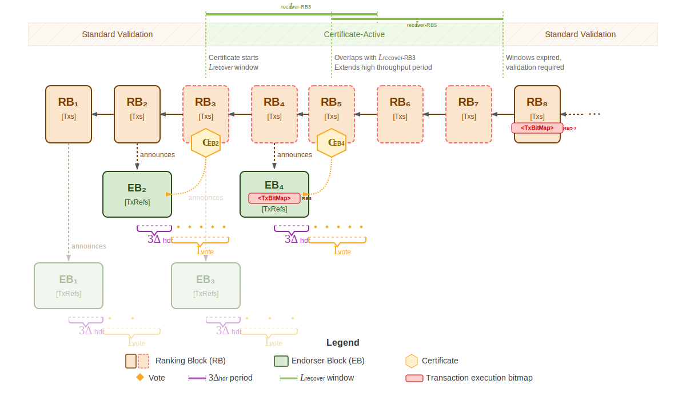

## Abstract

The anticipated growth of the Cardano ecosystem necessitates a fundamental
enhancement of network throughput to accommodate increasing transaction volumes
and support complex decentralized applications.

We propose Ouroboros Leios, a consensus protocol designed for high-throughput
operation while preserving Ouroboros Praos security properties. Block producers
simultaneously create both a standard Praos block and a larger secondary block
containing additional transactions. Secondary blocks undergo committee
validation before ledger inclusion, enabling significantly higher throughput.

This specification presents the first version of the Ouroboros Leios protocol
family, designed to deliver substantial throughput improvements with
economic sustainability and reduced complexity through fewer new protocol elements.

> [!NOTE]
>
> For comprehensive research documentation, development history, and additional
> technical resources, visit the
> Leios Innovation R&D site at [leios.cardano-scaling.org][leios-website].

<details>
  <summary><h2>Table of contents</h2></summary>
  <strong><font color="red">Create a table of contents with internal hyperlinks when the organization of the document is stable.</font></strong>
</details>

<details>
  <summary><h2>Table of figures and tables</h2></summary>

### Figures

- [Figure 1: Forecast of rewards on Cardano mainnet](#figure-1)
- [Figure 2: SPO profitability under Praos, as a function of transaction volume](#figure-2)
- [Figure 3: Ouroboros Leios Dual-Mode Operation](#figure-3)
- [Figure 4: Leios Protocol Flow](#figure-4)
- [Figure 5: Detailed protocol flow showing mode transitions and correction mechanisms](#figure-5)
- [Figure 6: Up- and downstream interactions of a node (simplified)](#figure-6)

### Tables

- [Table 1: Network Characteristics](#table-1)
- [Table 2: Leios Protocol Parameters](#table-2)
- [Table 3: Performance Metrics](#table-3)
- [Table 4: Feasible Protocol Parameters](#table-4)
- [Table 5: Operating Costs by IB Production Rate](#table-5)
- [Table 6: Required TPS for Infrastructure Cost Coverage](#table-6)
- [Table 7: Required TPS for Current Reward Maintenance](#table-7)
- [Table 8: Leios Mini-Protocols](#table-8)

</details>

## Motivation

Cardano's current throughput generally satisfies the immediate needs of its users. However, the Ouroboros Praos consensus protocol imposes inherent scalability limitations. To ensure timely and reliable global propagation of new blocks, the protocol requires that blocks be distributed across the network within a short time frame. This requirement forces a careful balance, restricting both the maximum size of individual blocks and the computational resources available for validating transactions and Plutus scripts. As a result, there is a fixed ceiling on the network's transaction throughput that cannot be raised by simply adjusting protocol parameters.

However, the dynamic growth of the Cardano ecosystem is increasingly revealing
the practical consequences of these inherent limitations. The Cardano mainnet
periodically experiences periods of significant congestion, where the volume of
transactions awaiting processing surpasses the network's ability to include them
in a timely manner. This congestion can lead to a tangible degradation in the
user experience, manifesting as delays in transaction confirmation. Moreover, it
poses substantial obstacles for specific use cases that rely on the efficient
processing of large volumes of transactions, such as the distribution of tokens
via airdrops, or the rapid and consistent updating of data by decentralized
oracles or partner chains.

The semi-sequential nature of block propagation in Ouroboros Praos, where blocks
are relayed from one block producer to the next across potentially
geographically distant nodes, is a key factor contributing to these limitations.
The necessity of completing this global dissemination within the few-second
period places a fundamental constraint on the rate at which new blocks, and
consequently the transactions they contain, can be added to the blockchain. This
architectural characteristic stands in contrast to the largely untapped
potential of the network's underlying infrastructure, where the computational
and bandwidth resources of individual nodes often remain significantly
underutilized.

To transcend these inherent scaling barriers and unlock the latent capacity of
the Cardano network, a measured evolution of the core consensus algorithm is
required. This specification presents the first version of the Ouroboros Leios
protocol family - a stepping stone toward higher throughput while preserving the
proven security and stability characteristics of Praos. This initial protocol
version extends Praos with optional secondary blocks and committee validation
to achieve significant increases in throughput while
maintaining familiar transaction semantics.

The Cardano Problem Statement [CPS-18 Greater Transaction Throughput][cps-18]
further motivates the need for higher transaction throughput and marshals
quantitative evidence of existing mainnet bottlenecks. Realizing higher
transaction rates is also necessary for long-term Cardano techno-economic
viability as rewards contributions from the Reserve pot diminish: fees from more
transactions will be needed to make up that deficit and keep sound the finances
of stakepool operations.

A major protocol upgrade like Leios will take
significant time to implement, test, and audit, it is important to began
implementation well before transaction demand on mainnet exceeds the
capabilities of Ouroboros Praos. The plot below shows the historically
diminishing rewards and a forecast of their continued reduction: the forecast is
mildly uncertain because the future pattern of staking behavior, transaction
fees, and node efficiency might vary considerably.

<div align="center">
<a name="figure-1" id="figure-1"></a>
<p>
  
</p>

_Figure 1: Forecast of rewards on Cardano mainnet_

</div>

Ouroboros Praos cannot support the high transaction volume needed to generate
the fees that will eventually be needed to offset the diminishing rewards.
However, as sustained throughput of transactions grows beyond 50 transactions
per second, there is more opportunity for simultaneously reducing fees,
augmenting the Treasury, and increasing SPO and delegator rewards.

<div align="center">
<a name="figure-2" id="figure-2"></a>
<p>
  
</p>

_Figure 2: SPO profitability under Praos, as a function of transaction volume_

</div>

The Leios protocol specified in this document represents a balance
between immediate scalability needs and long-term protocol evolution. The
approach prioritizes practical deployment and ecosystem compatibility while
establishing the foundation for subsequent protocol versions with higher
throughput capacity.

## Specification

Leios extends Ouroboros Praos by adding a second operating mode. The protocol switches between these two modes automatically based on network conditions and whether certificates appear in blocks. This lets the protocol keep all of Praos's security properties while processing more transactions when the network can handle it.

<div align="center">
  <a name="figure-3" id="figure-3"></a>
  <p name="dual-mode-figure">
    
  </p>

  <em>Figure 3: Ouroboros Leios Dual-Mode Operation</em>
</div>

The protocol operates in two modes:

<a name="conservative-mode"></a>**Conservative Mode (CM)** operates with the same transaction validation approach as today's Cardano protocol. Every transaction is fully validated before being included in a block, providing the same security guarantees. However, the protocol also handles certificate announcements and other Leios infrastructure in preparation for potential throughput increases.

<a name="high-throughput-mode"></a>**High-Throughput Mode (HTM)** activates when the network successfully certifies additional transaction capacity. This mode processes more transactions while keeping consensus security intact.

The protocol switches between modes automatically based on certificate inclusion. When the network can handle distributing and validating larger transaction volumes, it enters High-Throughput mode. When it can't, it stays in or returns to Conservative mode.

This design ensures the protocol never performs worse than today's Cardano protocol while delivering higher throughput when network conditions allow. The mode switches happen automatically according to protocol rules (detailed in the [Mode Transition Rules](#mode-transition-rules) section) without requiring any manual coordination from stake pool operators.

### HTM Protocol Flow

<div align="center">
  <a name="figure-4" id="figure-4"></a>
  <p name="protocol-flow-figure">
    
  </p>

  <em>Figure 4: Leios Protocol Flow</em>
</div>

The protocol operates through a five-step process that introduces new block types and validation mechanisms to achieve enhanced throughput.

#### Step 1: Block Production

When a stake pool wins block leadership, it **simultaneously** may create two
things:

1. **[Ranking Block (RB)](#ranking-blocks-rbs)**
A standard Praos block with extended header fields to optionally certify one previously announced EB and optionally announce one EB for the next subsequent RB to certify.
1. **[Endorser Block (EB)](#endorser-blocks-ebs)**
A larger block containing additional transaction references. There are no other ways to create EBs.

As shown in Figure 4, EBs may be announced in either CM or HTM - the protocol does not require being in HTM to announce an EB. The RB chain continues to be distributed exactly as in Praos, while Leios introduces a separate header distribution mechanism for rapid EB discovery and equivocation detection.

Due to the voting overhead per EB, nodes announce an EB only when the RB is full, they do not announce empty EBs.

#### Step 2: EB Distribution

Nodes receiving the RB header discover the announced EB and fetch its content. The EB contains references to transactions. If a node does not already possess a transaction referenced in the EB, it explicitly requests that transaction from peers.

#### Step 3: Committee Validation

A voting committee of stake pools validates the EB. As depicted in Figure 4, votes are collected during the $L_\text{vote}$ period following the EB announcement. Committee members are [selected via sortition](#committee-structure) (lottery based on stake). A committee member votes for an EB only if:

  1. It has received the EB within $L_\text{vote}$ slots from its creation,
  2. It has **not** received an equivocated RB header for this EB within $L_\text{vote}$ slots,
  3. The EB is the one announced by the latest RB in the voter's current chain,
  4. The EB's transactions form a **valid** extension of the RB that announced it.

where $L_\text{vote}$ is a protocol parameter represented by a number of slots.

#### Step 4: Certification

If enough committee votes are collected such that the total active stake exceeds a
**threshold** parameter ($\tau$), for example 60%, the EB becomes **certified**:

$$
\sum_{v \in \text{votes}} \text{stake}(v) \geq \tau \times \text{stake}_{\text{total-active}}
$$

This creates a compact **certificate** proving the EB's validity.

#### Step 5: Chain Inclusion

The certificate for an EB may be included in the body of a new ranking block `RB'` only if all of the following conditions hold:
  1. `RB'` directly extends the RB which announced this EB (as illustrated in Figure 4 where `RB'` contains the certificate for the EB announced by the preceding RB).
  2. The certificate is valid as defined in [Certificate Validation](#certificate-validation).
  3. If the EB contains `tx_corrections`, these corrections must be applied to identify invalid transactions from previous RBs (correction mechanisms are detailed in the following [Transaction Validation](#transaction-validation) section).

This **conditional inclusion** ensures transaction availability to honest nodes with good probability while achieving higher throughput. When included:

- The certified EB's transactions become part of the permanent ledger
- Throughput increases significantly for that segment of the chain
- If timing is insufficient, only the standard RB is included (maintaining Praos baseline)

#### Mode Transition Rules

The protocol manages transitions between CM and HTM through simple, deterministic rules:

**CM → HTM Transition**: The protocol enters HTM when a RB includes a valid certificate for an EB. This certificate serves as proof that the network successfully validated additional transaction capacity. As shown in Figure 5 below, the transition to HTM occurs when RB<sub>3</sub> includes the certificate, even though the EB announcement may have occurred while still in CM - RB<sub>2</sub> announcing EB<sub>1</sub>.

**HTM → CM Transition**: The protocol returns to CM if no certificate has been included for $L$<sub>recover</sub> consecutive slots since the last certificate was included in an RB. This recovery period ensures that all nodes have sufficient time to synchronize any delayed EBs. The countdown resets each time a new certificate is included. As shown in Figure 5 below, this occurs after $L$<sub>recover</sub> slots following the last certificate in RB<sub>5</sub>.

<div align="center">
<a name="figure-5" id="figure-5"></a>
<p name="mode-transitions-figure">
  
</p>

_Figure 5: Detailed protocol flow showing mode transitions and correction mechanisms_

</div>

<a id="transaction-validation" href="#transaction-validation"></a>**Transaction Validation**

The dual-mode design introduces a fundamental difference for transaction validation:

**In CM**: Block producers always have access to the complete ledger state and must validate all transactions before including them in blocks. RBs containing invalid transactions are rejected by honest nodes, maintaining the standard Praos validation guarantees.

**In HTM**: Block producers may need to create RBs before receiving all previously certified EBs due to network delays. Without these EBs, they cannot construct the complete ledger state or determine which transactions in their mempool are valid. This creates a dilemma: wait (potentially violating Praos timing constraints) or proceed with potentially invalid transactions.

Leios resolves this by allowing RBs in HTM to temporarily include <a name="unvalidated-transactions"></a>**unvalidated transactions** - transactions whose validity cannot be confirmed due to incomplete ledger state. This ensures honest block producers can always fulfill their duties without violating protocol timing requirements. As shown in Figure 5, all RBs produced during HTM period (RB<sub>3</sub> through RB<sub>7</sub>, marked with red dashed borders) may contain such unvalidated transactions.

As a direct consequence of allowing unvalidated transactions, the protocol must implement **correction mechanisms** to identify and exclude any transactions that later prove to be invalid. Figure 5 illustrates two types of these corrections:

- **EB corrections**: EB<sub>2</sub> includes a `[TxIdx]` field (shown in red) that identifies invalid transactions from previous RBs that should not be executed. These also get referenced in the subsequent following RB (see RB<sub>5</sub> referencing the transaction corrections from EB<sub>2</sub>) - more on that later in <a href="#eb-corrections">EB corrections</a>.
- **Mode transition corrections**: RB<sub>8</sub> (the first RB after returning to CM) includes a `[TxIdx]` field listing all invalid transactions from the HTM period that were not already corrected by EB certificates (see RB<sub>8</sub> transaction correction list spanning RB<sub>5-7</sub>). More details follow in the <a href="#rb-corrections">RB corrections</a>.

The timing constraints that enable these correction mechanisms are also shown in Figure 5:
- <a id="l-vote" href="#l-vote"></a>**$L_\text{vote}$ periods** (timing brackets under each EB): Define when committee members can vote on EBs, ensuring sufficient time for EB diffusion and validation before certification (see [Protocol Parameters](#protocol-parameters) for constraints)
- <a id="l-recover" href="#l-recover"></a>**$L_\text{recover}$ period** (rolling countdown from the latest certificate): Ensures all nodes have time to receive certified EBs before returning to CM; the countdown resets whenever a new certificate is included. Only after $L_\text{recover}$ consecutive slots without any certificate does the protocol return to CM. This makes the edge case of missing EBs exponentially unlikely.

These parameters are critical for protocol safety and their constraints are defined in the [Protocol Parameters](#protocol-parameters) section and feasible values discussed in TODO - rationale feasiable protocol parameters.

> [!NOTE]
> **Edge Case: Delayed EB Synchronization**
> 
> When a node transitions from [High-Throughput mode (HTM)](#high-throughput-mode) to [Conservative mode (CM)](#conservative-mode) but has not yet received all certified EBs, it must wait to synchronize before producing new blocks or adopting longer chains. Without the complete ledger state from all certified EBs, the node cannot identify which transactions from the HTM period were invalid and thus cannot create the necessary corrections in its first CM block. The protocol parameter $L_\text{recover}$ is designed to prevent this scenario.

### Protocol Component Details

The protocol extends Praos with three main elements:

#### Ranking Blocks (RBs)

RBs are Praos blocks extended to support Leios by optionally announcing EBs in their headers and embedding EB certificates in their bodies.

1. **Header additions**:
   - `announced_eb` (optional): Hash of the EB created by this block producer
   - `certified_eb` (optional): Hash of the EB being certified by this RB

2. **Body additions**:
   - `eb_certificate` (optional): certificate proving EB availability & validity
   - `tx_corrections` (optional): list of transaction indices that failed validation

<a id="rb-inclusion-rules" href="#rb-inclusion-rules"></a>**Inclusion Rules**: When an RB header includes a `certified_eb` field, the corresponding body must include a matching `eb_certificate`. Conversely, an `eb_certificate` can only be included when a `certified_eb` field references the EB being certified.

<a id="rb-corrections" href="#rb-corrections"></a>**Mode Transition Corrections**: When transitioning from HTM to CM, the `tx_corrections` field in the first RB after $L$<sub>recover</sub> slots without a certificate must list all remaining invalid transactions from the HTM period not already corrected by certificates. This ensures the ledger is fully validated before CM resumes.

> [!WARNING]
> **TODO:** Add transaction confirmation levels and their implications for applications

Transactions from certified EBs are included in the ledger alongside direct RB transactions.

#### Endorser Blocks (EBs)

EBs are produced by the same stake pool that created the corresponding announcing RB and reference additional transactions to increase throughput beyond what can be included directly in the RB.

<a id="eb-structure" href="#eb-structure"></a>**EB Structure**: EBs have a simplified structure without header/body separation:
- `transaction_references`: List of transaction references (hashes)
- `tx_corrections`: List of transaction indices from RBs that failed validation

<a id="eb-corrections" href="#eb-corrections"></a>**EB Correction Mechanism**: The `tx_corrections` field serves a critical role in maintaining ledger integrity during High-Throughput mode. When validators create an EB certificate, they verify which transactions from recent RBs are valid given the complete ledger state. Any invalid transactions are identified by their indices and included in both the EB and its certificate. This ensures that:
- Invalid transactions are continuously tracked as long as EBs are certified
- Light nodes can determine transaction execution status without downloading full EBs
- The ledger state remains consistent despite temporary inclusion of unvalidated transactions

When an EB is announced in an RB header via the `announced_eb` field, a voting period begins as described in [Votes and Certificates](#votes-and-certificates). Only RBs that directly extend the announcing RB are eligible to certify the announced EB by including a certificate.

The hash referenced in RB headers (`announced_eb` and `certified_eb` fields) is computed from the complete EB structure and serves as the unique identifier for the EB.

#### Votes and Certificates

Leios employs a BLS-based voting and certificate scheme where committee members cast votes that reference specific EBs, which are then aggregated into compact certificates for inclusion in RBs.

The implementation meets the <a href="#appendix-a-requirements">requirements for votes and certificates</a> specified in Appendix A. Alternative schemes satisfying these requirements could be substituted, enabling unified voting infrastructure across Ouroboros Leios, Ouroboros Peras, and other protocols.

To participate in the Leios protocol as voting member/ block producing node, stake pool operators must register one additional BLS12-381 key alongside their existing VRF and KES keys.

<a id="committee-structure" href="#committee-structure"></a>**Committee Structure**: Two types of voters validate EBs, balancing security, decentralization, and efficiency:
- **Persistent Voters**: Selected once per epoch using [Fait Accompli sortition][fait-accompli-sortition], vote in every election, identified by compact identifiers
- **Non-persistent Voters**: Selected per EB via local sortition with Poisson-distributed stake-weighted probability

This dual approach prevents linear certificate size growth by leveraging non-uniform stake distribution, enabling faster certificate diffusion while maintaining broad participation.

<a id="vote-structure" href="#vote-structure"></a>**Vote Structure**: All votes include the `endorser_block_hash` field that uniquely identifies the target EB:
- **Persistent votes**:
  - `election_id`: Identifier for the voting round
  - `persistent_voter_id`: Epoch-specific pool identifier
  - `endorser_block_hash`: Hash of the target EB
  - `vote_signature`: BLS signature
- **Non-persistent votes**:
  - `election_id`: Identifier for the voting round
  - `pool_id`: Pool identifier
  - `eligibility_signature`: BLS proof of sortition eligibility
  - `endorser_block_hash`: Hash of the target EB
  - `vote_signature`: BLS signature

<a id="certificate-validation" href="#certificate-validation"></a>**Certificate Validation**: When an RB includes an EB certificate, nodes must validate the following before accepting the block:

1. **CDDL Format Compliance**: Certificate structure matches the specification format defined in <a href="#votes-certificates-cddl">Appendix B: Votes and Certificates CDDL</a>
2. **Cryptographic Signatures**: All BLS signatures are validGiven the voting overhead per EB, EBs should only be announced if the base RB is full. In other words, empty EBs should not be announced in the network as they induce a non-zero cost.

3. **Voter Eligibility**: 
   - Persistent voters must have been selected as such by the [Fait Accompli scheme][fait-accompli-sortition] for the current epoch
   - Non-persistent voters must provide valid sortition proofs
4. **Stake Verification**: Total voting stake meets the required quorum threshold
5. **EB Consistency**: Certificate references the correct EB hash announced in the preceding RB

Detailed specifications, performance, and benchmarks are available in the [BLS certificates specification][bls-spec].

> [!NOTE]
> **Vote Bundling**
> 
> The linked BLS specification mentions vote bundling as an optimization. However, this only applies when EB production is decoupled from RBs, which is not the case in this specification where each EB is announced by an RB.

### Network Characteristics and Protocol Parameters

The following sections distinguish between observed **network characteristics** (which depend on topology and node capabilities) and tunable **protocol parameters** (which can be adjusted via governance).

<a id="network-characteristics" href="#network-characteristics"></a>**Network Characteristics**

These are observed properties of the network topology and node capabilities:

<div align="center">
<a name="table-1" id="table-1"></a>

| Characteristic            |       Symbol        | Units | Description                                                 |          Typical Range          | Notes                                              |
| ------------------------- | :-----------------: | :---: | ----------------------------------------------------------- | :-----------------------------: | -------------------------------------------------- |
| RB diffusion time         | $\Delta_\text{RB}$  | slot  | Observed upper bound for RB diffusion and adoption to all nodes     |            2-6 slots            | Depends on network topology and conditions         |
| RB header diffusion time  | $\Delta_\text{hdr}$ | slot  | Observed time for RB headers to reach all nodes                 |     $\leq \Delta_\text{RB}$     | Usually faster than full block diffusion           |
| EB diffusion time         | $\Delta_\text{EB}$  | slot  | Observed upper bound for EB diffusion, transaction retrieval, and ledger state building at all nodes when no competing or fresher blocks exist    |            $\geq \Delta_\text{RB}$            | Slower than RBs due to larger size and additional processing requirements          |

_Table 1: Network Characteristics_

</div>

<a id="protocol-parameters" href="#protocol-parameters"></a>**Protocol Parameters**

These parameters are configurable and subject to governance decisions,
constrained by the network characteristics above:

<div align="center">
<a name="table-2" id="table-2"></a>

| Parameter                     |    Symbol     |  Units   | Description                                                            |                   Constraints                   | Rationale                                                     |
| ----------------------------- | :-----------: | :------: | ---------------------------------------------------------------------- | :---------------------------------------------: | ------------------------------------------------------------- |
| Voting period length          | $L_\text{vote}$ |   slot   | Duration during which committee members can vote on endorser blocks    | $L_\text{vote} > 3\Delta_\text{hdr}$ | Must allow EB diffusion and equivocation detection before voting; the constraint ensures sufficient time for header propagation and equivocation detection before voting begins. <br /><br />**Liveness**: To ensure that honest EBs are certified most of the time, $L_\text{vote}$ should be set so that there is enough time for an honestly produced EB to be diffused and processed by a large fraction of the network, assuming no other "fresher" RB is produced in the same period |
| Vote diffusion period length | $L_\text{diff}$ |   slot   | Duration for vote propagation after voting period ends                | $L_\text{diff} > \Delta_\text{EB}$ | Must ensure most honest parties receive EBs diffused near end of $L_\text{vote}$ before certificate inclusion |
| Ranking block max size        | $S_\text{RB}$ |  bytes   | Maximum size of a ranking block                                        |                $S_\text{RB} > 0$                | Limits RB size to ensure timely diffusion                     |
| Endorser-block referenceable transaction size | $S_\text{EB-tx}$ |  bytes   | Maximum total size of transactions that can be referenced by an endorser block |                $S_\text{EB-tx} > 0$                | Limits total transaction payload to ensure timely diffusion within stage length |
| Endorser block max size       | $S_\text{EB}$ |  bytes   | Maximum size of an endorser block itself                               |                $S_\text{EB} > 0$                | Limits EB size to ensure timely diffusion; prevents issues with many small transactions |
| Praos active slot coefficient | $f_\text{RB}$ |  1/slot  | Probability that a party will be the slot leader for a particular slot |       $0 < f_\text{RB} \leq \Delta_\text{RB}^{-1}$        | Blocks should not be produced faster than network delay       |
| Mean committee size           |      $n$      | parties  | Average number of stake pools selected for voting                      |                     $n > 0$                     | Ensures sufficient decentralization and security              |
| Quorum size                   |    $\tau$     | fraction | Minimum fraction of committee votes required for certification         |                  $\tau > 0.5$                   | Prevents adversarial control while ensuring liveness          |

_Table 2: Leios Protocol Parameters_

</div>

> [!NOTE]
> **EB Size Constraints**
> 
> Two separate parameters control EB sizes:
> - $S_\text{EB}$ limits the size of the EB data structure itself, preventing issues when many small transactions create large numbers of transaction references (32 bytes each)
> - $S_\text{EB-tx}$ limits the total size of transactions that can be referenced, controlling the actual transaction payload
> 
> For example, an EB referencing 10,000 transactions of 100 bytes each would have $S_\text{EB-tx} = 1$ MB but the EB itself would be at least 320 KB just for the transaction hashes.

### Node Behavior

The Leios protocol introduces new node responsibilities and message flows beyond those in Praos, reflecting the additional steps of EB creation and announcement, committee voting, and certificate aggregation. The following sections detail the specific behaviors that nodes must implement.

<div align="center">
<a name="figure-6" id="figure-6"></a>


_Figure 6: Up- and downstream interactions of a node (simplified)_

</div>

The diagram above illustrates the Leios protocol in a simplified sequential order. In practice, these operations occur concurrently and the actual execution order depends on network conditions, timing, and node state. While many steps introduce new behaviors, several core Praos mechanisms remain unchanged.

**Chain selection** follows the longest-chain rule exactly as in Praos. EBs are treated as auxiliary data that do not affect chain validity or selection decisions. Fork choice depends solely on RB chain length, with EB certificates serving only as inclusion proofs for transaction content. This design ensures the protocol maintains liveness - the RB chain can continue growing even if some EBs fail to achieve certification, with RBs simply excluding uncertified EBs and validating transactions against the predecessor RB's ledger state.

#### Transaction Diffusion
    
<a id="transaction-propagation" href="#transaction-propagation"></a>**Transaction Propagation**: Uses the TxSubmission mini-protocol exactly as implemented in Praos. Transactions flow from downstream to upstream nodes through diffusion, where they are validated against the current ledger state before being added to local mempools. The protocol maintains the same FIFO ordering and duplicate detection mechanisms.

<a id="mempool-design" href="#mempool-design"></a>**Mempool Design**: The mempool follows the same design as current Praos deployment with increased capacity to support both RB and EB production. Mempool capacity must accommodate expanded transaction volume:

<div align="center">

$\text{Mempool} \geq 2 \times S_\text{RB} + S_\text{EB-tx}$

</div>
    
#### RB Block Production and Diffusion
    
When a stake pool wins block leadership (step 1), they simultaneously create two things: a RB and an EB. The RB is a standard Praos block with extended header fields to certify one EB and announce another EB. The EB is a larger block containing additional transaction references. The RB chain continues to be distributed exactly as in Praos, while Leios introduces a separate header distribution mechanism for rapid EB discovery and equivocation detection.

<a id="rb-header-diffusion" href="#rb-header-diffusion"></a>**RB Header Diffusion**: RB headers diffuse via a new [RbHeaderRelay mini-protocol](#rbheaderrelay-mini-protocol) independently of standard ChainSync (steps 2a and 2b). This separate mechanism enables rapid EB discovery within the strict timing bound $\Delta_\text{hdr}$. Headers are diffused freshest-first to facilitate timely EB delivery, with nodes propagating at most two headers per (slot, issuer) pair to detect equivocation—where an attacker creates multiple EBs for the same block generation opportunity—while limiting network overhead. The header contains the EB hash when the block producer created an EB, allowing peers to discover and fetch the corresponding EB.

<a id="rb-body-diffusion" href="#rb-body-diffusion"></a>**RB Body Diffusion**: After receiving headers, nodes fetch RB bodies via standard BlockFetch protocol (step 3). This employs ChainSync and BlockFetch protocols without modification for fetching complete ranking blocks after headers are received. The pipelining and batching optimizations for block body transfer remain unchanged from Praos.

<a id="rb-validation-adoption" href="#rb-validation-adoption"></a>**Validation and Adoption**: Nodes validate the RB and any included EB certificate before adopting the block (step 4). This includes cryptographic verification of certificates and ensuring they correspond to properly announced EBs. The complete validation procedure is detailed in [certificate validation](#certificate-validation). Once adopted, the node serves validated RBs to downstream peers using standard Praos block distribution mechanisms (step 5).
    
#### EB Diffusion

Whenever an EB is announced through an RB header, nodes must fetch the EB content promptly (step 6), such that they receive it within $L_\text{vote}$ and consequently enables them to vote. Only the EB body corresponding to the first EB announcement/RB header received for a given RB creation opportunity should be downloaded (freshest-first diffusion). The EB contains references to transactions, and nodes do not serve the EB to peers until they have all referenced transactions.

<a id="eb-chain-selection" href="#eb-chain-selection"></a>**EB Propagation for Chain Selection**: To support efficient chain selection, nodes must receive **all EBs from competing forks**, not only those in their current preferred chain. This ensures that when a node switches to a different fork due to the longest-chain rule, it can immediately validate the new chain without additional EB propagation delays. EBs are forwarded before complete validity checks when full ledger state validation is impossible, with only lightweight verification (VRF checks, hash consistency, basic structure validation) performed initially to prevent DoS attacks.

> [!Warning]
> 
> **TODO**
> Clarify if this is optimistic enough, or whether nodes should announce EBs before having all transactions available or make use of optimization by offering "chunks" of the transaction reference list.

<a id="transaction-retrieval" href="#transaction-retrieval"></a>**Transaction Retrieval**: Nodes check transaction availability for the EB and fetch any missing transactions from peers (steps 6a and 7a). Once all transactions are available, nodes can serve EBs to downstream peers (step 7). This guarantees that when a node announces an EB its downstream peers can trust it has all EB transactions available.
    
<a id="eb-transaction-validation" href="#eb-transaction-validation"></a>**Transaction Validation**: With all transactions available, nodes validate the endorsed transaction sequence against the appropriate ledger state (step 8), ensuring the transactions form a valid extension of the announcing RB and meet size constraints. All endorsed transactions are also added _optimistically_ to the beginning of the mempool and the mempool is revalidated. This ensures that EB transactions are not lost should the EB not get certified.
    
> [!WARNING]
> - Why do we need to add transactions to the mempool? If we get to endorse txs next, our mempool is already fine as is?
> - Stop serving an EB if we determined the endorsed sequence of transactions as invalid?

#### Voting & Certification

<a id="VotingEB" href="#VotingEB"></a>**Voting Process**: Committee members [selected through a lottery process](#votes-and-certificates) vote on EBs as soon as vote requirements are met according to protocol (step 10). An honest node casts only one vote for the EB extending its current longest chain.
    
<a id="VoteDiffusion" href="#VoteDiffusion"></a>**Vote Propagation**: Votes propagate through the network during the vote diffusion period ($L_\text{diff}$ slots) (steps 11 and 11a). While nodes forward votes on EBs across all candidate chains, they only forward at most one vote per committee member per slot.
    
> [!WARNING]
> - How long should votes be propagated? Only between (EB_slot + L_vote) and (EB_slot + L_vote + L_diff)?
> - Request and handle receival of votes for an EB which is not fully validated?

<a id="CertificateAggregation" href="#CertificateAggregation"></a>**Certificate Construction**: Nodes receive votes from upstream peers, maintaining a running tally for each EB to track progress toward the quorum threshold (step 12). When enough votes are collected during the vote diffusion period, nodes aggregate them into a compact certificate. This creates a cryptographic proof that the EB is valid and has received sufficient committee approval.
    
#### Next Block Production

<a id="certificate-inclusion" href="#certificate-inclusion"></a>**Certificate Inclusion**: Block producers creating new RBs include certificates for EBs where the full stage duration ($L_\text{vote} + L_\text{diff}$ slots) has elapsed since the EB's creation (step 13). The producer may also announce a new EB extending their RB. When an EB certificate is included, the referenced EB's transactions become part of the permanent ledger state and are removed from the mempool accordingly. 
    
> [!Important]
> **Validation Dependencies** 
> 
> Including an EB certificate creates a dependency - downstream nodes cannot validate the RB until they receive the referenced EB. This could delay RB propagation beyond Praos timing assumptions ($\Delta_\text{RB}$) if EB propagation is slow. Protocol parameters must ensure that by the time certificate inclusion is allowed, the EB is already available to all honest nodes. Specifically, $L_\text{diff} > \Delta_\text{EB}$ ensures EBs reach all nodes before certificate inclusion, preventing RB validation delays that could violate the $\Delta_\text{RB}$ bound.

#### Ledger Management

<a id="ledger-formation" href="#ledger-formation"></a>**Ledger Formation**: Transactions in RBs and EBs within a chain are required to be non-conflicting, following the same ledger design as Praos with the addition of certificate handling and EB attachment references. The ledger state is updated according to the same validation rules used in Praos, with phase-1 and phase-2 validation applying equally to both RB and EB transactions.

<a id="ledger-state-transitions" href="#ledger-state-transitions"</a>**State Transitions**: EBs add transactions to the ledger only when properly certified and included via RB references. RBs can include both certificates and their own transactions. The ledger state for validating RB transactions is constructed based on either the predecessor RB (when no EB certificate is included) or the certified EB (when a valid certificate is present).

<a id="chain-selection" href="#chain-selection"></a>**Chain Selection**: In case of a chain switch due to a fork, nodes can skip verifying smart contracts included in certified EBs to accelerate chain adoption while maintaining security guarantees. This optimization allows for faster synchronization without compromising the security properties inherited from the certificate validation process. The [EB propagation for chain selection](#eb-chain-selection) requirement ensures that nodes already possess all necessary EBs from alternative forks, eliminating additional propagation delays during fork switches.

<a id="mempool-capacity" href="#mempool-capacity"></a>**Mempool Capacity Requirements**: The mempool must accommodate both RB and EB transaction production. The capacity requirements are significantly increased compared to Praos to handle the additional transaction volume expected from EB production. When an EB is received and validated, its transactions should be added optimistically to the beginning of the mempool to ensure they are not lost if the EB fails to achieve certification.

#### Epoch Boundary

<a id="persistent-voter-computation" href="#persistent-voter-computation"></a>**Persistent Voter Computation**: At epoch boundaries, nodes must compute the set of persistent voters for the next epoch using the [Fait Accompli scheme][fait-accompli-sortition]. This computation uses the stake distribution fixed at the epoch boundary and represents a minimal computational overhead based on current [BLS certificates benchmarks](https://github.com/input-output-hk/ouroboros-leios/blob/main/crypto-benchmarks.rs/Specification.md#benchmarks-in-rust). The computation must be completed before the next epoch begins to enable voting participation.

### Network

As outlined above, Leios splits transactions between RBs and EBs, with EB inclusion dependent on committee voting and certification. Unlike Ouroboros Praos where the RB chain contains all necessary data, Leios nodes require additional message types to:

- **Reconstruct ledger state**: EBs containing certified transactions
- **Participate in consensus**: Vote on EBs and construct certificates  
- **Detect equivocation**: RB headers from competing forks

#### Praos Mini-Protocols

As described in [Node Behavior](#node-behavior), existing Praos mini-protocols continue to operate with only minor modifications to support Leios. ChainSync exchanges RB headers that now include optional fields for EB announcements (`announced_eb`) and certifications (`certified_eb`). BlockFetch retrieves RB bodies that may contain BLS aggregate certificates (`eb_certificate`) alongside standard transactions. TxSubmission remains unchanged except for expanded mempool capacity to support both RB and EB transaction pools.

#### Leios Mini-Protocols

Leios introduces **five new mini-protocols** to handle the additional message types required for EB distribution, voting, and certificate construction.

<div align="center">
<a name="table-8" id="table-8"></a>

| **Protocol** | **Purpose** | **Timing Constraint** |
| :----------: | ----------- | --------------------- |
| **RbHeaderRelay** | Diffuse RB headers for equivocation detection | Must achieve $\Delta_\text{hdr}$ diffusion |
| **EbRelay** | Diffuse fresh EBs to enable timely validation | Must reach voters within $L_\text{vote}$ |  
| **VoteRelay** | Diffuse valid votes for certificate aggregation | Must diffuse within $L_\text{diff}$ |
| **EbFetch** | Retrieve certified EBs for chain reconstruction | On-demand after certificate inclusion |
| **TxFetch** | Retrieve referenced transactions for EB validation | Before EB validation completes |

_Table 8: Leios Mini-Protocols_

</div>

These protocols implement freshest-first delivery and cryptographic validation to meet their respective timing constraints while preventing spam and DoS attacks.

##### RbHeaderRelay Mini-Protocol

This protocol diffuses RB headers across the network within $\Delta_\text{hdr}$ slots to enable equivocation detection, distributing only headers (not full blocks) to meet this timing bound. By avoiding full block validation, it ensures that all nodes receive RB headers before voting begins, maintaining awareness of all competing chains and equivocations across the network.

**Mini-Protocol Overview**

RbHeaderRelay is a **pull-based relay protocol** that enables nodes to request and receive RB headers from peers. It implements the Relay mini-protocol pattern used in Ouroboros networks for transaction submission, extended with equivocation-aware rules to ensure all nodes can detect competing chains.

**Key Properties**:
- **Pull-based design**: Nodes request headers from peers, preventing DoS attacks
- **Freshest-first delivery**: Prioritizes recent headers over historical ones
- **Equivocation handling**: Serves at most two headers per (slot, issuer) pair
- **Cryptographic validation**: Signature and VRF verification before serving
- **Universal availability**: Headers served regardless of fork preference

##### EbRelay Mini-Protocol  

> [!Warning]
> **TODO**: Protocol specification

##### VoteRelay Mini-Protocol

> [!Warning]
> **TODO**: Protocol specification

##### EbFetch Mini-Protocol

> [!Warning]
> **TODO**: Protocol specification

##### TxFetch Mini-Protocol

> [!Warning]
> **TODO**: Protocol specification


### Incentives

> [!Warning]
>
> This section is work in progress.

- Reward EB creation, even if some EBs are not included in the final chain
- Motivate voter participation, while blocking system gaming
- Distribute fees among EB producers, main block producers, and voters

## Rationale

### How Leios addresses CPS-18 and increases throughput

The [Leios research paper][leios-paper] describes a highly concurrent protocol with three block types - Input Blocks (IBs), Endorser Blocks (EBs), and Ranking Blocks (RBs)-produced independently across decoupled, pipelined stages. This specification simplifies that design by eliminating IBs and coupling EB production with RB production, reducing complexity while preserving substantial throughput gains.

This simplification avoids the complexity and ecosystem disruption of implementing massive throughput increases immediately, while still delivering substantial gains to address [CPS-18 Greater Transaction Throughput][cps-18] challenges. Four strategic design priorities guided this approach:

1. [Economic sustainability](#economic-sustainability)
2. [Reasonable time to market](#time-to-market)
3. [Minimal downstream impact](#downstream-impact)
4. [Competitive positioning](#competitiveness)

<a name="economic-sustainability"></a>**1. Economic sustainability: Capacity without utilization risk**

On one hand, this approach avoids over-engineering massive throughput capacity without proven demand. Creating fundamental system changes to support multiple orders of magnitude more throughput adds to the cost of running a more expensive, more capable system that doesn't pay for itself until utilization increases.

On the other hand, the minimum economic requirement establishes the lower bound. As the Cardano Reserve diminishes, transaction fees must replace rewards to maintain network security and SPO profitability. Currently, the Reserve contributes more than 85% of epoch rewards, with less than 15% coming from transaction fees. By 2029, to compensate for Reserve depletion, the network requires approximately 36-50 TPS with average-sized transactions - roughly 10 times current mainnet throughput. This conservative lower bound represents the breakeven point for running the protocol sustainably.

However, TPS isn't a good metric for defining these bounds. To properly assess economic breakeven points, we measure throughput in Transaction Bytes per second (TxB/s) rather than Transactions per second (TPS). TPS doesn't account for transaction size or computational complexity, making systems with smaller transactions appear "faster" while providing less utility. Current Cardano mainnet provides 4,500 TxB/s, while this specification targets 140,000-300,000 TxB/s (equivalent to roughly 100-200 TPS) - a 30-65x increase sufficient for economic sustainability.

Achieving this capacity increase requires trade-offs, as detailed below.

<a name="time-to-market"></a>**2. Reasonable time to market: Complexity trade-offs**

The linearization approach eliminates complex distributed systems problems around transaction sharding, conflict resolution, and sophisticated mempool coordination that could delay deployment by years. It also maintains familiar transaction semantics, deterministic ordering, and predictable finality patterns that existing dApps and infrastructure depend on today.

<a name="downstream-impact"></a>**3. Minimal downstream impact: Ecosystem preservation**

Beyond preserving transaction behavior, the design minimizes infrastructure and operational disruption for the existing ecosystem. The proposed protocol still functions as an overlay extending Praos - just like the research paper version, allowing SPOs to upgrade progressively without coordinated migrations. 

The most obvious approach to increasing throughput while minimizing disruption would be simply increasing Praos block sizes. However, this naive alternative would create proportionally longer propagation times that violate Praos timing assumptions and lack sufficient scalability for long-term viability.

<a name="competitiveness"></a>**4. Competitive positioning**

The coupled block production design can be extended towards higher concurrency models, as demonstrated in simulation results. It maintains compatibility with more aggressive scaling approaches including full Leios variants, EB and IB (input block) decoupling, and sharding extensions, ensuring current throughput gains don't preclude 100x+ improvements when chain growth solutions mature.

<a name="optimal-tradeoffs"></a>**Conclusion**

This linearization proposal balances all four priorities. A delivered 30-65x improvement provides substantially more value than the research paper's higher-concurrency variants, which would impose costs on existing dApps, wallets, and infrastructure while taking significantly longer to build.

The following evidence section shall provide quantitative support for these trade-offs and validate the protocol's performance under realistic network conditions.

### Evidence

This section provides protocol simulation results, feasible protocol parameters with justifications, node-level simulation results, and operating cost analysis that support the design decisions outlined in the rationale.

<a name="performance-metrics"></a>**Performance metrics**

> [!NOTE]
>
> This is a preliminary set of metrics that will be finalized when the Leios
> protocol variants are finalized and the simulation studies are complete.

The performance of a protocol like Leios can be characterized in terms of its
efficient use of resources, its total use of resources, the probabilities of
negative outcomes due to the protocol's design, and the resilience to adverse
conditions. Metrics measuring such performance depend upon the selection of
protocol parameters, the network topology, and the submission of transactions.
The table below summarizes key metrics for evaluating Leios as a protocol and
individual scenarios (parameters, network, and load).

<div align="center">
<a name="table-3" id="table-3"></a>

| Category   | Metric                                                    | Measurement                                                                                                     |
| ---------- | --------------------------------------------------------- | --------------------------------------------------------------------------------------------------------------- |
| Efficiency | Spatial efficiency, $`\epsilon_\text{spatial}`$           | Ratio of total transactions size to persistent storage                                                          |
|            | Temporal efficiency, $`\epsilon_\text{temporal}(s)`$      | Time to include transaction on ledger                                                                           |
|            | Network efficiency, $`\epsilon_\text{network}`$           | Ratio of total transaction size to node-averaged network usage                                                  |
| Protocol   | TX inclusion, $`\tau_\text{inclusion}`$                   | Mean number of slots for a transaction being included in any EB                                                 |
|            | Voting failure, $`p_\text{noquorum}`$                     | Probability of sortition failure to elect sufficient voters for a quorum                                        |
| Resource   | Network egress, $`q_\text{egress}`$                       | Rate of bytes transmitted by a node                                                                             |
|            | Disk usage, $`q_\text{disk}`$                             | Rate of persistent bytes stored by a node                                                                       |
|            | I/O operations, $`\bar{q}_\text{iops}(b)`$                | Mean number of I/O operations per second, where each operation writes a filesystem block of $`b`$ bytes         |
|            | Mean CPU usage, $`\bar{q}_\text{vcpu}`$                   | Mean virtual CPU cores used by a node                                                                           |
|            | Peak CPU usage, $`\hat{q}_\text{vcpu}`$                   | Maximum virtual CPU cores used by a node over a one-slot window                                                 |
| Resilience | Bandwidth, $`\eta_\text{bandwidth}(b)`$                   | Fractional loss in throughput at finite bandwidth $`b`$                                                         |
|            | Adversarial stake, $`\eta_\text{adversary}(s)`$           | Fractional loss in throughput due to adversial stake of $`s`$                                                   |
| Fees       | Collateral paid for success, $`\kappa_\text{success}(c)`$ | Average collateral paid for a successful transaction when it conflicts with a fraction $`c`$ of the memory pool |
|            | Collateral paid for failure, $`\kappa_\text{failure}(c)`$ | Average collateral paid for a failed transaction when it conflicts with a fraction $`c`$ of the memory pool     |

_Table 3: Performance Metrics_

</div>

**_Spatial efficiency:_** Leios necessarily imposes some disk overhead beyond
the raw bytes needed to store transactions themselves. This overhead includes
the EBs and RBs associated with storing transactions. The spatial efficiency
metric is defined as the ratio of the total bytes of transactions included in
the ledger to the total persistent storage required by the protocol.

$$
`
\epsilon_\text{spatial} = \frac{\text{total bytes of transactions included in the ledger}}{\text{total bytes of EBs and RBs}}
`
$$

**_Temporal efficiency:_** As is true for Praos, there is a delay between
submitting a transaction and its being included in the ledger and there is a
finite chance that it never is included in the ledger. Before a transaction is
eligible to be included in a new IB, it must be validated and placed in the
memory pool. It is cleanest to measure the time from the transaction reaching
the local memory pool of the node where it was submitted to the time when it is
included in the ledger, via a Praos block. The same metric applies both to Praos
and to Leios. In aggregate, we measure the temporal efficiency as the fraction
of transactions that reach the ledger, as function of the number of slots
elapsed. The quantity $`\epsilon_\text{temporal}(\infty)`$ is the fraction of
submitted transactions that ever reach the ledger.

$$
`
\epsilon_\text{temporal}(s) = \text{fraction of transactions included in the ledger within } s \text{ slots of their inclusion in a local memory pool}
`
$$

**_Network efficiency:_** Effective utilization of the network can be
characterized by the ratio of bytes of transactions reaching the ledger to the
average network traffic per node. (This could also be computed individually for
each node and used as a local metric.)

$$
`
\epsilon_\text{network} = \frac{(\text{bytes of valid transactions reaching the ledger}) \cdot (\text{number of nodes in the network})}{\text{total bytes of network traffic}}
`
$$

**_TX inclusion:_** In Leios, it is possible that a transaction might have to
wait for multiple EB production opportunities before being included in an EB.
The characteristic time for such inclusion in an EB depends on the EB production
rate and mempool management. This is correlated with how long the transaction
waits in the memory pool before being selected for inclusion.

$$
`
\tau_\text{inclusion} = \text{mean number of slots for a transaction to be included in any EB}
`
$$

**_Voting failure:_** An unlucky set of VRF evaluations might result in
insufficient voters being selected in a given pipeline, thus making it
impossible to certify an EB in that pipeline.

$$
`
p_\text{noquorum} = \text{probability of sufficient voters to achieve a quorum in a given pipeline}
`
$$

**_Network egress:_** Cloud service providers typically charge for network
egress rather than for network ingress. The quantity $`q_\text{egress}`$ is
simply the number of bytes sent from a node per unit time.

**_Disk usage:_** Leios requires that EBs and RBs be stored permanently; votes
need not be stored permanently, however. The quantity $`q_\text{disk}`$ is the
total number of EB and RB bytes generated per unit time.

**_I/O operations:_** Some cloud service providers limit or bill input/output
operations on a per-second capacity basis. The number of I/O operations depends
upon the filesystem's block size $`b`$, not on the logical number of writes to
disk by the protocol: e.g., writing an EB of 32,768 bytes might consist of 64
I/O operations on a filesystem having a 512-byte block size. We assume that disk
caching and delayed writes smooth out the unevenness in I/O operations, so that
the mean $`\bar{q}_\text{iops}`$ is the best metric here.

**_Mean CPU usage:_** Computation resources consumed by the number are
quantified as $`\bar{q}_\text{vcpu}`$, which is the mean number of virtual CPU
cores utilized by the protocol.

**_Peak CPU usage:_** Because CPU usage varies depending upon the node's
activity, the maximum number of virtual CPU cores utilized by the protocol
during any slot, $`\hat{q}_\text{vcpu}`$, provides a useful indication of
computational burstiness and of how a virtual machine should be sized for Leios.

**_Bandwidth:_** If the bandwidth for inter-node communication drops below a
given value, then the throughput of Leios (at a given level of demand) will be
drop, as network congesting occurs.

$$
`
\eta_\text{bandwidth}(b) = \frac{\text{bytes of transactions reaching the ledger if links have bandwidth } b}{\text{bytes of transactions reaching the ledger if bandwidth were infinite}}
`
$$

**_Adversarial stake:_** Similarly, when adversarial stake is appreciable and
active, the throughput of Leios might be drop.

$$
`
\eta_\text{adversary}(s) = \frac{\text{bytes of transactions reaching the ledger without adversarial activity}}{\text{bytes of transactions reaching the ledger with adversarial activity given fraction } s \text{ of the total stake}}
`
$$

**_Fees:_** Fee metrics relate to consumption of collateral. Leios may consume
collateral for transactions that conflict when EBs are processed.

$$
`
\kappa_\text{success}(c) = \text{average collateral paid for a successful transaction when it conflicts with a fraction } c \text{ of the memory pool}
`
$$

$$
`
\kappa_\text{failure}(c) = \text{average collateral paid for a failed transaction when it conflicts with a fraction } c \text{ of the memory pool}
`
$$

<a name="simulation-results"></a>**Simulation results**

The [Leios paper][leios-paper] provides a rigorous theoretical analysis of the safety and
throughput of the protocol. That has been reinforced and demonstrated by
prototype simulations written in Haskell and Rust.

> [!CAUTION]
>
> The plots below are placeholders. All of the simulations in this section need
> to be re-run:
>
> - [ ] Final version of the Leios protocol
> - [ ] Realistic mainnet topology
> - [ ] Protocol parameters close to the recommended value
> - [ ] CPU
>   - [ ] Unlimited?
>   - [ ] Six cores?
> - [ ] Decide which plots best illustrate throughput
> - [ ] Strip the major titles from the diagrams
> - [ ] Use SVG format

The simulation results use a mainnet-like topology[^mnrm] that accurately
reflects the characteristics of the Cardano mainnet. This includes a realistic
distribution of stake and a representative number of stake pools. The network
is designed with a total of 10,000 nodes (`pseudo-mainnet`)[^pseudo] or 750
nodes (`mini-mainnet`)[^mini], where each block producer is connected
exclusively to two dedicated relays. Furthermore, the topology incorporates
realistic latencies based on the [RIPE Atlas][ripe-atlas] ping dataset
and bandwidth that aligns with the lower end of what is typically found in
cloud data centers. The node connectivity and geographic distribution (across
various countries and autonomous systems) are also consistent with
measurements provided by the [Cardano Foundation][cardano-foundation]. A simulation study[^mncp] has
demonstrated that analysis conclusions deriving from the `mini-mainnet`
topology are also valid for the `pseudo-mainnet` topology; the advantage of
using the former is that simulations run much more quickly. Simulated RB
diffusion is consistent with the Praos performance model.[^praosp]

[^mnrm]: https://github.com/input-output-hk/ouroboros-leios/blob/6d8619c53cc619a25b52eac184e7f1ff3c31b597/data/simulation/pseudo-mainnet/ReadMe.md

[^pseudo]: https://github.com/input-output-hk/ouroboros-leios/blob/6d8619c53cc619a25b52eac184e7f1ff3c31b597/data/simulation/pseudo-mainnet/topology-v1.md

[^mini]: https://github.com/input-output-hk/ouroboros-leios/blob/6d8619c53cc619a25b52eac184e7f1ff3c31b597/data/simulation/pseudo-mainnet/topology-v2.md

[^mncp]: https://github.com/input-output-hk/ouroboros-leios/blob/6d8619c53cc619a25b52eac184e7f1ff3c31b597/analysis/sims/2025w30b/analysis.ipynb

[^praosp]: https://github.com/IntersectMBO/cardano-formal-specifications/blob/6d4e5cfc224a24972162e39a6017c273cea45321/src/performance/README.md

The simulations demonstrate that bandwidth is partitioned between IBs, EBs,
votes, and RBs so that congestion in one message type does not spill over into
congestion for other message types. Because IBs are the largest messages, these
are the ones first subject to congestion. The plot below shows the appearance of
congestion effects in the Haskell simulation at 8 IB/s for 98 kB IBs. (Note that
the Haskell simulation represents TCP more faithfully than the Rust one.) Even
at this high throughput, IBs arrive at all nodes in the network with 100%
success and mostly within five seconds. This implies that the stage length could
be as short a five seconds per stage.


In terms of the transaction lifecycle, transaction typically reach IBs rapidly
for high-throughput settings of Leios parameters, but it takes tens of seconds
for the to become referenced by an EB. Referencing by an RB takes longer, often
close to 100 seconds.


<a name="feasible-parameters"></a>**Feasible protocol parameters**

The table below documents a set of Leios protocol parameters that provided high
throughput and reasonably fast settlement in the prototype Haskell and Rust
simulations of Leios. The exact choice of parameters that would be adopted on
the Cardano mainnet must be subject to discussion and consideration of
tradeoffs.

> [!WARNING]
>
> This is an incomplete work in progress.
>
> - [ ] Revise after the protocol definition is complete.
> - [ ] Each row should have a paragraph of justification.

<div align="center">
<a name="table-4" id="table-4"></a>

| Parameter                                  | Symbol        | Units    | Description                                                                 | Feasible value | Justification                                                                                                             |
| ------------------------------------------ | ------------- | -------- | --------------------------------------------------------------------------- | -------------: | ------------------------------------------------------------------------------------------------------------------------- |
| Stage length                               | $L$           | slot     |                                                                             |             10 | Short stages increase settlement speed, but the stage length must be generously larger than the propagation time for IBs. |
| Expiration of unreferenced endorser blocks | $r_\text{EB}$ | slot     |                                                                             |                |                                                                                                                           |
| Mean committee size                        | $n$           | parties  |                                                                             |            500 | Probabilistic analyses of adversarial stake scenarios.                                                                    |
| Quorum size                                | $\tau$        | fraction |                                                                             |            60% | Probabilistic analyses of adversarial stake scenarios.                                                                    |
| Praos active slot coefficient              | $f_\text{RB}$ | 1/slot   | The probability that a party will be the slot leader for a particular slot. |           0.05 | This is the current value on mainnet, but it may become feasible to reduce it if Praos blocks are made smaller.           |

_Table 4: Feasible Protocol Parameters_

</div>

The analysis
[Committee size and quorum requirement][committee-size-analysis]
in the first Leios Technical Report indicates that the Leios committee size
should be no smaller than 500 votes and the quorum should be at least 60% of
those votes. However, the proposed [Fait Accompli][fait-accompli-sortition][^1] scheme wFA<sup>LS</sup>
achieves compact certificates that do not become larger as the number of voters
increases, so larger committee sizes might be permitted for broader SPO
participation and higher security. The committee size should be large enough
that fluctuations in committee membership do not create an appreciable
probability of an adversarial quorum when the adversarial stake is just under
50%. The quorum size should be kept large enough above 50% so that those same
fluctuations do not prevent an honest quorum. Larger committees require more
network traffic, of course.

<a name="resource-requirements"></a>**Resource requirements**

> [!WARNING]
> TODO
> - Introduce how these values have been found
> - Summarize and evidence of increased network, compute and storage demands during max load
> - Recommended hardware requirements (any change to [these](https://developers.cardano.org/docs/operate-a-stake-pool/hardware-requirements/))

The resource requirements for operating Leios nodes have been estimated from
benchmarking and simulation studies. The benchmark values for various Leios
operations come either from measurements of the cryptography prototype[^3] or
from the IOG benchmarking cluster for the Cardano node. These were input to the
Haskell and Rust simulators for Leios to make holistic estimates of resource
usage of operating nodes.

> [!CAUTION]
>
> The plots below are placeholders. All of the simulations in this section need
> to be re-run:
>
> - [ ] Final version of the Leios protocol
> - [ ] Realistic mainnet topology
> - [ ] Protocol parameters close to the recommended value
> - [ ] CPU
>   - [ ] Unlimited?
>   - [ ] Six cores?
> - [ ] Strip the major titles from the diagrams
> - [ ] Use SVG format

At high throughput, network egress can become a significant cost for nodes
hosted on some cloud-computing providers. The violin plots below indicate that
at the higher throughput that Leios can support, network egress can reach nearly
2 MB/s.


Disk usage is correlated with network usage, as most of the blocks moving over
the network also need to be persisted permanently; only the votes do not require
disk storage. The plots below demonstrate that disk usage scales directly as the
product of the IB rate and the IB size.


Both the average CPU usage and the peak CPU usage are relevant for deciding how
to provision hardware for Leios nodes. The following plots indicate that two
CPUs are sufficient for sustained and for peak Leios operation at high
throughput. Real deployments should over-provision CPU, of course, in order to
handle rare extraordinary peak conditions and to speed syncing from genesis.


Overall the most significant Leios hardware requirement changes compared to
Praos are the higher levels of network egress and the rapidly growing disk space
to store the Leios blocks. CPU requirements are quite similar to existing Praos
deployments.

<a name="operating-costs"></a>**Operating costs**

A detailed cost analysis of Leios deployment is documented in
[Leios node operating costs][cost-estimate]
in the github repository for the Leios R&D effort. The major conclusion of that
report is the following table that relates IB production rate, assuming IBs are
the maximum size of existing Praos blocks, to the cost per node and the total
cost of all nodes.

<div align="center">
<a name="table-5" id="table-5"></a>

| IB/s Rate | Cost per Node (Avg) | Network Cost (10,000 nodes) |
| --------: | ------------------: | --------------------------: |
|      0.05 |       $80 USD/month |          $800,000 USD/month |
|         1 |      $200 USD/month |        $2,000,000 USD/month |
|         5 |      $700 USD/month |        $7,000,000 USD/month |
|        10 |    $1,300 USD/month |       $13,000,000 USD/month |
|        20 |    $2,500 USD/month |       $25,000,000 USD/month |
|        30 |    $3,600 USD/month |       $36,000,000 USD/month |

_Table 5: Operating Costs by IB Production Rate_

</div>

_Required TPS for Infrastructure Cost Coverage:_ Using average transaction sizes
and fees, we can calculate the required TPS to generate enough fees to cover
infrastructure costs.

<div align="center">
<a name="table-6" id="table-6"></a>

| Infrastructure Cost (USD/month) | Required ADA (at $0.45/ADA) | TPS (Avg Tx) | TPS (Min Tx) | Equivalent IB/s |
| ------------------------------: | --------------------------: | -----------: | -----------: | --------------: |
|                        $800,000 |                   1,777,778 |         0.31 |         0.40 |           0.004 |
|                      $2,000,000 |                   4,444,444 |         0.78 |         1.00 |           0.011 |
|                      $7,000,000 |                  15,555,556 |         2.72 |         3.49 |           0.039 |
|                     $13,000,000 |                  28,888,889 |         5.05 |         6.48 |           0.072 |
|                     $25,000,000 |                  55,555,556 |         9.71 |        12.47 |           0.139 |
|                     $36,000,000 |                  80,000,000 |        13.99 |        17.96 |           0.200 |

_Table 6: Required TPS for Infrastructure Cost Coverage_

</div>

_Required TPS for Current Reward Maintenance:_ To maintain current reward levels
(~48 million ADA monthly) through transaction fees as the Reserve depletes.

<div align="center">
<a name="table-7" id="table-7"></a>

| Year | Reserve Depletion | Rewards from Fees (ADA) | Required TPS (Avg Tx) | Required IB/s |
| ---: | ----------------: | ----------------------: | --------------------: | ------------: |
| 2025 |               ~0% |                       0 |                     0 |             0 |
| 2026 |              ~13% |               6,240,000 |                  10.9 |          0.16 |
| 2027 |              ~24% |              11,520,000 |                  20.1 |          0.29 |
| 2028 |              ~34% |              16,320,000 |                  28.5 |          0.41 |
| 2029 |              ~43% |              20,640,000 |                  36.1 |          0.52 |
| 2030 |              ~50% |              24,000,000 |                  41.9 |          0.60 |

_Table 7: Required TPS for Current Reward Maintenance_

</div>

Note that by 2029, to compensate for Reserve depletion, the network would need
to process approximately 36 TPS with average-sized transactions, requiring an
Input Block rate of around 0.52 IB/s, roughly 10 times the current mainnet
throughput. Leios's design would comfortably support this increased throughput
while maintaining decentralization.

While the empirical evidence demonstrates Leios's performance capabilities, any protocol modification introduces new attack vectors and operational constraints that must be carefully assessed. The following section examines potential security risks and practical constraints that inform deployment considerations.

### Trade-offs & Limitations

This section examines the key threats, limitations, and trade-offs inherent in the Leios design, along with their mitigations and consequences for practical deployment.

<a name="solution-space"></a>**Solution space analysis**

> [!WARNING]
> TODO:
> - A short overview of the threat model
> - Highlight key 2-3 threats and mitigations
> - Link the [dedicated threat model](https://github.com/input-output-hk/ouroboros-leios/pull/452) once merged?
> - Link [threat model in report #1][threat-model], [comments in report #2][threat-model-report2]?

The Leios protocol may have to mitigate the following categories of threats.

- Grinding the VRF to obtain an advantage in Leios sortition
- Equivocating IBs, EBs, or RBs
- Declining to create IBs, EBs, or votes
- Manipulating the content of IBs or EBs
- Sending invalid txs, IBs, EBs, or certificates
- Abusing the sync protocol
- Delaying diffusion of IBs, EBs, or votes
- Submitting invalid, conflicting, or duplicate transactions

Nearly all of these _hypothetical_ threats are already mitigated by the protocol
design, the incentive structure, or the cost of the resources needed to execute
the threat. The
[Threat model][threat-model]
section of the first Leios Technical report contains a detailed taxonomy that we
summarize here. The general impact of such attacks varies:

- Resource burden on nodes
- Lowered throughput
- Increased transaction delay
- Manipulation of dapps or oracles

_Grinding and other threats to Praos:_ Threats to the ranking blocks used by
Leios are already mitigated by Ouroboros Praos and Genesis. Nevertheless, the
possibility of _grinding attacks_, as discussed in
[CPS-0017][cps-17],
will always exist, albeit at low probability of success. Such an attack, which
requires some stake, involves using CPU resources to try to manipulate the epoch
nonce to a value which will result in higher probability of being select as an
RB, IB, or EB producer or as a voter in a subsequent epoch. This presumes that
the Praos VRF will be used for the sortition in Leios. Currently, large and
expensive amounts of CPU power would be required to successfully conduct a grind
attack on Praos. Nevertheless, additional research and development are underway
to further harden Praos.

_Equivocation:_ In Leios, an IB producer, EB producers, or voter is only allowed
one production for each winning of the sortition lottery. (Note that they may
win more than once in the same slot because a lottery takes place for each
lovelace staked.) A malicious producer or voter might create two conflicting
IBs, EBs, or votes and diffuse them to different downstream peers in an attempt
to disrupt the Leios protocol. The [Leios paper][leios-paper] mitigates this
situation explicitly by identifying nodes that misbehave in this manner and
notifying downstream peers in a controlled manner.

_Inaction and nuisance:_ Producer nodes might also attempt to disrupt the
protocol by failing to play their assigned role or by attempting to diffuse
invalid information. Failing to produce a block (RB, IB, or EB) or to vote when
entitled will result in the attacker receiving fewer rewards for their Leios
work. Similarly for creating invalid blocks or votes. Very little advantage
would be gained by such attacks because they really only reduce throughput or
create a minor annoyance to their first downstream nodes by burdening them with
useless verification work. Presumably, the loss of rewards would not compensate
for the small disruption they create. The cryptographic aspects of Leios quickly
catch invalid blocks or votes, of course.

_Omission and manipulation:_ In Praos, omitting transactions from a block being
forged does not directly affect the producer's rewards, but it may reduce the
overall size of the rewards pot for the whole epoch. However, a malicious
producer has little leverage by such omissions because of the very high
probability that the omitted transactions reside elsewhere in the memory pool
and will soon be included in subsequent honest blocks. Reordering IBs when an EB
is created is not an option for an attacker because the Leios paper specifies a
fixed ordering.

_Network interference:_ Malicious network activity such as violating the sync
protocol or delaying diffusion of block or votes creates a minor annoyance that
the node's sync protocol will quickly avoid by preferring efficient and honest
nodes. Large numbers of malicious relays would be needed to impinge on
efficiency even in a small degree.

_Denial of service:_ Transaction-based denial of service attacks on Leios would
involve submitting numerous invalid, duplicate, or conflicting transactions to
different nodes so that they would all make their way into the memory pool and
then to IBs, only to be invalidated when transaction reconciliation occurs after
those IBs are indirectly referenced by a certificate on a Praos ranking block.
Such a denial of service would result in extra computation by the nodes and
wasted permanent storage in the IBs. (Plutus transactions may be especially
burdensome in this respect.) Ongoing research will mitigate such denial of
service via sharding techniques and Leios's fee structure. Sharding will prevent
duplicate transactions from reaching IBs and the fee structure will enforce
payment for intentionally conflicted transactions, even though only one of the
transactions would make it onto the ledger.

<a name="key-limitations"></a>**Key limitations**

> [!WARNING]
> TODO:
> - ΔEB timing constraints and consequences
> - High-throughput liveness analysis
> - Praos safety argument impacts
> - Increased inclusion delay trade-offs

<a name="ecosystem-impact"></a>**Impact onto ecosystem**

> [!WARNING]
> TODO:
> - Refer back to [CPS-18][cps-18] use cases and explain how proposed protocol improves them
> - Review and only mention use cases we have evidence for

Leios immediately enables use cases for high transaction volume and for more
computationally intensive Plutus scripts, but future minor modifications of the
protocol can open additional novel and custom transaction workflows.

<a id="high-transaction-volume" href="#high-transaction-volume">**High transaction volume**</a>

Prototype simulations of the Leios protocol indicate that it can achieve at
least 20 times the maximum throughput of the current Cardano mainnet. This
amounts to approximately 2 MB/s or 1500 tx/s, assuming the current mean
transaction size of 1400 bytes. The availability of Leios, however, would likely
affect the characteristics of the mix of transactions, so the maximum
transaction rate could be higher or lower than this estimate. Whatever the
specifics, Leios will enable transaction volumes that are orders of magnitude
greater than Praos.

Aside from the general benefit of high capacity, several specific use cases
could benefit.

- _Enterprise or national-state adoption:_ Enterprises and nation states require
  sustained and guaranteed scalability for their blockchain transactions, and
  large entities may become heavy users of Cardano.
- _Finance:_ High volume and high frequency trading may become more practical
  given the higher throughput supported by Leios.
- _Airdrops:_ The high throughput of Leios could streamline the user experience
  of claiming tokens for large (or extremely large) airdrops.
- _Partner chains, bridges, and oracles:_ Multiple simultaneous operation of
  partner chains, bridges, and oracles on Cardano will require high transaction
  rates and minimal delays from the time a transaction reaches the memory pool
  to when it is recorded in the ledger.
- _Games:_ High throughput and lower transaction cost may enable cost-effective
  coupling of games (e.g., markets for in-game items).
- _Improved user experience:_ From the onset of the Alonzo era, the usability of
  particular dapps has occasionally been constrained by the transaction
  throughput available on Praos. This is especially important and severe when a
  popular new dapps launches and experiences high activity. Congestion that
  sometimes occurs during spikes in transaction activity would be alleviated.
- _More complex governance actions:_ Expansion of Cardano and DAO governance
  would required high volumes of transactions if large portions of the community
  participate. This is particularly important if the number of dreps increases
  and Cardano moves towards a "direct democracy" style of voting.

<a id="improved-cost-structure" href="#improved-cost-structure">**Improved cost structure**</a>

Techno-economic analyses indicate that at a sustained transaction volume of 50
tx/s or greater the profitability profile of Cardano will improve in several
ways. If the current transaction fee structure remains the same as now, Leios
would have three economic effects at 50+ tx/s:

1. The intake of transaction fees would be large enough to lessen or eliminate
   the need for supplementing rewards from the Reserve pot. In particular, the
   `monetaryExpansion` protocol parameters to be lowered and/or the
   `treasuryCut` parameter could be increased.
2. Stake rewards would increase.
3. Stake pools would become more profitable. In particular, at 50+ tx/s the
   costlier Leios hardware would be overcome by higher rewards.
4. Transaction fees could be somewhat lowered. That could further drive adoption
   and make smaller transactions more cost effective, perhaps even opening the
   possibilities for micropayments or IoT applications.

The following plot shows a forecast for SPO profitability under Leios, assuming
a "business as usual" scenario where the fee, treasury, and monetary expansion
protocol parameter stay the same as presently. The precise profitability of
individual SPOs depends strongly upon how they host their nodes, but there is a
clear trend towards profitability (without any contributions from the Cardano
Reserve) once 30-50 transactions per second are sustained. Note that
profitability slows at very high throughput because of the substantial expense
of network egress and storage of the ledger.


<a id="intensive-plutus-execution" href="#intensive-plutus-execution">**Intensive Plutus execution**</a>

Because there typically is a time window of several seconds from the time a
Leios endorser block can be created to when voting must complete, there is also
an opportunity to do more computation validating transactions within an endorser
block than for a Praos ranking block. This opens the possibility of increasing
the Plutus execution budget for endorser blocks so that it is significantly
larger than the budget for Praos blocks. At the very least a script could be
allowed to use the whole Plutus execution budget for an endorser block, instead
of just one quarter of it as is the case for Praos.

Numerous emerging use cases on Cardano would benefit from larger Plutus
execution budgets. Complex dapps currently have to split a single logical
operation into a sequence of several transactions, increasing the development
effort, the complexity, and the attack surface of the scripts involved.

- _ZK proofs:_ It may be possible to increase the Plutus execution budget enough
  that a complete ZK proof could verified in a single transaction.
- _Large number of parties:_ Scripts managing potential interactions with a
  large number of parties (e.g., airdrops, lotteries, and local accounts) are
  intrinsically limited by Plutus execution limits.
- _On-chain interpreters:_ Dapps like Marlowe run interpreters for their DSL in
  a Plutus script. Execution limits currently restrict the complexity of the DSL
  expressions that can be evaluated in a single transaction.

<a id="novel-user-cases" href="#novel-user-cases">**Novel use cases**</a>

Although the version of Leios proposed in this document does not support the
particular use cases listed below, a minor variant or future version of Leios
could.

- _Priority pipelines:_ Different Leios pipelines might have different stage
  lengths, throughput, fees, and/or Plutus execution limits, enabling
  applications to select their level of service.
- _Externally batched endorser blocks:_ Third parties could construct endorser
  blocks and provide them directly to the block producers, allowing a dapp or an
  exchange detailed control over sequencing of interdependent transactions
  within the endorser block.
- _Nuanced roles for SPOs:_ Leios opens the possibility of separating the
  protocol functions into separate processes that could be run independently but
  in coordination. For example, some SPOs (or parts of an SPO) might focus on
  voting and validation while others might specialize in ranking block
  production. In addition to enabling flexible configuration of Cardano worker
  services, this could encourage new operational models for SPO consortia.

The current specification delivers immediate throughput benefits while preserving pathways to these enhanced capabilities. The following section outlines how this foundation can evolve toward even higher performance and expanded functionality as the ecosystem matures.

### Roadmap & Next Steps

This section outlines alternative approaches, future work, and extensions that build upon the specified Leios protocol to achieve even higher performance and expanded functionality.

<a name="alternatives"></a>**Alternative approaches**

> [!WARNING]
> TODO:
> - alternatives analysis (e.g., Praos big blocks)
> - solution space positioning

<a name="next-steps"></a>**Next steps**

> [!WARNING]
> TODO:
> - immediate next steps for development
> - future work and extensions of proposed design

<a name="roadmap"></a>**Long-term roadmap**

> [!WARNING]
> TODO:
> - pathway to higher throughput variants
> - integration with other scaling solutions

## Path to active

> [!NOTE]
>
> Organised in two sub-sections:

- [ ] Clear evidence of stakeholder use cases that require the high transaction
      throughput that Leios provides.

### Acceptance criteria

> [!NOTE]
>
> Describes what are the acceptance criteria whereby a proposal becomes
> _'Active'_.
>
> This sub-section must define a list of criteria by which the proposal can
> become active. Criteria must relate to observable metrics or deliverables and
> be reviewed by editors and project maintainers when applicable. For example:
> "The changes to the ledger rules are implemented and deployed on Cardano
> mainnet by a majority of the network", or "The following key projects have
> implemented support for this standard".

- [ ] The revised `cardano-node` implementations pass the node-level conformance
      test suites.
- [ ] Audit.
- [ ] Successful operation in testnet environments.
- [ ] Community agreement on the settings for the Leios protocol parameters.

### Implementation plan

> [!NOTE] Either a plan to meet those criteria or `N/A` if not applicable.
>
> This sub-section should define the plan by which a proposal will meet its
> acceptance criteria, when applicable. More, proposals that require
> implementation work in a specific project may indicate one or more
> implementors. Implementors must sign off on the plan and be referenced in the
> document's preamble.
>
> In particular, an implementation that requires a hard-fork should explicitly
> mention it in its _'Implementation Plan'_.

- [ ] Detailed node-level (as opposed to this protocol-level) specification.
- [ ] Develop node-level conformance test suite.
- Consider developing a "quick and dirty" implementation for large scale
  experiments.
- Coordinate with related activities on other protocol enhancements.
  - Compatibility between Peras, Leios, and Genesis.
  - Common design and implementation for certificates, voting, and related key
    registration: Mithril, Peras, Leios, and partner chains.
- Triage by intersect Core Infrastructure, Consensus, Ledger, and Network
  functions.

## Versioning

> [!NOTE]
>
> if Versioning is not addressed in Specification
>
> CIPs must indicate how the defined Specification is versioned. **Note** this
> does not apply to the CIP text, for which annotated change logs are
> automatically generated and
> [available through the GitHub UI](https://docs.github.com/en/pull-requests/committing-changes-to-your-project/viewing-and-comparing-commits/differences-between-commit-views)
> as a history of CIP files and directories.
>
> Authors are free to describe any approach to versioning that allows versioned
> alterations to be added without author oversight. Stipulating that the
> proposal must be superseded by another is also considered to be valid
> versioning.
>
> A single Versioning scheme can be placed either as a subsection of the
> Specification section or in an optional Versioning top-level section near the
> end. If the Specification contains multiple specification subsections, each of
> these can have a Versioning subsection within it.

Leios will be versioned via the major and minor version numbers of the Cardano
protocol.

## References

### Primary Documents

- **CPS-18: Greater transaction throughput** - [CPS-0018][cps-18]
- **Ouroboros Leios: Design Goals and Concepts** - [Research Paper][leios-paper]

### Leios Resources

- **Leios R&D website** - [leios.cardano-scaling.org][leios-website]
- **Leios Discord channel** - [IOG Discord][leios-discord]
- **Leios R&D repository** - [GitHub][leios-github]
- **Leios formal specification** - [GitHub][leios-formal-spec]

### Technical Specifications

- **BLS certificates specification** - [Specification][bls-spec]
- **BLS certificates benchmarks** - [Benchmarks][bls-benchmarks]
- **Fait Accompli sortition** - [Specification][fait-accompli-sortition]

### Technical Reports

- **Committee size and quorum requirement** - [Analysis][committee-size-analysis]
- **Threat model** - [Report #1][threat-model]
- **Leios attack surface** - [Report #2][threat-model-report2]
- **Node operating costs** - [Cost estimate][cost-estimate]

### Related

- **CPS-0017** - [Settlement layer CPS][cps-17]
- **Praos performance model** - [Specification][praos-performance]

### Simulation Resources

*See footnotes in the Simulation Results section for detailed topology documentation*

### External

- **RIPE Atlas** - [Network measurements][ripe-atlas]
- **Cardano Foundation** - [Official site][cardano-foundation]

<!-- Reference Index - DO NOT REMOVE -->
<!-- The following reference definitions enable consistent linking throughout the document -->

<!-- Primary references -->
[cps-18]: https://github.com/cardano-foundation/CIPs/blob/master/CPS-0018/README.md "CPS-18: Greater transaction throughput"
[leios-paper]: https://eprint.iacr.org/2025/1115.pdf "Ouroboros Leios: Design Goals and Concepts"
[fait-accompli-sortition]: https://github.com/input-output-hk/ouroboros-leios/blob/main/crypto-benchmarks.rs/Specification.md#sortition "Fait Accompli sortition specification"

<!-- Project resources -->
[leios-website]: https://leios.cardano-scaling.org/ "Leios R&D web site"
[leios-discord]: https://discord.com/channels/826816523368005654/1247688618621927505 "Leios channel on IOG Discord"
[leios-github]: https://github.com/input-output-hk/ouroboros-leios "Github repository for Leios R&D"
[leios-formal-spec]: https://github.com/input-output-hk/ouroboros-leios-formal-spec "Github repository for Leios formal specification"

<!-- Technical specifications and benchmarks -->
[bls-spec]: https://github.com/input-output-hk/ouroboros-leios/blob/main/crypto-benchmarks.rs/Specification.md "BLS certificates specification"
[bls-benchmarks]: https://github.com/input-output-hk/ouroboros-leios/blob/main/crypto-benchmarks.rs/Specification.md#benchmarks-in-rust "BLS certificates benchmarks"

<!-- Technical reports and documentation -->
[committee-size-analysis]: https://github.com/input-output-hk/ouroboros-leios/blob/main/docs/technical-report-1.md#committee-size-and-quorum-requirement "Committee size and quorum requirement"
[threat-model]: https://github.com/input-output-hk/ouroboros-leios/blob/main/docs/technical-report-1.md#threat-model "Threat model"
[threat-model-report2]: https://github.com/input-output-hk/ouroboros-leios/blob/main/docs/technical-report-2.md#notes-on-the-leios-attack-surface "Comments on Leios attack surface"
[cost-estimate]: https://github.com/input-output-hk/ouroboros-leios/blob/main/docs/cost-estimate/README.md "Leios node operating costs"

<!-- Other protocol references -->
[cps-17]: https://github.com/cardano-scaling/CIPs/blob/settlement-cps/CPS-0017/README.md "CPS-0017"
[praos-performance]: https://github.com/IntersectMBO/cardano-formal-specifications/blob/6d4e5cfc224a24972162e39a6017c273cea45321/src/performance/README.md "Praos performance model"

<!-- Simulation topology references -->
[mainnet-topology]: https://github.com/input-output-hk/ouroboros-leios/blob/6d8619c53cc619a25b52eac184e7f1ff3c31b597/data/simulation/pseudo-mainnet/ReadMe.md "Mainnet-like topology documentation"
[pseudo-mainnet]: https://github.com/input-output-hk/ouroboros-leios/blob/6d8619c53cc619a25b52eac184e7f1ff3c31b597/data/simulation/pseudo-mainnet/topology-v1.md "Pseudo-mainnet topology"
[mini-mainnet]: https://github.com/input-output-hk/ouroboros-leios/blob/6d8619c53cc619a25b52eac184e7f1ff3c31b597/data/simulation/pseudo-mainnet/topology-v2.md "Mini-mainnet topology"
[topology-comparison]: https://github.com/input-output-hk/ouroboros-leios/blob/6d8619c53cc619a25b52eac184e7f1ff3c31b597/analysis/sims/2025w30b/analysis.ipynb "Topology comparison study"

<!-- External resources -->
[ripe-atlas]: https://atlas.ripe.net/ "RIPE Atlas"
[cardano-foundation]: https://cardanofoundation.org/ "Cardano Foundation"

<!-- License -->
[apache-2.0]: http://www.apache.org/licenses/LICENSE-2.0 "Apache License 2.0"

<!-- Footnotes -->
[^1]: The Fait Accompli sortition scheme
[^2]: Leios: Dynamic Availability for Blockchain Sharding (2025)
[^3]: Leios cryptography prototype implementation

## Appendix

<h3 id="appendix-a-requirements">Appendix A: Requirements for votes and certificates</h2>

The voting and certificate scheme for Leios must satisfy the following requirements to ensure security, efficiency, and practical deployability:

1. **Succinct registration of keys:** The registration of voting keys should not involve excessive data transfer or coordination between parties. Ideally, such registration would occur as part of the already existing operational certificates and not unduly increase their size.

2. **Key rotation:** The cryptographic keys used to sign Leios votes and certificates *do not* need to be rotated periodically because the constraints on Leios voting rounds and the key rotation already present in Praos secure the protocol against attacks such as replay and key compromise.

3. **Deterministic signatures:** Deterministic signatures can guard against attacks that weaken key security.

4. **Local sortition:** Selection of the voting committee should not be so deterministic and public as to open attack avenues such as denial-of-service or subversion.

5. **Liveness:** Adversaries with significant stake (e.g., more than 35%) should not be able to thwart an honest majority from reaching a quorum of votes for an EB.

6. **Soundness:** Adversaries with near majority stake (e.g., 49%) should not be able to form an adversarial quorum that certifies the EB of their choice.

7. **Small votes:** Because vote traffic is large and frequent in Leios, the votes themselves should be small. Note that the large size of Praos KES signatures precludes their use for signing Leios votes.

8. **Small certificates:** Because Leios certificates are frequent and must fit inside Praos blocks, they should be small enough so there is plenty of room for other transactions in the Praos blocks. Note once again that certificates based on Praos KES signatures are too large for consideration in Leios.

9. **Fast cryptography:** The computational burden of creating and verifying voting eligibility, the votes themselves, and the resulting certificate must be small enough to fit within the CPU budget for Leios stages.

The BLS-based implementation specified in this document satisfies all these requirements, as evidenced by the performance characteristics and certificate sizes documented in the [Specification for votes and certificates](#specification-for-votes-and-certificates) section.


<h3 id="appendix-b-cddl">Appendix B: Wire Format Specifications (CDDL)</h2>

This appendix contains the complete CDDL specifications for all Leios protocol messages and data structures. These definitions specify the exact wire format for network communication.

<h4 id="ranking-block-cddl">Ranking Block</h4>

```diff
 ranking_block =
   [ header                   : block_header
   , transaction_bodies       : [* transaction_body]
   , transaction_witness_sets : [* transaction_witness_set]
   , auxiliary_data_set       : {* transaction_index => auxiliary_data}
+  , tx_corrections           : [* transaction_index]
+  , ? eb_certificate         : leios_certificate
   ]

block_header =
   [ header_body              : block_header_body
   , body_signature           : kes_signature
   ]

 block_header_body =
   [ block_number             : uint
   , slot                     : slot_no
   , prev_hash                : hash32
   , issuer_vkey              : vkey
   , vrf_vkey                 : vrf_vkey
   , vrf_result               : vrf_cert
   , block_body_size          : uint
   , block_body_hash          : hash32
+  , ? announced_eb           : hash32
+  , ? certified_eb           : hash32
   ]
```

<h4 id="endorser-block-cddl">Endorser Block</h4>

```cddl
endorser_block =
  [ tx_corrections           : [* transaction_index]
  , transaction_references   : [* tx_reference]
  ]

; Reference structures
tx_reference = hash32
transaction_index = uint
```

<h4 id="votes-certificates-cddl">Votes and Certificates</h4>

```cddl
leios_certificate =
  [ election_id              : election_id
  , endorser_block_hash      : hash32
  , persistent_voters        : [* persistent_voter_id]
  , nonpersistent_voters     : {* pool_id => bls_signature}
  , ? aggregate_elig_sig     : bls_signature
  , aggregate_vote_sig       : bls_signature
  ]

leios_vote = persistent_vote / non_persistent_vote

persistent_vote =
  [ 0
  , election_id
  , persistent_voter_id
  , endorser_block_hash
  , vote_signature
  ]

non_persistent_vote =
  [ 1
  , election_id
  , pool_id
  , eligibility_signature
  , endorser_block_hash
  , vote_signature
  ]
```

## Copyright

> [!NOTE]
>
> The CIP must be explicitly licensed under acceptable copyright terms (see
> below).
>
> CIPs are licensed in the public domain. More so, they must be licensed under
> one of the following licenses. Each new CIP must identify at least one
> acceptable license in its preamble. In addition, each license must be
> referenced by its respective abbreviation below in the _"Copyright"_ section.

This CIP is licensed under
[Apache-2.0][apache-2.0].