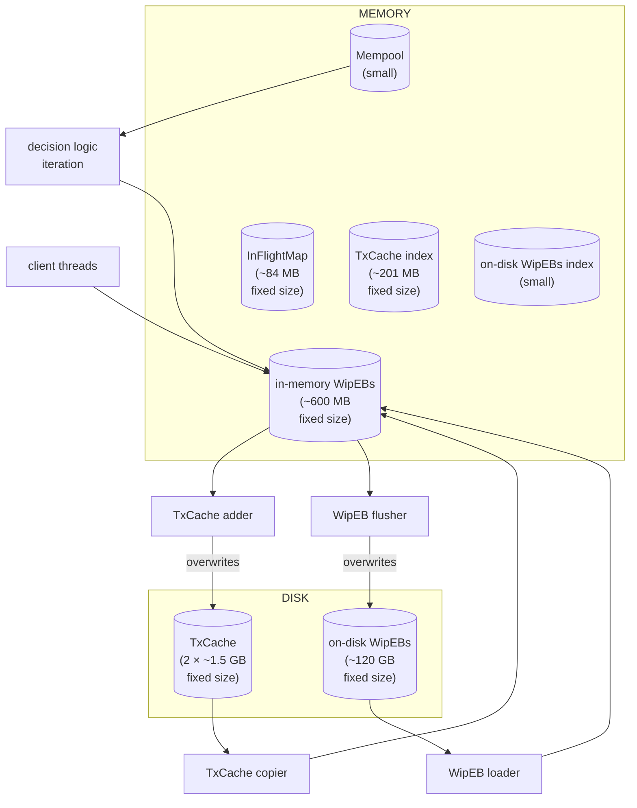

# Introduction

The design presented in this document is the result of a workstream during February 2026 dedicated to the LeiosFetch logic within the Leios prototype.

# A Baseline LeiosFetch Design

The following design's key priority---beyond obeying CIP-164---is to avoid unnecessary latency.
If a different space-time trade-off is subsequently determined to be favorable, that would require a refinement that moves this design away from the current extremum.

This design involves some details that would preferable be left abstract, such as the explicit management of in-memory copies of on-disk data.
That obligation and possibly others would be much more convenient to offload to an embedded database such as SQLite.
However, a baseline design that handles the lower-level details is the first step to assessing whether features such as SQLite's page cache is indeed compatible with our resource utilization requirements.
Features focused on general-case performance like that page cache often prioritize the average-case over the worst-case.
A later section in the document compares with SQLite specifically.

## Requirements

This design resulted from the following requirements.
Some are familiar from CIP-164.
Others arise from resource usage that was more concrete than the scope of the initial version of the CIP.

- Don't request transactions that are currently in the Mempool.
- Don't request the same transaction from more than LeiosFetchMultiplicity-many peers at a time.
    - LeiosFetchMultiplicity is a configuration parameter for the LeiosFetch logic, tuning the balanced tension between avoiding redundant requests versus the unpredictability of which peer will respond the fastest.
    - See the InFlightMap below.
- Don't request the same transaction from the same peer more than once.
    - See the InFlightMap below.
- Don't request transactions that were already fetched when fetching a "recent" EB.
    - See the TxCache below.
- Don't request more bytes from a particular peer than could fit in the low-level buffer that stores the peer's replies before the client thread processes them.
    - It's always possible all of the outstanding replies will arrive before this logic frees up any additional room in that buffer.
    - Caveat: if that buffer is much smaller than the bandwidth-delay product (BDP) with that peer, this rule will prevent full utilization of that connection's bandwidth.
      But if the buffer accomodated a relatively large BDP, then having similar buffers for N=~25 upstream peers risks utilizting "too much" memory.
- Don't waste memory (including garbage collector overhead).
- Don't waste CPU (including garbage collector pause duration and frequency).
- Don't waste disk bandwidth.
- Don't waste disk.
- Consider the set of all EBs that are still missing some transactions, are still younger than the immutable tip, and have been offered by some of the current peers.
  The youngest such EB is always the top priority of LeiosFetch.
    - Ignore EBs that are older than the immutable tip; they're no longer relevant to the node.
    - Ignore EBs that are fully acquired; they're no longer relevant to LeiosFetch.
    - Otherwise, prioritize younger EBs over older EBs, aka FreshestFirst.
    - TODO should we "somewhat prioritize" youngest EBs that have been announced even before they've been offered?
- However, that top priority EB across all peers should not be the _exclusive_ priority of LeisoFetch across all peers.
    - If that EB is offered by an adversarial peer, they can simple choose to withhold it.
    - Doing so should not cause the LeiosFetch logic to signifanctly delay issuing any requests to its (honest) peers that have not already offered the top priority EB.
- Other than required by the above, don't introduce unnecessary latency (ie don't waste time).
- All of the above must be satsified even during "worst-case" scenarios (eg very dense leader schedules) including a barely-tolerable adversary, up to some small failure probability; something like 10^-200 would be comfortable.
- Don't introduce an unbearable maintenance burden.

Because an analogous document does not yet exist for LeiosNotify, it's helpful to list some requirements that LeiosFetch does not have, because LeiosNotify will handle them.

- LeiosNotify will decide which EBs are worth acquiring.
  In particular, it suppresses all but the first EB among equivocating EBs.
  (It also knows to not ignore EBs just because they're from a chain that is not _yet_ the local node's selection.)
- Thus, LeiosFetch will simply acquire whichever EBs that LeiosNotify tells it about.
- TODO as a later optimization, LeiosNotify could signal to LeiosFetch to stop acquiring some EB (if an equivocating EbAnnouncement arrives very soon after the first).
  But the worst-case load doesn't involve such cancellations, so they're not necessary for an MVP.

## Diagram

This diagram is a useful map to consult to undertand the components of the design specified below.

- Every arrow in this diagram represents flow of some transaction's bytes.
- The central decision logic's thread is shown here because it reads from the Mempool.
- It has crucial other activites, not shown as edges in this diagram for the sake of legibility.
  But none of those include directly reading or writing transactions.
    - It orchestrates all the other threads.
    - It solely maintains the memory elements shown in this diagram that have no connecting edges.

## The EbBody-EbClosure Split

An EB is realized in two usefully distinct ways, an EbBody and an EbClosure.

- The EbBody is a sequence of pairs, each a 32 byte hash and a 2 byte size.
  It's ≤ 512 kB, according to the feasible parameters recommended in CIP-164.
- The EbClosure is a sequence of transactions, matching the hashes and sizes in the EbBody.
  It's ≤ 12 MB, according to the feasible parameters recommended in CIP-164.

## Work-in-Progress EBs

The node will not acquire every EbClosure all at once, so it must manage work-in-progress EBs, called _WipEBs_.
Every WipEB always is the full size of the true EbClosure, but the bytes corresponding to some of the transactions might still be uninitialized.
Each WipEB includes a bitmap that records which transactions are already present in that WipEB.

A WipEB is initialized from an EbAnnouncement and the full EbBody.
It also records some small immutable fields for convenience (eg ease of debugging/troubleshooting).
All fields are as follows.

- The slot of the EB.
- The hash of the EB.
- M, the number of transactions in the EB.
- The EbBody with cumulative instead of individual sizes.
  That's M pairs, each a 32 byte hash and a 4 byte cumulative size.
- The bitmap of length M (ie ⌈M/8⌉ bytes).
  Each bit is set if and only the corresponding transaction is already present.
- The byte buffer.
  Its length is equal to the Mth cumulative size.

### On-Disk WipEBs

Every WipEB is stored on-disk.
Each can be several megabytes and the node may need to track several thousand of them at once.

The necessity and sufficiency of ~10000 WipEBs at once is motivated during the ~20 minute explanation in the 2026 February episode of the Leios Monthly Review.
It starts at the [17:08 mark in the YouTube video](https://www.youtube.com/watch?v=5uAJ-XBAysY&t=17m8s).
The reason is ultimately because that's a very conservative bound on the worst-case density of Praos elections that could simultaneously be younger than the k+1st = 2161st block on the node's selection.
The anti-equivocation rules of Leios ensure a node won't need more than that many WipEBs at once.

- The node maintains the WipEBs themselves on-disk.
  Again, ~10000 is small enough that there could simply be one file per EB, with the slot-and-hash as its filename.
- The node also maintains an in-memory index of which WipEBs it has on-disk.
  Since there will be ≤ ~10000 at once and their anticipated average arrival rate is a slow 1 per 20 seconds, it's acceptable for the in-memory index to simply be a `SlotMap (NonEmptySet EbHash)` on a GC'd heap.
- The node would promptly delete an EB as soon as that EB's slots is ≤ the slot of the immutable tip (ie the k + 1st = 2161st block on the node's current selection).

The index can be reconstructed from the files in the directory, if need be.
But on a clean shutdown, the node can simply serialize the index to a small file as well.

TODO cyclic redundancy checks?

### In-Memory WipEBs

WipEBs will also be temporarily stored in-memory, for at least the following reasons.

- Avoiding disk latency while repeatedly deciding which MsgLeiosBlockTxsRequest messages to send.
- Avoiding disk latency while processing each of many received MsgLeiosBlockTxs messages.
- It's preferable to orchestrate writes from multiple LeiosFetch client threads to the shared buffer in-memory rather than to a shared buffer on-disk.
    - Each in-memory WipEB will have a single mutex, and threads will only hold it long enough for memory reads/writes.
- Batching Leios disk reads/writes minimizes disruption of Praos disk traffic.
    - Each in-memory WipEB will have a dirty flag (TODO dirty bitmap?) if it has been written to since it was last synchronized with disk.

Thus the on-disk WipEB is not always the most up-to-date value for that WipEB.

Each upstream peer is allowed to retain ≤ 2 in-memory WipEBs.

- A typical upstream peer count is N=25.
- 2 × N × ~12 MB is ≤ ~600 MB of memory.
- There is ≤ 1 WipEB per EB, and multiple peers can retain the same WipEB.

The limits of ≤ 2 × N total and ≤ 2 per peer ensure peers do not contend for memory.

- If the first MsgLeiosBlockTxsOffer for the new-freshest EB was just received from a peer, then that client thread's own outstanding requests are the only potential reason it wouldn't immediately send a corresponding MsgLeiosBlockTxsRequest.
- In particular, were it not for these limits' isolation, the client thread would sometimes need to wait for the LeiosFetch logic to evict a lower-priority WipEB even though that some other client threads are still retaining it.
- Moreover, those client threads wouldn't be able to handle their outstanding replies when they arrive until the evicted WipEB could be paged back in.
  Either those client threads would have to discard those replies---which risks eventually sending duplicate requests to those upstream peers---or they also wouldn't necessarily be able to immediately send new requests for fresher EB offers received from their peers until the evicted WipEB was brought back into memory.
  Allocating space enough space for pre-emption to be unnecessary is much simpler.
- Crucially, an honest peer only contends with itself even if all N-1 other peers are adversarial.
    - TODO Suppose three increasing priority EBs become available in a burst.
      Is 2 WipEB per peer enough?
      Maybe the delay for the third will be acceptable, because LeiosFetchMultiplicity spread the first two EB's requests over enough peers?

The large fields within an in-memory WipEB are not stored on a heap managed by a general-purpose garbage collector.

- Each of the ~50 WipEBs could contain several thousand transactions; that's too much pressure on the garbage collector.
- In this particular use case, losing the benefits of persisent immutable data structures does not cause much extra complexity.

TODO The set of ≤ 2 × N retained WipEBs might temporarily differ from the set of ≤ 2 × N in-memory WipEBs, because of asynchrony in flushing, (lazy) evicting, and loading.
It's definitely tractable, but the details need to be worked out.

## The LeiosFetch Logic

TODO this logic also needs to request EbBodies; it'll be similar but simpler.

The centralized LeiosFetch decision logic will iterate at 10 Hz or more.
Each iteration involves the following steps; the InFlightMap and the TxCache are detailed after these steps.

- Update private state.
    - Process new MsgLeiosBlockTxOffer messages from LeiosNotify.
    - Process writebacks from the LeiosFetch client threads.
    - Process writebacks from the TxCache copier thread.
    - A writeback has two effects.
        - They update the InFlightMap.
        - They update/maintain the TxCache.
- Trim the AcquiredSet by slot.
- For each in-memory EBs, in any order:
    - If its slot is too old, evict it.
    - Otherwise:
        - If it's complete:
            - If it's dirty, schedule it to be flushed to disk.
            - If its EB ∉ AcquiredSet, insert its EB into the AcquiredSet.
            - (TODO if it's clean and in AcquiredSet, it'd be nice to evict it promptly.
              The only reason not to evict it is so that peers who are still awaiting replies for this EB will be able to use the WipEB's EbBody to validate MsgLeiosBlockTxs message.
              So if we could retain the EbBody part separately from retaining the WipEB, such peers wouldn't need to retain the WipEB any more.
              Maybe that EbBody field of the WipEB is an immutable byte array on the GC'd heap and each peer simply holds a reference to it?
              Recall that this field of the WipEB is immutable.)
	    - (TODO also signal to the Leios voting logic that the EB is fully acquired?
	       Should this happen whenever the next-leftmost tx of the EB arrives?
	       How to balance that batching trade-off?)
        - If it's not retained by any peers:
            - If it's dirty, schedule it to be flushed to disk.
    - TODO also schedule "idle-timer" flushing of dirty EBs even while still retained?
- Acquire a Mempool snapshot.
- For all peers (ie client threads) in preference order (TODO what order is that?):
    - For the two freshest EbClosures this peer has offered that are not already in the AcquiredSet, freshest first:
        - If the peer is not already retaining a WipEB for this EB and it's retaining < 2 WipEBs:
            - If there is an in-memory WipEB for this EB, this peer is now retaining it.
            - If there is no in-memory WipEB for this EB, schedule it to be loaded from disk (evicting the oldest in-memory WipEB that is not retained as soon as it's no longer dirty).
        - If the peer is not already retaining an in-memory WipEB for this EB, skip this EB.
        - For each of this WipEB's missing transactions, leftmost first:
            - (TODO instead of "leftmost first", pickup where we left off when last visiting this WipEB?
              That way we'll request every tx at least once, likely from multiple peers, before requesting any a second time.)
            - If the transaction is currently in the Mempool snapshot, with the mutex, copy it to the WipEB (TODO and also the TxCache).
            - If the transaction is already inflight with this peer in the InFlightMap, skip this transaction.
            - If the transaction already has a multiplicity of LeiosFetchMultiplicity in the InFlightMap, skip this transaction.
            - If the transaction is scheduled for the TxCache copier, skip this transaction.
            - If the transaction is in the TxCache, schedule it to be copied to the WipEB and skip this transaction.
            - If the peer has too much data in flight (including its next-request accumulator), skip this peer.
              (TODO do this in terms of high-water and low-water limits.)
            - Insert this peer-transaction pair into the InFlightMap.
            - Add the transaction to the client thread's next-request accumulator.
            - (TODO when to flush the next-request accumulator to bound the size of individual requests?)

### Background Threads and Client Threads

The above steps refer to a dedicated background threads that fulfill two tasks asynchronously.

- Flush dirty in-memory WipEBs to disk.
    - And clear the dirty bit as soon as the disk write is scheduled.
- Asynchronously copy transactions from the TxCache to an in-memory WipEB.
    - And if the transaction is in from-space, also copy it to the to-space (see TxCache description below).
    - And send a writeback message.

Moreover, each client thread has the following responsibilities.

- When ___ (TODO should this thread immediately send the message after the LeiosFetch logic finishes visiting this peer?):
    - Send the next MsgLeiosBlockTxsRequest.
- When a MsgLeiosBlockTxs arrives:
    - Using the cached MsgLeiosBlockTxsRequest as well as the retained in-memory WipEB's EbBody, disconnect if any transaction is malformed.
    - With the WipEB's mutex.
        - Using the cached MsgLeiosBlockTxsRequest as well as the retained in-memory WipEB's EbBody, write any still-missing transactions to the WipEB.
        - Set the dirty bit, if any transactions were written and it's not already set.
    - Send a success writeback message.
    - If there are no more outstanding requests for this EB-peer pair, stop retaining the WipEB.
- When disconnecting:
    - For each outstanding MsgLeiosBlockTxsRequest, send a failing writeback message.
    - For each retained WipEB, stop retaining it.

### Large Maps in the LeiosFetch State

The above psuedo-code very frequently accesses and mutates the following very large maps: the InFlightMap and the TxCacheIndex.
Fortunately, they do not need to be persisted between node executions.
(There are several other maps too, but they have orders of magnitude fewer elements and change much less frequently.)

The InFlightMap tracks individual transactions by hash.

- In the worst-case, it could contain ~1 million entries at once.
- Each entry records a small bitmap of which of the ≤ 25 current peers are currently awaiting this transaction.
    - (When a peer disconnects, it must clear those bits as part of its shutdown logic.)
- To minimize latency, a hash table is necessary.
- It would have 2^21 = ~2 million buckets in order to keep its load factor < ~50%, a salted hash to prevent adversarial collisions, linear probing to handle collisions, and backshifting on deletes.
- A microbenchmark shows that a burst of ~15000 insertions/lookups/deletions takes ≤ 3 milliseconds even when loaded with ~1 million transactions.
    - TODO I used my iohk.io account's Gemini Pro access to implement this hash table in ~150 lines of C.
      So far I've only tested via some sanity checks as part of the benchmarks, but any bugs not revealed by that are unlikely to significantly alter the benchmark results.
      It chose SipHash, for the record.
- Total size is 2^21 × (32 + 8) = ~84 MB.

The TxCache also tracks individual transactions by hash.

- Its in-memory index must retain the ≤ ~2 million transactions that are referenced by the freshest 128 EBs.
    - The necessity and sufficiency of 128 is motivated during the ~20 minute explanation in the 2026 February episode of the Leios Monthly Review.
      It starts at the [17:08 mark in the YouTube video](https://www.youtube.com/watch?v=5uAJ-XBAysY&t=17m8s).
    - The key motivation is that a strong majority of the EBs issued by a group of nodes that control a ≥~5% relative stake would still be accelerated by the rest of the network's TxCache a majority of the time even if this group's mempools were partitioned from the rest of the network's mempools.
- It'd therefore have 2^22 = ~4 million buckets, but is otherwise nearly the same as the InFlightMap, and so will have similar latency.
  The only difference is the implicit deletion, detailed below.
- Each entry records the following.
    - The 32 byte hash of a transaction (same as in the EbBody).
    - The 8 byte slot of the freshest EB to have touched this entry in the TxCache.
    - The 4 byte starting offset of the transaction within a very large on-disk file.
    - TODO the voting logic is also supposed to use the TxCache to avoid revalidating txs that have already been validated (esp those from the Mempool).
- The on-disk file is garbage collected via a straight-forward instantiation of the Baker (1978) incremental algorithm.
    - Baker's algorithm requires the total space to be double the maximum live space.
    - The maximum live space is 128 × 12 MB = 1.536 GB, so the file size is ~3 GB, which is why the offsets in the hash table are 32 bits = 4 bytes.
    - TODO will this be too concentrated of SSD wear and tear?
      Need to move this file around occasionally?
    - TODO would it be more helpful to call it a "smart ring buffer" instead of name-dropping Baker?
- Total size of the hash table is 2^22 × (32 + 8 + 8) = ~201 MB bytes (the 4 byte offset was rounded up to 64 bits to be word-aligned).
    - TODO Maybe figure out how to use only 4 bytes for the slot, since any execution of the node won't last for more than 2^32 slots (ie ~136 years)?
      Would remove one of those 8s, which saves ~33 megabytes and slightly improves locality of probing.
- Some simple logic tracks the slot of the 129th-youngest EB to have been announced during this node process's lifetime.
  Every TxCache entry with a slot ≤ that slot is implicitly deleted (which is handled by insert and lookup, and so each call must receive the current "clock" value as an argument).
    - Doing deletion implicitly in the index is beneficial because it avoids having to maintain a secondary index to track which live entries have the oldest slots.
    - Doing deletion implicitly in the file (via Baker's algorithm) is beneficial because it avoids more disk traffic (ie the deletions).
    - Doing deletion implicitly in both is beneficial because it eliminates the risk of inconsistency without requiring any synchronization such as disk write barriers.

TODO Suppose the index of on-disk WipEBs maintained a free list of integers.
Then each entry in TxCache index could store the integer of a WipEB and the offset of the transaction within that EbClosure.
That pair of indexes would be 14+14 bits, or 14+24 if the index within the EbClosure was just the byte offset of the transaction---either way, it's much less than 8 bytes, and so the TxCache index size wouldn't increase.
WipEBs live orders of magnitude longer than do TxCache entries, so there's no risk of a dangling reference.
The downside is that the TxCache copier would need an additional indirection through the WipEB index for each transaction it copies, but that seems tolerable.
The upside, however, is that the TxCache index would be the entire TxCache!
Moreover, the arrival of a fresh transaction would no longer need two disk writes, one to the WipEB and one to the TxCache file.

TODO Explain why the TxCache's pending writes---in terms of the corresponding MsgLeiosBlockTxsRequests---isn't also a large set.
That is: choose how to rate-limit it; it merely has to exhibit disk latency rather than network latency.

### Total Memory Usage

The size of each in-memory bulk data structure above is as follows.

- ~600 MB for the 2 × N in-memory WipEBs.
- ~84 MB for the ~1 million entry InFlightMap.
- ~201 MB for the ~2 million entry TxCache index.

Reserving a grand total of ~1 GB of memory to---even in the worst-case----minimize the latencies within the hot loops of the ≥10 Hz centralized LeiosFetch decision logic seems worthwhile.

## SQLite Usage Opportunities

There are four components of the above baseline design that SQLite might suitably replace.

- Both sets of WipEBs, on-disk and in-memory, could potentially be seamlessly coalesced by relying on SQLite's page cache (CTRL-F for "Page Cache" at <https://sqlite.org/arch.html>).
- The InFlightSet could be an in-memory database.
- The TxCache index could be an in-memory database.

For the WipEBs, there are two options.

- Store each WipEB as a BLOB in its own row; there are C API functions for managing BLOB fields piecewise.
  These numbers <https://www.sqlite.org/intern-v-extern-blob.html> suggest that could be several times slower than storing WipEBs as files.
- The more natural approach would be store each entry of the EbClosure (ie each transaction) as its own row in the table (as the 2025 November demo does).
  This has some minor downsides, but might be tolerable.
  (TODO if all rows were INSERTed with a correctly sized BLOB, would the subsequent UPDATE happen in-place?)
    - A WipEB with ~15000 transactions would have its slot and hash replicated in ~15000 rows, because SQLite does not compress shared key prefixes.
      Some obfuscating logic could pack this down into fewer bytes, but it's ultimately a minor overhead already, since the transaction body is likely so much larger than 32+8 bytes.
    - SQL queries involving the WipEBs would need to access the table index once per transaction---maybe the query optimizer can handle it well enough.
    - Finally, the MsgLeiosBlockTxsRequest handler would always need to copy each transaction BLOB individually, since SQLite does not support concatenating BLOB fields.

If the in-memory WipEBs remain explicitly managed, then the SQL could be isolated to the background thread dedicated to flushing in a straight-forward way.
TODO How easy will it be to bound how much heap the SQLite page cache is able to use?
The Leios design does not rely on continuously intensive write throughput.
We also don't want to use more heap than we'll necessary have available to us (a la "average-case = worst-case").

If the in-memory WipEBs are coalesced with the on-disk WipEBs, then the SQL UPDATE queries would likely need to be isolated within a single thread that the client threads need to drive via some multi-producer single-consumer queue of messages that pass in the MsgLeiosBlockTxsRequest, the relevant EbBody, and the MsgLeiosBlockTxs itself.
This would replace the flushing background thread.
We would no longer have the leeway of having per-WipEB mutexes, but it's difficult to predict how much that matters.
TODO In an ideal world, we'd have full MVCC so threads could write freely to different parts of the same WipEB, but an out-of-process database is beyond the scope (so far, at least).

For the InFlightSet and the TxCache, there are two concerns.

- SQLite forgoes hash tables entirely; every index is a B-tree.
- A secondary index will be necessary in order prune the maps efficiently.

Both of these concerns imply increased latency.
Because of the ~50% load factor of the hash tables, the twin B-trees are, in the worst-case, likely to only consume a similar amount of memory; and much less in the average-case (which isn't necessarily desirable).
These time- and space- claims require at least a microbenchmark comparison against the proposed hash trees.

There will be no opportunity to VACUUM these databases, but it seems very unlikely that the SQLite page allocator is leaky.
The overhead of retaining the max usage indefinitely is tolerable, again comparable to the hash table's ~50% load factor.

For all uses, the run-time overhead and cognitive load of maintaining the SQL queries and indirecting through the language (eg Haskell) bindings will have a non-trivial cost.
Those overheads are probaly small compared to the cognitive load reduction from not having to implement caching, ACI(D) invariants, etc.

In conclusion, there appear to be three degrees of SQLite usage to consider.

- Only use SQLite for the on-disk WipEBs.
- Also replace the in-memory WipEBs with direct use of the on-disk WipEBs, relying on the SQLite page cache to achieve the same benefits as the in-memory WipEBs.
- Also use an in-memory database for the InFlightSet and/or the TxCache index.

A potential fourth degree would be to also replace each WipEB's bitmap with a secondary index (as the 2025 November demo does).
It seems plausible this would be a regression; an ~1875 byte bitmap is a very compact and localized way to store the necessary information.

The limits of ≤ 2 × N total retained WipEBs and ≤ 2 per peer seem to still be required unchanged to prevent the client threads from contending for the SQLite page cache.
Even then, though it's not clear whether the SQLite page cache will ensure the same per-peer isolation.
Other than that, however, the simplicity the page cache promises is very tempting, but for the same reason therefore sounds like the mythical Free Lunch.

## Next Steps

This workstream can continue in March 2026 by progressing on the following fronts.

- Much of the above design does not depend on the details of the storage manager.
  It can already be iterated on with the other Leios architects.
    - Are any requirements missing?
    - Which requirements have been over-emphasized?
    - Which behaviors are missing?
      For example, pushing notifications to downstream LeiosNotify peers when WipEBs are first complete.
- An implementation of the above, parameterized over the storage manager.
- A test suite and tracers for that implementation.
  Some benchmarks as well, including some load scenarios comparable to the worst-case cardinalities.
- Finalizing the details of the storage manager will require the assessment of various trade-offs.
    - Is the bespoke in-memory/on-disk WipEB caching framed above too much of a maintenance burden as-is?
        - In other words, how much simplification would be gained from an embedded database?
    - Would it be sufficiently performant as-is, even in the worst-case loads?
      Are there simplifications that would still be sufficiently performant?
    - How much performance improvement could come with an embedded database?
        - Some straight-forward microbenchmarks could inform this question for concrete alternatives (such as SQLite) at least for the InFlightMap and TxCache index, since the proposed hash table option itself is so simple.
    - How reliably could we anticipate the growth and contention dynamics of SQLite's page cache in cases of load beyond the average-case?
    - What other such embedded packages would be suitable?
      The [`mmap`](https://man7.org/linux/man-pages/man2/mmap.2.html) feature does seem relevant.
      However, during my background research I've have seen warnings about `mmap` incurring too many disadvantages, such as masking errors, etc.
