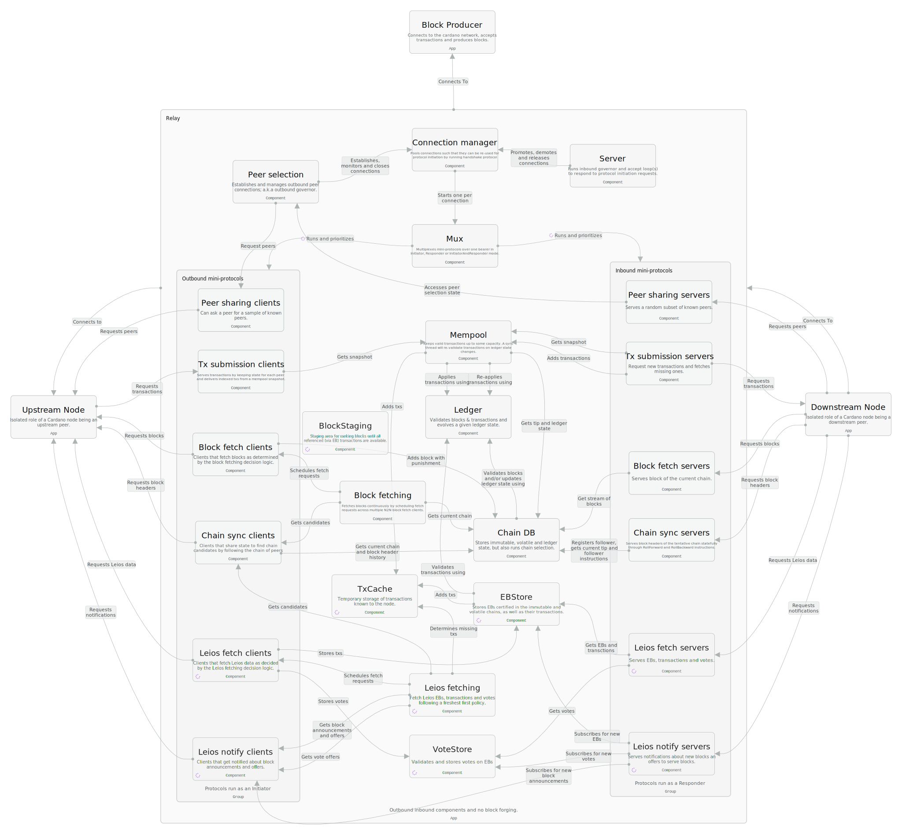

# Introduction

This technical design document bridges the gap between the protocol-level specification ([CIP-164](https://github.com/cardano-foundation/CIPs/pull/1078)) and its concrete implementation in [`cardano-node`](https://github.com/IntersectMBO/cardano-node). While CIP-164 defines *what* the Leios protocol is and *why* it benefits Cardano, this document addresses *how* to implement it reliably and serve as a practical guide for implementation teams.

This document builds on the [impact analysis](../ImpactAnalysis.md) and [early threat modelling](../threat-model.md) conducted. The document outlines the necessary architecture changes, highlights key risks and mitigation strategies, and proposes an implementation roadmap. As the implementation plan itself contains exploratory tasks, this document can be considered a living document and reflects our current understanding of the protocol, as well as design decisions taken during implementation.

Besides collecting node-specific details in this document, we intend to contribute implementation-independent specifications to the [cardano-blueprint](https://cardano-scaling.github.io/cardano-blueprint/) initiative and also update the CIP-164 specification through pull requests as needed.

**Document history**

This document is a living artifact and will be updated as implementation progresses, new risks are identified, and validation results become available.

| Version | Date       | Author          | Changes                           |
|---------|------------|-----------------|-----------------------------------|
| 0.4     | 2025-10-27 | Sebastian Nagel | Add overview chapter              |
| 0.3     | 2025-10-25 | Sebastian Nagel | Add dependencies and interactions |
| 0.2     | 2025-10-24 | Sebastian Nagel | Add implementation plan           |
| 0.1     | 2025-10-15 | Sebastian Nagel | Initial draft                     |

# Overview

Cardano as a cryptocurrency system fundamentally relies on an implementation of Ouroboros, the consensus protocol (TODO cite praos and genesis papers), to realize a permissionless, globally distributed ledger. The consensus protocol provides two essential properties that underpin Cardano's value proposition: **persistence** ensures immutability of confirmed transactions, while **liveness** guarantees that new valid transactions will be included. These properties enable secure and censorship-resistant transfer of value, as well as the execution of smart contracts in a trustless manner.

Ouroboros Leios introduces **high-throughput** as a third fundamental property, extending the currently deployed Ouroboros Praos variant. By enabling the network to process a significantly higher number of transactions per second, Leios addresses the economic scalability requirements necessary to support a growing user base and application ecosystem. This enhancement transforms Cardano from a system optimized for security and decentralization into one that maintains these properties while achieving higher transaction processing capacity demanded by modern blockchain applications.

## From research to implementation

As was the case for the [Praos variant of Ouroboros](https://ouroboros-network.cardano.intersectmbo.org/pdfs/network-design/network-design.pdf#subsection.5.1), the specification embodied in the published and peer-reviewed [research paper for Ouroboros Leios](https://eprint.iacr.org/2025/1115.pdf) was not intended to be directly implementable. Initial research and development studies confirmed this expectation, identifying several unsolved problems with the fully concurrent block production design when considering the concrete Cardano ledger and what consequences this would have (TODO: cite suitable R&D reports, [Tech Report #2](https://github.com/input-output-hk/ouroboros-leios/blob/main/docs/technical-report-2.md#conflicts-ledger-and-incentives), [Impact analysis survey](https://github.com/input-output-hk/ouroboros-leios/blob/main/docs/ImpactAnalysis.md#full-survey)); further research is needed before those parts can be implemented.

The design presented in [CIP-164](https://github.com/cardano-scaling/CIPs/blob/leios/CIP-0164/README.md), also known as "Linear Leios", focuses on the core insight of utilizing the unused network bandwidth and computational resources during the necessary and eponymous "calm periods" of the Praos protocol. This approach provides an immediately implementable design that can deliver orders of magnitude higher throughput while preserving the security guarantees that make Cardano valuable.

The Linear Leios protocol operates by allowing a second, bigger type of block to be produced in the same block production opportunity. Block producers can produce and announce an endorser block (EB), which endorses additional transactions that would not fit within the Praos block. EBs are distributed through the network and subjected to validation by a committee of stake pools, who vote on their transaction data closure's availability and validity. Only EBs that achieve a high threshold of stake-weighted votes become certified and can be included in the ledger through exclusive anchoring of a certificate in the subsequent block - now called a ranking block (RB). This mechanism allows for significantly higher transaction throughput while maintaining the security properties of the underlying Praos consensus. See the CIP for more details on the protocol specification and rationale itself.

## Cardano node as a real-time system

The implementation of Leios must be understood in the context of the Cardano node as a concurrent, reactive system operating under real-time constraints in an adversarial environment. While "real-time" in this context does not refer to the millisecond-level hard deadlines found in industrial control systems, timely action at the scale of seconds nontheless remains crucial to protocol success and network security. 

The currently deployed Praos implementation establishes clear [data diffusion targets](https://ouroboros-network.cardano.intersectmbo.org/pdfs/network-design/network-design.pdf#subsection.5.1): blocks must reach 95% of nodes within the 5-second $\Delta$ parameter, with target performance at 98% and stretch goals at 99%. While these are comfortably achieved most of the time, blocks are regularly adopted within 1 second across the network, there are some situations even in the current system where the target is not reached. For example, due to reward calculations happening at the epoch boundary.

Despite being hard deadlines, these targets reflect the reality that network vulnerability increases when not being met. The protocol's safety and liveness guarantees depend on honest nodes being able to propagate blocks rapidly enough to prevent adversarial forks from gaining traction. Failure to meet these timing constraints can lead to increased rates of short forks, reduced chain quality, and - if persistent - ultimately compromise the integrity of the ledger. 

## Concurrency and resource management

The current primary responsibilities of a Cardano node are roughly:

- Block diffusion: receiving chains from upstream, validate and select the best chain, and transmit chains downstream.
- Transaction submission: receiving, validating, and transmitting transactions to be included in blocks.
- Block production: creating new blocks and extending current chain when selected as slot leader. 

Despite this apparent simplicity, this already results in a highly concurrent system once cardinalities of upstream and downstream network peers are considered. A `cardano-node` with the default configuration maintains 20 upstream hot peers, 10 upstream warm peers and can have up to a few hundred downstream connections, each of which may be simultaneously requesting or serving data. All of these operations share critical resources, including memory, CPU, and network bandwidth, requiring careful resource management to ensure timing requirements are met even under load.

Concretely, in the current system there are (including protocols for supporting features like peer sharing):

- 2 pipelined + 3 non-pipelined instances per upstream peers => 7 threads per upstream peer;
- 1 pipelined + 4 non-pipelined instances per downstream peer => 6 threads per downstream peer

Leios significantly expands this concurrency model by introducing new responsibilities:

- Endorser block and closure diffusion: receiving, validating, and transmitting EBs and their transaction closures.
- Voting and vote diffusion: receiving, validating, and transmitting own and foreign votes on EBs. 

Given the [proposed Leios mini-protocols](https://github.com/cardano-scaling/CIPs/blob/leios/CIP-0164/README.md#leios-mini-protocols), this would result in:

- 4 pipelined + 3 non-pipelined per upstream peers => 11 threads per upstream peer;
- 1 pipelined + 6 non-pipelined per downstream peer => 8 threads per downstream peer

With these two additional functionalities, each across many peers, the node set of concurrent tasks strictly increases. The implementation must ensure that the increased data flows and processing demands do not interfere with each other, or priorization mechanisms ensure to meet the stringent timing constraints necessary for protocol security.

## Designing for the worst-case

Related to the principle of [optimizing for the worst case](https://cardano-scaling.github.io/cardano-blueprint/principles/index.html#optimise-only-for-the-worst-case), the security argument for Leios protocol depends critically on worst-case diffusion characteristics. Endorser blocks and their transaction closures must be "small enough" that the difference between optimistic diffusion (leading to successful certification) and worst-case diffusion remains bounded by the protocol parameter $L_\text{diff}$ according to the [protocol's security argument](https://github.com/cardano-scaling/CIPs/blob/leios/CIP-0164/README.md#protocol-security).

If the optimistic, average-case performance is improved with suitable algorithms, data structures and optimizations, but the worst-case scenario is not, more conservative parameter choices would be required to maintain security guarantees. This would negate the anticipated benefits of the optimizations in the first place. Therefore, the implementation must prioritize ensuring that even in adverse network conditions or under attack, the diffusion of EBs and their closures remains within acceptable bounds.

> [!WARNING]
> TODO: the situation is not as dire though, we have some design freedom because strictly less work needs to be done on the worst-case path (e.g. rely on certified validity and cheaply build ledger states instead of validating transactions)

Besides, as with Praos, the enhanced information exchange requirements of Leios must not compromise the system's resilience against denial of service attacks and asymmetric resource consumption attempts. The implementation must maintain defensive properties while supporting the increased data flows and processing requirements that enable higher throughput.

## Implementation imperatives

In summary, the technical design described in subsequent chapters must ensure that nodes continue to operate reactively and meet timing requirements despite increased responsibilities and data volumes. This requires careful bounding of resource usage and sophisticated prioritization mechanisms across concurrent responsibilities.

The complexity of this challenge emphasizes the critical importance of non-functional requirements specification for each component, rigorous performance engineering practices, and continuous benchmark validation throughout the development process. Only through systematic attention to these implementation details can the protocol deliver the security and performance properties that make Leios a valuable enhancement to Cardano's capabilities.

The following chapters detail the specific risks that inform architectural decisions, the concrete technical design that addresses these challenges, and the implementation plan that will deliver a production-ready system.

# Implementation plan

The implementation of Ouroboros Leios represents a substantial evolution of the Cardano consensus protocol, introducing high throughput as a third key property alongside the existing persistence and liveness guarantees. The path from protocol specification to production deployment requires careful validation of assumptions, progressive refinement through multiple system readiness levels, and continuous demonstration of correctness and performance characteristics. This chapter outlines the strategy for maturing the Leios protocol design through systematic application of formal methods, simulation, prototyping, and testing techniques.

The result is an implementation plan that not only covers the ["path to active" of CIP-164](https://github.com/cardano-scaling/CIPs/blob/leios/CIP-0164/README.md#path-to-active), but also serves as a rationale for what concrete steps will be taken on our [product roadmap](https://leios.cardano-scaling.org/docs/roadmap/) of realizing Ouroboros Leios.

> [!WARNING]
>
> TODO: mention on-disk storage and its availability; relevant for prototyping and early testnet (chain volume)
>
> TODO: incorporate or at least mention interactions with Peras
>
> TODO: also mention Genesis (potential to only do this later once testnet available?)

## Approach

Research and development of distributed consensus protocols does not follow a linear waterfall process. Rather, the protocol design must be matured through various stages of validation, each building confidence in different aspects of the system. The peer-reviewed research paper provides strong theoretical guarantees under certain assumptions, but translating these guarantees into a working implementation that operates reliably on real-world infrastructure requires bridging substantial gaps. The implementation strategy must therefore balance multiple concerns: validating that core assumptions hold in practice, ensuring that refinements preserve essential properties, building developer confidence through rigorous testing, and ultimately securing acceptance from the governing bodies that must approve deployment to mainnet.

The challenge is compounded by the nature of the system itself. Cardano as deployed on mainnet is a globally distributed system with hard real-time constraints operating in an adversarial environment. Failures or performance degradation cannot be tolerated, as they directly impact the economic value and security guarantees that users depend upon. This necessitates an implementation approach that validates critical properties early, maintains continuous delivery of working prototypes, and ensures transparency in both progress and limitations throughout the development process.

Three [principles](https://leios.cardano-scaling.org/docs/strategy#principles) guide the implementation strategy: First, **early validation** of critical assumptions and risks enables discovery of fundamental problems as early as possible in the development cycle and reduces the likelihood for wasteful pivots and delays in delivery. Second, the implementation must progress through **continuous delivery** of increasingly capable prototypes rather than attempting to build the complete system in isolation. This allows for empirical validation at each stage and enables course corrections based on observed behavior. Third, **transparency** in both capabilities and limitations must be maintained throughout, ensuring that stakeholders including stake pool operators and delegated representatives can make informed decisions about deployment readiness.

These principles are also reflected in the choice of validation techniques applied at each stage. Formal methods provide the strongest guarantees of correctness but apply to abstracted models. Simulation enables exploration of protocol behavior under controlled conditions including adversarial models. Prototypes running on real infrastructure validate that theoretical performance bounds can be achieved in practice. Public testnets demonstrate end-to-end integration and allow the broader community to evaluate the system under realistic conditions.

## Correctness in two dimensions

Formal specification and verification play a central role in ensuring correctness throughout the implementation process, which happens along two dimensions:
- Maturity: Implementations maturing from proof of concept, prototype to production-ready release candidates
- Diversity: Multiple emerging implementations of Cardano nodes using different programming langugages and targeting slightly different use cases

A protocol specification captured in a formal langugage like Agda, provides an unambiguous description of the protocol that can be checked for consistency and allows proving equivalence and other properties. A formal specification serves as the authoritative reference against which all implementations must be verified.

The approach to formal verification in Leios follows the "trail of evidence" methodology successfully applied in previous Ouroboros consensus implementations. Rather than attempting to verify the entire codebase directly, which becomes intractable for systems of this complexity, the methodology establishes correctness through a chain of increasingly refined specifications. For example, the high-level specification defines the protocol abstractly, while further refined specifications would focus on details such as message ordering and timing. Finally, an executable implementation is shown to correspond to the formal specification through a combination of techniques including type safety, property-based testing, and trace verification - often summarized as **conformance testing**.

Trace verification deserves particular attention as it provides a bridge between formal specifications and running code. The approach involves instrumenting both the formal specification and the implementation to produce detailed execution traces. These traces can then be compared to verify that the implementation exhibits the same observable behavior as the specification for given inputs. For consensus protocols, the relevant observable behavior includes the sequence of blocks produced, the certificates generated, and the final ledger state. By systematically exploring the space of possible inputs including adversarial scenarios, high confidence can be achieved that the implementation faithfully realizes the specification.

Multiple implementations provide additional assurance through diversity. The primary Haskell implementation in `cardano-node` continues to serve as the reference, while alternative implementations in other languages are currently in development and will eventually increase the **node diversity** of Cardano. Alternative implementations on the node- or component-level serve multiple purposes:
  - validate that the specification is sufficiently precise and complete,
  - exercise different corner cases that might be missed by a single implementation, and
  - reduce the risk that a subtle bug in one implementation compromises the entire network.

The formal specification must be maintained as a living artifact throughout implementation. As design decisions are made to address practical concerns, these decisions must be reflected back into the specification to ensure it remains accurate. This bidirectional relationship between specification and other steps on the implementation plan is essential. The specification guides implementation, while implementation experience reveals necessary refinements to the specification. Documentation of these refinements and the rationale behind them provides crucial context for future maintainers and for external review. Consequently, the specification itself and other implementation-independent artifacts will be contributed to the [`cardano-blueprint`](https://cardano-scaling.github.io/cardano-blueprint) initiative.

## Simulation and protocol validation

Simulations provide a very controlled environment for exploring protocol behavior before deploying to real infrastructure. Two complementary simulation approaches have been used so far to [validate the proposed protocol in CIP-164](https://github.com/cardano-scaling/CIPs/blob/leios/CIP-0164/README.md#simulation-results), each with distinct strengths and even using different implementation languages.

A discrete event simulation implemented in Rust, models Leios message exchanges between nodes, abstracting lower-level details for speed—running orders of magnitude faster than real time to enable statistical analysis over thousands of runs with complete observability and arbitrary adversarial behavior injection. This validates security arguments by systematically exploring protocol behavior under varying loads, expected data diffusion in small to medium sized network topologies, or adversarial scenarios like data withholding, and exploration of protocol parameters before testnet deployment.

Another Haskell-based simulation using IOSim and the actual network framework used in the `cardano-node`. This reduces model-implementation divergence while enabling studies of the dynamic behavior and resource management in detail. While IOSim is used in the existing network and consensus layers through property-based testing, and extends naturally to Leios components, the simulator built from this was not able to scale to large networks.

Both approaches necessarily abstract real system details and thus provide evidence of correct behavior under idealized conditions and suggest workable parameters, but cannot definitively predict real-world performance. Maintaining simulation synchronization with evolving implementation requires discipline, but enables rapid exploration of alternatives, early feature validation, and serves as executable documentation for new developers.

## Prototyping and adversarial testing

Prototypes on real infrastructure validate performance characteristics that simulation typically cannot guarantee. The line between simulation and prototyping is blurry, but both concepts share the trait of allowing rapid exploration of the most uncertain aspects of the design before committing to a full implementation. Referring back to the key threats and assumptions to validate early, the primary focus of prototyping is on network diffusion performance under high throughput conditions and adversarial scenarios.

**Network diffusion prototype:** An early implementation of the actual Leios network protocols and freshest-first delivery mechanisms, that allows running experiments with various network topologies. Ledger validation of Leios concepts is stubbed out and transmitted data is generated synthetically to focus purely on network performance. Deployed to controlled environments like local devnets and private testnets like the the Performance and Testing cluster, this prototype systematically explores how performance scales with network size and block size, tests different topologies, and crucially answers whether the real network stack achieves the diffusion deadlines required by protocol security arguments. Key measurements include endorser block arrival time distributions, freshest-first multiplexing effectiveness, topology impact on diffusion, and behavior under adversarial scenarios including eclipse attempts and targeted withholding. These measurements will answer questions like, "how much" freshest-first delivery we need, whether the proposed network protocols are practical to implement and what protocol parameter are feasible.

Adversarial testing represents a crucial aspect of prototype validation. In a controlled environment, some nodes can still be configured to exhibit adversarial behaviors such as sending invalid blocks, withholding information, or attempting to exhaust resources of honest nodes. Observing how honest nodes respond provides evidence that the mitigations described in the design are effective. Despite using real network communication, such systems can still be determinstically simulation-tested using tools like [Antithesis](https://antithesis.com/), which is currently picked up also by node-level tests in the Cardano community via [moog](https://github.com/cardano-foundation/moog). If we can put this technique to use for adversarial testing of Leios prototypes and release candidates, this can greatly enhance our ability to validate the protocol under challenging conditions by exploring a much wider range of adversarial scenarios than would be feasible through manually created rigit test scenarios.

Beyond networking prototypes, additional focused prototypes may be created to address other known unknowns of the implementation:

**Ledger validation benchmark:** measures the throughput of transaction validation and ledger state updates. This is critical for understanding whether a node can process the contents of large endorser blocks within the available time budget and confirm whether our models for transaction validation are correct. The benchmark explores different transaction types and sizes, measures the impact of caching strategies, and validates the performance improvement from the no-validation application of certified transactions.

**Cryptographic primitives prototype:** validates the performance and correctness of the BLS signature scheme integration. This includes key generation, signing, verification, and aggregation operations. The prototype must demonstrate that batch verification of large numbers of votes can complete within the voting period deadline. It also serves to validate the proof-of-possession mechanism and explore key rotation techniques.

Focused prototypes provide empirical data that complements the theoretical analysis. They reveal where optimizations are necessary and validate that the required performance is achievable with available hardware. They also serve to build developer confidence in the feasibility of the overall design, as well as directly validate and inform architectural decisions. Discovering a fundamental performance limitation early, through prototyping, is far preferable to discovering it late during testnet deployment or, worse, after mainnet deployment.

## Public testnets and integration

A public testnet serves distinct purposes over simulations and controlled environments: it requires integration of all components into a complete implementation, enables for tests under realistic conditions with diverse node operators and hardware, and allows the community to experience enhanced throughput directly. While some shortcuts can still be made, the testnet-ready implementation must offer complete Leios functionality - endorser block production and diffusion, vote aggregation, certificate formation, ledger integration, enhanced mempool - plus sufficient robustness for continuous operation and operational tooling for deployment and monitoring.

The testnet enables multiple validation categories. Functional testing verifies correct protocol operation: nodes produce endorser blocks when elected, votes aggregate into certificates, certified blocks incorporate into the ledger, and ledger state remains consistent. Performance testing measures achieved throughput against business requirements - sustained transaction rate, mempool-to-ledger latency, and behavior under bursty synthetic workloads. Adversarial testing is limited on a public testnet, but some attempts with deliberately misbehaving nodes can be made on withholding blocks, sending invalid data, attempting network partitioning, or resource exhaustion.

The testnet integrates ecosystem tooling: wallets handling increased throughput, block explorers understanding new structures, monitoring systems tracking Leios metrics, and stake pool operator documentation and deployment guides. Crucially, the testnet further enables empirical parameter selection (size limits, timing parameters), where simulation provides initial guidance but real-world testing with community feedback informs acceptable mainnet values.

Software deployed to the public testnet progressively converges toward mainnet release candidates. Early deployments may use instrumented prototypes lacking production optimizations; later upgrades run increasingly complete and optimized implementations. Eventually, all changes as [outlined in this design document](#Architecture) must be realized in the `cardano-node` and other node implementations. This progressive refinement maintains community engagement while preserving engineering velocity. Traces from testnet nodes can still be verified against formal specifications using the trace verification approach, ultimately linking the abstraction layers.

## Mainnet deployment readiness

Mainnet deployment requires governance approval and operational readiness beyond technical validation. The Cardano governance process involves delegated representatives and stake pool operators who need clear understanding of proposed changes, benefits, and risks. Technical validation evidence from formal methods, simulation, prototyping, and testnet operation must be communicated accessibly beyond technical documentation.

Operational readiness encompasses stake pool operator testing in their environments, updated procedures and training, clearly documented upgrade procedures, updated monitoring and alerting systems, and prepared support channels. The hard fork combinator enables relatively smooth transitions, but Leios represents substantial consensus changes. Conservative timeline estimates must account for discovering and addressing unexpected issues - a normal part of the hard-fork scheduling process. The months of validation and refinement required before prudent mainnet deployment reflect the critical nature of modifications to a system holding substantial economic value and providing essential services that users depend upon.

> [!WARNING]
> TODO: more thoughts
> - why (deltaq) modeling? quick results and continued utility in parameterization
> - parameterization in general as a (communication) tool; see also Peras' parameterization dashboard https://github.com/tweag/cardano-peras/issues/54
> - what's left for the hard-fork after all this? more-and-more testing / maturing, governance-related topics (new protocol parameters, hard-fork coordination)

# Dependencies and interactions

The changes necessary to realizing Leios must integrate carefully with existing infrastructure and emerging features. This section examines the critical dependencies that must be satisfied before Leios deployment, identifies synergies with parallel developments, and analyzes potential conflicts that require careful coordination. The analysis informs both the implementation timeline and architectural decisions throughout the development process.

## On-disk storage of ledger state

> [!WARNING]
> TODO: Add some links and references to UTxO-HD and Ledger-HD specification and status

The transition from memory-based to disk-based ledger state storage represents a fundamental prerequisite for Leios deployment. This dependency stems directly from the throughput characteristics that Leios is designed to enable.

At the time of writing, the latest released `cardano-node` implementation supports UTxO state storage on disk through UTxO-HD, while other parts of the ledger state including reward accounts are put on disk within the Ledger-HD initiative. The completion of this transition is essential for Leios viability, as the increased transaction volume would otherwise quickly exhaust available memory resources on realistic hardware configurations.

The shift to disk-based storage fundamentally alters the resource profile of node operation. Memory requirements become more predictable and bounded, while disk I/O bandwidth and storage capacity emerge as primary constraints. Most significantly, ledger state access latency necessarily increases relative to memory-based operations, and this latency must be accounted for in the timing constraints that govern transaction validation.

Early validation through comprehensive benchmarking becomes crucial to identify required optimizations in ledger state access patterns. The (re-)validation of orders of magnitude bigger transaction closures, potentially initiated by multiple concurrent threads, places particular stress on the storage subsystem, as multiple validation threads may contend for access to the same underlying state. The timing requirements for vote production - where nodes must complete endorser block validation within the $L_\text{vote}$ period - on one hand, and applying (without validation) thousands transactions during block diffusion on the other hand, impose hard constraints on acceptable access latencies.

These performance characteristics must be validated empirically rather than estimated theoretically. The ledger prototyping described in the implementation plan must therefore include realistic disk-based storage configurations that mirror the expected deployment environment.

## Synergies with Peras

The relationship between Ouroboros Leios and Ouroboros Peras presents both opportunities for synergy and challenges requiring careful coordination. As characterized in the [Peras design](https://tweag.github.io/cardano-peras/peras-design.pdf) document, the two protocols are orthogonal in their fundamental mechanisms, Leios addressing throughput while Peras improves finality, but their concurrent development and potential deployment creates several interaction points.

**Resource contention and prioritization** emerges as the most immediate coordination challenge. Both protocols introduce additional network traffic that competes with existing Praos communication. The [resource management](https://github.com/input-output-hk/ouroboros-leios/blob/main/docs/ImpactAnalysis.md#resource-management) requirements for Leios - prioritizing Praos traffic above fresh Leios traffic above stale Leios traffic - must be extended to also accommodate Peras network messages. Any prioritization scheme requires careful analysis of the timing constraints for each protocol to ensure that neither compromises the other's security guarantees. Current understanding is that Peras traffic should be prioritized above both, stale and fresh Leios traffic, such that Leios protocol burst attacks may not force Peras into a cooldown period.

**Vote diffusion protocols** present a potential area for code reuse, though this opportunity comes with important caveats. The Leios implementation will initially evaluate the vote diffusion protocols [specified in CIP-164](https://github.com/cardano-scaling/CIPs/blob/leios/CIP-0164/README.md#leios-mini-protocols) for their resilience against protocol burst attacks and general performance characteristics. Once the Peras [object diffusion mini-protocol](https://tweag.github.io/cardano-peras/peras-design.pdf#section.2.5) becomes available, it should also be evaluated for applicability to Leios vote diffusion. However, the distinct performance requirements and timing constraints of the two protocols may ultimately demand separate implementations despite structural similarities.

**Cryptographic infrastructure** offers the most promising near-term synergy. Both protocols are based on signature schemes using BLS12-381 keys, creating an opportunity for shared cryptographic infrastructure. If key material can be shared across protocols, stake pool operators would need to generate and register only one additional key pair rather than separate keys for each protocol. This shared approach would significantly simplify the bootstrapping process for whichever protocol deploys second.

The [Peras requirement](https://tweag.github.io/cardano-peras/peras-design.pdf#appendix.B) for forward secrecy may necessitate the use of [Pixel signatures](https://eprint.iacr.org/2019/514.pdf) on top of the BLS12-381 curve, in addition to BLS (as a VRF) for committee membership proofs, but this is completely independent of Leios requirements. Furthermore, the proof-of-possession mechanisms required for BLS aggregation are identical across both protocols, allowing for shared implementation and validation procedures.

**Protocol-level interactions** between Leios certified endorser blocks and Peras boosted blocks represent a longer-term research opportunity. In principle, the vote aggregation mechanisms used for endorser block certification could potentially be leveraged for Peras boosting, creating a unified voting infrastructure. However, such integration is likely undesirable for initial deployments due to the complexity it would introduce and the dependency it would create between the two protocols. In the medium to long term, exploring these interactions could yield further improvements to both throughput and finality properties.

## Era and hard-fork coordination

As already identified in the [impact analysis](https://github.com/input-output-hk/ouroboros-leios/blob/main/docs/ImpactAnalysis.md#ledger), Leios requires a new ledger era to accommodate the modified block structure and validation rules. The timing of this transition must be carefully coordinated with the broader Cardano hard-fork schedule and other planned protocol upgrades.

At the time of writing, the currently deployed era is `Conway`, with `Dijkstra` planned as the immediate successor. Current plans for `Dijkstra` include nested transactions and potentially Peras integration. Before that, an intra-era hard fork is planned for early 2026 to enable additional features within the `Conway` era still.

A new era is always required when the allowed encoding of block bodies and transactions change. As `Dijkstra` is the current "staging era", it will also be the integration point for Leios-specific format changes. Should development timelines turn out not to align with the inter-era hard-fork schedule to `Dijkstra`, there are two options:

- Postpone Leios deployment until after `Dijkstra`, moving Leios block format changes into the subsequent era `Euler`.
- Leios block format encoding specification and implementation remains in `Dijkstra`, but ledger validation is always failing until an intra-era hard-fork enables it.

While the first option appears "cleaner", it could introduce substantial delays depending on the community-agreed pace on new era definition and deployments. The second option on the other hand requires definite understanding on the serialization format ahead of time, where any further change would result in option one of targeting `Euler`, but with the added friction of feature-flagging Leios functionality before its moved to `Euler` - the worst of both options.

Deploying both Peras and Leios within the same hard fork is technically possible but increases deployment risk. Both protocols represent significant consensus changes that affect network communication patterns, resource utilization, and operational procedures. The complexity of coordinating these changes, validating their interactions, and managing the upgrade process across the diverse Cardano ecosystem suggests that sequential deployment provides a more conservative and manageable approach. Both options above would allow for that via two subsequent protocol versions, but also both in one hard-fork if the risk is deemed acceptable.

## Interactions with Genesis

Ouroboros Genesis enables nodes to bootstrap safely from the genesis block with minimal trust assumptions, completing the decentralization of Cardano's physical network infrastructure. Genesis integration with Leios requires **no** changes to the existing Genesis State Machine, though practical considerations on synchronization remain important.

**Genesis compatibility** directly follows from the protocol design. The Genesis protocol operates on ranking block headers for chain density calculations and bootstrapping decisions. Since Leios preserves the existing ranking block sequence while only adding certificates of endorser blocks, the fundamental Genesis mechanisms remain unchanged. No modifications to the Genesis State Machine are expected, as it continues to evaluate the unchanged chain growth.

**Chain synchronization** in general becomes more complex under Leios due to the multi-layered block structure. Syncing nodes must fetch both ranking blocks and their associated certified endorser blocks to construct a complete view of the chain. A node that downloads only ranking blocks cannot reconstruct the complete ledger state, as the actual transactions content resides within closures of the endorser blocks referenced by certificates on the ranking blocks. The `LeiosFetch` mini-protocol addresses this requirement through the `MsgLeiosBlockRangeRequest` message type, enabling efficient batch fetching of complete block ranges during synchronization. This allows nodes to request not only a range of ranking blocks but also all associated endorser blocks and their transaction closures in coordinated requests. Parallel fetching from multiple peers becomes critical for synchronization performance, as the data volume substantially exceeds that of traditional Praos blocks.

> ![WARNING]
> TODO: Chain synchronization / syncing node discussion could be moved to the respective section in the architecture/changes chapter

## Impact on Mithril

While Mithril operates as a separate layer above the consensus protocol and does not directly interact with Leios mechanisms, the integration requires consideration of several practical compatibility aspects.

The most prominent feature of Mithril is that it serves verifable snapshots of the `cardano-node` databases. The additional data structures introduced by Leios (e.g. the EBStore) must be incorporated into the snapshots that Mithril produces and delivers to its users. Beyond that, Mithril needs to also extend its procedures for digesting and verifying the more complex chain structure including endorser blocks and their certification status.

Mithril relies on a consistent view of the blockchain across all participating signers. Hence, the client APIs used by Mithril signers may require updates depending on which interfaces are utilized. While Mithril initially focused on digesting and signing the immutable database as persisted on disk, the consideration of using `LocalChainSync` for signing block ranges introduces potential interaction points with Leios induced [changes to client interface](#client-interfaces).

In summary, Leios will not require fundamental changes to Mithril's architecture but requires careful attention to data completeness and consistency checks in the snapshot generation and verification processes.

# Risks and mitigations

> [!WARNING]
> TODO: Introduce chapter as being the bridge between implementation plan and concrete technical design; also, these are only selected aspects that inform the implementation (and not cover principal risks to the protocol or things that are avoided by design)

## Key threats

> [!WARNING]
> TODO: Selection of key threats and attacks that further inform the design and/or implementation plan. Incorporate / reference the full [threat model](../threat-model.md)

### Protocol bursts

> [!WARNING]
> TODO: important because
> - was a prominent case in research
> - acknowledges the wealth of data to be processed
> - mitigation: freshest-first delivery / prioritization between praos and leios traffic
> - motivates experiments/features revolving around resource management
> - reference/include/move related RSK-.. items from impact analysis

### Data withholding

> [!WARNING]
> TODO: important because
> - can be done from stake- and network-based attackers
> - trivially impacts high-throughput because no certifications happening
> - however, more advanced, potential avenue to attack blockchain safety (impact praos security argument) when carefully partitioning the network
> - mitigation: L_diff following the [security argument](https://github.com/cardano-scaling/CIPs/blob/leios/CIP-0164/README.md#protocol-security)
> - motivates validation of optimistic and worst-case diffusion paths

## Assumptions to validate early

> [!WARNING]
> TODO: Which assumptions in the CIP / on the protocol security need to be validated as early as possible?
>
> - Worst case diffusion of EBs given certain honest stake (certifying the EB) is realistic
> - The cardano network stack can realize freshest first delivery (sufficiently well)
> - A real ledger can (re-)process orders of magnitude higher loads as expected
> - ...?

# Architecture

Ouroboros Leios is a significant change to the consensus protocol, but does not require fundamental changes to the overall architecture of the Cardano node. Several new components will be needed for the new responsibilities related to producing and relaying Endorser Blocks (EBs) and voting on them, as well as changes to existing components to support higher throughput and freshest-first-delivery. The following diagram illustrates the key components of a relay node where new and updated components are marked in purple:

> [!WARNING]
> TODO: Should consider adding Leios prefixes to VoteStore (to not confuse with PerasVoteDB), i.e. LeiosVoteDB?



> [!WARNING]
> TODO: Explain why focus on relay node (upstream/downstream relationship); briefly mention block producer node differences; Add similar diagram for block producer? block and vote production not shown in relay diagram

> [!WARNING]
> TODO: How to structure the changes best? Group them by layer/component or responsibility?
>
> Behavior-based sketch:
> - Transaction submission and caching
> - EB production
> - EB diffusion
> - EB storage
> - Voting committee selection
>   - Key generation
>   - Key registration
>   - Key rotation
> - Vote production
> - Vote diffusion
> - Certification
>   - Block production: Including certificates in blocks
>   - Chain validation: Verifying certificates in blocks
>   - Staging area interactions?
>
> See also this mind map of changes as created by @nfrisby:
>
> ``` mermaid
> mindmap
>   root((Leios tasks, core devs))
>     ((Ledger))
>       Serialization
>         Certs in RB bodies<br>- akin to Peras
>         Cert codecs/CDDL
>       New protocol parameters
>       New pool voting keys<br>- akin to Peras
>       Cert validation
>       New LocalStateQuery queries?
>       Tune EB limits
>     ((Consensus---easier))
>       Serialization
>         New fields in RB header
>         EB codecs/CDDL
>         Vote codecs/CDDL
>       Storage
>         EBs - imm and vol
>         Txs of EBs - imm and vol
>         Votes - only vol
>         Tx cache
>       Vote validation
>       Mempool
>          Increase size
>          Slurp from EBs
>       New Tracer events
>       New LocalStateQuery queries?
>       Add included EBs to NodeToClient ChainSync
>     ((Consensus---harder))
>       Prioritize Praos threads
>       Vote decision logic
>       Genesis State Machine transition predicates
>     ((Network))
>       Prioritize Praos traffic
>       Prioritize Praos threads
>     ((Network&Consensus))
>       New mini protocols
>         Message codecs/CDDL
>         Tune size and time limits
>         Tune pipelining depth
>       Fetch decision logic
>         Caught up
>         Bulk syncing
>       Freshest first delivery
>         either: conservative pipelining depths
>         and/or else: server-side reordering
>     ((Node))
>       New config data    
>       Feature flags for dev phases
>       New CLI queries?
>       New pool voting keys<br>- akin to Peras
> ```

> [!CAUTION]
> FIXME: The next few sections are AI generated based on the impact analysis contents and the (pseudo-)Haskell code should be be replaced by other, similar level of detail specifications (barely scratching the code-level)

## Consensus
#### Block Production Thread (Updated)

**Current State (Praos):**
- Single block production per slot leadership
- Transactions selected from mempool
- VRF-based leader election

**Leios Changes:**
- Dual block production: RB + optional EB
- EB only created if RB cannot accommodate all transactions
- EB announcement hash included in RB header
- Certificate inclusion decision based on timing constraints

**Implementation Considerations:**
- Thread safety for concurrent RB/EB creation
- Memory management for large EB construction
- Deterministic ordering of operations (RB before EB)

#### Vote Production Thread (New)

**Responsibilities:**
- Monitor for new EB announcements
- Determine voting eligibility (persistent/non-persistent)
- Validate EB contents against ledger state
- Generate and sign votes using BLS keys
- Diffuse votes through network layer

**Timing Constraints:**
- Wait 3×$L_\text{hdr}$ after RB announcement (equivocation detection)
- Complete validation within $L_\text{vote}$ period
- Only vote if EB is on tip of current chain

**Implementation Notes:**
```haskell
data VoteProductionState = VoteProductionState
  { vpsEligibleEBs     :: Map SlotNo EBInfo
  , vpsVotingKeys      :: BLSSigningKey
  , vpsCurrentTip      :: RBHeader
  , vpsEBValidation    :: Map EBHash ValidationState
  }

data ValidationState
  = NotStarted
  | InProgress (Async ValidationResult)
  | Completed ValidationResult

voteProductionThread :: VoteProductionState -> IO ()
voteProductionThread state = do
  -- Wake on new EB arrival or validation completion
  -- Check voting eligibility and timing
  -- If eligible and valid, generate and diffuse vote
```

#### Vote Storage Component (New)

**Purpose:**
- Store votes indexed by (EB hash, voter ID)
- Track vote accumulation toward quorum
- Enable certificate construction
- Age out irrelevant votes

**Data Structure:**
```haskell
data VoteStorage = VoteStorage
  { vsVotesByEB      :: Map EBHash (Map VoterID Vote)
  , vsStakeByEB      :: Map EBHash Rational
  , vsCertificates   :: Map EBHash Certificate
  , vsMaxAge         :: NominalDiffTime -- ~10 minutes
  }

-- Track progress toward quorum
calculateQuorumProgress :: EBHash -> VoteStorage -> Rational
insertVote :: Vote -> VoteStorage -> VoteStorage
pruneOldVotes :: SlotNo -> VoteStorage -> VoteStorage
getCertificate :: EBHash -> VoteStorage -> Maybe Certificate
```

**Storage Policy:**
- Keep votes for at most 10 minutes (configurable)
- Discard votes for EBs older than settlement window
- Priority queue by age for efficient pruning

#### Endorser Block Store (New)

**Requirements:**
- Persistent storage of EB bodies and closures
- Volatile/immutable dichotomy like ChainDB
- Support both certified and speculative EBs
- Enable efficient retrieval by hash

**Architecture:**
```haskell
data LeiosEBStore = LeiosEBStore
  { ebsVolatile   :: VolatileEBDB
  , ebsImmutable  :: ImmutableEBDB
  , ebsIndex      :: Map EBHash EBMetadata
  }

data EBMetadata = EBMetadata
  { ebmSlot        :: SlotNo
  , ebmSize        :: Word64
  , ebmCertified   :: Bool
  , ebmLocation    :: StorageLocation
  }

-- Promote certified EBs to immutable storage
certifyEB :: EBHash -> LeiosEBStore -> IO LeiosEBStore

-- Garbage collect uncertified volatile EBs
pruneVolatile :: SlotNo -> LeiosEBStore -> IO LeiosEBStore
```

**Persistence Strategy:**
- Memory-mapped files for transaction data
- SQLite or similar for metadata and indexing
- Separate volatile and immutable storage paths
- Integration with existing ChainDB immutability logic

#### Transaction Cache (New)

**Purpose:**
- Reduce redundant fetching and validation
- LRU eviction policy
- Age-based retention (~1 hour)
- Support concurrent access

**Design:**
```haskell
data LeiosTxCache = LeiosTxCache
  { ltcTransactions :: Map TxId (Tx, TxMetadata)
  , ltcAge          :: Map TxId SlotNo
  , ltcCapacity     :: Word64
  , ltcIndexAge     :: PriorityQueue TxId SlotNo
  }

data TxMetadata = TxMetadata
  { txmValidated    :: Bool
  , txmSeenAt       :: SlotNo
  , txmFirstSeenIn  :: TxSource
  }

data TxSource = FromMempool | FromEB EBHash

-- Insert with LRU eviction
insertTx :: Tx -> TxMetadata -> LeiosTxCache -> LeiosTxCache

-- Mark as validated to reuse work
markValidated :: TxId -> LeiosTxCache -> LeiosTxCache

-- Age-based cleanup
pruneTxCache :: SlotNo -> LeiosTxCache -> LeiosTxCache
```

**Memory Management:**
- Fixed-size byte arrays for transaction storage
- Manual GC pressure management
- Double-buffered memory-mapped files for persistence (optional)

#### CertRB Staging Area (New)

**Purpose:**
- Buffer CertRBs until their EB closures arrive
- Prevent ChainDB pollution with incomplete blocks
- Enable rapid VolDB insertion when EB arrives

**Implementation:**
```haskell
data CertRBStagingArea = CertRBStagingArea
  { crsaPending  :: Map RBHash (RB, Arrival TimeStamp)
  , crsaWaiting  :: Map EBHash RBHash
  , crsaTimeout  :: NominalDiffTime -- Conservative (e.g., 5 min)
  }

-- Stage RB until EB closure available
stageRB :: RB -> CertRBStagingArea -> CertRBStagingArea

-- Release when EB arrives
releaseOnEB :: EBHash -> CertRBStagingArea -> [RB]

-- Timeout handling for missing EBs
pruneTimedOut :: CurrentTime -> CertRBStagingArea -> ([RB], CertRBStagingArea)
```

## Network
#### Leios Mini-Protocols (New)

Based on IER table from CIP-164:

**LeiosNotify Protocol:**
```
States: StIdle (Client) → StBusy (Server) → StIdle

Messages:
- MsgLeiosNotificationRequestNext (Client→)
- MsgLeiosBlockAnnouncement (←Server): RB header announcing EB
- MsgLeiosBlockOffer (←Server): EB body available
- MsgLeiosBlockTxsOffer (←Server): Transactions available
- MsgLeiosVotesOffer (←Server): Votes available
```

**LeiosFetch Protocol:**
```
States: StIdle (Client) → St{Block|BlockTxs|Votes|BlockRange} (Server) → StIdle

Messages:
- MsgLeiosBlockRequest (Client→)
- MsgLeiosBlock (←Server)
- MsgLeiosBlockTxsRequest (Client→) with bitmap addressing
- MsgLeiosBlockTxs (←Server)
- MsgLeiosVotesRequest (Client→)
- MsgLeiosVotes (←Server)
- MsgLeiosBlockRangeRequest (Client→) for syncing
- MsgLeiosNextBlockAndTxsInRange (←Server)
- MsgLeiosLastBlockAndTxsInRange (←Server)
```

**Codec Considerations:**
- CBOR serialization for all Leios messages
- Compact bitmap addressing for transaction requests
- Efficient vote bundling in MsgLeiosVotesOffer

#### Leios Fetch Decision Logic (New)

**Responsibilities:**
- Prioritize freshest EBs over stale ones
- Balance load across multiple peers
- Avoid redundant fetches
- Coordinate with vote production needs

**Algorithm:**
```haskell
data FetchDecision = FetchDecision
  { fdEBsToFetch    :: [(Peer, EBHash)]
  , fdTxsToFetch    :: [(Peer, EBHash, TxSet)]
  , fdVotesToFetch  :: [(Peer, Set VoteId)]
  , fdPriority      :: Priority
  }

data Priority = UrgentFresh | Normal | Historical

makeFetchDecision ::
     [PeerOffer]         -- Available from peers
  -> VoteProductionState -- What we need for voting
  -> ChainSelection      -- What's needed for chain selection
  -> FetchDecision

-- Freshest-first delivery
prioritizeByAge :: [EBHash] -> SlotNo -> [(EBHash, Priority)]
```

#### Praos/Leios Multiplexer (New)

**Purpose:**
- Enforce priority: Praos > fresh Leios > stale Leios
- Prevent Leios from delaying Praos diffusion
- Fair scheduling within priority levels

**Design:**
```haskell
data MuxPriority = PraosPriority | FreshLeios | StaleLeios

data MuxState = MuxState
  { msPraosQueue      :: Queue Message
  , msFreshLeiosQueue :: Queue Message
  , msStaleLeiosQueue :: Queue Message
  , msCurrentBurst    :: Maybe (MuxPriority, [Message])
  }

-- Select next message with priority bias
selectNextMessage :: MuxState -> Maybe (Message, MuxState)

-- Classify Leios messages by age
classifyLeiosMessage :: Message -> SlotNo -> MuxPriority
```

**Configuration:**
- Configurable bias ratio (e.g., 100:10:1 for Praos:Fresh:Stale)
- Starvation prevention for lower priorities
- Burst handling for urgent messages

## Ledger
#### Euler Era (New)

**Structure:**
```haskell
data EulerBlock
  = EulerTxRB TxSeq              -- RB with transactions
  | EulerCertRB Certificate      -- RB with EB certificate

data EulerHeader = EulerHeader
  { ehPrevHash      :: Hash EulerHeader
  , ehSlot          :: SlotNo
  , ehBlockNo       :: BlockNo
  , ehAnnouncedEB   :: Maybe EBHash
  , ehAnnouncedEBSize :: Maybe Word32
  , ehCertifiedEB   :: Bool
  -- Standard Praos fields...
  }

data Certificate = Certificate
  { certEBHash       :: EBHash
  , certAggSignature :: BLSSignature
  , certVoters       :: VoterSet
  }
```

**Validation Rules:**
```haskell
-- Apply CertRB by retrieving EB closure
applyCertRB :: Certificate -> LedgerState -> Either ValidationError LedgerState
applyCertRB cert ledger = do
  ebClosure <- retrieveEBClosure (certEBHash cert)
  ledger' <- applyTransactions ebClosure ledger
  validateCertificate cert ledger'
  return ledger'

-- Validate certificate
validateCertificate :: Certificate -> LedgerState -> Either ValidationError ()
validateCertificate cert ledger = do
  -- Check voters are in committee
  validateVoterEligibility (certVoters cert) ledger
  -- Verify BLS aggregate signature
  verifyBLSSignature cert
  -- Check stake threshold
  checkStakeThreshold (certVoters cert) ledger (0.75 :: Rational)
```

#### Voting Committee State (New)

**Management:**
```haskell
data VotingCommittee = VotingCommittee
  { vcPersistentVoters :: Map PoolId (Stake, BLSPubKey)
  , vcTotalStake       :: Rational
  , vcEpoch            :: EpochNo
  }

-- Compute at epoch boundary using Fait Accompli
computeVotingCommittee :: EpochState -> VotingCommittee

-- Check voter eligibility
isEligibleVoter ::
     PoolId
  -> SlotNo           -- For non-persistent sortition
  -> VotingCommittee
  -> Bool
```

#### Transaction Validation Levels (Updated)

**Three validation modes:**
```haskell
-- Full validation (mempool, first EB validation)
applyTx :: Tx -> LedgerState -> Either ValidationError LedgerState

-- Revalidation (mempool refresh, RB validation)
reapplyTx :: Tx -> LedgerState -> Either ValidationError LedgerState

-- Minimal application (certified EB in CertRB)
noValidateTx :: Tx -> LedgerState -> LedgerState
noValidateTx tx ledger =
  -- Skip expensive checks, only update UTxO
  updateUTxOSet tx ledger
```

**Performance Requirements:**
- `noValidateTx` must be < `reapplyTx` (significantly cheaper)
- `reapplyTx` must be < `applyTx` (~10× faster)
- Budget for up to 12MB of transactions per EB

### Cryptography

#### BLS12-381 Integration (New)

**Core Functionality:**
```haskell
data BLSSecretKey = BLSSecretKey ByteString
data BLSPublicKey = BLSPublicKey ByteString
data BLSSignature = BLSSignature ByteString

-- Key generation
generateBLSKeys :: IO (BLSSecretKey, BLSPublicKey)

-- Signing with domain separation
signBLS :: BLSSecretKey -> ByteString -> DomainSeparationTag -> BLSSignature

-- Verification
verifyBLS :: BLSPublicKey -> ByteString -> BLSSignature -> Bool

-- Aggregation
aggregateSignatures :: [BLSSignature] -> BLSSignature
aggregatePublicKeys :: [BLSPublicKey] -> BLSPublicKey

-- Batch verification
batchVerifyBLS :: [(BLSPublicKey, ByteString, BLSSignature)] -> Bool
```

**Proof-of-Possession:**
```haskell
data ProofOfPossession = ProofOfPossession BLSSignature

-- Generate PoP
createPoP :: BLSSecretKey -> BLSPublicKey -> ProofOfPossession

-- Verify PoP
verifyPoP :: BLSPublicKey -> ProofOfPossession -> Bool
```

**DSIGN Integration:**
```haskell
data BLS_DSIGN

instance DSIGNAlgorithm BLS_DSIGN where
  type SeedSizeDSIGN BLS_DSIGN = 32
  type SizeSignKeyDSIGN BLS_DSIGN = 32
  type SizeVerKeyDSIGN BLS_DSIGN = 96
  type SizeSigDSIGN BLS_DSIGN = 48

  genKeyDSIGN = generateBLSKeys
  signDSIGN = signBLS
  verifyDSIGN = verifyBLS
```

---

## Client interfaces

> [!WARNING]
>
> TODO: concrete discussion on how the `cardano-node` will need to change on the N2C interface, based on https://github.com/input-output-hk/ouroboros-leios/blob/main/docs/ImpactAnalysis.md#client-interfaces
>
> - Mithril, for example, does use N2C `LocalChainSync`, but does not check hash consistency and thus would be compatible with our plans.

# Glossary

| Term                       | Definition                                                            |
|----------------------------|-----------------------------------------------------------------------|
| **RB**                     | Ranking Block - Extended Praos block that announces and certifies EBs |
| **EB**                     | Endorser Block - Additional block containing transaction references   |
| **CertRB**                 | Ranking Block containing a certificate                                |
| **TxRB**                   | Ranking Block containing transactions                                 |
| **BLS**                    | Boneh-Lynn-Shacham signature scheme using elliptic curve cryptography |
| **BLS12-381**              | Specific elliptic curve used in cryptography                          |
| **PoP**                    | Proof-of-Possession - Prevents rogue key attacks in BLS aggregation   |
| **$L_\text{hdr}$**         | Header diffusion period (1 slot)                                      |
| **$L_\text{vote}$**        | Voting period (4 slots)                                               |
| **$L_\text{diff}$**        | Certificate diffusion period (7 slots)                                |
| **FFD**                    | Freshest-First Delivery - Network priority mechanism                  |
| **ATK-LeiosProtocolBurst** | Attack where adversary withholds and releases EBs simultaneously      |

# References

> [!WARNING]
> TODO: Use pandoc-compatible citations https://pandoc.org/MANUAL.html#citation-syntax

1. **CIP-164**: Ouroboros Linear Leios - Greater transaction throughput https://github.com/cardano-scaling/CIPs/blob/leios/CIP-0164/README.md

1. **Leios Impact Analysis**: High-level component design https://github.com/input-output-hk/ouroboros-leios/blob/main/docs/ImpactAnalysis.md

1. **Leios Formal Specification**: Agda implementation https://github.com/input-output-hk/ouroboros-leios/tree/main/formal-spec

1. **Cardano Ledger Formal Specification**:
   https://github.com/IntersectMBO/formal-ledger-specifications/

1. **Ouroboros Peras Technical Design**: Finality improving consensus upgrade https://tweag.github.io/cardano-peras/peras-design.pdf

1. **Ouroboros Genesis**: Bootstrap mechanism https://iohk.io/en/research/library/papers/ouroboros-genesis-composable-proof-of-stake-blockchains-with-dynamic-availability/

1. **Ouroboros Network Specification**:
   https://ouroboros-network.cardano.intersectmbo.org/pdfs/network-spec/network-spec.pdf

1. **UTxO-HD Design**:
    https://github.com/IntersectMBO/ouroboros-consensus/blob/main/docs/website/contents/for-developers/utxo-hd/index.md
