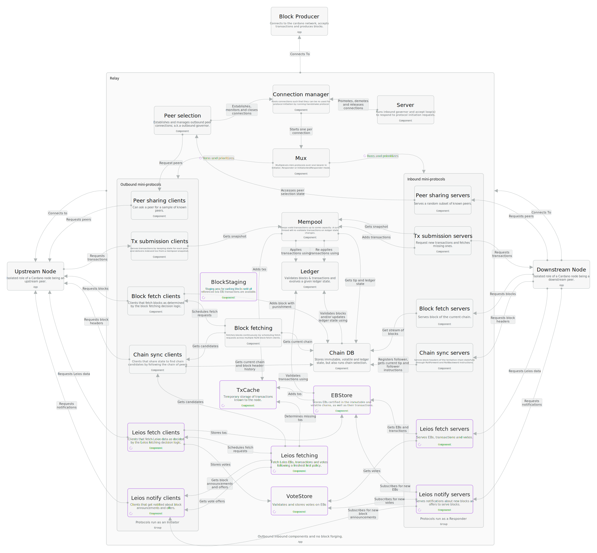

# Introduction

This technical design document bridges the gap between the protocol-level specification ([CIP-164](https://github.com/cardano-foundation/CIPs/pull/1078)) and its concrete implementation in [`cardano-node`](https://github.com/IntersectMBO/cardano-node). While CIP-164 defines *what* the Leios protocol is and *why* it benefits Cardano, this document addresses *how* to implement it reliably and serve as a practical guide for implementation teams.

This document builds on the [impact analysis](../ImpactAnalysis.md) and [early threat modelling](../threat-model.md) conducted. The document outlines the necessary architecture changes, highlights key risks and mitigation strategies, and proposes an implementation roadmap. As the implementation plan itself contains exploratory tasks, this document can be considered a living document and reflects our current understanding of the protocol, as well as design decisions taken during implementation. 

Besides collecting node-specific details in this document, we intend to contribute implementation-independent specifications to the [cardano-blueprint](https://cardano-scaling.github.io/cardano-blueprint/) initiative and also update the CIP-164 specification through pull requests as needed.

#### Document history

This document is a living artifact and will be updated as implementation progresses, new risks are identified, and validation results become available.

| Version | Date       | Author          | Changes       |
|---------|------------|-----------------|---------------|
| 0.1     | 2025-10-15 | Sebastian Nagel | Initial draft |


#### Key Design Principles

> [!WARNING]
> TODO: Needed, useful? What else to "front-load" before going into detail about architecture changes?

- **Security First**: Preserve Praos security guarantees throughout deployment
- **Early Validation**: Test critical assumptions before full implementation
- **Incremental Delivery**: Enable phased rollout with measurable milestones
- **Ecosystem Compatibility**: Minimize disruption to existing infrastructure

# Overview

Cardano as a cryptocurrency system fundamentally relies on an implementation of Ouroboros, the consensus protocol (TODO cite praos and genesis papers), to realize a permissionless, globally distributed ledger that guarantees _persistence_ and _liveness_. These two properties are central to the value proposition of Cardano, as they enable secure and censorship-resistant transfer of value, as well as the execution of smart contracts in a trustless manner. 

Ouroboros Leios is introducing _(high-)throughput_ as a third key property and is extending Ouroboros Praos, the currently deployed variant. By enabling the network to process a significantly higher number of transactions per second, Leios enables Cardano to scale economically and meet the demands of a growing user base and application ecosystem.

As it was the case for the Praos variant of Ouroboros (TODO: cite shelley network-design), the specification embodied in the published and peer-reviewed paper for Ouroboros Leios (TODO: cite leios paper) was not intended to be directly implementable. This was confirmed during initial R&D and feasibility studies, which identified several unsolved problems with the fully concurrent block production design proposed in the paper. The latest design presented in CIP-164, also known as "Linear Leios", focuses on the core idea of better utilizing resources in between the necessary "calm" periods of the Praos protocol and presents an immediately implementable design.

> [!WARNING]
> TODO: Notes on what could go here
> - Node is a concurrent, reactive (real-time) system
> - contrast real-time to not be ms-level hard real-time (control systems etc.), but as "timely" action is crucial to the success (see also network-design.pdf)
> - today concurrency is minimal and basically transaction submission and block diffusion happening at the same time + side-topics like peer sharing
> - only two responsibilities, but peer cardinalities make this highly concurrent (with quite some shared resources; related: https://ouroboros-network.cardano.intersectmbo.org/pdfs/network-design/network-design.pdf#subsubsection.5.3.2)
> - adding production and diffusion of Leios block data and votes will emphasize this further
> - use this to specify behavior as largely independent work-flows?
> - it is crucial that the node stays reactive and resource management across the concurrent responsibilities is crucial
> - bounding resource usage and/or prioritizing certain tasks over others will be crucial for the system to act
> - this stresses importance of non-functional requirements (per component), performance engineering and conducting benchmarks along the way

# Architecture

Ouroboros Leios is a significant change to the consensus protocol, but does not require fundamental changes to the overall architecture of the Cardano node. Several new components will be needed for the new responsibilities related to producing and relaying Endorser Blocks (EBs) and voting on them, as well as changes to existing components to support higher throughput and freshest-first-delivery. The following diagram illustrates the key components of a relay node where new and updated components are marked in purple:



> [!WARNING]
> TODO: Explain why focus on relay node (upstream/downstream relationship); briefly mention block producer node differences; Add similar diagram for block producer? block and vote production not shown in relay diagram

> [!WARNING]
> TODO: How to structure the changes best? Group them by layer/component or responsibility?
>
> Behavior-based sketch:
> - Transaction submission and caching
> - EB production
> - EB diffusion
> - EB storage
> - Voting committee selection
>   - Key generation
>   - Key registration
>   - Key rotation
> - Vote production
> - Vote diffusion
> - Certification
>   - Block production: Including certificates in blocks
>   - Chain validation: Verifying certificates in blocks
>   - Staging area interactions?

> [!CAUTION]
> FIXME: The next few sections are AI generated based on the impact analysis contents and the (pseudo-)Haskell code should be be replaced by other, similar level of detail specifications (barely scratching the code-level)

## Consensus
#### Block Production Thread (Updated)

**Current State (Praos):**
- Single block production per slot leadership
- Transactions selected from mempool
- VRF-based leader election

**Leios Changes:**
- Dual block production: RB + optional EB
- EB only created if RB cannot accommodate all transactions
- EB announcement hash included in RB header
- Certificate inclusion decision based on timing constraints

**Implementation Considerations:**
- Thread safety for concurrent RB/EB creation
- Memory management for large EB construction
- Deterministic ordering of operations (RB before EB)

#### Vote Production Thread (New)

**Responsibilities:**
- Monitor for new EB announcements
- Determine voting eligibility (persistent/non-persistent)
- Validate EB contents against ledger state
- Generate and sign votes using BLS keys
- Diffuse votes through network layer

**Timing Constraints:**
- Wait 3×$L_\text{hdr}$ after RB announcement (equivocation detection)
- Complete validation within $L_\text{vote}$ period
- Only vote if EB is on tip of current chain

**Implementation Notes:**
```haskell
data VoteProductionState = VoteProductionState
  { vpsEligibleEBs     :: Map SlotNo EBInfo
  , vpsVotingKeys      :: BLSSigningKey
  , vpsCurrentTip      :: RBHeader
  , vpsEBValidation    :: Map EBHash ValidationState
  }

data ValidationState
  = NotStarted
  | InProgress (Async ValidationResult)
  | Completed ValidationResult

voteProductionThread :: VoteProductionState -> IO ()
voteProductionThread state = do
  -- Wake on new EB arrival or validation completion
  -- Check voting eligibility and timing
  -- If eligible and valid, generate and diffuse vote
```

#### Vote Storage Component (New)

**Purpose:**
- Store votes indexed by (EB hash, voter ID)
- Track vote accumulation toward quorum
- Enable certificate construction
- Age out irrelevant votes

**Data Structure:**
```haskell
data VoteStorage = VoteStorage
  { vsVotesByEB      :: Map EBHash (Map VoterID Vote)
  , vsStakeByEB      :: Map EBHash Rational
  , vsCertificates   :: Map EBHash Certificate
  , vsMaxAge         :: NominalDiffTime -- ~10 minutes
  }

-- Track progress toward quorum
calculateQuorumProgress :: EBHash -> VoteStorage -> Rational
insertVote :: Vote -> VoteStorage -> VoteStorage
pruneOldVotes :: SlotNo -> VoteStorage -> VoteStorage
getCertificate :: EBHash -> VoteStorage -> Maybe Certificate
```

**Storage Policy:**
- Keep votes for at most 10 minutes (configurable)
- Discard votes for EBs older than settlement window
- Priority queue by age for efficient pruning

#### Endorser Block Store (New)

**Requirements:**
- Persistent storage of EB bodies and closures
- Volatile/immutable dichotomy like ChainDB
- Support both certified and speculative EBs
- Enable efficient retrieval by hash

**Architecture:**
```haskell
data LeiosEBStore = LeiosEBStore
  { ebsVolatile   :: VolatileEBDB
  , ebsImmutable  :: ImmutableEBDB
  , ebsIndex      :: Map EBHash EBMetadata
  }

data EBMetadata = EBMetadata
  { ebmSlot        :: SlotNo
  , ebmSize        :: Word64
  , ebmCertified   :: Bool
  , ebmLocation    :: StorageLocation
  }

-- Promote certified EBs to immutable storage
certifyEB :: EBHash -> LeiosEBStore -> IO LeiosEBStore

-- Garbage collect uncertified volatile EBs
pruneVolatile :: SlotNo -> LeiosEBStore -> IO LeiosEBStore
```

**Persistence Strategy:**
- Memory-mapped files for transaction data
- SQLite or similar for metadata and indexing
- Separate volatile and immutable storage paths
- Integration with existing ChainDB immutability logic

#### Transaction Cache (New)

**Purpose:**
- Reduce redundant fetching and validation
- LRU eviction policy
- Age-based retention (~1 hour)
- Support concurrent access

**Design:**
```haskell
data LeiosTxCache = LeiosTxCache
  { ltcTransactions :: Map TxId (Tx, TxMetadata)
  , ltcAge          :: Map TxId SlotNo
  , ltcCapacity     :: Word64
  , ltcIndexAge     :: PriorityQueue TxId SlotNo
  }

data TxMetadata = TxMetadata
  { txmValidated    :: Bool
  , txmSeenAt       :: SlotNo
  , txmFirstSeenIn  :: TxSource
  }

data TxSource = FromMempool | FromEB EBHash

-- Insert with LRU eviction
insertTx :: Tx -> TxMetadata -> LeiosTxCache -> LeiosTxCache

-- Mark as validated to reuse work
markValidated :: TxId -> LeiosTxCache -> LeiosTxCache

-- Age-based cleanup
pruneTxCache :: SlotNo -> LeiosTxCache -> LeiosTxCache
```

**Memory Management:**
- Fixed-size byte arrays for transaction storage
- Manual GC pressure management
- Double-buffered memory-mapped files for persistence (optional)

#### CertRB Staging Area (New)

**Purpose:**
- Buffer CertRBs until their EB closures arrive
- Prevent ChainDB pollution with incomplete blocks
- Enable rapid VolDB insertion when EB arrives

**Implementation:**
```haskell
data CertRBStagingArea = CertRBStagingArea
  { crsaPending  :: Map RBHash (RB, Arrival TimeStamp)
  , crsaWaiting  :: Map EBHash RBHash
  , crsaTimeout  :: NominalDiffTime -- Conservative (e.g., 5 min)
  }

-- Stage RB until EB closure available
stageRB :: RB -> CertRBStagingArea -> CertRBStagingArea

-- Release when EB arrives
releaseOnEB :: EBHash -> CertRBStagingArea -> [RB]

-- Timeout handling for missing EBs
pruneTimedOut :: CurrentTime -> CertRBStagingArea -> ([RB], CertRBStagingArea)
```

## Network
#### Leios Mini-Protocols (New)

Based on IER table from CIP-164:

**LeiosNotify Protocol:**
```
States: StIdle (Client) → StBusy (Server) → StIdle

Messages:
- MsgLeiosNotificationRequestNext (Client→)
- MsgLeiosBlockAnnouncement (←Server): RB header announcing EB
- MsgLeiosBlockOffer (←Server): EB body available
- MsgLeiosBlockTxsOffer (←Server): Transactions available
- MsgLeiosVotesOffer (←Server): Votes available
```

**LeiosFetch Protocol:**
```
States: StIdle (Client) → St{Block|BlockTxs|Votes|BlockRange} (Server) → StIdle

Messages:
- MsgLeiosBlockRequest (Client→)
- MsgLeiosBlock (←Server)
- MsgLeiosBlockTxsRequest (Client→) with bitmap addressing
- MsgLeiosBlockTxs (←Server)
- MsgLeiosVotesRequest (Client→)
- MsgLeiosVotes (←Server)
- MsgLeiosBlockRangeRequest (Client→) for syncing
- MsgLeiosNextBlockAndTxsInRange (←Server)
- MsgLeiosLastBlockAndTxsInRange (←Server)
```

**Codec Considerations:**
- CBOR serialization for all Leios messages
- Compact bitmap addressing for transaction requests
- Efficient vote bundling in MsgLeiosVotesOffer

#### Leios Fetch Decision Logic (New)

**Responsibilities:**
- Prioritize freshest EBs over stale ones
- Balance load across multiple peers
- Avoid redundant fetches
- Coordinate with vote production needs

**Algorithm:**
```haskell
data FetchDecision = FetchDecision
  { fdEBsToFetch    :: [(Peer, EBHash)]
  , fdTxsToFetch    :: [(Peer, EBHash, TxSet)]
  , fdVotesToFetch  :: [(Peer, Set VoteId)]
  , fdPriority      :: Priority
  }

data Priority = UrgentFresh | Normal | Historical

makeFetchDecision ::
     [PeerOffer]         -- Available from peers
  -> VoteProductionState -- What we need for voting
  -> ChainSelection      -- What's needed for chain selection
  -> FetchDecision

-- Freshest-first delivery
prioritizeByAge :: [EBHash] -> SlotNo -> [(EBHash, Priority)]
```

#### Praos/Leios Multiplexer (New)

**Purpose:**
- Enforce priority: Praos > fresh Leios > stale Leios
- Prevent Leios from delaying Praos diffusion
- Fair scheduling within priority levels

**Design:**
```haskell
data MuxPriority = PraosPriority | FreshLeios | StaleLeios

data MuxState = MuxState
  { msPraosQueue      :: Queue Message
  , msFreshLeiosQueue :: Queue Message
  , msStaleLeiosQueue :: Queue Message
  , msCurrentBurst    :: Maybe (MuxPriority, [Message])
  }

-- Select next message with priority bias
selectNextMessage :: MuxState -> Maybe (Message, MuxState)

-- Classify Leios messages by age
classifyLeiosMessage :: Message -> SlotNo -> MuxPriority
```

**Configuration:**
- Configurable bias ratio (e.g., 100:10:1 for Praos:Fresh:Stale)
- Starvation prevention for lower priorities
- Burst handling for urgent messages

## Ledger
#### Euler Era (New)

**Structure:**
```haskell
data EulerBlock
  = EulerTxRB TxSeq              -- RB with transactions
  | EulerCertRB Certificate      -- RB with EB certificate

data EulerHeader = EulerHeader
  { ehPrevHash      :: Hash EulerHeader
  , ehSlot          :: SlotNo
  , ehBlockNo       :: BlockNo
  , ehAnnouncedEB   :: Maybe EBHash
  , ehAnnouncedEBSize :: Maybe Word32
  , ehCertifiedEB   :: Bool
  -- Standard Praos fields...
  }

data Certificate = Certificate
  { certEBHash       :: EBHash
  , certAggSignature :: BLSSignature
  , certVoters       :: VoterSet
  }
```

**Validation Rules:**
```haskell
-- Apply CertRB by retrieving EB closure
applyCertRB :: Certificate -> LedgerState -> Either ValidationError LedgerState
applyCertRB cert ledger = do
  ebClosure <- retrieveEBClosure (certEBHash cert)
  ledger' <- applyTransactions ebClosure ledger
  validateCertificate cert ledger'
  return ledger'

-- Validate certificate
validateCertificate :: Certificate -> LedgerState -> Either ValidationError ()
validateCertificate cert ledger = do
  -- Check voters are in committee
  validateVoterEligibility (certVoters cert) ledger
  -- Verify BLS aggregate signature
  verifyBLSSignature cert
  -- Check stake threshold
  checkStakeThreshold (certVoters cert) ledger (0.75 :: Rational)
```

#### Voting Committee State (New)

**Management:**
```haskell
data VotingCommittee = VotingCommittee
  { vcPersistentVoters :: Map PoolId (Stake, BLSPubKey)
  , vcTotalStake       :: Rational
  , vcEpoch            :: EpochNo
  }

-- Compute at epoch boundary using Fait Accompli
computeVotingCommittee :: EpochState -> VotingCommittee

-- Check voter eligibility
isEligibleVoter ::
     PoolId
  -> SlotNo           -- For non-persistent sortition
  -> VotingCommittee
  -> Bool
```

#### Transaction Validation Levels (Updated)

**Three validation modes:**
```haskell
-- Full validation (mempool, first EB validation)
applyTx :: Tx -> LedgerState -> Either ValidationError LedgerState

-- Revalidation (mempool refresh, RB validation)
reapplyTx :: Tx -> LedgerState -> Either ValidationError LedgerState

-- Minimal application (certified EB in CertRB)
noValidateTx :: Tx -> LedgerState -> LedgerState
noValidateTx tx ledger =
  -- Skip expensive checks, only update UTxO
  updateUTxOSet tx ledger
```

**Performance Requirements:**
- `noValidateTx` must be < `reapplyTx` (significantly cheaper)
- `reapplyTx` must be < `applyTx` (~10× faster)
- Budget for up to 12MB of transactions per EB

### Cryptography

#### BLS12-381 Integration (New)

**Core Functionality:**
```haskell
data BLSSecretKey = BLSSecretKey ByteString
data BLSPublicKey = BLSPublicKey ByteString
data BLSSignature = BLSSignature ByteString

-- Key generation
generateBLSKeys :: IO (BLSSecretKey, BLSPublicKey)

-- Signing with domain separation
signBLS :: BLSSecretKey -> ByteString -> DomainSeparationTag -> BLSSignature

-- Verification
verifyBLS :: BLSPublicKey -> ByteString -> BLSSignature -> Bool

-- Aggregation
aggregateSignatures :: [BLSSignature] -> BLSSignature
aggregatePublicKeys :: [BLSPublicKey] -> BLSPublicKey

-- Batch verification
batchVerifyBLS :: [(BLSPublicKey, ByteString, BLSSignature)] -> Bool
```

**Proof-of-Possession:**
```haskell
data ProofOfPossession = ProofOfPossession BLSSignature

-- Generate PoP
createPoP :: BLSSecretKey -> BLSPublicKey -> ProofOfPossession

-- Verify PoP
verifyPoP :: BLSPublicKey -> ProofOfPossession -> Bool
```

**DSIGN Integration:**
```haskell
data BLS_DSIGN

instance DSIGNAlgorithm BLS_DSIGN where
  type SeedSizeDSIGN BLS_DSIGN = 32
  type SizeSignKeyDSIGN BLS_DSIGN = 32
  type SizeVerKeyDSIGN BLS_DSIGN = 96
  type SizeSigDSIGN BLS_DSIGN = 48

  genKeyDSIGN = generateBLSKeys
  signDSIGN = signBLS
  verifyDSIGN = verifyBLS
```

---

# Dependencies and interactions

> [!WARNING]
> TODO: Identify and explain dependencies, synergies and potential conflicts with other existing or future features of the node. Potential topics:
>
> - On-disk storage of ledger state (UTxO-/Ledger-HD)
> - Interactions with Genesis (catching up node)
> - Synergies with Peras:
>   - immediate: sharing key material, same key generation, registration, rotation
>   - to research: protocol-level interactions between certified EBs and boosting blocks
> - Impact onto Mithril
> - Which era to target and hard-fork schedule

> [!CAUTION]
> FIXME: The remainder of this chapter is AI generated based on rough notes

## Synergies with Peras

Peras and Leios share several design elements that enable synergistic development:

### Common Infrastructure

**Shared Components:**
1. **BLS Signature Scheme:**
   - Both protocols use BLS12-381 for voting
   - Shared cryptographic infrastructure
   - Common key management tooling
   - Unified audit and testing

2. **Voting Mechanisms:**
   - Similar sortition-based committee selection
   - Overlapping vote diffusion requirements
   - Potential for unified vote aggregation logic

3. **Priority Scheduling:**
   - Peras votes also need prioritization over Leios
   - Shared multiplexer design: Peras > Praos > Leios
   - Common freshest-first delivery mechanisms

### Development Coordination

**Parallel Development Strategy:**
```
           Peras                      Leios
             │                          │
             ├─── BLS Crypto ───────────┤  (Shared)
             │                          │
             ├─── Voting Logic ─────────┤  (Coordinate)
             │                          │
             ├─── Network Priority ─────┤  (Coordinate)
             │                          │
        (Checkpoint                (Throughput
         Voting)                    Scaling)
```

**Integration Considerations:**
- Leios vote production thread can be generalized for Peras votes
- Network multiplexer handles three priority levels: Peras > Praos > Leios
- Shared telemetry and monitoring infrastructure

### Combined Benefits

With both Peras and Leios deployed:
- **Faster finality** via Peras checkpointing
- **Higher throughput** via Leios EBs
- **Better security** through voting committee diversity
- **Unified cryptographic framework** reduces complexity

**Deployment Sequencing:**
- Option A: Deploy Leios first, add Peras later (prioritizes throughput)
- Option B: Deploy Peras first, add Leios later (prioritizes finality)
- Option C: Joint deployment (maximum benefit, higher complexity)

**Recommendation:** Deploy Leios first to address economic sustainability concerns, then add Peras for faster finality. This sequencing:
- Addresses immediate throughput bottleneck
- Validates BLS infrastructure before Peras relies on it
- Enables incremental complexity management

## Interactions with Genesis

Genesis (Ouroboros Genesis) enables nodes to bootstrap from the genesis block without trusted checkpoints. Leios requires the following considerations for Genesis compatibility:

**Key Considerations:**
- Syncing nodes must fetch both RBs and their certified EBs
- LeiosFetch `MsgLeiosBlockRangeRequest` enables efficient batch fetching during sync
- EB closures needed to validate chain density
- Chain density calculations must include transactions from certified EBs (RB-only view underestimates chain quality)
- Certified EBs must be stored permanently alongside RBs
- Immutable storage grows at ~13TB/year at sustained 200 TxkB/s throughput
- Uncertified EBs can be pruned after settlement window
- Parallel fetching from multiple peers critical for sync performance
- Genesis nodes must understand Euler era blocks and track EB certification status
- Initial Leios deployment can use trusted snapshots; full Genesis integration follows after Leios stabilization

# Risks and mitigations

> [!WARNING]
> TODO: Introduce chapter as being the bridge between changes and implementation plan; also, these are only selected aspects that inform the implementation (and not cover principal risks to the protocol or things that are avoided by design)

## Key threats

> [!WARNING]
> TODO: Selection of key threats that further inform the design and/or implementation plan. Incorporate / reference the [threat model](./threat-model.md)?

> [!CAUTION]
> FIXME: The following content is AI generated and based on the CIP + impact analysis. Reduce number of "key threats"

#### RSK-LeiosPraosContentionGC

**Description:** Leios components allocating in the same GHC heap as Praos might increase GC pauses, delaying RB diffusion.

**Impact:** HIGH - Could violate Praos $\Delta$ assumptions and compromise chain security.

**Mitigation Strategies:**
1. **Early validation via EXP-LeiosLedgerDbAnalyser:**
   - Measure GC behavior for realistic EB transaction sequences
   - Quantify mutator time and GC overhead
   - Establish safe EB size limits

2. **Process isolation (if needed):**
   - Separate Leios validation into dedicated process
   - UTxO-HD-like IPC for ledger state access
   - Accept overhead cost for GC isolation

3. **Monitoring and alerting:**
   - Instrument GC statistics in node telemetry
   - Alert on anomalous GC pause times
   - Adaptive EB production throttling

#### RSK-LeiosPraosContentionDiskBandwidth

**Description:** Simultaneous Leios writes (EBs, votes, transactions) and Praos/Ledger operations might saturate disk I/O.

**Impact:** MEDIUM-HIGH - Especially with UTxO-HD where ledger state is on disk.

**Mitigation Strategies:**
1. **Rate limiting:**
   - Limit Leios disk write rate with back-pressure to network
   - Priority I/O scheduling for Praos operations

2. **Buffering and batching:**
   - Memory buffer for EB writes before flushing
   - Batch vote storage writes

3. **Validation via EXP-LeiosDiffusionOnly:**
   - Measure disk I/O under ATK-LeiosProtocolBurst
   - Quantify impact on Praos operations
   - Tune buffer sizes and rate limits

#### RSK-LeiosLedgerOverheadLatency

**Description:** Processing 15000% of a Praos block worth of transactions in bursts might introduce unexpected latency.

**Impact:** MEDIUM - Affects vote timing and certificate generation.

**Mitigation Strategies:**
1. **Benchmarking via EXP-LeiosLedgerDbAnalyser:**
   - Process realistic EB-sized transaction sequences
   - Measure both full validation and reapplication
   - Profile CPU and memory pressure

2. **Implementation optimization:**
   - Lazy evaluation where safe
   - Transaction validation result caching
   - Parallel validation of independent transactions (future)

#### RSK-TimingViolation

**Description:** Network conditions might violate timing assumptions ($\Delta_\text{EB}$, $\Delta_\text{RB}$, etc.).

**Impact:** CRITICAL - Could compromise Praos security properties.

**Mitigation Strategies:**
1. **Conservative parameterization:**
   - Use 95th percentile network measurements
   - Add safety margins to all timing parameters
   - Start with conservative values and tighten based on empirical data

2. **Monitoring and detection:**
   - Track diffusion times in telemetry
   - Alert on timing violations
   - Adaptive parameter adjustment (future)

3. **Testnet validation:**
   - Run adversarial scenarios on testnet
   - Measure worst-case diffusion times
   - Validate timing assumptions under load

#### RSK-CertificateVulnerability

**Description:** BLS signature scheme vulnerabilities or implementation bugs could compromise vote integrity.

**Impact:** CRITICAL - Could enable invalid EB certification.

**Mitigation Strategies:**
1. **Formal verification:**
   - Agda specification of certificate validation
   - Property-based testing of BLS operations
   - Cross-implementation test vectors

2. **External audit:**
   - Third-party cryptographic review
   - Penetration testing of voting system
   - Bug bounty program

3. **Gradual rollout:**
   - Enable voting but don't rely on certificates initially
   - Parallel validation in early testnets
   - Incremental trust in cryptographic components

#### RSK-SPOAdoption

**Description:** SPOs might not adopt Leios due to increased operational complexity or resource requirements.

**Impact:** MEDIUM - Reduced decentralization or delayed rollout.

**Mitigation Strategies:**
1. **Clear documentation and tooling:**
   - Step-by-step upgrade guides
   - Automated BLS key generation and registration
   - Monitoring dashboards for Leios-specific metrics

2. **Phased rollout:**
   - Initial testnet deployment with early adopter SPOs
   - Mainnet activation only after >80% testnet participation
   - Fallback mechanisms if adoption is insufficient

3. **Incentive alignment:**
   - Ensure Leios improves SPO profitability at scale
   - No penalties for non-participation in early phases
   - Clear communication of long-term economic benefits

## Assumptions to validate early

> [!WARNING]
> TODO: Which assumptions in the CIP / on the protocol security need to be validated as early as possible?
>
> - Worst case diffusion of EBs given certain honest stake (certifying the EB) is realistic
> - The cardano network stack can realize freshest first delivery (sufficiently well)
> - A real ledger can (re-)process orders of magnitude higher loads as expected
> - ...?

## Validation approach

> [!WARNING]
> TODO: What kind of prototypes should we build? What experiments / tests should we conduct (on a testnet)? Are there non-explorative ways to validate? Which techniques help to mitigate which risks? What role does formal methods play here?

# Implementation plan

> [!WARNING]
> TODO: Motivate a rough simulations -> prototype -> testnet plan;

# Glossary

| Term | Definition |
|------|------------|
| **RB** | Ranking Block - Extended Praos block that announces and certifies EBs |
| **EB** | Endorser Block - Additional block containing transaction references |
| **CertRB** | Ranking Block containing a certificate |
| **TxRB** | Ranking Block containing transactions |
| **BLS** | Boneh-Lynn-Shacham signature scheme using elliptic curve BLS12-381 |
| **PoP** | Proof-of-Possession - Prevents rogue key attacks in BLS aggregation |
| **$L_\text{hdr}$** | Header diffusion period (1 slot) |
| **$L_\text{vote}$** | Voting period (4 slots) |
| **$L_\text{diff}$** | Certificate diffusion period (7 slots) |
| **FFD** | Freshest-First Delivery - Network priority mechanism |
| **ATK-LeiosProtocolBurst** | Attack where adversary withholds and releases EBs simultaneously |

# References

1. **CIP-164**: Ouroboros Linear Leios - Greater transaction throughput https://github.com/cardano-scaling/CIPs/blob/leios/CIP-0164/README.md

1. **Leios Impact Analysis**: High-level component design https://github.com/input-output-hk/ouroboros-leios/blob/main/docs/ImpactAnalysis.md

1. **Leios Formal Specification**: Agda implementation https://github.com/input-output-hk/ouroboros-leios/tree/main/formal-spec

1. **Cardano Ledger Formal Specification**:
   https://github.com/IntersectMBO/formal-ledger-specifications/

1. **Ouroboros Peras Technical Design**: Finality improving consensus upgrade https://tweag.github.io/cardano-peras/peras-design.pdf

1. **Ouroboros Genesis**: Bootstrap mechanism https://iohk.io/en/research/library/papers/ouroboros-genesis-composable-proof-of-stake-blockchains-with-dynamic-availability/

1. **Ouroboros Network Specification**:
   https://ouroboros-network.cardano.intersectmbo.org/pdfs/network-spec/network-spec.pdf

1. **UTxO-HD Design**:
    https://github.com/IntersectMBO/ouroboros-consensus/blob/main/docs/website/contents/for-developers/utxo-hd/index.md
