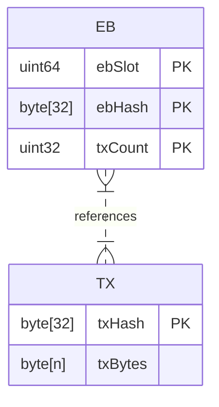
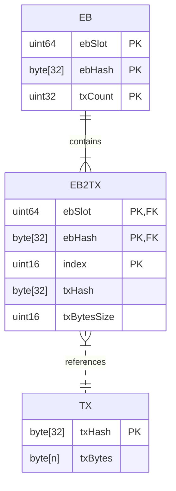
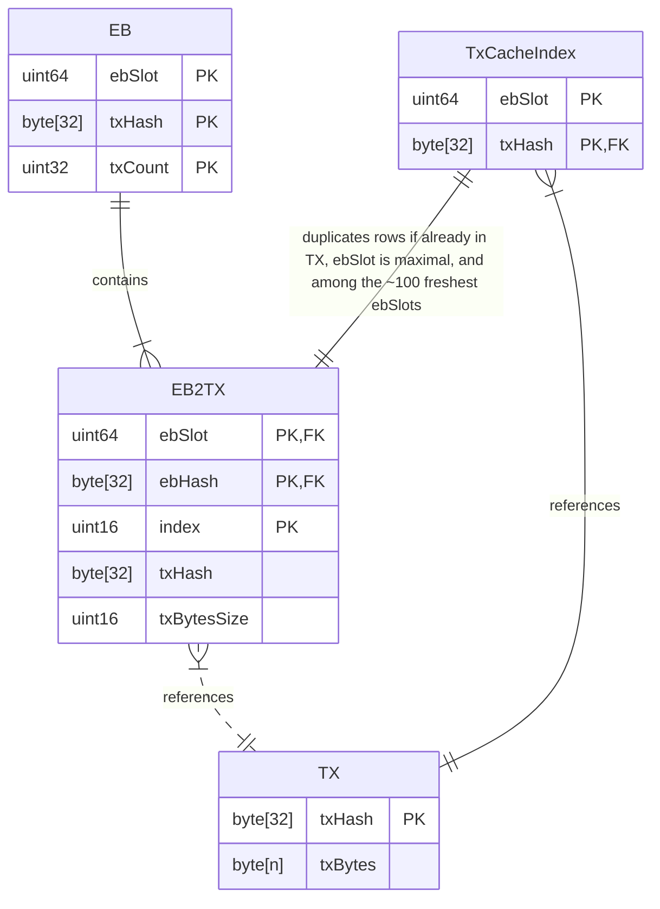
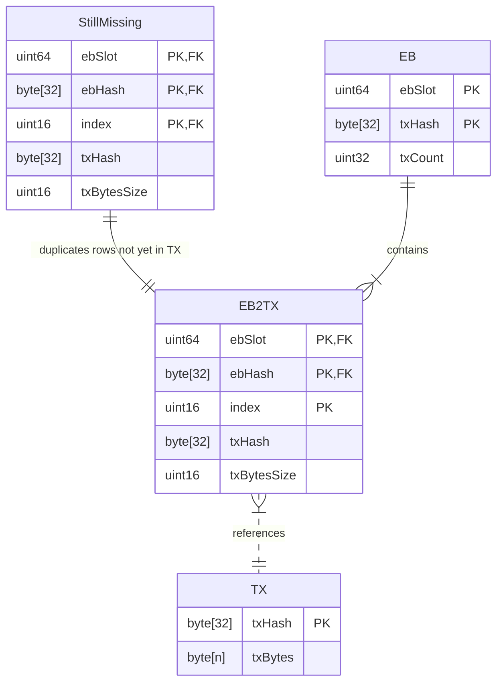

## Entity-Relationship Diagrams (ER Diagrams)

The EbBody-EbClosure split can be usefully visualized with the following ER Diagrams.

### Logical

Conceptually, EBs and TXs exist in a many-to-many relationship.



### Physical

It is conventional and useful to reify that many-to-many relationship as an explicit so-called _associative_ entity, especially because an EB's transaction references are ordered.



(Typical DB normalization would suggest that the txBytesSize should instead be in the TX table, but it's _necessarily_ a part of an EbBody, and so it naturally resides in the EB2TX table.)

### Pruning

ER diagrams do not include any information about the lifetime or multiplicity of entities.
In the case of LeiosFetch logic, the key lifetimes are as follows.

- Each individual EB has a lifetime of ≤ 36 hr.
- A single transaction could be referenced by multiple EBs and so its lifetime could be unbounded (eg there's always at least one EB ≤ 36 hr old referencing it).
- Since there could be ≤ ~10000 EBs at once and each could only reference ≤ ~15000 transactions, there are ≤ ~150 million transactions references at once.
- Thus there are also ≤ 150 million transactions at once (ie it's possible none of those transaction references overlap).

Therefore, the table size upper bounds are as follows.

- The EB table has ≤ ~10000 rows.
- The EB2TX table has ≤ ~150 million rows.
- The TX table has ≤ ~150 million rows.

Those upper bounds can hold continually only if the tables are regularly pruned.

The EB table and EB2TX table can be directly pruned according to ebSlot.
Since ebSlot is the first component of the primary key, a matching index necessarily exists and so this is a inexpensive operation.
As long as its done "often enough" per 36 hr window, it'll be sufficient; the effective bound on the number of EB rows will be only slightly inflated.

```
DELETE FROM EB
WHERE slot < TheCurrentCutoff;

DELETE FROM EB2TX
WHERE ebSlot < TheCurrentCutoff;
```

The TX table is more difficult to prune, because the lifetimes are dynamically determined by the contents of EB2TX.
As a starting point, the following SQL statement would remove TXs that are no longer referenced by EB2TX.

```
DELETE FROM TX
WHERE NOT EXISTS (
    SELECT 1 
    FROM EB2TX
    WHERE EB2TX.txHash = TX.txHash
);
```

There are two major downsides to the performance of that query as-is.

First, an index on EB2TX would significantly accelerate that subquery, at the cost of incremental overhead on every alteration of EB2TX (TODO is this tradeoff acceptable?).

```
CREATE INDEX idx_EB2TX_txHash ON EB2TX(txHash);
```

Second, that now-accelerated subquery is still happening once for each of the ≤ 150 million rows of TX.
That full scan can be avoided since a row in TX can only become orphaned when a referencing row is pruned from EB2TX.
Thus, the minimal-traffic approach to the so-called "reverse cascade" deletion logic could be implemented as follows.

```
-- Lightweight temp table for the deleted references
CREATE TEMPORARY TABLE deleted_refs (txHash BLOB);

DELETE FROM EB
WHERE slot < TheCurrentCutoff;

-- Temporarily retain the deleted references
INSERT INTO deleted_refs (txHash)
DELETE FROM EB2TX
WHERE ebSlot < TheCurrentCutoff
RETURNING txHash;

-- Delete if BOTH in the temp table AND ALSO no remaining references
DELETE FROM TX
WHERE
      txHash IN (SELECT txHash FROM deleted_refs)
  AND NOT EXISTS (
      SELECT 1 
      FROM EB2TX
      WHERE EB2TX.txHash = TX.txHash
  );

DROP TABLE deleted_refs;
```

### Adding the TxCache

Notice that the idx_EB2TX_txHash INDEX used to accelerate the pruning of TX contains enough information to function as the TxCache (ie the set $S$ from CIP-164).
However, it also contains much more beyond that---it indexes all ≤ ~10000 EBs rather than only the freshest ~100 EBs that the TxCache is responsible for.
It therefore runs the risk of spanning too many pages to always be fully retained in memory, which in turn means querying it would risk disk-levels of latency within the LeiosFetch hot loop.

An explicitly bounded portion of that index can therefore be manually maintained in-memory.
It could be an in-memory database table or a bespoke data structure, whichever has the best balance of simplicity and space-/time-efficiency.



### Tracking missing transactions

The LeiosFetch decision logic needs to know which transactions it still needs requests for.
The StillMissing table in the following ERD tracks exactly that subset of EB2TX.



In the common cases, the StillMissing table will easily fit in-memory, but in the worst-case it could grow to gigabytes (eg if the adversary is sending maximal EbBodies but withholding all EbClosures).
Thus, this table's occupancy in-memory needs to be carefully controlled.

The `ebSlot`, `ebHash`, and `index` fields could be very efficiently stored as ≤ 10000 entries in a map from point to bitmap, each with ≤ 15000 bits, for a total of ~19 MB.
However, the `txHash` and `txBytesSize` fields alone could total ≤ 5 GB.

A combination of FreshestFirst prioritization and the set of EBs offered by each peer allow for identifying a sufficient subset of StillMissing to retain in memory at any particular time.
Assuming ~25 upstream peers, retaining StillMissing rows for the 10 freshest EBs offered by each peer would require ≤ 125 MB, even if none of those sets overlap (which is unlikely except for an eclipsed or nearly-eclipsed node).
Permitting up to 10 EBs per peer allows even just a single extremely fast peer to avoid unnecessary disk-latency when relaying a concentrated burst of even 10 EBs.
And that remains true even if that peer is the only honest peer.
(Such larger bursts would be rare among honest EBs, but could be frequently arranged among adversarial EBs.)

In a scenario where several EBs did arrive all at once, the bytes of the transactions being received from the network and then written to the TX table would dominate the size of the corresponding in-memory subset of StillMissing.
The RAM for those bytes would ideally also be controlled in the same way as for the in-memory subset of StillMissing.
However, doing so would consume too much RAM at the same multiplicity of 10 full EbClosures per peer, since an EbClosure is 24 times the size of an EbBody.
It would be tolerable at 2 or 3 EbClosures per peer, for a total of ~600 MB in-memory.
But then a single honest peer would no longer be enough to transfer a concentrated burst of more than that many EBs without delaying those after the second/third; the node would have to finish all outstanding requests for the first EB before it could start requesting any transactions from the EBs after the second/third, and so on.
And it is likely that even honest EBs will frequently arise in concentrated bursts of 3.

Managing these tables' in-memory occupancy during worst-case scenarios will be a major challenge incurred by using SQLite for the StillMissing, EB2TX, and/or TX tables.
It's not clear what SQLite's page cache's eviction policy is.
The documentation doesn't specify it, and the commented source code is terse.
The comments indicate a best-effort at some kind of LRU, but it's not obvious what exactly is considered a "use".
(My interpretation so-far of the source code comments on `struct PCache` in `pcache.c` is that a "use" is when a cached page _first_ becomes dirty.)

SQLite does allow for a custom page cache implementation, but that code would incur a significant maintenance burden, at least because the rest of the SQLite engine makes non-trivial assumptions about the page cache's behavior.
Moreover, that interface is managed only in terms of page numbers, which do not inherently correspond to the relevant domain-specific data such as EBs' slot numbers.
(TODO are there examples to assess of bespoke page caches _other than_ the SQLite devs' testing mocks?)

Typical contemporary HDD latencies are 2 ms to 10 ms.
Typical contemporary SSD latencies are 1 ms to 5 ms.
Premium disks would be faster but are not already a system requirement for running a Cardano node.
More affordable options from cloud providers risk shifting the density within the probability distribution of disk latencies away from 0 seconds due to multi-tenancy contention, enterprise-grade network-attached storage, etc.

Moreover, those duration numbers must be weighed in the context of SQLite needing multiple trips for even the simplest SQL statements, due to index table lookups and data table lookups both spanning multiple disk pages and large BLOBs (eg some transactions) also spanning multiple disk pages.
Thus page cache hits---ie in-memory occupancy---are critical for low latency per SQL statement in the LeiosFetch hot loop.

TODO in light of reading all that, what's the conclusion?
Are the following our only options?

- Use a bespoke storage layer (eg rely on OS for paging, but give it domain-specific hints via `fadvise`) so that there's a more tractable argument that latency spikes for the freshest EBs will be avoided even in the worst-case.
  And also so that memory can be use as efficiently as possible.
- Instead use SQLite for StillMissing and/or the writes to EB2TX and TX, and try to develop an argument that its default page caching algorithm---whatever its details turn out to be---will behave "well enough" (eg "close enough" to FreshestFirst) even in worst-case scenarios?

## Atomicity, Consistency, Isolation, and Durability (ACID)

SQLite is well-known as an ACIDic database system.
However, the extent of its guarantees for those properties is parameterizable, usually as a significant trade-off with performance.
Moreover, even if the LeiosFetch logic manually manages some of its backing store insead of relying on SQLite, the extent of its own ACID guarantees ought to be understood.
In other words, ACID is a useful framework for organizing some requirements of the LeiosFetch backing store and justifying the details of its implementation.

### Consistency

The StillMissing and the TxCacheIndex in-memory data structures must be consistent with the data they index.
An inconsistency in either direction would waste latency and/or bandwidth, as follows.

- If StillMissing claims some data is missing but it's actually present, then the decision logic will wastefully fetch that transaction from additional peers.
  That wastes bandwidth and might add delays to other transactionsn would could have been fetched instead.
- If StillMissing claims some data is present but it's actually missing, then the decision logic won't issue any requests for that transaction.
  Thus, that EB is either stuck forever or the code must include additional complexity for detection and recovery.
  Moreover, such recovery could only happen after some positive delay, which adds to the EB's overall latency.
- The risks are the same for the TxCacheIndex.

### Atomicity and Isolation

On the other hand, the following minor race conditions among those Consistency properties are completely acceptable.
The design remains sufficiently robust even if those invariants for some index entries were to lapse for several milliseconds at a time.

- Issuing the write that inserts the data (eg calling `pwrite`, eg commiting the SQLite transaction) just before adding it to the in-memory index.
- Removing data from the index just before issuing the write that deletes it.

That assertion is based on the assumption that those writes will resolve quickly, eg in < 10 milliseconds.
If every individual write had to become fully Durable, then the latency would usually violate that assumption.

- For manually managed disk operations within a single process, the write terminates as soon as the written data is fit into a kernel buffer, and the OS then provides the expected read-after-write invariant.
  As long as the OS is not overloaded, that'll happen without requiring a trip to disk.
  (TODO confirm the claims I've seen that Linux will flush batches of dirty pages to disk every 30 seconds or so)
- The situation is similar for SQLite in WAL-mode with PRAGMA synchronous set to NORMAL---the majority of INSERT/UPDATE transactions will COMMIT without requiring a trip to disk.
  Only [checkpoints](https://sqlite.org/wal.html#checkpointing) incur `fsync` calls, and that documentation indicates they can be scheduled (eg via a background thread).
  However, any checkpoint will block the entire database interface while it's running (TODO double-check this claim).
  The duration of a checkpoint must include an fsync of the WAL file, a copy of the dirty pages (sorted ascending, for speed) from the WAL file to the database file, and an fsync of the database file.
  TODO what's the estimate for that duration, presumably parameterized by how much data has been written since the previous checkpoint?

As mentioned above, the OS provides unsurprising read-after-write behavior because the node is a single process.
SQLite's [Isolation](https://sqlite.org/isolation.html) documentation offers a similar property _within a single connection_.
Between multiple connections, the results of one's INSERT/UPDATE only becomes visible to the others once that transaction COMMITs.
TODO will the "acceptable race conditions" described above be entirely contained within a single SQLite database connection?

### Durability

The Durability property has two components: risk of losing recent writes and risk of corruption.
For Leios, as with Praos, losing some of the most recent data is acceptable, since it can be reacquired from the decentralized network.
It's unrealistic to assume a caught-up node would remain _exactly_ as caught-up even if its OS/hardware crashes/loses power.
Thus, risk of corruption is the remaining concern.

Corruption in this case would mean that some subsequent accesses to the database would fail.
Only realizing some older data that seems to be available actually isn't is unacceptable.

That said, the StillMissing and TxCacheIndex themselves don't need to be durable, because they can be reconstructed as part of initialization, from whatever was successfully persisted to disk (TODO is that reconstruction slow enough to justify avoiding it after a clean shutdown?).
In the case of SQLite, the risk of database corruption is already very well mitigated.
In the case of manually managed files, a file format that begins with the size and hash is sufficient to allow for corruption to be identified and truncated during reconstruction---this is much simpler than in general cases because of EbAnnouncements and EbBodies always providing sizes and hashes.

If a node's persistent storage somehow fails without the node process immediately crashing (eg the HDD locks up), then that node is already doomed.
It will be able to rejoin the network after repairs, thanks to decentralization.
The most the node design could do in that scenario would be to crash sooner rather than later and with as useful of an error message as possible.
Cardano does not claim to resist an adversary that can simultaenously destroy the storage of an arbitrary number of nodes.
