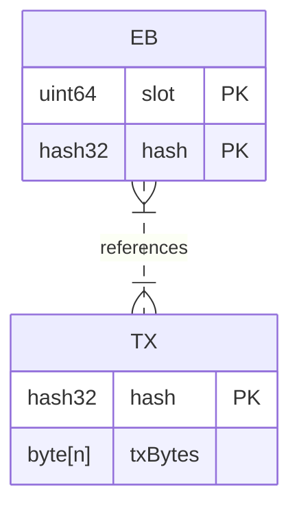
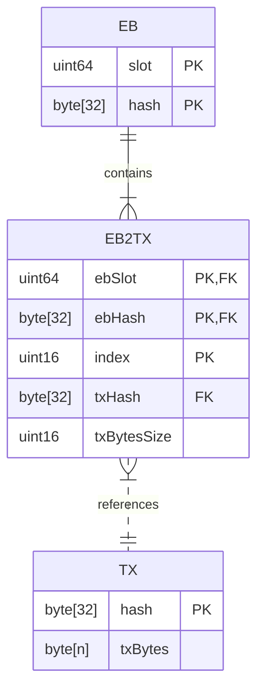
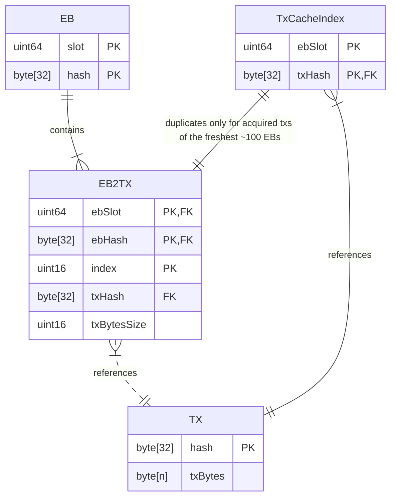
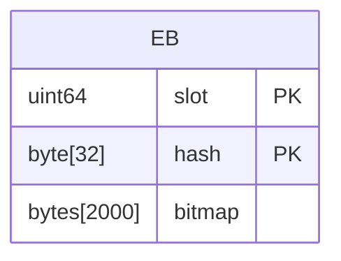

## Entity-Relationship Diagrams (ER Diagrams)

### Logical

Conceptually, EBs and TXs exist in a many-to-many relationship.



### Physical

It is conventional and useful to reify that many-to-many relationship as an explicit so-called _associative_ entity, especially because an EB's transaction references are ordered.



(DB normalization suggests that the txBytesSize should instead be in the TX table, but it's _necessarily_ a part of an EbBody, and so it naturally resides in the EB2TX table.)

### Pruning

ER diagrams do not include any information about the lifetime or multiplicity of entities.
In the case of LeiosFetch logic, the following are the key lifetimes.

- Each individual EB has a lifetime of ≤ 36 hr.
- A single transaction could be referenced by multiple EBs and so its lifetime could be unbounded (eg one EB per 36 hr).
- Since there could be ≤ ~10000 EBs at once and each could only reference ≤ ~15000 transactions, there are ≤ 150 million transactions references at once.
- Thus there are also ≤ 150 million transactions at once.

Therefore, the table sizes are as follows.

- The EB table has ≤ ~10000 rows.
- The EB2TX table has ≤ ~150 million rows.
- The TX table has ≤ ~150 million rows.

But those limits can only be maintained overtime if the tables are regularly pruned.
The EB table and therefore the EB2TX table can be pruned according to ebSlot.
Since ebSlot is the first component of the primary key, a matching index necessarily exists and so this is a inexpensive operation.
As long as its done "often enough" per 36 hr window, it'll be sufficient; the effective bound on the number of EB rows will be slightly inflated.

```
DELETE FROM EB
WHERE slot < TheCurrentCutoff;

DELETE FROM EB2TX
WHERE ebSlot < TheCurrentCutoff;
```

The TX table is more difficult to prune, because the lifetimes are dynamically determined by the contents of EB2TX.
As a starting point, the following SQL statement would remove TXs that are no longer referenced by EB2TX.

```
DELETE FROM TX
WHERE NOT EXISTS (
    SELECT 1 
    FROM EB2TX
    WHERE EB2TX.txHash = TX.hash
);
```

There are two major downsides to the performance of that query.

First, an index on EB2TX would significantly accelerate that subquery, at the cost of incremental overhead on every alteration of EB2TX.

```
CREATE INDEX idx_EB2TX_txHash ON EB2TX(txHash);
```

Second, that now-accelerated subquery is still happening once for each of the ≤ 150 million rows of TX.
That full scan can be avoided since a row in TX can only become orphaned when an referencing EB is pruned from EB2TX.
Thus, the minimal-traffic "reverse cascade" logic could be achieved as follows.

```
BEGIN TRANSACTION;

-- Lightweight temp table for the deleted references
CREATE TEMPORARY TABLE deleted_refs (txHash BLOB);

DELETE FROM EB
WHERE slot < TheCurrentCutoff;

-- Temporarily retain the deleted references
INSERT INTO deleted_refs (txHash)
DELETE FROM EB2TX
WHERE ebSlot < TheCurrentCutoff
RETURNING txHash;

-- Delete if BOTH in the temp table AND ALSO no remaining references
DELETE FROM TX
WHERE
      hash IN (SELECT txHash FROM deleted_refs)
  AND NOT EXISTS (
      SELECT 1 
      FROM EB2TX
      WHERE EB2TX.txHash = TX.hash
  );

DROP TABLE deleted_refs;

COMMIT;
```

### Adding the TxCache

Notice that the idx_EB2TX_txHash INDEX used to accelerate the pruning of TX contains enough information to function as the TxCache.
However, it also contains much more beyond that---it indexes all ≤ ~10000 EBs rather than only the freshest ~100 EBs.
It therefore runs the risk of spanning too many pages to always be fully retained in memory, which in turn means querying it would risk disk-levels of latency within the LeiosFetch hot loop.

An explicitly bounded portion of that index can therefore be manually maintained in-memory.
It could an in-memory database table or a bespoke data structure, whichever is easier.



### Adding the bitmaps

TODO


