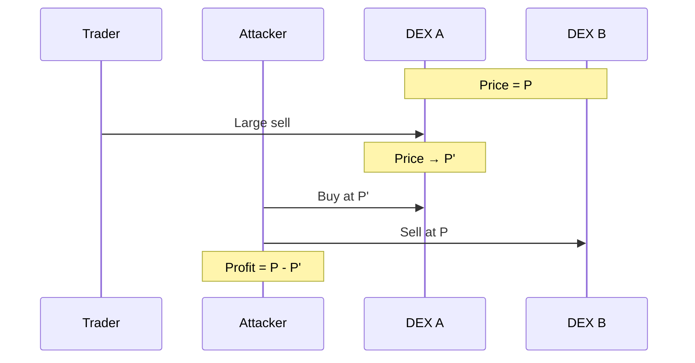
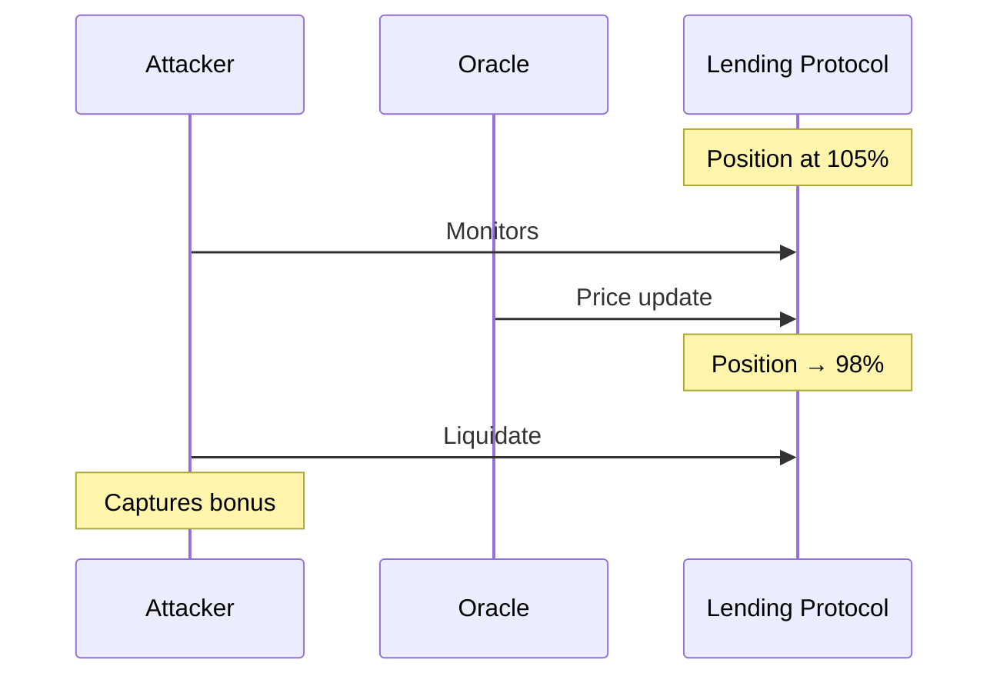

# Back-Running Attacks

Back-running involves placing a transaction immediately after a target transaction to profit from its effects.

## Arbitrage

**Description**: After a large trade moves the price on one venue, the attacker executes arbitrage transactions to profit from the price discrepancy.

**Mechanism**:
1. Large trade Tlarge executes, moving price on DEX A
2. Attacker's Tarb buys on DEX A (now cheaper) and sells on DEX B (still at old price)
3. Attacker profits from price difference

**Cardano Applicability**: High. Cross-DEX arbitrage is common and profitable on Cardano. The eUTxO model doesn't prevent this pattern since each DEX has separate UTxOs.

**Leios Impact**: = The increased transaction throughput of Leios may create more arbitrage opportunities as trading volume increases, but the fundamental dynamics are unchanged.

**Note**: Arbitrage back-running is generally considered beneficial for market efficiency, as it aligns prices across venues.

---

## Liquidation

**Description**: Monitoring for liquidation opportunities in lending protocols and executing liquidation transactions immediately when conditions are met.

**Mechanism**:
1. Attacker monitors collateral positions approaching liquidation threshold
2. When oracle update Toracle makes position liquidatable, attacker submits Tliquidate
3. Attacker captures liquidation bonus

**Cardano Applicability**: High for lending protocols like Liqwid. Liquidation opportunities are competitive and time-sensitive.

**Competition Dynamics**:
- Multiple bots monitor same positions
- Race condition on liquidation transactions
- Block producer can prefer own liquidation transactions

**Leios Impact**: = Protocol-dependent rather than consensus-dependent. Leios doesn't fundamentally change liquidation dynamics.
