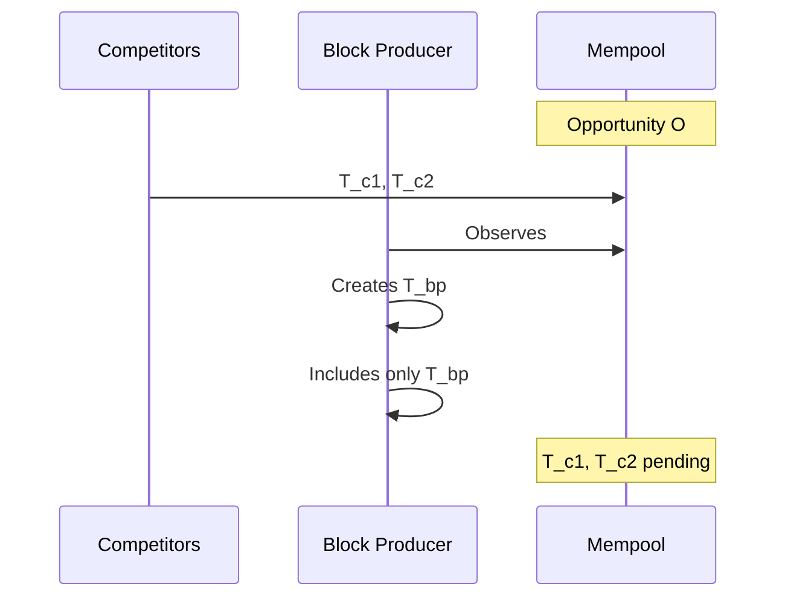
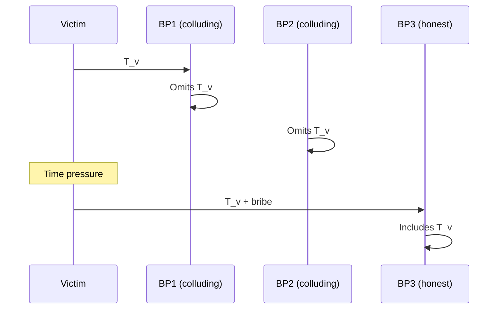

# Censorship as MEV

Deliberate transaction omission for economic gain.

## Competitive

**Description**: Block producer omits competitor transactions to ensure their own transactions capture MEV opportunities.

**Mechanism**:
1. Block producer observes MEV opportunity O
2. Block producer omits all competing transactions targeting O
3. Block producer includes own transaction capturing O

**Cardano Applicability**: Low - limited by mempool persistence.

Omitted transactions remain in mempools and will be included by subsequent honest block producers. This limits censorship to single-block opportunities.

**Leios Impact**: ↑ EB production gives each block producer a larger block to fill, potentially increasing short-term censorship effectiveness. However, the distributed nature of block production means censorship remains temporary.

**Threat Model Reference**: T16 - Omit transactions from EB

---

## Targeted

**Description**: Sustained censorship of specific addresses or transaction types to extract value.

**Mechanism**:
1. Attacker with significant stake coordinates censorship
2. Target transactions are delayed, creating time pressure
3. Victim forced to pay premium (bribe) for inclusion

**Cardano Applicability**: Very Low - requires substantial coordinated stake.

With current stake distribution, sustained censorship is difficult:
- Would require coordination among multiple large stake pools
- Easily detectable via on-chain analysis
- Reputation and delegation risk for participating pools

**Leios Impact**: = The 75% voting quorum for EB certification in Leios further distributes power, making coordinated censorship harder rather than easier.
