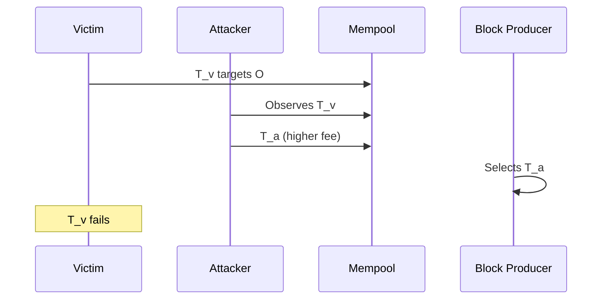
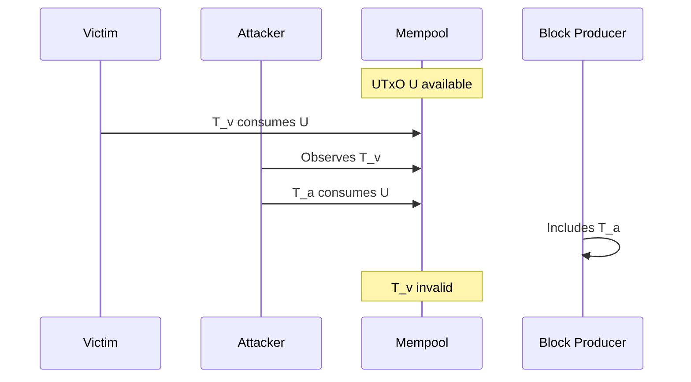
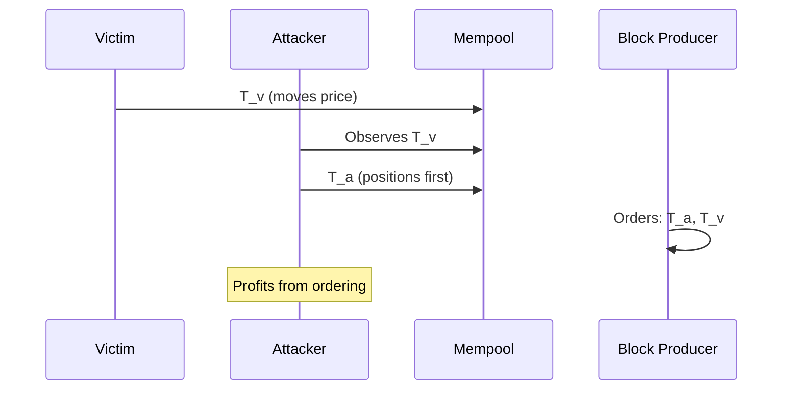

# Front-Running Attacks

Front-running occurs when an observer sees a pending transaction and submits their own transaction to execute before it, capturing value that would otherwise go to the original transaction.

## Skip-the-Line

**Description**: Attacker observes a profitable transaction in the mempool and submits a competing transaction with higher priority (typically higher fees) to execute first.

**Mechanism**:
1. Victim submits transaction Tv targeting opportunity O
2. Attacker observes Tv in mempool
3. Attacker submits Ta targeting same opportunity O with higher fees
4. Block producer includes Ta before Tv (or instead of Tv)
5. Tv fails or becomes unprofitable

**Cardano Applicability**: Moderate. While Cardano doesn't have a gas auction mechanism like Ethereum, transaction fees and block producer discretion still allow priority ordering. DEX batchers are particularly vulnerable since they aggregate multiple user orders.

**Leios Impact**: ↑ The coupled RB/EB production model means block producers control transaction ordering in both RBs and EBs, potentially increasing front-running opportunities during periods of high MEV.

---

## Displacement

**Description**: The attacker's transaction completely replaces or invalidates the victim's transaction rather than merely executing before it.

**Mechanism**:
1. Victim submits transaction Tv consuming UTxO U
2. Attacker observes Tv and submits Ta also consuming U
3. Block producer includes Ta
4. Tv becomes invalid (UTxO already consumed)

**Cardano Applicability**: High for script-based applications. The eUTxO model's explicit input specification means transactions competing for the same UTxO are mutually exclusive. Particularly relevant for:
- DEX order matching (multiple users targeting same liquidity pool UTxO)
- Auction bids
- First-come-first-served protocols

**Leios Impact**: = EB transaction selection (threat T18) enables block producers to choose which competing transaction wins, but UTxO contention dynamics remain unchanged.

---

## Insertion

**Description**: The attacker inserts their transaction immediately before the victim's without necessarily invalidating it, but extracting value from the ordering.

**Mechanism**:
1. Victim submits transaction Tv that will move market price
2. Attacker inserts Ta before Tv to profit from the price movement
3. Both transactions execute, but attacker profits from advance knowledge

**Cardano Applicability**: Limited by eUTxO determinism. Since Cardano transactions don't read global state, pure insertion attacks are constrained. However, oracle-dependent applications remain vulnerable:
- Lending protocol liquidations triggered by oracle updates
- DEX arbitrage following large trades

**Leios Impact**: ↑ EB construction happens locally, invisible to network until announcement, enabling more sophisticated insertion strategies.
