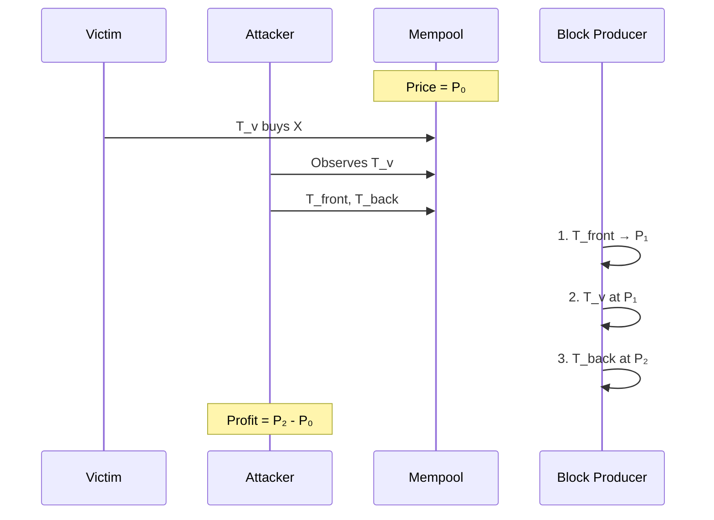
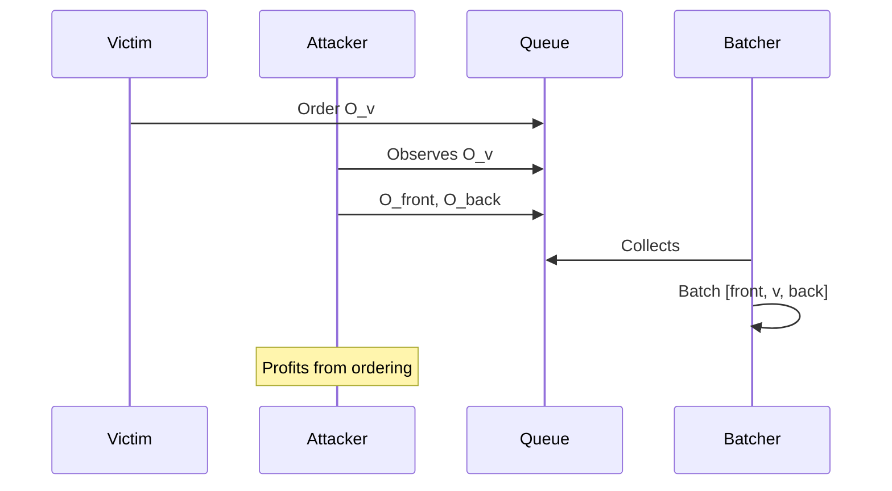

# Sandwich Attacks

Sandwich attacks combine front-running and back-running around a victim transaction.

## Classic

**Description**: Attacker places one transaction before and one after the victim's transaction, profiting from the price impact.

**Mechanism**:
1. Victim submits swap Tv: buy token X with Y
2. Attacker front-runs with Tfront: buy X with Y (raises price of X)
3. Victim's Tv executes at worse price
4. Attacker back-runs with Tback: sell X for Y (at elevated price)
5. Attacker profits from the spread

**Cardano Applicability**: Very Low - significantly limited by eUTxO model.

Classic sandwich attacks require:
- Predictable price impact from victim transaction
- Ability to execute all three transactions atomically or with guaranteed ordering
- No UTxO contention between the transactions

On Cardano:
- DEX AMM pools use UTxOs that can only be consumed once per transaction
- Attacker's front-run and victim's swap would compete for the same pool UTxO
- This contention naturally prevents most sandwich patterns

**Leios Impact**: = The EB construction gives block producers more control over transaction ordering, but eUTxO contention still limits sandwich feasibility.

---

## Batcher-Level

**Description**: Exploiting the ordering within DEX batcher transactions rather than blockchain transaction ordering.

**Mechanism**:
1. Attacker monitors DEX batcher mempool/queue
2. Attacker submits orders designed to sandwich victim orders within the batch
3. Batcher aggregates all orders into single transaction
4. Order execution sequence within batch determines profit distribution

**Cardano Applicability**: Moderate - this is the primary sandwich vector on Cardano.

DEXes like Minswap and SundaeSwap use batchers that aggregate multiple user orders:
- Batchers control order sequencing within their transactions
- Malicious or compromised batchers could extract MEV
- Even honest batchers face MEV pressure

**Batcher Ordering Strategies**:

| DEX | Strategy | MEV Exposure |
|-----|----------|--------------|
| SundaeSwap | FIFO (oldest first, skip if out of slippage) | Lower |
| Minswap | Similar FIFO approach | Lower |
| MuesliSwap | Profit-maximizing order selection | Higher |
| Splash | Permissionless EEOs with order steering + reputation | Variable |

**Typical Slippage Tolerances**:
- Standard swaps: 1–10%
- Memecoins/volatile: up to 100%

**Leios Impact**: ↑ Higher throughput may increase batcher transaction sizes, potentially increasing MEV opportunities within batches.
