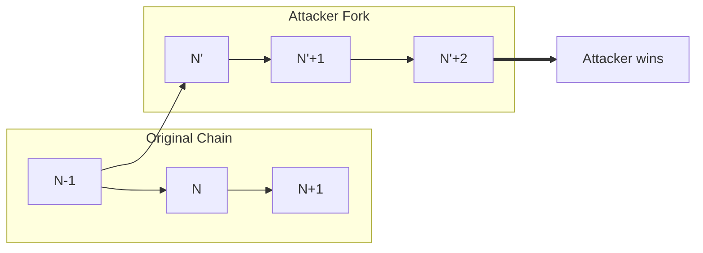

# Time-Bandit Attacks

Time-bandit attacks involve blockchain reorganization to extract MEV from already-confirmed transactions.

## Chain Reorganization for MEV

**Description**: A block producer with sufficient stake reorgs recent blocks to capture MEV that was extracted by others.

**Mechanism**:
1. Block at height N contains profitable MEV extraction by party A
2. Attacker with sufficient stake builds alternative chain from N-1
3. Alternative chain includes attacker's own MEV extraction
4. If attacker's chain becomes canonical, they capture the MEV

**Cardano Applicability**: Very Low - limited by Praos settlement guarantees.

Cardano's Ouroboros Praos provides probabilistic finality:
- Settlement parameter k (currently 2160 blocks, ~12 hours) provides high confidence
- Reorgs deeper than a few blocks are extremely rare
- Stake-weighted leader election makes deep reorgs expensive

**Economic Analysis**:

For a time-bandit attack to be profitable:
- MEV value must exceed opportunity cost of honest block production
- Attacker needs sufficient stake to win fork competition
- Risk of detection and reputation damage

Given Cardano's stake distribution, sustained reorgs require substantial coordination that would likely be detected.

**Leios Impact**: = Leios inherits Praos settlement guarantees. The EB/certificate mechanism doesn't fundamentally change reorg economics. Time-bandit attacks remain impractical against settled transactions.
