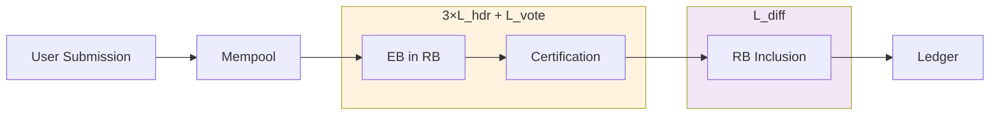

# Linear Leios MEV Vectors

MEV considerations specific to Linear Leios that extend beyond the base threats (T16-T19) covered in the [threat model](../threat-model.md).

## Mempool Observation Window

Linear Leios extends the window during which pending transactions are observable compared to Praos.

### Transaction Lifecycle

Using [CIP-0164 parameters](https://github.com/cardano-scaling/CIPs/blob/leios/CIP-0164/README.md#protocol-parameters):

| Phase | Duration | MEV Observation |
|-------|----------|-----------------|
| Mempool | ~seconds | Same as Praos |
| Equivocation detection | 3×Lhdr (3 slots) | EB announced but voting not started |
| Voting | Lvote (4 slots) | EB contents visible, voters fetching txs |
| Diffusion | Ldiff (7 slots) | Certified EB propagating |

**Total new observation window**: ~14 slots between EB announcement and certificate inclusion.

### Post-EB Observation (New in Leios)

Unlike Praos where transactions go directly from mempool to block, Leios creates an intermediate observation window after EB announcement:

- Voters must fetch and validate transactions before voting
- EB contents become visible to the network before finality
- Non-producer actors gain a new window to observe and react

**Lvote Trade-off**: Longer voting windows improve security margins but increase MEV observation time. Parameter selection should consider this.

### Mempool Partitioning

See [mempool partitioning analysis](../../post-cip/planning/Analysis%20of%20the%20mempool%20partitioning%20attack.md).

Mempool consistency affects MEV dynamics:
- **High overlap**: MEV opportunities visible to many (more competition, less extraction per actor)
- **Low overlap**: Information asymmetry advantages (less competition, more extraction)

---

## Voting Committee MEV

The voting mechanism introduces potential MEV vectors, though with limited practical impact.

### Vote Timing

Voters learn EB contents before voting. Strategic timing could theoretically:
- Delay votes on EBs containing competitor transactions
- Accelerate votes on EBs containing own transactions

**Assessment**: Limited impact - voting rewards encourage prompt participation, and timing manipulation affects only certification speed, not transaction validity.

### Certificate Information

Certificates reveal which EBs will be included before RB inclusion. This could inform trading strategies.

**Assessment**: Limited impact - certificate information becomes available close to RB inclusion, leaving a narrow exploitation window.
