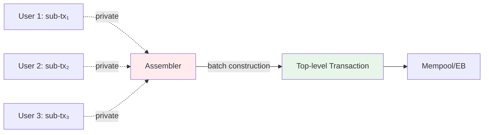
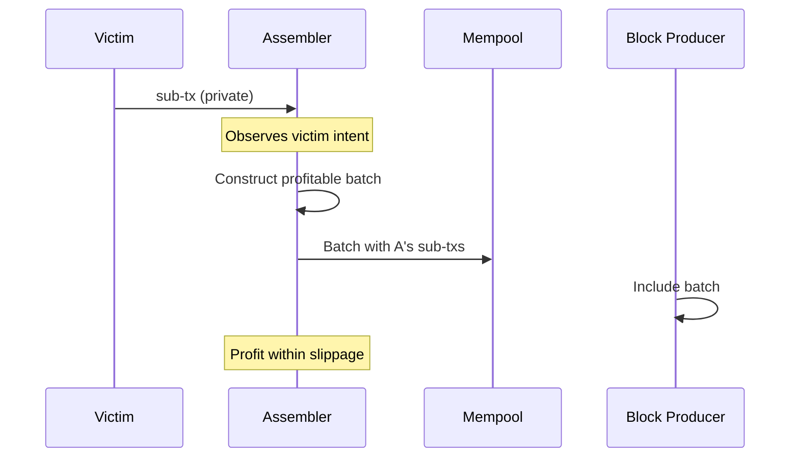
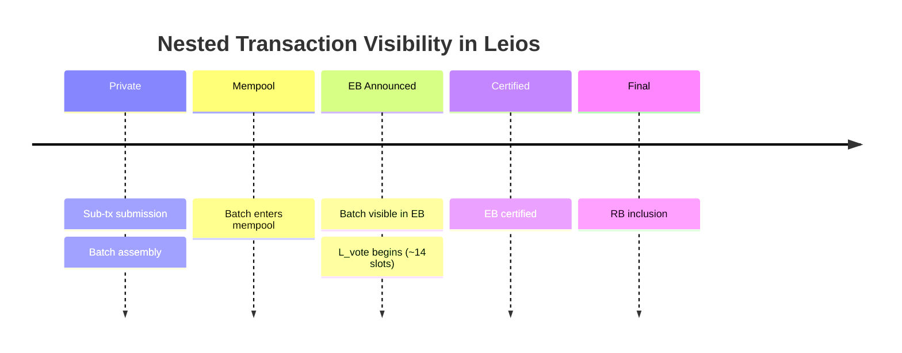
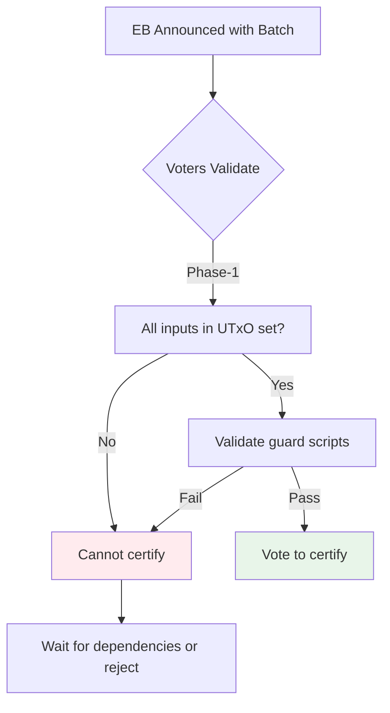

# Nested Transactions (CIP-0118) and MEV

Analysis of MEV implications for [CIP-0118](https://github.com/cardano-foundation/CIPs/pull/862) nested transactions in Linear Leios.

## Overview

**Finding:** Nested transactions shift MEV extraction from public mempool to infrastructure layer (assemblers), creating dynamics similar to current DEX batchers. While atomic execution and private distribution provide benefits for specific use cases, the assembler role introduces significant MEV opportunities and centralization risks.

CIP-0118 introduces batching of partially valid sub-transactions that achieve balance collectively through off-chain assembly. Key use cases include atomic swaps, Babel fees (non-ADA fee payment), and DEX aggregation.

### Core Mechanism

**Properties:**
- **Counterparty irrelevance**: Sub-transaction authors don't approve batch composition
- **Atomic execution**: Entire batch succeeds or fails together
- **Phase-1 first**: Complete batch validated before any script execution
- **Guard scripts**: Top-level scripts can enforce batch-wide constraints

---

## Assembler as MEV Extraction Point

The batch assembler role closely parallels current DEX batchers, representing the primary infrastructure attack vector.

**Assembler Control:**
- Selects which sub-transactions to include
- Determines internal ordering within batch
- Observes all submitted sub-transactions before public visibility
- Can inject own sub-transactions into batches

**Comparison to Current DEX Batchers:**

| Aspect | Current Batchers | Nested Transaction Assemblers |
|--------|------------------|-------------------------------|
| **Control** | Order selection within batch | Sub-transaction selection + ordering |
| **Observation** | All submitted orders | All submitted sub-transactions |
| **MEV Strategy** | FIFO (SundaeSwap) vs profit-max (MuesliSwap) | Same spectrum possible |
| **User Protection** | Slippage tolerance | Guard scripts (if implemented) |

**Leios Impact:** ↑ Higher throughput enables larger batches, potentially increasing per-batch MEV opportunities. The Lvote observation window applies to complete batches, not individual sub-transactions.

---

## Private Distribution vs. Mempool Observation

Off-chain sub-transaction submission reduces broad mempool exposure but concentrates information at assembler layer.

**Information Flow Timeline:**

**Observation Windows:**

| Phase | Visibility | MEV Risk | Comparison to Standard Tx |
|-------|-----------|----------|---------------------------|
| Sub-tx submission | Assembler only | Assembler MEV | Better (not in public mempool) |
| Batch in mempool | Public | Traditional front-running | Same |
| EB announcement | Public | Lvote observation | Same (Leios-specific) |
| Post-certification | Public | Limited (near-final) | Same |

**Assessment:** Private distribution reduces risk from general mempool observers but creates information asymmetry favoring assemblers. Similar to private mempool solutions ([Flashbots Protect](https://protect.flashbots.net/)), but with same trust assumption on operators.

**Leios Impact:** = The Lvote observation window (~14 slots between EB announcement and certification) applies equally to nested batches. During this window, batch contents are visible but not yet final, enabling informed trading by observers.

---

## Attack Vector Analysis

**Key insight:** Assemblers are functionally equivalent to current DEX batchers in terms of MEV opportunities. All existing [batcher-level attacks](./attack-vectors/sandwich.md) apply to nested transaction assemblers with the same dynamics.

**What's the same:**
- Front-running (skip-the-line, insertion)
- [Batcher-level sandwich attacks](./attack-vectors/sandwich.md) - primary concern
- Back-running (arbitrage, liquidation)
- Censorship (selective exclusion)

**What's different:**

### Guard Scripts (New Protection)

Users can implement top-level scripts that enforce batch composition constraints. Unlike simple slippage tolerance, guard scripts can cryptographically enforce:
- Exact sub-transaction set requirements
- Minimum output guarantees
- Counterparty restrictions

**Limitation:** Requires sophisticated implementation; most users unlikely to deploy effective guard scripts without application-layer support.

### Dependency Exploitation (New Attack)

The constraint "all inputs must be in UTxO set before any batch transactions apply" creates griefing potential unique to nested transactions. Attacker can submit sub-transactions that consume UTxOs victim sub-transactions depend on, preventing batch assembly without directly attacking the victim.

**Note on eUTxO contention:** Classic sandwich attacks remain prevented - three sub-transactions attempting sequential execution on the same pool UTxO create Phase-1 conflicts. UTxO contention applies between batches but not within batches (atomic execution).

---

## Dependency Complexity in Linear Leios

Nested transactions interact with Leios's multi-phase consensus in ways that increase validation burden and certification risk.

**EB Certification Requirements:**

**Certification Timing Impact:**
- Batches with external dependencies must wait for prerequisite UTxOs
- If batch depends on outputs from uncertified EB, certification blocked
- Increases average Lvote duration for complex batches
- Voting committee must perform Phase-1 validation on complete batch structure

**Cascade Failure Risk:**
- If Batch A depends on outputs from Batch B
- And Batch B fails certification (insufficient votes)
- Then Batch A also fails
- Creates coupled failure modes uncommon in single-transaction model

**Leios Impact:** ↑ The EB certification process becomes more complex with nested batches. Lvote parameter selection should account for increased validation time. Risk of reduced certification rates if batches have many external dependencies.

---

## RB Bypass Applicability

High-value nested batches can potentially use RB-only inclusion ([T19](../threat-model.md)) to bypass EB observation windows, similar to high-value individual transactions.

**Size Constraints:**
- RB capacity: ~90 kB
- Simple atomic swap batch: 5-10 kB (viable)
- Babel fee batch: 5-8 kB (viable)
- Complex DEX aggregation: 20-50+ kB (marginal)
- Large multi-party coordination: 50+ kB (unlikely to fit)

**Shared script deduplication** helps: All sub-transactions can reference the same script stored once, significantly reducing batch size compared to separate transactions.

**Trade-offs:**

| Aspect | EB Inclusion | RB-only (T19) |
|--------|--------------|---------------|
| **Throughput** | Higher | Lower (RB space limited) |
| **MEV Protection** | Exposed during Lvote | Bypasses EB observation |
| **Censorship Resistance** | Better (75% voting quorum) | Worse (single block producer) |
| **Finality** | Slower (Lvote + Ldiff) | Faster |

**Recommendation:** High-value, MEV-sensitive batches (large trades, competitive arbitrage) should consider RB-only when batch size permits. Routine batches use EB for higher throughput.

---

## Comparative Assessment

| Aspect | Mitigation Factor | Worsening Factor | Net Effect |
|--------|-------------------|------------------|------------|
| **Mempool observation** | Private distribution reduces broad front-running | Assembler observes all sub-txs with privileged timing | ± Mixed |
| **User control** | Guard scripts enable cryptographic constraints | Counterparty irrelevance loses composition control; guard scripts require expertise | ± Mixed |
| **Attack surface** | Atomic execution prevents partial attacks; eUTxO still prevents classic sandwich | New assembler MEV vector; infrastructure attack point | ↓ Worse |
| **Infrastructure** | Competitive assembler market possible | Strong centralizing tendency toward dominant assemblers | ↓ Worse |
| **Leios integration** | RB bypass available for high-value batches; atomic during Lvote | Larger txs reduce EB capacity; validation burden increases; dependency risks | ↓ Worse |

**Overall Assessment:** ↓ Nested transactions worsen the MEV landscape by creating a new infrastructure attack vector while not eliminating existing MEV opportunities. The assembler role concentrates power similar to current DEX batchers.

**Key Insight:** CIP-0118 doesn't fundamentally change MEV dynamics - it shifts extraction from public mempool to infrastructure layer. The [batcher-level sandwich](./attack-vectors/sandwich.md) (primary Cardano MEV vector) persists in new form.

**Use-Case Specific Analysis:**
- **Atomic swaps**: Enable new functionality; MEV acceptable for coordination service
- **Babel fees**: Enable non-ADA fee payment; fee sponsor MEV acceptable for liquidity service
- **DEX aggregation**: Marginal improvement over current aggregators; similar trust assumptions
- **General DEX trading**: No clear advantage; potentially worse due to assembler centralization

---

## Recommendations

**For Protocol Designers:**
- Monitor assembler market concentration; consider decentralization mechanisms
- Lvote parameter selection should account for increased batch validation time
- Consider protocol-level assembler accountability (slashing for provable MEV extraction)

**For Application Developers:**
- Implement guard scripts for all nested transaction use cases
- Provide guard script templates for common scenarios (atomic swaps, fee payments, aggregation)
- Enable users to submit to multiple assemblers simultaneously
- Display assembler reputation/MEV history to users

**For Users:**
- Use guard scripts that enforce exact batch composition constraints
- Submit to multiple assemblers when timing permits
- For high-value transactions, consider RB-only inclusion if batch size allows
- Understand that private submission still exposes intent to assemblers

**For Further Research:**
- Quantify assembler centralization over time
- Develop protocol-level mechanisms for fair batch assembly (e.g., batch auctions with uniform clearing)
- Analyze cross-chain comparison: how do other chains handle batch assembly MEV?
- Explore zk-proof-based solutions for private batch assembly without trusted assemblers
