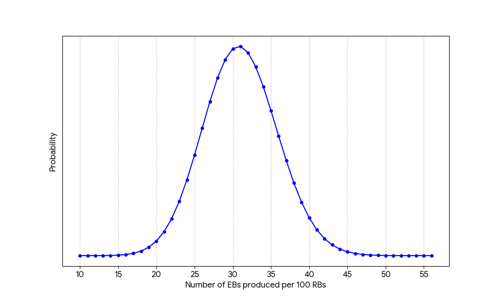

# Post-CIP R&D Findings

This document catalogs Leios-related findings and artifacts that were created subsequent to the [Leios CIP](https://github.com/cardano-foundation/CIPs/pull/1078).

## Markovian model of Linear Leios

[Markovian simulation of Linear Leios](../analysis/markov/) computes the probability of EB certifications as RBs are produced.

The protocol state is represented by three quantities.

- The number of RBs that have been produced.
- The number of EBs that have been produced.
- Whether an honest RB was produced.
- Whether a certificate is ready for inclusion in the next RB.

Time is tracked in terms of block-forging opportunities instead of in terms of slots.

Transitions occur in several substeps:

1. _Forge RB:_ create a new RB.
2. _Certify:_ include a certificate in the RB.
3. _Forge EB:_ create a new EB.
4. _Vote:_ cast votes to reach a quorum.

The `linleios` program executes the Markov model for EB production in Linear Leios. The protocol parameters and network characteristic are specified as flags on the command line. The program outputs the following information:

- The efficiencies, on `/dev/stdout`.
    - RB efficiency: the fraction of possible RBs that were actually produced.
    - EB efficiency: the fraction of possible EBs that were actually produced.
    - Efficiency: the fraction o possible payload bytes that were actual produced.
- The "missing probability" resulting from the finite-resolution arithmetic of the computations, on `/dev/stderr`.
- Optionally, a JSON file containing the probabilities of the given number of certified EBs.

The figure below shows example results for the probability distribution of the number of EBs generated per 100 RBs. This directly relates to Leios efficiency.

## Analysis of UTxO set size and UTxO lifetime

[Analysis of Cardano mainnet](../post-cip/tx-lifetime/tx-lifetime.ipynb) indicates that the number of active UTxOs has leveled off at approximately 11 million unspent transaction outputs. The data likely is not sufficient to build a statistical model to forecast the size of the UTxO set as a function of demand: a more speculative model would be needed.

In terms of lifetime, UTxOs have a trimodal distribution:
- About 3% of UTxOs are spent in the same block that they are created.
- About 65% of the UTxOs are active less than one day.
- The remainder are active for multiple days, sometimes for months or years.

|                                                                                                                 |                                                                                                                  |
| --------------------------------------------------------------------------------------------------------------- | ---------------------------------------------------------------------------------------------------------------- |
|  |  |
