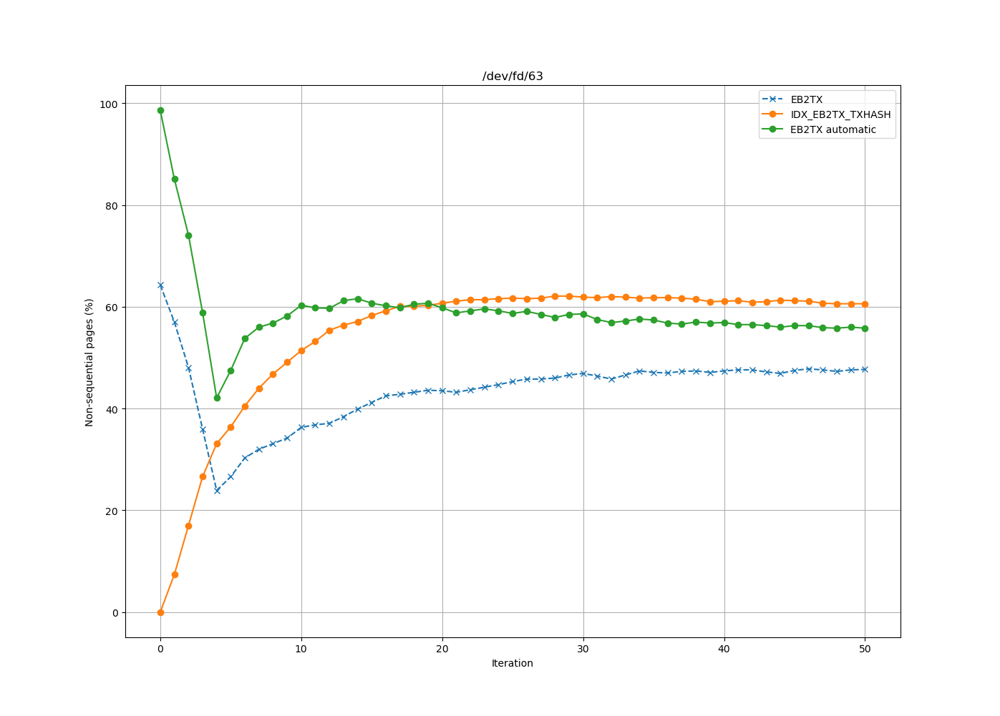
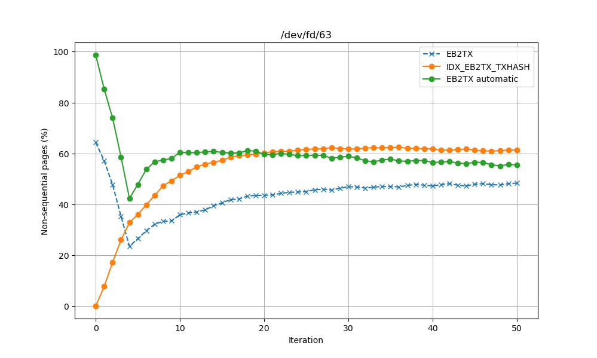
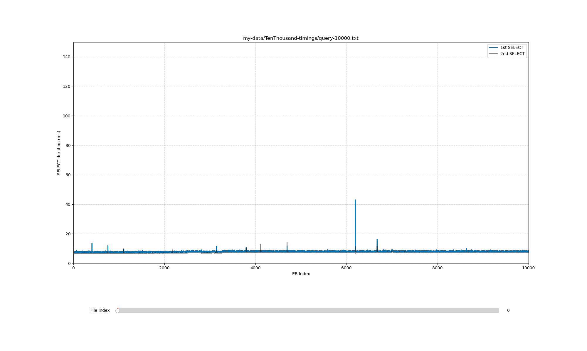
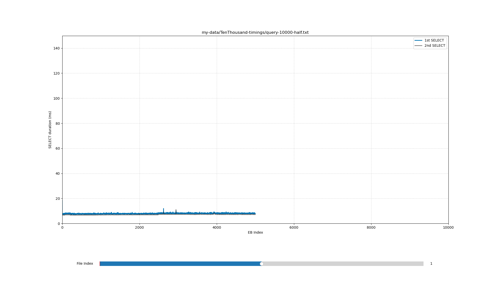
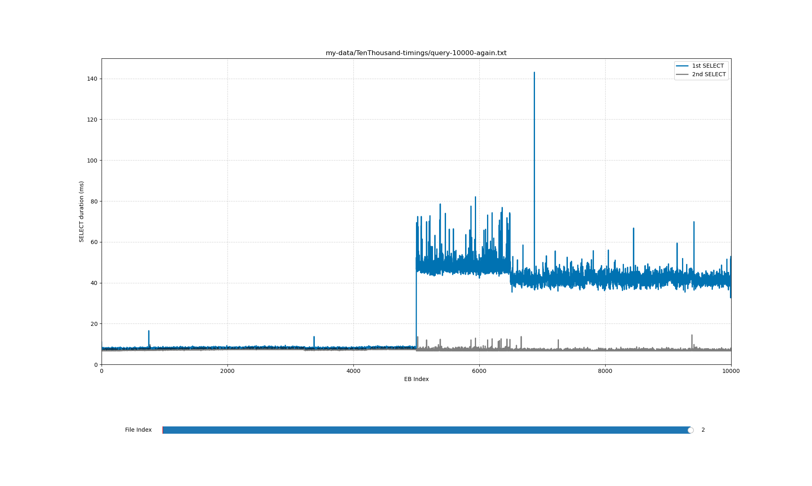
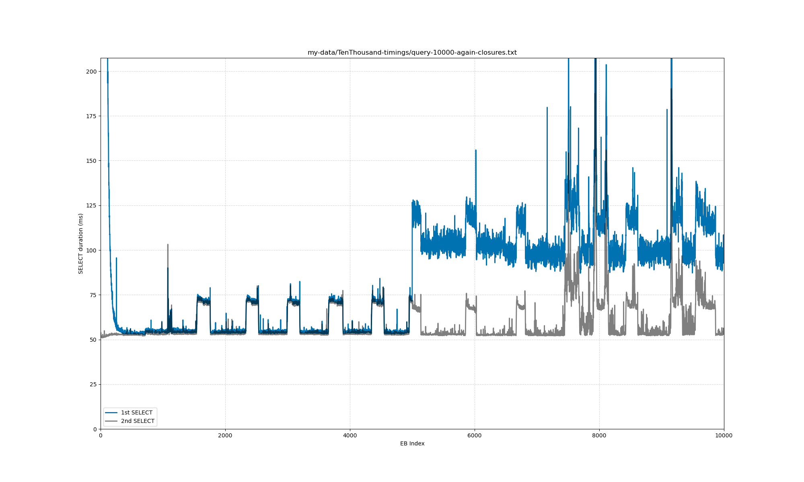
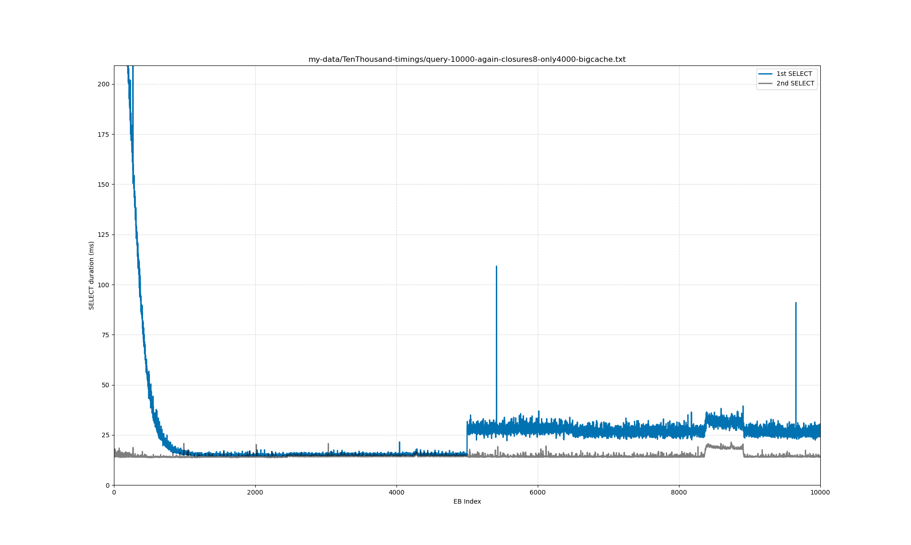

These benchmarks measure the space and time overheads of SQLite.

## Packages

These scripts all execute in the following shell.

```
nix-shell -p sqlite -p sqlite-analyzer -p vmtouch -p 'python3.withPackages (p: [p.numpy p.tqdm p.matplotlib])'
```

The sqlite3 python package is used.
See https://docs.python.org/3/library/sqlite3.html#transaction-control for an explanation of why these scripts do not explicitly manage transactions.

## Scope for Space Assessment

For now, it's only EbBodies, with the following schema.

```
CREATE TABLE IF NOT EXISTS EB (
    ebSlot INTEGER,
    ebHash BLOB,
    PRIMARY KEY (ebSlot, ebHash)
);

CREATE TABLE IF NOT EXISTS EB2TX (
    ebSlot INTEGER,
    ebHash BLOB,
    txIndex INTEGER,
    txHash BLOB,
    txBytesSize INTEGER,
    PRIMARY KEY (ebSlot, ebHash, txIndex),
    FOREIGN KEY (ebSlot, ebHash) REFERENCES EB(ebSlot, ebHash)
);

CREATE INDEX IF NOT EXISTS idx_EB2TX_txHash ON EB2TX(txHash);
```

We avoided the TX table because it'd be 150+ GB and very slow to work with.
We use a workaround below to simulate it when assessing latency.

## Scripts for Space

- extendDb.py foobar.sqlite 10000 adds EbBodies to foobar.sqlite until it contains 10000 of them.
  Their ebSlots will have a distribution that is comparable to the worst-case, and the min and max ebSlot will never be more than 129600 apart.
  The inter-EB gaps are drawn randomly (to stand in for the adversary withholding EBs to an arbitrary degree), but the resulting ebSlots are still inserted in ascending order; the random `ebHash` means the combined PK is not ordered, though.
  Upon initial creation, foobar.sqlite's minimum ebSlot will be near 1000000 rather than 0.
  Every EbBody has 15000 transactions with a total byte size near 12 MB (the 12 MB target is not strictly enforced --- the script uses a single Pareto draw, which is statistically close).
    - This script and pruneDb.py both use aggressive PRAGMAs (synchronous=0, cache_size=1000000, locking_mode=EXCLUSIVE, temp_store=MEMORY).
    - The query scripts use PRAGMA synchronous = NORMAL.

- pruneDb.py foobar.sqlite 2000000 will delete all EbBodies whose ebSlot is ≤ 2000000.

- churn_loop.sh (TODO rename and then find-replace herein) churns out the oldest EBs once per iteration, for some number of iterations.
  It also dumps the results of sqlite3_analyzer for each iteration.

- plot-nonseq-pages.py plots the curves of the non-sequential pages percentages from those iterations.
  See its header comment for how to extract those numbers from the output of sqlite3_analyzer.

## Findings about Space

- The result of generating 10000 EBs with extendDb.py is a ~27.5 GB file.
    - The ebPoint optimization could probably recover ~25% of that.
      But the worst-case TX table itself would still be orders of magnitude larger than that savings.
      That optimization would also significantly increase the fanout of the EB2TX automatic index, but its average is already 80.
- That file takes about 30 minutes to create, on a niceish NVMe SSD.
- For 100 EBs instead of 10000 EBs, a loop in which each iteration deletes the oldest 50 and then fills back up to 100 has a random small free list after 50 iterations.
    - This efficiency is unsurprising, but nice to explicitly see.
      TODO will adding the TX table change that?
- The automatic EB2TX index seems to grow to 60% and then drifts down to ~55% non-sequential pages.
  However, a downward trend is apparent, and I'm not sure where the asymptote (if any) actually is.
    - The txHash index stabilizes a little over 60%, also for both of those churn rates.
    - The EB2TX table itself seems to have an asymptote at 50%.
        - TODO(asymptote): the "stabilizes" and "asymptote at 50%" claims are from runs that stop at iteration 50 and at a smaller scale (1000 or 100 EBs). The author already flags that the automatic index is still drifting, so those curves may not actually have reached an asymptote. Either run longer, or soften the language to "approaching ~50%/~60% through 50 iterations; true asymptote unproven."
    - See the `nonseq-pages*png` plots.
        - 
        - 
    - Using a churn rate of 25% or 50% both seem to give indistinguishable plots.
    - The TX table would presumably resemble the txHash index, except it'll have overflow pages, which might distort things.

## Scripts for Time

- queryEbBodies.py will query the EbBody of every row in the EB table, in ascending order of ebPoint.
  The list of EBs is gathered first, so that removes some noise.
  That step is done on a separate, explicitly closed connection, so that its page cache is dropped.
  Morever, `vmtouch` is called to have the OS drop its cache of the database file's pages.
  Then the SELECTs are each issued in duplicate, one should miss the cache and the next won't.

   - The first doesn't miss the cache as consistently as I would hope, despite our efforts.
     My theory is that just opening the connection loads at least the first page, which is sometimes near some of the actual pages we need.
     Or maybe the drive/driver itself is also doing some caching --- I'm not going to try hard enough to eliminate that.

- queryEbClosures.py is just like queryEbBodies.py but with one additional step per txIndex.
    - After looking up the EB's txHashes, it then looks up each one in the idx_EB2TX_txHash and fetches the first ebHash associated with it.
    - This has very similar dynamics asf properly assembling an EbClosure from the TX table.
    - In fact, it'd be indistinguishable if all of the txs in that EB were exactly 32 bytes large.
      So it's a good stand-in for a lower bound on the cost of that.

- plot-timings.py shows the results of queryEb*.py for each iteration of churn_loop.sh.

- index-overhead-test.sh checks the run-time of pruning and then inserting ~3000 EBs from a pristine fresh 10000 EB database with and without the index.
    - It records the timestamp before and after each step and evicts the database from the OS page cache between steps.
    - 3000 and 3001 are numbers on either side of my initial guess at the threshold for it being faster to delete the index and then rebuild it rather than maintain it during the batch of changes.

- extendDio.py is like extendDb.py but uses O_DIRECT; it doesn't have any cleverness about extending the slots if the file already exists.

- bench-python-overhead.py bounds the Python-loop / cursor-iteration contribution to queryEbClosures.py's per-EB latency.
  See "Checking the Python cursor iterator's contribution to latency" below for the method and results.

## Findings about Time

- Sequential pages drastically improve latency.
  Recall that churn spoils them.
    - `timings-query-bodies-10000{,-half,-again}.png` visualize the results of queryEbBodies.py after each of three steps: create the 10000 EB database, prune the oldest 5000, add another younger 5000.
        - 
        - 
        - 
    - (Recall that extendDb.py adds the EBs in random order, since the adversary can withhold theirs arbitrarily.)
    - The first plot (no suffix) shows the benefits of OS prefetching: almost every one of the 10000 EBs takes ~8 ms to fetch.
    - The third plot (`-again` suffix) shows that churn spoils the sequential pages that enable it for the newer half of the EBs: most of them take at least 40 ms.
        - TODO(steady-state): this "~40 ms" is measured after a single prune+extend cycle at the 10000-EB scale, not after repeated churn. The 100-EB note below observes the typical case at smaller scale is lower, so the 10000-EB post-1-cycle number may not reflect steady-state either direction. Measuring steady-state at 10000-EB scale would require running many churn iterations at that scale (much longer wall-clock than the 100-EB multi-iteration runs we already have).
        - Why is it _so_ bad?
          Perhaps pruneEb.py happens to incur a reverse-ordered freelist?
	  I double-checked: SQLite does not allow anyway to control the order of rows in a DELETE, so the freelist order can't be easy to control.
        - The fanout for the automatic index of EB2TX at the end is 68, and the fanout for the table itself is 76.
          Since log_68 10000 and log_76 10000 are both ~2 and each disk trip seems to be about 8 ms, the ~40 ms seems explicable by misses in both the SQLite and OS caches.
        - (88.8% of that index's pages are non-sequential in the third database file.)
    - On a scale of 100 EBs, the same behavior is visible, and more iterations are affordable in the experiment.
      It seems that the typical case after many iterations of more granular churn is not the full 40 ms, but it is still tens of milliseconds.
      The supposition is that the 40 ms would turn out to be slightly inflated compared to continual churn of one EB per hundreds of thousands of iterations.
- The `timings-query-closures-crop200-10000-again` file (visualizing the latencies after the third phase, `-again` suffix) has three remarkable features.
  (TODO(steady-state): everything in this "after the third phase" bullet is measured on the database that exists after exactly one prune+extend cycle. It is a snapshot of a transient, not a steady-state measurement. Since we don't have multi-iteration closure data at 10000-EB scale (the multi-iteration run-halves/run-quarters runs are at 100-1000 EBs, and their "timingsClosures" files were actually queryEbBodies output before a bugfix in churn_loop.sh), the true post-churn behavior for a 10000-EB database under repeated churn is not characterized here.)
    - 
    - There's a big spike at the start that I don't have an interesting theory for.
    - The sequential pages hide an additional 50 ms latency per EB; the non-outlier worst-case is about 120 ms per EB.
    - There's a pulse wave of about 20ms extra latency with a mostly-regular ~30% duty cycle.
        - I ran queryEbClosures.py again the next day, and most of the pulses weren't there.
	- A couple stay, though.
	  They're farther apart, start later, don't align with pulses in the original plot, and seem about half as wide---mysterious
	- Other than those pulses, the latency is unaffected.
- If I restrict the queryEbClosures.py logic to just the 4000 <= txIndex < 8000 rows instead of all 15000, the plot is much improved.
  
    - There is no pulse wave.
    - Cache hits fall from ~55 ms to ~15 ms.
    - The non-cache hits (ie non-sequential pages) fall from ~100 ms to ~30 ms.
    - (Those were with default connection settings.
      If I increase the cache size, add EXLUSIVE and temp_store etc, nothing changes.)
- The idx_EB2TX_txHash slows down inserts and deletes by somewhere from 2x to 8x.
    - With synchronous=NORMAL and the rest default (eg 4000 page cache):
        - The prune that drops the index was 5.5 minutes, where the last 3 minutes was building the index at the end.
        - The prune that kept the index was 43.5 minutes (!).
	- However, I think this is much worse due to the bounded cache size etc.
    - With the same PRAGMAs as extendDb.py (eg 1 million page cache):
        - The prune that drops the index was 7 minutes, where the last 5 minutes was building the index at the end.
        - The prune that kept the index was 15.5 minutes.
        - Thus the extra cache causes approximately an 8x slowdown.
        - The average prune time per EB with the index was 310 milliseconds.
            - That's tolerable as an average.
            - However, it's undesirable for all other writes to be blocked for that long whenever the node needs to prune even just one EB.
	    - And that's the _average_ using unsafe PRAGMAs, big page cache, etc.
	    - Pruning even just one EbBody might therefore need to be broken into increments.
            - And this is merely to delete the EbBody, not even the EbClosure!
    - The extend that drops the index was 14.5 minutes, where the last ~8 minutes was building the index at the end.
    - The extend that kept the index was ~17 minutes.
        - That's another average near ~340 milliseconds.
	- However, this script interleaves data generation with SQLite operations, so a chunk of average isn't SQLite latency.
	    - I subsequently made it two phase, at it's looking like ~90 to ~100 milliseconds of non-SQLite work per EB.
	- Still, though, there's a 3x slowdown from (14.5 - 8) to 17 minutes when the index is retained, so that suggests a non-trivial SQLite time/slowdown.
        - Again, that's the _average_ using unsafe PRAGMAs, big page cache, etc.
	- And this is merely to write the EbBody, not even the EbClosure!
	  On the other hand, EbClosures will usually be written in multiple parts, so they could be comparable to EbBodies.

After the above ^^^, I changed the extendDb.py script to prepare all the data in memory before persisting any of it.

- extendDb.py writes 32 EBs per second when extending from 6999 to 10000 dropping the index; 1.5 minutes to write them, 6 minutes to rebuild the index.
- extendDb.py writes 2.75 EBs per second when extending from 7000 to 10000 without dropping the index; ~18 minutes to write them.
  That's a 12x slowdown, ignoring the index reconstruction.
- extendDio.py writes 40 EBs per second, regardless of how many it's writing.
- extendDb.py on an empty file _starts_ at 40 EBs per second, but slows down to ~34 EBs per second by the end (recall that this is without the index).

## Conclusions and Caveats

Caveats.

- I'm writing one EB per Python loop iteration.
  How much relative overhead is that Python logic?
  (Partially resolved for the read path; see "Python overhead check" below.)
- The latency numbers below are lower bounds on the true tail latency.
  They are measured with a single-threaded, EXCLUSIVE-locked workload on one machine, with incomplete control over drive/driver caching (see the notes in queryEbBodies.py about the WD_BLACK SN770's HMB), and without the TX table populated.
  Real tail latency under concurrent load, with the actual TX table and its overflow pages, can only be worse.

Conclusions.

- The random order of the txHashes makes idx_EB2TX_txHash much more expensive to maintain than SQLITE_AUTOINDEX_EB2TX_1 when modifying EB2TX.
    - The slowdown for INSERTs is about 10x in the worst-case of 10000 EBs with 15000 unique transactions each.
    - The slowdown for DELETEs is similar.
- Pruning a single EB in a full database takes ≥ 300 milliseconds, even with aggressive PRAGMAs and fixed-32 byte proxy for the txBytes.
    - That 300 ms is a batch-amortized number (total bulk-prune time divided by EB count).
      In production, deletions will arrive infrequently and should be serviced promptly, so they won't be batched.
      Each single-EB delete is therefore likely to take more than its fair share of the batch, not less: the per-statement fixed costs won't be amortized across neighbors.
    - Unclear how much worse it'd be with practical PRAGMAs and with variable- and realistic-sized transactions.
    - (TODO measuring that would require actually populating the 150+ GB TX table.)
    - One key difference: that would require an additional delete in the TX table.
    - Another key difference: some of the rows in TX have overflow pages (up to three for the largest transactions).
        - The chaining will be expensive compared to a smaller transaction.
	  However, it means fewer trips to the index per page.
- Even if the pages are all cached (whether OS, SQLite, or both), it takes at least 55 ms to retrieve an EbClosure with 15000 32-byte transactions.
    - That seems mucher slower than I had expected for a memory-to-memory operation.
      (I had previously written "inexplicably slow" here, before, but Claude Opus 4.7 talked me down.)
    - I suspect it's due to the 15000 lookups in the index of txHashes.
    - It'd be even worse if the transactions had realistic sizes.
- Churning induces non-sequential pages, which degrades a full EbClosure lookup from at least ~55 ms to at least ~100 ms.
    - TODO(steady-state): the ~100 ms figure is from the single post-1-cycle snapshot described in "Findings about Time" above. It is not a measured steady-state. The "lower bound" caveat covers direction-of-bias, but the magnitude gap between post-1-cycle and true steady-state is not bounded by this experiment. Confirming would require running churn_loop.sh-style iteration at 10000-EB scale to convergence.
    - Since we cannot (reasonably) control the order in which DELETEs drop pages, we cannot control the freelist, so we cannot preserve page sequentiality.
    - Only VACUUMing could occasionally reestablish sequential pages.
    - The takeaway is that we'll rarely get cache hits "for free"; LRU is our only hope.
    - I assert (but do not demonstrate in this experiment) that the adversary can spoil the temporal locality that LRU relies on.
- If I instead fetch only 4000 items from an EbClosure then the 55 ms falls to 15 ms, which is plausibly linear with some y-intercept (initial index, SQL compilation, etc).
    - For cache misses, 100 ms falls to 30 ms.

## Checking the Python cursor iterator's contribution to latency

_This section was added by Claude (Anthropic's Claude Opus 4.7) while reviewing the README's soundness. Nick Frisby directed the investigation._

The caveat above asks how much of the measured per-EB latency is Python-loop / cursor-iteration overhead versus SQLite work. To bound it, `bench-python-overhead.py` runs the same cursor-iteration shape as `queryEbClosures.py` but substitutes a recursive CTE that emits 15000 rows with no I/O:

```
WITH RECURSIVE c(x) AS (VALUES(0) UNION ALL SELECT x+1 FROM c WHERE x < 14999)
SELECT x FROM c
```

Same PRAGMAs as `queryEbClosures.py` (minus `journal_mode`, irrelevant for `:memory:`), one warmup, then timed iterations.

Results:

- 1000 iterations: avg 8.9 ms/iter, p99 11.0 ms, max 15.2 ms.
- 10000 iterations: avg 10.0 ms/iter, p99 12.1 ms, max 17.9 ms.

Interpretation. This is an **upper bound** on pure Python overhead, because the recursive CTE itself performs 15000 recursion steps inside SQLite --- real Python-only cost is strictly lower. Even so, ~10 ms is at most ~18% of the cached ~55 ms EbClosure fetch in `queryEbClosures.py`. The remaining ≥ 45 ms is SQLite work on a fully-cached query, consistent with the "inexplicably slow for a memory-to-memory operation" framing in the conclusions above.

Not done here. A tighter bound would replace the recursive CTE with a simple scan of a 15000-row temp table (expected to push the overhead estimate closer to 2--4 ms). That was judged unnecessary, since the current bound already shows Python is not the dominant cost.

## Regenerating the data discussed in this report

The databases and datasets that drove the above discussion can be generated from scratch inside the `nix-shell` from the "Packages" section.
The random seeds are not pinned, so individual ebSlot and ebHash values will differ between runs; the statistical shape of the space and time findings should match.

These commands aren't fast; they take somewhere between 20 and 45 minutes on a nice-ish NVMe SSD.

### `Fresh10000.sqlite`

The 10000-EB reference database used by `index-overhead-test.sh`.

    python extendDb.py Fresh10000.sqlite 10000
    chmod a-w Fresh10000.sqlite   # don't accidentally spoil this useful starting point

### 100 EBs, 50 iterations, 50% churn per iteration

    mkdir run-halves; cd run-halves
    bash ../churn_loop.sh DbHundred.sqlite 100 50 50

And then `nonseq-pages-run-halves.png` generated via:

    python plot-nonseq-pages.py <(grep -E -e 'Non-sequential pages\.* [0-9]' run-halves/info-{0..50}-DbHundred.sqlite.sql | awk '{print $4}' | tr -d %)

### 100 EBs, 50 iterations, 25% churn per iteration

    mkdir run-quarters; cd run-quarters
    bash ../churn_loop.sh DbHundred.sqlite 100 50 25

And then `nonseq-pages-run-quarters.png` generated via:

    python plot-nonseq-pages.py <(grep -E -e 'Non-sequential pages\.* [0-9]' run-quarters/info-{0..50}-DbHundred.sqlite.sql | awk '{print $4}' | tr -d %)

### 1000 EBs, 10 iterations, 20% churn per iteration

    mkdir run-1000ebs-20percent-10iterations; cd run-1000ebs-20percent-10iterations
    bash ../churn_loop.sh DbThousand.sqlite 1000 10 20

### 10000 EBs

Start from fresh.

    mkdir TenThousand-timings
    cp Fresh10000.sqlite TenThousand-timings/TenThousand.sqlite
    chmod u+w TenThousand-timings/TenThousand.sqlite
    cd TenThousand-timings

Measure its timings.

    python ../queryEbBodies.py TenThousand.sqlite >query-bodies-10000.txt

Prune oldest 50%.

    python ../pruneDb.py TenThousand.sqlite "$(sqlite3 TenThousand.sqlite 'SELECT percentile(ebSlot, 50) FROM EB;')"
    python ../queryEbBodies.py TenThousand.sqlite >query-bodies-10000-half.txt

Refill.

    python ../extendDb.py TenThousand.sqlite 10000
    python ../queryEbBodies.py TenThousand.sqlite >query-bodies-10000-again.txt

Now query closures instead of just bodies.

    python ../queryEbClosures.py TenThousand.sqlite >query-closures-10000-again.txt

Restrict to incomplete closure

    python ../queryEbClosures.py TenThousand.sqlite 4000 8000 >query-incomplete-closures-10000-again.txt

Plots `timings-query-bodies-10000{,-half,-again}.png` generated via:

    python ../plot-timings.py query-bodies-10000{,-half,-again}.txt

Plots `timings-query{,-incomplete}-closures-crop200-10000-again.png` et al generated via:

    python ../plot-timings.py -200 query{,-incomplete}-closures-10000-again.txt

### Notes

- `churn_loop.sh` `rm -f`'s its `db` argument before starting.
  Don't point it at a database you care about.
- The script resolves its sibling `extendDb.py` / `pruneDb.py` / `queryEb*.py` via `$BASH_SOURCE`, so you can `cd` into any working directory and invoke it by path.
