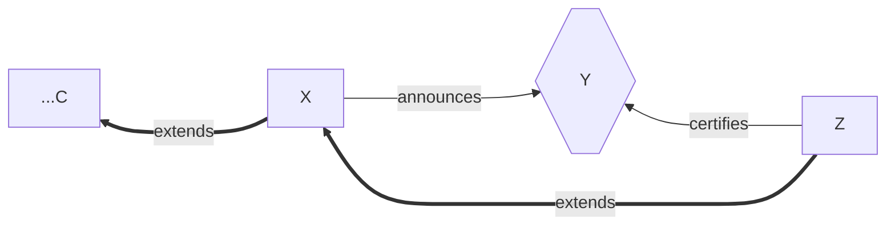

# Introduction

This working memo drafts a proposed alteration of Linear Leios.
The objects and dynamics don't change much compared to [CIP-0164](https://cips.cardano.org/cip/CIP-0164), but they're rearranged in order to reveal fresh trade-offs.

# Motivation

This section explains the risk this proposal is intended to shore up.

## Background

In Linear Leios, an RB Z can include an EB Y into the ledger state if the following are all satisfied.

- RuleA.
  Z directly extends the RB X that announced Y.
- RuleB.
  X was issued at least 3×L_{hdr} + L_{vote} + L_{diff} before Slot(Z).
- RuleC.
  Enough votes for Y had already arrived at the issuer of Z.

(Forewarning: that diagram wouldn't ever include edges to any ProtoEB---ProtoEBs aren't on-chain, they're merely a diffusion mechanism.)

A couple lemmas.

- If Z is adversarial, it can exist as soon as an honest ~25% of stake has issued votes for Y.
    - The recommended voting threshold is ~75% stake.
    - The Praos security argument considers an adversary with up to ~50% stake.
- A valid Z could exist even if honest nodes with a cumulative stake of ≤ ~25% first acquired Y only ~7 seconds ago.
    - The latest an honest node would possibly issue a vote for Y is Slot(Z) - L_{diff}.
    - The recommended value of L_{diff} is 7 seconds.
    - An honest node that votes for Y will have acquired its transactions before issuing that vote.

## The Problem

> Could it take more than ~7 seconds for Y to diffuse from honest SPOs controlling ~25% of stake to (approximately) _all_ other honest nodes?

That event seems plausible, especially considering that other EBs, fresher and/or staler than Y, might also be diffusing during those same 7 seconds: the network may be congested.

In case of that event, some honest nodes (the ones that don't yet have Y) would be unable to select Z.
If Z is the best public chain, then Leios has prevented those honest nodes from obeying Praos as promptly as they otherwise would have.
Therefore, either those honest nodes (temporarily) cannot be considered honest and caught-up or the Δ_{Praos} parameter may need to be increased---either way, Leios required a weakened Praos security argument.

## The Options

How to ensure that Y has already diffused widely before Z could even exist?
There are two straight-forward options.

- Increase L_{diff}.
- Add an additional constraint to the voting rules: a honest node will not vote for an EB if it finished acquiring that EB's transactions within the last VLIM seconds.
    - (VLIM abbreviates Voting Limit.)
- (There are less straight-forward options, notably including reducing the limits on EB body/closure size.
  However, bandwidth itself doesn't necessarily dominate the entirety of this latency question.
  For example, you have to choose the right peer amongst your tens of neighbors before you can benefit from their bandwidth.)

Increasing L_{diff} has the downside that fewer EBs will be included on the chain, due to RuleA and RuleB.
(I'm assuming L_{hdr} and L_{vote} are already as small as they can be).

If the VLIM voting rule is added instead, then the question is

> Could it take more than ~L_{diff}+VLIM seconds for Y to diffuse from honest SPOs controlling ~25% of stake to (approximately) _all_ other honest nodes?

which indeed becomes less likely as VLIM increases even if L_{diff} doesn't change.

However, the downside is again that fewer EBs will end up on chain, this time due to RuleC.
That is, some honest nodes would now suppress their vote for Y merely because they hadn't finished receiving its transactions before Slot(X) + 3×L_{hdr} + L_{vote} - VLIM.

If VLIM > 3×L_{hdr} + L_{vote}, then Y's transactions must have diffused to enough voters even before Slot(X), which is not an event that CIP-0164 was designed to arrange.
But since 3×L_{hdr} + L_{vote} is only 7 seconds, VLIM=7 might not make a big enough difference to mitigate The Risk.

Unlike the unavoidable RuleA and RuleB, the following proposal appeases RuleC even for relatively large VLIM durations.

# Proposal

How to ensure that Y's transactions have already diffused widely before Y exists?
That would ensure that the VLIM rule wouldn't prevent votes for honest EBs.

The following proposal has its own downsides, discussed below.
Its major upside is preventing the VLIM rule from also decimating Leios throughput as a side-effect of mitigating The Risk.

The proposal consists of the following changes.

- Add the VLIM voting rule (see above).
- Leave L_{hdr} at 1.
- Reduce L_{vote} from 4 to 2; correspondingly increase L_{diff} from 7 to 9.
  (TODO reconsider these numbers.)
  (TODO is it indeed safe to reduce L_{vote} just because honest EBs' txs should have diffused much earlier?)
- Set VLIM to 21.
    - Thus, a transaction must have arrived to an honest 25% stake at least VLIM+L_{diff}=30 seconds before an EB including it could be certified on chain.
- SPOs must also issue a new ProtoEB message, and they must do so GLIM seconds _before_ they're elected.
    - (GLIM abbreviate Generation Limit.)
    - Set GLIM to VLIM - (3×L_{hdr} + L_{vote}) + 7 for headroom = 23.
      (TODO more headroom than 7?
      7 was good enough for 3×L_{hdr} + L_{vote} in CIP-0164.)
    - ProtoEBs have the same shape as an EB: a sequence of transaction hash and size pairs.
    - Also like EBs, they're heralded by a signed announcement including both the election proof and the hash of the ProtoEB.
    - Unlike EBs, they merely cause diffusion of transactions---never validation and never chain inclusion.
    - The choice of which transactions to include in the ProtoEB is discussed below.
- An honest SPO issues their RB and EB as in CIP-0164, except they must additionally restrict the EB's contents to transactions that individually satisfy two additional constraints.
    - The transaction was received by this SPO at least GLIM seconds before.
    - The transaction is referenced by a ProtoEB (including any they issued) that was received by this SPO at least GLIM seconds before.
    - (In other words, the issued EB can only include transactions that have satisified "received AND referenced by a ProtoEB" _at the issuer_ for at least GLIM seconds.)
- Enrich the VLIM voting rule to additionally require that every transaction had been referenced by a ProtoEB that was received at least VLIM seconds before.
    - (Not only must the voter have had the transaction for a while, it also cannot have merely been in its Mempool, but rather in a ProtoEB.)
- EBs no longer drive transaction diffusion, only ProtoEBs do.

Note that the node's Mempool evolves exactly the same as in CIP-0164 (and even today's Praos node, merely with a much larger capacity).
And the Mempool generates RBs in the same way; the only difference is a slight change to the generated EB.
When issuing an RB and EB, execute the following steps.

- Make a copy of the Mempool's current contents.
- Generate the RB using the largest allowed prefix.
- Remove the RB's transactions.
- Remove those transactions that do not satisfy the GLIM constraint, and then revalidate starting from the ledger state after the RB.
  (This is the only new step.)
- Generate the EB using the largest allowed prefix.

The rules for issuing a ProtoEB also draw from the Mempool, but are significantly different.

- (Recall that this is executed GLIM seconds before the SPO's next Praos election.)
- Make a copy of the Mempool's current contents.
- Remove those transactions that have already been referenced by a ProtoEB.
- Generate the ProtoEB using the largest allowed prefix.

## Outline

The high-level sketch is as follows.

- Note there is no change to the Mempool itself nor TxSubmission.
- The VLIM rule prevents The Risk.
- The GLIM rule excludes transactions that would violate the VLIM rule from honest EBs.
- The issuing and diffusion of ProtoEBs cause Mempools to contain transactions that satisfy the GLIM rule.
    - Like TxSubmission, ProtoEB diffusion effectively broadcasts nodes' Mempool contents.
    - Unlike TxSubmission, ProtoEB diffusion is bounded only by the leader schedule---so it works even when Mempools are full.
    - Note that both of the above are also true for EB diffusion.
    - But unlike EB diffusion, ProtoEB diffusion accelerates an SPO's next EB even if that SPO has very low stake and different Mempool contents than other SPOs.
- EBs no longer drive transaction diffusion, only ProtoEBs do.

## Downsides

There are several downsides.

- StarvingDuringSuccess.
  A chain that was dense with successful EBs may not have any GLIM-satisfying transactions for while.
    - (TODO I anticipate this is relatively rare/minor.
      Maybe just increase the Mempool capacity?)
    - (TODO The new voting rule could allow up to N bytes of EB's transactions to violate VLIM?
      Would this also require EBs to also drive transaction diffusion?)
    - (TODO mempool fragmentation actually makes this _less_ likely)
    - (TODO I'm hesitant to consider it, but maybe nodes could also try to feed ProtoEB content into their Mempool?)
- AdaptiveAdversary.
  The ProtoEB announcements let the adversary know which honest SPOs will be issuing RBs in the next GLIM seconds.
- GreaterTransactionLatency.
  The transactions in a successful EB must have been public for at least VLIM+L_{diff}=30 seconds before they could alter the chain's ledger state.
  With CIP-0164, this duration is instead L_{diff}=7 seconds: that's an additional 23 seconds when there was already concern about frontrunning.
    - (TODO As with CIP-164, the SPO retains total control of the ~90 kB in their RB.)
    - (TODO The new voting rule could allow up to N bytes of EB's transactions to violate VLIM?
      Would this also require EBs to also drive transaction diffusion?)
- AdditionalTraffic.
  ProtoEBs duplicate the traffic of EB announcements and bodies.
- (TODO more?)

# Appendix: ProtoEBs are Not Input Blocks

There are some key differences.

- ProtoEBs are not a unit of validation; that remains the transaction.
- ProtoEBs are never mentioned on-chain; only EBs are.
  Instead, ProtoEBs and EBs both refer to transactions---ProtoEBs merely do so earlier.
  (TODO would EBs refering to ProtoEBs be a potential optimization?
  If so, remove the "Forewarning" on the diagram.)
- There is a concrete, unambiguous, and well-motivated rule for what transactions an honest SPO should include in its ProtoEBs; that had been elusive for IBs.
- ProtoEBs inherently mitigate Mempool fragmentation attacks.
  An honest SPO issues a ProtoEB from its Mempool shortly before _that same SPO_ issues an RB and an EB from its Mempool.
  Therefore, for an honest SPO, the only reason its ProtoEB wouldn't overlap with its subsequent Mempool is if it flushed a lot of its Mempool contents in the meantime (eg see StarvingDuringSuccess).
  Forcing that to happen requires significant stake, unlike Mempool fragmentation attacks.

In short: ProtoEBs merely constrain what EBs can contain; it's still the Mempools that ultimately drive EBs' contents---that's very auxiliary compared to the role of IBs in Full Leios.
