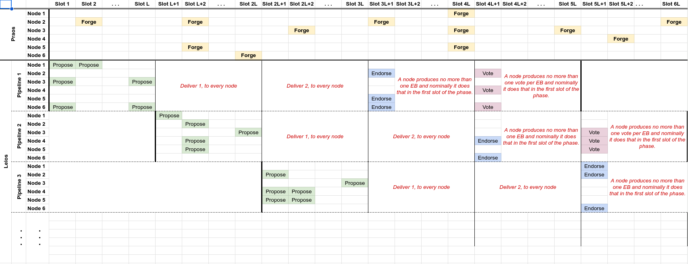
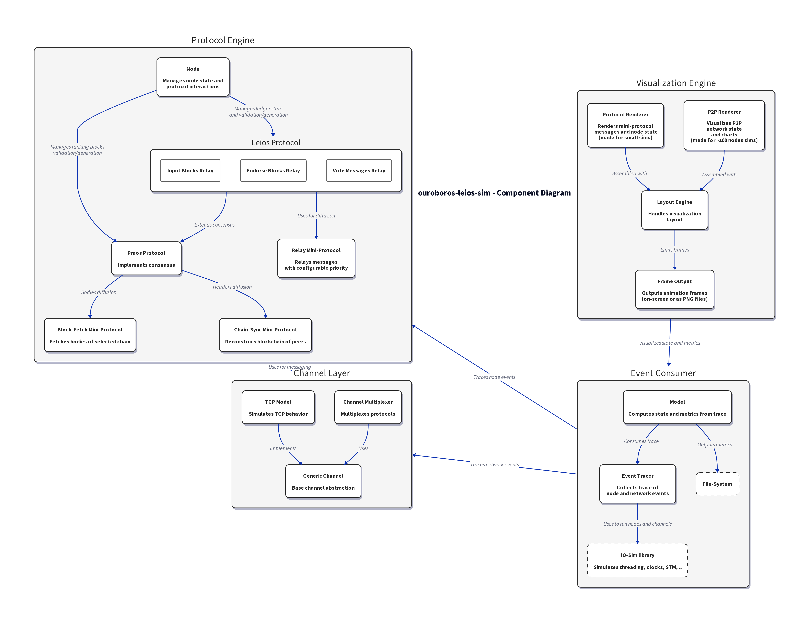
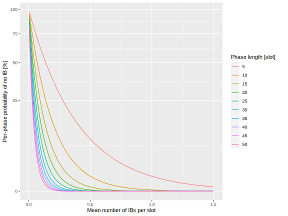
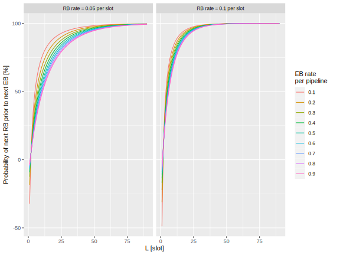
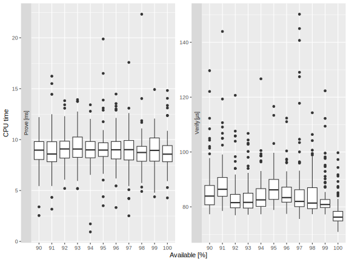
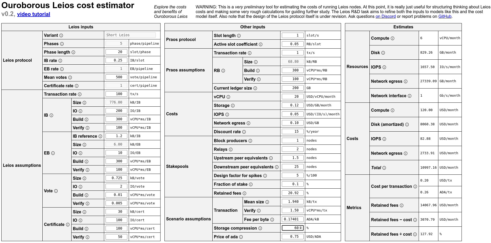
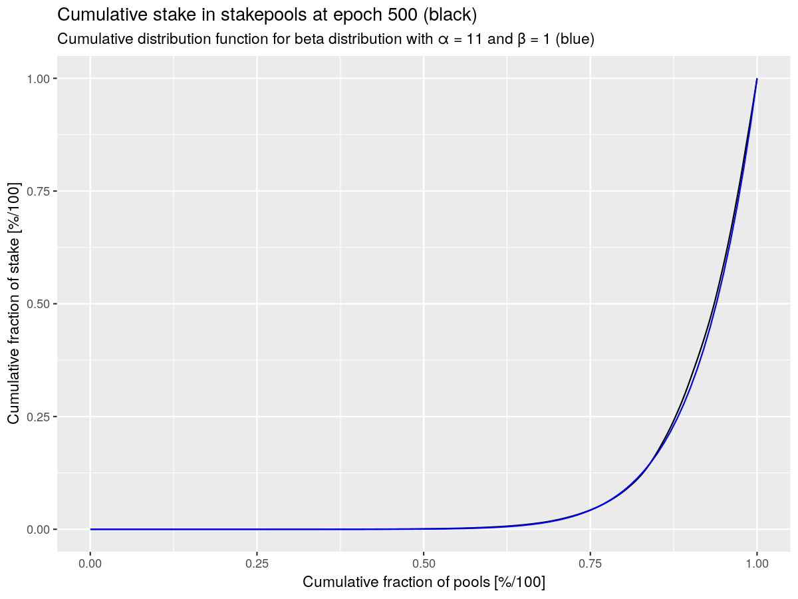

# Leios technical report #1

## Executive summary

## Introduction

The Leios protocol represents a significant advancement in blockchain
technology, building upon the foundations of the Ouroboros consensus protocol.
This technical report aims to provide a comprehensive analysis of the Leios
protocol, focusing on its design, implementation, and potential impact on the
Cardano ecosystem.

### Purpose

The primary purpose of this report is to document the technical specifications
and economic implications of the Leios protocol. It serves as a resource for
developers, researchers, and stakeholders interested in understanding the
intricacies of Leios and its role within the broader Cardano network.

### Scope

This report covers various aspects of the Leios protocol, including its formal
specifications, simulation results, economic analysis, and threat model. It also
explores the interactions between Leios and existing Cardano components, such as
Praos and Mithril.

### Context

Leios is designed to enhance the scalability and efficiency of the Cardano
blockchain by introducing innovative mechanisms for block production and
validation. By leveraging probabilistic sortition and advanced cryptographic
techniques, Leios aims to achieve high throughput and low latency while
maintaining robust security guarantees.

> [!NOTE]
>
> **Roadmap and Methodology**
>
> The development of the Leios protocol is currently focused on comparing
> outputs from various simulations to gain deeper insights into its performance
> and potential optimizations. This involves exploring the spectrum of
> configuration parameters to identify optimal settings and understand potential
> constraints and attack vectors.
>
> Key areas of ongoing research include:
>
> - **Sharded Mempool Design**: Investigating designs that minimize transaction
>   duplicates across different Input Blocks (IBs) and determining the
>   transaction fee structure.
> - **Voting Schemes**: Early work has begun on voting mechanisms, but further
>   exploration is needed to finalize these schemes.
> - **Cost Analysis**: Estimating the cost of running a Leios node compared to
>   the expected increase in throughput. This analysis will be crucial for
>   community feedback and engagement.
>
> In the near future, the team aims to draft a Cardano Improvement Proposal
> (CIP) for Leios. This proposal will detail the requirements for building a
> reference implementation, informed by the data and insights gathered from
> ongoing research and simulations.
>
> The roadmap includes engaging with the community to gather feedback and
> iterating on the protocol design based on this input. The goal is to ensure
> that Leios not only meets technical specifications but also aligns with the
> needs and expectations of the Cardano ecosystem.

### Audience

This report is intended for a technical audience, including blockchain
developers, researchers, and Cardano stakeholders. It assumes a foundational
understanding of blockchain concepts and the Cardano ecosystem.

## Informal description of Short Leios

### Example schedule



## Formal Specification for Short Leios


## Delta QSD network performance model


## Rust simulation


## Haskell prototype




## Sortition

In Leios stake-based sortition occurs for the selection of the producers of IBs,
EBs, and votes. The selection of the producers of IBs and EBs occurs similarly
to Praos and the selection of the votes occurs similarly to Mithril. We define
two functions for the probability of being elected as a producer or vote in the
Bernoulli trials for each unit of stake (i.e., one lottery for each lovelace).
Consider the situation where there is a total stake $S$ and a Leios node has $s$
stake delegated to it. Let $f^\prime$ be the probability that a single lovelace
wins the lottery and $f$ be the probability that any of the $S$ lovelace win it:

$$
f = 1 - (1 - f^\prime)^S \approx S \cdot f^\prime
$$

where the approximation holds for the very large total stake $S$, which is
greater than $10^{16}$ on the Cardano mainnet. The probability that the node
with $s$ stake delegated to it wins any of the lotteries is

$$
\psi_{f^\prime}(s) = 1 - (1 - f^\prime)^s
$$

which can be simplified with the relative stake $\sigma = s / S$ to

$$
\phi_f(\sigma) = \psi_{f^\prime}(\sigma \cdot S) = 1 - (1 - f)^\sigma
$$

Sortition reuses the Praos VRF, but prepending a string such as `Leios-IB`,
`Leios-EB`, or `Leios-Vote` to the bytes being hashed, in order to remove
correlations between the uses of the VRF. The resulting VRF value `v` is
compared to the probability (in the case of IBs and EBs) or the cumulative
probability (in the case of votes) for winning the sortition lottery. This is
equivalent to the eligibility checks in the Leios paper.

### Advantage gained by splitting stake among nodes

Note that this formulation encourages the splitting of stake among many nodes:
by pooling stake at a single node the stake has only one chance to build an RB,
IB, or EB, but by splitting the stake among many nodes there is a chance for
multiple RBs, IBs, or EBs in the same lottery. We can quantify this effect by
comparing the expected number of lottery wins when splitting $\sigma$ into two
$\frac{1}{2}\sigma$ pieces. The expected number of lottery wins for split stake
minus combined stake is always positive for $\sigma > 0$.

$$
\delta = 1 \cdot \phi_f\left(\frac{\sigma}{2}\right) + 1 \cdot \phi_f\left(\frac{\sigma}{2}\right) - 1 \cdot \phi_f(\sigma) = 2 \left[ 1 - (1 - f)^{\sigma/2} \right] - \left[ 1 - (1 - f)^\sigma \right] = \left[ 1 - (1 - f)^{\sigma/2} \right]^2 = \left[ \phi_f\left(\frac{\sigma}{2}\right) \right]^2 > 0
$$

In relative terms,
$\frac{\delta}{\phi_f(\sigma)} \approx \frac{\phi_f(\sigma)}{4}$ , so the
advantage is small unless the node starts with an appreciable probability of
producing a block. A Taylor-series expansion reveals
$2\phi_f(\sigma/2) = \phi_g(\sigma)$ with
$g = f \cdot (1 + \frac{1}{4}f \cdot \sigma) + \mathcal{O}(f^3)$, implying that
the benefit of splitting stake in half is equivalent to the protocol parameter
for the lottery being fractionally increased by $f \cdot \sigma / 4$. This
renormalization can be extended to the limit of splitting the stake into a large
number of parts, where we have a simple result,

$$
\lim_{k \rightarrow \infty} k \cdot \phi_f\left( \frac{\sigma}{k} \right) = \phi_h(\sigma)
$$

where
$h = 1 - \sqrt[\sigma]{1 + \sigma \cdot \log (1 - f)} = f \cdot ( 1 + \frac{1}{2} f \cdot \sigma) + \mathcal{O}(f^3)$,
which implies a fractional benefit limited to $f \cdot \sigma / 2$.

> [!NOTE]
>
> - [ ] Do we need to include the derivation of
>       $h = 1 - \sqrt[\sigma]{1 + \sigma \cdot \log (1 - f)} = f \cdot ( 1 + \frac{1}{2} f \cdot \sigma) + \mathcal{O}(f^3)$?
> - [ ] . . . perhaps in an appendix?

The following plot shows this effect on splitting stake. The horizontal axis
represents the production rate $f$, which would be per-slot for RBs or IBs and
per-period for EBs. The vertical axis shows the fractional benefit of the
splitting, $f / (h - f)$. Even a controller of 45% of the stake would only
benefit with less than a 20% advantage in block production, even at a high
production rate such as a 75% chance per period, if they split their stake
minutely. This small advantage would be outweighed by the cost of the computing
hardware and bandwidth required to deploy the large number of node having very
little stake delegated to them.


### Input blocks

In Leios, even if a node wins the IB lottery several times, it is only allowed
to build a single block. This is identical to the sortition rule in Praos. Let
$f_\text{IB}$ be the protocol parameter specifying the per-slot probability of a
node producing an IB:

$$
p_\text{IB} = \phi_{f_\text{IB}}(\sigma) = 1 - (1 - f_\text{IB})^\sigma
$$

If $v_\text{IB} \in [0,1]$ is the node's IB VRF value for the current slot, then
the node's eligibility condition is $v_\text{IB} \leq p_\text{IB}$.

Given the IB-production phase of length $L$ in each Leios pipeline, we want to
avoid the situation where an unlucky lottery results in no IBs being produced
during that phase. The probability of none of the $i$ nodes with stake
$\sigma_i$ winning the lottery in a slot is

$$
\prod_i \left( 1 - \phi_{f_\text{IB}}(\sigma_i) \right) = \prod_i (1 - f_\text{IB})^{\sigma_i} = (1 - f_\text{IB})^{\sum_i \sigma_i} = 1 - f_\text{IB}
$$

where $\sum_i \sigma_i = 1$ because the individual stakes sum to the total
stake, $S \equiv \sum_i s_i$. Hence the probability of no nodes winning the
lottery in any slot of the phase is

$$
q_\text{IB} = (1 - f_\text{IB})^L
$$

and the expected number of IBs in the phase is

$$
n_\text{IB} = f_\text{IB} \cdot L
$$

The figure below illustrates the relationship between $f_\text{IB}$ and
$q_\text{IB}$. Understandably, short phases can result in appreciable
probabilities of no having an input block in the pipeline.



### Endorser blocks

The sortition for EBs occurs per phase, not per slot. The previous section's
analysis for input blocks holds with minor modification: The probability that a
node with stake $\sigma$ wins the EB lottery for a pipeline is

$$
p_\text{EB} = \phi_{f_\text{EB}}(\sigma) = 1 - (1 - f_\text{EB})^\sigma
$$

If $v_\text{EB} \in [0,1]$ is the node's EB VRF value for the current phase,
then the node's eligibility condition is $v_\text{EB} \leq p_\text{EB}$.

> [!IMPORTANT]
>
> This formulation makes it likely (probability = 1 - f) that some pipelines
> will have no EBs. Should there be two or more lotteries instead of just one?
> Or do we just need to accept this as part of Short Leios?

In Short Leios it is critically important that at least one EB be produced in
the pipeline because, otherwise, the pipeline's IBs will not be referenced in
the RB and the work done creating them will be lost and their transactions will
have to wait for another IB. There are four situations of interest for EB
production in a particular pipeline:

1. No EB is produced:
   $(1 - p_\text{hon}) \cdot (1 - p_\text{adv}) = 1 - f_\text{EB}$.
2. Only honest parties produce EBs: $p_\text{hon} \cdot (1 - p_\text{adv})$.
3. Only adversarial parties produce EBs:
   $(1 - p_\text{hon}) \cdot p_\text{adv}$.
4. Both honest and adversarial parties produce EBs:
   $p_\text{hon} \cdot p_\text{adv}$.

where $p_\text{hon} = \phi_{f_\text{EB}}(\sigma_\text{hon})$,
$p_\text{adv} = \phi_{f_\text{EB}}(\sigma_\text{adv})$, and
$\sigma_\text{hon} + \sigma_\text{adv} = 1$. For this analysis we ignore the
splitting of stake because the analysis of it in a previous section indicated
that it is inconsequential even in the worst case.


If we account for stake being divided among many nodes, we get a nearly
identical result. The left plot below shows the scenario where stake is divided
evenly among 1000 nodes and the right plot shows when it is divided among 2500
nodes according to a non-uniform stake distribution similar to that of
epoch 500.

| Uniform stake among 1000 nodes                                     | Realistic non-uniform stake among 2500 nodes                           |
| ------------------------------------------------------------------ | ---------------------------------------------------------------------- |
|  |  |

> [!CAUTION]
>
> - [ ] Is there a theoretical argument (like the law of large numbers) why
>       splitting the stake doesn't make a visible difference?
> - [ ] Is it pointless to include such repetitive plots?

Short Leios also relies on the EB being included in an RB before another EB is
produced: endorser blocks are not allowed to queue awaiting RBs or to reference
other EBs. Thus, the EB rate should be consistent with the RB rate. We can
approximate the probability of there not being an RB in time to include a new EB
by answering the following question: given that an EB has been produced, what is
the probability that the _next_ EB will be produced before the _first_ RB? In
such a situation, the freshest-first rule would result in the first EB being
discarded because the second EB is included in the new RB. The distribution of
waiting times for the next EB and next RB are

$$
\mathcal{P}(\text{next EB at phase } n) = (1 - f_\text{EB})^{n-1} f_\text{EB}
$$

and

$$
\mathcal{P}(\text{next RB at slot } s) = (1 - f_\text{RB})^{s-1} f_\text{RB}
$$

Hence the probability for the next EB not coming before the next RB is

$$
p_\text{included} = 1 - p_\text{discarded} = 1 - \sum_{1 \le s < n L < \infty} (1 - f_\text{EB})^{n-1} f_\text{EB} (1 - f_\text{RB})^{s-1} f_\text{RB}
 = \frac{1 - [f_\text{RB} (f_\text{EB} - 1) + 1] (1 - f_\text{RB})^{L-1}}{1 - (1 - f_\text{EB}) (1 - f_\text{RB})^L}
$$

The plots below indicate that the phase length $L$ should be several times
${f_\text{RB}}^{-1}$ in order for there to be a high probability that an RB will
appear before the next EB.



> [!IMPORTANT]
>
> The above argument needs reworking because it doesn't account for various
> effects like the EB being per-pipeline, propagation delays, and the RB being
> per-slot or that there are multiple pipelines. There also may be ambiguities
> in the specification for the case when several EBs are waiting for an RB:
> presumably, the "freshest first" rule would be applied here, so the newest EB
> would go into the RB. We might need simulation for this analysis.

### Votes

The sortition for voting differs from that for blocks because, in principle, a
node may win several votes in the lottery.

$$
\mathcal{P}(n \text{ votes given stake } s) = {s \choose n} {f_\text{vote}^\prime}^n (1 - f_\text{vote}^\prime)^{s-n} \approx \frac{(f_\text{vote} \cdot \sigma)^n \cdot e^{- f_\text{vote} \cdot \sigma}}{n!}
$$

where $f_\text{vote} = f_\text{vote}^\prime \cdot S$ is the mean number of votes
in the lottery and the stake is very large relative to the number of votes
$n \ll s$. Note that even in this approximation the probabilities sum to one.
The formula above and this approximation may be sufficient for use with a VRF to
determine the number of votes that a node is entitled to. The table below show
the VRF conditions for determining the number of votes in this approximation,
which can be expressed as a Taylor series involving operations only on rational
numbers. The Cardano mainnet decentralization parameter is current 500, so if we
consider the case where the mean number of votes is 500 and a node has 1/500th
of the stake, then $f_\text{vote} \cdot \sigma =1$ in this computations,
corresponding to the right edge in the plot below: any pool with more stake
would be oversaturated. Even in the worst-case scenario of a fully saturated
pool, the probability of more than three votes is about 1.90%.

| Number of votes | Condition of VRF value $v$                                                                                                                                                                                                                           |
| --------------- | ---------------------------------------------------------------------------------------------------------------------------------------------------------------------------------------------------------------------------------------------------- |
| 0               | $0 \le v \cdot \exp(f_\text{vote} \cdot\sigma) \le 1$                                                                                                                                                                                                |
| 1               | $1 < v \cdot \exp(f_\text{vote} \cdot\sigma) \le 1 + \sigma \cdot f_\text{vote}$                                                                                                                                                                     |
| 2               | $1 + \sigma \cdot f_\text{vote} < v \cdot \exp(f_\text{vote} \cdot\sigma) \le 1 + \sigma \cdot f_\text{vote} + \frac{1}{2} (\sigma \cdot f_\text{vote})^2$                                                                                           |
| 3               | $1 + \sigma \cdot f_\text{vote} + \frac{1}{2} (\sigma \cdot f_\text{vote})^2 < v \cdot \exp(f_\text{vote} \cdot\sigma) \le 1 + \sigma \cdot f_\text{vote} + \frac{1}{2} (\sigma \cdot f_\text{vote})^2 + \frac{1}{6} (\sigma \cdot f_\text{vote})^3$ |
| $n$             | $\sum_{m=0}^{n-1} \frac{1}{m!} (\sigma \cdot f_\text{vote})^m < v \cdot \exp(f_\text{vote} \cdot\sigma) \le \sum_{m=0}^n \frac{1}{m!} (\sigma \cdot f_\text{vote})^m$                                                                                |


Limiting nodes to a maximum of one vote would likely be safe if the mean number
of votes is no larger than the effective decentralizations (i.e., the number of
nodes with appreciable stake) would likely be safe, though it might result is
larger concentrations of stake having smaller voting rewards, and it would
greatly simplify the computation of sortition.

### Insights regarding sortition

- All of the sortition is based on Bernoulli trials for each stake of lovelace.
- A probabilistic analysis shows that splitting stake among many nodes only
  provides a minor benefit in winning the lottery more times.
- The IB lottery is per-slot and limits a node to building a maximum of one IB
  per slot.
  - Careful selection of protocol parameters ensures a high probability of at
    least one IB in each pipeline.
- The EB lottery is per-pipeline and limits a node to building a maximum of one
  EB per pipeline.
  - The formulation of the EB lottery implies that there will always be a
    significant chance that a pipeline contains no EB.
  - Setting protocol parameters so that there is a high probability of an EB in
    a pipeline makes the protocol more susceptible to influence by adversaries
    with significant stake.
  - However, the unevenness in stake distribution or splitting of adversarial
    stake does not exacerbate the situation.
- The pipeline length should be several multiples of the inverse of the
  active-slot coefficient, in order that there is a high probability for an RB
  to be available for an EB certificate.
- The vote lottery can award multiple votes to the same node if they have a lot
  of stake and are luck.
  - Nodes nearly saturated with stake have an appreciable chance of receiving
    several votes.
  - The mathematics and code for determining from the VRF the number of votes a
    node winds is more complex and involves complications to avoid
    floating-point computations.
  - Limiting nodes to a maximum of one vote would likely be safe if the mean
    number of votes is no larger than the effective decentralizations (i.e., the
    number of nodes with appreciable stake) would likely be safe, though it
    might result is larger concentrations of stake having smaller voting
    rewards, and it would greatly simplify the computation of sortition.

## Voting and certificates

Leios voting involves numerous decisions about cryptographic matters and
protocol parameters.

- What type of keys will be used to sign a vote?
- What form will a proof of the right to vote take?
- How large will the vote committee be?
- Will committee members with a large amount of stake be allowed multiple votes?
- What quorum of votes will be required to certify an EB?
- What type of certificate will attest to a quorum of votes?

These decisions affect security, efficiency, and cost.

- All of the choices affect security.
- The cryptographic details affect the size of votes and certificates and the
  CPU and network resources needed for them.
- The size of the committee and quorum directly affect CPU and network
  resources.

The next subsections contain preliminary analyses of concerns and potential
decisions affecting voting and certificates. For clarity, we have tried to keep
different aspects separate.

### Structure of votes

Conceptually, a Leios vote contains the following information:

- The hash of the EB being voted for.
- The identifier for the pipeline.
  - This could be omitted because it can be inferred from the EB.
- The identity of the voter.
- The number of votes cast.
- A proof that the votes cast are valid.
- A signature.

When collecting votes for the same EB, the hash of the EB and the identifier for
the pipeline would only have to be listed once for the whole set. This will save
64 bytes per vote serialized. So, a minimalist vote might only comprise 209
bytes of core information, not counting the hash of the EB.

- _Voter identity:_ 32 bytes
- _Number of votes cast:_ 1 bytes
- _ECVRF signature on pipeline identifier and nonce:_ 80 bytes
- _Compressed BLS12-381 signature:_ 96 bytes

The above assumes that the keys for verifying the signature and the proof of
possession have already been transmitted. These would need to be registered on
the chain, presumably on the Praos chain.

Instead of ephemeral keys, if the signature were a full KES signature, then it
would be at least 448 bytes instead of 96 bytes, though the signed time of 32
bytes would be common to all votes of a given pipeline.

- Signed time: 32 bytes
- Verification key: 32 bytes
- KES Signature
  - Merkle path (verification key hashes): 7 × 32 = 224 bytes
  - Additional verification key: 32 bytes
  - Ed25519
    - Public key: 32 bytes
    - Two points: 2 x 64 = 128 bytes

Much of larger size of the KES signature size comes from the Merkle path needed
to prove the currently active key. If voting occurs frequently in Leios, that
proof would be repeated many times using the 36-hour KES period. Perhaps that
proof would only have to be recorded in a certificate during the node's first
vote during a KES period. Also, MUSEN is an alternative to KES, but it still
suffers from large descriptions of the evolved keys. So, in essence, we have two
scenarios for the minimal size of a vote.

| Method        | Common to all votes for a given EB | Specific to individual vote | Total | Comments                                                                   |
| ------------- | ---------------------------------: | --------------------------: | ----- | -------------------------------------------------------------------------- |
| Ephemeral key |                               32 B |                       209 B | 241 B | The ephemeral keys would have to have been registered on-chain.            |
| KES key       |                               64 B |                       529 B | 593 B | The KES Merkle path for stays constant for one KES period (e.g, 36 hours). |

However, it has not been decided what types of keys and signatures will be used
for Leios votes. Key considerations are . . .

1. A vote should be small.
   1. Smaller than a TCP MTU so it fits in a single packet
   2. As small as possible if the size of a certificate scales with the size and
      number of votes
2. Key distribution should be simple and secure.
   1. Key rotation and revocation may be necessary
   2. Ideally, existing Cardano keys could be used for Leios voting, but without
      compromising security

### Number of unique SPOs voting

Because stake in Cardano is very unevenly distributed among stake pools, it is
likely that some stake pools will win several votes in a Leios lottery and many
will win no votes. See the section
[Stake pool distribution](#stake-pool-distribution) below for a plot of the
typical stake distribution on the Cardano mainnet. We need to estimate how many
distinct SPO nodes vote in a given round because this affects the number of
votes transmitted and the size of the Leios certificate.

Let $p$ be the probability that a unit of stake (i.e., one lovelace in Cardano)
will be selected in the voting lottery and let $S$ be the total staked. Let $n$
be the desired mean number of votes in the lottery. Hence $p = n / S$. A
candidate node $i$ with $s_i$ staked to it has a binomially distributed number
of votes, with mean $p \cdot s_i$. The probability is
$v_i = 1 - \left( 1 - p \right)^{s_i}$ that the node has any votes at all.

If the random variable $\mathbf{V}_i$ is distributed according to the Bernoulli
trial with probability $v_i$, then $\mathbf{V} = \sum_i \mathbf{V}_i$ is the
committee size. This will differ from the number of votes because some nodes
might have multiple votes. It is feasible to numerically sample $\mathbf{V}$,
but simply computing its mean and standard deviation is insightful. The mean is
$\mu = \sum_i v_i$ and the variance is
$\sigma^2 = \sum_i v_i \cdot \left( 1 - v_i \right)$. A simple R function lets
us estimate $\mu$ and $\mu \pm 2 \sigma$ for the empirical distribution of
stake.

```R
# Statistics for a mean committee size `n` and a stake distribution `stake`.
committee <- function(n, stakes) {
    p <- n / sum(stakes)
    v0 <- (1 - p) ^ as.numeric(stakes)
    v1 <- 1 - v0
    meanC <- sum(v1)
    sdC <- sqrt(sum(v0 * v1))
    list(`μ` = meanC, `μ-2σ` = meanC - 2 * sdC, `μ+2σ` = meanC + 2 * sdC)
}
```

The plots below show the number of unique voters as a function of mainnet epoch
and mean number of votes. For 500 votes we expect about 325 unique voters, but
for 1000 votes we expect about 500 unique voters. Note that if stake were
distributed uniformly among all stakepools, the expected number of unique voters
would be less than the decentralization parameter $k$, which currently is
$k = 500$; for number of votes smaller than that, the mean number of unique
voters would be the number of votes.

|                                                                          |                                                                          |                                                                            |
| ------------------------------------------------------------------------ | ------------------------------------------------------------------------ | -------------------------------------------------------------------------- |
|  |  |  |

### Committee size and quorum requirement

The combinatorics associated with obtaining a quorum of voters from a mixture of
honest and dishonest parties set fundamental limits on the safe size for voting
quorums in Leios. (However, the specific choice of certificate scheme my
imposing additional limits and security considerations.) We are concerned about
both the probability that a quorum of honest votes is reached and the
probability that dishonest voters form their own quorum. For Leios, the
situation where there are multiple quora of mixed honest and dishonest parties
is not equivalent to having a dishonest quorum, though it may cause
inefficiencies when EBs with duplicate or clashing transactions are later
included in RBs. The table below shows situations that may be encountered.

> [!CAUTION]
>
> Is it the second-to-last sentence in the previous paragraph really true?

| Quorum of honest votes? | Quorum of adversial votes? | Description        | Implications                                                             |
| ----------------------- | -------------------------- | ------------------ | ------------------------------------------------------------------------ |
| Yes                     | No                         | Honest quorum      | Protocol operates normally, with successful endorsement of input blocks. |
| No                      | No                         | No quorum          | Protocol operates normally, but without endorsement of input blocks.     |
| No                      | Yes                        | Adversarial quorum | Adversary controls the endorsement.                                      |
| Yes                     | Yes                        | Multiple quora     | Adversary can create conflicting endorsements.                           |

We can estimate the probability of not having an honest quorum. Let $\beta$ be
the probability that a unit of stake is selected for voting-committee
membership, let $n$ be the mean number of votes, and let $\tau \cdot n$ be the
number of votes required for a quorum. Let $S$ be the total stake and
$H = (1 - f) \cdot S$ be the honest stake, with $f$ being the fraction of
adversarial stake. Assuming the total stake is large, we can approximate the
binomial distribution by a normal one and express the probability of not having
an an honest quorum as follows:

$$
P = \mathbf{P}_\text{binom} (\lfloor \tau \cdot n \rfloor, H, \beta) \approx \mathbf{P}_\text{normal} \left( \tau \cdot n, H \cdot \beta, \sqrt{H \cdot \beta \cdot (1 - \beta)} \right) \approx \mathbf{P}_\text{normal} \left( \tau \cdot n, H \cdot \beta, \sqrt{H \cdot \beta} \right)
$$

Using $n \approx S \cdot \beta$, we have a simpler approximate expression and an
R function for performing the computation.

$$
P \approx \mathbf{P}_\text{normal} \left( f , 1 - \tau , \sqrt{\frac{1 - f}{n}} \right)
$$

```R
function(f, tau, n)
  pnorm(f, 1 - tau, sqrt((1 - f) / n))
```

The plots below show how the probability of obtaining or not obtaining an honest
quorum varies with the quorum size and committee size. We do not consider
committees smaller than the decentralization parameter $k = 500$.


> [!CAUTION]
>
> Should we do the exact computation for the above plots and table or is the
> normal approximation okay? The CDF computations might be slow, and we'd also
> have to make an assumption about the number of lovelace staked.

Conversely, using the same method we can estimate the probability of adversarial
parties creating their own quorum.


We must consider the following criteria when selecting the mean committee size
and the quorum requirement:

1. A larger committee imposes more network traffic.
2. A larger quorum requirement imposes larger certificates.
3. Larger committees and quorum requirements make it harder for an adversary to
   obtain a quorum.
4. Larger quorum requirements make it easier for an adversary to prevent an
   honest quorum.

For Leios the third criterion above is critical, so we need to avoid at all
costs a chance of an adversarial quorum. The first and third criteria are
important only in that they affect the cost of running Leios nodes. The fourth
criterion is less important because it only creates inefficiency leading to
lower throughput.

Given the above analysis, we consider a 60% quorum for a committee of 500 votes
to be the most efficient and least costly that still maintains security. This
implies a low probability of an adversarial quorum even for a strong adversary
and a high probability of an honest quorum even for a modestly strong adversary.
Note that even at 50% adversarial stake, the security of voting is much stronger
than the underlying Praos security, though it would be very hard to have a
successful honest quorum. At 45% adversarial stake honest quora would be
frequent enough for the chain to function inefficiently. It might be possible to
lower the quorum requirement to 55%, which would give a 1.29e-3 probability of
an adversarial certificate at 45% adversarial stake and a 50% probability of an
honest quorum.

| Adversarial stake, $f$ | Probability of adversarial quorum | Probability of honest quorum |
| ---------------------: | --------------------------------: | ---------------------------: |
|                    0 % |                          2.42e-41 |                        1.000 |
|                   10 % |                          2.33e-32 |                        1.000 |
|                   20 % |                          7.62e-24 |                        1.000 |
|                   30 % |                          5.38e-16 |                        0.996 |
|                   40 % |                           3.88e-9 |                        0.500 |
|                   45 % |                           3.01e-6 |                        0.066 |
|                   50 % |                           7.83e-4 |                        0.001 |

> [!IMPORTANT]
>
> We need to compute the Praos attack probabilities at the above adversarial
> stakes, so we can compare them to the Leios probability of an adversarial
> quorum. I'm certain that the Leios probabilities are lower than the Praos ones
> if $\tau = 0.60$, but I'm not so certain about the situation if $\tau = 0.55$.

> [!CAUTION]
>
> The above analysis might not hold when the clumpiness of the stake
> distribution is accounted for. For example, do the probabilities change if a
> couple of large stakepools are selected in the lottery?

### Certificate scheme

Certificates that attest to a quorum of votes have failure modes beyond the
failure modes for obtaining a quorum of votes. Cryptographic parameters must be
set so that a certificate is only created if a quorum is present and it should
be highly probably that a certificate can be created if a quorum is present.

| Quorum of votes? | Certificate created? | Description           | Implications                                          |
| ---------------- | -------------------- | --------------------- | ----------------------------------------------------- |
| Yes              | Yes                  | Proper certificate    | Input blocks endorsed.                                |
| Yes              | No                   | Certification failure | Input blocks not endorsed when they should have been. |
| No               | No                   | No quorum             | Input blocks not endorsed.                            |
| No               | Yes                  | Erroneous certificate | Input blocks endorsed when they should not have been. |

Combining the possible voting outcomes with the certificate ones yields a
complex landscape. There is some interaction between voting and certification
because some certificate scheme may have small probabilities of building a valid
certificate without a quorum. We will evaluate several schemes in terms of these
probabilities and the size of the certificate they produce. In addition to
security, Leios requires that the certificate fit inside a Praos block,
currently 90,112 bytes.

| Content of certificate | Quorum on honest votes? | Certificate created? | Description                                          | Endorsement |
| ---------------------- | ----------------------- | -------------------- | ---------------------------------------------------- | ----------- |
| Honest votes           | Yes                     | Yes                  | Proper honest certificate                            | Honest      |
| Honest votes           | No                      | Yes                  | Erroneous honest certificate                         | Incorrect   |
| Honest votes           | Yes                     | No                   | Failure to make honest certificate                   | Failure     |
| Honest votes           | No                      | No                   | No honest quorum                                     | None        |
| Adversarial votes      | Yes                     | Yes                  | Adversarial certificate when honest one was possible | Attacked    |
| Adversarial votes      | No                      | Yes                  | Adversarial certificate                              | Attacked    |

The overriding requirement for Leios certificates is that it be essentially
impossible for an adversary to forge a certificate—that would fundamentally
compromise Leios security. Conversely, it is acceptable for adversaries to
occasionally thwart creation of valid certificates because that thwarting only
reduces Leios throughput and does not seriously compromise its security. The
second critical requirement is that certificates fit in a ranking block (Praos
block), whose size is currently limited to 90,112 bytes, preferably with space
leftover for transactions and other certificates. Additionally, it must be
feasible to create and verify certificates within the CPU budget of a Leios
pipeline. The three categories of certificates currently under evaluation have
different profiles in terms of certificate size and CPU load, but none is
superior to the others in all categories. The "large" and "slow" ratings in the
table below are potential "show stoppers" for the rated algorithm. However, most
of the algorithms have several variants, including zero-knowledge variants that
would radically reduce certificate size at the expense of very slow construction
of certificates. Finally, the certificate size typically depends somewhat upon
the number of votes and size of individual votes, so progress on keeping the
vote size small may translate into smaller certificates.

| Method               | Certificate size | Construction time | Verification time |
| -------------------- | ---------------- | ----------------- | ----------------- |
| ALBA                 | Large            | Fast              | Fast              |
| BLS (Mithril)        | Medium           | Medium            | Medium            |
| MUSEN                | Small            | Medium            | Slow              |
| ZK variants of above | Very small       | Very slow         | Fast              |

#### ALBA certificate

> [!WARNING]
>
> This section needs thorough review, and it does not distinguish ALBA variants.
>
> - [ ] Check the typesetting of the equations.

ALBA certificates are parameterized by three parameters ($n_f$, $n_p$, and
$\ell_\text{sec}$). Let $\left| S_p \right|$ be the number of honest votes the
certifier has access to. The _completeness_ property of ALBA ensures that one is
not able to create a proof with probability $p = 2^{-\ell_\text{sec}}$ provided
$\left| S_p \right| \geq n_p$. If $\left| S_p \right| < n_p$, then the
probability of optimistically failing to create a proof is

$$
p = 2 \cdot \log 12 \cdot \lceil \ell_\text{sec} \rceil \cdot \left( \frac{\left| S_p \right|}{n_p} \right)^u
$$

where the number of votes included in the proof is

$$
u = \left\lceil \frac{ \ell_\text{sec} + \log_2 \ell_\text{sec} + 5 - \log_2 (\log_2 e) } { \log_2(\frac{n_p}{n_f}) } \right\rceil
$$

The plots below show how it is more probable to build a certificate with more
votes or lower $n_p$ and how higher $n_p$ requires fewer items (votes) be
included in the certificate. We need a low enough $n_p$ so that a certifier can
easily build a certificate of honest votes and a low enough $n_p$ so that the
resulting certificate will fit in a Praos block.

|                                                                        |                                                             |
| ---------------------------------------------------------------------- | ----------------------------------------------------------- |
|  |  |

For the sake of argument, assume that we want the votes included in the
certificate to occupy no more than 75 kB. We set
$\ell_\text{sec} = \ell_\text{rel} = 80$, $n_f = 0.6$, and $n = 500$. The table
below indicates that votes no larger than 200 bytes would provide a reasonable
requirement for the number of honest votes needed for certification. Note that
our analysis of quorum size resulted in a constraint of 60% of the votes being
honest. ALBA, however, raised that constraint the to values in the table because
ALBA needs more than 60% of the votes to build a compact certificate: this means
that weaker adversaries can prevent the achievement of a quorum.

| Vote size | Votes fitting into 75 kB | Minimum allowable $n_p$ | Fraction of honest votes needed, $n_p/n$ | Adversarial stake needed to prevent quorum |
| --------: | -----------------------: | ----------------------: | ---------------------------------------: | -----------------------------------------: |
|     200 B |                      375 |                     355 |                                   71.0 % |                                      29.0% |
|     250 B |                      300 |                     371 |                                   74.2 % |                                      25.8% |
|     300 B |                      250 |                     386 |                                   77.2 % |                                      22.8% |
|     350 B |                      214 |                     403 |                                   80.6 % |                                      19.4% |
|     400 B |                      187 |                     421 |                                   84.2 % |                                      15.8% |
|     450 B |                      166 |                     439 |                                   87.8 % |                                      12.2% |
|     500 B |                      150 |                     457 |                                   91.4 % |                                       8.6% |

Using the previously mentioned ALBA parameters and setting $n_p / n = 0.9$, we
show below measurements for the unoptimized "centralized telescope" version of
the pipeline. This uses Blake2s hashes, but other algorithms such as SHA256,
Keccak256, and Poseidon are possible alternatives. On the particular machine
used for these benchmarks, proof took approximately 9.0 ms and verification took
85 μs; note that the ~148 votes in the certificate would each have to be
verified, too. The optimized version of ALBA, which packs data more efficiently,
might result in certificates that are 40% smaller than the nominal 75 kB of the
certificate in this example.



#### BLS certificate

The BLS certificate describe in the Leios paper does not compress votes the way
that ALBA does, so votes must be fully stored in the certificate. However, only
a quorum of votes, not all of them, need to be stored, which affords a type of
compression. Additionally, two aggregate signature must also be stored. A
certificate for a quorum of votes attested by ephemeral keys would fit in a
Praos block, but a certificate attested by KES keys is about 50% too large.

| Method        | Common to all votes | Specific to individual vote | Aggregation | Number of votes | Certificate of all votes | Quorum | Certificate of quorum |
| ------------- | ------------------: | --------------------------: | ----------: | --------------: | -----------------------: | -----: | --------------------: |
| Ephemeral key |                32 B |                       209 B |       192 B |             500 |                   105 kB |    60% |                 63 kB |
| KES key       |                64 B |                       529 B |       192 B |             500 |                   265 kB |    60% |                159 kB |

Also recall that any ephemeral keys would have to be registered on-chain,
consuming additional precious space and complicating bookkeeping: that would
only provide benefit if the keys were reused for many votes. It might also be
possible to only store the Merkle proof for the KES key only at the start of the
KES period (e.g., every 36 hours).

The construction and verification times below are based on benchmarking using
the Rust [bls-signatures](https://lib.rs/crates/bls-signatures) package.

| Operation                            |       CPU time |
| ------------------------------------ | -------------: |
| Signing an item                      | 1.369±0.030 ms |
| Verifying a single item              | 1.662±0.090 ms |
| Verifying an aggregate of 500 items  |    55.3±5.3 ms |
| Verifying an aggregate of 1000 items |    100.±20. ms |


However, these measurements are not consistent with the experience of Mithril:

| Metric                              | Value |
| ----------------------------------- | ----- |
| Proving time (per vote)             | 70 ms |
| Aggregation time (per certificate)  | 1.2 s |
| Verification time (per certificate) | 17 ms |

#### MUSEN certificate

[MUSEN](https://iohk.io/en/research/library/papers/musen-aggregatable-key-evolving-verifiable-random-functions-and-applications/)
("MUlti-Stage key-Evolving verifiable random fuNctions.") builds upon the
concept of VRFs by introducing a key-evolving feature and allowing for
aggregating VRF outputs. The aggregation capability promises to result in small
certificates attesting to the Leios votes, MUSEN suffers from the need to record
all of the verification keys (e.g., in a Merkle tree). MUSEN signature are
approximately the same size as KES signatures. However, verification times may
be too long for Leios. Overall, the benefit of MUSEN's key evolution is minor
and its other resource costs may be greater than plain BLS.

### Insights regarding voting and certificates

1. It is critically important to keep the size of votes small.
   1. Large votes can mean large certificates, and votes should also fit in one
      TCP MTU.
   2. Including KES signatures in votes means that votes will be 500-600 B in
      size.
   3. Optimizations might take advantage of the fact that KES periods, currently
      spanning 1.5 days on the Cardano mainnet, persist for many Leios voting
      cycles.
   4. Using ephemeral keys would make votes smaller, but then a key registration
      layer would have to be added to the protocol.
2. Neither ALBA, BLS, MUSEN, or their ZK variants are clear winners for the best
   choice of certificate scheme for Leios.
   1. Each has at least one strength and one drawback related to certificate
      size, proof time, or verification time.
   2. ALBA is close to being viable if vote size can reduced or if quorum
      disruption by adversaries with 10% of stake is acceptable.
   3. An ALBA security setting of $\ell_\text{sec} = \ell_\text{rel} = 80$
      (i.e., eighty-bit security) seems sufficient for Leios voting.
   4. BLS is viable if ephemeral keys are used, but those would require
      pre-registration.
   5. BLS with KES keys could work if oversized Praos blocks (~160 kB) are
      allowed.
   6. ZK variants would result in small certificates but long proving times.
3. At least 500 votes and a 60% quorum will be needed.
   1. These parameters ensure voting security at least as strong as Praos
      security over a range of adversary strengths.
   2. ALBA would require a larger quorum.
   3. The clumpiness of the Cardano stake distribution on mainnet means that
      some producer nodes might cast more than one vote in a given pipeline.
   4. MUSEN and BLS certificates need further evaluation for Leios.
4. Generic benchmarks for cryptographic operations have provided guidance on the
   pros and cons of the prospective voting and certificate schemes, but further
   work on estimating CPU resources needed will require detailed implementation
   of the prospective voting and certificate schemes. For the time being, the
   following values can be used in simulation studies.
   1. Number of votes: 600
   2. Quorum: 60%
   3. Vote size: 250 B / vote
   4. Certificate size: 75 kB / vote
   5. Generate vote: 2 ms / vote
   6. Verify vote: 3 ms / vote
   7. Generate certificate: 50 ms / certificate + 0.5 ms / vote
   8. Verify certificate: 50 ms / certificate + 0.5 ms / vote

## Cost analyses

The deployment of Ouroboros Leios on Cardano nodes has economic implications
both for the ecosystem as a whole and for individual stake pool operations
(SPOs). Revenues may increase from the fees collected for the higher volume of
transactions on the network, but costs may increase due to the additional
computing associated with running a Leios implementation. The overall economic
impact of Leios depends upon the relative magnitude of these revenues and costs
as they evolve over time. Furthermore, relatively minor variants of the Leios
protocol or its implementation may, in principle, have outsize implications for
economic feasibility. Models and simulations that link the technical and
economic aspects of Leios can provide guidance for settling the details of the
Leios specification and how it will be implemented on the Cardano node.

For example, the selection of the voting and certificate scheme for Leios
depends upon both technical and economic considerations. Security requirements
determine which schemes and parameter ranges are acceptable, but the certificate
schemes may have very different profiles of resource usage such as certificate
size, construction time, and verification time. The time to construct or verify
a certificate increases computing costs by its additional CPU load and it also
constrains how short Leios phases can be, in turn affecting settlement time and
transaction capacity. The size of votes and certificates increase network
traffic, taking bandwidth aware from the diffusion of transactions and raising
network costs. Additionally, the certificates must be stored permanently, making
disk costs rise. Total costs are bounded by economic viability for SPOs and fees
are bounded by user's willingness to transaction.

The choice of the Leios phase length, the number of IBs per pipeline, and the
maximum IB size similarly influence network traffic, disk storage, and CPU
usage. Shorter pipelines provide faster settlement but they also increase
computing load. Once again there are both hard and soft constraints on the
overall system. Thus there is complex interplay between security, engineering,
and economics. The design and implementation of Leios needs to respect the hard
constraints and optimize performance while minimizing cost.

We have developed two tools to aid in assessing technical versus economic
trade-offs in designing the Leios protocol, implementing it, and selecting its
parameters. A simulation of transaction volume on Cardano provides a high-level
view of the techno-economic implications of a dramatically greater rate of
transactions: this provides intuition about the evolution of Cardano economics
in response to that higher throughput and in the presence of protocols like
Leios that support such a level of transactions. A more detailed, static model
estimates the cost that an individual SPO might experience under Leios, given
specific choices for Leios protocol parameters. Results from the SPO-specific
model can be input into the ecosystem-level simulation to link "top down" and
"bottom up" analyses into a consistent perspective.

In the long term, we aim to represent the economic and technical aspects of
Leios's viability on a chart like the following. The diagram summarizes a
techno-economic business case for Leios adoption that sheds light on the
following questions.

1. What is the practical maximum throughput of Leios?
2. How far does that fall short of the theoretical maximum throughput?
3. How much would Leios transactions have to cost for SPOs to make a reasonable
   profit?
4. What is the worst-case bound for the throughput vs cost profile of Leios?
5. Will Leios enable or require a fine-grained rewards model?
6. How does Leios compare to other blockchains?
7. Given current throughput targets, how much would Leios allow us to lower
   hardware requirements?
8. Given current hardware requirements, how much would Leios allow us to
   increase throughput?
9. What are the maximum limits Leios allows us to achieve at the maximum limits
   of currently available commodity hardware?


### Simulation of transaction volume on Cardano

Our system-dynamics simulation of transaction volume on Cardano models the
interplay between fees collected from transactions and the rewards that accrue
to SPOs from them, also accounting for the increased disk costs resulting from
storing those transactions on the Cardano ledger. This is a simplified and
approximate model intended for education, developing intuition, and exploring
trends: it should not be used for making predictions. Two artifacts are publicly
available:

- [System-dynamics simulation](https://www.insightmaker.com/insight/5B3Sq5gsrcGzTD11GyZJ0u/Cardano-Throughput-v0-2)
- [Tutorial video](https://drive.google.com/file/d/1YrQLLsgsPt4XHa707c-CfTLkivKRyaa0/view)

The model represents the following phenomena and has the following features:

- Movement of funds from the Reserve to the Treasury and to the rewards.
- Collection of fees from transactions into the rewards pot.
- Disbursement of the rewards pot to pools and users.
- Ledger size
- Pool costs and profitability
- Input parameters
  - Growth of transaction volume
  - Hardware costs for pools
  - Withdrawal of funds from the treasury
  - Ada price
- Graphics
  - Funds in Reserves, Treasury, and under user control
  - Pool costs, rewards, profit, and return
  - Ledger size
  - Diagnostic consistency checks for the simulation
- Calibrated against Epochs 500 through 519.

The user interface shown below lets one examine each equation in the model by
clicking on the corresponding oval or rectangle. Dependencies between variables
are shown as dashed lines, and flows from one "stock" (i.e., accumulation) to
another are shown as solid lines with an arrow of flow. Sliders are available
for altering input assumptions; a drop-down box allows the selection of a
scenario; and a simulate button runs a numerical simulation of the future
evolution of Cardano. Results are shown as a series of plots. Moving the input
sliders updates the results in the plots, making it easy to understand the
causal relationships between input variables and results.


This techno-economic simulation highlights the tension between the following
variables:

- A linear growth in throughput would cause a quadratic growth in ledger size.
- Storage cost per gigabyte typically decays exponentially over time, but with a
  small rate (maybe 10% per year).
- Thus storage cost is the product of a quadratic increase and a mild
  exponential decrease, so (given the current cost trends) higher throughput
  might hurt stake pool economics.
  - This result depends critically upon how much the cost of disk storage
    decreases per year.
  - Compressing the Cardano ledger greatly improves Leios economics.
- At current levels of throughput and fees, the rewards accruing to stake pools
  will drop to half of their current value by 2031, as the Cardano reserves
  become depleted.
- Ada price is a wildcard.

### Estimation of costs for a Leios SPO

The system-dynamics simulation described in the previous section models the
whole ecosystem, but no SPO is a microcosm of that; the simulation also does not
include details specific to the Leios protocol. For SPO-specific analyses, we
have developed a web-based cost calculator for the Leios protocol. This is a
very preliminary tool for estimating the costs of running Leios nodes. At this
point, it is really just useful for structuring thinking about Leios costs and
making some very rough calculations for guiding further study. This model will
be revised as protocol design and other modeling and simulation effort progress.
Three artifacts are publicly available:

- [Online cost estimator](https://leios.cardano-scaling.org/cost-estimator/)
- [Tutorial video](https://drive.google.com/file/d/1pH1GYRInevlKcrkpFRJYIvRqFtcv3yFd/view?usp=sharing)
- [Agda cost model](../cost-dashboard/CostModel.agda)

The tool (shown below) uses the following methodology and has the following
features:

- Inputs
  - All Leios and Praos protocol parameters can be varied.
  - Transactions can target the Praos layer or the Leios layer.
  - Each of the core Praos and Leios entities (RBs, IBs, EBs, votes, and
    certificates) are represented crudely as normalized resource loads: size, IO
    operations, CPU times for building and verifying.
  - Basic cloud costs can be specified: CPU, disk, IOPS, network egress.
  - Assumption about how disk costs decrease annually.
  - The SPO deployment is specified as its number of block-producer and relays
    nodes, along with the amount of its stake, fraction of rewards retained for
    its use, and upstream/downstream connectivity.
  - Assumptions about Cardano economics: fee per byte and price of Ada.
- Computations
  - Short Leios only.
  - Aggregation of transactions into IBs and those into EBs.
  - Linear scaling of cost and load with respect to usage.
- Outputs
  - Monthly resource usage and associated costs.
  - Estimated cost per transaction.
  - Viability metrics: revenue relative to costs.

The tool is populated with the crude, but best available, estimates for input
parameters. The Leios simulation studies and the cryptographic benchmarking will
provide refined inputs. Eventually, non-linearities in the relationship between
usage and load will be incorporated into the algorithm, but the current version
provides rough estimates.



The main findings confirm the insights from the system-dynamics siulation

- Long-term storage of IBs, EBs, and RBs will dominate operating costs unless
  storage requirements are reduced.
  - Compression will likely help.
  - Archiving, sharding, and pruning the transaction history are longer-term
    options.
- Downstream connectivity of nodes imposes substantial network-egress costs on
  SPOs.
- It is critical that hardware costs continue to drop at a 15% reduction per
  year.
- The present fee structure for Cardano transaction is sufficient for Leios to
  be viable if there are more than 50 transactions per second.

> [!CAUTION]
>
> We need to account for the fact that many SPOs use cloud services that include
> a large amount of bandwidth for VMs: the cost model should only bill for the
> bandwidth used beyond that monthly allocation.

### Cost of storage

Currently, there is no provision for archiving, sharding, or pruning the Cardano
ledger. Thus the amount of permanent storage required by each node scales with
the size of the transactions it has historically processed. A rough estimate for
the cost of VM disk space is $0.12/GB. Historically, the cost of such disk has
dropped 5-20% per year, depending upon the provider. The present value of
storage forever is the sum of all future discounted costs:

$$
C_\infty = C_0 \cdot \frac{1 + r}{r}
$$

where $r$ is the monthly discount rate. Assuming
$C_0 = 0.12 \text{USD/GB/month}$, we have the following costs of perpetual
storage.

| Annual discount | Cost of perpetual storage |
| --------------: | ------------------------: |
|              5% |               $28.92 / GB |
|             10% |                $14.52 /GB |
|             15% |                $9.72 / GB |
|             20% |                $7.32 / GB |

### Break-even cost for perpetual storage of blocks

For purpose of this estimate, assume that the goal of 500 stakepools is reached
and each stakepool runs one block producer and two relays. Thus, each block will
be stored hundreds of times.

$$
\text{fee revenue} = 173.01 \frac{\text{lovelace}}{\text{B}} \cdot 10^{-6} \frac{\text{ADA}}{\text{lovelace}} \cdot 10^9 \frac{\text{B}}{\text{GB}} \cdot \frac{1}{3 \cdot 500} = 115.34 \frac{\text{ADA}}{\text{GB}}
$$

We can combine this revenue estimate with the previous estimate of storage cost
to determine the price of ADA in USD that would be sufficient to exactly pay for
perpetual storage.

| Annual discount | Cost of perpetual storage | Break-even price of Ada |
| --------------: | ------------------------: | ----------------------: |
|              5% |               $28.92 / GB |             $0.25 / ADA |
|             10% |               $14.52 / GB |             $0.13 / ADA |
|             15% |                $9.72 / GB |             $0.08 / ADA |
|             20% |                $7.32 / GB |             $0.06 / ADA |

Note that this is a best-case estimate, under the following assumptions:

- There are only 500 stake pools.
- All reward revenue is allocated to pay for perpetual storage of blocks.
- Block producers never fail to produce a block.
- All circulating Ada is staked.
- All Ada is in circulation.

We can recompute with assumption that match the current state of Cardano.

- Approximately 2500 stake pools.
- 17% of Ada is in the Reserve.
- 59% of Ada is staked.

| Annual discount | Cost of perpetual storage | Best break-even price of Ada | Realistic break-even price of Ada |
| --------------: | ------------------------: | ---------------------------: | --------------------------------: |
|              5% |               $28.92 / GB |                  $0.25 / ADA |                       $3.68 / ADA |
|             10% |               $14.52 / GB |                  $0.13 / ADA |                       $1.85 / ADA |
|             15% |                $9.72 / GB |                  $0.08 / ADA |                       $1.24 / ADA |
|             20% |                $7.32 / GB |                  $0.06 / ADA |                       $0.93 / ADA |

### Compressed storage of Praos blocks

Historically, Praos blocks have been highly compressible. For example,
compressing Cardano `mainnet` chunks from genesis through epoch 517 using the
`xz -9` tool reduces the uncompressed 183 GB to a mere 40 GB of data, yielding a
79% reduction in size. This level of compression varies quite a bit by epoch,
but even recent epochs often compress by 75%. Thus even simple technologies such
as compressed file systems can save SPOs significant amounts of storage. It is
unknown, however, whether future blocks of transactions (Praos and/or Leios)
will be as compressible as historically observed.

### Rewards received

For recent epochs, the fee paid in blocks per byte of block storage has a mean
of 173.01 lovelace/byte.


In the long term (when the Cardano Reserves have been exhausted) the upper bound
(if all Ada were staked and block producers never miss blocks) for the fraction
of the fee paid to pools and stakers as rewards is 80%. Currently 20.91% of that
reward goes to pool operators and the remainder goes to delegators.


### Importance of the Cardano Reserves

The analysis above considers transaction fees as the source of rewards, which
will become the case when the Cardano Reserves is exhausted. Currently, however,
the Reserves play an important role in funding stake pools. Lately, the Reserves
have diminished approximately 0.18% per epoch.

|                                                                                      |                                                                                      |
| ------------------------------------------------------------------------------------ | ------------------------------------------------------------------------------------ |
|  |  |

In fact, approximately 99% of the rewards paid to stake pools come from the
Reserves, with only about 1% coming from transaction fees.


### Insights for Leios techno-economics

1. Fees currently average 173.01 lovelace per byte of block.
   1. Under best-case conditions, that fee will cover a cost of 115 ADA per GB
      of storage across 500 stakepools.
   2. Under more realistic conditions, that fee will only cover a cost of 8 ADA
      per GB of storage across 2500 stakepools.
2. Stake pools receive on average 20.91% of rewards.
3. The cost of perpetual storage of blocks at VMs ranges $7/GB to $30/GB,
   strongly depending upon the assumption of how rapidly storage costs decrease
   in the future.
4. The Cardano Reserves currently supply 99% of the rewards that stake pools and
   delegators receive.
5. Break even-costs for the price of Ada needed to cover perpetual storage of
   blocks range from a best case of $0.06/ADA to a worst case of $3.68/ADA.
6. Historically, Cardano blocks have been highly compressible, with a reduction
   by 79% being readily achievable from genesis to recent epochs, and recent
   epochs compressing approximately 75%.
   1. SPOs can benefit from using compressed file systems.
   2. Future storage approaches in Cardano node might take advantage of this
      compressibility to directly reduce storage size.
   3. It is unknown how long this trend of high compressibility will continue.
7. Storage and network-egress costs dominate Leios SPO economics.
8. Leios appears economically feasible given current transaction fee rates if
   the following conditions hold:
   1. Transaction volume increases to 50 per second.
   2. Computing costs decrease by 15% annually.
   3. Blocks continue to be compressible by 70% or more.
   4. The network traffic to downstream nodes is limited to a economically
      sustainable level.
   5. Ada price continues at current values.
9. Reaching 100 transactions per second by 2030 will likely alleviate the
   depletion of the Reserves.

## Approximate models of Cardano mainnet characteristics

We have developed several "curve fits" to Cardano mainnet statistics for
quantities of interest in Leios simulations. These serve as compact and
convenient inputs to some of the Leios simulation studies. Of course, they do no
preclude using historical transaction data directly in Leios simulations and
using future hypothetical or extreme distributions for Leios simulation studies.

### Transaction sizes and frequencies

Using post-Byron `mainnet` data from `cardano-db-sync`, we tally the transaction
sizes and number of transactions per block. As a rough approximation, we can
model the size distribution by a log-normal distribution with log-mean of
`6.833` and log-standard-deviation of `1.127` and the transactions per block as
an exponential distribution with mean `16.97`. The plots below compare the
empirical distributions to these approximations.

| Transaction Size                                        | Transactions per Block                                       |
| ------------------------------------------------------- | ------------------------------------------------------------ |
|  |  |

The transaction-size distribution has a longer tail and more clumpiness than the
log-normal approximation, but the transaction-per-block distribution is
consistent with an exponential distribution. Note, however, that there is a
correlation between size and number per block, so we'd really need to model the
joint distribution. For the time being, these two approximation should be
adequate.

See [this Jupyter notebook](../analysis/tx.ipynb) for details of the analysis.

### Stake distribution

The stake distribution has an important influence on the number of unique SPOs
involved in each round of Leios voting. It turns out that the cumulative
distribution function for the beta distribution (the
[regularized incomplete beta function](https://en.wikipedia.org/wiki/Regularized_incomplete_beta_function))
with parameters `α = 11` and `β = 1` nicely fits the empirical distribution of
stake pools at epoch 500. This curve can be adapted to the actual number of
stake pools being modeled: for example, in order to use this for 2000 stake
pools, just divide the x axis into 2000 points and take the difference in
consecutive y values as the amount of stake the corresponding pool has.



### Insights into mainnet characteristics

1. Historically observed transaction sizes and frequencies are reasonably well
   modeled by simple curve fits.
2. The current mainnet stake distribution is similarly modeled by a simple curve
   fit.

## Threat model

The Leios protocol may have to mitigate the following categories of threats.

- Grinding the VRF to obtain an advantage in Leios sortition
- Equivocating IBs, EBs, or RBs
- Declining to create IBs, EBs, or votes
- Manipulating the content of IBs or EBs
- Sending invalid txs, IBs, EBs, or certificates
- Abusing the sync protocol
- Delaying diffusion of IBs, EBs, or votes
- Submitting invalid, conflicting, or duplicate transactions

The protocol already fully or partially mitigates many of these, but they are
listed for completeness and eventual discussion in the Leios CIP. Others are a
subject of ongoing research. The general impact of such attacks varies:

- Resource burden on nodes
- Lowered throughput
- Increased latency
- Manipulation of dapps or oracles

Below we comprehensively tabulation of such _hypothetical_ threats. Nearly all
of these are already mitigated by the protocol design, the incentive structure,
or the cost of the resources needed to execute the threat. All are listed here
for completeness and consideration.

### Grinding and other threats to Praos

Threats to the ranking blocks used by Leios are already mitigated by Ouroboros
Praos and Genesis. Nevertheless, the possibility of _grinding attacks_, as
discussed in
[CPS-0017](https://github.com/cardano-scaling/CIPs/blob/settlement-cps/CPS-0017/README.md),
will always exist, albeit at low probability of success. Such an attack, which
requires some stake, involves using CPU resources to try to manipulate the epoch
nonce to a value which will result in higher probability of being select as an
RB, IB, or EB producer or as a voter in a subsequent epoch. This presumes that
the Praos VRF will be used for the sortition in Leios. Currently, large and
expensive amounts of CPU power would be required to successfully conduct a grind
attack on Praos. Nevertheless, additional research and development are underway
to further harden Praos.

|   # | Actor    | Method                             | Effect                           | Resources   | Mitigation                         | Notes                      |
| --: | -------- | ---------------------------------- | -------------------------------- | ----------- | ---------------------------------- | -------------------------- |
|   1 | Varies   | Threat to Praos                    | Leios is only as secure as Praos | -           | Varies                             | Already mitigated in Praos |
|   2 | Producer | Grinding VRF on voting eligibility | Increased probability of voting  | CPU & stake | Epoch nonce resistance to grinding | R&D underway               |
|   3 | Producer | Grinding VRF on IB eligibility     | Increased probability of IB      | CPU & stake | Epoch nonce resistance to grinding | R&D underway               |
|   4 | Producer | Grinding VRF on EB eligibility     | Increased probability of EB      | CPU & stake | Epoch nonce resistance to grinding | R&D underway               |

### Equivocation

In Leios, an IB producer, EB producers, or voter is only allowed one production
for each winning of the sortition lottery. (Note that they may win more than
once in the same slot because a lottery takes place for each lovelace staked.) A
malicious producer or voter might create two conflicting IBs, EBs, or votes and
diffuse them to different downstream peers in an attempt to disrupt the Leios
protocol. The
[Leios paper](https://iohk.io/en/research/library/papers/high-throughput-blockchain-consensus-under-realistic-network-assumptions/)
mitigates this situation explicitly by identifying nodes that misbehave in this
manner and notifying downstream peers in a controlled manner.

|   # | Actor    | Method           | Effect                               | Resources | Mitigation      | Notes             |
| --: | -------- | ---------------- | ------------------------------------ | --------- | --------------- | ----------------- |
|   5 | Producer | Equivocated IB   | Resource burden on nodes             | stake     | See Leios paper | Already mitigated |
|   6 | Producer | Equivocated EB   | Resource burden on nodes             | stake     | See Leios paper | Already mitigated |
|   7 | Producer | Equivocated vote | Interferes with certificate creation | stake     | See Leios paper | Already mitigated |

### Inaction and nuisance

Producer nodes might also attempt to disrupt the protocol by failing to play
their assigned role or by attempting to diffuse invalid information. Failing to
produce a block (RB, IB, or EB) or to vote when entitled will result in the
attacker receiving fewer rewards for their Leios work. Similarly for creating
invalid blocks or votes. Very little advantage would be gained by such attacks
because they really only reduce throughput or create a minor annoyance to their
first downstream nodes by burdening them with useless verification work.
Presumably, the loss of rewards would not compensate for the small disruption
they create. The cryptographic aspects of Leios quickly catch invalid blocks or
votes, of course.

|   # | Actor    | Method                                            | Effect                                                   | Resources   | Mitigation                                         | Notes             |
| --: | -------- | ------------------------------------------------- | -------------------------------------------------------- | ----------- | -------------------------------------------------- | ----------------- |
|   8 | Producer | Decline to create IB                              | Lowers throughput                                        | stake       | Lessened rewards for attacker                      | R&D underway      |
|   9 | Producer | Decline to create EB                              | Lowers throughput                                        | stake       | Mitigated by voter check specified in Leios design | Already mitigated |
|  10 | Producer | Decline to vote                                   | Lowers throughput                                        | stake       | Lessened rewards for attacker                      | R&D underway      |
|  11 | Producer | Create invalid IB                                 | Resource burden on nodes; lowers throughput              | stake       | Lessened rewards for attacker                      | R&D underway      |
|  12 | Producer | Create invalid EB                                 | Resource burden on nodes; lowers throughput              | stake       | Mitigated by voter check specified in Leios design | Already mitigated |
|  13 | Producer | Create invalid vote                               | Resource burden on nodes; lowers throughput              | stake       | Lessened rewards for attacker                      | R&D underway      |
|  14 | Producer | Include invalid txs in IB                         | Resource burden on nodes; lowers throughput              | stake       | Tx verification                                    | Already mitigated |
|  15 | Producer | Include invalid IBs in EB                         | Resource burden on nodes; lowers throughput              | stake       | IB verification                                    | Already mitigated |
|  16 | Producer | Include invalid certificate in RB                 | Lowers throughput; resource burden on nodes              | stake       | Certificate verification                           | Already mitigated |
|  17 | Producer | Create valid certificate without sufficient votes | Manipulates inclusion of txs and hence dapps and oracles | CPU & stake | Strong cryptography for certificates               | R&D underway      |

### Omission and manipulation

In Praos, omitting transactions from a block being forged does not directly
affect the producer's rewards, but it may reduce the overall size of the rewards
pot for the whole epoch. However, a malicious producer has little leverage by
such omissions because of the very high probability that the omitted
transactions reside elsewhere in the memory pool and will soon be included in
subsequent honest blocks. Reordering IBs when an EB is created is not an option
for an attacker because the Leios paper specifies a fixed ordering.

|   # | Actor    | Method                       | Effect                                                                                               | Resources | Mitigation                          | Notes                            |
| --: | -------- | ---------------------------- | ---------------------------------------------------------------------------------------------------- | --------- | ----------------------------------- | -------------------------------- |
|  18 | Producer | Omit txs when creating IB    | Lowers throughput; increases propagation speed of malicious IB; manipulate Dapps; manipulate oracles | stake     | Memory pool                         | Inherent in mempool design       |
|  19 | Producer | Omit IBs when creating EB    | Lowers throughput; increases propagation speed of malicious EB; manipulate dapps; manipulate oracles | stake     | Memory pool                         | Inherent in mempool design       |
|  20 | Producer | Reorder IBs when creating EB | Manipulate dapps                                                                                     | stake     | Impose canonical order of IBs in EB | Already mitigated in Leios paper |

### Network interference

Malicious network activity such as violating the sync protocol or delaying
diffusion of block or votes creates a minor annoyance that the node's sync
protocol will quickly avoid by preferring efficient and honest nodes. Large
numbers of malicious relays would be needed to impinge on efficiency even in a
small degree.

|   # | Actor | Method                       | Effect                                             | Resources | Mitigation              | Notes             |
| --: | ----- | ---------------------------- | -------------------------------------------------- | --------- | ----------------------- | ----------------- |
|  21 | Relay | Abuse sync protocol          | Resource burden on nodes; introduces latency       | -         | Design of sync protocol | Already mitigated |
|  22 | Relay | Delay diffusion of valid IBs | Introduces latency; shifts resource usage on nodes | -         | See Leios paper         | Already mitigated |
|  23 | Relay | Delay diffusion of valid EBs | Introduces latency; shifts resource usage on nodes | -         | See Leios paper         | Already mitigated |
|  24 | Relay | Delay diffusion of votes     | Introduces latency; shifts resource usage on nodes | -         | See Leios paper         | Already mitigated |

### Denial of service

Transaction-based denial of service attacks on Leios would involve submitting
numerous invalid, duplicate, or conflicting transactions to different nodes so
that they would all make their way into the memory pool and then to IBs, only to
be invalidated when transaction reconciliation occurs after those IBs are
indirectly referenced by a certificate on a Praos ranking block. Such a denial
of service would result in extra computation by the nodes and wasted permanent
storage in the IBs. (Plutus transactions may be especially burdensome in this
respect.) Ongoing research will mitigate such denial of service via sharding
techniques and Leios's fee structure. Sharding will prevent duplicate
transactions from reaching IBs and the fee structure will enforce payment for
intentionally conflicted transactions, even though only one of the transactions
would make it onto the ledger.

|   # | Actor  | Method                                                 | Effect                                                                                          | Resources | Mitigation | Notes             |
| --: | ------ | ------------------------------------------------------ | ----------------------------------------------------------------------------------------------- | --------- | ---------- | ----------------- |
|  25 | Client | Submit invalid, duplicate, or conflicting transactions | Fills memory pool; increases tx duplication in RBs; lowers throughput; resource burden on nodes | ada       | Sharding   | Research underway |

### Insights regarding threats

1. The Leios protocol already mitigates most of the threats identified.
   1. Anti-grinding for Leios depends upon the Praos anti-grinding R&D.
   2. Sharding, incentives/rewards/fees, and memory pool design need to account
      for potential threats.
2. Some attacks may reduce the efficiency and throughput of Leios, but not
   threaten its security.
   1. Short Leios is vulnerable to reduced efficiency in ways that Full Leios is
      not.
   2. Simulation studies can measure the extent of this reduced efficiency as a
      function of the intensity of the attack.
   3. Simulations of the behavior of the "freshest first" aspect of Leios are
      required.
3. Loss of rewards disincentivizes nuisance attacks.

## Findings and conclusions

## Appendix A: Glossary

- **Input Block (IB)**: A block that contains transactions and is produced by
  nodes that win the IB sortition lottery.
- **Endorser Block (EB)**: A block that references IBs and is produced by nodes
  that win the EB sortition lottery.
- **Ranking Block (RB)**: A block that ranks other blocks and is part of the
  consensus mechanism.
- **BLS**: Boneh-Lynn-Shacham, a cryptographic signature scheme that allows for
  efficient aggregation of signatures.
- **ALBA**: A cryptographic protocol or component used within the Leios
  framework.
- **Musen**: Another cryptographic protocol or component used within the Leios
  framework.
- **Sortition**: A probabilistic method for selecting nodes to perform certain
  roles, based on their stake.
- **VRF**: Verifiable Random Function, a cryptographic function that produces a
  random output that can be verified.
- **Stake**: The amount of cryptocurrency held by a node, which influences its
  probability of being selected in sortition.
- **Lovelace**: The smallest unit of the Cardano cryptocurrency, named after Ada
  Lovelace.
- **Praos**: A version of the Ouroboros consensus protocol that Leios builds
  upon.
- **Mithril**: A protocol or component related to voting or cryptographic proofs
  in the Leios framework.
- **Pipeline**: A sequence of stages in the Leios protocol where different types
  of blocks are produced and processed.
- **Certificate**: A cryptographic proof that attests to the validity of certain
  blocks or transactions.
- **Quorum**: The minimum number of votes required to certify a block or
  decision.
- **Epoch**: A fixed period in the blockchain during which certain processes or
  calculations are performed.
- **Decentralization Parameter**: A measure of how distributed the control of
  the network is among its participants.
- **Throughput**: The rate at which transactions are processed by the network.
- **Latency**: The delay between the submission of a transaction and its
  confirmation on the blockchain.
- **Bandwidth**: The amount of data that can be transmitted over the network in
  a given time period.
- **Compression**: The process of reducing the size of data to save storage
  space or transmission time.
- **Sharding**: A method of partitioning data to improve scalability and
  performance.
- **Equivocation**: The act of producing conflicting blocks or messages in a
  blockchain network.
- **Freshest First**: A policy for prioritizing newer blocks or transactions
  over older ones.
