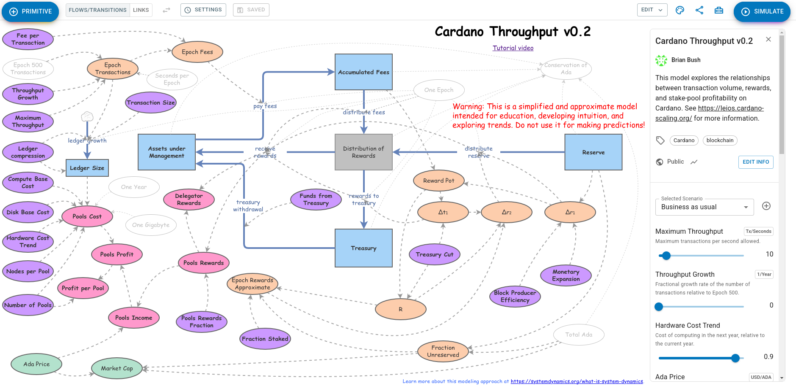

# Leios technical report #1

## Executive summary

## Introduction

## Informal description of Short Leios

### Glossary

- Input block (IB)
- Endoser block (EB)
- Ranking block (RB)
- BLS
- ALBA
- Musen
- . . .

### Example schedule

## Formal Specification for Short Leios

## Delta QSD network performance model

## Rust simulation

## Haskell prototype

## Voting and certificates

## Cost analyses

The deployment of Ouroboros Leios on Cardano nodes has economic implications both for the ecosystem as a whole and for individual stake pool operations (SPOs). Revenues may increase from the fees collected for the higher volume of transactions on the network, but costs may increase due to the additional computing associated with running a Leios implementation. The overall economic impact of Leios depends upon the relative magnitude of these revenues and costs as they evolve over time. Furthermore, relatively minor variants of the Leios protocol or its implementation may, in principle, have outsize implications for economic feasibility. Models and simulations that link the technical and economic aspects of Leios can provide guidance for settling the details of the Leios specification and how it will be implemented on the Cardano node.

For example, the selection of the voting and certificate scheme for Leios depends upon both technical and economic considerations. Security requirements determine which schemes and parameter ranges are acceptable, but the certificate schemes may have very different profiles of resource usage such as certificate size, construction time, and verification time. The time to construct or verify a certificate increases computing costs by its additional CPU load and it also constrains how short Leios phases can be, in turn affecting settlement time and transaction capacity. The size of votes and certificates increase network traffic, taking bandwidth aware from the diffusion of transactions and raising network costs. Additionally, the certificates must be stored permanently, making disk costs rise. Total costs are bounded by economic viability for SPOs and fees are bounded by user's willingness to transaction.

The choice of the Leios phase length, the number of IBs per pipeline, and the maximum IB size similarly influence network traffic, disk storage, and CPU usage. Shorter pipelines provide faster settlement but they also increase computing load. Once again there are both hard and soft constraints on the overall system. Thus there is complex interplay between security, engineering, and economics. The design and implementation of Leios needs to respect the hard constraints and optimize performance while minimizing cost.

We have developed two tools to aid in assessing technical versus economic trade-offs in designing the Leios protocol, implementing it, and selecting its parameters. A simulation of transaction volume on Cardano provides a high-level view of the techno-economic implications of a dramatically greater rate of transactions: this provides intuition about the evolution of Cardano economics in response to that higher throughput and in the presence of protocols like Leios that support such a level of transactions. A more detailed, static model estimates the cost that an individual SPO might experience under Leios, given specific choices for Leios protocol parameters. Results from the SPO-specific model can be input into the ecosystem-level simulation to link "top down" and "bottom up" analyses into a consistent perspective.
   
In the long term, we aim to represent the economic and technical aspects of Leios's viability on a chart like the following. The diagram summarizes a techno-economic business case for Leios adoption that sheds light on the following questions.

1. What is the practical maximum throughput of Leios?
2. How far does that fall short of the theoretical maximum throughput?
3. How much would Leios transactions have to cost for SPOs to make a reasonable profit?
4. What is the worst-case bound for the throughput vs cost profile of Leios?
5. Will Leios enable or require a fine-grained rewards model?
6. How does Leios compare to other blockchains?
7. Given current throughput targets, how much would Leios allow us to lower hardware requirements?
8. Given current hardware requirements, how much would Leios allow us to increase throughput?
9. What are the maximum limits Leios allows us to achieve at the maximum limits of currently available commodity hardware?

### Simulation of transaction volume on Cardano

Our system-dynamics simulation of transaction volume on Cardano models the interplay between fees collected from transactions and the rewards that accrue to SPOs from them, also accounting for the increased disk costs resulting from storing those transactions on the Cardano ledger. This is a simplified and approximate model intended for education, developing intuition, and exploring trends: it should not be used for making predictions. Two artifacts are publicly available:

- [System-dynamics simulation](https://www.insightmaker.com/insight/5B3Sq5gsrcGzTD11GyZJ0u/Cardano-Throughput-v0-2)
- [Tutorial video](https://drive.google.com/file/d/1YrQLLsgsPt4XHa707c-CfTLkivKRyaa0/view)

The model represents the following phenomena and has the following features:

- Movement of funds from the Reserve to the Treasury and to the rewards.
- Collection of fees from transactions into the rewards pot.
- Disbursement of the rewards pot to pools and users.
- Ledger size
- Pool costs and profitability
- Input parameters
    - Growth of transaction volume
    - Hardware costs for pools
    - Withdrawal of funds from the treasury
    - Ada price
- Graphics
    - Funds in Reserves, Treasury, and under user control
    - Pool costs, rewards, profit, and return
    - Ledger size
    - Diagnostic consistency checks for the simulation
- Calibrated against Epochs 500 through 519.

The user interface shown below lets one examine each equation in the model by clicking on the corresponding oval or rectangle. Dependencies between variables are shown as dashed lines, and flows from one "stock" (i.e., accumulation) to another are shown as solid lines with an arrow of flow. Sliders are available for altering input assumptions; a drop-down box allows the selection of a scenario; and a simulate button runs a numerical simulation of the future evolution of Cardano. Results are shown as a series of plots. Moving the input sliders updates the results in the plots, making it easy to understand the causal relationships between input variables and results.

This techno-economic simulation highlights the tension between the following variables:

- A linear growth in throughput would cause a quadratic growth in ledger size.
- Storage cost per gigabyte typically decays exponentially over time, but with a small rate (maybe 10% per year).
- Thus storage cost is the product of a quadratic increase and a mild exponential decrease, so (given the current cost trends) higher throughput might hurt stake pool economics.
    - This result depends critically upon how much the cost of disk storage decreases per year.
    - Compressing the Cardano ledger greatly improves Leios economics.
- At current levels of throughput and fees, the rewards accruing to stake pools will drop to half of their current value by 2031, as the Cardano reserves become depleted.
- Ada price is a wildcard.

### Estimation of costs for a Leios SPO

The system-dynamics simulation described in the previous section models the whole ecosystem, but no SPO is a microcosm of that; the simulation also does not include details specific to the Leios protocol. For SPO-specific analyses, we have developed a web-based cost calculator for the Leios protocol. This is a very preliminary tool for estimating the costs of running Leios nodes. At this point, it is really just useful for structuring thinking about Leios costs and making some very rough calculations for guiding further study. This model will be revised as protocol design and other modeling and simulation effort progress. Three artifacts are publicly available:

- [Online cost estimator](https://leios.cardano-scaling.org/cost-estimator/)
- [Tutorial video](https://drive.google.com/file/d/1pH1GYRInevlKcrkpFRJYIvRqFtcv3yFd/view?usp=sharing)
- [Agda cost model](../cost-dashboard/CostModel.agda)

The tool (shown below) uses the following methodology and has the following features:

- Inputs
    - All Leios and Praos protocol parameters can be varied.
    - Transactions can target the Praos layer or the Leios layer.
    - Each of the core Praos and Leios entities (RBs, IBs, EBs, votes, and certificates) are represented crudely as normalized resource loads: size, IO operations, CPU times for building and verifying.
    - Basic cloud costs can be specified: CPU, disk, IOPS, network egress.
    - Assumption about how disk costs decrease annually.
    - The SPO deployment is specified as its number of block-producer and relays nodes, along with the amount of its stake, fraction of rewards retained for its use, and upstream/downstream connectivity.
    - Assumptions about Cardano economics: fee per byte and price of Ada.
- Computations
    - Short Leios only.
    - Aggregation of transactions into IBs and those into EBs.
    - Linear scaling of cost and load with respect to usage.
- Outputs
    - Monthly resource usage and associated costs.
    - Estimated cost per transaction.
    - Viability metrics: revenue relative to costs.

The tool is populated with the crude, but best available, estimates for input parameters. The Leios simulation studies and the cryptographic benchmarking will provide refined inputs. Eventually, non-linearities in the relationship between usage and load will be incorporated into the algorithm, but the current version provides rough estimates.

The main findings confirm the insights from the system-dynamics siulation

- Long-term storage of IBs, EBs, and RBs will dominate operating costs unless storage requirements are reduced.
    - Compression will likely help.
    - Archiving, sharding, and pruning the transaction history are longer-term options.
- Downstream connectivity of nodes imposes substantial network-egress costs on SPOs.
- It is critical that hardware costs continue to drop at a 15% reduction per year.
- The present fee structure for Cardano transaction is sufficient for Leios to be viable if there are more than 50 transactions per second.

### Cost of storage

Currently, there is no provision for archiving, sharding, or pruning the Cardano ledger. Thus the amount of permanent storage required by each node scales with the size of the transactions it has historically processed. A rough estimate for the cost of VM disk space is $0.12/GB. Historically, the cost of such disk has dropped 5-20% per year, depending upon the provider. The present value of storage forever is the sum of all future discounted costs:

$$
C_\infty = C_0 \cdot \frac{1 + r}{r}
$$

where $r$ is the monthly discount rate. Assuming $C_0 = 0.12 \text{USD/GB/month}$, we have the following costs of perpetual storage.

| Annual discount | Cost of perpetual storage |
| --------------: | ------------------------: |
|              5% |               $28.92 / GB |
|             10% |                $14.52 /GB |
|             15% |                $9.72 / GB |
|             20% |                $7.32 / GB |

### Break-even cost for perpetual storage of blocks

For purpose of this estimate, assume that the goal of 500 stakepools is reached and each stakepool runs one block producer and two relays. Thus, each block will be stored hundreds of times. 

$$
\text{fee revenue} = 173.01 \frac{\text{lovelace}}{\text{B}} \cdot 10^{-6} \frac{\text{ADA}}{\text{lovelace}} \cdot 10^9 \frac{\text{B}}{\text{GB}} \cdot \frac{1}{3 \cdot 500} = 115.34 \frac{\text{ADA}}{\text{GB}}
$$

We can combine this revenue estimate with the previous estimate of storage cost to determine the price of ADA in USD that would be sufficient to exactly pay for perpetual storage.

| Annual discount | Cost of perpetual storage | Break-even price of Ada |
| --------------: | ------------------------: | ----------------------: |
|              5% |               $28.92 / GB |             $0.25 / ADA |
|             10% |                $14.52 /GB |             $0.13 / ADA |
|             15% |                $9.72 / GB |             $0.08 / ADA |
|             20% |                $7.32 / GB |             $0.06 / ADA |

Note that this is a best-case estimate, under the following assumptions:

- There are only 500 stake pools.
- All reward revenue is allocated to pay for perpetual storage of blocks.
- Block producers never fail to produce a block.
- All circulating Ada is staked.
- All Ada is in circulation.

We can recompute with assumption that match the current state of Cardano.
- Approximately 2500 stake pools.
- 17% of Ada is in the Reserve.
- 59% of Ada is staked.

| Annual discount | Cost of perpetual storage | Best break-even price of Ada | Realistic break-even price of Ada |
| --------------: | ------------------------: | ---------------------------: | --------------------------------: |
|              5% |               $28.92 / GB |                  $0.25 / ADA |                       $3.68 / ADA |
|             10% |               $14.52 / GB |                  $0.13 / ADA |                       $1.85 / ADA |
|             15% |                $9.72 / GB |                  $0.08 / ADA |                       $1.24 / ADA |
|             20% |                $7.32 / GB |                  $0.06 / ADA |                       $0.93 / ADA |

### Compressed storage of Praos blocks

Historically, Praos blocks have been highly compressible. For example, compressing Cardano `mainnet` chunks from genesis through epoch 517 using the `xz -9` tool reduces the uncompressed 183 GB to a mere 40 GB of data, yielding a 79% reduction in size. This level of compression varies quite a bit by epoch, but even recent epochs often compress by 75%. Thus even simple technologies such as compressed file systems can save SPOs significant amounts of storage. It is unknown, however, whether future blocks of transactions (Praos and/or Leios) will be as compressible as historically observed.

### Rewards received

For recent epochs, the fee paid in blocks per byte of block storage has a mean of 173.01 lovelace/byte.

In the long term (when the Cardano Reserves have been exhausted) the upper bound (if all Ada were staked and block producers never miss blocks) for the fraction of the fee paid to pools and stakers as rewards is 80%. Currently 20.91% of that reward goes to pool operators and the remainder goes to delegators.

### Importance of the Cardano Reserves

The analysis above considers transaction fees as the source of rewards, which will become the case when the Cardano Reserves is exhausted. Currently, however, the Reserves play an important role in funding stake pools. Lately, the Reserves have diminished approximately 0.18% per epoch.

|                                                                          |                                                                          |
| ------------------------------------------------------------------------ | ------------------------------------------------------------------------ |
|  |  |

In fact, approximately 99% of the rewards paid to stake pools come from the Reserves, with only about 1% coming from transaction fees.

### Insights for Leios techno-economics

1. Fees currently average 173.01 lovelace per byte of block.
	1. Under best-case conditions, that fee will cover a cost of 115 ADA per GB of storage across 500 stakepools.
	2. Under more realistic conditions, that fee will only cover a cost of 8 ADA per GB of storage across 2500 stakepools.
2. Stake pools receive on average 20.91% of rewards.
3. The cost of perpetual storage of blocks at VMs ranges $7/GB to $30/GB, strongly depending upon the assumption of how rapidly storage costs decrease in the future.
4. The Cardano Reserves currently supply 99% of the rewards that stake pools and delegators receive.
5. Break even-costs for the price of Ada needed to cover perpetual storage of blocks range from a best case of $0.06/ADA to a worst case of $3.68/ADA.
6. Historically, Cardano blocks have been highly compressible, with a reduction by 79% being readily achievable from genesis to recent epochs, and recent epochs compressing approximately 75%.
    1. SPOs can benefit from using compressed file systems.
    2. Future storage approaches in Cardano node might take advantage of this compressibility to directly reduce storage size.
    3. It is unknown how long this trend of high compressibility will continue.
7. Storage and network-egress costs dominate Leios SPO economics.
8. Leios appears economically feasible given current transaction fee rates if the following conditions hold:
    1. Transaction volume increases to 50 per second.
    2. Computing costs decrease by 15% annually.
    3. Blocks continue to be compressible by 70% or more.
    4. The network traffic to downstream nodes is limited to a economically sustainable level.
    5. Ada price continues at current values.
9. Reaching 100 transactions per second by 2030 will likely alleviate the depletion of the Reserves.

## Findings and conclusions
