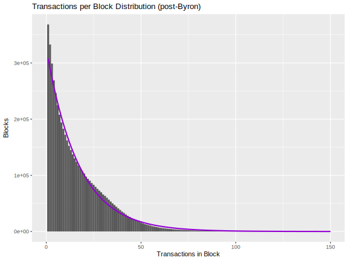

# Leios technical report #1


## Executive summary


## Introduction


## Informal description of Short Leios


### Glossary

- Input block (IB)
- Endoser block (EB)
- Ranking block (RB)
- BLS
- ALBA
- Musen
- . . .


### Example schedule


## Formal Specification for Short Leios


## Delta QSD network performance model


## Rust simulation


## Haskell prototype


## Voting and certificates

Leios voting involves numerous decisions about cryptographic matters and protocol parameters.

- What type of keys will be used to sign a vote?
- What form will a proof of the right to vote take?
- How large will the vote committee be?
- Will committee members with a large amount of stake be allowed multiple votes?
- What quorum of votes will be required to certify an EB?
- What type of certificate will attest to a quorum of votes?

These decisions affect security, efficiency, and cost.

- All of the choices affect security.
- The cryptographic details affect the size of votes and certificates and the CPU and network resources needed for them.
- The size of the committee and quorum directly affect CPU and network resources.

The next subsections contain preliminary analyses of concerns and potential decisions affecting voting and certificates. For clarity, we have tried to keep different aspects separate.


### Structure of votes

Conceptually, a Leios vote contains the following information:

- The hash of the EB being voted for
- The identity of the voter
- The number of votes cast
- A proof that the votes cast are valid
- A signature

When collecting votes for the same EB, the hash of the EB would only have to be listed once for the whole set. This will save 32 bytes per vote serialized. Not counting the hash of the EB, we would expect a vote to comprise at least 146 bytes. However, use of KES signature could add nearly 500 bytes more.

- *Voter identity:* 32 bytes
- *Number of votes cast:* 2 bytes
- *Proof of right to vote:* 80 bytes
- *Signature:* 32 bytes

> [!DANGER]
> Is this reasoning correct?
> 
> - Voter identity is 32 bytes because that is the size of a pool ID.
> - We really only need 1 byte to count the votes cast, but two is safer.
> - I'm not sure where the 80 byte estimate for a VRF proof came from.
> - A Blake2b-256 signature is 32 bytes.
> - This assumes that public keys would have been transmitted previously.
> - This also assumes that duplicative information such as the EB hash and pipeline ID would be global to the collection of votes.


It has not been decided what types of keys and signatures will be used for Leios votes. Key considerations are . . .

1. A vote should be small.
    1. Smaller than a TCP MTU so it fits in a single packet
    2. As small as possible if the size of a certificate scales with the size and number of votes
2. Key distribution should be simple and secure.
    1. Key rotation and revocation may be necessary
    2. Ideally, existing Cardano keys could be used for Leios voting, but without compromising security


> [!TODO]
> Below is the VRF+KES approach studied in Peras, which seems larger than it need be.
> - [ ] Remove redundant fields
> - [ ] Compare to fields needed for BLS and Musen
> 
> We have used an identical structure for single `Vote`s, for both algorithms. We define this structure as a CDDL grammar, inspired by the [block header](https://github.com/input-output-hk/cardano-ledger/blob/e2aaf98b5ff2f0983059dc6ea9b1378c2112101a/eras/conway/impl/cddl-files/conway.cddl#L27) definition from cardano-ledger:
> 
> ```cddl
> vote =
>   [ voter_id         : hash32
>   , voting_round     : round_no
>   , block_hash       : hash32
>   , voting_proof     : vrf_cert
>   , voting_weight    : voting_weight
>   , kes_period       : kes_period
>   , kes_vkey         : kes_vkey
>   , kes_signature    : kes_signature
>   ]
> ```
> 
> This definition relies on the following primitive types (drawn from Ledger definitions in [crypto.cddl](https://github.com/input-output-hk/cardano-ledger/blob/e2aaf98b5ff2f0983059dc6ea9b1378c2112101a/eras/conway/impl/cddl-files/crypto.cddl#L1))
> 
> ```cddl
> round_no = uint .size 8
> voting_weight = uint .size 8
> vrf_cert = [bytes, bytes .size 80]
> hash32 = bytes .size 32
> kes_vkey = bytes .size 32
> kes_signature = bytes .size 448
> kes_period = uint .size 8
> ```
> 
> * Total vote size is **710 bytes** with the above definition,
> * Unless explicitly mentioned, `hash` function exclusively uses 32-bytes Blake2b-256 hashes,
> * The `voter_id` is it's pool identifier, ie. the hash of the node's cold key. 


### Number of unique SPOs voting

Because stake in Cardano is very unevenly distributed among stake pools, it is likely that some stake pools will win several votes in a Leios lottery and many will win no votes. See the section [Stake pool distribution](#stake-pool-distribution) below for a plot of the typical stake distribution on the Cardano mainnet. We need to estimate how many distinct SPO nodes vote in a given round because this affects the number of votes transmitted and the size of the Leios certificate.

Let $p$ be the probability that a unit of stake (i.e., one lovelace in Cardano) will be selected in the voting lottery and let $S$ be the total staked. Let $n$ be the desired mean number of votes in the lottery. Hence $p = n / S$. A candidate node $i$ with $s_i$ staked to it has a binomially distributed number of votes, with mean $p \cdot s_i$. The probability is $v_i = 1 - \left( 1 - p \right)^{s_i}$ that the node has any votes at all.

If the random variable $\mathbf{V}_i$ is distributed according to the Bernoulli trial with probability $v_i$, then $\mathbf{V} = \sum_i \mathbf{V}_i$ is the committee size. This will differ from the number of votes because some nodes might have multiple votes. It is feasible to numerically sample $\mathbf{V}$, but simply computing its mean and standard deviation is insightful. The mean is $\mu = \sum_i v_i$ and the variance is $\sigma^2 = \sum_i v_i \cdot \left( 1 - v_i \right)$. A simple R function lets us estimate $\mu$ and $\mu \pm 2 \sigma$ for the empirical distribution of stake.

```R
# Statistics for a mean committee size `n` and a stake distribution `stake`.
committee <- function(n, stakes) {
    p <- n / sum(stakes)
    v0 <- (1 - p) ^ as.numeric(stakes)
    v1 <- 1 - v0
    meanC <- sum(v1)
    sdC <- sqrt(sum(v0 * v1))
    list(`μ` = meanC, `μ-2σ` = meanC - 2 * sdC, `μ+2σ` = meanC + 2 * sdC)
}
```

The plots below show the number of unique voters as a function of mainnet epoch and mean number of votes. For 500 votes we expect about 325 unique voters, but for 1000 votes we expect about 500 unique voters. Note that if stake were distributed uniformly among all stakepools, the expected number of unique voters would be less than the decentralization parameter $k$, which currently is $k = 500$; for number of votes smaller than that, the mean number of unique voters would be the number of votes.

|                                                                          |                                                                          |                                                                            |
| ------------------------------------------------------------------------ | ------------------------------------------------------------------------ | -------------------------------------------------------------------------- |
|  |  |  |


### Committee size and quorum requirement

The combinatorics associated with obtaining a quorum of voters from a mixture of honest and dishonest parties set fundamental limits on the safe size for voting quorums in Leios. (However, the specific choice of certificate scheme my imposing additional limits and security considerations.) We are concerned about both the probability that a quorum of honest votes is reached and the probability that dishonest voters form their own quorum. For Leios, the situation where there are multiple quora of mixed honest and dishonest parties is not equivalent to having a dishonest quorum, though it may cause inefficiencies when EBs with duplicate or clashing transactions are later included in RBs. The table below shows situations that may be encountered.

> [!DANGER]
> Is it the second-to-last sentence in the previous paragraph really true?

| Quorum of honest votes? | Quorum of adversial votes? | Description        | Implications                                                             |
| ----------------------- | -------------------------- | ------------------ | ------------------------------------------------------------------------ |
| Yes                     | No                         | Honest quorum      | Protocol operates normally, with successful endorsement of input blocks. |
| No                      | No                         | No quorum          | Protocol operates normally, but without endorsement of input blocks.     |
| No                      | Yes                        | Adversarial quorum | Adversary controls the endorsement.                                      |
| Yes                     | Yes                        | Multiple quora     | Adversary can create conflicting endorsements.                           |

We can estimate the probability of not having an honest quorum. Let $\beta$ be the probability that a unit of stake is selected for voting-committee membership, let $n$ be the mean number of votes, and let $\tau \cdot n$ be the number of votes required for a quorum. Let $S$ be the total stake and $H = (1 - f) \cdot S$ be the honest stake, with $f$ being the fraction of adversarial stake. Assuming the total stake is large, we can approximate the binomial distribution by a normal one and express the probability of not having an an honest quorum as follows:

$$
P = \mathbf{P}_\text{binom} (\lfloor \tau \cdot n \rfloor, H, \beta) \approx \mathbf{P}_\text{normal} \left( \tau \cdot n, H \cdot \beta, \sqrt{H \cdot \beta \cdot (1 - \beta)} \right) \approx \mathbf{P}_\text{normal} \left( \tau \cdot n, H \cdot \beta, \sqrt{H \cdot \beta} \right)
$$

Using $n \approx S \cdot \beta$, we have a simpler approximate expression and an R function for performing the computation.

$$
P \approx \mathbf{P}_\text{normal} \left( f , 1 - \tau , \sqrt{\frac{1 - f}{n}} \right)
$$

```R
function(f, tau, n)
  pnorm(f, 1 - tau, sqrt((1 - f) / n))
```

The plots below show how the probability of obtaining or not obtaining an honest quorum varies with the quorum size and committee size. We do not consider committees smaller than the decentralization parameter $k = 500$.


> [!DANGER]
> Should we do the exact computation for the above plots and table or is the normal approximation okay? The CDF computations might be slow, and we'd also have to make an assumption about the number of lovelace staked.

Conversely, using the same method we can estimate the probability of adversarial parties creating their own quorum.


We must consider the following criteria when selecting the mean committee size and the quorum requirement:

1. A larger committee imposes more network traffic.
2. A larger quorum requirement imposes larger certificates.
3. Larger committees and quorum requirements make it harder for an adversary to obtain a quorum. 
4. Larger quorum requirements make it easier for an adversary to prevent an honest quorum.

For Leios the third criterion above is critical, so we need to avoid at all costs a chance of an adversarial quorum. The first and third criteria are important only in that they affect the cost of running Leios nodes. The fourth criterion is less important because it only creates inefficiency leading to lower throughput.

Given the above analysis, we consider a 60% quorum for a committee of 500 votes to be the most efficient and least costly that still maintains security. This implies a low probability of an adversarial quorum even for a strong adversary and a high probability of an honest quorum even for a modestly strong adversary. Note that even at 50% adversarial stake, the security of voting is much stronger than the underlying Praos security, though it would be very hard to have a successful honest quorum. At 45% adversarial stake honest quora would be frequent enough for the chain to function inefficiently. It might be possible to lower the quorum requirement to 55%, which would give a 1.29e-3 probability of an adversarial certificate at 45% adversarial stake and a 50% probability of an honest quorum.

| Adversarial stake, $f$ | Probability of adversarial quorum | Probability of honest quorum |
| ---------------------: | --------------------------------: | ---------------------------: |
|                    0 % |                          2.42e-41 |                        1.000 |
|                   10 % |                          2.33e-32 |                        1.000 |
|                   20 % |                          7.62e-24 |                        1.000 |
|                   30 % |                          5.38e-16 |                        0.996 |
|                   40 % |                           3.88e-9 |                        0.500 |
|                   45 % |                           3.01e-6 |                        0.066 |
|                   50 % |                           7.83e-4 |                        0.001 |

> [!TODO]
> We need to compute the Praos attack probabilities at the above adversarial stakes, so we can compare them to the Leios probability of an adversarial quorum. I'm certain that the Leios probabilities are lower than the Praos ones if $\tau = 0.60$, but I'm not so certain about the situation if $\tau = 0.55$.

> [!DANGER]
> 
> The above analysis might not hold when the clumpiness of the stake distribution is accounted for. For example, do the probabilities change if a couple of large stakepools are selected in the lottery?


### Certificate scheme

Certificates that attest to a quorum of votes have failure modes beyond the failure modes for obtaining a quorum of votes. Cryptographic parameters must be set so that a certificate is only created if a quorum is present and it should be highly probably that a certificate can be created if a quorum is present.

| Quorum of votes? | Certificate created? | Description           | Implications                                          |
| ---------------- | -------------------- | --------------------- | ----------------------------------------------------- |
| Yes              | Yes                  | Proper certificate    | Input blocks endorsed.                                |
| Yes              | No                   | Certification failure | Input blocks not endorsed when they should have been. |
| No               | No                   | No quorum             | Input blocks not endorsed.                            |
| No               | Yes                  | Erroneous certificate | Input blocks endorsed when they should not have been. |

Combining the possible voting outcomes with the certificate ones yields a complex landscape. There is some interaction between voting and certification because some certificate scheme may have small probabilities of building a valid certificate without a quorum. We will evaluate several schemes in terms of these probabilities and the size of the certificate they produce. In addition to security, Leios requires that the certificate fit inside a Praos block, currently 90,112 bytes.

| Content of certificate | Quorum on honest votes? | Certificate created? | Description                                          | Endorsement |
| ---------------------- | ----------------------- | -------------------- | ---------------------------------------------------- | ----------- |
| Honest votes           | Yes                     | Yes                  | Proper honest certificate                            | Honest      |
| Honest votes           | No                      | Yes                  | Erroneous honest certificate                         | Incorrect   |
| Honest votes           | Yes                     | No                   | Failure to make honest certificate                   | Failure     |
| Honest votes           | No                      | No                   | No honest quorum                                     | None        |
| Adversarial votes      | Yes                     | Yes                  | Adversarial certificate when honest one was possible | Attacked    |
| Adversarial votes      | No                      | Yes                  | Adversarial certificate                              | Attacked    |


#### BLS certificate


#### ALBA certificate

> [!WARNING]
> This section needs thorough review, and it does not distinguish ALBA variants.
> 
> - [ ] Check the typesetting of the equations.

ALBA certificates are parameterized by three parameters ($n_f$, $n_p$, and $\ell_\text{sec}$). Let $\left| S_p \right|$ be the number of honest votes the certifier has access to. The *completeness* property of ALBA ensures that one is not able to create a proof with probability $p = 2^{-\ell_\text{sec}}$  provided $\left| S_p \right| \geq n_p$. If $\left| S_p \right| < n_p$, then the probability of optimistically failing to create a proof is

$$
p = 2 \cdot \log 12 \cdot \lceil \ell_\text{sec} \rceil \cdot \left( \frac{\left| S_p \right|}{n_p} \right)^u
$$

where the number of votes included in the proof is

$$
u = \left\lceil \frac{ \ell_\text{sec} + \log_2 \ell_\text{sec} + 5 - \log_2 (\log_2 e) } { \log_2(\frac{n_p}{n_f}) } \right\rceil
$$

The plots below show how it is more probable to build a certificate with more votes or lower $n_p$ and how higher $n_p$ requires fewer items (votes) be included in the certificate. We need a low enough $n_p$ so that a certifier can easily build a certificate of honest votes and a low enough $n_p$ so that the resulting certificate will fit in a Praos block.

|                                                                        |                                                             |
| ---------------------------------------------------------------------- | ----------------------------------------------------------- |
|  |  |

For the sake of argument, assume that we want the votes included in the certificate to occupy no more than 75 kB. The table below indicates that votes no larger than 400 bytes would provide a reasonable requirement for the number of honest votes needed for certification. Note that our analysis of quorum size resulted in a constraint of 60% of the votes being honest. ALBA, however, raised that constraint the to values in the table because ALBA needs more than 60% of the votes to build a compact certificate.

| Vote size | Votes fitting into 75 kB | Minimum allowable $n_p$ | Fraction of honest votes needed, $n_p/n$ |
| --------: | -----------------------: | ----------------------: | ---------------------------------------: |
|     200 B |                      375 |                     355 |                                   71.0 % |
|     250 B |                      300 |                     371 |                                   74.2 % |
|     300 B |                      250 |                     386 |                                   77.2 % |
|     350 B |                      214 |                     403 |                                   80.6 % |
|     400 B |                      187 |                     421 |                                   84.2 % |
|     450 B |                      166 |                     439 |                                   87.8 % |
|     500 B |                      150 |                     457 |                                   91.4 % |


> [!TODO]
> 
> Include results from Raphael's analyses and benchmarking:
> 
> - [ ] Certificate size for unoptimized and optimized ALBA format.
> - [ ] How proving times vary with the underlying hash algorithm (Blake2s, SHA256, Keccak256, Poseidon, etc.).
> - [ ] Snarkification


#### Musen certificate


## Cost analyses

The deployment of Ouroboros Leios on Cardano nodes has economic implications both for the ecosystem as a whole and for individual stake pool operations (SPOs). Revenues may increase from the fees collected for the higher volume of transactions on the network, but costs may increase due to the additional computing associated with running a Leios implementation. The overall economic impact of Leios depends upon the relative magnitude of these revenues and costs as they evolve over time. Furthermore, relatively minor variants of the Leios protocol or its implementation may, in principle, have outsize implications for economic feasibility. Models and simulations that link the technical and economic aspects of Leios can provide guidance for settling the details of the Leios specification and how it will be implemented on the Cardano node.

For example, the selection of the voting and certificate scheme for Leios depends upon both technical and economic considerations. Security requirements determine which schemes and parameter ranges are acceptable, but the certificate schemes may have very different profiles of resource usage such as certificate size, construction time, and verification time. The time to construct or verify a certificate increases computing costs by its additional CPU load and it also constrains how short Leios phases can be, in turn affecting settlement time and transaction capacity. The size of votes and certificates increase network traffic, taking bandwidth aware from the diffusion of transactions and raising network costs. Additionally, the certificates must be stored permanently, making disk costs rise. Total costs are bounded by economic viability for SPOs and fees are bounded by user's willingness to transaction.

The choice of the Leios phase length, the number of IBs per pipeline, and the maximum IB size similarly influence network traffic, disk storage, and CPU usage. Shorter pipelines provide faster settlement but they also increase computing load. Once again there are both hard and soft constraints on the overall system. Thus there is complex interplay between security, engineering, and economics. The design and implementation of Leios needs to respect the hard constraints and optimize performance while minimizing cost.

We have developed two tools to aid in assessing technical versus economic trade-offs in designing the Leios protocol, implementing it, and selecting its parameters. A simulation of transaction volume on Cardano provides a high-level view of the techno-economic implications of a dramatically greater rate of transactions: this provides intuition about the evolution of Cardano economics in response to that higher throughput and in the presence of protocols like Leios that support such a level of transactions. A more detailed, static model estimates the cost that an individual SPO might experience under Leios, given specific choices for Leios protocol parameters. Results from the SPO-specific model can be input into the ecosystem-level simulation to link "top down" and "bottom up" analyses into a consistent perspective.
   
In the long term, we aim to represent the economic and technical aspects of Leios's viability on a chart like the following. The diagram summarizes a techno-economic business case for Leios adoption that sheds light on the following questions.

1. What is the practical maximum throughput of Leios?
2. How far does that fall short of the theoretical maximum throughput?
3. How much would Leios transactions have to cost for SPOs to make a reasonable profit?
4. What is the worst-case bound for the throughput vs cost profile of Leios?
5. Will Leios enable or require a fine-grained rewards model?
6. How does Leios compare to other blockchains?
7. Given current throughput targets, how much would Leios allow us to lower hardware requirements?
8. Given current hardware requirements, how much would Leios allow us to increase throughput?
9. What are the maximum limits Leios allows us to achieve at the maximum limits of currently available commodity hardware?


### Simulation of transaction volume on Cardano

Our system-dynamics simulation of transaction volume on Cardano models the interplay between fees collected from transactions and the rewards that accrue to SPOs from them, also accounting for the increased disk costs resulting from storing those transactions on the Cardano ledger. This is a simplified and approximate model intended for education, developing intuition, and exploring trends: it should not be used for making predictions. Two artifacts are publicly available:

- [System-dynamics simulation](https://www.insightmaker.com/insight/5B3Sq5gsrcGzTD11GyZJ0u/Cardano-Throughput-v0-2)
- [Tutorial video](https://drive.google.com/file/d/1YrQLLsgsPt4XHa707c-CfTLkivKRyaa0/view)

The model represents the following phenomena and has the following features:

- Movement of funds from the Reserve to the Treasury and to the rewards.
- Collection of fees from transactions into the rewards pot.
- Disbursement of the rewards pot to pools and users.
- Ledger size
- Pool costs and profitability
- Input parameters
    - Growth of transaction volume
    - Hardware costs for pools
    - Withdrawal of funds from the treasury
    - Ada price
- Graphics
    - Funds in Reserves, Treasury, and under user control
    - Pool costs, rewards, profit, and return
    - Ledger size
    - Diagnostic consistency checks for the simulation
- Calibrated against Epochs 500 through 519.

The user interface shown below lets one examine each equation in the model by clicking on the corresponding oval or rectangle. Dependencies between variables are shown as dashed lines, and flows from one "stock" (i.e., accumulation) to another are shown as solid lines with an arrow of flow. Sliders are available for altering input assumptions; a drop-down box allows the selection of a scenario; and a simulate button runs a numerical simulation of the future evolution of Cardano. Results are shown as a series of plots. Moving the input sliders updates the results in the plots, making it easy to understand the causal relationships between input variables and results.


This techno-economic simulation highlights the tension between the following variables:

- A linear growth in throughput would cause a quadratic growth in ledger size.
- Storage cost per gigabyte typically decays exponentially over time, but with a small rate (maybe 10% per year).
- Thus storage cost is the product of a quadratic increase and a mild exponential decrease, so (given the current cost trends) higher throughput might hurt stake pool economics.
    - This result depends critically upon how much the cost of disk storage decreases per year.
    - Compressing the Cardano ledger greatly improves Leios economics.
- At current levels of throughput and fees, the rewards accruing to stake pools will drop to half of their current value by 2031, as the Cardano reserves become depleted.
- Ada price is a wildcard.


### Estimation of costs for a Leios SPO

The system-dynamics simulation described in the previous section models the whole ecosystem, but no SPO is a microcosm of that; the simulation also does not include details specific to the Leios protocol. For SPO-specific analyses, we have developed a web-based cost calculator for the Leios protocol. This is a very preliminary tool for estimating the costs of running Leios nodes. At this point, it is really just useful for structuring thinking about Leios costs and making some very rough calculations for guiding further study. This model will be revised as protocol design and other modeling and simulation effort progress. Three artifacts are publicly available:

- [Online cost estimator](https://leios.cardano-scaling.org/cost-estimator/)
- [Tutorial video](https://drive.google.com/file/d/1pH1GYRInevlKcrkpFRJYIvRqFtcv3yFd/view?usp=sharing)
- [Agda cost model](../cost-dashboard/CostModel.agda)

The tool (shown below) uses the following methodology and has the following features:

- Inputs
    - All Leios and Praos protocol parameters can be varied.
    - Transactions can target the Praos layer or the Leios layer.
    - Each of the core Praos and Leios entities (RBs, IBs, EBs, votes, and certificates) are represented crudely as normalized resource loads: size, IO operations, CPU times for building and verifying.
    - Basic cloud costs can be specified: CPU, disk, IOPS, network egress.
    - Assumption about how disk costs decrease annually.
    - The SPO deployment is specified as its number of block-producer and relays nodes, along with the amount of its stake, fraction of rewards retained for its use, and upstream/downstream connectivity.
    - Assumptions about Cardano economics: fee per byte and price of Ada.
- Computations
    - Short Leios only.
    - Aggregation of transactions into IBs and those into EBs.
    - Linear scaling of cost and load with respect to usage.
- Outputs
    - Monthly resource usage and associated costs.
    - Estimated cost per transaction.
    - Viability metrics: revenue relative to costs.

The tool is populated with the crude, but best available, estimates for input parameters. The Leios simulation studies and the cryptographic benchmarking will provide refined inputs. Eventually, non-linearities in the relationship between usage and load will be incorporated into the algorithm, but the current version provides rough estimates.


The main findings confirm the insights from the system-dynamics siulation

- Long-term storage of IBs, EBs, and RBs will dominate operating costs unless storage requirements are reduced.
    - Compression will likely help.
    - Archiving, sharding, and pruning the transaction history are longer-term options.
- Downstream connectivity of nodes imposes substantial network-egress costs on SPOs.
- It is critical that hardware costs continue to drop at a 15% reduction per year.
- The present fee structure for Cardano transaction is sufficient for Leios to be viable if there are more than 50 transactions per second.

> [!DANGER]
> 
> We need to account for the fact that many SPOs use cloud services that include a large amount of bandwidth for VMs: the cost model should only bill for the bandwidth used beyond that monthly allocation.


### Cost of storage

Currently, there is no provision for archiving, sharding, or pruning the Cardano ledger. Thus the amount of permanent storage required by each node scales with the size of the transactions it has historically processed. A rough estimate for the cost of VM disk space is $0.12/GB. Historically, the cost of such disk has dropped 5-20% per year, depending upon the provider. The present value of storage forever is the sum of all future discounted costs:

$$
C_\infty = C_0 \cdot \frac{1 + r}{r}
$$

where $r$ is the monthly discount rate. Assuming $C_0 = 0.12 \text{USD/GB/month}$, we have the following costs of perpetual storage.

| Annual discount | Cost of perpetual storage |
| --------------: | ------------------------: |
|              5% |               $28.92 / GB |
|             10% |                $14.52 /GB |
|             15% |                $9.72 / GB |
|             20% |                $7.32 / GB |


### Break-even cost for perpetual storage of blocks

For purpose of this estimate, assume that the goal of 500 stakepools is reached and each stakepool runs one block producer and two relays. Thus, each block will be stored hundreds of times. 

$$
\text{fee revenue} = 173.01 \frac{\text{lovelace}}{\text{B}} \cdot 10^{-6} \frac{\text{ADA}}{\text{lovelace}} \cdot 10^9 \frac{\text{B}}{\text{GB}} \cdot \frac{1}{3 \cdot 500} = 115.34 \frac{\text{ADA}}{\text{GB}}
$$

We can combine this revenue estimate with the previous estimate of storage cost to determine the price of ADA in USD that would be sufficient to exactly pay for perpetual storage.

| Annual discount | Cost of perpetual storage | Break-even price of Ada |
| --------------: | ------------------------: | ----------------------: |
|              5% |               $28.92 / GB |             $0.25 / ADA |
|             10% |                $14.52 /GB |             $0.13 / ADA |
|             15% |                $9.72 / GB |             $0.08 / ADA |
|             20% |                $7.32 / GB |             $0.06 / ADA |

Note that this is a best-case estimate, under the following assumptions:

- There are only 500 stake pools.
- All reward revenue is allocated to pay for perpetual storage of blocks.
- Block producers never fail to produce a block.
- All circulating Ada is staked.
- All Ada is in circulation.

We can recompute with assumption that match the current state of Cardano.
- Approximately 2500 stake pools.
- 17% of Ada is in the Reserve.
- 59% of Ada is staked.

| Annual discount | Cost of perpetual storage | Best break-even price of Ada | Realistic break-even price of Ada |
| --------------: | ------------------------: | ---------------------------: | --------------------------------: |
|              5% |               $28.92 / GB |                  $0.25 / ADA |                       $3.68 / ADA |
|             10% |               $14.52 / GB |                  $0.13 / ADA |                       $1.85 / ADA |
|             15% |                $9.72 / GB |                  $0.08 / ADA |                       $1.24 / ADA |
|             20% |                $7.32 / GB |                  $0.06 / ADA |                       $0.93 / ADA |


### Compressed storage of Praos blocks

Historically, Praos blocks have been highly compressible. For example, compressing Cardano `mainnet` chunks from genesis through epoch 517 using the `xz -9` tool reduces the uncompressed 183 GB to a mere 40 GB of data, yielding a 79% reduction in size. This level of compression varies quite a bit by epoch, but even recent epochs often compress by 75%. Thus even simple technologies such as compressed file systems can save SPOs significant amounts of storage. It is unknown, however, whether future blocks of transactions (Praos and/or Leios) will be as compressible as historically observed.

### Rewards received

For recent epochs, the fee paid in blocks per byte of block storage has a mean of 173.01 lovelace/byte.


In the long term (when the Cardano Reserves have been exhausted) the upper bound (if all Ada were staked and block producers never miss blocks) for the fraction of the fee paid to pools and stakers as rewards is 80%. Currently 20.91% of that reward goes to pool operators and the remainder goes to delegators.


### Importance of the Cardano Reserves

The analysis above considers transaction fees as the source of rewards, which will become the case when the Cardano Reserves is exhausted. Currently, however, the Reserves play an important role in funding stake pools. Lately, the Reserves have diminished approximately 0.18% per epoch.

|                                                                          |                                                                          |
| ------------------------------------------------------------------------ | ------------------------------------------------------------------------ |
|  |  |

In fact, approximately 99% of the rewards paid to stake pools come from the Reserves, with only about 1% coming from transaction fees.


### Insights for Leios techno-economics

1. Fees currently average 173.01 lovelace per byte of block.
	1. Under best-case conditions, that fee will cover a cost of 115 ADA per GB of storage across 500 stakepools.
	2. Under more realistic conditions, that fee will only cover a cost of 8 ADA per GB of storage across 2500 stakepools.
2. Stake pools receive on average 20.91% of rewards.
3. The cost of perpetual storage of blocks at VMs ranges $7/GB to $30/GB, strongly depending upon the assumption of how rapidly storage costs decrease in the future.
4. The Cardano Reserves currently supply 99% of the rewards that stake pools and delegators receive.
5. Break even-costs for the price of Ada needed to cover perpetual storage of blocks range from a best case of $0.06/ADA to a worst case of $3.68/ADA.
6. Historically, Cardano blocks have been highly compressible, with a reduction by 79% being readily achievable from genesis to recent epochs, and recent epochs compressing approximately 75%.
    1. SPOs can benefit from using compressed file systems.
    2. Future storage approaches in Cardano node might take advantage of this compressibility to directly reduce storage size.
    3. It is unknown how long this trend of high compressibility will continue.
7. Storage and network-egress costs dominate Leios SPO economics.
8. Leios appears economically feasible given current transaction fee rates if the following conditions hold:
    1. Transaction volume increases to 50 per second.
    2. Computing costs decrease by 15% annually.
    3. Blocks continue to be compressible by 70% or more.
    4. The network traffic to downstream nodes is limited to a economically sustainable level.
    5. Ada price continues at current values.
9. Reaching 100 transactions per second by 2030 will likely alleviate the depletion of the Reserves.


## Approximate models of Cardano mainnet characteristics

We have developed several "curve fits" to Cardano mainnet statistics for quantities of interest in Leios simulations. These serve as compact and convenient inputs to some of the Leios simulation studies. Of course, they do no preclude using historical transaction data directly in Leios simulations and using future hypothetical or extreme distributions for Leios simulation studies.

### Transaction sizes and frequencies

Using post-Byron `mainnet` data from `cardano-db-sync`, we tally the transaction sizes and number of transactions per block. As a rough approximation, we can model the size distribution by a log-normal distribution with log-mean of `6.833` and log-standard-deviation of `1.127` and the transactions per block as an exponential distribution with mean `16.97`. The plots below compare the empirical distributions to these approximations.

| Transaction Size                                     | Transactions per Block                                    |
| ---------------------------------------------------- | --------------------------------------------------------- |
|  |  |

The transaction-size distribution has a longer tail and more clumpiness than the log-normal approximation, but the transaction-per-block distribution is consistent with an exponential distribution. Note, however, that there is a correlation between size and number per block, so we'd really need to model the joint distribution. For the time being, these two approximation should be adequate.

See [this Jupyter notebook](../analysis/tx.ipynb) for details of the analysis.


### Stake distribution

The stake distribution has an important influence on the number of unique SPOs involved in each round of Leios voting. It turns out that the cumulative distribution function for the beta distribution (the [regularized incomplete beta function](https://en.wikipedia.org/wiki/Regularized_incomplete_beta_function)) with parameters `α = 11` and `β = 1` nicely fits the empirical distribution of stake pools at epoch 500. This curve can be adapted to the actual number of stake pools being modeled: for example, in order to use this for 2000 stake pools, just divide the x axis into 2000 points and take the difference in consecutive y values as the amount of stake the corresponding pool has.


## Findings and conclusions
