<strong><font color="red">DRAFT: WORK IN PROGRESS</font></strong>

# Leios technical report #2

## Executive summary

> [!NOTE]
> Draft the executive summary after the rest of the report is complete.

## Network Specification

Ouroboros Leios introduces new types of blocks with novel diffusion patterns and requirements. In this document we provide a technical specification of mini protocols for the on-the-fly relay of recent blocks and for the availability of older blocks referenced by the blockchain.

### Mini protocols

For background information on mini protocols see sections 3.1-3.4 of the *Ouroboros Network Specification*[^network-spec], and rest of that chapter for the mini protocols already in use. Here we will present the additional node-to-node mini protocols needed for Leios.

> [!NOTE]
> Perhaps this mini-protocol section should be moved into the CIP?

#### `Relay` mini-protocol

The `Relay` protocol presented here is a generalization of the tx submission protocol used to transfer transactions between full nodes. We will use the term *datum* as a generic term for the payloads being diffused, which we expect to be generally small: transactions, input block headers, endorse block headers[^network-split], vote bundles for a single pipeline and voter.

The protocol follows a pull-based strategy where the consumer asks for new ids/datums and the producer sends them back. It is designed to be suitable for a trustless setting where both sides need to guard against resource consumption attacks from the other side.

##### Options and parameters

A instance is specified by these options and parameters.

- `BoundedWindow`: The peers manage a bounded window (i.e. FIFO queue) of datums available to be requested. Useful for datums that are otherwise unbounded in number.
- `Announcements`: Producers provide additional announcements about datums, when available.
- `id`: Identifier for a datum to be relayed, used when requesting the datum.
- `info`: Extra information provided with a new `id`.
- `datum`: The datum itself.
* `Ann. Condition` ("if" announcements): Condition for announcement.
* `ann` ("if" announcements): Announcement representation.

##### Instances

`Relay` protocol instances are listed in the table below. Tx-submission is further parameterized by the maximum window size allowed. IB-relay, EB-relay, and Vote-relay are each parametrized by the maximum age beyond which a datum is no longer relayed[^eb-ib-relayed]. IB-relay and EB-relay rely on to let consumers know when block bodies are available as well. Consumers request IB and EB bodies through the corresponding mini protocol. For EB-relay we specify the to be eb-header, by which we mean the constant size part of an Endorse block, while the references (to IBs and EBs) are considered the body.

> [!NOTE]
> For IB, EB, and Vote the info could actually be unit as we do not need to apply prioritization to headers. How- ever the slot might provide useful filtering, such as avoid downloading any more votes of a pipeline once we have a certificate for a seen EB

> Table: `Relay` mini-protocol instances.

| `instance`    | `BoundedWindow` | `Announcements` | `id` | `info` | `datum`     | `Ann. Condition` | `ann` |
| :------------ | :-------------- | :-------------- | :--- | :----- | :---------- | :--------------- | :---- |
| Tx-submission | Yes             | No              | txid | size   | tx          | N/A              | N/A   |
| IB-relay      | No              | Yes             | hash | slot   | ib-header   | body available   | unit  |
| EB-relay      | No              | Yes             | hash | slot   | eb-header   | body available   | unit  |
| Vote-relay    | No              | No              | hash | slot   | vote-bundle | N/A              | N/A   |

##### State machine


###### Grammar

$$`
\begin{array}{l c l l}
\text{ack}{} & ::= & \text{number} & \text{if}\,\text{BoundedWindow}{}\\
       & |  & \text{unit} & \text{otherwise}\\
\text{req}{} & ::= & \text{number} \\
\end{array}
`$$

> Table: Relay state agencies

| state              | agency   |
| ------------------ | -------- |
| `StInit`           | Producer |
| `StIdle`           | Consumer |
| `StIdsBlocking`    | Producer |
| `StIdsNonBlocking` | Producer |
| `StData`           | Producer |
##### Protocol messages

- **`MsgInit`**: initial message of the protocol
- **`MsgRequestIdsNonBlocking`**`(ack,req)`: The consumer asks for new ids and acknowledges old ids. The producer replies immediately, possibly with an empty reply if nothing new is available.
- **`MsgRequestIdsBlocking`**`(ack, req)`:  Same as `MsgRequestIdsNonBlocking` but the producer will block until the reply will be non-empty.
- **`MsgReplyIds`**`([(id, info])`:  The producer replies with a list of available datums. The list contains pairs of ids and corresponding information about the identified datum. In the blocking case the reply is guaranteed to contain at least one id. In the non-blocking case, the reply may contain an empty list.
- **`MsgReplyIdsAndAnns`**`([id, info], [(id, ann)])`:  (Requires Announcements) Same as `MsgReplyIds` but additionally the producer might, at most once, also provide an announcement for any id it has sent, in this message or previously.
- **`MsgRequestData`**`([id])`:  The consumer requests datums by sending a list of ids.
- **`MsgReplyData`**`([datum])`:  The producer replies with a list of the requested datums, some may be missing if no longer available for relay.
- **`MsgDone`**  The producer terminates the mini protocol.

> Table: mini-protocol messages

| from state         | message                        | parameters                  | to state           |
| :----------------- | :----------------------------- | :-------------------------- | :----------------- |
| `StInit`           | **`MsgInit`**                  |                             | `StIdle`           |
| `StIdle`           | **`MsgRequestIdsBlocking`**    | `ack, req`                  | `StIdsBlocking`    |
| `StIdsBlocking`    | **`MsgReplyIds`**              | `[(id, info)]`              | `StIdle`           |
| `StIdle`           | **`MsgRequestIdsNonBlocking`** | `ack, req`                  | `StIdsNonBlocking` |
| `StIdsNonBlocking` | **`MsgReplyIds`**              | `[(id, info)]`              | `StIdle`           |
| `StIdle`           | **`MsgRequestData`**           | `[id]`                      | `StData`           |
| `StData`           | **`MsgReplyData`**             | `[datum]`                   | `StIdle`           |
| `StIdsBlocking`    | **`MsgDone`**                  |                             | `StDone`           |
|                    |                                |                             |                    |
| `StIdsBlocking`    | **`MsgReplyIdsAndAnns`**\*     | `[(id, info)], [(id, ann)]` | `StIdle`           |
| `StIdsNonBlocking` | **`MsgReplyIdsAndAnns`**\*     | `[(id, info)], [(id, ann)]` | `StIdle`           |
\* If Announcements is set, **`MsgReplyIds`** messages are replaced with **`MsgReplyIdsAndAnns`**:

##### Producer and consumer implementation

The protocol has two design goals: It must diffuse datums with high efficiency and, at the same time, it must rule out asymmetric resource attacks from the consumer against the provider.

The protocol is based on two pull-based operations. The consumer can ask for a number of ids and it can use these ids to request a batch of datums. The consumer has flexibility in the number of ids it requests, whether to actually download the datum of a given id and flexibility in how it batches the download of datums. The consumer can also switch between requesting ids and downloading datums at any time. The protocol supports blocking and non-blocking requests for new ids. The producer must reply immediately (i.e. within a small timeout) to a non-blocking request. It replies with not more than the requested number of ids (possibly with an empty list). A blocking request on the other hand, waits until at least one datum is available.

It must however observe several constraints that are necessary for a memory efficient implementation of the provider.

###### With `BoundedWindow`

Conceptually, the provider maintains a limited size FIFO of outstanding transactions per consumer. (The actual implementation can of course use the data structure that works best). The maximum FIFO size is a protocol parameter. The protocol guarantees that, at any time, the consumer and producer agree on the current size of that FIFO and on the outstanding transaction ids. The consumer can use a variety of heuristics for requesting transaction ids and transactions. One possible implementation for a consumer is to maintain a FIFO which mirrors the producer’s FIFO but only contains the and pairs and not the . After the consumer requests new ids, the provider replies with a list of ids and puts these datums in its FIFO. If the FIFO is empty the consumer must use a blocking request otherwise a non-blocking request. As part of a request a consumer also acknowledges the number of old datums, which are removed from the FIFO at the same time. The provider checks that the size of the FIFO, i.e. the number of outstanding datums, never exceeds the protocol limit and aborts the connection if a request violates the limit. The consumer can request any batch of datums from the current FIFO in any order. Note however, that the reply will omit any datums that have become invalid in the meantime. (More precisely the producer will omit invalid datums from the reply but they will still be counted in the FIFO size and they still require an acknowledgement from the consumer).

###### `Without BoundedWindow`

A mini protocol instance that does not make use of `BoundedWindow` will want to rely on other ways to bound the amount of datums that can be requested at a given time. The consumer shall request ids in a blocking way when it does not intend on requesting any of the available datums.

###### Equivocation handling

IB-relay, EB-relay, and Vote-relay must guard against the possibility of equivocations, i.e. the reuse of a generation opportunity for multiple different blocks. The *message identifier* of an header is the pair of its generating node id and the slot it was generated for[^subslot]. Two headers with the same message identifier constitute a *proof of equivocation*, and the first header received with a given message identifier is the *preferred header*. For headers with the same message identifier, only the first two should be relayed, furthermore only the body of the preferred header should be fetched.

#### `Fetch` mini-protocol

The `Fetch` mini protocol enables a node to download block bodies. It is a generalization of the `BlockFetch` mini protocol used for base blocks: IBs and EBs do not have a notion of range, so they are requested by individual identifiers.

> [!NOTE]
> Generalizing from BlockFetch means we deliver bodies in a streaming fashion, is that appropriate for IBs and EBs?

##### Parameters

A instance is specified by these parameters

- *request:*  request format for a sequence of blocks.
- *body:* Block body itself.

##### Instances

`Fetch` instances are listed in Table below. The descriptions included here are for illustration, in particular to clarify what we mean by of an Endorse block. A is a pair of and , the allows for better indexing. A is a pair of two of $\text{point}{} \mid \text{origin}$. The IB-fetch and EB-fetch instances are intended for on-the-fly block diffusion, complementing the corresponding mini protocols.

> Table: `Fetch` mini-protocol instances

| instance   | request   | body                 |
| :--------- | :-------- | :------------------- |
| IB-fetch   | `[point]` | `[Tx]`               |
| EB-fetch   | `[point]` | `([IBRef], [EBRef])` |
| BlockFetch | `range`   | `RB body`            |

##### State machine

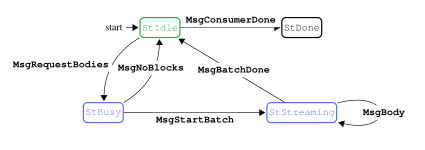

> Table: `Fetch` state agencies

| state         | agency   |
| ------------- | -------- |
| `StIdle`      | Consumer |
| `StBusy`      | Producer |
| `StStreaming` | Producer |

##### Protocol messages

- **`MsgRequestBodies`**`(request)`:  The consumer requests a sequence of bodies from the producer.
- **`MsgNoBlocks`**: The producer tells the consumer that it does not have all of the blocks in the requested sequence.
- **`MsgStartBatch`**: The producer starts body streaming.
- **`MsgBody`**`(body)`: Stream a single block’s body.
- **`MsgBatchDone`**: The producer ends block streaming.
- **`MsgConsumerDone`**: The consumer terminates the protocol.

> Table: `Fetch` mini-protocol messages

| from state    | message                | parameters | to state      |
| :------------ | :--------------------- | :--------- | :------------ |
| `StIdle`      | **`MsgConsumerDone`**  |            | `StDone`      |
| `StIdle`      | **`MsgRequestBodies`** | `request`  | `StBusy`      |
| `StBusy`      | **`MsgNoBlocks`**      |            | `StIdle`      |
| `StBusy`      | **`MsgStartBatch`**    |            | `StStreaming` |
| `StStreaming` | **`MsgBody`**          | `body`     | `StStreaming` |
| `StStreaming` | **`MsgBatchDone`**     |            | `StIdle`      |

##### Implementation

The high-level description of the Leios protocol specifies freshest-first delivery for IB bodies, to circumvent attacks where a large amount of old IBs gets released by an adversary. The mini protocol already takes a parameter that specifies which IBs are still new enough to be diffused, so older IBs are already deprioritized to only be accessible through the `CatchUp` protocol, and only if referenced by other blocks. Nevertheless consumers should take care to send approximately just enough body requests to utilize the available bandwidth, so that they have more choices, and more up to date information, when deciding which blocks to request from which peers.

####  `CatchUp` mini-protocol


The `CatchUp` mini protocol allows for nodes to obtain IB and EB blocks referenced by the chain. These will typically be too old to be diffused by the `Relay` and `Fetch` mini protocols, but are still relevant to reconstruct the ledger state. Additionally it covers certified EBs not yet in the chain but which are still recent enough for inclusion in a future ranking block, and any blocks they reference. 

> [!NOTE]
> Unless we specify recent certified EBs are to be offered through the `Relay` protocol still, in which case request 1.4.1 can be dropped.

This data, together with the base chain, is what is needed for a node to participate in future pipelines.

The protocol should allow the consumer to divide the requests between different producers, and for the producer to have an efficient way to retrieve the requested blocks. The consumer should be able to retrieve the base chain through the other mini protocols, and so the EB references within. However, the slots of those EBs are unknown, as well as any indirect references.

##### Requests

- *EBs by RB:* given an RB from its chain, the producer should reply with all EBs which are (i) transitively referenced by RBs in that range, (ii) not referenced by earlier RBs.
- *Recent certified EBs by range:* given a slot range, the producer should reply with all certified EBs which are (i) generated in the slot range, (ii) not referenced by RBs[^rb-referenced]. The start of the slot range should be no earlier than the oldest slot an EB could be generated in and still referenced in a future RB.
- *Certificate by EB:* given the of a certified EB not referenced by the chain, the producer should reply with a certificate for it. Needed for inclusion of the EB into a future RB produced by the consumer.
- *IBs by EB , and range:*  given a for a certified EB, the producer should reply with all the IBs which are (i) generated in the given slot range, (ii) directly referenced by the EB. The slot range allows for partitioning request about the same EB across different peers.

> [!NOTE]
> The IBs by EB point, and slot range request could be replaced by just a list of IB points, if IB references in EB bodies are augmented with the IB slot. Maybe size of request could become a consideration: by EB point and slot range the request size is 56 bytes for possibly all the referenced IBs at once, while by IB point the size is 40 bytes each, and there could be double digits of them. If expect to always fragment requests to just a few IBs at a time the difference is perhaps not important.

> [!NOTE]
> The EBs by RB range request could similarly be replaced by a list of EB points, if EB references in RBs and EBs are augmented with the EB slot. In this case, the consumer would be in charge of discovering needed referenced EBs as it fetches the ones it knows about.

##### Definition

The `CatchUp` protocol is defined as a new instance of the `Fetch` protocol. We give the parameters as a grammar

$$`
\begin{array}{l c l l}
\text{request}{}_{\text{CatchUp}{}} & ::= & \text{ebs-by-rb-range}(\text{range}{})\\
       & \mid  & \text{ebs-by-slot-range}(\text{slot}{},\text{slot}{})\\
       & \mid  & \text{ibs-by-eb-and-slot-range}(\text{point}{},(\text{slot}{},\text{slot}{}))\\
\text{body}{}_{\text{CatchUp}{}} & ::= & \text{ib-block}(\text{ib-header},\text{ib-body}) \\
        & \mid & \text{eb-block}(\text{eb-header}, \text{eb-body})\\
        & \mid & \text{eb-certificate}(\text{certificate})\\
\end{array}
`$$

alternatively there could be separate mini protocols for IB, EB, and Certificate `CatchUp`, so that there cannot be a format mismatch between requests and replies.

##### Implementation

To fulfill the higher-level freshest-first delivery goal, we might need to stipulate that producers should prioritize serving requests for the {IB,EB,Vote}- and {IB,EB}- mini protocols over requests for `CatchUp`.

## Haskell simulation realism

Most idealized setting for the simulation:

- Nodes request block bodies from every peer.
- Mini-protocols are each run on a dedicated connection.
- The network model is a simplified one where packets are sent in-order and limited only by latency and bandwidth.
- An unbounded number of CPU intensive tasks, like validation, are simulated to run in parallel.
- Delays and sizes for blocks are kept uniform.

Scenarios proceed from most idealized and gradually turn one more realism feature:

1. most idealized.
2. nodes request block bodies from first peer available.
3. mini-protocols are multiplexed over one connection.
4. network layer more closely models TCP, in particular acks and congestion window collapse/restart.
5. nodes simulate CPU tasks with a finite number of worker threads.
6. request IB bodies in oldest-first order.

> [!NOTE]
> move Scenario 6 out of ordered list and into a “variants” list

The last scenario is not strictly about realism, but we rather want to investigate the impact of deviating from the freshest-first default.

### Scenario 1

The least realistic scenario. Config:

```yaml
relay-strategy: "request-from-all"
tcp-congestion-control: false
multiplex-mini-protocols: false
treat-blocks-as-full: true
```

In the figure below we compute ideal times two ways:

- **ideal** – Uses 3 latencies for every communication.
- **ideal-fitted** – Uses 3 latencies for RB and EB, but 4 for IB
  and 3.5 for Votes.

we see that ideal-fitted better matches the simulation.

> Figure: Scenario 1 *baseline*, diffusion latencies from slot start (300s run with default seed).

|                                                                                                                              |                                                                                                                               |
| ---------------------------------------------------------------------------------------------------------------------------- | ----------------------------------------------------------------------------------------------------------------------------- |
| <br/>IB diffusion to 0.50 stake | 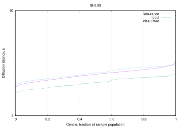<br/>IB diffusion to 0.98 stake |
| <br/>EB diffusion to 0.50 stake | 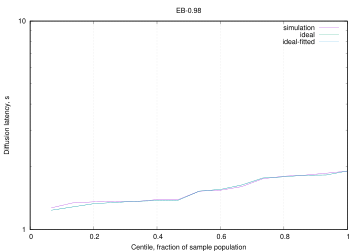<br/>EB diffusion to 0.98 stake |
| <br/>VT diffusion to 0.50 stake | 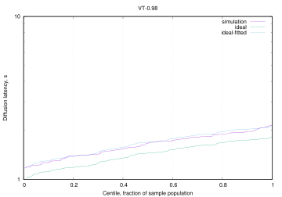<br/>VT diffusion to 0.98 stake |
| <br/>RB diffusion to 0.50 stake | 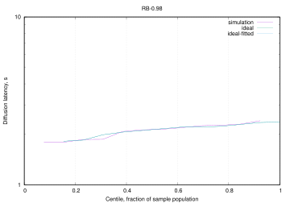<br/>RB diffusion to 0.98 stake |

The Relay mini-protocol involves the consumer first requesting new headers, so it can take 4 latencies to receive the body. When blocks are more sporadic, like for EBs and RBs, the consumer has likely already sent a blocking request for more headers, so 3 latencies are enough. Votes all get sent at the start of the slice, with default configuration at least, so we can expect consumers to reach the blocking stage again by the next burst. However, due to the large traffic, the 4 latencies path likely sees some use too. This mix of behaviours can explain the better fit using 3.5 latencies.

#### Uniform Voting stage

The diffusion latencies, in the figure below, stay very similar when the simulation is set to generate votes across the whole stage rather than only in the first slot. From second 80 to 300 we have ~1100 vote messages, for an average of ~5 VT/s, same as IBs. The traffic pattern then does not seem a factor in the observed behaviour.

> Figure: Scenario 1 with *uniform voting*, diffusion latencies from slot start (300s run with default seed).

|                                                                                                                              |                                                                                                                               |
| ---------------------------------------------------------------------------------------------------------------------------- | ----------------------------------------------------------------------------------------------------------------------------- |
| <br/>VT diffusion to 0.50 stake | <br/>VT diffusion to 0.98 stake |

#### Large votes

The diffusion latencies, in the next two figures, are collected for votes set to the size of input blocks. With start-of-stage voting (the default) we see diffusion running slightly slower than ideal with 4 latencies, while uniform voting has a very close fit. The delay in the former is possibly due to the ~0.05 seconds serialization time causing blocks to queue behind each other when they are all generated at once: the volume of data, $`102400 \times 100`$, is 5 times the bandwidth of any given link, and nodes are requesting bodies from everyone.

> Figure: Scenario 1 with *large votes and start-of-stage voting*, diffusion latencies from slot start (300s run with default seed).

|   |   |
|---|---|
| 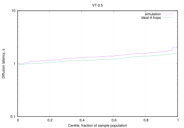<br/>VT diffusion to 0.50 stake | <br/>VT diffusion to 0.98 stake |

> Figure: Scenario 1 with *large votes and uniform voting*, diffusion latencies from slot start (300s run with default seed).

|   |   |
|---|---|
| <br/>VT diffusion to 0.50 stake | <br/>VT diffusion to 0.98 stake. |

### Scenario 2

> [!NOTE]
> compare to previous plot rather than ideal? Same for later sections.

Figure below illustrate the effect of nodes request block bodies from first peer available.

> Figure: Scenario 2, diffusion latencies from slot start (300s run with default seed).

|                                                                                                                               |                                                                                                                               |
| ----------------------------------------------------------------------------------------------------------------------------- | ----------------------------------------------------------------------------------------------------------------------------- |
| <br/>IB diffusion to 0.50 stake  | <br/>IB diffusion to 0.98 stake |
| <br/> EB diffusion to 0.50 stake | <br/>EB diffusion to 0.98 stake |
| 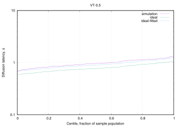<br/> VT diffusion to 0.50 stake | 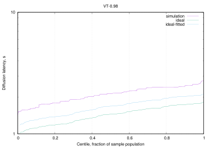<br/>VT diffusion to 0.98 stake |
| <br/>RB diffusion to 0.50 stake  | <br/>RB diffusion to 0.98 stake |

### Scenario 3

The figure below shows the result of multiplexing all the mini-protocols onto the same connection. We do not see a significant difference with Scenario 2.

Note that multiplexing in the simulation happens at the level of whole mini-protocol messages, without specific attempts to share the bandwidth fairly between them. This is not as realistic as breaking messages into same-size chunks and interleave those in a round-robin fashion.

> Figure: Scenario 3, diffusion latencies from slot start (300s run with default seed).

|                                                                                                                              |                                                                                                                               |
| ---------------------------------------------------------------------------------------------------------------------------- | ----------------------------------------------------------------------------------------------------------------------------- |
| <br/>IB diffusion to 0.50 stake | <br/>IB diffusion to 0.98 stake |
| 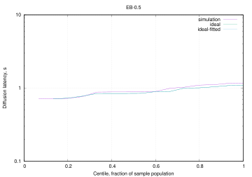<br/>EB diffusion to 0.50 stake | <br/>EB diffusion to 0.98 stake |
| <br/>VT diffusion to 0.50 stake | <br/>VT diffusion to 0.98 stake |
| <br/>RB diffusion to 0.50 stake | <br/>RB diffusion to 0.98 stake |

### Scenario 4

The figure below shows the introduction of the tcp congestion window having a quite dramatic effect on diffusion times.

> [!NOTE]
> do IBs which do not reference RBs do better?

> Figure: Scenario 4 *baseline*, diffusion latencies from slot start (300s run with default seed).

|                                                                                                                              |                                                                                                                               |
| ---------------------------------------------------------------------------------------------------------------------------- | ----------------------------------------------------------------------------------------------------------------------------- |
| <br/>IB diffusion to 0.50 stake | <br/>IB diffusion to 0.98 stake |
| <br/>EB diffusion to 0.50 stake | <br/>EB diffusion to 0.98 stake |
| <br/>VT diffusion to 0.50 stake | <br/>VT diffusion to 0.98 stake |
| <br/>RB diffusion to 0.50 stake | <br/>RB diffusion to 0.98 stake |

As the bounded CPU scenario does better (see next section), we want to rule out the unbounded cpu task handler as problematic, but bounding cpu in the figure below is no better. So it seems actually limiting parallelism is what improves diffusion.

> Figure: Scenario 4 *bounded cpu*, diffusion latencies from slot start (300s run with default seed).

|                                                                                                                                      |                                                                                                                                       |
| ------------------------------------------------------------------------------------------------------------------------------------ | ------------------------------------------------------------------------------------------------------------------------------------- |
| <br/>IB diffusion to 0.50 stake | <br/>IB diffusion to 0.98 stake |
| <br/>EB diffusion to 0.50 stake | <br/>EB diffusion to 0.98 stake |
| <br/>VT diffusion to 0.50 stake | <br/>VT diffusion to 0.98 stake |
| <br/>RB diffusion to 0.50 stake | <br/>RB diffusion to 0.98 stake |

From other simulations we noticed there is a sweet spot of traffic for diffusion to do best, which makes sense with regard to keeping the congestion window open without overwhelming other resources. In particular from the figure below we see IBs do slightly better with these parameters:

``` yaml
ib-body-avg-size-bytes: 163840
leios-stage-length-slots: 60
ib-generation-probability: 10
```

and a topology where link bandwidth is set to 1,024,000 bps, half of previous scenarios.

> Figure: Scenario 4 *best IB rate*, diffusion latencies from slot start (300s run with default seed).

|                                                                                                                                           |                                                                                                                                            |
| ----------------------------------------------------------------------------------------------------------------------------------------- | ------------------------------------------------------------------------------------------------------------------------------------------ |
| <br/>IB diffusion to 0.50 stake | <br/>IB diffusion to 0.98 stake |
| 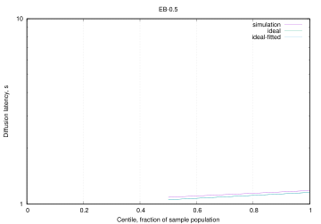<br/>EB diffusion to 0.50 stake | <br/>EB diffusion to 0.98 stake |
| <br/>VT diffusion to 0.50 stake | <br/>VT diffusion to 0.98 stake |
| <br/>RB diffusion to 0.50 stake | <br/>RB diffusion to 0.98 stake |

The next figure shows 15 IBs per slot, rather than the 10 of the previous figure, which flattens the curve even more, though we keep a substantial tail. On the other hand Vote diffusion is negatively affected, possibly crowded out by the IB volume.

> Figure: Scenario 4 *higher IB rate*, diffusion latencies from slot start (300s run with default seed).

|                                                                                                                                             |                                                                                                                                               |
| ------------------------------------------------------------------------------------------------------------------------------------------- | --------------------------------------------------------------------------------------------------------------------------------------------- |
| 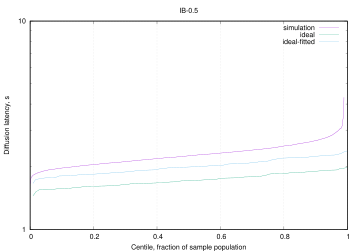<br/>IB diffusion to 0.50 stake | <br/>IB diffusion to 0.98 stake  |
| <br/>EB diffusion to 0.50 stake | <br/>EB diffusion to 0.98 stake  |
| <br/>VT diffusion to 0.50 stake | <br/>VT diffusion to 0.98 stake  |
| 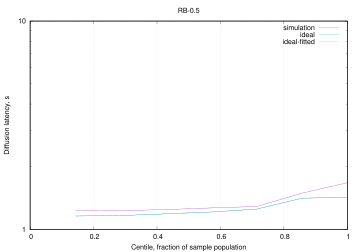<br/>RB diffusion to 0.50 stake | <br/> RB diffusion to 0.98 stake |

In the next figure we turn on uniform voting for the whole 60-second slot of the voting stage, which does appear to improve diffusion.

> Figure: Scenario 4 *higher IB rate with uniform voting*, diffusion latencies from slot start (300s run with default seed).

|                                                                                                                                                       |                                                                                                                                                        |
| ----------------------------------------------------------------------------------------------------------------------------------------------------- | ------------------------------------------------------------------------------------------------------------------------------------------------------ |
| <br/>IB diffusion to 0.50 stake | <br/>IB diffusion to 0.98 stake |
| 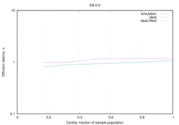<br/>EB diffusion to 0.50 stake | <br/>EB diffusion to 0.98 stake |
| <br/>VT diffusion to 0.50 stake | <br/>VT diffusion to 0.98 stake |
| 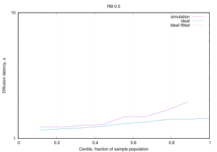<br/>RB diffusion to 0.50 stake | 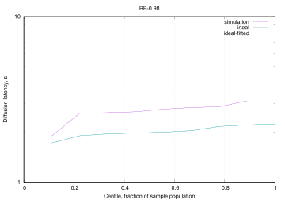<br/>RB diffusion to 0.98 stake |

In the next figure we bring stage length back to the default 20, and we see diffusion degrade again, though not to the original levels. About a tenth of IBs do not reach 0.98 stake distribution, and the curve flexes earlier than in the previous figure. Vote diffusion is also affected but not as much.

> Figure: Scenario 4 *higher IB rate with uniform voting and short stages*, diffusion latencies from slot start (300s run with default seed).

|                                                                                                                                                                   |                                                                                                                                                                    |
| ----------------------------------------------------------------------------------------------------------------------------------------------------------------- | ------------------------------------------------------------------------------------------------------------------------------------------------------------------ |
| <br/>IB diffusion to 0.50 stake | 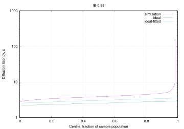<br/>IB diffusion to 0.98 stake |
| 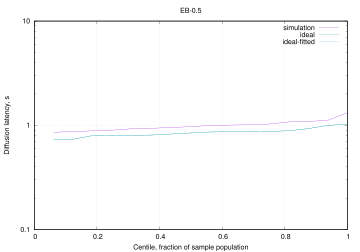<br/>EB diffusion to 0.50 stake | <br/>EB diffusion to 0.98 stake |
| <br/>VT diffusion to 0.50 stake | <br/>VT diffusion to 0.98 stake |
| <br/>RB diffusion to 0.50 stake | <br/>RB diffusion to 0.98 stake |

A possibility is that IBs are not fully diffusing because nodes are unable to reconstruct the ledger state to validate them in. In the next figure we try to see what happens when we require too many votes for EBs to certify, so the actual ledger state stays at Genesis. However IBs will still reference the most recent RB with a ledger state on the generating node, so other nodes will have to have adopted the same RB at some point.

> [!NOTE]
> try setting the reference RB as always Genesis

> Figure: Scenario 4 *higher IB rate with uniform voting and short stages but no certificate*, diffusion latencies from slot start (300s run with default seed).

|                                                                                                                                                                           |                                                                                                                                                                            |
| ------------------------------------------------------------------------------------------------------------------------------------------------------------------------- | -------------------------------------------------------------------------------------------------------------------------------------------------------------------------- |
| <br/>IB diffusion to 0.50 stake | <br/>IB diffusion to 0.98 stake |
| <br/>EB diffusion to 0.50 stake | <br/>EB diffusion to 0.98 stake |
| <br/>VT diffusion to 0.50 stake | 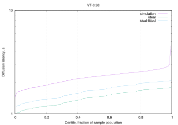<br/>VT diffusion to 0.98 stake |
| <br/>RB diffusion to 0.50 stake | <br/>RB diffusion to 0.98 stake |

Even with that caveat we see IB diffusion improve, getting quite close to the one with 60 slot stage length. Ledger state reconstruction does seem a significant factor, since when EBs are 3 times rarer (two figure previous), or here where they do not get certified, diffusion does better. Inspecting the logs we can further note that most IBs are validated immediately upon reception, meaning the ledger state was already available, and only a tiny fraction waits up to 3 seconds, meaning that the real impediment is that EBs can get certified even if a good percentage of nodes has not and will not validate some of the referenced IBs, because they lack the corresponding RB/ledger state.

> [!NOTE]
> Keep ledger-state only for the preferred chain


The next figure confirms the above with the bounded cpu worker pool, with a much larger than needed bound.

> Figure: Scenario 4 *higher IB rate with uniform voting, short stages, no certificate, and bounded CPU*, diffusion latencies from slot start (300s run with default seed).

|                                                                                                                                                                                   |                                                                                                                                                                                    |
| --------------------------------------------------------------------------------------------------------------------------------------------------------------------------------- | ---------------------------------------------------------------------------------------------------------------------------------------------------------------------------------- |
| <br/>IB diffusion to 0.50 stake | <br/>IB diffusion to 0.98 stake |
| <br/>EB diffusion to 0.50 stake | <br/>EB diffusion to 0.98 stake |
| <br/>VT diffusion to 0.50 stake | <br/>VT diffusion to 0.98 stake |
| <br/>RB diffusion to 0.50 stake | <br/>RB diffusion to 0.98 stake |

In the next figure we show that shorter stage length (20 slots) negatively affects even the case with 10 IBs per slot, even when we try to compensate with a shorter validation time.

> Figure: Scenario 4, *shorter stage length* diffusion latencies from slot start (300s run with default seed).

|                                                                                                                                                 |                                                                                                                                                  |
| ----------------------------------------------------------------------------------------------------------------------------------------------- | ------------------------------------------------------------------------------------------------------------------------------------------------ |
| <br/>IB diffusion to 0.50 stake | <br/>IB diffusion to 0.98 stake |
| 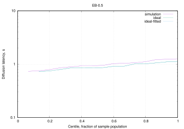<br/>EB diffusion to 0.50 stake | <br/>EB diffusion to 0.98 stake |
| <br/>VT diffusion to 0.50 stake | <br/>VT diffusion to 0.98 stake |
| <br/>RB diffusion to 0.50 stake | 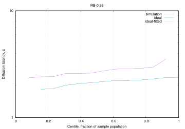<br/>RB diffusion to 0.98 stake |

In the next figure we see that 15 IB per second do not diffuse quite as well when they are only 96 kB, even with stage length of 60.

> Figure: Scenario 4 *small IBs*, diffusion latencies from slot start (300s run with default seed).

|                                                                                                                                         |                                                                                                                                          |
| --------------------------------------------------------------------------------------------------------------------------------------- | ---------------------------------------------------------------------------------------------------------------------------------------- |
| 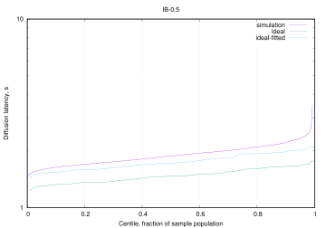<br/>IB diffusion to 0.50 stake | <br/>IB diffusion to 0.98 stake |
| <br/>EB diffusion to 0.50 stake | <br/>EB diffusion to 0.98 stake |
| 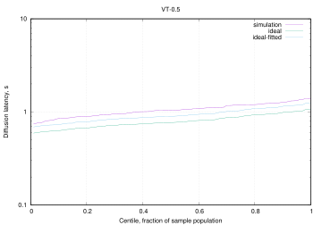<br/>VT diffusion to 0.50 stake | 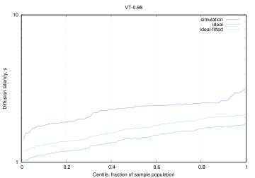<br/>VT diffusion to 0.98 stake |
| <br/>RB diffusion to 0.50 stake | <br/>RB diffusion to 0.98 stake |
### Scenario 5

As mentioned before, we see in the next figure that just using 5 cores per node, instead of unbounded, improves diffusion by a good amount, without need for higher traffic. Presumably the limits on CPU make it so traffic is more spread out and keeps the tcp window open.

> Figure: Scenario 5 *baseline*, diffusion latencies from slot start (300s run with default seed).

|   |   |
|---|---|
| <br/>IB diffusion to 0.50 stake | <br/>IB diffusion to 0.98 stake |
| <br/>EB diffusion to 0.50 stake | <br/>EB diffusion to 0.98 stake |
| <br/>VT diffusion to 0.50 stake | <br/>VT diffusion to 0.98 stake |
| <br/>RB diffusion to 0.50 stake | <br/>RB diffusion to 0.98 stake |

> [!NOTE]
> try the higher traffic variations above, the sweet spot presumably shifted

In the next figure we show results for 10 cpu cores per node. Here we see all IBs making it to 0.98 stake diffusion.

> Figure: Scenario 5 *with bounded CPU*, diffusion latencies from slot start (300s run with default seed).

|   |   |
|---|---|
| <br/>IB diffusion to 0.50 stake | <br/>IB diffusion to 0.98 stake |
| <br/>EB diffusion to 0.50 stake | <br/>EB diffusion to 0.98 stake |
| <br/>VT diffusion to 0.50 stake | <br/>VT diffusion to 0.98 stake |
| <br/>RB diffusion to 0.50 stake | 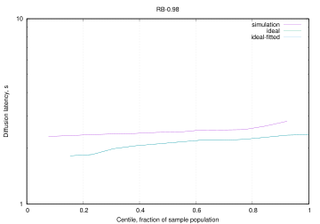<br/>RB diffusion to 0.98 stake |

### Scenario 6

The next figure shows the effect of oldest-first diffusion for IBs, which is null with these parameters. Trace debugging shows most of the time there is only one available body to request.

> Figure: Scenario 6 *baseline*, diffusion latencies from slot start (300s run with default seed).

|   |   |
|---|---|
| <br/>IB diffusion to 0.50 stake | <br/>IB diffusion to 0.98 stake |
| <br/>EB diffusion to 0.50 stake | <br/>EB diffusion to 0.98 stake |
| 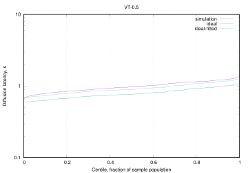<br/>VT diffusion to 0.50 stake | <br/>VT diffusion to 0.98 stake |
| 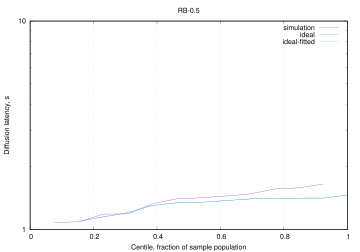<br/>RB diffusion to 0.50 stake | <br/>RB diffusion to 0.98 stake |

> [!NOTE]
> try with higher traffic

As we will be mostly looking at IB diffusion, the next figure shows adoption for only IBs but for more stake fractions.

> Figure: Scenario 6 *IB adoption*, diffusion latencies from slot start (300s run with default seed).

|                                                                                                       |                                                                                                        |
| ----------------------------------------------------------------------------------------------------- | ------------------------------------------------------------------------------------------------------ |
| <br/>IB diffusion to 0.50 stake | <br/>IB diffusion to 0.60 stake  |
| <br/>IB diffusion to 0.70 stake | 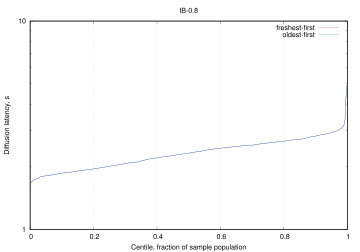<br/>IB diffusion to 0.80 stake  |
| 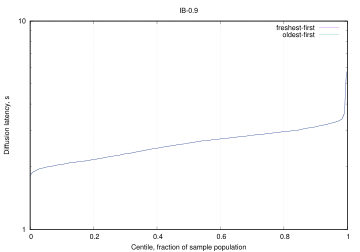<br/>IB diffusion to 0.90 stake | <br/>IB diffusion to 0.98 stake |

The next figure shows same comparison but with 10 cpus per node. Diffusion for the 0.98 stake fraction improves, but we still see no differences between the diffusion strategies.

> Figure: Scenario 6 *IB adoption with bounded CPU*, diffusion latencies from slot start (300s run with default seed).

|     |     |
| --- | --- |
| 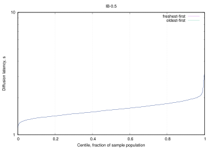<br/>IB diffusion to 0.50 stake | <br/>IB diffusion to 0.60 stake |
| <br/>IB diffusion to 0.70 stake | <br/>IB diffusion to 0.80 stake |
| 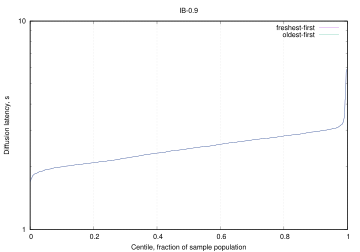<br/>IB diffusion to 0.90 stake | 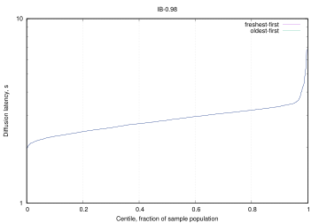<br/>IB diffusion to 0.98 stake |

## Notes on the Leios attack surface

This discussion extends the section [Threat Model](./technical-report-1.md#threat-model) of the [Leios Technical Report #1](./technical-report-1.md).

### Terminology and notes

- The *IB-concurrency period* is the time duration when nodes haven't seen newly created IBs from other honest nodes.
- Two transactions are *in conflict* if they spend any UTxOs in common. Among a set of valid transactions that attempt to spend a particular UTxO, only one of them can be *successfully executed* and the remainder are *unexecuted*, though (depending upon the ledger rules of the particular Leios variant) their collateral may be consumed if they become referenced by the Praos ranking block. Unexecuted conflicts waste network resources, CPU, and memory of nodes. If they reach the ledger, they also waste permanent storage.
- Leios variants may institute *tombstoning* of unexecuted transactions that must be stored permanently due to their presence in IBs that are indirectly referenced by RBs of the main chain. When stored permanently, a tombstoned transaction might not contain all of the data of the original full transaction: depending upon the Leios variant and the cryptographic scheme used, the tombstoned transaction might be a simple as just the hash of the original transaction or that hash and information about the collateral spent. Tombstoning of duplicate transactions is trivial, but tombstoning of unexecuted conflicting transactions requires cryptographic sophistication and/or voting.
- A smart contract at times have either *open* or *closed* participation. When a contract is open more than one party might be eligible to submit a transactions, but when it is closed only a specific party can submit a transaction. Auctions, lotteries, and liquidity pools typically are open contracts, though these could be formulated as hybrids. A zero-coupon bond or a European option might be a closed contract. Simple scripts could be open or closed. Transactions constructed by a single wallet and that do not spend from smart contracts could be considered closed because (presumably) only one party has the private keys necessary to spend the UTxOs. The distinction between open and closed UTxOs is important because the spender of a closed UTxO would typically have enough control of the situation that they could avoid creating a transaction that might conflict with others. Conversely, a spender of an open UTxO (in a script or smart contract) might not have sufficient information or control to avoid submitting a transaction that conflicts with transactions other users are submitting and which spend the same open UTxO.
- *Equivocation* is when a block producer (IB, EB, or RB) or voter produces more than their entitled number of blocks or votes. For example, local sortition may entitle a node to produce one IB in a particular slot, but the node actually produces two different IBs in that slot and diffuses them to different downstream nodes: separately each IB is valid, but together they are not, so nodes will only adopt the IB that they receive first. The Leios protocol specifies that both the first block received and the first equivocation received both are diffused.
- *Throughput loss* is when the overall capacity for non-conflicted transactions is reduced from the theoretical capability. Throughput is not considered lost if it is delayed and non-conflicted transactions originating from an adversary are not distinguished from those originating from honest parties. If an adversary pays for throughput, that throughput is not considered lost.
- *Latency loss* is when there is an increase in the the average time from a transaction's acceptance in the memory pool to it recording on the ledger.
- *Front running* iFront-running occurs when a party submits a transaction after observing conflicting transactions in Input Blocks (IBs) or Endorser Blocks (EBs). If the newly submitted transaction is successful while the previously observed transaction(s) fail, the submitting party may gain an opportunity to extract value—for example, from decentralized exchanges (DEXes), liquidity pools, or oracle-sensitive dApps.
- IB or EB *expiration* occurs when the block is not referenced by an EB or RB, respectively, before a timeout specified by the relevant Leios protocol parameter. Such expired blocks will never be included in the ledger.
- *Grinding* occurs when an adversary attempts to manipulate VRF values in their favor using a trial-and-error process of crafting the entropy input into the VRF. See [CPS-21 "Ouroboros Randomness Manipulation"](https://cips.cardano.org/cps/CPS-0021) for details.

### Taxonomy of negative impacts

The security-related impacts of adversarial behavior upon Leios fall into three general categories. Note that quality of service (QoS) issues such as front-running are not considered to be attacks on the protocol itself and are not included in this section.

- *Wasted of resources:* An attack may waste computation resources without impacting throughput or latency.
	- *CPU:* Most attack involve extra computation in the form of validation of transactions, IB, EB, or certificates. Leios nodes would be sized for peak capacity, so this wasted CPU does not translate into extra cloud-hosting costs.
	- *Memory:* Because of capacity limits in the protocol and backpressure in its implementation, attacks general would not impact memory usage in a significant manner. Leios nodes would be sized for peak capacity, so this wasted memory does not translate into extra cloud-hosting costs.
	- *Disk:* Any conflicted transactions that reach the ledger will have to be stored permanently in persistent storage so that the blockchain can be replayed from genesis. Tombstoning and compression techniques might reduce the amount of storage relative to the original size of conflicted transactions. Persistent storage incurs significant cost in most cloud-pricing schemes.
	- *Network:* Transmission of conflicted transactions or IBs containing such transactions increases network usage. At high throughput this can have significant cost in some cloud-pricing schemes.
- *Lowered throughput:* In addition to wasting infrastructure resources, attacks that generate conflicts and duplicates lower overall Leios throughput.
- *Increased latency:* Attacks that involve omissions or that cause voting failures generally do not decrease Leios throughput since Full Leios has "catch up" provisions for recovery. Those do, however, delay the arrival of transactions into the ledger.

### Specific attacks

*Memory pool attacks:* Just as in Praos, an adversary with sufficient network resources and high enough connectivity to other nodes can attempt to fragment the global memory pool by communicating different sets of transactions to different nodes. The extent to which they can accomplish this depends upon their resources (infrastructure and ada), the connectivity of the other nodes, and the sizes of their local memory pools. (Recall that local memory pools are of fixed size and nodes apply backpressure to clients when their local memory pool is full.) Unique to Leios is the situation where the local memory pools may contain mutually conflicting transactions, in which case there is a probability that honest nodes will create IBs with conflicting transactions during the IB-concurrency period.  An adversary could either craft their own mutually conflicting transactions or create transactions in conflict with honest ones in the memory pool if those honest transactions have open enough participation that third parties can create conflicting ones.

*Equivocation attacks:* When block producers or voters produce equivocated blocks/votes, this creates extra network traffic within the network. Depending upon the proportions of equivocated blocks received by other nodes, at most one of the equivocated blocks could eventually be voted upon and there is a chance that neither would. The Leios protocol mitigates this attack so that slight waste of network resources and the chance of EB non-inclusion are the worst-case impacts.

*IB conflict attacks:* An IB producer can craft the contents of their new IBs to contain transactions in conflict with other transactions that they know to be in the memory pool or that they have seen within other IBs in flight. The adversarial IB producer can delay their production of the IB for several slots (up to approximately one stage length), until they see IBs created by other nodes in subsequent slots: optimally, they would release their "back-dated" IB after they have seen transactions in the IBs for a few subsequent slots, given them information to retrospectively create conflicting transactions. (The conflicts could be against honest *open* transactions or against transactions submitted by the adversary.) The strength of this attack is proportional to the adversary's stake and generally requires expending some ada in the form of lost collateral. The attack has the same impact as the conflicting transactions resulting from the memory pool attack: bandwidth, CPU, and potentially disk.

*Omission attacks:* Choosing not to build an IB, EB, or RB trivially increases the latency of Leios. Not voting trivially increases the probability of not being able to certify an EB for inclusion in an RB, similarly increasing latency. In these cases the strength of the adversary is proportional to their stake. If an omission attack is sustained so long that IBs and/or EBs expire, then a loss of throughput would also occur.

*Front-running:* Regardless of the specific ordering of transactions required by the Ledger rules of the particular Leios variant, the overlap of pipelines and the potential opportunity to include transactions in RBs opens the possibility of front running transactions. Although front-running is primarily a quality of service (QoS) consideration, it can also be used to provoke conflicts that consume resources and lower throughput.

*Denial of service on FA voting:* The Fait Accompli algorithm for voter sortition publicly reveals the high-stake nodes who will be voters in every election during an epoch. Traditional network denial of service attacks might be mounted against them if they IP addresses can be determined by an adversary. The success of such attacks depends upon the target node's network infrastructure and firewall defenses and could result the node not disseminating its vote in the time frame required by a protocol. If sufficient voting nodes were attacked, then no EB would be certified in the pipeline and a loss of latency would result.

*Late release attacks:* If the Leios variant in question has sharp cutoff criteria for whether an IB or EB is received to late to be considered valid in the current pipeline, then an attacker (especially a block producer) could try to diffuse the block almost as late as possible, so that some nodes receive it before the cutoff and others receive it after the cutoff. This would create disagreement regarding what blocks are valid for the pipeline and could prevent a quorum of voters to agree on an EB to certify. Because the block could be included in a later pipeline, this attack would only result in a loss of latency.

*Grinding attacks:* As in Praos, adversaries may attempt to manipulate the randomness of the VRF function used to determine who produces IBs, EBs, and/or votes.

### Recommendations

1. Perform theoretical analysis and simulation experiments to estimate how fragmented the global memory pool can become, as a function of adversarial resources.
2. Perform simulation experiments to measure the resource and voting impact of equivocated IBs, EBs, and votes.
3. Analytically compute probabilities of conflict attacks succeeding, as a function of adversarial stake, and compare to simulation results.

## Footnotes

[^network-spec]: <https://ouroboros-network.cardano.intersectmbo.org/pdfs/network-spec/network-spec.pdf#chapter.3>

[^network-split]: at the network layer we split an endorse block into header and body, where the latter contains the references to other blocks

[^eb-ib-relayed]: older EBs and IBs referenced by the blockchain can be accessed from the mini protocol

[^subslot]: for IBs/EBs also its subslot, in case generation frequency is greater than $`1/\text{slot}`$.

[^rb-referenced]: Restriction (ii) is to avoid overlap with an RB range query, but could be dropped to save on complexity if not worth the saved bandwidth
