# Leios technical report #2

> [!IMPORTANT]
>
> Information in this report is superceded by the [Leios CIP](https://github.com/cardano-foundation/CIPs/pull/1078).

## Executive summary

This report captures a snapshot of the modeling, simulation, and analysis of the
Leios protocol from March to August 2025, approximately. Given that the Leios protocol
design was still evolving, the observations, findings, and conclusions documented
here are provisional and subject to future revision and contradiction. The
report digs into the following topics:

- Network protocols
- Threat model
- Simulation experiments
- Test network topologies
- Empirical measurements of the Cardano network and blockchain
- Analytic studies of Leios behavior and performance
- Miscellaneous observations and links to other technical documents

Results so far indicate that the Linear Leios variant of the protocol can achieve cost-effective throughput at
100 TPS of historical typical transactions but near 1000 TPS of small (non-Plutus) transactions.

<details>
  <summary><h2>Table of contents</h2></summary>

- [Executive summary](#executive-summary)
- [Introduction](#introduction)
    - [Purpose](#purpose)
    - [Scope](#scope)
    - [Context](#context)
    - [Audience](#audience)
- [Network specification](#network-specification)
    - [Mini protocols](#mini-protocols)
- [Haskell simulation realism](#haskell-simulation-realism)
    - [Scenario 1](#scenario-1)
    - [Scenario 2](#scenario-2)
    - [Scenario 3](#scenario-3)
    - [Scenario 4](#scenario-4)
    - [Scenario 5](#scenario-5)
    - [Scenario 6](#scenario-6)
- [Notes on the Leios attack surface](#notes-on-the-leios-attack-surface)
    - [Terminology and notes](#terminology-and-notes)
    - [Taxonomy of negative impacts](#taxonomy-of-negative-impacts)
    - [Specific attacks](#specific-attacks)
    - [Recommendations](#recommendations)
- [Simlation experiments](#simulation-experiments)
- [Test networks](#test-networks)
    - [Pseudo-mainnet](#pseudo-mainnet)
    - [Mini-mainnet](#mini-mainnet)
- [Empirical data](#empirical-data)
    - [Inter-datacenter bandwidth measurements](#inter-datacenter-bandwidth-measurements)
    - [Internet latencies](#internet-latencies)
    - [Analysis of diffusion of empty blocks on Cardano mainnet](#analysis-of-diffusion-of-empty-blocks-on-cardano-mainnet)
    - [Analysis of block and transaction validation times](#analysis-of-block-and-transaction-validation-times)
- [Analytic studies](#analytic-studies)
    - [Throughput efficiency of Linear Leios](#throughput-efficiency-of-linear-leios)
    - [Performance analysis of sharding](#performance-analysis-of-sharding)
    - [Overcollateralization scheme](#overcollateralization-scheme)
    - [Expected transaction lifecycle](#expected-transaction-lifecycle)
    - [Leios profitability](#leios-profitability)
    - [Forecast of mainnet rewards](#forecast-of-mainnet-rewards)
- [Miscellaneous observations](#miscellaneous-observations)
    - [Conflicts, ledger, and incentives](#conflicts-ledger-and-incentives)
    - [Catalog of possible conformance tests](#catalog-of-possible-conformance-tests)
- [Other resources](#other-resources)
    - [First technical report](./technical-report-1.md)
    - [Threat model](./threat-model.md)
    - [Cost estimate](./cost-estimate/README.md)
    - [Draft CIP](./cip/README.md)

</details>

## Introduction

The Leios protocol represents a significant advancement in blockchain
technology, building upon the foundations of the Ouroboros consensus protocol.
This technical report aims to provide analytic support for the refinement of the Leios protocol's design.

### Purpose

The primary purpose of this report is to document the technical specifications
and economic implications of the Leios protocol. It serves as a resource for
developers, researchers, and stakeholders interested in understanding the
intricacies of Leios and its role within the broader Cardano network.

### Scope

This report covers various aspects of the Leios protocol, including its network
specifications, analytic studies, simulation results, economic analysis, and threat model.

### Context

Leios is designed to enhance the scalability and efficiency of the Cardano
blockchain by introducing innovative mechanisms for block production and
validation. By leveraging probabilistic sortition and advanced cryptographic
techniques, Leios aims to achieve high throughput and low latency while
maintaining robust security guarantees.

### Audience

This report is intended for a technical audience, including blockchain
developers, researchers, and Cardano stakeholders. It assumes a foundational
understanding of blockchain concepts and the Cardano ecosystem.

## Network Specification

Ouroboros Leios introduces new types of blocks with novel diffusion patterns and requirements. In this document we provide a technical specification of mini protocols for the on-the-fly relay of recent blocks and for the availability of older blocks referenced by the blockchain.

### Mini protocols

For background information on mini protocols see sections 3.1-3.4 of the *Ouroboros Network Specification*[^network-spec], and rest of that chapter for the mini protocols already in use. Here we will present the additional node-to-node mini protocols needed for Leios.

#### `Relay` mini-protocol

The `Relay` protocol presented here is a generalization of the tx submission protocol used to transfer transactions between full nodes. We will use the term *datum* as a generic term for the payloads being diffused, which we expect to be generally small: transactions, input block headers, endorse block headers[^network-split], vote bundles for a single pipeline and voter.

The protocol follows a pull-based strategy where the consumer asks for new ids/datums and the producer sends them back. It is designed to be suitable for a trustless setting where both sides need to guard against resource consumption attacks from the other side.

##### Options and parameters

A instance is specified by these options and parameters.

- `BoundedWindow`: The peers manage a bounded window (i.e. FIFO queue) of datums available to be requested. Useful for datums that are otherwise unbounded in number.
- `Announcements`: Producers provide additional announcements about datums, when available.
- `id`: Identifier for a datum to be relayed, used when requesting the datum.
- `info`: Extra information provided with a new `id`.
- `datum`: The datum itself.
* `Ann. Condition` ("if" announcements): Condition for announcement.
* `ann` ("if" announcements): Announcement representation.

##### Instances

`Relay` protocol instances are listed in the table below. Tx-submission is further parameterized by the maximum window size allowed. IB-relay, EB-relay, and Vote-relay are each parametrized by the maximum age beyond which a datum is no longer relayed[^eb-ib-relayed]. IB-relay and EB-relay rely on to let consumers know when block bodies are available as well. Consumers request IB and EB bodies through the corresponding mini protocol. For EB-relay we specify the to be eb-header, by which we mean the constant size part of an Endorse block, while the references (to IBs and EBs) are considered the body.

> [!NOTE]
> For IB, EB, and Vote the info could actually be unit as we do not need to apply prioritization to headers. How- ever the slot might provide useful filtering, such as avoid downloading any more votes of a pipeline once we have a certificate for a seen EB

> Table: `Relay` mini-protocol instances.

| `instance`    | `BoundedWindow` | `Announcements` | `id` | `info` | `datum`     | `Ann. Condition` | `ann` |
| :------------ | :-------------- | :-------------- | :--- | :----- | :---------- | :--------------- | :---- |
| Tx-submission | Yes             | No              | txid | size   | tx          | N/A              | N/A   |
| IB-relay      | No              | Yes             | hash | slot   | ib-header   | body available   | unit  |
| EB-relay      | No              | Yes             | hash | slot   | eb-header   | body available   | unit  |
| Vote-relay    | No              | No              | hash | slot   | vote-bundle | N/A              | N/A   |

##### State machine

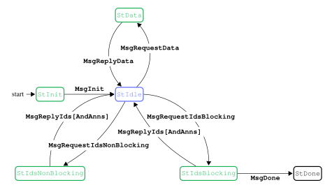

###### Grammar

$$`
\begin{array}{l c l l}
\text{ack}{} & ::= & \text{number} & \text{if}\,\text{BoundedWindow}{}\\
       & |  & \text{unit} & \text{otherwise}\\
\text{req}{} & ::= & \text{number} \\
\end{array}
`$$

> Table: Relay state agencies

| state              | agency   |
| ------------------ | -------- |
| `StInit`           | Producer |
| `StIdle`           | Consumer |
| `StIdsBlocking`    | Producer |
| `StIdsNonBlocking` | Producer |
| `StData`           | Producer |

##### Protocol messages

- **`MsgInit`**: initial message of the protocol
- **`MsgRequestIdsNonBlocking`**`(ack,req)`: The consumer asks for new ids and acknowledges old ids. The producer replies immediately, possibly with an empty reply if nothing new is available.
- **`MsgRequestIdsBlocking`**`(ack, req)`:  Same as `MsgRequestIdsNonBlocking` but the producer will block until the reply will be non-empty.
- **`MsgReplyIds`**`([(id, info])`:  The producer replies with a list of available datums. The list contains pairs of ids and corresponding information about the identified datum. In the blocking case the reply is guaranteed to contain at least one id. In the non-blocking case, the reply may contain an empty list.
- **`MsgReplyIdsAndAnns`**`([id, info], [(id, ann)])`:  (Requires Announcements) Same as `MsgReplyIds` but additionally the producer might, at most once, also provide an announcement for any id it has sent, in this message or previously.
- **`MsgRequestData`**`([id])`:  The consumer requests datums by sending a list of ids.
- **`MsgReplyData`**`([datum])`:  The producer replies with a list of the requested datums, some may be missing if no longer available for relay.
- **`MsgDone`**  The producer terminates the mini protocol.

> Table: mini-protocol messages

| from state         | message                        | parameters                  | to state           |
| :----------------- | :----------------------------- | :-------------------------- | :----------------- |
| `StInit`           | **`MsgInit`**                  |                             | `StIdle`           |
| `StIdle`           | **`MsgRequestIdsBlocking`**    | `ack, req`                  | `StIdsBlocking`    |
| `StIdsBlocking`    | **`MsgReplyIds`**              | `[(id, info)]`              | `StIdle`           |
| `StIdle`           | **`MsgRequestIdsNonBlocking`** | `ack, req`                  | `StIdsNonBlocking` |
| `StIdsNonBlocking` | **`MsgReplyIds`**              | `[(id, info)]`              | `StIdle`           |
| `StIdle`           | **`MsgRequestData`**           | `[id]`                      | `StData`           |
| `StData`           | **`MsgReplyData`**             | `[datum]`                   | `StIdle`           |
| `StIdsBlocking`    | **`MsgDone`**                  |                             | `StDone`           |
|                    |                                |                             |                    |
| `StIdsBlocking`    | **`MsgReplyIdsAndAnns`**\*     | `[(id, info)], [(id, ann)]` | `StIdle`           |
| `StIdsNonBlocking` | **`MsgReplyIdsAndAnns`**\*     | `[(id, info)], [(id, ann)]` | `StIdle`           |
\* If Announcements is set, **`MsgReplyIds`** messages are replaced with **`MsgReplyIdsAndAnns`**:

##### Producer and consumer implementation

The protocol has two design goals: It must diffuse datums with high efficiency and, at the same time, it must rule out asymmetric resource attacks from the consumer against the provider.

The protocol is based on two pull-based operations. The consumer can ask for a number of ids and it can use these ids to request a batch of datums. The consumer has flexibility in the number of ids it requests, whether to actually download the datum of a given id and flexibility in how it batches the download of datums. The consumer can also switch between requesting ids and downloading datums at any time. The protocol supports blocking and non-blocking requests for new ids. The producer must reply immediately (i.e. within a small timeout) to a non-blocking request. It replies with not more than the requested number of ids (possibly with an empty list). A blocking request on the other hand, waits until at least one datum is available.

It must however observe several constraints that are necessary for a memory efficient implementation of the provider.

###### With `BoundedWindow`

Conceptually, the provider maintains a limited size FIFO of outstanding transactions per consumer. (The actual implementation can of course use the data structure that works best). The maximum FIFO size is a protocol parameter. The protocol guarantees that, at any time, the consumer and producer agree on the current size of that FIFO and on the outstanding transaction ids. The consumer can use a variety of heuristics for requesting transaction ids and transactions. One possible implementation for a consumer is to maintain a FIFO which mirrors the producer’s FIFO but only contains the and pairs and not the . After the consumer requests new ids, the provider replies with a list of ids and puts these datums in its FIFO. If the FIFO is empty the consumer must use a blocking request otherwise a non-blocking request. As part of a request a consumer also acknowledges the number of old datums, which are removed from the FIFO at the same time. The provider checks that the size of the FIFO, i.e. the number of outstanding datums, never exceeds the protocol limit and aborts the connection if a request violates the limit. The consumer can request any batch of datums from the current FIFO in any order. Note however, that the reply will omit any datums that have become invalid in the meantime. (More precisely the producer will omit invalid datums from the reply but they will still be counted in the FIFO size and they still require an acknowledgement from the consumer).

###### `Without BoundedWindow`

A mini protocol instance that does not make use of `BoundedWindow` will want to rely on other ways to bound the amount of datums that can be requested at a given time. The consumer shall request ids in a blocking way when it does not intend on requesting any of the available datums.

###### Equivocation handling

IB-relay, EB-relay, and Vote-relay must guard against the possibility of equivocations, i.e. the reuse of a generation opportunity for multiple different blocks. The *message identifier* of an header is the pair of its generating node id and the slot it was generated for[^subslot]. Two headers with the same message identifier constitute a *proof of equivocation*, and the first header received with a given message identifier is the *preferred header*. For headers with the same message identifier, only the first two should be relayed, furthermore only the body of the preferred header should be fetched.

#### `Fetch` mini-protocol

The `Fetch` mini protocol enables a node to download block bodies. It is a generalization of the `BlockFetch` mini protocol used for base blocks: IBs and EBs do not have a notion of range, so they are requested by individual identifiers.

> [!NOTE]
> Generalizing from BlockFetch means we deliver bodies in a streaming fashion, is that appropriate for IBs and EBs?

##### Parameters

A instance is specified by these parameters

- *request:*  request format for a sequence of blocks.
- *body:* Block body itself.

##### Instances

`Fetch` instances are listed in Table below. The descriptions included here are for illustration, in particular to clarify what we mean by of an Endorse block. A is a pair of and , the allows for better indexing. A is a pair of two of $\text{point}{} \mid \text{origin}$. The IB-fetch and EB-fetch instances are intended for on-the-fly block diffusion, complementing the corresponding mini protocols.

> Table: `Fetch` mini-protocol instances

| instance   | request   | body                 |
| :--------- | :-------- | :------------------- |
| IB-fetch   | `[point]` | `[Tx]`               |
| EB-fetch   | `[point]` | `([IBRef], [EBRef])` |
| BlockFetch | `range`   | `RB body`            |

##### State machine


> Table: `Fetch` state agencies

| state         | agency   |
| ------------- | -------- |
| `StIdle`      | Consumer |
| `StBusy`      | Producer |
| `StStreaming` | Producer |

##### Protocol messages

- **`MsgRequestBodies`**`(request)`:  The consumer requests a sequence of bodies from the producer.
- **`MsgNoBlocks`**: The producer tells the consumer that it does not have all of the blocks in the requested sequence.
- **`MsgStartBatch`**: The producer starts body streaming.
- **`MsgBody`**`(body)`: Stream a single block’s body.
- **`MsgBatchDone`**: The producer ends block streaming.
- **`MsgConsumerDone`**: The consumer terminates the protocol.

> Table: `Fetch` mini-protocol messages

| from state    | message                | parameters | to state      |
| :------------ | :--------------------- | :--------- | :------------ |
| `StIdle`      | **`MsgConsumerDone`**  |            | `StDone`      |
| `StIdle`      | **`MsgRequestBodies`** | `request`  | `StBusy`      |
| `StBusy`      | **`MsgNoBlocks`**      |            | `StIdle`      |
| `StBusy`      | **`MsgStartBatch`**    |            | `StStreaming` |
| `StStreaming` | **`MsgBody`**          | `body`     | `StStreaming` |
| `StStreaming` | **`MsgBatchDone`**     |            | `StIdle`      |

##### Implementation

The high-level description of the Leios protocol specifies freshest-first delivery for IB bodies, to circumvent attacks where a large amount of old IBs gets released by an adversary. The mini protocol already takes a parameter that specifies which IBs are still new enough to be diffused, so older IBs are already deprioritized to only be accessible through the `CatchUp` protocol, and only if referenced by other blocks. Nevertheless consumers should take care to send approximately just enough body requests to utilize the available bandwidth, so that they have more choices, and more up to date information, when deciding which blocks to request from which peers.

####  `CatchUp` mini-protocol

The `CatchUp` mini protocol allows for nodes to obtain IB and EB blocks referenced by the chain. These will typically be too old to be diffused by the `Relay` and `Fetch` mini protocols, but are still relevant to reconstruct the ledger state. Additionally it covers certified EBs not yet in the chain but which are still recent enough for inclusion in a future ranking block, and any blocks they reference. 

> [!NOTE]
> Unless we specify recent certified EBs are to be offered through the `Relay` protocol still, in which case request 1.4.1 can be dropped.

This data, together with the base chain, is what is needed for a node to participate in future pipelines.

The protocol should allow the consumer to divide the requests between different producers, and for the producer to have an efficient way to retrieve the requested blocks. The consumer should be able to retrieve the base chain through the other mini protocols, and so the EB references within. However, the slots of those EBs are unknown, as well as any indirect references.

##### Requests

- *EBs by RB:* given an RB from its chain, the producer should reply with all EBs which are (i) transitively referenced by RBs in that range, (ii) not referenced by earlier RBs.
- *Recent certified EBs by range:* given a slot range, the producer should reply with all certified EBs which are (i) generated in the slot range, (ii) not referenced by RBs[^rb-referenced]. The start of the slot range should be no earlier than the oldest slot an EB could be generated in and still referenced in a future RB.
- *Certificate by EB:* given the of a certified EB not referenced by the chain, the producer should reply with a certificate for it. Needed for inclusion of the EB into a future RB produced by the consumer.
- *IBs by EB , and range:*  given a for a certified EB, the producer should reply with all the IBs which are (i) generated in the given slot range, (ii) directly referenced by the EB. The slot range allows for partitioning request about the same EB across different peers.

> [!NOTE]
> The IBs by EB point, and slot range request could be replaced by just a list of IB points, if IB references in EB bodies are augmented with the IB slot. Maybe size of request could become a consideration: by EB point and slot range the request size is 56 bytes for possibly all the referenced IBs at once, while by IB point the size is 40 bytes each, and there could be double digits of them. If expect to always fragment requests to just a few IBs at a time the difference is perhaps not important.

> [!NOTE]
> The EBs by RB range request could similarly be replaced by a list of EB points, if EB references in RBs and EBs are augmented with the EB slot. In this case, the consumer would be in charge of discovering needed referenced EBs as it fetches the ones it knows about.

##### Definition

The `CatchUp` protocol is defined as a new instance of the `Fetch` protocol. We give the parameters as a grammar

$$`
\begin{array}{l c l l}
\text{request}{}_{\text{CatchUp}{}} & ::= & \text{ebs-by-rb-range}(\text{range}{})\\
       & \mid  & \text{ebs-by-slot-range}(\text{slot}{},\text{slot}{})\\
       & \mid  & \text{ibs-by-eb-and-slot-range}(\text{point}{},(\text{slot}{},\text{slot}{}))\\
\text{body}{}_{\text{CatchUp}{}} & ::= & \text{ib-block}(\text{ib-header},\text{ib-body}) \\
        & \mid & \text{eb-block}(\text{eb-header}, \text{eb-body})\\
        & \mid & \text{eb-certificate}(\text{certificate})\\
\end{array}
`$$

alternatively there could be separate mini protocols for IB, EB, and Certificate `CatchUp`, so that there cannot be a format mismatch between requests and replies.

##### Implementation

To fulfill the higher-level freshest-first delivery goal, we might need to stipulate that producers should prioritize serving requests for the {IB,EB,Vote}- and {IB,EB}- mini protocols over requests for `CatchUp`.

## Haskell simulation realism

Most idealized setting for the simulation:

- Nodes request block bodies from every peer.
- Mini-protocols are each run on a dedicated connection.
- The network model is a simplified one where packets are sent in-order and limited only by latency and bandwidth.
- An unbounded number of CPU intensive tasks, like validation, are simulated to run in parallel.
- Delays and sizes for blocks are kept uniform.

Scenarios proceed from most idealized and gradually turn one more realism feature:

1. most idealized.
2. nodes request block bodies from first peer available.
3. mini-protocols are multiplexed over one connection.
4. network layer more closely models TCP, in particular acks and congestion window collapse/restart.
5. nodes simulate CPU tasks with a finite number of worker threads.
6. request IB bodies in oldest-first order.

> [!NOTE]
> move Scenario 6 out of ordered list and into a “variants” list

The last scenario is not strictly about realism, but we rather want to investigate the impact of deviating from the freshest-first default.

### Scenario 1

The least realistic scenario. Config:

```yaml
relay-strategy: "request-from-all"
tcp-congestion-control: false
multiplex-mini-protocols: false
treat-blocks-as-full: true
```

In the figure below we compute ideal times two ways:

- **ideal** – Uses 3 latencies for every communication.
- **ideal-fitted** – Uses 3 latencies for RB and EB, but 4 for IB
  and 3.5 for Votes.

we see that ideal-fitted better matches the simulation.

> Figure: Scenario 1 *baseline*, diffusion latencies from slot start (300s run with default seed).

|                                                                                                                              |                                                                                                                               |
| ---------------------------------------------------------------------------------------------------------------------------- | ----------------------------------------------------------------------------------------------------------------------------- |
| 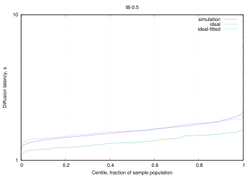<br/>IB diffusion to 0.50 stake | <br/>IB diffusion to 0.98 stake |
| <br/>EB diffusion to 0.50 stake | <br/>EB diffusion to 0.98 stake |
| <br/>VT diffusion to 0.50 stake | <br/>VT diffusion to 0.98 stake |
| <br/>RB diffusion to 0.50 stake | <br/>RB diffusion to 0.98 stake |

The Relay mini-protocol involves the consumer first requesting new headers, so it can take 4 latencies to receive the body. When blocks are more sporadic, like for EBs and RBs, the consumer has likely already sent a blocking request for more headers, so 3 latencies are enough. Votes all get sent at the start of the slice, with default configuration at least, so we can expect consumers to reach the blocking stage again by the next burst. However, due to the large traffic, the 4 latencies path likely sees some use too. This mix of behaviours can explain the better fit using 3.5 latencies.

#### Uniform Voting stage

The diffusion latencies, in the figure below, stay very similar when the simulation is set to generate votes across the whole stage rather than only in the first slot. From second 80 to 300 we have ~1100 vote messages, for an average of ~5 VT/s, same as IBs. The traffic pattern then does not seem a factor in the observed behaviour.

> Figure: Scenario 1 with *uniform voting*, diffusion latencies from slot start (300s run with default seed).

|                                                                                                                              |                                                                                                                               |
| ---------------------------------------------------------------------------------------------------------------------------- | ----------------------------------------------------------------------------------------------------------------------------- |
| <br/>VT diffusion to 0.50 stake | <br/>VT diffusion to 0.98 stake |

#### Large votes

The diffusion latencies, in the next two figures, are collected for votes set to the size of input blocks. With start-of-stage voting (the default) we see diffusion running slightly slower than ideal with 4 latencies, while uniform voting has a very close fit. The delay in the former is possibly due to the ~0.05 seconds serialization time causing blocks to queue behind each other when they are all generated at once: the volume of data, $`102400 \times 100`$, is 5 times the bandwidth of any given link, and nodes are requesting bodies from everyone.

> Figure: Scenario 1 with *large votes and start-of-stage voting*, diffusion latencies from slot start (300s run with default seed).

|   |   |
|---|---|
| <br/>VT diffusion to 0.50 stake | <br/>VT diffusion to 0.98 stake |

> Figure: Scenario 1 with *large votes and uniform voting*, diffusion latencies from slot start (300s run with default seed).

|   |   |
|---|---|
| 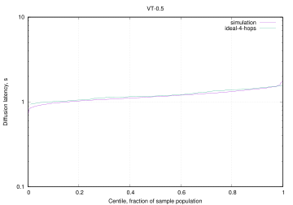<br/>VT diffusion to 0.50 stake | 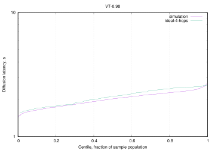<br/>VT diffusion to 0.98 stake. |

### Scenario 2

> [!NOTE]
> compare to previous plot rather than ideal? Same for later sections.

Figure below illustrate the effect of nodes request block bodies from first peer available.

> Figure: Scenario 2, diffusion latencies from slot start (300s run with default seed).

|                                                                                                                               |                                                                                                                               |
| ----------------------------------------------------------------------------------------------------------------------------- | ----------------------------------------------------------------------------------------------------------------------------- |
| <br/>IB diffusion to 0.50 stake  | 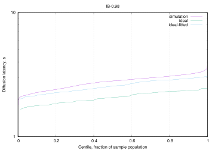<br/>IB diffusion to 0.98 stake |
| 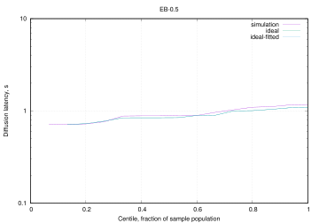<br/> EB diffusion to 0.50 stake | 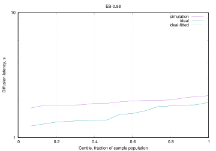<br/>EB diffusion to 0.98 stake |
| <br/> VT diffusion to 0.50 stake | <br/>VT diffusion to 0.98 stake |
| <br/>RB diffusion to 0.50 stake  | <br/>RB diffusion to 0.98 stake |

### Scenario 3

The figure below shows the result of multiplexing all the mini-protocols onto the same connection. We do not see a significant difference with Scenario 2.

Note that multiplexing in the simulation happens at the level of whole mini-protocol messages, without specific attempts to share the bandwidth fairly between them. This is not as realistic as breaking messages into same-size chunks and interleave those in a round-robin fashion.

> Figure: Scenario 3, diffusion latencies from slot start (300s run with default seed).

|                                                                                                                              |                                                                                                                               |
| ---------------------------------------------------------------------------------------------------------------------------- | ----------------------------------------------------------------------------------------------------------------------------- |
| <br/>IB diffusion to 0.50 stake | 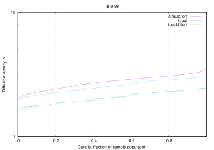<br/>IB diffusion to 0.98 stake |
| <br/>EB diffusion to 0.50 stake | <br/>EB diffusion to 0.98 stake |
| <br/>VT diffusion to 0.50 stake | <br/>VT diffusion to 0.98 stake |
| 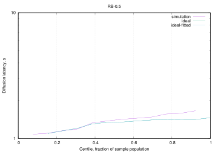<br/>RB diffusion to 0.50 stake | <br/>RB diffusion to 0.98 stake |

### Scenario 4

The figure below shows the introduction of the tcp congestion window having a quite dramatic effect on diffusion times.

> [!NOTE]
> do IBs which do not reference RBs do better?

> Figure: Scenario 4 *baseline*, diffusion latencies from slot start (300s run with default seed).

|                                                                                                                              |                                                                                                                               |
| ---------------------------------------------------------------------------------------------------------------------------- | ----------------------------------------------------------------------------------------------------------------------------- |
| 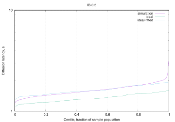<br/>IB diffusion to 0.50 stake | <br/>IB diffusion to 0.98 stake |
| <br/>EB diffusion to 0.50 stake | 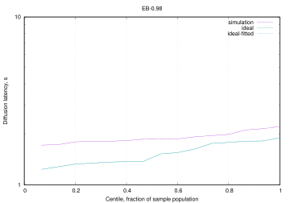<br/>EB diffusion to 0.98 stake |
| 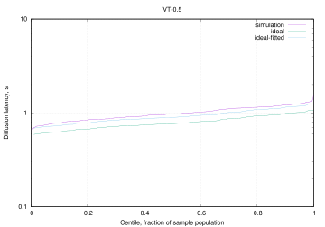<br/>VT diffusion to 0.50 stake | <br/>VT diffusion to 0.98 stake |
| <br/>RB diffusion to 0.50 stake | <br/>RB diffusion to 0.98 stake |

As the bounded CPU scenario does better (see next section), we want to rule out the unbounded cpu task handler as problematic, but bounding cpu in the figure below is no better. So it seems actually limiting parallelism is what improves diffusion.

> Figure: Scenario 4 *bounded cpu*, diffusion latencies from slot start (300s run with default seed).

|                                                                                                                                      |                                                                                                                                       |
| ------------------------------------------------------------------------------------------------------------------------------------ | ------------------------------------------------------------------------------------------------------------------------------------- |
| <br/>IB diffusion to 0.50 stake | <br/>IB diffusion to 0.98 stake |
| <br/>EB diffusion to 0.50 stake | <br/>EB diffusion to 0.98 stake |
| <br/>VT diffusion to 0.50 stake | <br/>VT diffusion to 0.98 stake |
| 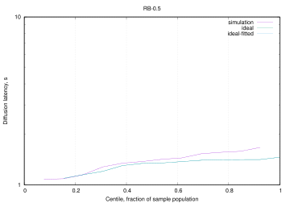<br/>RB diffusion to 0.50 stake | <br/>RB diffusion to 0.98 stake |

From other simulations we noticed there is a sweet spot of traffic for diffusion to do best, which makes sense with regard to keeping the congestion window open without overwhelming other resources. In particular from the figure below we see IBs do slightly better with these parameters:

``` yaml
ib-body-avg-size-bytes: 163840
leios-stage-length-slots: 60
ib-generation-probability: 10
```

and a topology where link bandwidth is set to 1,024,000 bps, half of previous scenarios.

> Figure: Scenario 4 *best IB rate*, diffusion latencies from slot start (300s run with default seed).

|                                                                                                                                           |                                                                                                                                            |
| ----------------------------------------------------------------------------------------------------------------------------------------- | ------------------------------------------------------------------------------------------------------------------------------------------ |
| <br/>IB diffusion to 0.50 stake | <br/>IB diffusion to 0.98 stake |
| <br/>EB diffusion to 0.50 stake | <br/>EB diffusion to 0.98 stake |
| 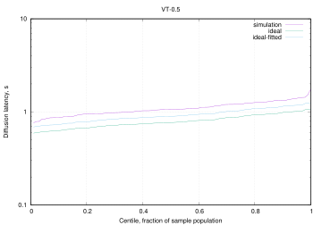<br/>VT diffusion to 0.50 stake | <br/>VT diffusion to 0.98 stake |
| 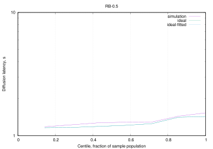<br/>RB diffusion to 0.50 stake | <br/>RB diffusion to 0.98 stake |

The next figure shows 15 IBs per slot, rather than the 10 of the previous figure, which flattens the curve even more, though we keep a substantial tail. On the other hand Vote diffusion is negatively affected, possibly crowded out by the IB volume.

> Figure: Scenario 4 *higher IB rate*, diffusion latencies from slot start (300s run with default seed).

|                                                                                                                                             |                                                                                                                                               |
| ------------------------------------------------------------------------------------------------------------------------------------------- | --------------------------------------------------------------------------------------------------------------------------------------------- |
| <br/>IB diffusion to 0.50 stake | <br/>IB diffusion to 0.98 stake  |
| <br/>EB diffusion to 0.50 stake | 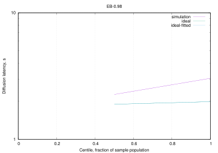<br/>EB diffusion to 0.98 stake  |
| <br/>VT diffusion to 0.50 stake | 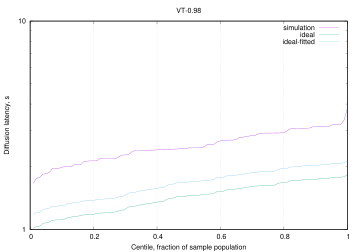<br/>VT diffusion to 0.98 stake  |
| <br/>RB diffusion to 0.50 stake | <br/> RB diffusion to 0.98 stake |

In the next figure we turn on uniform voting for the whole 60-second slot of the voting stage, which does appear to improve diffusion.

> Figure: Scenario 4 *higher IB rate with uniform voting*, diffusion latencies from slot start (300s run with default seed).

|                                                                                                                                                       |                                                                                                                                                        |
| ----------------------------------------------------------------------------------------------------------------------------------------------------- | ------------------------------------------------------------------------------------------------------------------------------------------------------ |
| 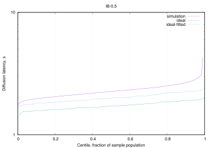<br/>IB diffusion to 0.50 stake | <br/>IB diffusion to 0.98 stake |
| <br/>EB diffusion to 0.50 stake | 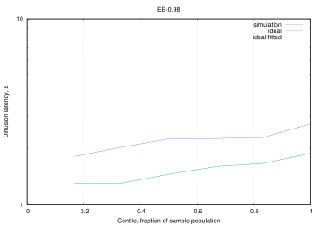<br/>EB diffusion to 0.98 stake |
| <br/>VT diffusion to 0.50 stake | <br/>VT diffusion to 0.98 stake |
| <br/>RB diffusion to 0.50 stake | <br/>RB diffusion to 0.98 stake |

In the next figure we bring stage length back to the default 20, and we see diffusion degrade again, though not to the original levels. About a tenth of IBs do not reach 0.98 stake distribution, and the curve flexes earlier than in the previous figure. Vote diffusion is also affected but not as much.

> Figure: Scenario 4 *higher IB rate with uniform voting and short stages*, diffusion latencies from slot start (300s run with default seed).

|                                                                                                                                                                   |                                                                                                                                                                    |
| ----------------------------------------------------------------------------------------------------------------------------------------------------------------- | ------------------------------------------------------------------------------------------------------------------------------------------------------------------ |
| 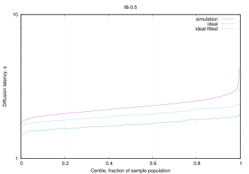<br/>IB diffusion to 0.50 stake | <br/>IB diffusion to 0.98 stake |
| <br/>EB diffusion to 0.50 stake | 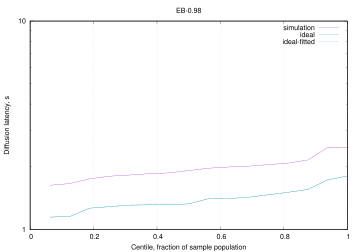<br/>EB diffusion to 0.98 stake |
| <br/>VT diffusion to 0.50 stake | 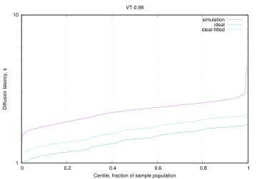<br/>VT diffusion to 0.98 stake |
| <br/>RB diffusion to 0.50 stake | <br/>RB diffusion to 0.98 stake |

A possibility is that IBs are not fully diffusing because nodes are unable to reconstruct the ledger state to validate them in. In the next figure we try to see what happens when we require too many votes for EBs to certify, so the actual ledger state stays at Genesis. However IBs will still reference the most recent RB with a ledger state on the generating node, so other nodes will have to have adopted the same RB at some point.

> [!NOTE]
> try setting the reference RB as always Genesis

> Figure: Scenario 4 *higher IB rate with uniform voting and short stages but no certificate*, diffusion latencies from slot start (300s run with default seed).

|                                                                                                                                                                           |                                                                                                                                                                            |
| ------------------------------------------------------------------------------------------------------------------------------------------------------------------------- | -------------------------------------------------------------------------------------------------------------------------------------------------------------------------- |
| <br/>IB diffusion to 0.50 stake | <br/>IB diffusion to 0.98 stake |
| 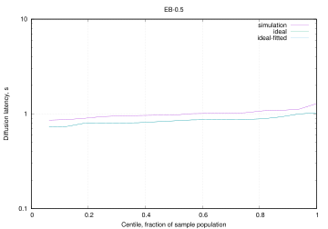<br/>EB diffusion to 0.50 stake | <br/>EB diffusion to 0.98 stake |
| <br/>VT diffusion to 0.50 stake | <br/>VT diffusion to 0.98 stake |
| <br/>RB diffusion to 0.50 stake | <br/>RB diffusion to 0.98 stake |

Even with that caveat we see IB diffusion improve, getting quite close to the one with 60 slot stage length. Ledger state reconstruction does seem a significant factor, since when EBs are 3 times rarer (two figure previous), or here where they do not get certified, diffusion does better. Inspecting the logs we can further note that most IBs are validated immediately upon reception, meaning the ledger state was already available, and only a tiny fraction waits up to 3 seconds, meaning that the real impediment is that EBs can get certified even if a good percentage of nodes has not and will not validate some of the referenced IBs, because they lack the corresponding RB/ledger state.

> [!NOTE]
> Keep ledger-state only for the preferred chain


The next figure confirms the above with the bounded cpu worker pool, with a much larger than needed bound.

> Figure: Scenario 4 *higher IB rate with uniform voting, short stages, no certificate, and bounded CPU*, diffusion latencies from slot start (300s run with default seed).

|                                                                                                                                                                                   |                                                                                                                                                                                    |
| --------------------------------------------------------------------------------------------------------------------------------------------------------------------------------- | ---------------------------------------------------------------------------------------------------------------------------------------------------------------------------------- |
| <br/>IB diffusion to 0.50 stake | 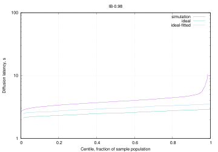<br/>IB diffusion to 0.98 stake |
| 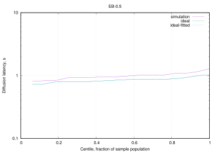<br/>EB diffusion to 0.50 stake | <br/>EB diffusion to 0.98 stake |
| <br/>VT diffusion to 0.50 stake | <br/>VT diffusion to 0.98 stake |
| 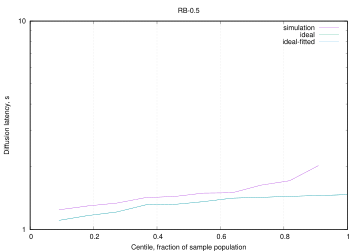<br/>RB diffusion to 0.50 stake | <br/>RB diffusion to 0.98 stake |

In the next figure we show that shorter stage length (20 slots) negatively affects even the case with 10 IBs per slot, even when we try to compensate with a shorter validation time.

> Figure: Scenario 4, *shorter stage length* diffusion latencies from slot start (300s run with default seed).

|                                                                                                                                                 |                                                                                                                                                  |
| ----------------------------------------------------------------------------------------------------------------------------------------------- | ------------------------------------------------------------------------------------------------------------------------------------------------ |
| <br/>IB diffusion to 0.50 stake | <br/>IB diffusion to 0.98 stake |
| <br/>EB diffusion to 0.50 stake | <br/>EB diffusion to 0.98 stake |
| <br/>VT diffusion to 0.50 stake | 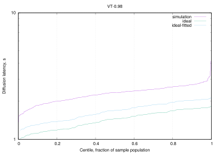<br/>VT diffusion to 0.98 stake |
| <br/>RB diffusion to 0.50 stake | <br/>RB diffusion to 0.98 stake |

In the next figure we see that 15 IB per second do not diffuse quite as well when they are only 96 kB, even with stage length of 60.

> Figure: Scenario 4 *small IBs*, diffusion latencies from slot start (300s run with default seed).

|                                                                                                                                         |                                                                                                                                          |
| --------------------------------------------------------------------------------------------------------------------------------------- | ---------------------------------------------------------------------------------------------------------------------------------------- |
| <br/>IB diffusion to 0.50 stake | 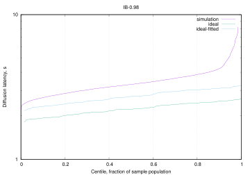<br/>IB diffusion to 0.98 stake |
| 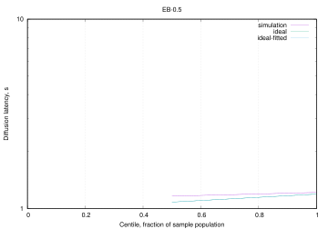<br/>EB diffusion to 0.50 stake | <br/>EB diffusion to 0.98 stake |
| <br/>VT diffusion to 0.50 stake | <br/>VT diffusion to 0.98 stake |
| 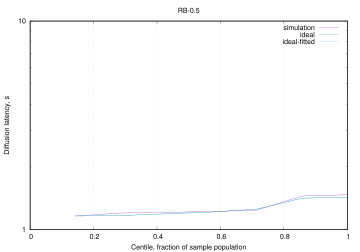<br/>RB diffusion to 0.50 stake | <br/>RB diffusion to 0.98 stake |

### Scenario 5

As mentioned before, we see in the next figure that just using 5 cores per node, instead of unbounded, improves diffusion by a good amount, without need for higher traffic. Presumably the limits on CPU make it so traffic is more spread out and keeps the tcp window open.

> Figure: Scenario 5 *baseline*, diffusion latencies from slot start (300s run with default seed).

|   |   |
|---|---|
| <br/>IB diffusion to 0.50 stake | <br/>IB diffusion to 0.98 stake |
| <br/>EB diffusion to 0.50 stake | <br/>EB diffusion to 0.98 stake |
| <br/>VT diffusion to 0.50 stake | <br/>VT diffusion to 0.98 stake |
| <br/>RB diffusion to 0.50 stake | 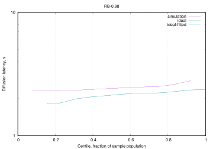<br/>RB diffusion to 0.98 stake |

> [!NOTE]
> try the higher traffic variations above, the sweet spot presumably shifted

In the next figure we show results for 10 cpu cores per node. Here we see all IBs making it to 0.98 stake diffusion.

> Figure: Scenario 5 *with bounded CPU*, diffusion latencies from slot start (300s run with default seed).

|   |   |
|---|---|
| <br/>IB diffusion to 0.50 stake | <br/>IB diffusion to 0.98 stake |
| <br/>EB diffusion to 0.50 stake | 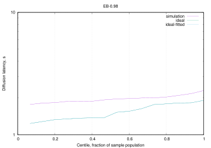<br/>EB diffusion to 0.98 stake |
| <br/>VT diffusion to 0.50 stake | <br/>VT diffusion to 0.98 stake |
| <br/>RB diffusion to 0.50 stake | <br/>RB diffusion to 0.98 stake |

### Scenario 6

The next figure shows the effect of oldest-first diffusion for IBs, which is null with these parameters. Trace debugging shows most of the time there is only one available body to request.

> Figure: Scenario 6 *baseline*, diffusion latencies from slot start (300s run with default seed).

|   |   |
|---|---|
| <br/>IB diffusion to 0.50 stake | <br/>IB diffusion to 0.98 stake |
| <br/>EB diffusion to 0.50 stake | <br/>EB diffusion to 0.98 stake |
| <br/>VT diffusion to 0.50 stake | <br/>VT diffusion to 0.98 stake |
| <br/>RB diffusion to 0.50 stake | <br/>RB diffusion to 0.98 stake |

> [!NOTE]
> try with higher traffic

As we will be mostly looking at IB diffusion, the next figure shows adoption for only IBs but for more stake fractions.

> Figure: Scenario 6 *IB adoption*, diffusion latencies from slot start (300s run with default seed).

|                                                                                                       |                                                                                                        |
| ----------------------------------------------------------------------------------------------------- | ------------------------------------------------------------------------------------------------------ |
| <br/>IB diffusion to 0.50 stake | 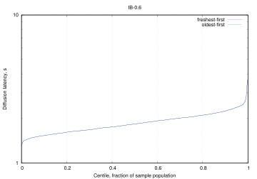<br/>IB diffusion to 0.60 stake  |
| 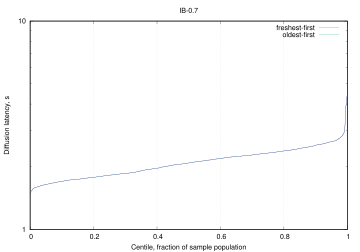<br/>IB diffusion to 0.70 stake | <br/>IB diffusion to 0.80 stake  |
| <br/>IB diffusion to 0.90 stake | 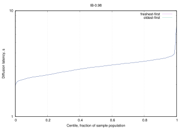<br/>IB diffusion to 0.98 stake |

The next figure shows same comparison but with 10 cpus per node. Diffusion for the 0.98 stake fraction improves, but we still see no differences between the diffusion strategies.

> Figure: Scenario 6 *IB adoption with bounded CPU*, diffusion latencies from slot start (300s run with default seed).

|     |     |
| --- | --- |
| <br/>IB diffusion to 0.50 stake | 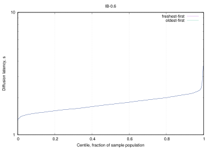<br/>IB diffusion to 0.60 stake |
| <br/>IB diffusion to 0.70 stake | <br/>IB diffusion to 0.80 stake |
| <br/>IB diffusion to 0.90 stake | <br/>IB diffusion to 0.98 stake |

## Notes on the Leios attack surface

This discussion extends the section [Threat Model](./technical-report-1.md#threat-model) of the [Leios Technical Report #1](./technical-report-1.md).

### Terminology and notes

- The *IB-concurrency period* is the time duration when nodes haven't seen newly created IBs from other honest nodes.
- Two transactions are *in conflict* if they spend any UTxOs in common. Among a set of valid transactions that attempt to spend a particular UTxO, only one of them can be *successfully executed* and the remainder are *unexecuted*, though (depending upon the ledger rules of the particular Leios variant) their collateral may be consumed if they become referenced by the Praos ranking block. Unexecuted conflicts waste network resources, CPU, and memory of nodes. If they reach the ledger, they also waste permanent storage.
- Leios variants may institute *tombstoning* of unexecuted transactions that must be stored permanently due to their presence in IBs that are indirectly referenced by RBs of the main chain. When stored permanently, a tombstoned transaction might not contain all of the data of the original full transaction: depending upon the Leios variant and the cryptographic scheme used, the tombstoned transaction might be a simple as just the hash of the original transaction or that hash and information about the collateral spent. Tombstoning of duplicate transactions is trivial, but tombstoning of unexecuted conflicting transactions requires cryptographic sophistication and/or voting.
- A smart contract at times have either *open* or *closed* participation. When a contract is open more than one party might be eligible to submit a transactions, but when it is closed only a specific party can submit a transaction. Auctions, lotteries, and liquidity pools typically are open contracts, though these could be formulated as hybrids. A zero-coupon bond or a European option might be a closed contract. Simple scripts could be open or closed. Transactions constructed by a single wallet and that do not spend from smart contracts could be considered closed because (presumably) only one party has the private keys necessary to spend the UTxOs. The distinction between open and closed UTxOs is important because the spender of a closed UTxO would typically have enough control of the situation that they could avoid creating a transaction that might conflict with others. Conversely, a spender of an open UTxO (in a script or smart contract) might not have sufficient information or control to avoid submitting a transaction that conflicts with transactions other users are submitting and which spend the same open UTxO.
- *Equivocation* is when a block producer (IB, EB, or RB) or voter produces more than their entitled number of blocks or votes. For example, local sortition may entitle a node to produce one IB in a particular slot, but the node actually produces two different IBs in that slot and diffuses them to different downstream nodes: separately each IB is valid, but together they are not, so nodes will only adopt the IB that they receive first. The Leios protocol specifies that both the first block received and the first equivocation received both are diffused.
- *Throughput loss* is when the overall capacity for non-conflicted transactions is reduced from the theoretical capability. Throughput is not considered lost if it is delayed and non-conflicted transactions originating from an adversary are not distinguished from those originating from honest parties. If an adversary pays for throughput, that throughput is not considered lost.
- *Latency loss* is when there is an increase in the the average time from a transaction's acceptance in the memory pool to it recording on the ledger.
- *Front running* iFront-running occurs when a party submits a transaction after observing conflicting transactions in Input Blocks (IBs) or Endorser Blocks (EBs). If the newly submitted transaction is successful while the previously observed transaction(s) fail, the submitting party may gain an opportunity to extract value—for example, from decentralized exchanges (DEXes), liquidity pools, or oracle-sensitive dApps.
- IB or EB *expiration* occurs when the block is not referenced by an EB or RB, respectively, before a timeout specified by the relevant Leios protocol parameter. Such expired blocks will never be included in the ledger.
- *Grinding* occurs when an adversary attempts to manipulate VRF values in their favor using a trial-and-error process of crafting the entropy input into the VRF. See [CPS-21 "Ouroboros Randomness Manipulation"](https://cips.cardano.org/cps/CPS-0021) for details.

### Taxonomy of negative impacts

The security-related impacts of adversarial behavior upon Leios fall into three general categories. Note that quality of service (QoS) issues such as front-running are not considered to be attacks on the protocol itself and are not included in this section.

- *Wasted of resources:* An attack may waste computation resources without impacting throughput or latency.
	- *CPU:* Most attack involve extra computation in the form of validation of transactions, IB, EB, or certificates. Leios nodes would be sized for peak capacity, so this wasted CPU does not translate into extra cloud-hosting costs.
	- *Memory:* Because of capacity limits in the protocol and backpressure in its implementation, attacks general would not impact memory usage in a significant manner. Leios nodes would be sized for peak capacity, so this wasted memory does not translate into extra cloud-hosting costs.
	- *Disk:* Any conflicted transactions that reach the ledger will have to be stored permanently in persistent storage so that the blockchain can be replayed from genesis. Tombstoning and compression techniques might reduce the amount of storage relative to the original size of conflicted transactions. Persistent storage incurs significant cost in most cloud-pricing schemes.
	- *Network:* Transmission of conflicted transactions or IBs containing such transactions increases network usage. At high throughput this can have significant cost in some cloud-pricing schemes.
- *Lowered throughput:* In addition to wasting infrastructure resources, attacks that generate conflicts and duplicates lower overall Leios throughput.
- *Increased latency:* Attacks that involve omissions or that cause voting failures generally do not decrease Leios throughput since Full Leios has "catch up" provisions for recovery. Those do, however, delay the arrival of transactions into the ledger.

### Specific attacks

*Memory pool attacks:* Just as in Praos, an adversary with sufficient network resources and high enough connectivity to other nodes can attempt to fragment the global memory pool by communicating different sets of transactions to different nodes. The extent to which they can accomplish this depends upon their resources (infrastructure and ada), the connectivity of the other nodes, and the sizes of their local memory pools. (Recall that local memory pools are of fixed size and nodes apply backpressure to clients when their local memory pool is full.) Unique to Leios is the situation where the local memory pools may contain mutually conflicting transactions, in which case there is a probability that honest nodes will create IBs with conflicting transactions during the IB-concurrency period.  An adversary could either craft their own mutually conflicting transactions or create transactions in conflict with honest ones in the memory pool if those honest transactions have open enough participation that third parties can create conflicting ones.

*Equivocation attacks:* When block producers or voters produce equivocated blocks/votes, this creates extra network traffic within the network. Depending upon the proportions of equivocated blocks received by other nodes, at most one of the equivocated blocks could eventually be voted upon and there is a chance that neither would. The Leios protocol mitigates this attack so that slight waste of network resources and the chance of EB non-inclusion are the worst-case impacts.

*IB conflict attacks:* An IB producer can craft the contents of their new IBs to contain transactions in conflict with other transactions that they know to be in the memory pool or that they have seen within other IBs in flight. The adversarial IB producer can delay their production of the IB for several slots (up to approximately one stage length), until they see IBs created by other nodes in subsequent slots: optimally, they would release their "back-dated" IB after they have seen transactions in the IBs for a few subsequent slots, given them information to retrospectively create conflicting transactions. (The conflicts could be against honest *open* transactions or against transactions submitted by the adversary.) The strength of this attack is proportional to the adversary's stake and generally requires expending some ada in the form of lost collateral. The attack has the same impact as the conflicting transactions resulting from the memory pool attack: bandwidth, CPU, and potentially disk.

*Omission attacks:* Choosing not to build an IB, EB, or RB trivially increases the latency of Leios. Not voting trivially increases the probability of not being able to certify an EB for inclusion in an RB, similarly increasing latency. In these cases the strength of the adversary is proportional to their stake. If an omission attack is sustained so long that IBs and/or EBs expire, then a loss of throughput would also occur.

*Front-running:* Regardless of the specific ordering of transactions required by the Ledger rules of the particular Leios variant, the overlap of pipelines and the potential opportunity to include transactions in RBs opens the possibility of front running transactions. Although front-running is primarily a quality of service (QoS) consideration, it can also be used to provoke conflicts that consume resources and lower throughput.

*Denial of service on FA voting:* The Fait Accompli algorithm for voter sortition publicly reveals the high-stake nodes who will be voters in every election during an epoch. Traditional network denial of service attacks might be mounted against them if they IP addresses can be determined by an adversary. The success of such attacks depends upon the target node's network infrastructure and firewall defenses and could result the node not disseminating its vote in the time frame required by a protocol. If sufficient voting nodes were attacked, then no EB would be certified in the pipeline and a loss of latency would result.

*Late release attacks:* If the Leios variant in question has sharp cutoff criteria for whether an IB or EB is received to late to be considered valid in the current pipeline, then an attacker (especially a block producer) could try to diffuse the block almost as late as possible, so that some nodes receive it before the cutoff and others receive it after the cutoff. This would create disagreement regarding what blocks are valid for the pipeline and could prevent a quorum of voters to agree on an EB to certify. Because the block could be included in a later pipeline, this attack would only result in a loss of latency.

*Grinding attacks:* As in Praos, adversaries may attempt to manipulate the randomness of the VRF function used to determine who produces IBs, EBs, and/or votes.

### Recommendations

1. Perform theoretical analysis and simulation experiments to estimate how fragmented the global memory pool can become, as a function of adversarial resources.
2. Perform simulation experiments to measure the resource and voting impact of equivocated IBs, EBs, and votes.
3. Analytically compute probabilities of conflict attacks succeeding, as a function of adversarial stake, and compare to simulation results.

## Simulation experiments

The table below constitutes a historical record of the simulation experiments used to study the behavior of Leios variants and to test the correctness of the simulators. Only the [cip/](../analysis/sims/cip/) and [regression/](../analysis/sims/regression/) experiments are re-run each time the Rust or Haskell simulator is revised. The configurations and results reside in the folders [analysis/sims/](../analysis/sims/) in the Leios repository. Archives of the full results (simulation logs etc. and post-processed data files) reside in an AWS S3 bucket. Each folder contains sufficient information to re-run the experiment at the relevant commit or hash; with minor modification of the configuration file `config.yaml`, the experiment can be re-run with the latest version of the Haskell and/or Rust simulator. See [analysis/sims/ReadMe.md](analysis/sims/ReadMe.md) for general guidance regarding re-running the experiments.

| Experiment                                        | Folder                                      | Description                                                                                                                                                                                                                                                                                                                                                                                                                                                                                                                                                                                                                      | Findings                                                                                                                                                                                                                                                                                                                                                                                                                                                                                                                                                                                                                                                                                                                                                                                                                                                                                                                                                              |
| ------------------------------------------------- | ------------------------------------------- | -------------------------------------------------------------------------------------------------------------------------------------------------------------------------------------------------------------------------------------------------------------------------------------------------------------------------------------------------------------------------------------------------------------------------------------------------------------------------------------------------------------------------------------------------------------------------------------------------------------------------------- | --------------------------------------------------------------------------------------------------------------------------------------------------------------------------------------------------------------------------------------------------------------------------------------------------------------------------------------------------------------------------------------------------------------------------------------------------------------------------------------------------------------------------------------------------------------------------------------------------------------------------------------------------------------------------------------------------------------------------------------------------------------------------------------------------------------------------------------------------------------------------------------------------------------------------------------------------------------------- |
| CIP figures                                       | [cip/](../analysis/sims/cip/)               | Proposes a set of protocol parameters and throughputs for inclusions in the *Evidence* section of the draft CIP.                                                                                                                                                                                                                                                                                                                                                                                                                                                                                                                 | • Modest resources (4 vCPU/node, 10 Mb/s bandwidth) are adequate up to at least 0.3 TxMB/s.<br>• It is likely that Plutus-heavy workloads could also be supported.<br>• Stage length of 7 slots allows for diffusion while having a low probability of discarding an EB.<br>• Maximum of 12 MB of transactions in an EB allows for occasional fully utilized EBs to “catch up” on throughput when sortition is unlucky.<br>• At lower TPS, most of the EBs are small.<br>• Maximum block size could be reduced at the expense of longer waits when sortition is unlucky.                                                                                                                                                                                                                                                                                                                                                                                              |
| Regression in Rust simulator                      | [regression/](../analysis/sims/regression/) | Compares the behavior of all of the tagged versions of the Rust simulator, `sim-cli`, against each other when the same network topology and configuration file are used.                                                                                                                                                                                                                                                                                                                                                                                                                                                         | Differences in simulation output as `sim-cli` is revised.                                                                                                                                                                                                                                                                                                                                                                                                                                                                                                                                                                                                                                                                                                                                                                                                                                                                                                             |
| Network degradation                               | [degraded/](../analysis/sims/degraded/)     | Studied Leios's behavior when network topology is thinned. The number of connections to/from each node was randomly thinned by up to 87% of its original mainnet-like topology. Beyond that level (i.e., more than 88% of connections lost), the network topology splits into disconnected regions where some nodes can no longer communicate with each other. That degradation resulted in the diameter of the network increasing from 5 hops to 8 hops and the number of connections per node dropping form 23.5 to 6.0. Both honest cases and cases where adversaries delay the release or transactions and EBs were studied. | The experiment was inconclusive, in that the protocol operated properly when 87% of connections where lost, but it was impractical to further thin the network topology without breaking it into non-communicating components.                                                                                                                                                                                                                                                                                                                                                                                                                                                                                                                                                                                                                                                                                                                                        |
| Low bandwidth                                     | [bandwidth/](../analysis/sims/bandwidth/)   | The inter-node bandwidth was reduced to values as low as 1 Mb/s.                                                                                                                                                                                                                                                                                                                                                                                                                                                                                                                                                                 | Leios operates successfully at a throughput of 0.250 TxkB/s even at a 2 Mb/s bandwidth but breaks down at 1 Mb/s.                                                                                                                                                                                                                                                                                                                                                                                                                                                                                                                                                                                                                                                                                                                                                                                                                                                     |
| Late EB and TX attacks                            | [2025w33b/](/../analysis/sims/2025w33b/)    | An experiment involving late EB and/or late transaction diffusion was run, where tx and the EB propagation scheme were also varied.                                                                                                                                                                                                                                                                                                                                                                                                                                                                                              | • The attack successfully thwarts Leios throughput under some conditions.<br>• Efficiency starts dropping when EBs and transactions are delayed 6.5 seconds.<br>• Efficiency doesn’t continue dropping much after delays of 7 seconds.<br>• $L_\text{diff} = 0\text{s}$ performs better than $L_\text{diff} = 7 \text{s}$.<br>• None of the cases, using `txs-received`, loses transactions or bogs down.                                                                                                                                                                                                                                                                                                                                                                                                                                                                                                                                                             |
| Late diffusion                                    | [2025w33/](../analysis/sims/2025w33/)       | An experiment involving late EB and/or late transaction diffusion was run, where  and the EB propagation scheme were also varied.                                                                                                                                                                                                                                                                                                                                                                                                                                                                                                | • The attack successfully thwarts Leios throughput under some conditions. • Follow-up analysis determined that transactions were lost in some cases due to a misformulation of the memory-pool rules in the simulator.                                                                                                                                                                                                                                                                                                                                                                                                                                                                                                                                                                                                                                                                                                                                                |
| Haskell vs Rust                                   | [2025w32b/](..analysis/sims/2025w32b/)      | Compares Haskell vs Rust simulation output at newer commits.                                                                                                                                                                                                                                                                                                                                                                                                                                                                                                                                                                     | Results indicate that a previous discrepancy in vote diffusion has been corrected.                                                                                                                                                                                                                                                                                                                                                                                                                                                                                                                                                                                                                                                                                                                                                                                                                                                                                    |
| Draft figures for CIP                             | [2025w32/](../analysis/sims/2025w32/)       | Proposes a set of protocol parameters and throughputs for inclusions in the *Evidence* section of the draft CIP.                                                                                                                                                                                                                                                                                                                                                                                                                                                                                                                 | • Modest resources (4 vCPU/node, 10 Mb/s bandwidth) are adequate up to at least 0.3 TxMB/s.<br>• It wasn't studied here, but it is likely that Plutus-heavy workloads could also be supported.<br>• Stage length of 7 slots allows for diffusion while having a low probability of discarding an EB.<br>• Maximum of 12 MB of transactions in an EB allows for occasional fully utilized EBs to “catch up” on throughput when sortition is unlucky.<br>• At lower TPS, most of these blocks are small.<br>• Maximum block size could be reduced at the expense of longer waits when sortition is unlucky.<br>• This experiment raised questions about whether the mempool rules are adequate.                                                                                                                                                                                                                                                                         |
| Plutus validation time                            | [2025w31c/](../analysis/sims/2025w31c/)     | Varies the CPU time used by Plutus phase 2 validation in Linear Leios at 100 TPS for a 6-vCPU node.                                                                                                                                                                                                                                                                                                                                                                                                                                                                                                                              | • Simulation with 6-vCPU nodes supported doubling the Plutus per-transaction budget on Linear Leios.<br>• Simulations at a sixfold increase in the Plutus per-transaction budget failed: nodes bogged down validating transactions and cannot put them in new EBs.<br>• EB could likely handle 5000 Gstep of Plutus computation in Linear Leios, which is 250x the Praos per-block budget.<br>• This could support a handful of Plutus transactions with a 20x greater Plutus budget.<br> • Alternatively every Plutus transaction could have its budget increased by 50%.<br> • However, intentionally late diffusion of Plutus-heavy transactions could interfere with EB adoption.<br>• These results are uncertain due to the variability in measured Plutus CPU costs: there is quite a bit of variability in the CPU time actually used by a Plutus script given its execution steps.                                                                           |
| Haskell vs Rust                                   | [2025w31b/](../analysis/sims/2025w31b/)     | Compares the early draft of the Haskell simulator for Linear Leios to the more mature Rust simulator.                                                                                                                                                                                                                                                                                                                                                                                                                                                                                                                            | Discrepancies related to CPU usage, network usage, and vote diffusion must be investigated.                                                                                                                                                                                                                                                                                                                                                                                                                                                                                                                                                                                                                                                                                                                                                                                                                                                                           |
| Experiment varying stage length in "No IBs" Leios | [2025w31/](../analysis/sims/2025w31/)       | Varied the stage-length protocol parameter of "No IBs" Leios from 5 to 12 slots/stage.                                                                                                                                                                                                                                                                                                                                                                                                                                                                                                                                           | • Results indicate that the settlement time is not strongly affected by this parameter within this rage of values.<br>• Note that larger stage lengths result in less frequent voting.                                                                                                                                                                                                                                                                                                                                                                                                                                                                                                                                                                                                                                                                                                                                                                                |
| Effect of network topology                        | [2025w30b/](../analysis/sims/2025w30b/)     | Compared Linear Leios simulation results on the 750-node mini-mainnet vs the 10,000-node pseudo-mainnet networks in the Rust simulator.                                                                                                                                                                                                                                                                                                                                                                                                                                                                                          | • Results indicate that the smaller network is slightly more stressful to the protocol than the larger network, but in general there are no substantial differences between simulation results for the two networks.<br>• The same findings and conclusions would result from using either network.                                                                                                                                                                                                                                                                                                                                                                                                                                                                                                                                                                                                                                                                   |
| Linear Leios at 1000 TPS                          | [2025w30/](../analysis/sims/2025w30/)       | Tested whether Linear Leios with transaction references and Stracciatella can support throughputs of 1000 tx/s at 300 B/tx.                                                                                                                                                                                                                                                                                                                                                                                                                                                                                                      | Linear Leios with transactions embedded in the EBs cannot support such throughput.                                                                                                                                                                                                                                                                                                                                                                                                                                                                                                                                                                                                                                                                                                                                                                                                                                                                                    |
| 100 TPS for Stracciatella and Linear Leios        | [2025w29b/](../analysis/sims/2025w29b/)     | Tested the viability of Stracciatella and Linear Leios at 100 TPS if appropriate stage lengths and maximum EB sizes are chosen.                                                                                                                                                                                                                                                                                                                                                                                                                                                                                                  | • 5 slot/stage is too short for Linear Leios at 100 tx/s.<br>• Including transactions in EBs (instead of references) results in congestion and delays at 100 tx/s.<br>• 10 MB/EB is sufficient for 100 tx/s but 5 MB/EB is not.<br>• EB-sortition unluckiness in Stracciatella can lengthen the transaction lifecycle, but this could be remedied by increasing the EB production rate.<br>• CPU and network usage peak high when transactions are included in EBs.<br>• Caveat: this conclusion may change when better transaction validation times are used in the simulator configuration.                                                                                                                                                                                                                                                                                                                                                                         |
| Linear Leios                                      | [2025w29/](../analysis/sims/2025w29/)       | A comprehensive set of simulations for the Linear Leios variant was completed, aiming to map out the protocol's performance under varies loads and comparing several versions of the variant to Stracciatella.                                                                                                                                                                                                                                                                                                                                                                                                                   | n/a                                                                                                                                                                                                                                                                                                                                                                                                                                                                                                                                                                                                                                                                                                                                                                                                                                                                                                                                                                   |
| Stracciatella                                     | [2025w28/](../analysis/sims/2025w28/)       | The Stracciatella variant of Leios (i.e., no IBs, tx refrences in EBs, and a two-stage pipeline) is analyzed.                                                                                                                                                                                                                                                                                                                                                                                                                                                                                                                    | • 1000+ TPS is attainable.<br>• Congestion does appear at this throughput.<br>• 5 slot/stage performs less well but appears to scale better than 8 slot/stage.<br>• Spatial efficiency is better than 95%.<br>• Time to ledger is better than two minutes (subject to RB randomness, of course).<br>• Only the tiniest fraction of transactions don't reach the ledger, likely due to EBs expiring before the reach an RB.<br>• Network usage is slightly heavy.<br>• CPU usage seems suspiciously light.                                                                                                                                                                                                                                                                                                                                                                                                                                                             |
| Small transactions                                | [2025w28/](../analysis/sims/2025w28/)       | A small-transaction, high-throughput experiment.                                                                                                                                                                                                                                                                                                                                                                                                                                                                                                                                                                                 | • 1000 tx/s with 300 B/tx is feasible in Leios variants<br>• Time vs space tradeoff<br>• `full-with-ib-references` uses space more efficiently than `full-without-ibs`<br>• `full-without-ibs` has shorter transaction lifecycle than `full-with-ib-references`<br>• `full-without-ib` loses some transactions, likely due to the aggressive pruning of the memory pool<br>• 2 CPU cores are sufficient<br>• Network usage is modest                                                                                                                                                                                                                                                                                                                                                                                                                                                                                                                                  |
| Timestep effects in simulators                    | [2025w27/](../analysis/sims/2025w27/)       | We compared the 1000 TPS Full Leios simulation results (Rust) at two time resolutions, 0.100 ms and 0.025 ms.                                                                                                                                                                                                                                                                                                                                                                                                                                                                                                                    | • No significant differences in results were found.<br>• This means that we can safely run simulations at the coarser time step; such enable greater parallelism in the simulator and shorter wallclock times.                                                                                                                                                                                                                                                                                                                                                                                                                                                                                                                                                                                                                                                                                                                                                        |
| 1000 TPS experiment                               | [2025w27/](../analysis/sims/2025w27/)       | A 1000 TPS experiment of basic transactions (300-byte non-Plutus transactions) was completed to demonstrate the viability of Leios at high throughput.                                                                                                                                                                                                                                                                                                                                                                                                                                                                           | n/a                                                                                                                                                                                                                                                                                                                                                                                                                                                                                                                                                                                                                                                                                                                                                                                                                                                                                                                                                                   |
| Praos simulations                                 | [2025w26/](../analysis/sims/2025w26/)       | Rust simulations on mini-mainnet for 50 and 100 TPS on Praos. These can serve as a reference when evaluating Leios performance.                                                                                                                                                                                                                                                                                                                                                                                                                                                                                                  | • Praos _simulations_ perform well at 50 TPS.<br>• They exhibit congestion-induced forking at 100 TPS.<br>• All transaction reach the ledger.<br>• Bursty usage of network and CPU does not tax infrastructure resources.<br>• Should we request cardano-node benchmark studies of large Praos blocks?                                                                                                                                                                                                                                                                                                                                                                                                                                                                                                                                                                                                                                                                |
| Nine candidate variants of Leios                  | [2025w26/](../analysis/sims/2025w26/)       | Three basic variants and three sharding strategies.<br>- Basic<br>    - Full<br>    - Full without IBs<br>    - Full with transaction references<br>- Sharding<br>    - Unsharded<br>    - Sharded<br>    - Overcollateralized 1x (i.e., each tx has a probability of being included in two shards instead of one)                                                                                                                                                                                                                                                                                                               | The network and CPU metrics for all of the variants were acceptable, but they had different spatial and temporal efficiencies.                                                                                                                                                                                                                                                                                                                                                                                                                                                                                                                                                                                                                                                                                                                                                                                                                                        |
| Conflicting transactions                          | [2025w26/](../analysis/sims/2025w26/)       | Exploring the effect of conflicting transactions at 100 TPS for the simplest Leios variant.                                                                                                                                                                                                                                                                                                                                                                                                                                                                                                                                      | • Spatial efficiency can be as low as 55%, which is due to the occasional production of an IB before the previous one is received.<br>•  Transaction typically reach the ledger within 75 seconds.<br>•  All non-conflicted transactions reach the ledger.<br>•  NIC bandwidth of 20 Mb/s is sufficient: see figure below.<br>•  Four vCPU cores are sufficient.<br>•  Even the largest IBs (up to 2 MB) diffuse globally within 5 seconds: see figure below.<br>•  IB traffic does not interfere with transaction, vote, EB, or RB traffic.<br>•  The occasional large IBs benefit performance by diffusing before the mean time between IBs, which permits pruning of the memory pool before the next IB is typically produced.                                                                                                                                                                                                                                     |
| Bandwidth                                         | [2025w25/](../analysis/sims/2025w25/)       | Exploring the effect of bandwidth limits at 100 TPS and 300 TPS.                                                                                                                                                                                                                                                                                                                                                                                                                                                                                                                                                                 | • The protocol parameters are sufficient for Leios high performance at 100 tx/s (or 300 tx/s): mini-mainnet topology, 1 IB/s (or 2 IB/s), 10 slot/stage, 328 kB/IB maximum, 1.5 EB/stage, and multiple shards.<br>•  Spatial efficiency is 80%.<br>•  All transactions reach the ledger, typically within two minutes.<br>•  A 30 Mbps network interface card (NIC) is sufficient for the Leios node.<br>•  A 4-core vCPU is also sufficient.<br>•  The results are insensitive to inter-nodal link bandwidths greater than 50 Mb/s, and even at 10 Mb/s the effect of link bandwidth is small.                                                                                                                                                                                                                                                                                                                                                                       |
| Mini-mainnet                                      | [2025w24/](../analysis/sims/2025w24/)       | The 750-node pseudo-mainnet network was used in Haskell and Rust experiments to study the limits of transaction and IB throughput for realistic scenarios up to 300 TPS and 32 IB/s.                                                                                                                                                                                                                                                                                                                                                                                                                                             | • The 750 node mini-mainnet is a suitable replacement for the 10,000-node pseudo mainnet, in that either topology would result in similar performance measurements and resource recommendations.<br>• The Haskell and Rust simulations substantially agree for mini-mainnet simulations.<br>• Block propagation less than 1 second, which is consistent with empirical observations from pooltool.io. Note that this has implications for our discussion of the IB-concurrency period.<br>• With 1 Gb/s links/NICs, the protocol can support 25 MB/s throughput before it starts degrading.<br>• Mean time from mempool to ledger is about 150 seconds for transactions.<br>• Disk-space efficiency is about 80%.<br>• About 20% of network traffic is wasted.<br>• Even at 300 ts/x, a 6-core VM is sufficient for peak demand, but average demand is less than 2 cores.                                                                                             |
| Pseudo-mainnet                                    | [2025w23/](../analysis/sims/2025w23/)       | The 10,000-node pseudo-mainnet network was used in Rust experiments to study the limits of transaction and IB throughput for realistic scenarios up to 300 TPS and 32 IB/s.                                                                                                                                                                                                                                                                                                                                                                                                                                                      | • Transactions took an average of 100 seconds to travel from the memory pool to the ledger.<br>• Disk and network usage was approximately 80% efficient.<br>• Even at high TPS, six CPU cores were sufficient to handle peak load.<br>• Block propagation time averaged under one second.                                                                                                                                                                                                                                                                                                                                                                                                                                                                                                                                                                                                                                                                             |
| Limited CPU                                       | [2025w22/](../analysis/sims/2025w22/)       | Lifecycle analysis with nodes limited to eight vCPU cores.                                                                                                                                                                                                                                                                                                                                                                                                                                                                                                                                                                       | n/a                                                                                                                                                                                                                                                                                                                                                                                                                                                                                                                                                                                                                                                                                                                                                                                                                                                                                                                                                                   |
| Excess capacity                                   | [2025w20/](../analysis/sims/2025w20/)       | The previous transaction lifecycle simulations raised the question of whether the duplication of transactions in IBs was starving other transactions from ever being included in an IB, and hence never making it to the ledger. Those earlier simulations had at total IB capacity that was only modestly larger than the size of all of the transactions submitted during the course of the simulation. To evaluate this hypothesis, we re-ran the experiment with IBs being produced at three times a higher rate, which leaves plenty of space in IBs for transaction duplication.                                           | The loss of transactions persists, indicating that the hypothesis was incorrect and that some other factor is preventing transactions from making it to the ledger.                                                                                                                                                                                                                                                                                                                                                                                                                                                                                                                                                                                                                                                                                                                                                                                                   |
| Lifecycle and resource analyses                   | [2025w19/](../analysis/sims/2025w19/)       | We executed the first high-tps simuations of Leios using the Rust simulator, with TPS ranging as high as 1000 tx/s. Two efficiency measures are used to quantify the inclusion of transactions in the ledger and the amount of data that must be persisted as the ledger.                                                                                                                                                                                                                                                                                                                                                        | Recently proposed revisions to Full Short Leios will increase both efficiencies, as will tuning the protocol parameters involved. In the simulations it took approximately 100 seconds for a transaction to reach the ledger, measured from the time the transaction was submitted.                                                                                                                                                                                                                                                                                                                                                                                                                                                                                                                                                                                                                                                                                   |
| Full Leios                                        | [2025w17/](../analysis/sims/2025w17/)       | Simulation of 270 scenarios of Full Leios for varied IB production rate, IB size, and EB production rate, stage length, and CPU constraints.                                                                                                                                                                                                                                                                                                                                                                                                                                                                                     | • All outstanding discrepancies between Rust and Haskell simulation results have either been resolved or explained.<br>• Inclusion of a transaction in an IB typically occurs in 2.4 seconds.<br>• Referencing of a transaction via an EB typically occurs in 27.6 seconds.<br>• Referencing of a transaction via an RB typically occurs in 67.2 seconds.<br>• The current version of Full Leios exhibits some undesirable side effects of never referencing some transactions in RBs and duplicating inclusion or referencing of transactions.                                                                                                                                                                                                                                                                                                                                                                                                                       |
| Full Leios                                        | [2025w16/](../analysis/sims/2025w16/)       | Simulation of 648 scenarios of Full and Short Leios for varied IB production rate, IB size, and EB production rate, stage length, and CPU constraints.                                                                                                                                                                                                                                                                                                                                                                                                                                                                           | • Agreement between the Rust and Haskell simulations is generally quite close.<br>• The Haskell simulation experiences network congestion at 16 IB/s, but the Rust simulation does not.<br>• The Rust simulation uses more CPU at high IB rates than the Haskell simulation does.<br>• The Rust simulation sometimes does not produce enough votes to certify an EB.                                                                                                                                                                                                                                                                                                                                                                                                                                                                                                                                                                                                  |
| Arrival times                                     | [2025w15/](../analysis/sims/2025w15/)       | Study of diffusion of IB, EB, votes, and transactions.                                                                                                                                                                                                                                                                                                                                                                                                                                                                                                                                                                           | n/a                                                                                                                                                                                                                                                                                                                                                                                                                                                                                                                                                                                                                                                                                                                                                                                                                                                                                                                                                                   |
| Edinburgh                                         | [pre-edi/](../analysis/sims/pre-edi/)       | Simulations for discussion at the Leios workshop in Edinburgh.                                                                                                                                                                                                                                                                                                                                                                                                                                                                                                                                                                   | n/a                                                                                                                                                                                                                                                                                                                                                                                                                                                                                                                                                                                                                                                                                                                                                                                                                                                                                                                                                                   |
| Short Leios                                       | [2025w13/](../analysis/sims/2025w13/)       | Simulation of 198 scenarios of Short Leios for varied IB production rate, IB size, and network topology, CPU limits, and protocol flags.                                                                                                                                                                                                                                                                                                                                                                                                                                                                                         | • The simulations resolved most of the prior outstanding issues that arose in comparing simulators, but they unearthed new ones.<br>• Studied how limiting available CPU affects the propagation of messages like IBs, where they might potentially be lost if insufficient CPU is available. _CPU can impact diffusion of IBs under some stressful scenarios._<br>• Compared freshest-first versus oldest-first vote propagation. _Freshest first (arguably) may improve reliability of IB delivery._<br>• Compared an extended voting period versus a limited one in the Haskell simulation. _Extended voting makes little difference except for rare improvements in reliable delivery of votes._<br>• The qualitative discrepancies between the Haskell and Rust simulators' results are under investigation to determine whether they are _bona fide_ differences due to the resolution of the simulators instead of infidelities in the simulations themselves. |
| Realism                                           | [2025w12xl/](../analysis/sims/2025w12xl/)   | Study of more realistic network settings.                                                                                                                                                                                                                                                                                                                                                                                                                                                                                                                                                                                        | n/a                                                                                                                                                                                                                                                                                                                                                                                                                                                                                                                                                                                                                                                                                                                                                                                                                                                                                                                                                                   |
| Short Leios with varied IB production and size    | [2025w12/](../analysis/sims/2025w12/)       | Simulation of 18 scenarios of Short Leios for varied IB production rate, IB size, and network topology.                                                                                                                                                                                                                                                                                                                                                                                                                                                                                                                          | • In the simulations the Leios protocol scales well to mainnet-size networks.<br>• The protocol tends to experience congestion once the input-block rate reaches 30 IB/s.<br>• Even at the highest data rates studied, it appears that six vCPUs are sufficient to handle cryptographic operations.<br>• Allowing IBs that are larger than current Praos RBs may have advantages in TCP efficiency, in network usage, and in adapting to fluctuating transaction loads.<br>• A few minor unexplained differences remain when comparing the Haskell and Rust results, and these are under active investigation.<br>• Overall, the two simulators are in essential agreement for the protocol parameters and network configurations studied.                                                                                                                                                                                                                            |
| Mainnet-scale simulation                          | [2025w11xl/](../analysis/sims/2025w11xl/)   | Mainnet-scale network simulation, using the Rust simulator.                                                                                                                                                                                                                                                                                                                                                                                                                                                                                                                                                                      | It is interesting to see that the 3000-node mainnet-scale network transports IBs faster than the artificial 100-node network that was previously analyzed: likely this is because the larger network has long-range "shortcut" edges that speed transport.                                                                                                                                                                                                                                                                                                                                                                                                                                                                                                                                                                                                                                                                                                            |
| Haskell vs Rust                                   | [2025w11/](../analysis/sims/2025w11/)       | Compares 90 scenarios of the Rust and Haskell simulations                                                                                                                                                                                                                                                                                                                                                                                                                                                                                                                                                                        | Github issues were created for any significant differences between the pairs of simulation results.                                                                                                                                                                                                                                                                                                                                                                                                                                                                                                                                                                                                                                                                                                                                                                                                                                                                   |
| Haskell                                           | [2025w10/](../analysis/sims/2025w10/)       | • Compare simulations with and without accounting for CPU usage.<br>• Vary key protocol parameters<br>• IB production rate<br>• IB size<br>• Length of Leios stages- Delay between the generation of an IB, EB, vote, or RB and its receipt at nodes.<br>• Peak and mean CPU usage over time<br>• Breakdown of CPU usage by type of task<br>• Sizes of IBs, EBs, and RBs<br>• Duplicate IB references in EBs<br>• Reference to EBs from RBs<br>• Number of IBs referenced by EB<br>• Timing of references to IBs and EBs from EBs and RBs, respectively                                                                          | • The protocol supports data rates up to 30 IB/s with input blocks up to 163 kB/IB.<br>• Verification of IBs dominates CPU usage, except at low throughputs.<br>• Short Leios includes the same IB in multiple EBs.<br>• Short Leios sometimes discards IBs because not EB was produced.                                                                                                                                                                                                                                                                                                                                                                                                                                                                                                                                                                                                                                                                              |
| Haskell and Rust                                  | [2025w09/](../analysis/sims/2025w09/)       | Compares the Haskell and Rust simulations.                                                                                                                                                                                                                                                                                                                                                                                                                                                                                                                                                                                       | •  The ELT ("extract/load/transform") workflow for processing simulation data was refactored so that complete logs from both simulations are organized for simpler querying.<br>• The Rust simulator was temporarily modified to generate IBs of fixed size, which is what the Haskell simulator does, so that output from the two can be compared.<br>• Discrepancies between congestion metrics for two simulators were partially resolved.<br>• Analyses of the elapsed time from IB generation to receipt at the various nodes and also of time-in-flight over node-to-node links were developed.<br>• It appears that both network bandwidth and CPU bottlenecks play a role in congestion at very high transaction throughput, but this needs more detailed investigation.                                                                                                                                                                                      |
| Varied IB rate                                    | [2025w08/](../analysis/sims/2025w08/)       | Compares the Haskell and Rust simulators for input-block production varying from 1 IB/s to 100 IB/s.                                                                                                                                                                                                                                                                                                                                                                                                                                                                                                                             | The Haskell simulation results indicate that network congestion occurs at high IB production rates, causing both the average propagation time and the tail of extremely slow propagation to lengthen.                                                                                                                                                                                                                                                                                                                                                                                                                                                                                                                                                                                                                                                                                                                                                                 |

## Test networks

### Pseudo-mainnet

The aim of [the pseudo-mainnet topology](../data/simulation/pseudo-mainnet/) is to have a Leios network that is generally representative of the Cardano mainnet:

- Realistic stake distribution
- Realistic number of stake pools
- Two relays for each block producer
- Block producers only connected to their relays
- 10,000 nodes total
- Realistic latencies, generally consistent with the [RIPE Atlas](https://atlas.ripe.net/) `ping` dataset
- Bandwidth consistent with the low end of what is generally available in cloud data centers
- Node connectivity generally consistent with measurements by the [Cardano Foundation](https://cardanofoundation.org/)
- Geographic distribution (countries and autonomous systems) consistent with measurements by the [Cardano Foundation](https://cardanofoundation.org/)

|Metric|Value|
|---|--:|
|Total nodes|10000|
|Block producers|2657|
|Relay nodes|7343|
|Total connections|298756|
|Network diameter|6 hops|
|Average connections per node|29.88|
|Clustering coefficient|0.122|
|Average latency|77.0ms ms|
|Maximum latency|636.8ms ms|
|Stake-weighted latency|0.0ms ms|
|Bidirectional connections|10800|
|Asymmetry ratio|92.77%|

This is the first cut at a realistic mainnet-scale topology for Leios, but it likely contain imperfections because several compromises were made during its construction, so as to smooth out inconsistencies in source data. It does pass the topology checks, however, and approximately matches the marginal distributions of key network metrics.

- Network: [topology-v1.yaml](../data/simulation/pseudo-mainnet/topology-v1.yaml)
- Results of [topology checker](../topology-checker/): [topology-v1.md](../data/simulation/pseudo-mainnet/topology-v1.md)
- Jupyter notebook used for creating the network: [topology-v1.ipynb](../data/simulation/pseudo-mainnet/topology-v1.ipynb)

### Mini-mainnet

Because the 10,000 [pseudo-mainnet](../data/simulation/pseudo-mainnet/topology-v1.ipynb) runs so slowly and consumes so much memory in the Rust and Haskell simulations, thus making it impractical for repeated use and for large experiments, we created a smaller 750-node topology that faithfully mimics mainnet. It has nearly the same diameter as mainnet and have very similar stake distribution and edge degree.

- Methodology: [topology-v2.ipynb](../data/simulation/pseudo-mainnet/topology-v2.ipynb)
- Network: [topology-v2.yaml](../data/simulation/pseudo-mainnet/topology-v2.yaml)
- Metrics: [topology-v2.md](../data/simulation/pseudo-mainnet/topology-v2.md)

| Metric                       | Value      |
| ---------------------------- | ---------- |
| Total nodes                  | 750        |
| Block producers              | 216        |
| Relay nodes                  | 534        |
| Total connections            | 19314      |
| Network diameter             | 5 hops     |
| Average connections per node | 25.75      |
| Clustering coefficient       | 0.332      |
| Average latency              | 64.8ms ms  |
| Maximum latency              | 578.3ms ms |
| Stake-weighted latency       | 0.0ms ms   |
| Bidirectional connections    | 1463       |
| Asymmetry ratio              | 84.85%     |

## Empirical data

### Inter-datacenter bandwidth measurements

Because bandwidth between nodes has been identified as a critical resource that limits Leios throughput, we conducted an unscientific experiment, using `iperf3` for bidirectional measurements between locations in North America and Europe:

| Client                   | Server             | Send Mbps | Receive Mbps |
| :----------------------- | :----------------- | --------: | -----------: |
| AWS Oregon USA           | OVH Canada         |       329 |          327 |
| AWS Oregon USA           | OVH France         |       138 |          136 |
| AWS Oregon USA           | OVH Oregon USA     |       973 |          972 |
| AWS Oregon USA           | OVH Poland         |       141 |          138 |
| AWS Oregon USA           | OVH United Kingdom |       153 |          150 |
| CenturyLink Colorado USA | AWS Oregon USA     |       826 |          824 |
| CenturyLink Colorado USA | OVH Canada         |        97 |           95 |
| CenturyLink Colorado USA | OVH Oregon USA     |       418 |          412 |
| CenturyLink Colorado USA | OVH Poland         |       147 |          145 |
| CenturyLink Colorado USA | OVH United Kingdom |       166 |          163 |
| CenturyLink Colorado USA | OVH United Kingdom |       183 |          181 |
| CenturyLink Colorado USA | OVH Virginia       |       311 |          309 |
| OVH Canada               | OVH France         |       304 |          301 |
| OVH Canada               | OVH Oregon USA     |       363 |          360 |
| OVH Canada               | OVH Poland         |       219 |          217 |
| OVH Canada               | OVH United Kingdom |       307 |          305 |
| OVH France               | OVH United Kingdom |       373 |          371 |
| OVH Oregon USA           | OVH France         |       182 |          179 |
| OVH Oregon USA           | OVH Poland         |       142 |          144 |
| OVH Oregon USA           | OVH United Kingdom |       164 |          162 |
| OVH Poland               | OVH France         |       918 |          915 |
| OVH Poland               | OVH United Kingdom |       355 |          352 |
| OVH Virginia USA         | OVH Canada         |       469 |          467 |
| OVH Virginia USA         | OVH France         |       290 |          288 |
| OVH Virginia USA         | OVH Oregon USA     |       369 |          367 |
| OVH Virginia USA         | OVH Poland         |       231 |          229 |
| OVH Virginia USA         | OVH United Kingdom |       310 |          308 |

The OVH machines are inexpensive instances, the AWS is a `r5a.4xlarge`, and CenturyLink is a local ISP. Overall, it looks like 100 Mbps is a conservative lower bound for use in Leios network simulations.

### Internet latencies

In support of building a more realistic topology and latency graph for the pseudo-mainnet simulations, we have processed 2.6 billion `ping` measurements from the [RIPE Atlas](https://www.ripe.net/analyse/internet-measurements/ripe-atlas/). When combined with Cardano mainnet node-location telemetry, this can be used to have realistic network delays in the simulation network topology.


### Analysis of diffusion of empty blocks on Cardano mainnet

The Jupyter notebook [analysis/delta-header/analysis.ipynb](../analysis/delta-header/analysis.ipynb) analyzes diffusion data obtained from [https://pooltool.io/](https://pooltool.io/) for empty blocks in each epoch of Cardano mainnet. This data is used to inform estimates of the value of  required by the Leios protocol. Based on this data, 94.0% of empty Praos blocks arrive at nodes in less than one second after the start of the block's slot.

| Quantile | Milliseconds from slot time |
| -------- | --------------------------: |
| 50%      |                         309 |
| 75%      |                         467 |
| 80%      |                         508 |
| 85%      |                         561 |
| 90%      |                         675 |
| 95%      |                       1 169 |
| 99%      |                       3 108 |
| 99.5%    |                       3 643 |
| 99.9%    |                      13 970 |

|                                                                                |                                                                                             |
| ------------------------------------------------------------------------------ | ------------------------------------------------------------------------------------------- |
| 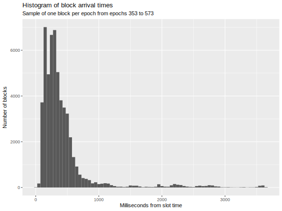 | 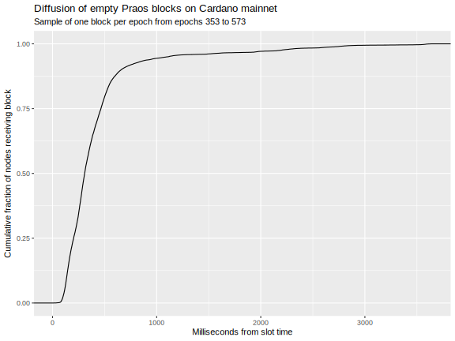 |

### Analysis of block and transaction validation times

We undertook basic analysis of block and transaction validation times for Cardano `mainnet` since Epoch 350.

Findings:

1. The `db-analyser` tool can be used to measure the Cardno block-application time, either including or not including verifying transaction signatures and running Plutus scripts.
2. The output of this tool is quite noisy and does not include enough of the explanatory variable for predicting CPU times for transactions or blocks.
3. The missing explanatory variables (size of UTxO set, number of inputs, number of outputs, etc.) can be extracted from the ledger or `cardano-db-sync`.
5. The noise in the data and the uncertainty in predictions make the above values unsuitable for estimating individual transactions but suitable for bulk estimates of many blocks.
6. A more sophisticated double general linear model could be used to generate artificial transaction workloads.

| Metric          | Median CPU [ms/tx] | Median CPU [ms/kB] |
| --------------- | -----------------: | -----------------: |
| Apply           |         0.51383333 |          0.2525710 |
| Reapply         |         0.06753333 |          0.0376423 |
| Apply - Reapply |         0.42842308 |          0.2115483 |

|                                                                                                       |                                                                                                |
| ----------------------------------------------------------------------------------------------------- | ---------------------------------------------------------------------------------------------- |
|  |  |

Below are listed the linear models suggested for use in the Leios simulators. Note that some of these fits are inadequate due to the highly noisy raw data from `db-analyser`. See [the Jupyter notebook](../analysis/timings/preliminary.ipynb) for details.

#### Linear model for `Apply` operation

##### Without explicitly accounting for Plutus

```console
lm(formula = `Apply CPU [ms]`/`Tx count` ~ 1, data = timings[`Tx count` > 0 & `Apply CPU [ms]` <= timeLimit])

Residuals:
   Min     1Q Median     3Q    Max 
-0.539 -0.240 -0.101  0.114 31.807 

Coefficients:
            Estimate Std. Error t value Pr(>|t|)    
(Intercept) 0.620105   0.000201    3084   <2e-16 ***
---
Signif. codes:  0 ‘***’ 0.001 ‘**’ 0.01 ‘*’ 0.05 ‘.’ 0.1 ‘ ’ 1

Residual standard error: 0.4189 on 4342018 degrees of freedom
```

##### Explicitly accounting for Plutus

```console
lm(formula = `Apply CPU [ms]` ~ 0 + `Tx count` + `Tx exec [step]`, data = timings[`Tx count` > 0 & `Apply CPU [ms]` <= timeLimit])

Residuals:
    Min      1Q  Median      3Q     Max 
-54.793  -0.366   0.428   1.682  31.886 

Coefficients:
                  Estimate Std. Error t value Pr(>|t|)    
`Tx count`       2.624e-01  1.318e-04    1991   <2e-16 ***
`Tx exec [step]` 9.487e-10  5.400e-13    1757   <2e-16 ***
---
Signif. codes:  0 ‘***’ 0.001 ‘**’ 0.01 ‘*’ 0.05 ‘.’ 0.1 ‘ ’ 1

Residual standard error: 3.003 on 4342017 degrees of freedom
Multiple R-squared:  0.9077,	Adjusted R-squared:  0.9077 
F-statistic: 2.136e+07 on 2 and 4342017 DF,  p-value: < 2.2e-16
```

#### Linear model for `Reapply` operation

> [!WARNING]
> 
> The linear models below have poor predictive power, but they may be adequate when used in the aggregate for many blocks or transactions. In spite of this, they are consistent with the 50th percentile of the quantile regressions discussed at the end of this section.

##### Without explicitly accounting for Plutus

```console
lm(formula = `Reapply CPU [ms]` ~ `Tx size [kB]`, data = timings[`Tx count` > 0 & `Apply CPU [ms]` <= timeLimit])

Residuals:
    Min      1Q  Median      3Q     Max 
  -2.00   -0.31   -0.13    0.10 1505.28 

Coefficients:
                Estimate Std. Error t value Pr(>|t|)    
(Intercept)    3.539e-01  3.181e-03   111.2   <2e-16 ***
`Tx size [kB]` 2.151e-02  7.451e-05   288.7   <2e-16 ***
---
Signif. codes:  0 ‘***’ 0.001 ‘**’ 0.01 ‘*’ 0.05 ‘.’ 0.1 ‘ ’ 1

Residual standard error: 4.449 on 4342017 degrees of freedom
Multiple R-squared:  0.01883,	Adjusted R-squared:  0.01883 
F-statistic: 8.335e+04 on 1 and 4342017 DF,  p-value: < 2.2e-16
```

##### Explicitly accounting for Plutus

```console
lm(formula = `Reapply CPU [ms]` ~ `Tx size [kB]` + `Tx exec [step]`, data = timings[`Tx count` > 0 & `Apply CPU [ms]` <= timeLimit])

Residuals:
    Min      1Q  Median      3Q     Max 
  -2.03   -0.30   -0.12    0.10 1505.17 

Coefficients:
                  Estimate Std. Error t value Pr(>|t|)    
(Intercept)      3.478e-01  3.195e-03  108.87   <2e-16 ***
`Tx size [kB]`   1.943e-02  1.256e-04  154.71   <2e-16 ***
`Tx exec [step]` 2.127e-11  1.033e-12   20.59   <2e-16 ***
---
Signif. codes:  0 ‘***’ 0.001 ‘**’ 0.01 ‘*’ 0.05 ‘.’ 0.1 ‘ ’ 1

Residual standard error: 4.449 on 4342016 degrees of freedom
Multiple R-squared:  0.01893,	Adjusted R-squared:  0.01893 
F-statistic: 4.189e+04 on 2 and 4342016 DF,  p-value: < 2.2e-16
```

#### Quantile regressions

Because of the noisy `db-analyser` data, quantile regressions may be more reliable than linear models. Note that these are block-level regressions and that the models are formulated to be suitable for input into the Rust and Haskell simulators for Leios.

| Dependent variable | Quantile |  Intercept | Coefficient of transaction count | Coefficient of block size | Coefficient of Plutus steps |
| ------------------ | -------: | ---------: | -------------------------------: | ------------------------: | --------------------------: |
| `Apply`            |   50%ile |        n/a |                    0.24251 ms/tx |                       n/a |            1.12254 ms/Gstep |
|                    |   95%ile |        n/a |                    0.37999 ms/tx |                       n/a |            2.11951 ms/Gstep |
|                    |   99%ile |        n/a |                    0.51931 ms/tx |                       n/a |            2.82245 ms/Gstep |
| `Reapply`          |   50%ile | 0.29582 ms |                              n/a |             0.01523 ms/kB |            0.03342 ms/Gstep |
|                    |   95%ile | 1.07420 ms |                              n/a |             0.03114 ms/kB |            0.06664 ms/Gstep |
|                    |   99%ile | 1.40127 ms |                              n/a |             0.05503 ms/kB |            0.00512 ms/Gstep |

The aforementioned Jupyter notebook details these. For illustrative purposes, example predictions are given below.

| Tx count | Tx size [kB] | Tx exec [Gstep] | 50%ile of `Apply` [ms] | 95%ile of `Apply` [ms] | 99%ile of `Apply` [ms] | 50%ile of `Reapply` [ms] | 95%ile of `Reapply` [ms] | 99%ile of `Reapply` [ms] |
| -------: | -----------: | --------------: | ---------------------: | ---------------------: | ---------------------: | -----------------------: | -----------------------: | -----------------------: |
|     8000 |        12000 |               0 |               1940.058 |               3039.944 |               4154.505 |                 183.0863 |                 374.7629 |                 661.7723 |
|     8000 |        12000 |              20 |               1962.509 |               3082.334 |               4210.954 |                 183.7547 |                 376.0958 |                 661.8747 |
|     8000 |        12000 |            2000 |               4185.128 |               7278.955 |               9799.408 |                 249.9268 |                 508.0527 |                 672.0193 |

## Analytic studies

### Throughput efficiency of Linear Leios

The Linear Leios variant's formulation is straightforward enough that its probability of including a certified EB on chain can be computed analytically.

Let $f$ be the active slot coefficient for Praos. By definition, this is the probability that at least one RB is created in a given slot.

Let $p_\text{cert}$ be the probability that a new Praos block contains an certificate for the EB referenced in the previous block. Linear Leios requires that a certificate may only be included in an RB if the previous $L_\text{vote} + L_\text{diff}$ slots did not contain an RB. Assuming that all nodes are following the same fork, this implies

$$
p_\text{cert} = (1 - f) ^ {(L_\text{vote} + L_\text{diff})} .
$$

Let $\rho$ be the ratio of the maximum size of an EB to the maximum size of an RB. Also let $\digamma$ be the ratio of Leios throughput to Praos throughput. One computes this as

$$
\digamma = (1 - p_\text{cert}) + p_\text{cert} \cdot (1 + \rho) = 1 + \rho \cdot (1 - f) ^ {(L_\text{vote} + L_\text{diff})}
$$

We define *throughput efficiency* as the ratio of the size of RBs and RB-certified EBs all divided by the size of all RBs and EBs.

$$
\varepsilon = \frac{1 + \rho \cdot (1 - f) ^ {(L_\text{vote} + L_\text{diff})}}{1 + \rho}
$$

The plots below show the _throughput_ (defined as the size of the RBs and of the RB-certified EBs) relative to Praos (left) and the _throughput efficiency_ (defined as the size of the RBs and of the RB-certified EBs, divided by the size of all RBs and of all EBs). Recall that not all EBs have their certificates appear in Praos blocks. Any inefficiency affects throughput and network costs but not permanent-storage costs. These results show that Linear Leios could achieve approximately 500 times the throughput of Praos at an over 50% efficiency in use of network resources. (That 500 times the throughput of Praos would exceed 1000 historically typical transactions per second.)

|                                                                               |                                                                                          |
| ----------------------------------------------------------------------------- | ---------------------------------------------------------------------------------------- |
| 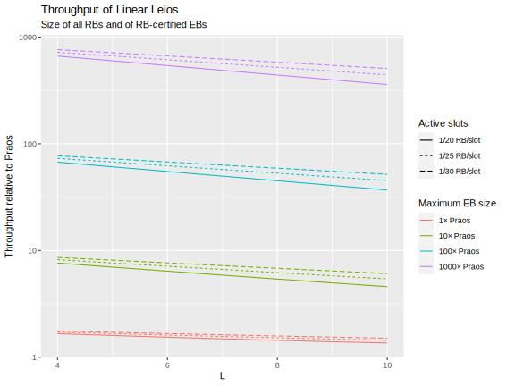 |  |

### Performance analysis of sharding

The Jupyter notebook [analysis/shard-performance.ipynb](../analysis/shard-performance.ipynb) presents computations that elucidate the relation between the fraction of shards without an IB vs the expected number of extra IBs for the shard, for the simplest sharding scheme.


### Overcollateralization scheme

We computed shardless overcollateratization where transactions are randomly sampled from the memory pool and nodes operate independently over the concurrency period.

#### Formulation

##### Variables

- $f_\text{IB}$: production rate for IBs, per slot
- $\kappa$: duration of concurrency period, measured in slots
- $B$: maximum number of transactions allowed in an IB
- $M$: maximum number of transactions in the *active* memory pool
- $\beta = B / M$: probability of a transaction being selected for a particular IB
- $f_\text{TX} = B \cdot f_\text{IB}$: nominal transaction throughtput, per slot
- $\tau_\text{mp} = M \, / \, f_\text{TX} = (\beta \cdot f_\text{IB})^{-1}$: nominal residence time for transactions in active memory pool

##### Assumptions

Note that the *active* portion of the memory pool is the transactions eligible for immediate inclusion in IBs. There may be inactive parts of the memory pool, queues, etc., but they aren't of concern here. The active memory pool will provide backpressure on its upstream feeders.

For simplicity, we assume that a node will note be elected to build more than a single block during the concurrency period. (Presumably, the same node would never put a particular transaction in more than one IB.) Given the number of stakepools and stake distribution on Cardano `mainnet`, this is an accurate assumption. This assumption could be removed from a Delta QSD analysis or a Markov-chain simulations.

##### Probabilities

###### Waiting time for a transaction to reach its first IB

The probability of the transaction being one of the $B$ transactions selected from the $M$ transactions in an IB is as follows.

$$
\left. {M - 1 \choose B} \middle/ {M \choose B} \right. = B / M = \beta
$$

IBs are created at the rate $f_\text{IB}$ and the transaction has a probability $\beta$ of being in each. Sortition occurs for each unit of stake, so we have the probability per slot of a transaction being included in at least one IB as $g_\text{TX} = 1 - e^{- \beta \cdot f_\text{IB}} = 1 - e^{- 1 / \tau_\text{mp}}$ and the waiting time as negative binomially distributed.

$$
p_\text{wait}(s) := \mathsf{P}(\text{TX first included in an IB after } s \text{ slots}) = \\
(1 - g_\text{TX})^s \cdot g_\text{TX}
$$

###### Duplicate of a transaction in the same concurrency period

Under the previously stated assumption that the same node does not produce two IBs in the same concurrency period, the transaction-inclusion process follows a binomial distribution in $g_\text{TX}$. The probability the the transaction is not selected at all during the concurrency period is $(1 - g_\text{TX})^\kappa$ and the probability that it is selected exactly once is $\kappa \cdot g_\text{TX} \cdot (1 - g_\text{TX})^{\kappa - 1}$. Thus the probability of at least one duplicate inclusion is as follows.

$$
p_\text{duplicate} := \mathsf{P}(\text{TX included in more than one IB during the concurrency period}) \\
= 1 - ( 1 + (\kappa - 1) \cdot g_\text{TX} ) \cdot (1 - g_\text{TX})^{\kappa - 1}
$$

###### Spatial efficiency

The "spatial efficiency" is the ratio of the number of unique transactions in IBs to the total number of transactions in IBs.

$$
\epsilon_\text{space} = \frac{\kappa \cdot g_\text{TX} \cdot (1 - g_\text{TX})^{\kappa - 1}}{\kappa \cdot g_\text{TX}} = (1 - g_\text{TX})^{\kappa - 1}
$$

###### Conflicting transaction in the same concurrency period

Let $C$ be the number of transactions that in the active memory pool that conflict with a given transaction. Note that those transactions may or may not be mutually conflicting, so the set is not necessarily a clique.

Given that a particular transaction is included during a concurrency period, the probability for conflicting transactions being included in the same concurrency period is binomially distributed with a probability $q_\text{TX} = 1 - (1 - g_\text{TX})^\kappa = 1 - e^{- \kappa \cdot \beta \cdot f_\text{IB}}$ according to the sortition argument.

$$
p_\text{conflicts} := \mathsf{P}(m \text{ conflicting transactions are included in an IB during the concurrency period}) \\
= {C \choose m} \cdot {q_\text{TX}}^m \cdot (1 - q_\text{TX})^{C - m}
$$

The expected number of conflicts is $\mu_\text{conflicts} = C \cdot q_\text{TX} = C \cdot [ 1 - (1 - g_\text{TX})^\kappa ]$ or $\mu_\text{conflicts}\, / \, C = 1 - (1 - g_\text{TX})^\kappa$.

Note that we always have $\mu_\text{conflicts}\, / \, C > p_\text{duplicate}$, which means that conflict is more of a risk than duplication.

###### Overcollateralization

Consider the transaction that has $C$ conflicting transactions in the active memory pool, so $\rho = C \, / \, M$ is the fraction of the memory pool that it conflicts with.

Trivially, the previous result implies the following expression for the expect number of conflicts in IBs during the concurrency period.

$$
\mu_\text{conflicts} = C \cdot [ 1 - (1 - g_\text{TX})^\kappa) ] = \rho \cdot f_\text{TX} \cdot \tau \cdot (1 - e^{- \kappa / \tau_\text{mp}})
$$

#### Numerical exploration

See [analysis/overcollateralization-v1.ipynb](../overcollateralization-v1.ipynb) for details of the numerical results shown below.

| Probability of transaction being included in any IB in a slot | Cumulative probability for waiting time of transaction to be included in an IB | Probability of transaction duplicate in concurrency period |
| ------------------------------------------------------------- | ------------------------------------------------------------------------------ | ---------------------------------------------------------- |
|            |                             |         |

| Spatial efficiency                                  | Probability of conflicting transaction in the same concurrency period | Tradeoff between duplication and conflict           |
| --------------------------------------------------- | --------------------------------------------------------------------- | --------------------------------------------------- |
|  |                    |  |

| Overcollateralization                               |
| --------------------------------------------------- |
|  |

#### Findings

1. Probabilities of duplication and conflicts are minimized when the length of the concurrency period is as short as possible.
2. The probability of conflict is always greater than the probability of duplication.
3. For a given concurrency period, a longer transaction residence time corresponds to a lower probability of duplication or conflict.
4. Spatial efficiency is also greater for longer residence times.
5. The tradeoff between probabilities of duplication and conflict is insensitive to protocol parameters.
6. The expected number of conflicts in IBs scales proportionately with (a) the fraction of conflicting transactions in the memory pool and (b) the transaction throughput, but its dependence upon the transaction residence time is weaker and nonlinear.
7. At a given throughput, reducing the probability of duplicates or conflicts is at odds with reducing the total number of conflicts.
8. The probabilistic computation of number of conflicts is about twenty percent lower than a naive estimate that multiplies the throughput by the concurrency period and the fraction of conflicts in the memory pool.
9. At 100 TPS and with favorable settings of protocol parameters, an overcollateralization factor of nearly 400 is necessary.

### Expected transaction lifecycle

The Jupyter notebook [analysis/blog-figures.ipynb](../analysis/blog-figures.ipynb) estimate the time it takes in Full Short Leios for a transaction to reach the ledger from the memory pool. Additionally, an experimental Delta-QSD expression was created for computing the delay between transaction submission and its referencing by a Praos block: see [analysis/deltaq/tx-lifecycle.ipynb](../analysis/deltaq/tx-lifecycle.ipynb).

|   |   |
|---|---|
|  |  |

Furthermore, the Jupyter notebook [Analysis of transaction lifecycle](../analysis/tx-to-block.ipynb) estimates the delay imposed by each of the seven stages of Full Leios as a transaction moves from memory pool to being referenced by a Praos block.


The plot hints at the following:

1. There seems little advantage to moving to stage lengths less than 10 slots.
2. The number of shards should be kept small enough so that the IB rate per shard is high relative to the stage length.
3. Low EB rates result in many orphaned IBs.
4. Realistic parameter settings result in an approximately two-minute delay between transaction submission and its referencing by an RB.

### Leios profitability

Using previously computed infrastructure expenses and "business as usual" assumptions, we have estimated the profitiability of Leios SPOs (hosted either on premium or value cloud providers) as a function of transaction throughput. See [analysis/profitability-leios.ipynb](../analysis/profitability-leios.ipynb) for details.

| Praos | Leios |
|---|---|
|  |  |

### Forecast of mainnet rewards

We have forecast the diminishing rewards that would occur if the current TPS persists. See [analysis/reward-forecast.ipynb](../analysis/reward-forecast.ipynb) for methods and details.

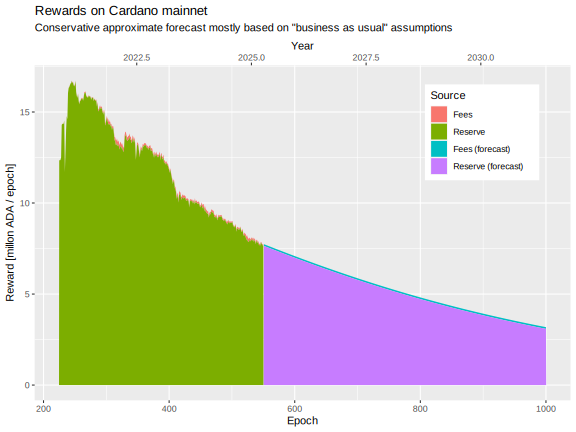

## Miscellaneous observations

### Conflicts, ledger, and incentives

Here are a few observations, reflections, and conclusions on transaction conflicts, ledger design, memory pool, and fees/incentives.

1. Honest duplicate and conflicting transactions will be present in IBs so long as local sortition is used for the IB lottery.
    - The concurrency period/window for IB production is the fundamental limit on avoiding the inclusion of duplicates and conflicts in IBs.
    - Memory pool rules can minimize duplicates/conflicts by having nodes act promptly to remove conflicting transactions from their local memory pool as soon as the receive a new IB.
    - For a given level of throughput, producing fewer but larger IBs will reduce the probability of duplicates because fewer IB producers are active during each others' "light cones". However, at some point enlarging IBs will lengthen the concurrency "blind spot": for a given throughput.
    - We have previously shown how reducing the probability of two IBs being produced in the same slot will increase the probability that no IB at all is produced in the slot.
    - Public (global) sortition would open IB producers to denial of service attacks.
2. So long as there is no collateral required for failed conflicting transactions, adversaries' only disincentive to reduce overall throughput would be their own infrastructure costs.
    - Successful attack would require lightweight custom adversarial nodes, many network connections to honest nodes, and sophisticated networking. A significant and sustained attack would be costly, and inefficient attacks might hardly be noticed.
    - Block producers are best compensated for the resources used by conflicting transactions by allocation from the rewards pot.
    - The alternative of charging collateral on a failed transaction is too at odds with Cardano's longstanding guarantees. This would penalize attackers, but honest parties would also lose collateral on occasion.
    - The alternative of charging collateral on successful transactions for any failed conflicting ones in IBs opens too larger an attack surface to intentional, adversarial conflicts.
    - Honest IB producers are naturally incentivized to reduce conflicts because conflicts eat into fees, but this incentive could be amplified by adding a "conflict penalty" to the rewards computation.
3. The memory pool is fundamentally untrusted with respect to conflicting transactions.
    - An adversary would be able to thwart or abuse conflict-avoidance schemes at the memory pool level.
    - Some common-sense optimizations are possible, such as blacklisting a node that supplies transactions obviously in conflict.
4. Persistent storage of duplicate and conflicting transactions could be reduced through clever editing at the time of EB voting/certification.
    - All parties voting on an EB are aware of the duplicate and conflict set among the transactions referenced by the IB.
    - The EB could include a bitmap of which transactions are valid and which can be discarded, and voter would vote on the bitmap.
    - Cryptographically speaking, IBs can organize transactions in a manner where items can be deleted without affecting the signature of the IB. (For example, transactions can be discarded from the IB according to the bitmap and replaced with just the hash of what was deleted.)
5. It appears that front running can best be eliminated (at the ledger level, but not at the mempool level) by strictly ordering transactions by their IB's slot and VRF.
    - Other IB and EB ordering proposals create complexity in the ledger rules and would be difficult to fully analyze for vulnerabilities.

### Catalog of possible conformance tests

The table below catalogs conformance tests in order to assess how much positive and negative test coverage is possible for traces from the Leios simulator and (eventually) from the Leios node.

| Test                                                                                         | Currently<br/>in Agda spec | Potentially<br/>in Agda spec |
| -------------------------------------------------------------------------------------------- | :------------------------: | :--------------------------: |
| Node either produces an IB or declares not                                                   |             ✔              |                              |
| Node either produces and EB or declares not                                                  |             ✔              |                              |
| Node either votes or declares not                                                            |             ✔              |                              |
| Node produces IB iff sortition requires                                                      |             ✘              |              ✔               |
| Node produces EB iff sortition requires                                                      |             ✘              |              ✔               |
| Node produces a maximum of one IB per slot                                                   |           **?**            |                              |
| Node produces a maximum of one EB per stage                                                  |           **?**            |                              |
| Node produces a maximum of one vote per stage                                                |           **?**            |                              |
| Node votes iff sortition requires                                                            |             ✘              |              ✔               |
| Node votes on EB iff it is in the same pipeline as the voting                                |           **?**            |                              |
| Node diffuses non-expired IBs iff not equivocated twice or more                              |           **?**            |                              |
| Node diffuses non-expired EBs iff not equivocated twice or more                              |           **?**            |                              |
| Node does not diffuse expired IBs                                                            |           **?**            |                              |
| Node does not reference expired IBs in EBs                                                   |           **?**            |                              |
| Node does not diffuse expired EBs                                                            |           **?**            |                              |
| Node does not reference expired EBs in EBs                                                   |           **?**            |                              |
| Node does not reference expired EBs in RB certificates                                       |           **?**            |                              |
| Nodes does not reference an IB by a new EB if the IB is known to be referenced by another EB |           **?**            |                              |
| Node's produced EB references the most recent RB known to it                                 |           **?**            |                              |
| Node's produced EB includes IBs from current pipeline iff the IB has arrived in time         |           **?**            |                              |
| Node's produced EB includes IBs from prior pipelines iff the IBs are eligible                |           **?**            |                              |
| Node certifies EB and includes it in RB iff there is a quorum of votes                       |           **?**            |                              |
| Node diffuses IBs in freshest-first order                                                    |           **?**            |                              |
| Node diffuses EBs in freshest-first order                                                    |           **?**            |                              |
| Node diffuses votes in freshest-first order                                                  |           **?**            |                              |
| Node includes txs in IB iff the IB has the correct shard                                     |             ✘              |                              |
| Node does not include txs in IB if it has seen a conflicting tx in an IB                     |             ✘              |                              |

## Other resources

- [First technical report](./technical-report-1.md)
- [Threat model](./threat-model.md)
- [Cost estimate](./cost-estimate/README.md)
- [Draft CIP](./cip/README.md)

---

## Footnotes

[^network-spec]: <https://ouroboros-network.cardano.intersectmbo.org/pdfs/network-spec/network-spec.pdf#chapter.3>

[^network-split]: at the network layer we split an endorse block into header and body, where the latter contains the references to other blocks

[^eb-ib-relayed]: older EBs and IBs referenced by the blockchain can be accessed from the mini protocol

[^subslot]: for IBs/EBs also its subslot, in case generation frequency is greater than $`1/\text{slot}`$.

[^rb-referenced]: Restriction (ii) is to avoid overlap with an RB range query, but could be dropped to save on complexity if not worth the saved bandwidth
