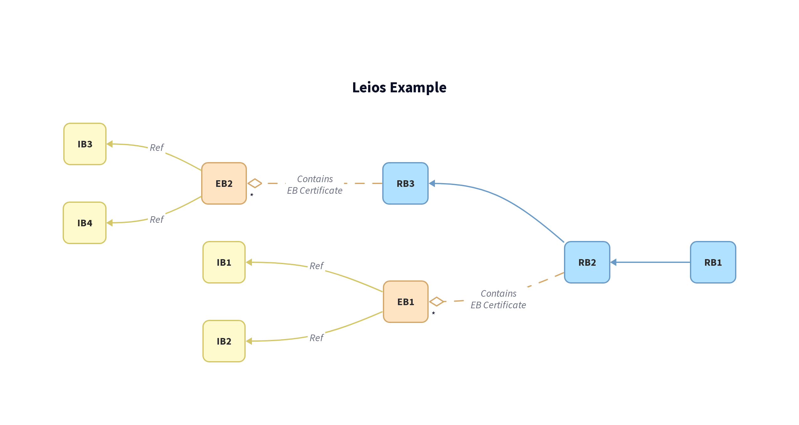

# Leios Diagrams

This directory contains D2 diagrams used to visualize Leios protocol concepts and scenarios.
Read the following if you want to create your own.

## Setup

### Installing D2

D2 is a modern diagram scripting language that turns text to diagrams. Follow these steps to install:

#### macOS
```bash
# Using Homebrew
brew install d2

# Or using curl
curl -fsSL https://d2lang.com/install.sh | sh -s --
```

#### Linux
```bash
curl -fsSL https://d2lang.com/install.sh | sh -s --
```

#### Windows
```bash
# Using Scoop
scoop install d2

# Or download from GitHub releases
# https://github.com/terrastruct/d2/releases
```

### Generating Diagrams

To generate SVG diagrams from the D2 files:

```bash
# Generate a single diagram
d2 leios-example.d2 leios-example.svg

# Generate PNG instead of SVG
d2 leios-example.d2 leios-example.png

# Watch for changes and auto-regenerate
d2 --watch leios-example.d2 leios-example.svg
```

### IDE Integration & Previews

#### VS Code Extension
Install the official D2 extension for syntax highlighting and live preview:
- Search for "D2" in VS Code extensions
- Or install via command: `code --install-extension terrastruct.d2`

#### Live Preview Server
D2 includes a built-in preview server:
```bash
# Start preview server (opens browser automatically)
d2 --watch --port 8080 leios-example.d2

# Preview specific file with custom port
d2 --watch --port 3000 eb-dag.d2
```

#### CLI Options
```bash
# Different output formats
d2 diagram.d2 output.svg    # SVG (default)
d2 diagram.d2 output.png    # PNG
d2 diagram.d2 output.pdf    # PDF

# Themes and styling
d2 --theme=1 diagram.d2     # Dark theme
d2 --sketch diagram.d2      # Hand-drawn style
d2 --center diagram.d2      # Center the diagram

# Layout engines
d2 --layout=elk diagram.d2  # ELK layout engine
d2 --layout=dagre diagram.d2 # Dagre layout engine
```

## Create Your Own

Use [`leios-example.d2`](leios-example.d2) as a template for creating new scenarios:

### 1. Copy the Template
```bash
cp leios-example.d2 my-scenario.d2
```

### 2. Modify Elements
The template includes:
- **Ranking Blocks (RBs)**: `RB1`, `RB2`, `RB3` with class `rb`
- **Endorsement Blocks (EBs)**: `EB1`, `EB2` with class `eb`  
- **Input Blocks (IBs)**: `IB1`, `IB2`, `IB3`, `IB4` with class `ib`

### 3. Available Styles
From `styles.d2`:
- `rb` - Standard ranking block
- `rb_stacked` - Multiple ranking blocks
- `rb_unconfirmed` - Unconfirmed ranking block (dashed)
- `eb` - Standard endorsement block
- `eb_unconfirmed` - Unconfirmed endorsement block (dashed)
- `ib` - Standard input block
- `ib_stacked` - Multiple input blocks
- `ib_unconfirmed` - Unconfirmed input block (dashed)

### 4. Connection Types
- `to_rb_arrow` - Blue arrows for RB connections
- `to_eb_arrow` - Orange arrows for EB connections  
- `to_ib_arrow` - Yellow arrows for IB connections
- `ledger_link` - Green links for ledger references
- `eb_cert` - Dashed diamond arrows for EB certificates

### 5. Example Modifications

#### Adding more blocks:
```d2
RB4: {
  class: rb
  label: "RB4"
}

# Connect to chain
RB3 -> RB4: {
  class: to_rb_arrow
}
```

#### Creating unconfirmed blocks:
```d2
EB3: {
  class: eb_unconfirmed
  label: "EB3\n(Unconfirmed)"
}
```

#### Adding containers for complex scenarios:
```d2
pipeline_a: {
  label: "Pipeline A"
  class: container
  
  EB1: {
    class: eb
    label: "EB1"
  }
  
  IB1: {
    class: ib
    label: "IB1"
  }
}
```

## Example Diagram

Here's what the basic Leios example looks like:



## Files

### Style Definitions
- [`styles.d2`](styles.d2) - Shared style definitions for all diagrams

### Workshop Examples
- [`leios-example.d2`](leios-example.d2) - Simple example showing basic Leios structure
- [`rb-reference.d2`](rb-reference.d2) - Basic RB reference approach
- [`rb-reference-detailed.d2`](rb-reference-detailed.d2) - Detailed RB reference with EBs
- [`rb-reference-realistic.d2`](rb-reference-realistic.d2) - Realistic RB reference scenarios
- [`eb-reference.d2`](eb-reference.d2) - EB reference approach diagram
- [`eb-chain.d2`](eb-chain.d2) - EB chain approach diagram
- [`eb-dag.d2`](eb-dag.d2) - EB DAG approach diagram
- [`eb-dag-detailed.d2`](eb-dag-detailed.d2) - Detailed EB DAG with IBs

## Tips

1. **Keep it simple**: Start with the basic template and add complexity gradually
2. **Use containers**: Group related elements for better organization
3. **Consistent naming**: Use clear, descriptive labels
4. **Leverage styles**: Use the predefined classes for consistency
5. **Test frequently**: Use `--watch` flag to see changes in real-time

## Resources

- [D2 Documentation](https://d2lang.com/)
- [D2 Playground](https://play.d2lang.com/)