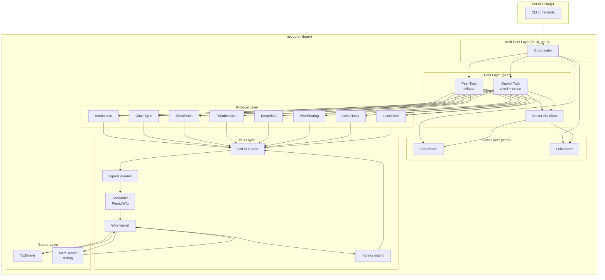

# net-rs

Rust implementation of the Cardano node-to-node (N2N) network stack, covering both Praos and Leios (CIP-0164) protocols. Built for network prototyping, simulation, adversarial testing, and as a reference design for node implementors.

## Features

**Full Praos protocol suite** — all six N2N mini-protocols with state machines, CBOR codecs, and both client and server sides:
- Handshake (version negotiation)
- ChainSync (follow chain tip, find intersections)
- BlockFetch (request and stream block ranges)
- TxSubmission (pull-based transaction dissemination)
- KeepAlive (ping/pong liveness)
- PeerSharing (peer discovery)

**Leios extensions (CIP-0164)** — two additional protocols for the Leios upgrade:
- LeiosNotify (protocol ID 18) — endorser block, vote, and TX announcements
- LeiosFetch (protocol ID 19) — data retrieval with bitmap-based selective TX addressing

**Multiplexer with QoS** — all protocols share a single TCP connection via a multiplexer with:
- Two-class PriorityWfq scheduling (Praos priority class, Leios weighted fair queuing)
- Per-protocol egress queues with backpressure
- Non-blocking demuxer (`try_send`) to prevent cross-protocol stalling
- Configurable SDU size (default 12,288 bytes per Cardano spec)

**Multi-peer coordinator** — aggregates multiple peer connections with:
- Three connection modes: InitiatorOnly, ResponderOnly, Duplex
- Tip deduplication and smart block fetch routing
- Leios offer dedup (slot-bounded seen sets) and RTT-based fetch peer selection
- Accept loop for inbound connections
- Exponential-backoff reconnection for outbound peers

**Test node** — configurable Leios-capable node for local network simulation:
- VRF-based block production (stake-weighted lottery ported from sim-rs)
- Longest-chain consensus with configurable fake validation delays
- Leios RB/EB/vote production at stage boundaries
- Per-peer network delay injection for topology simulation
- Telemetry: sim-rs-compatible JSONL events, per-peer bandwidth tracking, HTTP + file sinks
- TOML config with layering (base + per-node overlays + CLI overrides)
- Fork-aware chain tree for tracking and visualizing competing branches

**Cluster orchestrator** — spawn and manage multi-node test networks:
- Auto-generated random topology with configurable degree and edge delays
- Stake distribution (equal, weighted, or zipf)
- HTTP telemetry aggregation from all nodes
- Time-ordered event merge with watermark flushing to JSONL
- Per-node log capture

**Web UI** — real-time cluster visualization (React + Vite):
- Force-directed topology graph with per-node status
- Chain tree view showing forks and block propagation
- Aggregate charts (block rates, bandwidth, latency)
- Event log with collapsible overlay
- Inspector panel for node/edge details

**[Security hardened](docs/security-audit.md)** — allocation bounds on all wire-read lengths, buffer caps, timeouts on all remote waits, clean error propagation, no panics in library code.

**406 tests** — unit tests, codec round-trips, protocol state machines, integration tests with in-memory bearers, and test vectors captured from the live Cardano mainnet.

## Architecture



## Workspace Structure

```
net-rs/
├── net-core/          # Library crate — all protocol logic
│   └── src/
│       ├── bearer/      # Transport trait + TCP/memory implementations
│       ├── mux/         # Multiplexer: wire format, egress, ingress, scheduler, codec
│       ├── types/       # Shared Cardano types (Point, Tip, Header, Block)
│       ├── protocols/   # All 8 mini-protocols (state machines + CBOR)
│       ├── store/       # Shared data stores (ChainStore, LeiosStore)
│       ├── peer/        # Per-peer tasks (initiator, duplex), server handlers
│       └── multi_peer/  # Multi-peer coordinator, application interface
├── net-cli/           # Binary crate — CLI tool for testing and demos
│   └── src/           # Subcommands: handshake, follow, serve, submit, ...
├── net-node/          # Binary crate — configurable test node
│   ├── configs/       # Sample TOML configs (mainnet base + node overlays)
│   └── src/           # Node logic: config, clock, production, consensus, telemetry
├── net-cluster/       # Binary crate — cluster orchestrator
│   ├── configs/       # Sample cluster TOML configs
│   └── src/           # Topology generation, process management, event aggregation
├── net-ui/            # Web UI — real-time cluster visualization (React + Vite)
│   └── src/           # Topology graph, chain tree, charts, event log
├── docs/              # Protocol references and implementation notes
└── plans/             # Design documents
```

See individual crate READMEs for detailed documentation:
- **[net-core](net-core/)** — library API, module structure, protocol state machines with Mermaid diagrams and agency tables
- **[net-cli](net-cli/)** — CLI commands and usage examples
- **[net-node](net-node/)** — configurable test node for local network simulation
- **[net-cluster](net-cluster/)** — cluster orchestrator for multi-node test networks
- **[net-ui](net-ui/)** — real-time web UI for cluster visualization

## Building

Requires stable Rust (no nightly features).

```sh
cargo build            # build all crates
cargo test             # run all 406 tests
cargo clippy           # lint
cargo fmt --check      # format check
```

## CLI Usage

The `net-cli` binary provides subcommands for testing against live nodes and local simulation.

### Live network

```sh
# Handshake with a mainnet relay
cargo run -p net-cli -- handshake backbone.cardano.iog.io:3001

# Follow chain tip from multiple peers
cargo run -p net-cli -- multi-follow \
  --host backbone.cardano.iog.io:3001 \
  --host backbone.cardano.iog.io:3001

# Request peers via PeerSharing
cargo run -p net-cli -- peer-share cardano-main2.everstake.one:3001

# Capture raw bytes for test vectors
cargo run -p net-cli -- capture backbone.cardano.iog.io:3001
```

### Local simulation

```sh
# Start a fake node generating Poisson blocks
cargo run -p net-cli -- serve --port 9999 --block-rate 0.05

# Follow it (separate terminal)
cargo run -p net-cli -- follow 127.0.0.1:9999

# Submit synthetic transactions
cargo run -p net-cli -- submit 127.0.0.1:9999 --tx-rate 2.0

# Relay mode: upstream mainnet, local downstream
cargo run -p net-cli -- multi-follow \
  --host backbone.cardano.iog.io:3001 \
  --listen 0.0.0.0:8888
```

### Leios simulation

```sh
# Fake server with Leios EB/vote generation
cargo run -p net-cli -- serve --port 9999 --block-rate 0.5 --leios

# Follow with Leios notifications
cargo run -p net-cli -- multi-follow --host 127.0.0.1:9999 --leios

# Multi-peer Leios with dedup logging
RUST_LOG=debug cargo run -p net-cli -- multi-follow \
  --host 127.0.0.1:9999 \
  --host 127.0.0.1:9999 \
  --leios
```

### Test node

The `net-node` binary is a configurable test node for local network simulation. It uses TOML config files layered left-to-right.

```sh
# Two-node test network (run in separate terminals):
RUST_LOG=info cargo run -p net-node -- \
  --config net-node/configs/mainnet.toml \
  --config net-node/configs/node0.toml

RUST_LOG=info cargo run -p net-node -- \
  --config net-node/configs/mainnet.toml \
  --config net-node/configs/node1.toml

# Override individual values:
cargo run -p net-node -- \
  --config net-node/configs/mainnet.toml \
  --config net-node/configs/node0.toml \
  --set slot_duration_ms=200
```

Both nodes produce blocks (500 stake each out of 1000 total), exchange them via ChainSync, and generate Leios EBs/votes at stage boundaries. Node 1 has a 50ms simulated delay on events from node 0.

Telemetry output (`node0-events.jsonl`) uses sim-rs-compatible JSONL format:

```json
{"time_s":62969194.0,"message":{"type":"RBGenerated","node":"node-0","slot":125938388,"size_bytes":401}}
{"time_s":62969194.5,"message":{"type":"EBGenerated","node":"node-0","slot":125938390}}
```

Periodic stats (logged and/or POSTed to HTTP endpoint) include per-peer bandwidth:

```
periodic stats node=node-0 slot=100 tip=Some(50) produced=5 received=45 peers=1
  peer stats peer=peer-0 address=127.0.0.1:30001 mode=Duplex rtt_ms=None delay_ms=0 sent=1024 received=2048
```

See `net-node/configs/` for the full config schema with comments.

### Scheduler selection

The `serve`, `follow`, and `multi-follow` commands accept `--scheduler` and `--protocol-priority`:

```sh
# Use strict-priority scheduler (hardwired tiers, can starve Leios)
cargo run -p net-cli -- serve --port 9999 --scheduler strict-priority

# Use PriorityWfq (default) with custom Leios weights
cargo run -p net-cli -- multi-follow --host 127.0.0.1:9999 --leios \
  --protocol-priority 18,3 --protocol-priority 19,1

# Move PeerSharing to Priority class
cargo run -p net-cli -- follow 127.0.0.1:9999 --protocol-priority 10,P
```

Schedulers: `priority-wfq` (default), `strict-priority`, `round-robin`. Case-insensitive.

Traffic class overrides: `<protocol-id>,P` for Priority class, `<protocol-id>,<weight>` for Default class with the given WFQ weight.

## Dependencies

Minimal and C-free:

| Crate | Purpose |
|-------|---------|
| `tokio` | Async runtime, networking, channels |
| `minicbor` | CBOR encoding/decoding |
| `bytes` | Zero-copy byte buffers |
| `byteorder` | Wire format integer encoding |
| `thiserror` | Error type derivation |
| `tracing` | Structured logging |
| `blake2b_simd` | Blake2b-256 block header hashing |
| `clap` | CLI argument parsing (net-cli, net-node, net-cluster) |
| `rand` | Synthetic data generation, topology generation |
| `figment` | Config layering with TOML (net-node, net-cluster) |
| `serde` / `serde_json` | Serialization for config and telemetry |
| `reqwest` | HTTP client for telemetry posting (net-node) |
| `axum` | HTTP server for telemetry collection (net-cluster) |

## Future Work

- **QUIC / Unix socket transports** — bearer trait is ready, implementations deferred
- **Coordinator `try_send`** — event loop currently uses `.send().await` which can block if a consumer stalls
- **Freshest-first fetch** — prefer newest blocks when multiple are available
- **Real cryptographic validation** — headers are parsed but signatures are not verified
- **N2C (node-to-client) protocols** — currently N2N only

## References

- [Cardano network spec (Praos)](https://ouroboros-network.cardano.intersectmbo.org/pdfs/network-spec/network-spec.pdf)
- [Cardano blueprint](https://cardano-scaling.github.io/cardano-blueprint/network/index.html)
- [CIP-0164 Leios spec](https://cips.cardano.org/cip/CIP-0164#network)
- [ouroboros-network (Haskell)](https://github.com/IntersectMBO/ouroboros-network)