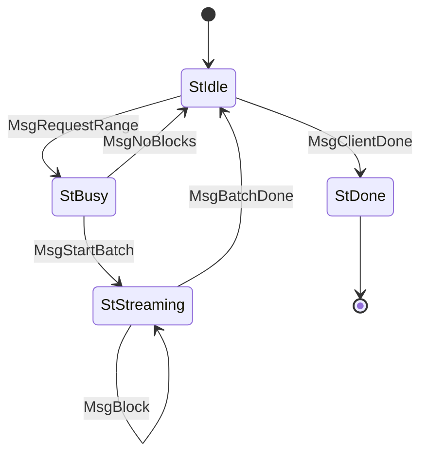

# BlockFetch (Protocol ID 3)

Fetch blocks by range. Client requests a point range (from, to); server streams blocks one at a time. Supports pipelining — client can request multiple ranges before consuming results.

## Files

| File | Description |
|------|-------------|
| `mod.rs` | State machine (`State`, `Message`), `Protocol` impl, client helper |
| `codec.rs` | CBOR encode/decode for BlockFetch messages |

## State Machine

## Agency Table

| State | Agency | Message | Next State |
|-------|--------|---------|------------|
| StIdle | **Client** | MsgRequestRange(from, to) | StBusy |
| StIdle | **Client** | MsgClientDone | StDone |
| StBusy | **Server** | MsgStartBatch | StStreaming |
| StBusy | **Server** | MsgNoBlocks | StIdle |
| StStreaming | **Server** | MsgBlock(block) | StStreaming |
| StStreaming | **Server** | MsgBatchDone | StIdle |
| StDone | Nobody | — | — |

## Limits

- **Max message size**: 65,535 bytes (idle/busy), 2,500,000 bytes (streaming)
- **Ingress limit**: 230,686,940 bytes
- **Timeouts**: busy 60s, streaming 60s

## Client Helper

- `receive_block(runner) -> Result<Option<BlockBody>>` — receive next block in batch, `None` on batch done
